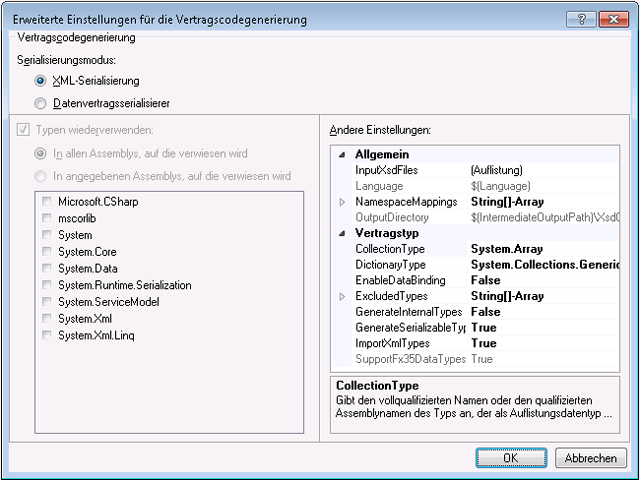

# <a name="contract-first-tool"></a><span data-ttu-id="dc7b3-102">Vertrag zuerst-Tool</span><span class="sxs-lookup"><span data-stu-id="dc7b3-102">Contract-First Tool</span></span>
<span data-ttu-id="dc7b3-103">Dienstverträge müssen häufig aus vorhandenen Diensten erstellt werden.</span><span class="sxs-lookup"><span data-stu-id="dc7b3-103">Service contracts often need to be created from existing services.</span></span> <span data-ttu-id="dc7b3-104">In [!INCLUDE[net_v45](../../../includes/net-v45-md.md)] können Datenvertragsklassen mithilfe des Vertrag zuerst-Tools automatisch aus vorhandenen Diensten erstellt werden.</span><span class="sxs-lookup"><span data-stu-id="dc7b3-104">In [!INCLUDE[net_v45](../../../includes/net-v45-md.md)], data contract classes can be created automatically from existing services using the contract-first tool.</span></span> <span data-ttu-id="dc7b3-105">Zum Verwenden des Vertrag zuerst-Tools muss die XSD (XML Schema Definition)-Datei lokal heruntergeladen werden. Das Tool kann keine Remotedatenverträge per HTTP importieren.</span><span class="sxs-lookup"><span data-stu-id="dc7b3-105">To use the contract-first tool, the XML schema definition file (XSD) must be downloaded locally; the tool cannot import remote data contracts via HTTP.</span></span>  
  
 <span data-ttu-id="dc7b3-106">Das Vertrag zuerst-Tool ist als Buildaufgabe in [!INCLUDE[vs_current_long](../../../includes/vs-current-long-md.md)] integriert.</span><span class="sxs-lookup"><span data-stu-id="dc7b3-106">The contract-first tool is integrated into [!INCLUDE[vs_current_long](../../../includes/vs-current-long-md.md)] as a build task.</span></span> <span data-ttu-id="dc7b3-107">Die von der Buildaufgabe generierten Codedateien werden bei jeder Projekterstellung erzeugt, sodass das Projekt einfach Änderungen im zugrunde liegenden Dienstvertrag übernehmen kann.</span><span class="sxs-lookup"><span data-stu-id="dc7b3-107">The code files generated by the build task are created every time the project is built, so that the project can easily adopt changes in the underlying service contract.</span></span>  
  
 <span data-ttu-id="dc7b3-108">Folgende Schematypen können vom Vertrag zuerst-Tool importiert werden:</span><span class="sxs-lookup"><span data-stu-id="dc7b3-108">Schema types that the contract-first tool can import include the following:</span></span>  
  
```xml  
<xsd:complexType>  
<xsd:simpleType>  
```  
  
 <span data-ttu-id="dc7b3-109">Einfache Typen werden nicht generiert, wenn es sich um primitive Typen, z. B. `Int16` oder `String`, handelt. Komplexe Typen werden nicht generiert, wenn sie vom Typ `Collection` sind.</span><span class="sxs-lookup"><span data-stu-id="dc7b3-109">Simple types will not be generated if they are primitives such as `Int16` or `String`; complex types will not be generated if they are of type `Collection`.</span></span> <span data-ttu-id="dc7b3-110">Typen werden ebenfalls nicht generiert, wenn sie Teil eines anderen `xsd:complexType` sind.</span><span class="sxs-lookup"><span data-stu-id="dc7b3-110">Types will also not be generated if they are part of another `xsd:complexType`.</span></span> <span data-ttu-id="dc7b3-111">In allen diesen Fällen werden stattdessen Verweise dieser Typen auf im Projekt vorhandene Typen verwendet.</span><span class="sxs-lookup"><span data-stu-id="dc7b3-111">In all these cases, the types will be referenced to existing types in the project instead.</span></span>  
  
## <a name="adding-a-data-contract-to-a-project"></a><span data-ttu-id="dc7b3-112">Hinzufügen eines Datenvertrags zu einem Projekt</span><span class="sxs-lookup"><span data-stu-id="dc7b3-112">Adding a data contract to a project</span></span>  
 <span data-ttu-id="dc7b3-113">Bevor das Vertrag zuerst-Tool verwendet werden kann, muss dem Projekt der Dienstvertrag (XSD) hinzugefügt werden.</span><span class="sxs-lookup"><span data-stu-id="dc7b3-113">Before the contract-first tool can be used, the service contract (XSD) must be added to the project.</span></span> <span data-ttu-id="dc7b3-114">In dieser Übersicht wird zum Veranschaulichen von Vertrag zuerst-Funktionen der folgende Vertrag verwendet.</span><span class="sxs-lookup"><span data-stu-id="dc7b3-114">For the purposes of this overview, the following contract will be used to illustrate contract-first functions.</span></span> <span data-ttu-id="dc7b3-115">Diese Dienstdefinition ist eine kleine Teilmenge des Dienstvertrags, der von der Such-API von Bing verwendet wird.</span><span class="sxs-lookup"><span data-stu-id="dc7b3-115">This service definition is a small subset of the service contract used by Bing’s search API.</span></span>  
  
```xml  
<?xml version="1.0" encoding="utf-8"?>  
<xs:schema id="ServiceSchema"  
    targetNamespace="http://tempuri.org/ServiceSchema.xsd"  
    elementFormDefault="qualified"  
    xmlns="http://tempuri.org/ServiceSchema.xsd"  
    xmlns:mstns="http://tempuri.org/ServiceSchema.xsd"  
    xmlns:xs="http://www.w3.org/2001/XMLSchema"  
>  
  <xs:complexType name="SearchRequest">  
    <xs:sequence>  
      <xs:element minOccurs="0" maxOccurs="1" name="Version" type="xs:string" default="2.2" />  
      <xs:element minOccurs="0" maxOccurs="1" name="Market" type="xs:string" />  
      <xs:element minOccurs="0" maxOccurs="1" name="UILanguage" type="xs:string" />  
      <xs:element minOccurs="1" maxOccurs="1" name="Query" type="xs:string" />  
      <xs:element minOccurs="1" maxOccurs="1" name="AppId" type="xs:string" />  
      <xs:element minOccurs="0" maxOccurs="1" name="Latitude" type="xs:double" />  
      <xs:element minOccurs="0" maxOccurs="1" name="Longitude" type="xs:double" />  
      <xs:element minOccurs="0" maxOccurs="1" name="Radius" type="xs:double" />  
    </xs:sequence>  
  </xs:complexType>  
  <xs:simpleType name="WebSearchOption">  
    <xs:restriction base="xs:string">  
      <xs:enumeration value="DisableHostCollapsing" />  
      <xs:enumeration value="DisableQueryAlterations" />  
    </xs:restriction>  
  </xs:simpleType>  
</xs:schema>  
```  
  
 <span data-ttu-id="dc7b3-116">Um dem Projekt den obigen Dienstvertrag hinzufügen, mit der rechten Maustaste des Projekts, und wählen Sie **neue hinzufügen...** .</span><span class="sxs-lookup"><span data-stu-id="dc7b3-116">To add the above service contract to the project, right-click the project and select **Add New…**.</span></span> <span data-ttu-id="dc7b3-117">Wählen Sie im WCF-Bereich des Dialogfelds Vorlagen die Schemadefinition aus, und benennen Sie die neue Datei mit SampleContract.xsd.</span><span class="sxs-lookup"><span data-stu-id="dc7b3-117">Select Schema Definition from the WCF pane of the Templates dialog, and name the new file SampleContract.xsd.</span></span> <span data-ttu-id="dc7b3-118">Kopieren Sie den obigen Code, und fügen Sie ihn in die Codeansicht der neuen Datei ein.</span><span class="sxs-lookup"><span data-stu-id="dc7b3-118">Copy and paste the above code into the code view of the new file.</span></span>  
  
## <a name="configuring-contract-first-options"></a><span data-ttu-id="dc7b3-119">Konfigurieren von Vertrag zuerst-Optionen</span><span class="sxs-lookup"><span data-stu-id="dc7b3-119">Configuring contract-first options</span></span>  
 <span data-ttu-id="dc7b3-120">Vertrag zuerst-Optionen können im Eigenschaftenmenü eines WCF-Projekts konfiguriert werden.</span><span class="sxs-lookup"><span data-stu-id="dc7b3-120">Contract-first options can be configured in the Properties menu of a WCF project.</span></span> <span data-ttu-id="dc7b3-121">Um die Vertrag zuerst-Entwicklung aktivieren möchten, wählen Sie die **XSD als Typdefinitionssprache aktivieren** Kontrollkästchen in der WCF-Seite des Fensters Eigenschaften Projekt.</span><span class="sxs-lookup"><span data-stu-id="dc7b3-121">To enable contract-first development, select the **Enable XSD as Type Definition Language** check box in the WCF page of the project properties window.</span></span>  
  
 <span data-ttu-id="dc7b3-122"></span><span class="sxs-lookup"><span data-stu-id="dc7b3-122"></span></span>  
  
 <span data-ttu-id="dc7b3-123">Um erweiterte Eigenschaften zu konfigurieren, klicken Sie auf die Schaltfläche Erweitert.</span><span class="sxs-lookup"><span data-stu-id="dc7b3-123">To configure advanced properties, click the Advanced button.</span></span>  
  
 <span data-ttu-id="dc7b3-124"></span><span class="sxs-lookup"><span data-stu-id="dc7b3-124"></span></span>  
  
 <span data-ttu-id="dc7b3-125">Die folgenden erweiterten Einstellungen können für die Codegenerierung aus Verträgen konfiguriert werden.</span><span class="sxs-lookup"><span data-stu-id="dc7b3-125">The following advanced settings can be configured for code generation from contracts.</span></span> <span data-ttu-id="dc7b3-126">Die Einstellungen können nur für alle Dateien im Projekt konfiguriert werden. Das Konfigurieren der Einstellungen für einzelne Dateien ist derzeit nicht möglich.</span><span class="sxs-lookup"><span data-stu-id="dc7b3-126">Settings can only be configured for all of the files in the project; settings cannot be configured for individual files at this time.</span></span>  
  
-   <span data-ttu-id="dc7b3-127">**Serialisierungsmodus**: Diese Einstellung legt fest, welches Serialisierungsprogramm zum Lesen von Vertragsdateien verwendet wird.</span><span class="sxs-lookup"><span data-stu-id="dc7b3-127">**Serializer Mode**: This setting determines which serializer is used for reading service contract files.</span></span> <span data-ttu-id="dc7b3-128">Wenn **XML-Serialisierungsprogramm** ausgewählt ist, die **Auflistungstypen** und **Typen wiederverwenden** Optionen sind deaktiviert.</span><span class="sxs-lookup"><span data-stu-id="dc7b3-128">When **XML Serializer** is selected, the **Collection Types** and **Reuse Types** options are disabled.</span></span> <span data-ttu-id="dc7b3-129">Diese Optionen gelten nur für die **Datenvertragsserialisierer**.</span><span class="sxs-lookup"><span data-stu-id="dc7b3-129">These options only apply to the **Data Contract Serializer**.</span></span>  
  
-   <span data-ttu-id="dc7b3-130">**Typen wiederverwenden**: Diese Einstellung gibt an, welche Bibliotheken für die Wiederverwendung von Typen verwendet werden.</span><span class="sxs-lookup"><span data-stu-id="dc7b3-130">**Reuse Types**: This setting specifies which libraries are used for type reuse.</span></span> <span data-ttu-id="dc7b3-131">Diese Einstellung gilt nur, wenn **Serialisierungsmodus** festgelegt ist, um **Datenvertragsserialisierer**.</span><span class="sxs-lookup"><span data-stu-id="dc7b3-131">This setting only applies if **Serializer Mode** is set to **Data Contract Serializer**.</span></span>  
  
-   <span data-ttu-id="dc7b3-132">**"Sammlung"**: Diese Einstellung gibt den vollqualifizierten oder assemblyqualifizierten Typ für den Auflistungsdatentyp verwendet werden soll.</span><span class="sxs-lookup"><span data-stu-id="dc7b3-132">**Collection Type**: This setting specifies the fully-qualified or assembly-qualified type to be used for the collection data type.</span></span> <span data-ttu-id="dc7b3-133">Diese Einstellung gilt nur, wenn **Serialisierungsmodus** festgelegt ist, um **Datenvertragsserialisierer**.</span><span class="sxs-lookup"><span data-stu-id="dc7b3-133">This setting only applies if **Serializer Mode** is set to **Data Contract Serializer**.</span></span>  
  
-   <span data-ttu-id="dc7b3-134">**Wörterbuchtyp**: Diese Einstellung gibt den vollqualifizierten oder assemblyqualifizierten Typ für den wörterbuchdatentyp verwendet werden soll.</span><span class="sxs-lookup"><span data-stu-id="dc7b3-134">**Dictionary Type**: This setting specifies the fully-qualified or assembly-qualified type to be used for the dictionary data type.</span></span>  
  
-   <span data-ttu-id="dc7b3-135">**EnableDataBinding**: Diese Einstellung gibt an, ob zum Implementieren der <xref:System.ComponentModel.INotifyPropertyChanged> -Schnittstelle für alle Datentypen, um die Datenbindung zu implementieren.</span><span class="sxs-lookup"><span data-stu-id="dc7b3-135">**EnableDataBinding**: This setting specifies whether to implement the <xref:System.ComponentModel.INotifyPropertyChanged> interface on all data types to implement data binding.</span></span>  
  
-   <span data-ttu-id="dc7b3-136">**ExcludedTypes**: Diese Einstellung gibt die Liste der vollqualifizierten oder assemblyqualifizierten Typen aus der referenzierten Assemblys ausgeschlossen werden sollen.</span><span class="sxs-lookup"><span data-stu-id="dc7b3-136">**ExcludedTypes**:This setting specifies the list of fully-qualified or assembly-qualified types to be excluded from the referenced assemblies.</span></span> <span data-ttu-id="dc7b3-137">Diese Einstellung gilt nur, wenn **Serialisierungsmodus** festgelegt ist, um **Datenvertragsserialisierer**.</span><span class="sxs-lookup"><span data-stu-id="dc7b3-137">This setting only applies if **Serializer Mode** is set to **Data Contract Serializer**.</span></span>  
  
-   <span data-ttu-id="dc7b3-138">**GenerateInternalTypes**: Diese Einstellung gibt an, ob Klassen generiert werden, die als intern markiert sind.</span><span class="sxs-lookup"><span data-stu-id="dc7b3-138">**GenerateInternalTypes**: This setting specifies whether to generate classes that are marked as internal.</span></span> <span data-ttu-id="dc7b3-139">Diese Einstellung gilt nur, wenn **Serialisierungsmodus** festgelegt ist, um **Datenvertragsserialisierer**.</span><span class="sxs-lookup"><span data-stu-id="dc7b3-139">This setting only applies if **Serializer Mode** is set to **Data Contract Serializer**.</span></span>  
  
-   <span data-ttu-id="dc7b3-140">**GenerateSerializableTypes**: Diese Einstellung gibt an, ob zum Generieren von Klassen, mit der <xref:System.SerializableAttribute> Attribut.</span><span class="sxs-lookup"><span data-stu-id="dc7b3-140">**GenerateSerializableTypes**: This setting specifies whether to generate classes with the <xref:System.SerializableAttribute> attribute.</span></span> <span data-ttu-id="dc7b3-141">Diese Einstellung gilt nur, wenn **Serialisierungsmodus** festgelegt ist, um **Datenvertragsserialisierer**.</span><span class="sxs-lookup"><span data-stu-id="dc7b3-141">This setting only applies if **Serializer Mode** is set to **Data Contract Serializer**.</span></span>  
  
-   <span data-ttu-id="dc7b3-142">**ImportXMLTypes**: Diese Einstellung gibt an, ob die Datenvertragsserialisierung so anwenden konfiguriert die <xref:System.SerializableAttribute> -Attribut auf Klassen ohne das <xref:System.Runtime.Serialization.DataContractAttribute> Attribut.</span><span class="sxs-lookup"><span data-stu-id="dc7b3-142">**ImportXMLTypes**: This setting specifies whether to configure the data contract serializer to apply the <xref:System.SerializableAttribute> attribute to classes without the <xref:System.Runtime.Serialization.DataContractAttribute> attribute.</span></span>  <span data-ttu-id="dc7b3-143">Diese Einstellung gilt nur, wenn **Serialisierungsmodus** festgelegt ist, um **Datenvertragsserialisierer**.</span><span class="sxs-lookup"><span data-stu-id="dc7b3-143">This setting only applies if **Serializer Mode** is set to **Data Contract Serializer**.</span></span>  
  
-   <span data-ttu-id="dc7b3-144">**SupportFx35TypedDataSets**: Diese Einstellung gibt an, ob zusätzliche Funktionen für typisierte Datasets für .net erstellt bereitzustellen Framework 3.5.</span><span class="sxs-lookup"><span data-stu-id="dc7b3-144">**SupportFx35TypedDataSets**: This setting specifies whether to provide additional functionality for typed data sets created for .Net Framework 3.5.</span></span> <span data-ttu-id="dc7b3-145">Wenn **Serialisierungsmodus** festgelegt ist, um **XML-Serialisierungsprogramm**, die <xref:System.Data.Design.TypedDataSetSchemaImporterExtensionFx35> Erweiterung wird an den XML-Schema-Importer hinzugefügt werden, wenn dieser Wert auf "true" festgelegt ist.</span><span class="sxs-lookup"><span data-stu-id="dc7b3-145">When  **Serializer Mode** is set to **XML Serializer**, the <xref:System.Data.Design.TypedDataSetSchemaImporterExtensionFx35> extension will be added to the XML schema importer when this value is set to True.</span></span> <span data-ttu-id="dc7b3-146">Wenn **Serialisierungsmodus** festgelegt ist, um **Datenvertrags-Serialisierer**, den Typ <xref:System.DateTimeOffset> werden aus den Referenzen ausgeschlossen werden, wenn dieser Wert auf "false" festgelegt ist, damit eine <xref:System.DateTimeOffset> wird immer generiert Bei älteren Framework-Versionen.</span><span class="sxs-lookup"><span data-stu-id="dc7b3-146">When  **Serializer Mode** is set to **Data Contract Serializer**, the type <xref:System.DateTimeOffset> will be excluded from the References when this value is set to False, so that a <xref:System.DateTimeOffset> is always generated for older framework versions.</span></span>  
  
-   <span data-ttu-id="dc7b3-147">**InputXsdFiles**: Diese Einstellung gibt die Liste der Eingabedateien an.</span><span class="sxs-lookup"><span data-stu-id="dc7b3-147">**InputXsdFiles**: This setting specifies the list of input files.</span></span> <span data-ttu-id="dc7b3-148">Jede Datei muss ein gültiges XML-Schema enthalten.</span><span class="sxs-lookup"><span data-stu-id="dc7b3-148">Each file must contain a valid XML schema.</span></span>  
  
-   <span data-ttu-id="dc7b3-149">**Sprache**: Diese Einstellung gibt die Sprache für den generierten Vertragscode.</span><span class="sxs-lookup"><span data-stu-id="dc7b3-149">**Language**: This setting specifies the language of the generated contract code.</span></span> <span data-ttu-id="dc7b3-150">Die Einstellung muss vom <xref:System.CodeDom.Compiler.CodeDomProvider> erkannt werden können.</span><span class="sxs-lookup"><span data-stu-id="dc7b3-150">The setting must be recognizable by <xref:System.CodeDom.Compiler.CodeDomProvider>.</span></span>  
  
-   <span data-ttu-id="dc7b3-151">**NamespaceMappings**: Diese Einstellung gibt an, das Zuordnungen aus der XSD-Zielnamespaces für CLR-Namespaces.</span><span class="sxs-lookup"><span data-stu-id="dc7b3-151">**NamespaceMappings**: This setting specifies the mappings from the XSD Target Namespaces to CLR namespaces.</span></span> <span data-ttu-id="dc7b3-152">Jede Zuordnung sollte folgendes Format aufweisen:</span><span class="sxs-lookup"><span data-stu-id="dc7b3-152">Each mapping should use the following format:</span></span>  
  
    ```xml  
    "<Schema Namespace>, <CLR Namespace>"  
    ```  
  
     <span data-ttu-id="dc7b3-153">Die XML-Serialisierung akzeptiert nur eine Zuordnung im folgenden Format:</span><span class="sxs-lookup"><span data-stu-id="dc7b3-153">The XML Serializer only accepts one mapping in the following format:</span></span>  
  
    ```xml  
    "*, <CLR Namespace>"  
    ```  
  
-   <span data-ttu-id="dc7b3-154">**OutputDirectory**: Diese Einstellung gibt an, das Verzeichnis, in dem die Codedateien generiert werden.</span><span class="sxs-lookup"><span data-stu-id="dc7b3-154">**OutputDirectory**: This setting specifies the directory where the code files will be generated.</span></span>  
  
 <span data-ttu-id="dc7b3-155">Die Einstellungen werden verwendet, um Dienstvertragstypen aus Vertragsdateien zu generieren, wenn das Projekt erstellt wird.</span><span class="sxs-lookup"><span data-stu-id="dc7b3-155">The settings will be used to generate service contract types from the service contract files when the project is built.</span></span>  
  
## <a name="using-contract-first-development"></a><span data-ttu-id="dc7b3-156">Verwenden der Vertrag zuerst-Entwicklung</span><span class="sxs-lookup"><span data-stu-id="dc7b3-156">Using contract-first development</span></span>  
 <span data-ttu-id="dc7b3-157">Nachdem das Projekt die Dienstvertrag hinzugefügt und die Buildeinstellungen bestätigt haben, erstellen Sie das Projekt durch Drücken von **F6**.</span><span class="sxs-lookup"><span data-stu-id="dc7b3-157">After adding the service contract to the project and confirming the build settings, build the project by pressing **F6**.</span></span> <span data-ttu-id="dc7b3-158">Die Typen, die im Dienstvertrag definiert sind, stehen dann für die Verwendung im Projekt bereit.</span><span class="sxs-lookup"><span data-stu-id="dc7b3-158">The types defined in the service contract will then be available for use in the project.</span></span>  
  
 <span data-ttu-id="dc7b3-159">Um die im Dienstvertrag definierten Typen zu verwenden, fügen Sie unter dem aktuellen Namespace einen Verweis auf `ContractTypes` hinzu:</span><span class="sxs-lookup"><span data-stu-id="dc7b3-159">To use the types defined in the service contract, add a reference to `ContractTypes` under the current namespace:</span></span>  
  
```csharp  
using MyProjectNamespace.ContractTypes;  
```  
  
 <span data-ttu-id="dc7b3-160">Die im Dienstvertrag definierten Typen sind dann wie unten dargestellt im Projekt auflösbar.</span><span class="sxs-lookup"><span data-stu-id="dc7b3-160">The types defined in the service contract will then be resolvable in the project, as shown below.</span></span>  
  
 <span data-ttu-id="dc7b3-161"></span><span class="sxs-lookup"><span data-stu-id="dc7b3-161"></span></span>  
  
 <span data-ttu-id="dc7b3-162">Die vom Tool generierten Typen werden in der Datei GeneratedXSDTypes.cs erstellt.</span><span class="sxs-lookup"><span data-stu-id="dc7b3-162">The types generated by the tool are created in the GeneratedXSDTypes.cs file.</span></span> <span data-ttu-id="dc7b3-163">Die Datei wird erstellt, der \<Projektverzeichnis > /obj/\<Buildkonfiguration > /XSDGeneratedCode/ Directory standardmäßig.</span><span class="sxs-lookup"><span data-stu-id="dc7b3-163">The file is created in the \<project directory>/obj/\<build configuration>/XSDGeneratedCode/ directory by default.</span></span> <span data-ttu-id="dc7b3-164">Das Beispielschema am Anfang dieses Themas wird wie folgt konvertiert:</span><span class="sxs-lookup"><span data-stu-id="dc7b3-164">The sample schema at the beginning of this topic is converted as follows:</span></span>  
  
```csharp
//------------------------------------------------------------------------------  
// <auto-generated>  
//     This code was generated by a tool.  
//     Runtime Version:4.0.30319.17330  
//  
//     Changes to this file may cause incorrect behavior and will be lost if  
//     the code is regenerated.  
// </auto-generated>  
//------------------------------------------------------------------------------  
  
namespace TestXSD3.ContractTypes  
{  
    using System.Xml.Serialization;  
  
    /// <remarks/>  
    [System.CodeDom.Compiler.GeneratedCodeAttribute("System.Xml", "4.0.30319.17330")]  
    [System.SerializableAttribute()]  
    [System.Diagnostics.DebuggerStepThroughAttribute()]  
    [System.ComponentModel.DesignerCategoryAttribute("code")]  
    [System.Xml.Serialization.XmlTypeAttribute(Namespace="http://tempuri.org/ServiceSchema.xsd")]  
    [System.Xml.Serialization.XmlRootAttribute(Namespace="http://tempuri.org/ServiceSchema.xsd", IsNullable=true)]  
    public partial class SearchRequest  
    {  
  
        private string versionField;  
  
        private string marketField;  
  
        private string uILanguageField;  
  
        private string queryField;  
  
        private string appIdField;  
  
        private double latitudeField;  
  
        private bool latitudeFieldSpecified;  
  
        private double longitudeField;  
  
        private bool longitudeFieldSpecified;  
  
        private double radiusField;  
  
        private bool radiusFieldSpecified;  
  
        public SearchRequest()  
        {  
            this.versionField = "2.2";  
        }  
  
        /// <remarks/>  
        [System.ComponentModel.DefaultValueAttribute("2.2")]  
        public string Version  
        {  
            get  
            {  
                return this.versionField;  
            }  
            set  
            {  
                this.versionField = value;  
            }  
        }  
  
        /// <remarks/>  
        public string Market  
        {  
            get  
            {  
                return this.marketField;  
            }  
            set  
            {  
                this.marketField = value;  
            }  
        }  
  
        /// <remarks/>  
        public string UILanguage  
        {  
            get  
            {  
                return this.uILanguageField;  
            }  
            set  
            {  
                this.uILanguageField = value;  
            }  
        }  
  
        /// <remarks/>  
        public string Query  
        {  
            get  
            {  
                return this.queryField;  
            }  
            set  
            {  
                this.queryField = value;  
            }  
        }  
  
        /// <remarks/>  
        public string AppId  
        {  
            get  
            {  
                return this.appIdField;  
            }  
            set  
            {  
                this.appIdField = value;  
            }  
        }  
  
        /// <remarks/>  
        public double Latitude  
        {  
            get  
            {  
                return this.latitudeField;  
            }  
            set  
            {  
                this.latitudeField = value;  
            }  
        }  
  
        /// <remarks/>  
        [System.Xml.Serialization.XmlIgnoreAttribute()]  
        public bool LatitudeSpecified  
        {  
            get  
            {  
                return this.latitudeFieldSpecified;  
            }  
            set  
            {  
                this.latitudeFieldSpecified = value;  
            }  
        }  
  
        /// <remarks/>  
        public double Longitude  
        {  
            get  
            {  
                return this.longitudeField;  
            }  
            set  
            {  
                this.longitudeField = value;  
            }  
        }  
  
        /// <remarks/>  
        [System.Xml.Serialization.XmlIgnoreAttribute()]  
        public bool LongitudeSpecified  
        {  
            get  
            {  
                return this.longitudeFieldSpecified;  
            }  
            set  
            {  
                this.longitudeFieldSpecified = value;  
            }  
        }  
  
        /// <remarks/>  
        public double Radius  
        {  
            get  
            {  
                return this.radiusField;  
            }  
            set  
            {  
                this.radiusField = value;  
            }  
        }  
  
        /// <remarks/>  
        [System.Xml.Serialization.XmlIgnoreAttribute()]  
        public bool RadiusSpecified  
        {  
            get  
            {  
                return this.radiusFieldSpecified;  
            }  
            set  
            {  
                this.radiusFieldSpecified = value;  
            }  
        }  
    }  
  
    /// <remarks/>  
    [System.CodeDom.Compiler.GeneratedCodeAttribute("System.Xml", "4.0.30319.17330")]  
    [System.SerializableAttribute()]  
    [System.Xml.Serialization.XmlTypeAttribute(Namespace="http://tempuri.org/ServiceSchema.xsd")]  
    [System.Xml.Serialization.XmlRootAttribute(Namespace="http://tempuri.org/ServiceSchema.xsd", IsNullable=false)]  
    public enum WebSearchOption  
    {  
  
        /// <remarks/>  
        DisableHostCollapsing,  
  
        /// <remarks/>  
        DisableQueryAlterations,  
    }  
}  
```  
  
## <a name="errors-and-warnings"></a><span data-ttu-id="dc7b3-165">Fehler und Warnungen</span><span class="sxs-lookup"><span data-stu-id="dc7b3-165">Errors and warnings</span></span>  
 <span data-ttu-id="dc7b3-166">Fehler und Warnungen, die bei der Analyse des XSD-Schemas auftreten, werden als Buildfehler und Warnungen angezeigt.</span><span class="sxs-lookup"><span data-stu-id="dc7b3-166">Errors and warnings encountered in parsing the XSD schema will appear as build errors and warnings.</span></span>  
  
## <a name="interface-inheritance"></a><span data-ttu-id="dc7b3-167">Schnittstellenvererbung</span><span class="sxs-lookup"><span data-stu-id="dc7b3-167">Interface Inheritance</span></span>  
 <span data-ttu-id="dc7b3-168">Bei der Vertrag zuerst-Entwicklung kann keine Schnittstellenvererbung verwendet werden. Dies entspricht dem Verhalten von Schnittstellen in anderen Vorgängen.</span><span class="sxs-lookup"><span data-stu-id="dc7b3-168">It is not possible to use interface inheritance with contract-first development; this is consistent with the way interfaces behave in other operations.</span></span> <span data-ttu-id="dc7b3-169">Verwenden Sie für eine Schnittstelle, die eine Basisschnittstelle erbt, zwei verschiedene Endpunkte.</span><span class="sxs-lookup"><span data-stu-id="dc7b3-169">In order to use an interface that inherits a base interface, use two separate endpoints.</span></span> <span data-ttu-id="dc7b3-170">Der erste Endpunkt verwendet den geerbten Vertrag, und der zweite Endpunkt implementiert die Basisschnittstelle.</span><span class="sxs-lookup"><span data-stu-id="dc7b3-170">The first endpoint uses the inherited contract, and the second endpoint implements the base interface.</span></span>
