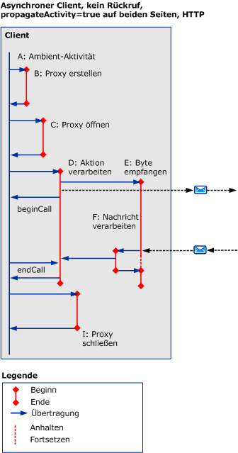
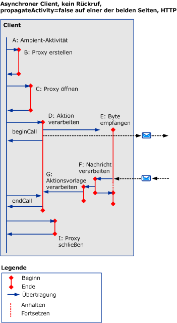
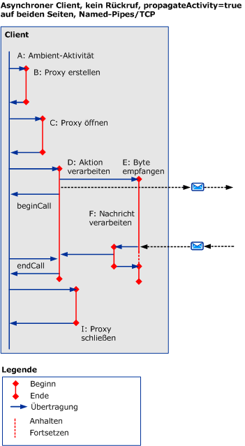
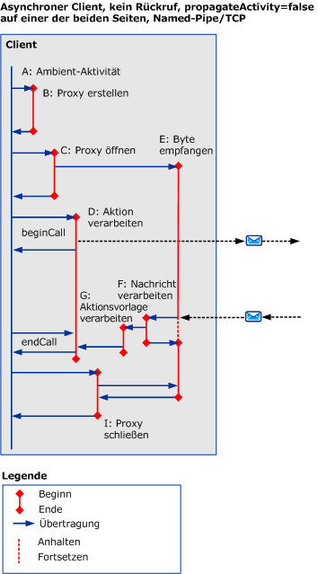
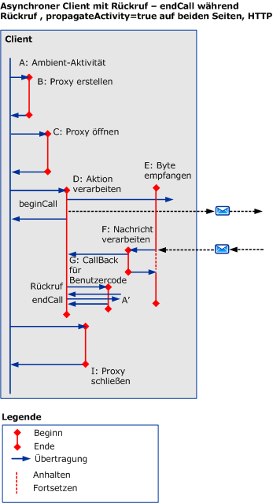

# Asynchrone Szenarien mit HTTP, TCP oder benannten Pipes
In diesem Abschnitt werden die Aktivitäten und Übertragungen für verschiedene asynchrone Anforderungs-/Antwortszenarien beschrieben. Dabei werden HTTP, TCP oder benannte Pipes in Multithreadanforderungen verwendet.  
  
## Asynchrone Anforderung/Antwort ohne Fehler  
 In diesem Abschnitt werden die Aktivitäten und Übertragungen für ein asynchrones Anforderungs-/Antwortszenario mit Multithreadclients beschrieben.  
  
 Die aufrufende Aktivität ist beendet, wenn `beginCall` und `endCall` zurückgegeben werden. Wenn ein Rückruf aufgerufen wird, wird der Rückruf zurückgegeben.  
  
 Die aufgerufene Aktivität ist beendet, wenn `beginCall` und `endCall` zurückgegeben werden oder bei Rückgabe des Rückrufs, wenn der Rückruf von dieser Aktivität aufgerufen wurde.  
  
### Asynchroner Client ohne Rückruf  
  
#### Weitergabe wird mit HTTP auf beiden Seiten aktiviert  
   
  
 Abbildung 1. Asynchroner Client, kein Rückruf, `propagateActivity` = `true` auf beiden Seiten, HTTP  
  
 Wenn `propagateActivity` = `true`, gibt ProcessMessage an die ProcessAction-Aktivität die Übertragung.  
  
 Bei HTTP-basierten Szenarien wird ReceiveBytes zur ersten gesendeten Nachricht aufgerufen und bleibt so lange erhalten wie die Anforderung besteht.  
  
#### Weitergabe wird mit HTTP auf einer der Seiten deaktiviert  
 Wenn `propagateActivity` = `false` auf einer Seite, gibt ProcessMessage nicht die ProcessAction-Aktivität die Übertragung an. Deshalb wird eine neue temporäre ProcessAction-Aktivität mit einer neuen ID aufgerufen. Wenn die asynchrone Antwort mit der Anforderung im ServiceModel-Code übereinstimmt, kann die Aktivitäts-ID aus dem lokalen Kontext abgerufen werden. Die eigentliche ProcessAction-Aktivität kann mit dieser ID übertragen werden.  
  
   
  
 Abbildung 2. Asynchroner Client, kein Rückruf, `propagateActivity` = `false` auf beiden Seiten, HTTP  
  
 Bei HTTP-basierten Szenarien wird ReceiveBytes zur ersten gesendeten Nachricht aufgerufen und bleibt so lange erhalten wie die Anforderung besteht.  
  
 Eine Processaction-Aktivität wird für einen asynchronen Client erstellt bei `propagateActivity` = `false` der Aufrufer oder Aufgerufener und wann die Response-Nachricht einen Action-Header nicht enthalten ist.  
  
#### Weitergabe wird mit TCP oder benannten Pipes auf beiden Seiten aktiviert  
   
  
 Abbildung 3. Asynchroner Client, kein Rückruf, `propagateActivity` = `true` auf beiden Seiten, benannte Pipes/TCP  
  
 Bei auf benannten Pipes oder TCP basierenden Szenarien wird ReceiveBytes beim Öffnen des Clients aufgerufen und bleibt so lange erhalten wie die Verbindung besteht.  
  
 Abbildung 1, wenn ähnlich `propagateActivity` = `true`, gibt ProcessMessage an die ProcessAction-Aktivität die Übertragung.  
  
#### Weitergabe wird mit TCP oder benannten Pipes auf einer der Seiten deaktiviert  
 Bei auf benannten Pipes oder TCP basierenden Szenarien wird ReceiveBytes beim Öffnen des Clients aufgerufen und bleibt so lange erhalten wie die Verbindung besteht.  
  
 Fig.2, ähnlich wie wenn `propagateActivity` = `false` auf einer Seite, gibt ProcessMessage nicht die ProcessAction-Aktivität die Übertragung an. Deshalb wird eine neue temporäre ProcessAction-Aktivität mit einer neuen ID aufgerufen. Wenn die asynchrone Antwort mit der Anforderung im ServiceModel-Code übereinstimmt, kann die Aktivitäts-ID aus dem lokalen Kontext abgerufen werden. Die eigentliche ProcessAction-Aktivität kann mit dieser ID übertragen werden.  
  
   
  
 Abbildung 4. Asynchroner Client, kein Rückruf, `propagateActivity` = `false` auf einer Seite, benannte Pipes/TCP  
  
### Asynchroner Client mit Rückruf  
 In diesem Szenario werden für den Rückruf und `endCall` die Aktivitäten G und A' und deren Ein- und Ausgangsübertragung hinzugefügt.  
  
 Dieser Abschnitt veranschaulicht lediglich die Verwendung von HTTP mit `propragateActivity` = `true`. Jedoch die zusätzlichen Aktivitäten und Übertragungen gelten auch für die anderen Fällen (d. h. `propagateActivity` = `false`, mit TCP oder Named Pipes).  
  
 Der Rückruf erstellt eine neue Aktivität (G), wenn der Client Benutzercode aufruft, um anzugeben, dass Ergebnisse vorliegen. Der Benutzercode ruft dann `endCall` innerhalb des Rückrufs (siehe Abbildung 5) oder außerhalb des Rückrufs (siehe Abbildung 6) auf Da es nicht bekannt, welcher Benutzeraktivität ist `endCall` aufgerufen wird, erhält diese Aktivität die Bezeichnung `A’`. A' kann mit A identisch sein, muss aber nicht.  
  
   
  
 Abbildung 5. Asynchroner Client mit Rückruf, `endCall` im Rückruf  
  
   
  
 Abbildung 6. Asynchroner Client mit Rückruf, `endCall` außerhalb des Rückrufs  
  
### Asynchroner Server mit Rückruf  
   
  
 Abbildung 7. Asynchroner Server mit Rückruf  
  
 Der Kanalstapel ruft den Client beim Nachrichtenempfang zurück: Ablaufverfolgungen für diese Verarbeitung werden direkt in der ProcessRequest-Aktivität ausgegeben.  
  
## Asynchrone Anforderung/Antwort mit Fehlern  
 Fehlermeldungen werden während `endCall` empfangen. Davon abgesehen ähneln die Aktivitäten und Übertragungen den vorherigen Szenarien.  
  
## Asynchrone unidirektional Kommunikation mit oder ohne Fehler  
 Keine Antwort oder kein Fehler wird an den Client zurückgegeben.
