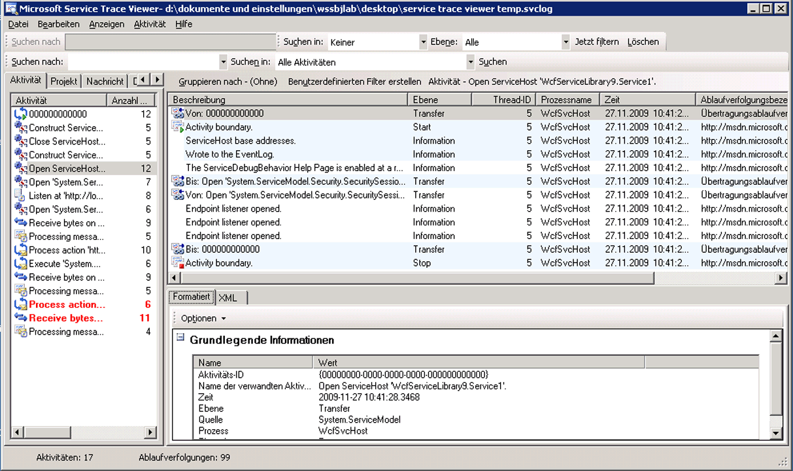

# <a name="emitting-user-code-traces"></a>Ausgeben von Benutzercode-Ablaufverfolgungen

Zusätzlich zum Aktivieren der Ablaufverfolgung in der Konfiguration zum Sammeln von instrumentierungsdaten, die von Windows Communication Foundation (WCF) generiert, können Sie auch programmgesteuert in Benutzercode Ausgeben von ablaufverfolgungen. Auf diese Weise können proaktiv Instrumentierungsdaten zur späteren Analyse erstellt werden. Die entsprechende Vorgehensweise wird in diesem Thema erläutert.

Darüber hinaus die [erweitern Ablaufverfolgung](../../../../../docs/framework/wcf/samples/extending-tracing.md) Beispiel enthält alle in den folgenden Abschnitten gezeigten Code.

## <a name="creating-a-trace-source"></a>Erstellen einer Ablaufverfolgungsquelle

Mithilfe des folgenden Codes können Sie eine Ablaufverfolgungsquelle für Benutzer erstellen:

```csharp
TraceSource ts = new TraceSource("myUserTraceSource");
```

## <a name="creating-activities"></a>Erstellen von Aktivitäten

Bei Aktivitäten handelt es sich um logische Verarbeitungseinheiten. Für jede größere Verarbeitungseinheit, in der Ablaufverfolgungen gruppiert werden sollen, kann eine Aktivität erstellt werden. So können Sie beispielsweise eine Aktivität für jede Anforderung an den Dienst erstellen. Gehen Sie hierzu folgendermaßen vor:

1. Speichern Sie die Aktivitäts-ID des Bereichs.

2. Erstellen Sie eine neue Aktivitäts-ID.

3. Wechseln Sie von der Aktivität des Bereichs zur neuen Aktivität, legen Sie die neue Aktivität für den Bereich fest, und geben Sie für diese Aktivität eine Start-Ablaufverfolgung aus.

Im folgenden Codebeispiel wird die hierfür erforderliche Vorgehensweise veranschaulicht:

```csharp
Guid oldID = Trace.CorrelationManager.ActivityId;
Guid traceID = Guid.NewGuid();
ts.TraceTransfer(0, "transfer", traceID);
Trace.CorrelationManager.ActivityId = traceID; // Trace is static
ts.TraceEvent(TraceEventType.Start, 0, "Add request");
```

## <a name="emitting-traces-within-a-user-activity"></a>Ausgeben von Ablaufverfolgungen innerhalb einer Benutzeraktivität

Der folgende Code dient zum Ausgeben von Ablaufverfolgungen innerhalb einer Benutzeraktivität:

```csharp
double value1 = 100.00D;
double value2 = 15.99D;
ts.TraceInformation("Client sends message to Add " + value1 + ", " + value2);
double result = client.Add(value1, value2);
ts.TraceInformation("Client receives Add response '" + result + "'");
```

## <a name="stopping-the-activities"></a>Beenden der Aktivitäten

Wechseln Sie zum Beenden der Aktivitäten zur vorherigen Aktivität zurück, beenden Sie die aktuelle Aktivitäts-ID, und legen Sie für den Bereich wieder die vorherige Aktivitäts-ID fest.

Im folgenden Codebeispiel wird die hierfür erforderliche Vorgehensweise veranschaulicht:

```csharp
ts.TraceTransfer(0, "transfer", oldID);
ts.TraceEvent(TraceEventType.Stop, 0, "Add request");
Trace.CorrelationManager.ActivityId = oldID;
```

## <a name="propagating-the-activity-id-to-a-service"></a>Weitergeben der Aktivitäts-ID an einen Dienst

Wird das `propagateActivity`-Attribut für die `true`-Ablaufverfolgungsquelle sowohl in der Konfigurationsdatei des Clients als auch in der Konfigurationsdatei des Diensts auf `System.ServiceModel` festgelegt, erfolgt die Dienstverarbeitung für die Add-Anforderung in der Aktivität, die auch für den Client definiert ist. Werden vom Dienst eigene Aktivitäten und Übertragungen definiert, erscheinen die Dienstablaufverfolgungen nicht in der vom Client weitergegebenen Aktivität. Stattdessen erscheinen sie in einer Aktivität, die anhand von Übertragungsablaufverfolgungen mit der Aktivität korreliert wird, deren ID vom Client weitergegeben wird.

> [!NOTE]
> Wenn die `propagateActivity` -Attributsatz auf `true` auf dem Client und Dienst die umgebungsaktivität im Vorgangsbereich des Diensts von WCF festgelegt ist.

Sie können den folgenden Code verwenden, um zu überprüfen, ob eine Aktivität im Bereich von WCF festgelegt wurde.

```csharp
// Check if an activity was set in scope by WCF, if it was
// propagated from the client. If not, ( ambient activity is
// equal to Guid.Empty), create a new one.
if(Trace.CorrelationManager.ActivityId == Guid.Empty)
{
    Guid newGuid = Guid.NewGuid();
    Trace.CorrelationManager.ActivityId = newGuid;
}
// Emit your Start trace.
ts.TraceEvent(TraceEventType.Start, 0, "Add Activity");

// Emit the processing traces for that request.
serviceTs.TraceInformation("Service receives Add "
                            + n1 + ", " + n2);
// double result = n1 + n2;
serviceTs.TraceInformation("Service sends Add result" + result);

// Emit the Stop trace and exit the method scope.
ts.TraceEvent(TraceEventType.Stop, 0, "Add Activity");
// return result;
```

## <a name="tracing-exceptions-thrown-in-code"></a>Verfolgen von im Code ausgelösten Ausnahmen

Wird im Code eine Ausnahme ausgelöst, kann diese Ausnahme mithilfe des folgenden Codes auch ab der Warnstufe verfolgt werden:

```csharp
ts.TraceEvent(TraceEventType.Warning, 0, "Throwing exception " + "exceptionMessage");
```

## <a name="viewing-user-traces-in-the-service-trace-viewer-tool"></a>Anzeigen von Benutzerablaufverfolgungen im Service Trace Viewer-Tool

Dieser Abschnitt enthält Screenshots von ablaufverfolgungen, die durch die Ausführung generiert der [erweitern Ablaufverfolgung](../../../../../docs/framework/wcf/samples/extending-tracing.md) Beispiel, bei der Anzeige mit den [Service Trace Viewer-Tool (SvcTraceViewer.exe)](../../../../../docs/framework/wcf/service-trace-viewer-tool-svctraceviewer-exe.md).

Im folgenden Diagramm wird die zuvor erstellte Aktivität von "Add Request" im linken Bereich ausgewählt. Sie wird zusammen mit drei anderen mathematischen Operationen (Divide, Subtract, Multiply) aufgeführt. Diese stellen das Anwendungsclientprogramm dar. Durch den Benutzercode wurde für jede Operation eine neue Aktivität definiert, um potenzielle Fehler in verschiedenen Anforderungen zu isolieren.

Zur Veranschaulichung der Verwendung von Übertragungen in den [Erweitern von Ablaufverfolgung](../../../../../docs/framework/wcf/samples/extending-tracing.md) Beispiel eine Calculator-Aktivität, die die vier vorgangsanforderungen enthält, wird ebenfalls erstellt. Für jede Anforderung findet eine Übertragung von der Berechnungsaktivität zur Anforderungsaktivität und umgekehrt statt (die Ablaufverfolgung ist im rechten oberen Bereich der Abbildung hervorgehoben).

Wird im linken Bereich eine Aktivität ausgewählt, werden die in dieser Aktivität enthaltenen Ablaufverfolgungen im rechten oberen Bereich angezeigt. Wenn `propagateActivity` ist `true` an jedem Endpunkt im Anforderungspfad, der ablaufverfolgungen in der Anforderungsaktivität werden von allen Prozessen, die in der Anforderung beteiligt sind. In diesem Beispiel sind sowohl Ablaufverfolgungen vom Client als auch vom Dienst enthalten (siehe 4. Spalte des Bereichs).

Diese Aktivität weist die folgende Verarbeitungsreihenfolge auf:

1. Client sendet Nachricht an Add.

2. Dienst empfängt Nachricht mit Add-Anforderung.

3. Dienst sendet Add-Antwort.

4. Client empfängt Add-Antwort.

All diese Ablaufverfolgungen werden auf Informationsebene ausgegeben. Durch Klicken auf eine Ablaufverfolgung im rechten oberen Bereich werden im rechten unteren Bereich die Details der entsprechenden Ablaufverfolgung angezeigt.

Im folgenden Diagramm sind auch Übertragungsablaufverfolgungen von der und zur Berechnungsaktivität sowie zwei Paare von Start- und Stop-Ablaufverfolgungen pro Anforderungsaktivität enthalten (eins für den Client, eins für den Dienst, also jeweils eins für jede Ablaufverfolgungsquelle).

 Liste der Aktivitäten nach Erstellungszeit (linker Bereich) und deren geschachtelter Aktivitäten (Bereich rechts oben)

Wird vom Dienstcode eine Ausnahme ausgelöst, durch die auch vom Client eine Ausnahme ausgelöst wird (beispielsweise bei Ausbleiben einer Antwort auf eine Anforderung), erscheinen sowohl die Warn- oder Fehlermeldung des Diensts als auch die des Clients in der gleichen Aktivität, um das Herstellen eines direkten Zusammenhangs zu ermöglichen. In der folgenden Abbildung wird Ausnahme der Dienst eine, die besagt "der Dienst zum Verarbeiten dieser Anforderung im Benutzercode verweigert." Der Client löst auch eine Ausnahme, die besagt "der Server nicht zum Verarbeiten der Anforderung aufgrund eines internen Fehlers konnte."

Die folgenden Abbildungen zeigt, dass endpunktübergreifende Fehler für eine bestimmte Anforderung in der gleichen Aktivität angezeigt werden, wenn die anforderungsaktivitäts-Id weitergegeben wurde:


Durch Doppelklicken auf die Multiply-Aktivität im linken Bereich wird das folgende Diagramm angezeigt. Dieses enthält die Ablaufverfolgungen für die Multiply-Aktivität für jeden beteiligten Prozess. Es ist zu sehen, dass zunächst eine Warnung für den Service aufgetreten ist (Ausnahme ausgelöst). Daraufhin kommt es auch auf dem Client zu Warnungen und Fehlern, da die Anforderung nicht verarbeitet werden konnte. Somit lassen sich die kausale Fehlerbeziehung zwischen Endpunkten sowie die Grundursache des Fehlers ableiten.

Die folgende Abbildung zeigt eine Diagrammansicht der Fehlerkorrelation:


Zum Abrufen der vorherigen Ablaufverfolgungen wird `ActivityTracing` für die Benutzerablaufverfolgungsquellen und `propagateActivity=true` für die `System.ServiceModel`-Ablaufverfolgungsquelle festgelegt. `ActivityTracing` wurde nicht für die `System.ServiceModel`-Ablaufverfolgungsquelle festgelegt, um die Aktivitätsweitergabe von Benutzercode an Benutzercode zu ermöglichen. (Wenn die ServiceModel-aktivitätsablaufverfolgung aktiviert ist, die auf dem Client definierte Aktivitäts-ID nicht ganz an den Benutzercode für den Dienst weitergegeben; Datenübertragung, Korrelieren jedoch den Client und Dienst benutzercodeaktivitäten, zwischen WCF-Aktivitäten.)

Das Definieren von Aktivitäten und das Weitergeben der Aktivitäts-ID ermöglicht das endpunktübergreifende Herstellen eines direkten Fehlerzusammenhangs. Dadurch lässt sich die Ursache eines Fehlers schneller ermitteln.

## <a name="see-also"></a>Siehe auch

- [Erweitern der Ablaufverfolgung](../../../../../docs/framework/wcf/samples/extending-tracing.md)
