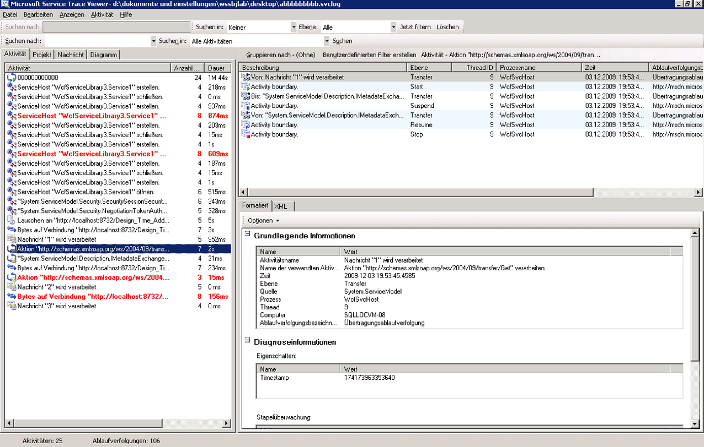
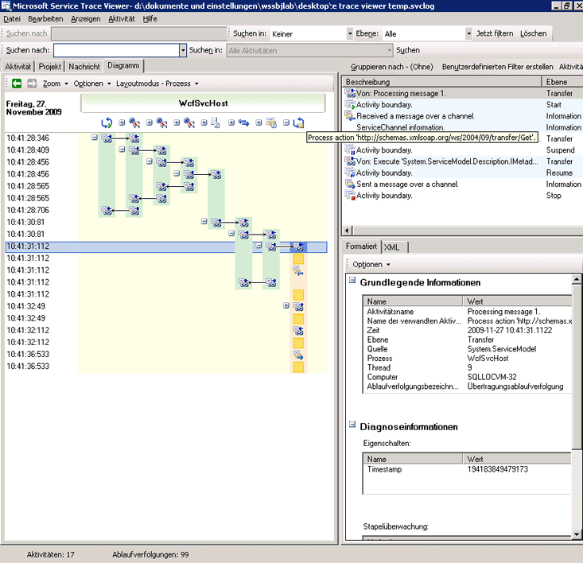
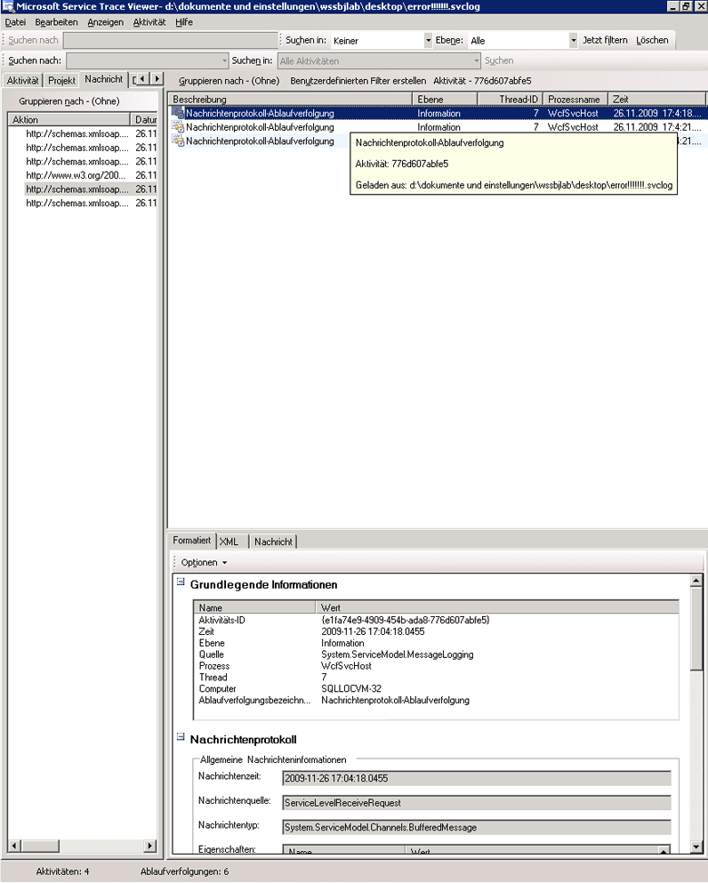
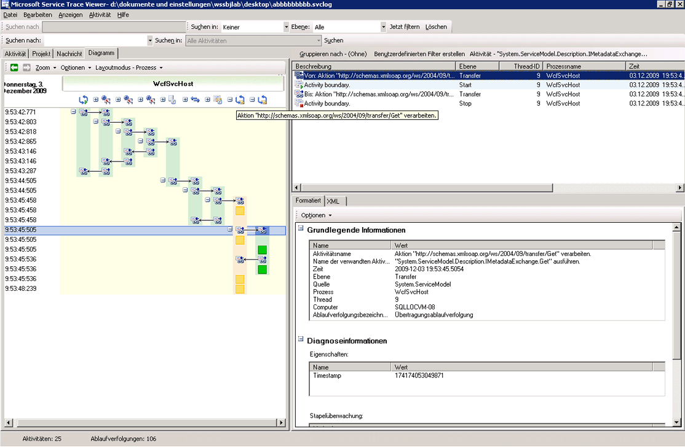
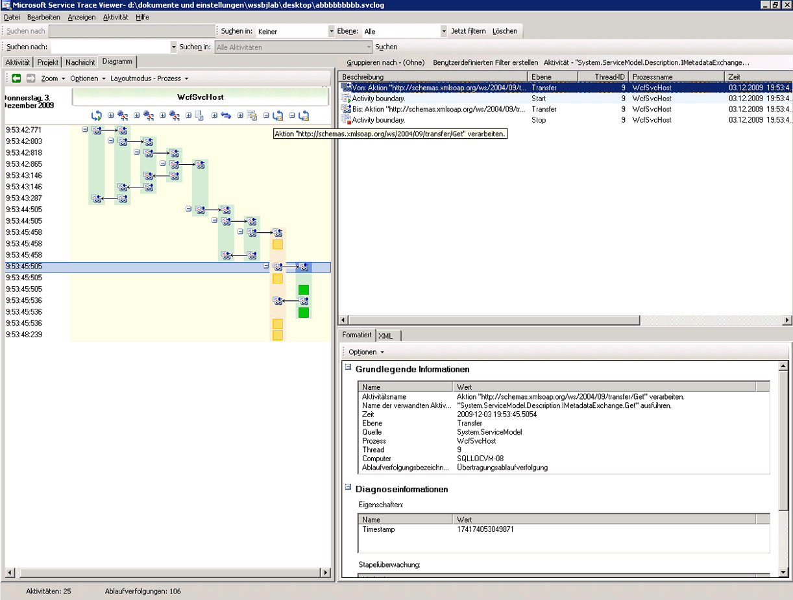
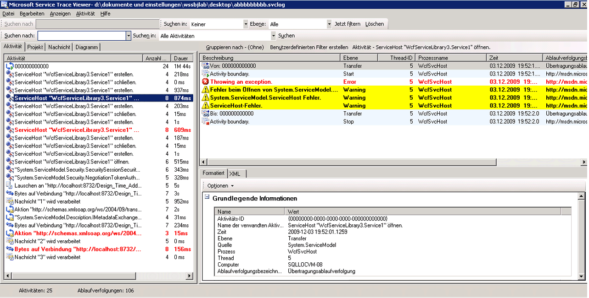
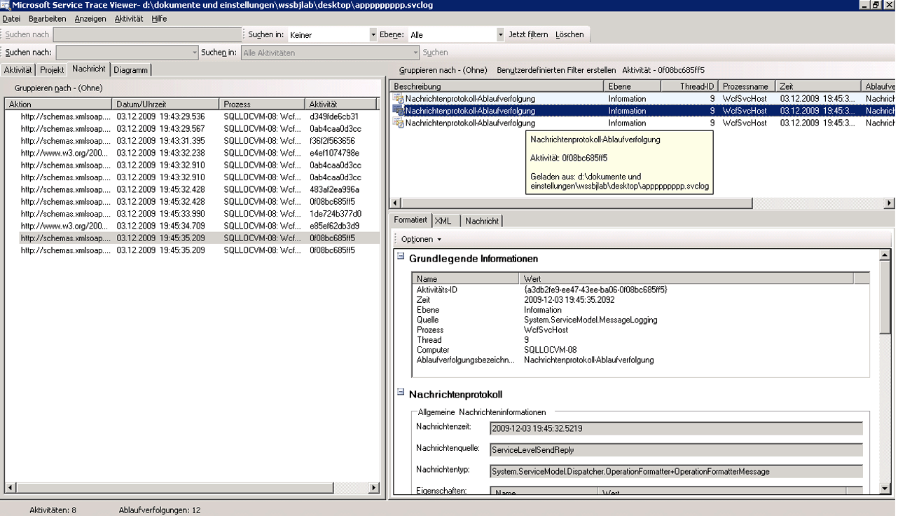

# <a name="using-service-trace-viewer-for-viewing-correlated-traces-and-troubleshooting"></a><span data-ttu-id="5ebcb-102">Verwenden von Service Trace Viewer zum Anzeigen korrelierender Ablaufverfolgungen und der Problembehandlung</span><span class="sxs-lookup"><span data-stu-id="5ebcb-102">Using Service Trace Viewer for Viewing Correlated Traces and Troubleshooting</span></span>
<span data-ttu-id="5ebcb-103">In diesem Thema wird das Format von Ablaufverfolgungsdaten und ihre Verwendung beschrieben. Dabei wird auch auf die Verwendung von Service Trace Viewer zur Problembehandlung in einer Anwendung eingegangen.</span><span class="sxs-lookup"><span data-stu-id="5ebcb-103">This topic describes the format of trace data, how to view it, and approaches that use the Service Trace Viewer to troubleshoot your application.</span></span>  
  
## <a name="using-the-service-trace-viewer-tool"></a><span data-ttu-id="5ebcb-104">Verwenden des Service Trace Viewer-Tools</span><span class="sxs-lookup"><span data-stu-id="5ebcb-104">Using the Service Trace Viewer Tool</span></span>  
 <span data-ttu-id="5ebcb-105">Der Windows Communication Foundation (WCF) Service Trace Viewer-Tool können Sie die von den WCF-Listenern, suchen Sie die Ursache eines Fehlers erstellte diagnoseablaufverfolgungen zu korrelieren.</span><span class="sxs-lookup"><span data-stu-id="5ebcb-105">The Windows Communication Foundation (WCF) Service Trace Viewer tool helps you correlate diagnostic traces produced by WCF listeners to locate the root cause of an error.</span></span> <span data-ttu-id="5ebcb-106">Das Tool bietet Ihnen eine Möglichkeit, leicht anzeigen, Gruppe, und Filtern von ablaufverfolgungen zu diagnostizieren, reparieren und vergewissern Sie sich Probleme mit WCF-Diensten.</span><span class="sxs-lookup"><span data-stu-id="5ebcb-106">The tool gives you a way to easily view, group, and filter traces so that you can diagnose, repair and verify issues with WCF services.</span></span> <span data-ttu-id="5ebcb-107">Weitere Informationen zur Verwendung dieses Tools finden Sie unter [Service Trace Viewer-Tool (SvcTraceViewer.exe)](../../../../../docs/framework/wcf/service-trace-viewer-tool-svctraceviewer-exe.md).</span><span class="sxs-lookup"><span data-stu-id="5ebcb-107">For more information about using this tool, see [Service Trace Viewer Tool (SvcTraceViewer.exe)](../../../../../docs/framework/wcf/service-trace-viewer-tool-svctraceviewer-exe.md).</span></span>  
  
 <span data-ttu-id="5ebcb-108">Dieses Thema enthält Screenshots von ablaufverfolgungen, die durch die Ausführung generiert der [Ablaufverfolgung und Nachrichtenprotokollierung](../../../../../docs/framework/wcf/samples/tracing-and-message-logging.md) Beispiel, bei der Anzeige mithilfe der [Service Trace Viewer-Tool (SvcTraceViewer.exe)](../../../../../docs/framework/wcf/service-trace-viewer-tool-svctraceviewer-exe.md).</span><span class="sxs-lookup"><span data-stu-id="5ebcb-108">This topic contains screenshots of traces generated by running the [Tracing and Message Logging](../../../../../docs/framework/wcf/samples/tracing-and-message-logging.md) sample, when viewed using the [Service Trace Viewer Tool (SvcTraceViewer.exe)](../../../../../docs/framework/wcf/service-trace-viewer-tool-svctraceviewer-exe.md).</span></span> <span data-ttu-id="5ebcb-109">In diesem Thema werden der Ablaufverfolgungsinhalt, Aktivitäten und ihre Korrelation erläutert. Zudem wird beschrieben, wie eine große Zahl von Ablaufverfolgungen im Rahmen der Problembehandlung analysiert werden können.</span><span class="sxs-lookup"><span data-stu-id="5ebcb-109">This topic demonstrates how to understand trace content, activities and their correlation, and how to analyze large numbers of traces when troubleshooting.</span></span>  
  
## <a name="viewing-trace-content"></a><span data-ttu-id="5ebcb-110">Anzeigen von Ablaufverfolgungsinhalt</span><span class="sxs-lookup"><span data-stu-id="5ebcb-110">Viewing Trace Content</span></span>  
 <span data-ttu-id="5ebcb-111">Ein Ablaufverfolgungsereignis enthält die folgenden wichtigen Informationen:</span><span class="sxs-lookup"><span data-stu-id="5ebcb-111">A trace event contains the following most significant information:</span></span>  
  
-   <span data-ttu-id="5ebcb-112">Aktivitätsname bei Festlegung</span><span class="sxs-lookup"><span data-stu-id="5ebcb-112">Activity name when set.</span></span>  
  
-   <span data-ttu-id="5ebcb-113">Ausgabezeit</span><span class="sxs-lookup"><span data-stu-id="5ebcb-113">Emission time.</span></span>  
  
-   <span data-ttu-id="5ebcb-114">Ablaufverfolgungsebene</span><span class="sxs-lookup"><span data-stu-id="5ebcb-114">Trace level.</span></span>  
  
-   <span data-ttu-id="5ebcb-115">Name der Ablaufverfolgungsquelle</span><span class="sxs-lookup"><span data-stu-id="5ebcb-115">Trace source name.</span></span>  
  
-   <span data-ttu-id="5ebcb-116">Prozessname</span><span class="sxs-lookup"><span data-stu-id="5ebcb-116">Process name.</span></span>  
  
-   <span data-ttu-id="5ebcb-117">Thread-ID</span><span class="sxs-lookup"><span data-stu-id="5ebcb-117">Thread id.</span></span>  
  
-   <span data-ttu-id="5ebcb-118">Einen eindeutigen ablaufverfolgungsbezeichner, d. h. eine URL, die auf ein Ziel in Microsoft Docs, verweist, von denen Sie weitere Informationen zur Ablaufverfolgung abrufen können.</span><span class="sxs-lookup"><span data-stu-id="5ebcb-118">A unique trace identifier, which is a URL that points to a destination in Microsoft Docs, from which you can obtain more information related to the trace.</span></span>  
  
 <span data-ttu-id="5ebcb-119">Alle diese in der oberen rechten Bereich im Service Trace Viewer oder im überwachungsarbeitsbereich der **Basisinformationen** Abschnitt in der formatierten Ansicht des Bereichs unten rechts bei Auswahl einer Ablaufverfolgung.</span><span class="sxs-lookup"><span data-stu-id="5ebcb-119">All of these can be seen in the upper right panel in the Service Trace Viewer, or in the **Basic Information** section in the formatted view of the lower-right panel when selecting a trace.</span></span>  
  
> [!NOTE]
>  <span data-ttu-id="5ebcb-120">Wenn sich der Client und der Dienst auf demselben Computer befinden, können die Ablaufverfolgungen für beide Anwendungen eingesehen werden.</span><span class="sxs-lookup"><span data-stu-id="5ebcb-120">If the client and the service are on the same machine, the traces for both applications will be present.</span></span> <span data-ttu-id="5ebcb-121">Diese können gefiltert werden, mithilfe der **Prozessnamen** Spalte.</span><span class="sxs-lookup"><span data-stu-id="5ebcb-121">These can be filtered using the **Process Name** column.</span></span>  
  
 <span data-ttu-id="5ebcb-122">Zudem bietet die formatierte Ansicht eine Beschreibung der Ablaufverfolgung sowie zusätzliche detaillierte Informationen, sofern diese verfügbar sind.</span><span class="sxs-lookup"><span data-stu-id="5ebcb-122">In addition, the formatted view also provides a description for the trace and additional detailed information when available.</span></span> <span data-ttu-id="5ebcb-123">Dazu gehören Ausnahmeart und -nachricht, Aufruflisten, Nachrichtenaktion, Felder Von/Zu und andere Ausnahmeinformationen.</span><span class="sxs-lookup"><span data-stu-id="5ebcb-123">The latter can include exception type and message, call stacks, message action, from/to fields, and other exception information.</span></span>  
  
 <span data-ttu-id="5ebcb-124">Die XML-Ansicht enthält die folgenden nützlichen XML-Tags:</span><span class="sxs-lookup"><span data-stu-id="5ebcb-124">In the XML view, useful xml tags include the following:</span></span>  
  
-   <span data-ttu-id="5ebcb-125">\<SubType > (Ablaufverfolgungsebene).</span><span class="sxs-lookup"><span data-stu-id="5ebcb-125">\<SubType> (trace level).</span></span>  
  
-   <span data-ttu-id="5ebcb-126">\<TimeCreated >.</span><span class="sxs-lookup"><span data-stu-id="5ebcb-126">\<TimeCreated>.</span></span>  
  
-   <span data-ttu-id="5ebcb-127">\<Source > (Name der Ablaufverfolgungsquelle).</span><span class="sxs-lookup"><span data-stu-id="5ebcb-127">\<Source> (trace source name).</span></span>  
  
-   <span data-ttu-id="5ebcb-128">\<Correlation > (Aktivitäts-Id festgelegt, wenn die Ausgabe der Ablaufverfolgung).</span><span class="sxs-lookup"><span data-stu-id="5ebcb-128">\<Correlation> (activity id set when emitting the trace).</span></span>  
  
-   <span data-ttu-id="5ebcb-129">\<Ausführung > (Prozess- und Thread-Id).</span><span class="sxs-lookup"><span data-stu-id="5ebcb-129">\<Execution> (process and thread id).</span></span>  
  
-   <span data-ttu-id="5ebcb-130">\<Computer >.</span><span class="sxs-lookup"><span data-stu-id="5ebcb-130">\<Computer>.</span></span>  
  
-   <span data-ttu-id="5ebcb-131">\<ExtendedData > einschließlich \<Aktion >, \<MessageID > und der \<"ActivityId" > im Nachrichtenheader festgelegt wird, wenn eine Nachricht gesendet wird.</span><span class="sxs-lookup"><span data-stu-id="5ebcb-131">\<ExtendedData>, including \<Action>, \<MessageID> and the \<ActivityId> set in the message header when sending a message.</span></span>  
  
 <span data-ttu-id="5ebcb-132">Wenn Sie die Ablaufverfolgung "Sent a message over a channel" ("Nachricht über einen Kanal gesendet") prüfen, wird möglicherweise der folgende Inhalt angezeigt.</span><span class="sxs-lookup"><span data-stu-id="5ebcb-132">If you examine the "Sent a message over a channel" trace, you may see the following content.</span></span>  
  
```xml  
<E2ETraceEvent xmlns="http://schemas.microsoft.com/2004/06/E2ETraceEvent">  
   <System xmlns="http://schemas.microsoft.com/2004/06/windows/eventlog/system">  
      <EventID>262163</EventID>  
      <Type>3</Type>  
      <SubType Name="Information">0</SubType>  
      <Level>8</Level>  
      <TimeCreated SystemTime="2006-08-04T18:45:30.8491051Z" />  
      <Source Name="System.ServiceModel" />  
       <Correlation ActivityID="{27c6331d-8998-43aa-a382-03239013a6bd}"/>  
       <Execution ProcessName="client" ProcessID="1808" ThreadID="1" />  
       <Channel />  
       <Computer>TEST1</Computer>  
   </System>  
   <ApplicationData>  
       <TraceData>  
          <DataItem>  
             <TraceRecord xmlns="http://schemas.microsoft.com/2004/10/E2ETraceEvent/TraceRecord" Severity="Information">  
                 <TraceIdentifier>http://msdn.microsoft.com/library/System.ServiceModel.Channels.MessageSent.aspx</TraceIdentifier>  
                 <Description>Sent a message over a channel.</Description>  
                 <AppDomain>client.exe</AppDomain>  
                 <Source>System.ServiceModel.Channels.ClientFramingDuplexSessionChannel/35191196</Source>  
                <ExtendedData xmlns="http://schemas.microsoft.com/2006/08/ServiceModel/MessageTransmitTraceRecord">  
  
                  <MessageProperties>  
                     <AllowOutputBatching>False</AllowOutputBatching>  
                  </MessageProperties>  
                  <MessageHeaders>  
                     <Action d4p1:mustUnderstand="1" xmlns:d4p1="http://www.w3.org/2003/05/soap-envelope" xmlns="http://www.w3.org/2005/08/addressing">http://Microsoft.ServiceModel.Samples/ICalculator/Multiply</Action>  
                     <MessageID xmlns="http://www.w3.org/2005/08/addressing">urn:uuid:7c6670d8-4c9c-496e-b6a0-2ceb6db35338</MessageID>  
                     <ActivityId CorrelationId="b02e2189-0816-4387-980c-dd8e306440f5" xmlns="http://schemas.microsoft.com/2004/09/ServiceModel/Diagnostics">27c6331d-8998-43aa-a382-03239013a6bd</ActivityId>  
                     <ReplyTo xmlns="http://www.w3.org/2005/08/addressing">  
                        <Address>http://www.w3.org/2005/08/addressing/anonymous</Address>  
                    </ReplyTo>  
                    <To d4p1:mustUnderstand="1" xmlns:d4p1="http://www.w3.org/2003/05/soap-envelope" xmlns="http://www.w3.org/2005/08/addressing">net.tcp://localhost/servicemodelsamples/service</To>  
                  </MessageHeaders>  
                  <RemoteAddress>net.tcp://localhost/servicemodelsamples/service</RemoteAddress>  
                </ExtendedData>  
            </TraceRecord>  
          </DataItem>  
       </TraceData>  
   </ApplicationData>  
</E2ETraceEvent>  
```  
  
## <a name="servicemodel-e2e-tracing"></a><span data-ttu-id="5ebcb-133">ServiceModel E2E-Ablaufverfolgung</span><span class="sxs-lookup"><span data-stu-id="5ebcb-133">ServiceModel E2E Tracing</span></span>  
 <span data-ttu-id="5ebcb-134">Wenn die `System.ServiceModel` Ablaufverfolgungsquelle mit festgelegt ist ein `switchValue` anders als Off und `ActivityTracing`, WCF erstellt, Aktivitäten und Übertragungen für WCF-Verarbeitung.</span><span class="sxs-lookup"><span data-stu-id="5ebcb-134">When the `System.ServiceModel` trace source is set with a `switchValue` other than Off, and `ActivityTracing`, WCF creates activities and transfers for WCF processing.</span></span>  
  
 <span data-ttu-id="5ebcb-135">Eine Aktivität ist eine logische Verarbeitungseinheit, die alle verknüpften Ablaufverfolgungen zusammenfasst.</span><span class="sxs-lookup"><span data-stu-id="5ebcb-135">An activity is a logical unit of processing that groups all traces related to that processing unit.</span></span> <span data-ttu-id="5ebcb-136">So können Sie beispielsweise eine Aktivität für jede Anforderung definieren.</span><span class="sxs-lookup"><span data-stu-id="5ebcb-136">For example, you can define one activity for each request.</span></span> <span data-ttu-id="5ebcb-137">Übertragungen stellen eine kausale Beziehung zwischen Aktivitäten innerhalb von Endpunkten her.</span><span class="sxs-lookup"><span data-stu-id="5ebcb-137">Transfers create a causal relationship between activities within endpoints.</span></span> <span data-ttu-id="5ebcb-138">Durch die Weitergabe der Aktivitäts-ID können Sie Aktivitäten über Endpunkte hinweg verknüpfen.</span><span class="sxs-lookup"><span data-stu-id="5ebcb-138">Propagating the activity ID enables you to relate activities across endpoints.</span></span> <span data-ttu-id="5ebcb-139">Dies kann geschehen, indem Sie die Einstellung `propagateActivity` = `true` in der Konfiguration an jedem Endpunkt.</span><span class="sxs-lookup"><span data-stu-id="5ebcb-139">This can be done by setting `propagateActivity`=`true` in configuration at every endpoint.</span></span> <span data-ttu-id="5ebcb-140">Aktivitäten, Übertragungen und Weitergabe ermöglichen es Ihnen, die Fehlerkorrelation durchzuführen.</span><span class="sxs-lookup"><span data-stu-id="5ebcb-140">Activities, transfers, and propagation allow you to perform error correlation.</span></span> <span data-ttu-id="5ebcb-141">Auf diese Weise können Sie die Grundursache eines Fehlers schneller ermitteln.</span><span class="sxs-lookup"><span data-stu-id="5ebcb-141">In this way, you can find the root cause of an error more quickly.</span></span>  
  
 <span data-ttu-id="5ebcb-142">Auf dem Client wird eine WCF-Aktivität für jeden Objektmodellaufruf (beispielsweise Open ChannelFactory, Add, Divide usw..) erstellt. Jeder der vorgangsaufrufe wird in einer Aktivität "Aktion verarbeiten" verarbeitet.</span><span class="sxs-lookup"><span data-stu-id="5ebcb-142">On the client, one WCF activity is created for each object model call (for example, Open ChannelFactory, Add, Divide, and so on.) Each of the operation calls is processed in a "Process Action" activity.</span></span>  
  
 <span data-ttu-id="5ebcb-143">Im folgenden Screenshot extrahiert aus der [Ablaufverfolgung und Nachrichtenprotokollierung](../../../../../docs/framework/wcf/samples/tracing-and-message-logging.md) Beispiel im linken Bereich zeigt die Liste der Aktivitäten, die im Clientprozess, sortiert nach Erstellungszeit erstellt.</span><span class="sxs-lookup"><span data-stu-id="5ebcb-143">In the following screenshot, extracted from the [Tracing and Message Logging](../../../../../docs/framework/wcf/samples/tracing-and-message-logging.md) sample the left panel displays the list of activities created in the client process, sorted by creation time.</span></span> <span data-ttu-id="5ebcb-144">Es folgt eine chronologische Liste von Aktivitäten:</span><span class="sxs-lookup"><span data-stu-id="5ebcb-144">The following is a chronological list of activities:</span></span>  
  
-   <span data-ttu-id="5ebcb-145">Kanalfactory erstellt (ClientBase).</span><span class="sxs-lookup"><span data-stu-id="5ebcb-145">Constructed the channel factory (ClientBase).</span></span>  
  
-   <span data-ttu-id="5ebcb-146">Kanalfactory geöffnet.</span><span class="sxs-lookup"><span data-stu-id="5ebcb-146">Opened the channel factory.</span></span>  
  
-   <span data-ttu-id="5ebcb-147">Add-Aktion (Hinzufügen) verarbeitet.</span><span class="sxs-lookup"><span data-stu-id="5ebcb-147">Processed the Add action.</span></span>  
  
-   <span data-ttu-id="5ebcb-148">Set Up Secure Session (Sichere Sitzung einrichten) ausgeführt (nach erster Anforderung ERFOLGT) und drei Sicherheitsinfrastruktur-Antwortnachrichten verarbeitet: RST, RSTR, SCT (Process message 1, 2, 3; Nachricht 1, 2, 3 verarbeiten).</span><span class="sxs-lookup"><span data-stu-id="5ebcb-148">Set up the Secure Session (this OCCURRED on the first request) and processed three security infrastructure response messages: RST, RSTR, SCT (Process message 1, 2, 3).</span></span>  
  
-   <span data-ttu-id="5ebcb-149">Anforderungen Subtract, Multiply und Divide (Subtrahieren, Multiplizieren und Dividieren) verarbeitet.</span><span class="sxs-lookup"><span data-stu-id="5ebcb-149">Processed the Subtract, Multiply, and Divide requests.</span></span>  
  
-   <span data-ttu-id="5ebcb-150">Kanalfactory geschlossen, dabei sichere Sitzung beendet und Sicherheitsantwort Cancel (Abbrechen) verarbeitet.</span><span class="sxs-lookup"><span data-stu-id="5ebcb-150">Closed the channel factory, and doing so closed the Secure session and processed the security message response Cancel.</span></span>  
  
 <span data-ttu-id="5ebcb-151">Die Sicherheitsinfrastrukturnachrichten sind aufgrund der Bindung wsHttpBinding sichtbar.</span><span class="sxs-lookup"><span data-stu-id="5ebcb-151">We see the security infrastructure messages because of the wsHttpBinding.</span></span>  
  
> [!NOTE]
>  <span data-ttu-id="5ebcb-152">In WCF werden Antwortnachrichten, die gerade verarbeitet werden, zunächst in einer separaten Aktivität (Nachricht verarbeiten), bevor wir sie mit der entsprechenden Processaction-Aktivität korrelieren, die die Anforderungsnachricht über eine Übertragung enthält.</span><span class="sxs-lookup"><span data-stu-id="5ebcb-152">In WCF, we show response messages being processed initially in a separate activity (Process message) before we correlate them to the corresponding Process Action activity that includes the request message, through a transfer.</span></span> <span data-ttu-id="5ebcb-153">Das geschieht sowohl für Infrastrukturnachrichten als auch für asynchrone Anforderungen, da die Nachricht geprüft, der activityId-Header gelesen und die vorhandene ProcessAction-Aktivität mit der ID ermittelt werden muss, um die Korrelation vorzunehmen.</span><span class="sxs-lookup"><span data-stu-id="5ebcb-153">This happens for infrastructure messages and asynchronous requests and is due to the fact that we must inspect the message, read the activityId header, and identify the existing Process Action activity with that id to correlate to it.</span></span> <span data-ttu-id="5ebcb-154">Bei synchronen Anforderungen wird die Antwort blockiert, weshalb bekannt ist, mit welcher Verarbeitungsaktion die Antwort verknüpft ist.</span><span class="sxs-lookup"><span data-stu-id="5ebcb-154">For synchronous requests, we are blocking for the response and hence know which Process action the response relates to.</span></span>  
  
 <span data-ttu-id="5ebcb-155"></span><span class="sxs-lookup"><span data-stu-id="5ebcb-155"></span></span>  
<span data-ttu-id="5ebcb-156">Liste der WCF-Clientaktivitäten nach Erstellungsdauer (linker Fensterbereich) und ihre geschachtelten Aktivitäten und Ablaufverfolgungen (oberer rechter Fensterbereich)</span><span class="sxs-lookup"><span data-stu-id="5ebcb-156">WCF client activities listed by creation time (left panel) and their nested activities and traces (upper right panel)</span></span>  
  
 <span data-ttu-id="5ebcb-157">Wenn Sie im linken Bereich eine Aktivität auswählen, werden die verschachtelten Aktivitäten und Ablaufverfolgungen im rechten oberen Bereich angezeigt.</span><span class="sxs-lookup"><span data-stu-id="5ebcb-157">When we select an activity in the left panel, we can see nested activities and traces on the upper right panel.</span></span> <span data-ttu-id="5ebcb-158">Dabei handelt es sich somit um eine auf der Basis der ausgewählten übergeordneten Aktivität verkürzte hierarchische Ansicht der Aktivitätenliste auf der linken Seite.</span><span class="sxs-lookup"><span data-stu-id="5ebcb-158">Therefore, this is a reduced hierarchical view of the list of activities on the left, based on the selected parent activity.</span></span> <span data-ttu-id="5ebcb-159">Da die ausgewählte Verarbeitungsaktion Add die erste Anforderung ist, enthält diese Aktivität die Aktivität Set Up Secure Session (Übertragung nach, Rückübertragung von) sowie Ablaufverfolgungen für die eigentliche Verarbeitung der Add-Aktion.</span><span class="sxs-lookup"><span data-stu-id="5ebcb-159">Because the selected Process action Add is the first request made, this activity contains the Set Up Secure Session activity (transfer to, transfer back from), and traces for the actual processing of the Add action.</span></span>  
  
 <span data-ttu-id="5ebcb-160">Wenn die processaction Add-Aktivität im linken Bereich doppelklicken klicken, sehen wir eine grafische Darstellung der der Client-WCF-Aktivitäten im Zusammenhang mit hinzufügen.</span><span class="sxs-lookup"><span data-stu-id="5ebcb-160">If we double click the Process action Add activity in the left panel, we can see a graphical representation of the client WCF activities related to Add.</span></span> <span data-ttu-id="5ebcb-161">Die erste Aktivität auf der linken Seite ist die Stammaktivität (0000), bei der es sich um die Standardaktivität handelt.</span><span class="sxs-lookup"><span data-stu-id="5ebcb-161">The first activity on the left is the root activity (0000), which is the default activity.</span></span> <span data-ttu-id="5ebcb-162">WCF-Übertragungen aus der umgebungsaktivität heraus.</span><span class="sxs-lookup"><span data-stu-id="5ebcb-162">WCF transfers out of the ambient activity.</span></span> <span data-ttu-id="5ebcb-163">Wenn dies nicht definiert ist, überträgt WCF aus 0000.</span><span class="sxs-lookup"><span data-stu-id="5ebcb-163">If this is not defined, WCF transfers out of 0000.</span></span> <span data-ttu-id="5ebcb-164">Im vorliegenden Fall überträgt die zweite Aktivität, die Verarbeitungsaktion Add, aus 0 heraus.</span><span class="sxs-lookup"><span data-stu-id="5ebcb-164">Here, the second activity, Process Action Add, transfers out of 0.</span></span> <span data-ttu-id="5ebcb-165">Dann wird Set Up Secure Session (Sichere Sitzung einrichten) angezeigt.</span><span class="sxs-lookup"><span data-stu-id="5ebcb-165">Then we see Setup Secure Session.</span></span>  
  
 <span data-ttu-id="5ebcb-166"></span><span class="sxs-lookup"><span data-stu-id="5ebcb-166"></span></span>  
<span data-ttu-id="5ebcb-167">Diagrammansicht von WCF-Clientaktivitäten: Umgebungsaktivität (hier 0), Verarbeitungsaktion und Set Up Secure Session.</span><span class="sxs-lookup"><span data-stu-id="5ebcb-167">Graph view of WCF client activities: Ambient Activity (here 0), Process action, and Set Up Secure Session</span></span>  
  
 <span data-ttu-id="5ebcb-168">Im oberen rechten Bereich sind alle Ablaufverfolgungen zu sehen, die mit der Process Action Add-Aktivität verknüpft sind.</span><span class="sxs-lookup"><span data-stu-id="5ebcb-168">On the upper right panel, we can see all traces related to the Process Action Add activity.</span></span> <span data-ttu-id="5ebcb-169">Das bedeutet, in ein und derselben Aktivität wurde die Anforderungsnachricht gesendet ("Sent a message over a channel", "Nachricht über einen Kanal gesendet") und die Antwort empfangen ("Received a message over a channel", "Nachricht über einen Kanal empfangen").</span><span class="sxs-lookup"><span data-stu-id="5ebcb-169">Specifically, we have sent the request message ("Sent a message over a channel") and received the response ("Received a message over a channel") in the same activity.</span></span> <span data-ttu-id="5ebcb-170">Dies wird im folgenden Diagramm dargestellt.</span><span class="sxs-lookup"><span data-stu-id="5ebcb-170">This is shown in the following graph.</span></span> <span data-ttu-id="5ebcb-171">Zur besseren Übersichtlichkeit ist die Set Up Secure Session-Aktivität im Diagramm reduziert.</span><span class="sxs-lookup"><span data-stu-id="5ebcb-171">For clarity, the Set up Secure Session activity is collapsed in the graph.</span></span>  
  
 <span data-ttu-id="5ebcb-172"></span><span class="sxs-lookup"><span data-stu-id="5ebcb-172"></span></span>  
<span data-ttu-id="5ebcb-173">Liste der Ablaufverfolgungen für die Process Action-Aktivität: Die Antwort wird innerhalb derselben Aktivität empfangen, in der die Anforderung gesendet wurde.</span><span class="sxs-lookup"><span data-stu-id="5ebcb-173">List of traces for the Process Action activity: we send the request and receive the response in the same activity.</span></span>  
  
 <span data-ttu-id="5ebcb-174">Hier wir clientablaufverfolgungen zur besseren Verdeutlichung geladen, aber dienstablaufverfolgungen (empfangene Anforderungsnachrichten und gesendete Antwortnachrichten) in der gleichen Aktivität angezeigt werden, wenn sie auch im Tool geladen werden und `propagateActivity` wurde `true.` wird dies in einer späteren Abbildung gezeigt.</span><span class="sxs-lookup"><span data-stu-id="5ebcb-174">Here, we load client traces only for clarity, but service traces (request message received and response message sent) appear in the same activity if they are also loaded in the tool and `propagateActivity` was set to `true.` This is shown in a later illustration.</span></span>  
  
 <span data-ttu-id="5ebcb-175">Für den Dienst das Aktivitätsmodell in die WCF-Konzepte folgendermaßen zugeordnet:</span><span class="sxs-lookup"><span data-stu-id="5ebcb-175">On the service, the activity model maps to the WCF concepts as follows:</span></span>  
  
1.  <span data-ttu-id="5ebcb-176">Ein ServiceHost wird erstellt und geöffnet (dadurch werden möglicherweise mehrere hostbezogene Aktivitäten erzeugt, z.&#160;B. im Falle der Sicherheit).</span><span class="sxs-lookup"><span data-stu-id="5ebcb-176">We construct and open a ServiceHost (this may create several host-related activities, for instance, in the case of security).</span></span>  
  
2.  <span data-ttu-id="5ebcb-177">Es wird eine Lauschaktivität für jeden Listener im ServiceHost erstellt (mit Übertragung in und aus Open ServiceHost).</span><span class="sxs-lookup"><span data-stu-id="5ebcb-177">We create a Listen At activity for each listener in the ServiceHost (with transfers in and out of Open ServiceHost).</span></span>  
  
3.  <span data-ttu-id="5ebcb-178">Wenn der Listener eine kommunikationsanforderung vom Client initiierten erkannt wird, werden in einer "Receive Bytes"-Aktivität, die in der alle vom Client gesendeten Bytes verarbeitet werden übertragen.</span><span class="sxs-lookup"><span data-stu-id="5ebcb-178">When the listener detects a communication request initiated by the client, it transfers to a "Receive Bytes" activity, in which all bytes sent from the client are processed.</span></span> <span data-ttu-id="5ebcb-179">In dieser Aktivität sind alle Verbindungsfehler erkennbar, die während der Client-Dienst-Interaktion aufgetreten sind.</span><span class="sxs-lookup"><span data-stu-id="5ebcb-179">In this activity, we can see any connection errors that have happened during the client-service interaction.</span></span>  
  
4.  <span data-ttu-id="5ebcb-180">Für jede Gruppe von Bytes, die empfangen werden, die einer Nachricht entspricht, verarbeiten wir diese Bytes in einer Aktivität "Prozess Meldung", in denen wir die WCF-Nachrichtenobjekt erstellen.</span><span class="sxs-lookup"><span data-stu-id="5ebcb-180">For each set of bytes that is received that corresponds to a message, we process these bytes in a "Process Message" activity, where we create the WCF Message object.</span></span> <span data-ttu-id="5ebcb-181">In dieser Aktivität sind Fehler aufgrund eines ungültigen Umschlags oder einer falsch formatierten Nachricht erkennbar.</span><span class="sxs-lookup"><span data-stu-id="5ebcb-181">In this activity, we see errors related to a bad envelope or a malformed message.</span></span>  
  
5.  <span data-ttu-id="5ebcb-182">Sobald die Nachricht erstellt wird, erfolgt die Übertragung zu einer Process Action-Aktivität.</span><span class="sxs-lookup"><span data-stu-id="5ebcb-182">Once the message is formed, we transfer to a Process Action activity.</span></span> <span data-ttu-id="5ebcb-183">Wenn `propagateActivity` sowohl für den Client als auch für den Dienst auf `true` festgelegt ist, verfügt diese Aktivität über dieselbe ID wie die auf dem Client definierte und zuvor beschriebene.</span><span class="sxs-lookup"><span data-stu-id="5ebcb-183">If `propagateActivity` is set to `true` on both the client and service, this activity has the same id as the one defined in the client, and described previously.</span></span> <span data-ttu-id="5ebcb-184">Von dieser Phase starten wir von der direkten Korrelation über Endpunkte hinweg, profitieren, da alle ablaufverfolgungen in WCF ausgegeben, die mit der Anforderung verknüpft sind, in derselben Aktivität werden, einschließlich der Verarbeitung der Antwortnachricht.</span><span class="sxs-lookup"><span data-stu-id="5ebcb-184">From this stage we start to benefit from direct correlation across endpoints, because all traces emitted in WCF that are related to the request are in that same activity, including the response message processing.</span></span>  
  
6.  <span data-ttu-id="5ebcb-185">Für die Out-of-Process-Aktion erstellen Sie eine Aktivität "Execute User Code", um ablaufverfolgungen in Benutzercode aus der ausgegebenen in WCF ausgegebenen zu isolieren.</span><span class="sxs-lookup"><span data-stu-id="5ebcb-185">For out-of-process action, we create an "Execute user code" activity to isolate traces emitted in user code from the ones emitted in WCF.</span></span> <span data-ttu-id="5ebcb-186">Im vorherigen Beispiel wird die Ablaufverfolgung "Dienst sendet Add-Antwort" ggf. in der "Execute User Code"-Aktivität nicht in der vom Client weitergegebenen Aktivität ausgegeben.</span><span class="sxs-lookup"><span data-stu-id="5ebcb-186">In the preceding example, the "Service sends Add response" trace is emitted in the "Execute User code" activity not in the activity propagated by the client, if applicable.</span></span>  
  
 <span data-ttu-id="5ebcb-187">In der nachfolgenden Abbildung ist die erste Aktivität auf der linken Seite die Stammaktivität (0000), bei der es sich um die Standardaktivität handelt.</span><span class="sxs-lookup"><span data-stu-id="5ebcb-187">In the illustration that follows, the first activity on the left is the root activity (0000), which is the default activity.</span></span> <span data-ttu-id="5ebcb-188">Die nächsten drei Aktivitäten dienen dazu, den ServiceHost zu öffnen.</span><span class="sxs-lookup"><span data-stu-id="5ebcb-188">The next three activities are to open the ServiceHost.</span></span> <span data-ttu-id="5ebcb-189">Die Aktivität in Spalte&#160;5 ist der Listener, und die übrigen Aktivitäten (6 bis 8) beschreiben die WCF-Verarbeitung einer Nachricht, von der Byteverarbeitung bis zur Benutzercodeaktivierung.</span><span class="sxs-lookup"><span data-stu-id="5ebcb-189">The activity in column 5 is the listener, and the remaining activities (6 to 8) describe the WCF processing of a message, from bytes processing to user code activation.</span></span>  
  
 <span data-ttu-id="5ebcb-190"></span><span class="sxs-lookup"><span data-stu-id="5ebcb-190"></span></span>  
<span data-ttu-id="5ebcb-191">Liste der WCF-Dienstaktivitäten</span><span class="sxs-lookup"><span data-stu-id="5ebcb-191">List of WCF service activities</span></span>  
  
 <span data-ttu-id="5ebcb-192">Der folgende Screenshot zeigt die Aktivitäten sowohl des Clients als auch des Diensts. Die Process Action Add-Aktivität ist orange hervorgehoben.</span><span class="sxs-lookup"><span data-stu-id="5ebcb-192">The following screenshot shows the activities for both the client and service, and highlights the Process Action Add activity across processes (orange).</span></span> <span data-ttu-id="5ebcb-193">Pfeile verknüpfen die Anforderungs- und die Antwortnachrichten, die vom Client und vom Dienst gesendet und empfangen werden.</span><span class="sxs-lookup"><span data-stu-id="5ebcb-193">Arrows relate the request and response messages sent and received by the client and service.</span></span> <span data-ttu-id="5ebcb-194">Die ProcessAction-Ablaufverfolgungen sind über Prozesse im Diagramm verteilt, werden im oberen rechten Bereich jedoch als Teil derselben Aktivität angezeigt.</span><span class="sxs-lookup"><span data-stu-id="5ebcb-194">The traces of Process Action are separated across processes in the graph, but shown as part of the same activity in the upper-right panel.</span></span> <span data-ttu-id="5ebcb-195">In diesem Bereich sind Clientablaufverfolgungen für gesendete Nachrichten gefolgt von Dienstablaufverfolgungen für empfangene und verarbeitete Nachrichten zu sehen.</span><span class="sxs-lookup"><span data-stu-id="5ebcb-195">In this panel, we can see client traces for sent messages followed by service traces for received and processed messages.</span></span>  
  
 <span data-ttu-id="5ebcb-196"></span><span class="sxs-lookup"><span data-stu-id="5ebcb-196"></span></span>  
<span data-ttu-id="5ebcb-197">Diagrammansicht der WCF-Client- und -Dienstaktivitäten</span><span class="sxs-lookup"><span data-stu-id="5ebcb-197">Graph view of both WCF client and service activities</span></span>  
  
 <span data-ttu-id="5ebcb-198">Im folgenden Fehlerszenario werden Fehler- und Warnungsablaufverfolgungen im Dienst und auf dem Client verknüpft.</span><span class="sxs-lookup"><span data-stu-id="5ebcb-198">In the following error scenario, error and warning traces at the service and client are related.</span></span> <span data-ttu-id="5ebcb-199">Zunächst wird eine Ausnahme in Benutzercode für den Dienst ausgelöst (grüne Aktivität ganz rechts mit einer Warnungsablaufverfolgung für die Ausnahme "The service cannot process this request in user code", "Der Dienst kann diese Anforderung nicht in Benutzercode verarbeiten").</span><span class="sxs-lookup"><span data-stu-id="5ebcb-199">An exception is first thrown in user code on the service (right-most green activity that includes a warning trace for the exception "The service cannot process this request in user code.").</span></span> <span data-ttu-id="5ebcb-200">Beim Senden der Antwort an den Client wird erneut eine Warnungsablaufverfolgung ausgegeben, um die Fehlernachricht anzugeben (rosafarbene Aktivität links).</span><span class="sxs-lookup"><span data-stu-id="5ebcb-200">When the response is sent to the client, a warning trace is again emitted to denote the fault message (left pink activity).</span></span> <span data-ttu-id="5ebcb-201">Der Client schließt sodann seinen WCF-Client (gelbe Aktivität unten links), der die Verbindung zum Dienst abbricht.</span><span class="sxs-lookup"><span data-stu-id="5ebcb-201">The client then closes its WCF client (yellow activity on the lower-left side), which aborts the connection to the service.</span></span> <span data-ttu-id="5ebcb-202">Der Dienst löst einen Fehler aus (längste rosafarbene Aktivität rechts).</span><span class="sxs-lookup"><span data-stu-id="5ebcb-202">The service throws an error (longest pink activity on the right).</span></span>  
  
 <span data-ttu-id="5ebcb-203"></span><span class="sxs-lookup"><span data-stu-id="5ebcb-203"></span></span>  
<span data-ttu-id="5ebcb-204">Dienst- und clientübergreifende Fehlerkorrelation</span><span class="sxs-lookup"><span data-stu-id="5ebcb-204">Error correlation across the service and client</span></span>  
  
 <span data-ttu-id="5ebcb-205">Das Beispiel, das verwendet wird, um diese Ablaufverfolgungen zu generieren, ist eine Reihe von synchronen Anforderungen mit der Bindung wsHttpBinding.</span><span class="sxs-lookup"><span data-stu-id="5ebcb-205">The sample used to generate these traces is a series of synchronous requests using the wsHttpBinding.</span></span> <span data-ttu-id="5ebcb-206">Abweichungen von diesem Diagramm treten bei Szenarien ohne Sicherheit oder bei asynchronen Anforderungen auf, bei denen die ProcessAction-Aktivität die Anfangs- und Endvorgänge umfasst, die den asynchronen Aufruf bilden, und Übertragungen zu einer Rückrufaktivität zeigt.</span><span class="sxs-lookup"><span data-stu-id="5ebcb-206">There are deviations from this graph for scenarios without security, or with asynchronous requests, where the Process Action activity encompasses the begin and end operations that constitute the asynchronous call, and shows transfers to a callback activity.</span></span> <span data-ttu-id="5ebcb-207">Weitere Informationen zu weiteren Szenarios zunehmen wird, finden Sie unter [End-To-End-Ablaufverfolgungsszenarien](../../../../../docs/framework/wcf/diagnostics/tracing/end-to-end-tracing-scenarios.md).</span><span class="sxs-lookup"><span data-stu-id="5ebcb-207">For more information about additional scenarios, see [End-To-End Tracing Scenarios](../../../../../docs/framework/wcf/diagnostics/tracing/end-to-end-tracing-scenarios.md).</span></span>  
  
## <a name="troubleshooting-using-the-service-trace-viewer"></a><span data-ttu-id="5ebcb-208">Problembehandlung mit Service Trace Viewer</span><span class="sxs-lookup"><span data-stu-id="5ebcb-208">Troubleshooting Using the Service Trace Viewer</span></span>  
 <span data-ttu-id="5ebcb-209">Wenn Sie Ablaufverfolgungsdateien in das Service Trace Viewer-Tool laden, können Sie jede beliebige rote oder gelbe Aktivität im linken Bereich auswählen, um die Ursache für ein Problem in Ihrer Anwendung zu ermitteln.</span><span class="sxs-lookup"><span data-stu-id="5ebcb-209">When you load trace files in the Service Trace Viewer Tool, you can select any red or yellow activity on the left panel to track down the cause of a problem in your application.</span></span> <span data-ttu-id="5ebcb-210">Die Aktivität 000 verfügt i.&#160;d.&#160;R. über nicht behandelte Ausnahmen, mit denen sich der Benutzer befassen muss.</span><span class="sxs-lookup"><span data-stu-id="5ebcb-210">The 000 activity typically has unhandled exceptions that bubble up to the user.</span></span>  
  
 <span data-ttu-id="5ebcb-211"></span><span class="sxs-lookup"><span data-stu-id="5ebcb-211"></span></span>  
<span data-ttu-id="5ebcb-212">Auswählen einer roten oder gelben Aktivität zur Ermittlung der Ursache eines Problems</span><span class="sxs-lookup"><span data-stu-id="5ebcb-212">Selecting red or yellow activity to locate the root of a problem</span></span>  
  
 <span data-ttu-id="5ebcb-213">Im oberen rechten Bereich können Sie Ablaufverfolgungen für die Aktivität prüfen, die Sie auf der linken Seite ausgewählt haben.</span><span class="sxs-lookup"><span data-stu-id="5ebcb-213">On the upper right panel, you can examine traces for the activity you selected on the left.</span></span> <span data-ttu-id="5ebcb-214">Sie können dann rote oder gelbe Ablaufverfolgungen in diesem Bereich prüfen und sehen, wie sie korrelieren.</span><span class="sxs-lookup"><span data-stu-id="5ebcb-214">You can then examine red or yellow traces in that panel and see how they are correlated.</span></span> <span data-ttu-id="5ebcb-215">Im vorangehenden Diagramm sind Warnungsablaufverfolgungen sowohl für den Client als auch für den Dienst in derselben Process Action-Aktivität erkennbar.</span><span class="sxs-lookup"><span data-stu-id="5ebcb-215">In the preceding graph, we see warning traces both for the client and service in the same Process Action activity.</span></span>  
  
 <span data-ttu-id="5ebcb-216">Wenn diese Ablaufverfolgungen nicht auf die Ursache des Fehlers schließen lassen, können Sie auf die ausgewählte Aktivität im linken Bereich doppelklicken (hier Process Action).</span><span class="sxs-lookup"><span data-stu-id="5ebcb-216">If these traces do not provide you with the root cause of the error, you can utilize the graph by double-clicking the selected activity on the left panel (here Process action).</span></span> <span data-ttu-id="5ebcb-217">Das Diagramm mit den zugehörigen Aktivitäten wird dann angezeigt.</span><span class="sxs-lookup"><span data-stu-id="5ebcb-217">The graph with related activities is then displayed.</span></span> <span data-ttu-id="5ebcb-218">Sie können die verknüpften Aktivitäten dann erweitern, (durch Klicken auf die Symbole "+") auf der ersten ausgegebenen Ablaufverfolgung in Rot oder Gelb in einer verknüpften Aktivität zu suchen.</span><span class="sxs-lookup"><span data-stu-id="5ebcb-218">You can then expand related activities (by clicking the "+" signs) to find the first emitted trace in red or yellow in a related activity.</span></span> <span data-ttu-id="5ebcb-219">Erweitern Sie nach und nach die Aktivitäten, die direkt vor der betreffenden roten oder gelben Ablaufverfolgung ausgeführt wurden, und verfolgen Sie die Übertragungen zu verknüpften Aktivitäten oder Nachrichtenflüsse über Endpunkte hinweg, bis Sie die Ursache des Problems gefunden haben.</span><span class="sxs-lookup"><span data-stu-id="5ebcb-219">Keep expanding the activities that happened just before the red or yellow trace of interest, following transfers to related activities or message flows across endpoints, until you track the root cause of the problem.</span></span>  
  
 <span data-ttu-id="5ebcb-220"></span><span class="sxs-lookup"><span data-stu-id="5ebcb-220"></span></span>  
<span data-ttu-id="5ebcb-221">Erweitern von Aktivitäten zur Ermittlung der Grundursache eines Problems</span><span class="sxs-lookup"><span data-stu-id="5ebcb-221">Expanding activities to track the root cause of a problem</span></span>  
  
 <span data-ttu-id="5ebcb-222">Wenn die ServiceModel `ActivityTracing` deaktiviert, aber die ServiceModel-Ablaufverfolgung aktiviert ist, werden ServiceModel-Ablaufverfolgungen in der Aktivität 0000 ausgegeben.</span><span class="sxs-lookup"><span data-stu-id="5ebcb-222">If ServiceModel `ActivityTracing` is off but ServiceModel tracing is on, you can see ServiceModel traces emitted in the 0000 activity.</span></span> <span data-ttu-id="5ebcb-223">In diesem Fall ist es jedoch aufwändiger, die Korrelation dieser Ablaufverfolgungen zu verstehen.</span><span class="sxs-lookup"><span data-stu-id="5ebcb-223">However, this requires more effort to understand the correlation of these traces.</span></span>  
  
 <span data-ttu-id="5ebcb-224">Wenn die Nachrichtenprotokollierung aktiviert ist, können Sie auf der Registerkarte Nachricht nachsehen, welche Nachricht vom Fehler betroffen ist.</span><span class="sxs-lookup"><span data-stu-id="5ebcb-224">If Message Logging is enabled, you can use the Message Tab to see which message is impacted by the error.</span></span> <span data-ttu-id="5ebcb-225">Wenn Sie auf eine rote oder gelbe Nachricht doppelklicken, wird die Diagrammansicht der zugehörigen Aktivitäten angezeigt.</span><span class="sxs-lookup"><span data-stu-id="5ebcb-225">By double-clicking a message in red or yellow, you can see the graph view of the related activities.</span></span> <span data-ttu-id="5ebcb-226">Das sind die Aktivitäten, die am engsten mit der Anforderung verknüpft sind, bei der ein Fehler aufgetreten ist.</span><span class="sxs-lookup"><span data-stu-id="5ebcb-226">These activities are the ones most closely related to the request where an error happened.</span></span>  
  
 <span data-ttu-id="5ebcb-227"></span><span class="sxs-lookup"><span data-stu-id="5ebcb-227"></span></span>  
<span data-ttu-id="5ebcb-228">Um mit der Problembehandlung zu beginnen, können Sie auch eine rote oder gelbe Nachrichtenablaufverfolgung auswählen und darauf doppelklicken, um die Grundursache zu ermitteln.</span><span class="sxs-lookup"><span data-stu-id="5ebcb-228">To start troubleshooting, you can also pick a red or yellow message trace and double click it to track the root cause</span></span>  
  
## <a name="see-also"></a><span data-ttu-id="5ebcb-229">Siehe auch</span><span class="sxs-lookup"><span data-stu-id="5ebcb-229">See Also</span></span>  
 [<span data-ttu-id="5ebcb-230">End-to-End-Ablaufverfolgungsszenarien</span><span class="sxs-lookup"><span data-stu-id="5ebcb-230">End-To-End Tracing Scenarios</span></span>](../../../../../docs/framework/wcf/diagnostics/tracing/end-to-end-tracing-scenarios.md)  
 [<span data-ttu-id="5ebcb-231">Service Trace Viewer-Tool (SvcTraceViewer.exe)</span><span class="sxs-lookup"><span data-stu-id="5ebcb-231">Service Trace Viewer Tool (SvcTraceViewer.exe)</span></span>](../../../../../docs/framework/wcf/service-trace-viewer-tool-svctraceviewer-exe.md)  
 [<span data-ttu-id="5ebcb-232">Ablaufverfolgung</span><span class="sxs-lookup"><span data-stu-id="5ebcb-232">Tracing</span></span>](../../../../../docs/framework/wcf/diagnostics/tracing/index.md)
