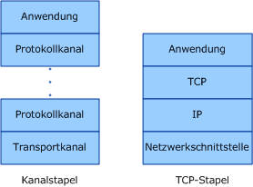
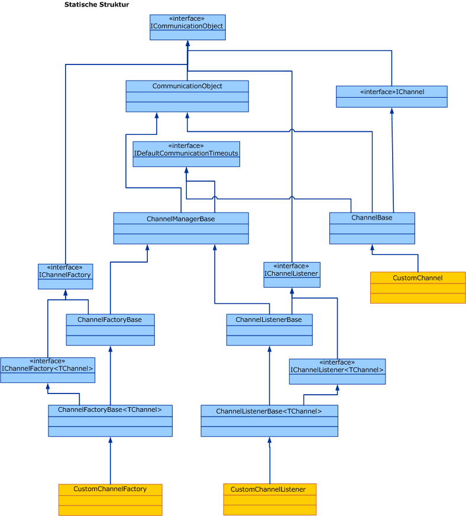

# Übersicht über das Kanalmodell

Der Windows Communication Foundation (WCF)-Kanal Stapel ist ein geschichteter Kommunikations Stapel mit einem oder mehreren Kanälen, die Nachrichten verarbeiten. Am unteren Ende des Stapels befindet sich ein Transportkanal, der für die Anpassung des Kanalstapels an den zugrunde liegenden Transport (z. B. TCP, HTTP, SMTP und andere Transportarten) zuständig ist. Kanäle stellen ein Programmiermodell auf niedriger Ebene zum Senden und Empfangen von Nachrichten bereit. Dieses Programmiermodell basiert auf mehreren Schnittstellen und anderen Typen, die gemeinsam als WCF-Kanal Modell bezeichnet werden. In diesem Thema werden Kanalformen, die Konstruktion eines grundlegenden Kanallisteners (dienstseitig) und einer Kanalfactory (clientseitig) behandelt.  
  
## Kanalstapel  

 WCF-Endpunkte kommunizieren mit der Welt über einen Kommunikations Stapel, der als Kanal Stapel bezeichnet wird. Das folgende Diagramm vergleicht den Kanalstapel mit anderen Kommunikationsstapeln, z. B. TCP/IP.  
  
   
  
 Zunächst die Ähnlichkeiten: In beiden Fällen bietet jede Schicht des Stapels eine gewisse Abstraktion der Welt unterhalb der Schicht und stellt diese Abstraktion nur der direkt darüber liegenden Schicht zur Verfügung. Jede Schicht verwendet nur die Abstraktion der direkt darunter liegenden Schicht. Außerdem kommuniziert bei der Kommunikation von zwei Schichten in beiden Fällen jede Schicht mit der entsprechenden Schicht des anderen Stapels, d. h. die IP-Schicht kommuniziert mit der IP-Schicht und die TCP-Schicht mit der TCP-Schicht usw.  
  
 Und nun die Unterschiede: Während der TCP-Stapel konzipiert wurde, um eine Abstraktion des physischen Netzwerks zur Verfügung zu stellen, soll der Kanalstapel nicht nur eine Abstraktion darüber verfügbar machen, wie die Nachricht zugestellt wird, d. h. über den Transport, sondern auch eine Abstraktion anderer Funktionen schaffen, z. B. was die Nachricht enthält oder welches Protokoll für die Kommunikation verwendet wird, einschließlich des Transports, jedoch weit darüber hinausgehend. Ein zuverlässiges Sitzungsbindungselement ist Bestandteil des Kanalstapels, befindet sich jedoch nicht unterhalb der Transportschicht oder des Transports selbst. Diese Abstraktion wird dadurch erreicht, dass der untere Kanal im Stapel das zugrunde liegende Transportprotokoll an die Kanalstapelarchitektur anpassen muss und dann auf die Kanäle weiter oben im Stapel angewiesen ist, um Kommunikationsfunktionen wie Zuverlässigkeitsgarantien und Sicherheit bereitzustellen.  
  
 Nachrichten fließen als <xref:System.ServiceModel.Channels.Message>-Objekte durch den Kommunikationsstapel. Wie in der Abbildung oben gezeigt, wird der unterste Kanal als Transportkanal bezeichnet. Dieser Kanal ist für das Senden und Empfangen von Nachrichten zu und von anderen Seiten zuständig. Dazu gehört die Zuständigkeit für das Transformieren des <xref:System.ServiceModel.Channels.Message>-Objekts in und aus dem Format, das zur Kommunikation mit anderen Seiten verwendet wird. Oberhalb des Transportkanals kann eine beliebige Zahl von Protokollkanälen vorhanden sein, wobei jeder Kanal für die Bereitstellung einer Kommunikationsfunktion sowie für zuverlässige Zustellungsgarantien verantwortlich ist. Protokollkanäle sind für Nachrichten tätig, die in Form des <xref:System.ServiceModel.Channels.Message>-Objekts durch sie hindurchfließen. Normalerweise transformieren sie entweder die Nachricht, z. B. durch Hinzufügen von Headern oder Verschlüsseln des Nachrichtentexts, oder sie senden oder empfangen eigene Protokollkontrollnachrichten, z. B. Empfangsbestätigungen.  
  
## Kanalformen  

 Jeder Kanal implementiert eine oder mehrere Schnittstellen, die als Kanalformschnittstellen oder Kanalformen bezeichnet werden. Diese Kanalformen stellen kommunikationsorientierte Methoden wie Senden und Empfangen oder Anfordern und Antworten zur Verfügung, die der Kanal implementiert und der Benutzer des Kanals aufruft. An der Basis der channelformen befindet sich die- <xref:System.ServiceModel.Channels.IChannel> Schnittstelle, bei der es sich um eine Schnittstelle handelt, die eine Methode bereitstellt, die `GetProperty` \<T> als schichtmechanismus für den Zugriff auf beliebige Features dient, die von Kanälen im Stapel Die fünf Kanalformen, die <xref:System.ServiceModel.Channels.IChannel> erweitern, sind:  
  
- <xref:System.ServiceModel.Channels.IInputChannel>  
  
- <xref:System.ServiceModel.Channels.IOutputChannel>  
  
- <xref:System.ServiceModel.Channels.IRequestChannel>  
  
- <xref:System.ServiceModel.Channels.IReplyChannel>  
  
- <xref:System.ServiceModel.Channels.IDuplexChannel>  
  
 Darüber hinaus besitzt jede dieser Formen eine Entsprechung, die <xref:System.ServiceModel.Channels.ISessionChannel%601?displayProperty=nameWithType> erweitert, um Sitzungen zu unterstützen. Diese lauten wie folgt:  
  
- <xref:System.ServiceModel.Channels.IInputSessionChannel>  
  
- <xref:System.ServiceModel.Channels.IOutputSessionChannel>  
  
- <xref:System.ServiceModel.Channels.IRequestSessionChannel>  
  
- <xref:System.ServiceModel.Channels.IReplySessionChannel>  
  
- <xref:System.ServiceModel.Channels.IDuplexSessionChannel>  
  
 Die Kanalformen sind einigen der grundlegenden Nachrichtenaustauschmuster, die von vorhandenen Transportprotokollen unterstützt werden, nachempfunden. Beispielsweise entspricht das unidirektionale Messaging einem <xref:System.ServiceModel.Channels.IInputChannel> / <xref:System.ServiceModel.Channels.IOutputChannel> Paar, Anforderung-Antwort-Paaren und bidirektionale <xref:System.ServiceModel.Channels.IRequestChannel> / <xref:System.ServiceModel.Channels.IReplyChannel> Duplex Kommunikation entspricht <xref:System.ServiceModel.Channels.IDuplexChannel> (wodurch sowohl <xref:System.ServiceModel.Channels.IInputChannel> als auch erweitert wird <xref:System.ServiceModel.Channels.IOutputChannel> ).  
  
## Programmieren mit dem Kanalstapel  

 Kanalstapel werden i. d. R. mit einem Factorymuster erstellt, in dem eine Bindung den Kanalstapel erstellt. Auf der Senderseite wird eine Bindung zum Erstellen einer <xref:System.ServiceModel.ChannelFactory> verwendet, die wiederum einen Kanalstapel erstellt und einen Verweis auf den obersten Kanal im Stapel zurückgibt. Die Anwendung kann dann diesen Kanal verwenden, um Nachrichten zu senden. Weitere Informationen finden Sie unter [Programmieren von Client Channel-Level](client-channel-level-programming.md).  
  
 Auf der Empfängerseite wird eine Bindung verwendet, um einen <xref:System.ServiceModel.Channels.IChannelListener> zu erstellen, der eingehende Nachrichten abhört. Der <xref:System.ServiceModel.Channels.IChannelListener> stellt der abhörenden Anwendung Nachrichten zur Verfügung, indem ein Kanalstapel erstellt und der Anwendungsverweis an den oberen Kanal übergeben wird. Die Anwendung verwendet diesen Kanal dann zum Empfangen eingehender Nachrichten. Weitere Informationen finden Sie unter [Programmieren von Dienst Channel-Level](service-channel-level-programming.md).  
  
## Das Kanalobjektmodell  

 Das Kanalobjektmodell stellt die Kerngruppe von Schnittstellen dar, die zur Implementierung von Kanälen, Kanallistenern und Kanalfactorys erforderlich sind. Zur Erleichterung benutzerdefinierter Implementierungen werden auch einige Basisklassen zur Verfügung gestellt.  
  
 Kanallistener sind für die Abhörung eingehender Nachrichten und für die Zustellung dieser Nachrichten an die darüber liegende Schicht über Kanäle verantwortlich, die vom Kanallistener erstellt werden.  
  
 Kanalfactorys sind für das Erstellen von Kanälen zuständig, die zum Senden von Nachrichten und zum Schließen aller Kanäle, die sie beim Schließen der Kanalfactory erstellt haben, verwendet werden.  
  
 <xref:System.ServiceModel.ICommunicationObject> ist die Kernschnittstelle, die den grundlegenden Zustandsautomaten definiert, der alle Kommunikationsobjekte implementiert. <xref:System.ServiceModel.Channels.CommunicationObject> stellt eine Implementierung dieser Kernschnittstelle bereit, die andere Kanalklassen ableiten können, statt die Schnittstelle neu zu implementieren. Aber dies ist nicht erforderlich: Ein benutzerdefinierter Kanal kann <xref:System.ServiceModel.ICommunicationObject> direkt implementieren und nicht von <xref:System.ServiceModel.Channels.CommunicationObject> erben. Keine der Klassen in Abbildung 3 gilt als Teil des Kanalmodells. Sie sind Hilfen für Implementierer von benutzerdefinierten Kanälen, die Kanäle erstellen möchten.  
  
   
  
 In den folgenden Themen werden das Kanalobjektmodell sowie verschiedene Entwicklungsbereiche beschrieben, die die Erstellung benutzerdefinierter Kanäle unterstützen.  
  
|Thema|BESCHREIBUNG|  
|-----------|-----------------|  
|[Dienst: Kanallistener und Kanäle](service-channel-listeners-and-channels.md)|Beschreibt Kanallistener, die eingehende Kanäle in einer Dienstanwendung abhört.|  
|[Client: Kanalfactorys und Kanäle](client-channel-factories-and-channels.md)|Beschreibt Kanalfactorys, die Kanäle zur Herstellung einer Verbindung mit einer Dienstanwendung erstellen.|  
|[Grundlegendes zu Zustandsänderungen](understanding-state-changes.md)|Beschreibt, wie die <xref:System.ServiceModel.ICommunicationObject?displayProperty=nameWithType>-Schnittstelle Zustandsänderungen in Kanälen modelliert.|  
|[Auswählen eines Nachrichtenaustauschmusters](choosing-a-message-exchange-pattern.md)|Beschreibt die sechs grundlegenden Nachrichtenaustauschmuster, die Kanäle unterstützen können.|  
|[Behandeln von Ausnahmen und Fehlern](handling-exceptions-and-faults.md)|Beschreibt, wie Fehler und Ausnahmen in benutzerdefinierten Kanälen behandelt werden.|  
|[Konfiguration und Metadatenunterstützung](configuration-and-metadata-support.md)|Beschreibt, wie die Verwendung von benutzerdefinierten Kanälen im Anwendungsmodell unterstützt wird und Metadaten mit Bindungen und Bindungselementen exportiert und importiert werden.|
