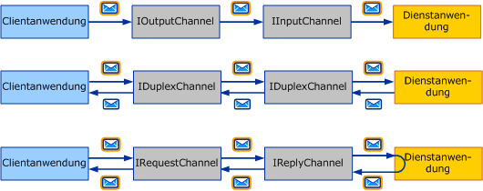
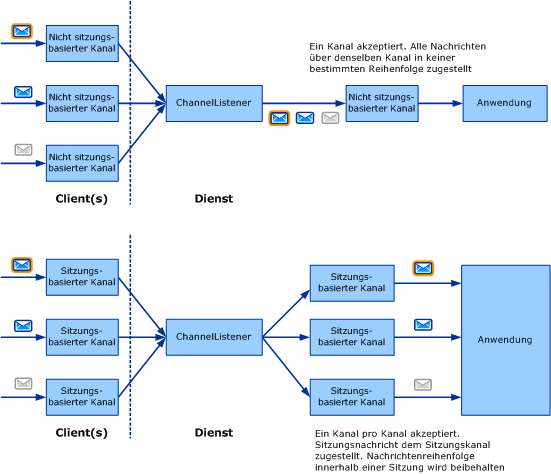

# Auswählen eines Nachrichtenaustauschmusters

Der erste Schritt beim Schreiben eines benutzerdefinierten Transports besteht darin, zu entscheiden, welche *Nachrichtenaustausch Muster* (oder die einzelnen Kollegen) für den von Ihnen entwickelten Kanal erforderlich sind. In diesem Thema werden die verfügbaren Optionen beschrieben und die verschiedenen Anforderungen erläutert. Dies ist die erste Aufgabe in der Aufgabenliste für die Kanalentwicklung, die unter [entwickeln von Kanälen](developing-channels.md)beschrieben wird.  
  
## Sechs Nachrichtenaustauschmuster  

 Es stehen drei Nachrichtenaustauschmuster zur Auswahl:  
  
- Datagramm (<xref:System.ServiceModel.Channels.IInputChannel> und <xref:System.ServiceModel.Channels.IOutputChannel>)  
  
     Wenn ein Datagramm-Nachrichtenaustausch verwendet wird, sendet ein Client eine Nachricht mit einem " *Fire and Forget"-* Austausch. Ein "fire and forget"-Austausch erfordert eine Out-of-Band-Bestätigung für die erfolgreiche Zustellung. Die Nachricht könnte unterwegs verloren gehen und den Dienst nicht erreichen. Wenn der Sendevorgang auf der Clientseite erfolgreich abgeschlossen wird, stellt dies keine Garantie dar, dass der Remoteendpunkt die Nachricht erhalten hat. Das Datagramm ist ein wesentlicher Baustein für den Nachrichtenaustausch, da Sie eigene Protokolle damit erstellen können, einschließlich zuverlässiger Protokolle und sicherer Protokolle. Clientdatagrammkanäle implementieren die <xref:System.ServiceModel.Channels.IOutputChannel>-Schnittstelle, und Dienstdatagrammkanäle implementieren die <xref:System.ServiceModel.Channels.IInputChannel>-Schnittstelle.  
  
- Anforderung-Antwort (<xref:System.ServiceModel.Channels.IRequestChannel> und <xref:System.ServiceModel.Channels.IReplyChannel>)  
  
     In diesem Nachrichtenaustauschmuster wird eine Nachricht gesendet, und eine Antwort wird empfangen. Das Muster besteht aus Anforderungs-Antwort-Paaren. Beispiele für Anforderung-Antwort-Aufrufe sind Remoteprozeduraufrufe (RPC) und Browser-GET-Anforderungen. Dieses Muster wird auch als Halbduplex bezeichnet. In diesem Nachrichtenaustauschmuster implementieren Clientkanäle <xref:System.ServiceModel.Channels.IRequestChannel>, und Dienstkanäle implementieren <xref:System.ServiceModel.Channels.IReplyChannel>.  
  
- Duplex (<xref:System.ServiceModel.Channels.IDuplexChannel>)  
  
     Das Duplex-Nachrichtenaustauschmuster ermöglicht, dass eine willkürliche Anzahl von Nachrichten von einem Client gesendet und in beliebiger Reihenfolge empfangen wird. Das Duplex-Nachrichtenaustauschmuster ist mit einem Telefongespräch vergleichbar, bei dem jedes gesprochene Wort einer Nachricht entspricht. Da beide Teilnehmer in diesem Nachrichtenaustauschmuster senden und empfangen können, ist die vom Client und von den Dienstkanälen implementierte Schnittstelle <xref:System.ServiceModel.Channels.IDuplexChannel>.  
  
   
Die drei grundlegenden Nachrichtenaustauschmuster von oben nach unten: Datagramm, Anforderung-Antwort und Duplex.  
  
 Alle diese Abgeordneten können auch *Sitzungen* unterstützen. Eine Sitzung (und Implementierung von <xref:System.ServiceModel.Channels.ISessionChannel%601?displayProperty=nameWithType> des Typs <xref:System.ServiceModel.Channels.ISession?displayProperty=nameWithType>) korreliert alle in einem Kanal gesendeten und empfangenen Nachrichten. Das Anforderung-Antwort-Muster ist eine eigenständige, aus zwei Nachrichten bestehende Sitzung, da die Anforderung und die Antwort korreliert werden. Demgegenüber impliziert das Anforderung-Antwort-Muster, das Sitzungen unterstützt, dass alle Anforderung/Antwort-Paare in diesem Kanal miteinander korreliert werden. Daher stehen insgesamt sechs Nachrichtenaustauschmuster zur Auswahl:  
  
- Datagramm  
  
- Anforderung-Antwort  
  
- Duplex  
  
- Datagramm mit Sitzungen  
  
- Anforderung-Antwort mit Sitzungen  
  
- Duplex mit Sitzungen  
  
> [!NOTE]
> Für den UDP-Transport wird nur das Nachrichtenaustauschmuster Datagramm unterstützt, da UDP grundsätzlich ein "fire and forget"-Protokoll ist.  
  
## Sitzungen und sitzungsbasierte Kanäle  

 Im Bereich der Netzwerke gibt es verbindungsorientierte Protokolle (z. B. TCP) und verbindungslose Protokolle (z. B. UDP). WCF verwendet den Begriff Sitzung, um eine Verbindungs ähnliche logische Abstraktion zu bedeuten. Sitzungsbasierte WCF-Protokolle sind mit verbindungsorientierten Netzwerkprotokollen vergleichbar, und nicht sitzungsbasierte Protokolle entsprechen verbindungslosen Netzwerkprotokollen.  
  
 Im Kanalobjektmodell manifestiert sich jede logische Sitzung als Instanz eines sitzungsbasierten Kanals. Daher entspricht jede neue vom Client erstellte und vom Dienst akzeptierte Sitzung einem neuen sitzungsbasierten Kanal auf jeder Seite. Das folgende Diagramm zeigt oben die Struktur nicht sitzungsbasierter Kanäle und unten die Struktur sitzungsbasierter Kanäle.  
  
   
  
 Ein Client erstellt einen neuen sitzungsbasierten Kanal und sendet eine Nachricht. Auf der Dienstseite empfängt der Kanallistener diese Nachricht und erkennt, dass sie zu einer neuen Sitzung gehört. Daraufhin erstellt er einen neuen sitzungsbasierten Kanal und übergibt diesen an die Anwendung (als Antwort auf den AcceptChannel-Aufruf der Anwendung im Kanallistener). Die Anwendung empfängt dann diese Nachricht sowie alle nachfolgenden Nachrichten, die in derselben Sitzung über denselben sitzungsbasierten Kanal gesendet werden.  
  
 Ein anderer (oder derselbe) Client erstellt einen neuen sitzungsbasierten Kanal und sendet eine Nachricht. Der Kanallistener erkennt, dass diese Nachricht in einer neuen Sitzung enthalten ist, und erstellt einen neuen sitzungsbasierten Kanal. Der Vorgang wird wiederholt.  
  
 Ohne Sitzungen gibt es keine Korrelation zwischen Kanälen und Sitzungen. Daher erstellt ein Kanallistener nur einen Kanal, über den alle empfangenen Nachrichten der Anwendung zugestellt werden. Es gibt auch keine Nachrichtenreihenfolge, da es keine Sitzung gibt, in der die Nachrichtenreihenfolge beibehalten werden muss. Der oberste Teil der vorangehenden Grafik illustriert einen nicht sitzungsbasierten Nachrichtenaustausch.  
  
## Beginnen und Beenden von Sitzungen  

 Sitzungen werden auf dem Client begonnen, indem einfach ein neuer sitzungsbasierter Kanal erstellt wird. Sie werden im Dienst gestartet, wenn der Dienst eine Nachricht empfängt, die in einer neuen Sitzung gesendet wurde. Ebenso werden Sitzungen durch Schließen oder Abbrechen eines sitzungsbasierten Kanals beendet.  
  
 Eine Ausnahme hierzu bildet <xref:System.ServiceModel.Channels.IDuplexSessionChannel>, der sowohl zum Senden als auch zum Empfangen von Nachrichten in einem sitzungsbasierten Duplexkommunikationsmuster verwendet wird. Es ist möglich, dass eine Seite das Senden von Nachrichten stoppen, jedoch weiterhin Nachrichten empfangen möchte. Daher gibt es beim Verwenden von <xref:System.ServiceModel.Channels.IDuplexSessionChannel> einen Mechanismus, mit dem Sie die Ausgabesitzung schließen können, was darauf hinweist, dass Sie keine weiteren Nachrichten senden, jedoch die Eingabesitzung geöffnet lassen, sodass Sie weiterhin Nachrichten empfangen können.  
  
 Im Allgemeinen werden Sitzungen auf der ausgehenden und nicht auf der eingehenden Seite geschlossen, d. h. sitzungsbasierte Ausgabekanäle können geschlossen werden, und dadurch kann die Sitzung ordnungsgemäß beendet werden. Durch Schließen eines sitzungsbasierten Ausgabekanals gibt der entsprechende sitzungsbasierte Eingabekanal NULL an die Anwendung zurück mit dem Aufruf <xref:System.ServiceModel.Channels.IInputChannel.Receive%2A?displayProperty=nameWithType> auf dem <xref:System.ServiceModel.Channels.IDuplexSessionChannel>.  
  
 Sitzungsbasierte Eingabekanäle sollten jedoch nur geschlossen werden, wenn <xref:System.ServiceModel.Channels.IInputChannel.Receive%2A?displayProperty=nameWithType> auf dem <xref:System.ServiceModel.Channels.IDuplexSessionChannel> NULL zurückgibt, was darauf hinweist, dass die Sitzung bereits geschlossen wurde. Wenn <xref:System.ServiceModel.Channels.IInputChannel.Receive%2A?displayProperty=nameWithType> auf dem <xref:System.ServiceModel.Channels.IDuplexSessionChannel> nicht NULL zurückgegeben hat, kann das Schließen eines sitzungsbasierten Eingabekanals eine Ausnahme auslösen, da während des Schließens unerwartete Nachrichten empfangen werden können. Wenn ein Empfänger eine Sitzung beenden möchte, bevor der Absender dies tut, sollte er <xref:System.ServiceModel.ICommunicationObject.Abort%2A> im Eingabekanal aufrufen, wodurch die Sitzung sofort beendet wird.  
  
## Schreiben von sitzungsbasierten Kanälen  

 Als sitzungsbasierter Kanalautor muss Ihr Kanal einige Voraussetzungen erfüllen, um Sitzungen bereitzustellen. Auf der Senderseite muss Ihr Kanal Folgendes erfüllen:  
  
- Erstellen Sie für jeden neuen Kanal eine neue Sitzung, und verknüpfen Sie sie mit einer neuen Sitzungs-ID, die einer eindeutigen Zeichenfolge entspricht. Oder rufen Sie unterhalb im Stapel eine neue Sitzung aus dem sitzungsbasierten Kanal ab.  
  
- Für jede mit diesem Kanal gesendete Nachricht müssen Sie die Nachricht mit der Sitzung verknüpfen, wenn Ihr Kanal die Sitzung erstellt hat (statt sie von der Ebene unterhalb zu erhalten). Für Protokollkanäle wird dies i. d. R. durch Hinzufügen eines SOAP-Headers ausgeführt. Für Transportkanäle wird dies durch Erstellen einer neuen Transportverbindung oder durch Hinzufügen von Sitzungsinformationen zum Framing-Protokoll ausgeführt.  
  
- Für jede über diesen Kanal gesendete Nachricht müssen Sie die oben erwähnten Zustellungsgarantien zur Verfügung stellen. Wenn Sie den Kanal unterhalb zur Bereitstellung der Sitzung verwenden, stellt dieser Kanal auch die Zustellungsgarantien zur Verfügung. Wenn Sie die Sitzung selbst zur Verfügung stellen, müssen Sie diese Garantien als Teil des Protokolls implementieren. Wenn Sie einen Protokollkanal schreiben, der WCF auf beiden Seiten voraussetzt, benötigen Sie im Allgemeinen den TCP-Transportkanal oder den Kanal für zuverlässiges Messaging und sind auf einen der beiden Kanäle zur Bereitstellung einer Sitzung angewiesen.  
  
- Wenn <xref:System.ServiceModel.ICommunicationObject.Close%2A?displayProperty=nameWithType> auf Ihrem Kanal aufgerufen wird, führen Sie die notwendigen Schritte zum Schließen der Sitzung aus, indem Sie entweder den angegebenen Timeout oder den Standardwert verwenden. Dazu brauchen Sie möglicherweise nur <xref:System.ServiceModel.ICommunicationObject.Close%2A> auf dem Kanal unterhalb aufzurufen (wenn Sie die Sitzung soeben von diesem erhalten haben), eine spezielle SOAP-Nachricht zu senden oder eine Transportverbindung zu schließen.  
  
- Wenn <xref:System.ServiceModel.ICommunicationObject.Abort%2A> auf dem Kanal aufgerufen wird, beenden Sie die Sitzung unvermittelt, ohne E/A auszuführen. Dies bedeutet möglicherweise, nichts zu machen oder eine Netzwerkverbindung oder eine andere Ressource abzubrechen.  
  
 Auf der Empfängerseite muss Ihr Kanal Folgendes erfüllen:  
  
- Für jede eingehende Nachricht muss der Kanallistener die Sitzung erkennen, zu der sie gehört. Wenn es sich dabei um die erste Nachricht in der Sitzung handelt, muss der Kanallistener einen neuen Kanal erstellen und ihn vom Aufruf an <xref:System.ServiceModel.Channels.IChannelListener%601.AcceptChannel%2A?displayProperty=nameWithType> zurückgeben. Andernfalls muss der Kanallistener den vorhandenen Kanal, der der Sitzung entspricht, suchen und die Nachricht über den Kanal zustellen.  
  
- Wenn Ihr Kanal die Sitzung (sowie die erforderlichen Zustellungsgarantien) bereitstellt, muss die Empfängerseite möglicherweise einige Aktionen ausführen, wie die Nachrichtenreihenfolge ändern oder Bestätigungen senden.  
  
- Wenn <xref:System.ServiceModel.ICommunicationObject.Close%2A> auf Ihrem Kanal aufgerufen wird, führen Sie die notwendigen Schritte zum Schließen der Sitzung aus, indem Sie entweder den angegebenen Timeout oder den Standardwert verwenden. Es könnten Ausnahmen ausgelöst werden, wenn der Kanal eine Nachricht empfängt, während er darauf wartet, dass der Schließen-Timeout abläuft. Der Grund dafür ist, dass sich der Kanal im Schließen-Zustand befindet, wenn er eine Nachricht empfängt. Daher wird eine Ausnahme ausgelöst.  
  
- Wenn <xref:System.ServiceModel.ICommunicationObject.Abort%2A> auf dem Kanal aufgerufen wird, beenden Sie die Sitzung unvermittelt, ohne E/A auszuführen. Dies bedeutet möglicherweise, nichts zu machen oder eine Netzwerkverbindung oder eine andere Ressource abzubrechen.  
  
## Weitere Informationen

- [Übersicht über das Kanalmodell](channel-model-overview.md)
