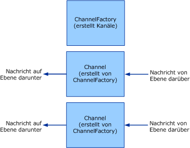

# <a name="client-channel-factories-and-channels"></a><span data-ttu-id="1f11f-102">Client: Kanalfactorys und Kanäle</span><span class="sxs-lookup"><span data-stu-id="1f11f-102">Client: Channel Factories and Channels</span></span>

<span data-ttu-id="1f11f-103">In diesem Thema wird die Erstellung von Kanalfactorys und Kanälen erläutert.</span><span class="sxs-lookup"><span data-stu-id="1f11f-103">This topic discusses the creation of channel factories and channels.</span></span>  
  
## <a name="channel-factories-and-channels"></a><span data-ttu-id="1f11f-104">Kanalfactorys und Kanäle</span><span class="sxs-lookup"><span data-stu-id="1f11f-104">Channel Factories and Channels</span></span>  

 <span data-ttu-id="1f11f-105">Kanalfactorys sind für das Erstellen von Kanälen zuständig.</span><span class="sxs-lookup"><span data-stu-id="1f11f-105">Channel factories are responsible for creating channels.</span></span> <span data-ttu-id="1f11f-106">Von Kanalfactorys erstellte Kanäle werden zum Senden von Nachrichten verwendet.</span><span class="sxs-lookup"><span data-stu-id="1f11f-106">Channels created by channel factories are used for sending messages.</span></span> <span data-ttu-id="1f11f-107">Diese Kanäle dienen dem Abrufen von Nachrichten von der oberen Ebene. Die Kanäle führen jede erforderliche Verarbeitung aus und senden anschließend die Nachricht an die untere Ebene.</span><span class="sxs-lookup"><span data-stu-id="1f11f-107">These channels are responsible for getting the message from the layer above, performing whatever processing is necessary, then sending the message to the layer below.</span></span> <span data-ttu-id="1f11f-108">Dieser Vorgang wird in der folgenden Grafik dargestellt.</span><span class="sxs-lookup"><span data-stu-id="1f11f-108">The following graphic illustrates this process.</span></span>  
  
 <span data-ttu-id="1f11f-109"></span><span class="sxs-lookup"><span data-stu-id="1f11f-109"></span></span>  
<span data-ttu-id="1f11f-110">Eine Kanalfactory dient zum Erstellen von Kanälen.</span><span class="sxs-lookup"><span data-stu-id="1f11f-110">A channel factory creates channels.</span></span>  
  
 <span data-ttu-id="1f11f-111">Bei der Schließung von Kanalfactorys sind diese für das Schließen aller von ihnen erstellten Kanäle zuständig, die noch nicht geschlossen wurden.</span><span class="sxs-lookup"><span data-stu-id="1f11f-111">When closed, channel factories are responsible for closing any channels they created that are not yet closed.</span></span> <span data-ttu-id="1f11f-112">Das Modell wird hier asymmetrisch dargestellt, da ein Kanallistener bei seiner Schließung zwar keine neuen Kanäle mehr akzeptiert, vorhandene Kanäle jedoch geöffnet bleiben, damit von diesen weiterhin Nachrichten empfangen werden können.</span><span class="sxs-lookup"><span data-stu-id="1f11f-112">Note that the model is asymmetric here because when a channel listener is closed, it only stops accepting new channels but leaves existing channels open so that they can continue receiving messages.</span></span>  
  
 <span data-ttu-id="1f11f-113">WCF stellt Basisklassen Hilfen für diesen Prozess bereit.</span><span class="sxs-lookup"><span data-stu-id="1f11f-113">WCF provides base class helpers for this process.</span></span> <span data-ttu-id="1f11f-114">(Ein Diagramm der in diesem Thema erläuterten kanalhilfsobjekte finden Sie unter [Übersicht über das Kanal Modell](channel-model-overview.md).)</span><span class="sxs-lookup"><span data-stu-id="1f11f-114">(For a diagram of the channel helper classes discussed in this topic, see [Channel Model Overview](channel-model-overview.md).)</span></span>  
  
- <span data-ttu-id="1f11f-115">Die <xref:System.ServiceModel.Channels.CommunicationObject> -Klasse implementiert <xref:System.ServiceModel.ICommunicationObject> und erzwingt den Zustands Automat, der in Schritt 2 der [Entwicklung von Kanälen](developing-channels.md)beschrieben wird.</span><span class="sxs-lookup"><span data-stu-id="1f11f-115">The <xref:System.ServiceModel.Channels.CommunicationObject> class implements <xref:System.ServiceModel.ICommunicationObject> and enforces the state machine described in step 2 of [Developing Channels](developing-channels.md).</span></span>  
  
- <span data-ttu-id="1f11f-116">Die <xref:System.ServiceModel.Channels.ChannelManagerBase> -Klasse implementiert <xref:System.ServiceModel.Channels.CommunicationObject> und stellt eine einheitliche Basisklasse für <xref:System.ServiceModel.Channels.ChannelFactoryBase?displayProperty=nameWithType> und bereit <xref:System.ServiceModel.Channels.ChannelListenerBase?displayProperty=nameWithType> .</span><span class="sxs-lookup"><span data-stu-id="1f11f-116">The <xref:System.ServiceModel.Channels.ChannelManagerBase> class implements <xref:System.ServiceModel.Channels.CommunicationObject> and provides a unified base class for <xref:System.ServiceModel.Channels.ChannelFactoryBase?displayProperty=nameWithType> and <xref:System.ServiceModel.Channels.ChannelListenerBase?displayProperty=nameWithType>.</span></span> <span data-ttu-id="1f11f-117">Die <xref:System.ServiceModel.Channels.ChannelManagerBase>-Klasse funktioniert in Verbindung mit <xref:System.ServiceModel.Channels.ChannelBase>. Dies ist eine Basisklasse, die <xref:System.ServiceModel.Channels.IChannel> implementiert.</span><span class="sxs-lookup"><span data-stu-id="1f11f-117">The <xref:System.ServiceModel.Channels.ChannelManagerBase> class works in conjunction with <xref:System.ServiceModel.Channels.ChannelBase>, which is a base class that implements <xref:System.ServiceModel.Channels.IChannel>.</span></span>
  
- <span data-ttu-id="1f11f-118">Die <xref:System.ServiceModel.Channels.ChannelFactoryBase> -Klasse implementiert <xref:System.ServiceModel.Channels.ChannelManagerBase> und <xref:System.ServiceModel.Channels.IChannelFactory> und konsolidiert die- `CreateChannel` über Ladungen in einer `OnCreateChannel` abstrakten Methode.</span><span class="sxs-lookup"><span data-stu-id="1f11f-118">The <xref:System.ServiceModel.Channels.ChannelFactoryBase> class implements <xref:System.ServiceModel.Channels.ChannelManagerBase> and <xref:System.ServiceModel.Channels.IChannelFactory> and consolidates the `CreateChannel` overloads into one `OnCreateChannel` abstract method.</span></span>
  
- <span data-ttu-id="1f11f-119">Die- <xref:System.ServiceModel.Channels.ChannelListenerBase> Klasse implementiert <xref:System.ServiceModel.Channels.IChannelListener> .</span><span class="sxs-lookup"><span data-stu-id="1f11f-119">The <xref:System.ServiceModel.Channels.ChannelListenerBase> class implements <xref:System.ServiceModel.Channels.IChannelListener>.</span></span> <span data-ttu-id="1f11f-120">Die Klasse wird für grundlegende Zustandsverwaltung verwendet.</span><span class="sxs-lookup"><span data-stu-id="1f11f-120">It takes care of basic state management.</span></span>
  
 <span data-ttu-id="1f11f-121">Die folgende Erörterung basiert auf dem " [Transport: UDP](../samples/transport-udp.md) "-Beispiel.</span><span class="sxs-lookup"><span data-stu-id="1f11f-121">The following discussion is based upon the [Transport: UDP](../samples/transport-udp.md) sample.</span></span>  
  
### <a name="creating-a-channel-factory"></a><span data-ttu-id="1f11f-122">Erstellen einer Kanalfactory</span><span class="sxs-lookup"><span data-stu-id="1f11f-122">Creating a Channel Factory</span></span>  

 <span data-ttu-id="1f11f-123">Die `UdpChannelFactory` wird von <xref:System.ServiceModel.Channels.ChannelFactoryBase> abgeleitet.</span><span class="sxs-lookup"><span data-stu-id="1f11f-123">The `UdpChannelFactory` derives from <xref:System.ServiceModel.Channels.ChannelFactoryBase>.</span></span> <span data-ttu-id="1f11f-124">Das Beispiel überschreibt <xref:System.ServiceModel.Channels.ChannelFactoryBase.GetProperty%2A>, um Zugriff auf die Nachrichtenversion des Nachrichtenencoders zu gewähren.</span><span class="sxs-lookup"><span data-stu-id="1f11f-124">The sample overrides <xref:System.ServiceModel.Channels.ChannelFactoryBase.GetProperty%2A> to provide access to the message version of the message encoder.</span></span> <span data-ttu-id="1f11f-125">Das Beispiel überschreibt auch <xref:System.ServiceModel.Channels.ChannelFactoryBase.OnClose%2A>, um beim Übergang des Zustandsautomaten die Instanz von <xref:System.ServiceModel.Channels.BufferManager> zu beenden.</span><span class="sxs-lookup"><span data-stu-id="1f11f-125">The sample also overrides <xref:System.ServiceModel.Channels.ChannelFactoryBase.OnClose%2A> to tear down our instance of <xref:System.ServiceModel.Channels.BufferManager> when the state machine transitions.</span></span>  
  
#### <a name="the-udp-output-channel"></a><span data-ttu-id="1f11f-126">Der UDP-Ausgabekanal</span><span class="sxs-lookup"><span data-stu-id="1f11f-126">The UDP Output Channel</span></span>  

 <span data-ttu-id="1f11f-127">Der `UdpOutputChannel` implementiert <xref:System.ServiceModel.Channels.IOutputChannel>.</span><span class="sxs-lookup"><span data-stu-id="1f11f-127">The `UdpOutputChannel` implements <xref:System.ServiceModel.Channels.IOutputChannel>.</span></span> <span data-ttu-id="1f11f-128">Der Konstruktor überprüft die Argumente und erstellt ein Ziel-<xref:System.Net.EndPoint>-Objekt, das auf der übergebenen <xref:System.ServiceModel.EndpointAddress> basiert.</span><span class="sxs-lookup"><span data-stu-id="1f11f-128">The constructor validates the arguments and constructs a destination <xref:System.Net.EndPoint> object based on the <xref:System.ServiceModel.EndpointAddress> that is passed in.</span></span>  
  
 <span data-ttu-id="1f11f-129">Durch die Überschreibung von <xref:System.ServiceModel.Channels.CommunicationObject.OnOpen%2A> wird ein Socket erstellt, der zum Senden von Nachrichten an diesen <xref:System.Net.EndPoint> verwendet wird.</span><span class="sxs-lookup"><span data-stu-id="1f11f-129">The override of <xref:System.ServiceModel.Channels.CommunicationObject.OnOpen%2A> creates a socket that is used to send messages to this <xref:System.Net.EndPoint>.</span></span>  
  
 ```csharp
this.socket = new Socket(  
this.remoteEndPoint.AddressFamily,
   SocketType.Dgram,
   ProtocolType.Udp
);  
```  

 <span data-ttu-id="1f11f-130">Der Kanal kann ordnungsgemäß oder nicht ordnungsgemäß geschlossen werden.</span><span class="sxs-lookup"><span data-stu-id="1f11f-130">The channel can be closed gracefully or ungracefully.</span></span> <span data-ttu-id="1f11f-131">Bei ordnungsgemäßer Schließung wird der Socket geschlossen, und die `OnClose`-Methode der Basisklasse wird aufgerufen.</span><span class="sxs-lookup"><span data-stu-id="1f11f-131">If the channel is closed gracefully the socket is closed and a call is made to the base class `OnClose` method.</span></span> <span data-ttu-id="1f11f-132">Wenn dadurch eine Ausnahme ausgelöst wird, ruft die Infrastruktur `Abort` auf, um sicherzustellen, dass der Kanal bereinigt wird.</span><span class="sxs-lookup"><span data-stu-id="1f11f-132">If this throws an exception, the infrastructure calls `Abort` to ensure the channel is cleaned up.</span></span>  
  
```csharp  
this.socket.Close();  
base.OnClose(timeout);  
```  
  
 <span data-ttu-id="1f11f-133">Implementieren Sie `Send()` und `BeginSend()` / `EndSend()` .</span><span class="sxs-lookup"><span data-stu-id="1f11f-133">Implement `Send()` and `BeginSend()`/`EndSend()`.</span></span> <span data-ttu-id="1f11f-134">Dieser Vorgang ist in zwei Hauptabschnitte unterteilt.</span><span class="sxs-lookup"><span data-stu-id="1f11f-134">This breaks down into two main sections.</span></span> <span data-ttu-id="1f11f-135">Serialisieren Sie zuerst die Nachricht in ein Bytearray:</span><span class="sxs-lookup"><span data-stu-id="1f11f-135">First serialize the message into a byte array:</span></span>  
  
```csharp  
ArraySegment<byte> messageBuffer = EncodeMessage(message);  
```  
  
 <span data-ttu-id="1f11f-136">Senden Sie anschließend die resultierenden Daten:</span><span class="sxs-lookup"><span data-stu-id="1f11f-136">Then send the resulting data on the wire:</span></span>  
  
```csharp  
this.socket.SendTo(  
  messageBuffer.Array,
  messageBuffer.Offset,
  messageBuffer.Count,
  SocketFlags.None,
  this.remoteEndPoint  
);  
```  
  
## <a name="see-also"></a><span data-ttu-id="1f11f-137">Weitere Informationen</span><span class="sxs-lookup"><span data-stu-id="1f11f-137">See also</span></span>

- [<span data-ttu-id="1f11f-138">Entwickeln von Kanälen</span><span class="sxs-lookup"><span data-stu-id="1f11f-138">Developing Channels</span></span>](developing-channels.md)
