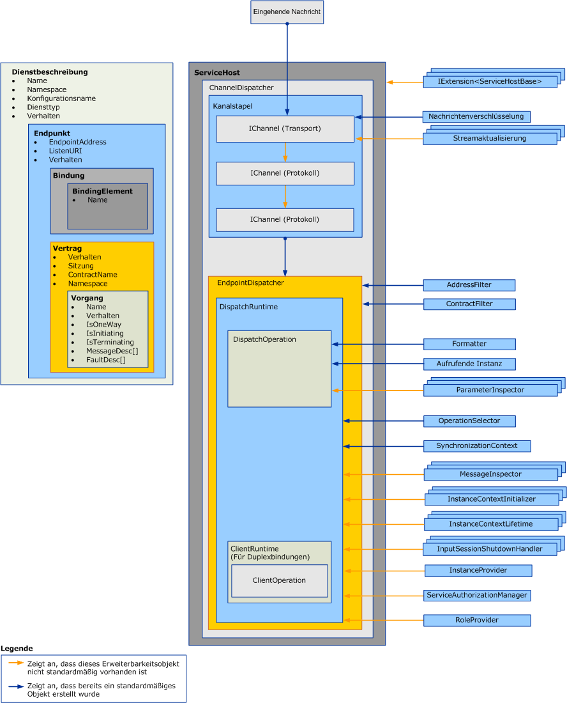

# Erweitern von VerteilernExtending Dispatchers

Verteiler sind dafür verantwortlich, eingehende Nachrichten aus den zugrunde liegenden Kanälen abzufangen, sie in Methodenaufrufe im Anwendungscode zu übersetzen und die Ergebnisse zurück an den Aufrufer zu senden.Dispatchers are responsible for pulling incoming messages out of the underlying channels, translating them into method invocations in application code, and sending the results back to the caller. Verteilererweiterungen versetzen Sie in die Lage, diese Verarbeitung zu ändern.Dispatcher extensions allow you to modify this processing.  Sie können Nachrichten- oder Parameterinspektoren implementieren, die den Inhalt von Nachrichten oder Parametern überprüfen bzw. ändern.You can implement message or parameter inspectors that inspect or modify the contents of messages or parameters.  Sie können die Weiterleitung von Nachrichten an Vorgänge ändern oder andere Funktionalität bereitstellen.You can change the way messages are routed to operations or provide some other functionality.

In diesem Thema wird beschrieben, wie <xref:System.ServiceModel.Dispatcher.DispatchRuntime> Sie die-Klasse und die- <xref:System.ServiceModel.Dispatcher.DispatchOperation> Klasse in einer Windows Communication Foundation (WCF)-Dienst Anwendung verwenden, um das Standard Ausführungs Verhalten eines Verteilers zu ändern oder um Nachrichten, Parameter oder Rückgabewerte abzufangen oder zu ändern, bevor Sie von der Kanal Schicht gesendet oder abgerufen werden.This topic describes how to use the <xref:System.ServiceModel.Dispatcher.DispatchRuntime> and <xref:System.ServiceModel.Dispatcher.DispatchOperation> classes in a Windows Communication Foundation (WCF) service application to modify the default execution behavior of a dispatcher or to intercept or modify messages, parameters, or return values prior to or subsequent to sending or retrieving them from the channel layer. Weitere Informationen zur entsprechenden Client Lauf Zeit Nachrichtenverarbeitung finden Sie unter [Erweitern von Clients](extending-clients.md).For more information about the equivalent client runtime message processing, see [Extending Clients](extending-clients.md). Informationen über die Rolle, die <xref:System.ServiceModel.IExtensibleObject%601> Typen beim Zugriff auf den gemeinsamen Zustand zwischen verschiedenen Lauf Zeit Anpassungs Objekten spielen, finden Sie unter [erweiterbare Objekte](extensible-objects.md).To understand the role that <xref:System.ServiceModel.IExtensibleObject%601> types play in accessing shared state between various runtime customization objects, see [Extensible Objects](extensible-objects.md).

## VerteilerDispatchers

Die Dienstmodellebene führt die Konvertierung zwischen dem Programmiermodell des Entwicklers und dem zugrunde liegenden Nachrichtenaustausch, gewöhnlich als Kanalschicht bezeichnet, durch.The service model layer performs the conversion between the developer’s programming model and the underlying message exchange, commonly called the channel layer. In WCF sind die Kanal-und Endpunkt Verteiler <xref:System.ServiceModel.Dispatcher.ChannelDispatcher> ( <xref:System.ServiceModel.Dispatcher.EndpointDispatcher> bzw.) die Dienst Komponenten, die für das akzeptieren neuer Kanäle, das Empfangen von Nachrichten, die Verteilung und den Aufruf von Vorgängen sowie die Verarbeitung von Antworten zuständig sind.In WCF the channel and endpoint dispatchers (<xref:System.ServiceModel.Dispatcher.ChannelDispatcher> and <xref:System.ServiceModel.Dispatcher.EndpointDispatcher>, respectively) are the service components responsible for accepting new channels, receiving messages, operation dispatch and invocation, and response processing. Verteilerobjekte sind empfangende Objekte, aber auch Rückrufvertragsimplementierungen in Duplexdiensten machen ihre Verteilerobjekte für Überprüfung, Änderung oder Erweiterung verfügbar.Dispatcher objects are receiver objects, but callback contract implementations in duplex services also expose their dispatcher objects for inspection, modification, or extension.

Der Kanalverteiler (und der zugehörige <xref:System.ServiceModel.Channels.IChannelListener>) fangen eingehende Nachrichten aus den zugrunde liegenden Kanälen ab und übergeben diese Nachrichten ihren jeweiligen Endpunktverteilern.The channel dispatcher (and companion <xref:System.ServiceModel.Channels.IChannelListener>) pulls messages out of the underling channel and passes the messages to their respective endpoint dispatchers. Jeder Endpunktverteiler hat eine <xref:System.ServiceModel.Dispatcher.DispatchRuntime>, die die Nachrichten an die entsprechende <xref:System.ServiceModel.Dispatcher.DispatchOperation> weiterleitet, die für den Aufruf der Methode verantwortlich ist, die den Vorgang implementiert.Each endpoint dispatcher has a <xref:System.ServiceModel.Dispatcher.DispatchRuntime> that routes messages to the appropriate <xref:System.ServiceModel.Dispatcher.DispatchOperation>, which is responsible for calling the method that implements the operation. Dabei werden verschiedene optionale und notwendige Erweiterungsklassen aufgerufen.Various optional and required extension classes are invoked along the way. In diesem Thema wird erklärt, wie diese Elemente zusammenpassen, und wie Sie deren Eigenschaften ändern und eigenen Code schreiben, um die Basisfunktionalität zu erweitern.This topic explains how these pieces fit together, and how you might modify properties and plug your own code in to extend the base functionality.

Verteilereigenschaften und geänderte Anpassungsobjekte werden mithilfe von Dienst-, Endpunkt-, Vertrags- und Vorgangsverhaltensobjekten eingefügt.Dispatcher properties and modified customization objects are inserted by using service, endpoint, contract, or operation behavior objects. In diesem Thema wird nicht beschrieben, wie Verhaltensobjekte verwendet werden.This topic does not describe how to use behaviors. Weitere Informationen zu den Typen, die zum Einfügen von Verteiler-Änderungen verwendet werden, finden Sie unter [Konfigurieren und Erweitern der Laufzeit mit Verhalten](configuring-and-extending-the-runtime-with-behaviors.md).For more information about the types used to insert dispatcher modifications, see [Configuring and Extending the Runtime with Behaviors](configuring-and-extending-the-runtime-with-behaviors.md).

Die folgende Grafik bietet einen Überblick über die architektonischen Elemente in einem Dienst.The following graphic provides a high-level view of the architectural items in a service.

### KanalverteilerChannel Dispatchers

Ein <xref:System.ServiceModel.Dispatcher.ChannelDispatcher>-Objekt wird erstellt, um einen <xref:System.ServiceModel.Channels.IChannelListener> an einem bestimmten URI (als Abhör-URI bezeichnet) einer Instanz eines Diensts zuzuordnen.A <xref:System.ServiceModel.Dispatcher.ChannelDispatcher> object is created to associate an <xref:System.ServiceModel.Channels.IChannelListener> at a particular URI (called a listen URI) with an instance of a service. Jedes <xref:System.ServiceModel.ServiceHost>-Objekt kann über viele <xref:System.ServiceModel.Dispatcher.ChannelDispatcher>-Objekte verfügen, die jeweils einem Listener und einem Abhör-URI zugeordnet sind.Each <xref:System.ServiceModel.ServiceHost> object can have many <xref:System.ServiceModel.Dispatcher.ChannelDispatcher> objects, each associated with only one listener and listen URI. Wenn eine Nachricht eingeht, fragt der <xref:System.ServiceModel.Dispatcher.ChannelDispatcher> jedes der zugeordneten <xref:System.ServiceModel.Dispatcher.EndpointDispatcher>-Objekte ab, ob der Endpunkt die Nachricht akzeptieren kann, und leitet die Nachricht an den Endpunkt weiter, der dies kann.When a message arrives, the <xref:System.ServiceModel.Dispatcher.ChannelDispatcher> queries each of the associated <xref:System.ServiceModel.Dispatcher.EndpointDispatcher> objects whether the endpoint can accept the message, and passes the message to the one that can.

Alle Eigenschaften, die die Lebensdauer und das Verhalten einer Kanalsitzung steuern, sind zur Überprüfung oder Änderung im <xref:System.ServiceModel.Dispatcher.ChannelDispatcher>-Objekt verfügbar.All properties that control the lifetime and behavior of a channel session are available for inspection or modification on the <xref:System.ServiceModel.Dispatcher.ChannelDispatcher> object. Dies schließt benutzerdefinierte Kanalinitialisierer, den Kanallistener, den Host, den zugeordneten <xref:System.ServiceModel.InstanceContext> usw. ein.These include custom channel initializers, the channel listener, the host, the associated <xref:System.ServiceModel.InstanceContext>, and so on.

### EndpunktverteilerEndpoint Dispatchers

Das <xref:System.ServiceModel.Dispatcher.EndpointDispatcher>-Objekt ist verantwortlich für das Verarbeiten von Nachrichten von einem <xref:System.ServiceModel.Dispatcher.ChannelDispatcher>, wenn die Zieladresse einer Nachricht mit der <xref:System.ServiceModel.Dispatcher.EndpointDispatcher.AddressFilter%2A>-Eigenschaft übereinstimmt und die Nachrichtenaktion mit der <xref:System.ServiceModel.Dispatcher.EndpointDispatcher.ContractFilter%2A>-Eigenschaft übereinstimmt.The <xref:System.ServiceModel.Dispatcher.EndpointDispatcher> object is responsible for processing messages from a <xref:System.ServiceModel.Dispatcher.ChannelDispatcher> when the destination address of a message matches the <xref:System.ServiceModel.Dispatcher.EndpointDispatcher.AddressFilter%2A> and the message action matches the <xref:System.ServiceModel.Dispatcher.EndpointDispatcher.ContractFilter%2A> property. Wenn zwei <xref:System.ServiceModel.Dispatcher.EndpointDispatcher>-Objekte eine Nachricht akzeptieren können, bestimmt der Wert der <xref:System.ServiceModel.Dispatcher.EndpointDispatcher.FilterPriority%2A>-Eigenschaft den Endpunkt mit höherer Priorität.If two <xref:System.ServiceModel.Dispatcher.EndpointDispatcher> objects can accept a message, the <xref:System.ServiceModel.Dispatcher.EndpointDispatcher.FilterPriority%2A> property value determines the higher priority endpoint.

Verwenden Sie das <xref:System.ServiceModel.Dispatcher.EndpointDispatcher>-Objekt, um die beiden Haupterweiterungspunkte des Dienstmodells &#8211; die <xref:System.ServiceModel.Dispatcher.DispatchRuntime>-Klasse und die <xref:System.ServiceModel.Dispatcher.DispatchOperation>-Klasse &#8211; abzurufen, die Sie verwenden können, um die Verarbeitung durch den Verteiler anzupassen.Use the <xref:System.ServiceModel.Dispatcher.EndpointDispatcher> to acquire the two main service model extension points – the <xref:System.ServiceModel.Dispatcher.DispatchRuntime> and <xref:System.ServiceModel.Dispatcher.DispatchOperation> classes – that you can use to customize the processing of the dispatcher. Die <xref:System.ServiceModel.Dispatcher.DispatchRuntime>-Klasse ermöglicht Benutzern, den Verteiler im Vertragsbereich (also für alle Nachrichten in einem Vertrag) abzufangen und zu erweitern.The <xref:System.ServiceModel.Dispatcher.DispatchRuntime> class allows users to intercept and extend the dispatcher at the contract scope (that is, for all messages in a contract). Die <xref:System.ServiceModel.Dispatcher.DispatchOperation>-Klasse ermöglicht Benutzern, den Verteiler im Vorgangsbereich (also für alle Nachrichten in einem Vorgang) abzufangen und zu erweitern.The <xref:System.ServiceModel.Dispatcher.DispatchOperation> class allows users to intercept and extend the dispatcher at an operation scope (that is, for all messages in an operation).

## SzenarienScenarios

Es gibt eine Reihe von Gründen, den Verteiler zu erweitern:There a number of reasons to extend the dispatcher:

- Benutzerdefinierte Nachrichtenvalidierung.Custom Message Validation. Benutzer können durchsetzen, dass eine Nachricht für ein bestimmtes Schema gültig ist.Users can enforce that a message is valid for a certain schema. Dies kann über die Implementierung der Nachrichteninterceptorschnittstellen erreicht werden.This can be done by implementing the message interceptor interfaces. Ein Beispiel finden Sie unter [Nachrichten Inspektoren](../samples/message-inspectors.md).For an example, see [Message Inspectors](../samples/message-inspectors.md).

- Benutzerdefinierte Nachrichtenprotokollierung.Custom Message Logging. Benutzer können einige Anwendungsnachrichten prüfen und protokollieren, die durch einen Endpunkt fließen.Users can inspect and log some set of application messages that flow through an endpoint. Dies kann ebenfalls mit den Nachrichteninterceptorschnittstellen erreicht werden.This can also be accomplished with the message interceptor interfaces.

- Benutzerdefinierte Nachrichtentransformationen.Custom Message Transformations. Benutzer können bestimmte Transformationen (beispielsweise die Versionsverwaltung) auf die Nachricht in der Laufzeit anwenden.Users can apply certain transformations to the message in the runtime (for example, for versioning). Auch dies kann mit den Nachrichteninterceptorschnittstellen erreicht werden.This can be accomplished, again, with the message interceptor interfaces.

- Benutzerdefiniertes Datenmodell.Custom Data Model. Benutzer können ein anderes Datenserialisierungsmodell als die standardmäßig in WCF unterstützten Daten (,, und unformatierte <xref:System.Runtime.Serialization.DataContractSerializer?displayProperty=nameWithType> <xref:System.Xml.Serialization.XmlSerializer?displayProperty=nameWithType> Nachrichten) haben.Users can have a data serialization model other than those supported by default in WCF (namely, <xref:System.Runtime.Serialization.DataContractSerializer?displayProperty=nameWithType>, <xref:System.Xml.Serialization.XmlSerializer?displayProperty=nameWithType>, and raw messages). Dies kann über die Implementierung der Nachrichtenformatierungsschnittstellen erreicht werden.This can be done by implement the message formatter interfaces. Ein Beispiel finden Sie unter [Vorgangs Formatierer und Vorgangs Auswahl](../samples/operation-formatter-and-operation-selector.md).For an example, see [Operation Formatter and Operation Selector](../samples/operation-formatter-and-operation-selector.md).

- Benutzerdefinierte Parametervalidierung.Custom Parameter Validation. Benutzer können durchsetzen, dass typisierte Parameter gültig sind (im Gegensatz zu XML).Users can enforce that typed parameters are valid (as opposed to XML). Dies kann mit den Parameterinspektorschnittstellen erreicht werden.This can be done using the parameter inspector interfaces.

- Benutzerdefinierte Vorgangsverteilung.Custom Operation Dispatching. Benutzer können die Verteilung an etwas anderes als an eine Aktion implementieren &#8211; beispielsweise an das Textelement oder an eine benutzerdefinierte Nachrichteneigenschaft.Users can implement dispatching on something other than action – for example, on the body element, or on a custom message property. Dies kann über die Verwendung der <xref:System.ServiceModel.Dispatcher.IDispatchOperationSelector>-Schnittstelle erreicht werden.This can be done using the <xref:System.ServiceModel.Dispatcher.IDispatchOperationSelector> interface. Ein Beispiel finden Sie unter [Vorgangs Formatierer und Vorgangs Auswahl](../samples/operation-formatter-and-operation-selector.md).For an example, see [Operation Formatter and Operation Selector](../samples/operation-formatter-and-operation-selector.md).

- Objektpooling.Object Pooling. Benutzer können Instanzen zusammenlegen, statt für jeden Aufruf eine neue Instanz zuzuordnen.Users can pool instances rather than allocating a new one for every call. Dies kann über die Implementierung der Instanzanbieterschnittstellen erreicht werden.This can be implemented using the instance provider interfaces. Ein Beispiel finden Sie unter [Pooling](../samples/pooling.md).For an example, see [Pooling](../samples/pooling.md).

- Instanzleasing.Instance Leasing. Benutzer können ein Leasingmuster ähnlich dem von .NET&#160;Framework Remoting für die Lebensdauer der Instanz implementieren.Users can implement a leasing pattern for instance lifetime, similar to that of .NET Framework Remoting. Dies kann mit den Instanzkontextlebensdauer-Schnittstellen erreicht werden.This can be done using the instance context lifetime interfaces.

- Benutzerdefinierte Fehlerbehandlung.Custom Error Handling. Benutzer können steuern, wie lokale Fehler verarbeitet werden und wie Clients über Fehler unterrichtet werden.Users can control how both local errors are processed and how faults are communicated back to clients. Dies kann mithilfe der <xref:System.ServiceModel.Dispatcher.IErrorHandler>-Schnittstellen implementiert werden.This can be implemented using the <xref:System.ServiceModel.Dispatcher.IErrorHandler> interfaces.

- Benutzerdefiniertes AutorisierungsverhaltenCustom Authorization Behaviors. Benutzer können eine benutzerdefinierte Zugriffssteuerung implementieren, indem sie die Vertrags- und Vorgangslaufzeitelemente erweitern und auf in der Nachricht enthaltenen Tokens basierende Sicherheitsüberprüfungen hinzufügen.Users can implement custom access control by extending the Contract or Operation run-time pieces and adding security checks based upon the tokens present in the message. Dies kann entweder mit den Nachrichteninterceptor- oder den Parameterinterceptorschnittstellen erreicht werden.This can be accomplished using either the message interceptor or parameter interceptor interfaces. Beispiele finden Sie unter [Sicherheits Erweiterbarkeit](../samples/security-extensibility.md).For examples, see [Security Extensibility](../samples/security-extensibility.md).

  > [!CAUTION]
  > Da das Ändern von Sicherheitseigenschaften eine Gefährdung der Sicherheit von WCF-Anwendungen hat, wird dringend empfohlen, sicherheitsrelevante Änderungen mit Sorgfalt durchzuführen und vor der Bereitstellung gründlich zu testen.Because altering security properties has the potential to compromise the security of WCF applications, it is strongly recommended that you undertake security-related modifications with care and test thoroughly prior to deployment.

- Benutzerdefinierte WCF-Laufzeitvalidierungs-Steuerelemente.Custom WCF Runtime Validators. Sie können benutzerdefinierte Validierungs Steuerelemente installieren, die Dienste, Verträge und Bindungen untersuchen, um Richtlinien auf Unternehmensebene in Bezug auf WCF-Anwendungen zu erzwingen.You can install custom validators that examine services, contracts, and bindings to enforce enterprise-level policies with respect to WCF applications. (Informationen hierzu finden Sie beispielsweise unter Vorgehens [Weise: Sperren von Endpunkten im Unternehmen](how-to-lock-down-endpoints-in-the-enterprise.md).)(For example, see [How to: Lock Down Endpoints in the Enterprise](how-to-lock-down-endpoints-in-the-enterprise.md).)

### Verwenden der DispatchRuntime-KlasseUsing the DispatchRuntime Class

Verwenden Sie die <xref:System.ServiceModel.Dispatcher.DispatchRuntime>-Klasse, um entweder das Standardverhalten eines Diensts oder eines einzelnen Endpunkts zu ändern, oder um Objekte einzufügen, die benutzerdefinierte Änderungen für einen oder für beide der folgenden Dienstprozesse implementieren (oder für Clientprozesse im Fall eines Duplexclients):Use the <xref:System.ServiceModel.Dispatcher.DispatchRuntime> class either to modify the default behavior of a service or individual endpoint, or to insert objects that implement custom modifications to one or both of the following service processes (or client processes in the case of a duplex client):

- Die Transformation eingehender Nachrichten in Objekte und die Freigabe dieser Objekte als Methodenaufrufe in einem Dienstobjekt.The transformation of incoming messages into objects and releasing those objects as method invocations on a service object.

- Die Transformation von Objekten, die von der Antwort auf einen Dienstvorgangsaufruf empfangen wurden, in ausgehende Nachrichten.The transformation of objects received from the response to a service operation invocation into outbound messages.

Die <xref:System.ServiceModel.Dispatcher.DispatchRuntime>-Klasse ermöglicht Ihnen, den Kanal- oder Endpunktverteiler für alle Nachrichten in einem bestimmten Vertrag auch dann abzufangen und zu erweitern, wenn eine Nachricht nicht erkannt wurde.The <xref:System.ServiceModel.Dispatcher.DispatchRuntime> enables you to intercept and extend the channel or endpoint dispatcher for all messages across a particular contract, even when a message is not recognized. Wenn eine Nachricht eintrifft, die mit keinem im Vertrag deklarierten Vorgang übereinstimmt, wird sie an den Vorgang geleitet, der von der <xref:System.ServiceModel.Dispatcher.DispatchRuntime.UnhandledDispatchOperation%2A>-Eigenschaft zurückgegeben wird.When a message arrives that does not match any declared in the contract it is dispatched to the operation returned by the <xref:System.ServiceModel.Dispatcher.DispatchRuntime.UnhandledDispatchOperation%2A> property. Informationen dazu, wie ein Verteiler erweitert wird, der alle Nachrichten für einen bestimmten Vorgang abfängt, finden Sie unter der <xref:System.ServiceModel.Dispatcher.DispatchOperation>-Klasse.To intercept or extend across all messages for a particular operation, see the <xref:System.ServiceModel.Dispatcher.DispatchOperation> class.

Es gibt vier Hauptbereiche der Verteilererweiterbarkeit, die von der <xref:System.ServiceModel.Dispatcher.DispatchRuntime>-Klasse verfügbar gemacht werden:There are four main areas of dispatcher extensibility exposed by the <xref:System.ServiceModel.Dispatcher.DispatchRuntime> class:

1. Kanalkomponenten verwenden Eigenschaften der <xref:System.ServiceModel.Dispatcher.DispatchRuntime>-Klasse sowie jene des zugeordneten Kanalverteilers, der von der <xref:System.ServiceModel.Dispatcher.DispatchRuntime.ChannelDispatcher%2A>-Eigenschaft zurückgegeben wird, um festzulegen, wie der Kanalverteiler Kanäle akzeptiert und schließt.Channel components use the properties of the <xref:System.ServiceModel.Dispatcher.DispatchRuntime> and those of the associated channel dispatcher returned by the <xref:System.ServiceModel.Dispatcher.DispatchRuntime.ChannelDispatcher%2A> property to customize how the channel dispatcher accepts and closes channels. Dazu gehören die Eigenschaften <xref:System.ServiceModel.Dispatcher.ChannelDispatcher.ChannelInitializers%2A> und <xref:System.ServiceModel.Dispatcher.DispatchRuntime.InputSessionShutdownHandlers%2A>.This category includes the <xref:System.ServiceModel.Dispatcher.ChannelDispatcher.ChannelInitializers%2A> and <xref:System.ServiceModel.Dispatcher.DispatchRuntime.InputSessionShutdownHandlers%2A> properties.

2. Nachrichtenkomponenten werden für jede verarbeitete Nachricht angepasst.Message components are customized for each message processed. Dazu gehören die Eigenschaften <xref:System.ServiceModel.Dispatcher.DispatchRuntime.MessageInspectors%2A>, <xref:System.ServiceModel.Dispatcher.DispatchRuntime.OperationSelector%2A>, <xref:System.ServiceModel.Dispatcher.DispatchRuntime.Operations%2A> und <xref:System.ServiceModel.Dispatcher.ChannelDispatcher.ErrorHandlers%2A>.This category includes the <xref:System.ServiceModel.Dispatcher.DispatchRuntime.MessageInspectors%2A>, <xref:System.ServiceModel.Dispatcher.DispatchRuntime.OperationSelector%2A>, <xref:System.ServiceModel.Dispatcher.DispatchRuntime.Operations%2A>, and the <xref:System.ServiceModel.Dispatcher.ChannelDispatcher.ErrorHandlers%2A> properties.

3. Instanzkomponenten passen die Erstellung, Lebensdauer und Freigabe von Instanzen des Diensttyps an.Instance components customize the creation, lifetime, and disposal of instances of the service type. Weitere Informationen zur Lebensdauer von Dienstobjekten finden Sie in den Ausführungen zur <xref:System.ServiceModel.ServiceBehaviorAttribute.InstanceContextMode%2A>-Eigenschaft.For more information about service object lifetimes, see the <xref:System.ServiceModel.ServiceBehaviorAttribute.InstanceContextMode%2A> property. Dazu gehören die Eigenschaften <xref:System.ServiceModel.Dispatcher.DispatchRuntime.InstanceContextInitializers%2A> und <xref:System.ServiceModel.Dispatcher.DispatchRuntime.InstanceProvider%2A>.This category includes the <xref:System.ServiceModel.Dispatcher.DispatchRuntime.InstanceContextInitializers%2A> and the <xref:System.ServiceModel.Dispatcher.DispatchRuntime.InstanceProvider%2A> properties.

4. Sicherheitsrelevante Komponenten können die folgenden Eigenschaften verwenden:Security-related components can use the following properties:

    - <xref:System.ServiceModel.Dispatcher.DispatchRuntime.SecurityAuditLogLocation%2A> gibt an, wohin Überwachungsereignisse geschrieben werden.<xref:System.ServiceModel.Dispatcher.DispatchRuntime.SecurityAuditLogLocation%2A> indicates where audit events are written.

    - <xref:System.ServiceModel.Dispatcher.DispatchRuntime.ImpersonateCallerForAllOperations%2A> steuert, ob der Dienst versucht, mithilfe der Anmeldeinformationen der eingehenden Nachricht einen Identitätswechsel durchzuführen.<xref:System.ServiceModel.Dispatcher.DispatchRuntime.ImpersonateCallerForAllOperations%2A> controls whether the service attempts to impersonate using the credentials provided by the incoming message.

    - <xref:System.ServiceModel.Dispatcher.DispatchRuntime.MessageAuthenticationAuditLevel%2A> steuert, ob Ereignisse für erfolgreiche Nachrichtenauthentifizierung in das Ereignisprotokoll geschrieben werden, das von <xref:System.ServiceModel.Dispatcher.DispatchRuntime.SecurityAuditLogLocation%2A> angegeben wird.<xref:System.ServiceModel.Dispatcher.DispatchRuntime.MessageAuthenticationAuditLevel%2A> controls whether successful message authentication events are written to the event log specified by <xref:System.ServiceModel.Dispatcher.DispatchRuntime.SecurityAuditLogLocation%2A>.

    - <xref:System.ServiceModel.Dispatcher.DispatchRuntime.PrincipalPermissionMode%2A> steuert, wie die <xref:System.Threading.Thread.CurrentPrincipal%2A>-Eigenschaft festgelegt wird.<xref:System.ServiceModel.Dispatcher.DispatchRuntime.PrincipalPermissionMode%2A> controls how the <xref:System.Threading.Thread.CurrentPrincipal%2A> property is set.

    - <xref:System.ServiceModel.Dispatcher.DispatchRuntime.ServiceAuthorizationAuditLevel%2A> gibt an, wie die Überwachung von Autorisierungsereignissen durchgeführt wird.<xref:System.ServiceModel.Dispatcher.DispatchRuntime.ServiceAuthorizationAuditLevel%2A> specifies how the auditing of authorization events is performed.

    - <xref:System.ServiceModel.Dispatcher.DispatchRuntime.SuppressAuditFailure%2A> gibt an, ob während des Protokollierungsprozesses auftretende nicht schwerwiegende Ausnahmen unterdrückt werden sollen.<xref:System.ServiceModel.Dispatcher.DispatchRuntime.SuppressAuditFailure%2A> specifies whether to suppress non-critical exceptions that occur during the logging process.

In der Regel werden benutzerdefinierte Erweiterungsobjekte einer <xref:System.ServiceModel.Dispatcher.DispatchRuntime>-Eigenschaft zugewiesen oder durch ein Dienstverhalten (ein Objekt, das <xref:System.ServiceModel.Description.IServiceBehavior> implementiert), durch ein Vertragsverhalten (ein Objekt, das <xref:System.ServiceModel.Description.IContractBehavior> implementiert) oder durch ein Endpunktverhalten (ein Objekt, das <xref:System.ServiceModel.Description.IEndpointBehavior> implementiert) in eine Auflistung eingefügt.Typically, custom extension objects are assigned to a <xref:System.ServiceModel.Dispatcher.DispatchRuntime> property or inserted into a collection by a service behavior (an object that implements <xref:System.ServiceModel.Description.IServiceBehavior>), a contract behavior (an object that implements <xref:System.ServiceModel.Description.IContractBehavior>), or an endpoint behavior (an object that implements <xref:System.ServiceModel.Description.IEndpointBehavior>). Das installierende Verhaltensobjekt wird dann der entsprechenden Verhaltensauflistung entweder programmgesteuert oder durch Implementierung eines benutzerdefinierten <xref:System.ServiceModel.Configuration.BehaviorExtensionElement>-Objekts hinzugefügt, um das Verhalten, das eingefügt werden soll, mithilfe einer Anwendungskonfigurationsdatei zu aktivieren.Then the installing behavior object is added to the appropriate collection of behaviors either programmatically or by implementing a custom <xref:System.ServiceModel.Configuration.BehaviorExtensionElement> object to enable the behavior to be inserted using an application configuration file.

Duplexclients (Clients, die den durch einen Duplexdienst angegebenen Rückrufvertrag implementieren) verfügen auch über ein <xref:System.ServiceModel.Dispatcher.DispatchRuntime>-Objekt, auf das mithilfe der <xref:System.ServiceModel.Dispatcher.ClientRuntime.CallbackDispatchRuntime%2A>-Eigenschaft zugegriffen werden kann.Duplex clients (clients that implement a callback contract specified by a duplex service) also have a <xref:System.ServiceModel.Dispatcher.DispatchRuntime> object that can be accessed using the <xref:System.ServiceModel.Dispatcher.ClientRuntime.CallbackDispatchRuntime%2A> property.

### Verwenden der DispatchOperation-KlasseUsing the DispatchOperation Class

Die <xref:System.ServiceModel.Dispatcher.DispatchOperation>-Klasse ist der Speicherort für Laufzeitänderungen und die Einfügemarke für benutzerdefinierte Erweiterungen, die nur auf einen Dienstvorgang abzielen.The <xref:System.ServiceModel.Dispatcher.DispatchOperation> class is the location for run-time modifications and the insertion point for custom extensions that are scoped to only one service operation. (Um das Dienstlaufzeit-Verhalten für alle Nachrichten in einem Vertrag zu ändern, verwenden Sie die <xref:System.ServiceModel.Dispatcher.DispatchRuntime>-Klasse.)(To modify service run-time behavior for all messages in a contract, use the <xref:System.ServiceModel.Dispatcher.DispatchRuntime> class.)

Installieren Sie <xref:System.ServiceModel.Dispatcher.DispatchOperation>-Änderungen mithilfe eines benutzerdefinierten Dienstverhaltensobjekts.Install <xref:System.ServiceModel.Dispatcher.DispatchOperation> modifications using a custom service behavior object.

Verwenden Sie die <xref:System.ServiceModel.Dispatcher.DispatchRuntime.Operations%2A>-Eigenschaft, um das <xref:System.ServiceModel.Dispatcher.DispatchOperation>-Objekt zu suchen, das einen bestimmten Dienstvorgang darstellt.Use the <xref:System.ServiceModel.Dispatcher.DispatchRuntime.Operations%2A> property to locate the <xref:System.ServiceModel.Dispatcher.DispatchOperation> object that represents a particular service operation.

Die folgenden Eigenschaften kontrollieren die Laufzeitausführung auf Vorgangsebene:The following properties control runtime execution at the operation level:

- Die Eigenschaften <xref:System.ServiceModel.Dispatcher.DispatchOperation.Action%2A>, <xref:System.ServiceModel.Dispatcher.DispatchOperation.ReplyAction%2A>, <xref:System.ServiceModel.Dispatcher.DispatchOperation.FaultContractInfos%2A>, <xref:System.ServiceModel.Dispatcher.DispatchOperation.IsOneWay%2A>, <xref:System.ServiceModel.Dispatcher.DispatchOperation.IsTerminating%2A> und <xref:System.ServiceModel.Dispatcher.DispatchOperation.Name%2A> erhalten die jeweiligen Werte für den Vorgang.The <xref:System.ServiceModel.Dispatcher.DispatchOperation.Action%2A>, <xref:System.ServiceModel.Dispatcher.DispatchOperation.ReplyAction%2A>, <xref:System.ServiceModel.Dispatcher.DispatchOperation.FaultContractInfos%2A>, <xref:System.ServiceModel.Dispatcher.DispatchOperation.IsOneWay%2A>, <xref:System.ServiceModel.Dispatcher.DispatchOperation.IsTerminating%2A>, and <xref:System.ServiceModel.Dispatcher.DispatchOperation.Name%2A> properties obtain the respective values for the operation.

- Die Eigenschaften <xref:System.ServiceModel.Dispatcher.DispatchOperation.TransactionAutoComplete%2A> und <xref:System.ServiceModel.Dispatcher.DispatchOperation.TransactionRequired%2A> geben das Transaktionsverhalten an.The <xref:System.ServiceModel.Dispatcher.DispatchOperation.TransactionAutoComplete%2A> and <xref:System.ServiceModel.Dispatcher.DispatchOperation.TransactionRequired%2A> specify transaction behavior.

- Die Eigenschaften <xref:System.ServiceModel.Dispatcher.DispatchOperation.ReleaseInstanceBeforeCall%2A> und <xref:System.ServiceModel.Dispatcher.DispatchOperation.ReleaseInstanceAfterCall%2A> steuern die Lebensdauer des benutzerdefinierten Dienstobjekts bezogen auf den <xref:System.ServiceModel.InstanceContext>.The <xref:System.ServiceModel.Dispatcher.DispatchOperation.ReleaseInstanceBeforeCall%2A> and <xref:System.ServiceModel.Dispatcher.DispatchOperation.ReleaseInstanceAfterCall%2A> properties control the lifetime of the user-defined service object relative to the <xref:System.ServiceModel.InstanceContext>.

- Die Eigenschaften <xref:System.ServiceModel.Dispatcher.DispatchOperation.DeserializeRequest%2A>, <xref:System.ServiceModel.Dispatcher.DispatchOperation.SerializeReply%2A> und <xref:System.ServiceModel.Dispatcher.DispatchOperation.Formatter%2A> ermöglichen die explizite Steuerung der Konvertierung von Nachrichten in Objekte und von Objekten in Nachrichten.The <xref:System.ServiceModel.Dispatcher.DispatchOperation.DeserializeRequest%2A>, <xref:System.ServiceModel.Dispatcher.DispatchOperation.SerializeReply%2A>, and the <xref:System.ServiceModel.Dispatcher.DispatchOperation.Formatter%2A> properties enable explicit control over the conversion from messages to objects and objects to messages.

- Die <xref:System.ServiceModel.Dispatcher.DispatchOperation.Impersonation%2A>-Eigenschaft gibt die Ebene des Identitätswechsels des Vorgangs an.The <xref:System.ServiceModel.Dispatcher.DispatchOperation.Impersonation%2A> property specifies the operation impersonation level.

- Die <xref:System.ServiceModel.Dispatcher.DispatchOperation.CallContextInitializers%2A>-Eigenschaft fügt benutzerdefinierte Erweiterungen des Aufrufkontexts für den Vorgang ein.The <xref:System.ServiceModel.Dispatcher.DispatchOperation.CallContextInitializers%2A> property inserts custom call context extensions for the operation.

- Die <xref:System.ServiceModel.Dispatcher.DispatchOperation.AutoDisposeParameters%2A>-Eigenschaft steuert, wann Parameterobjekte gelöscht werden.The <xref:System.ServiceModel.Dispatcher.DispatchOperation.AutoDisposeParameters%2A> property controls when parameter objects are destroyed.

- Die <xref:System.ServiceModel.Dispatcher.DispatchOperation.Invoker%2A>-Eigenschaft ist für das Einfügen eines benutzerdefinierten aufrufenden Objekts.The <xref:System.ServiceModel.Dispatcher.DispatchOperation.Invoker%2A> property to insert a custom invoker object.

- Die <xref:System.ServiceModel.Dispatcher.DispatchOperation.ParameterInspectors%2A>-Eigenschaft ermöglicht es Ihnen, einen benutzerdefinierten Parameterinspektor einzufügen, den Sie verwenden können, um Parameter und Rückgabewerte zu überprüfen oder zu ändern.The <xref:System.ServiceModel.Dispatcher.DispatchOperation.ParameterInspectors%2A> property enables you to insert a custom parameter inspector that you can use to inspect or modify parameters and return values.

## Weitere InformationenSee also

- <xref:System.ServiceModel.Dispatcher.DispatchRuntime>
- <xref:System.ServiceModel.Dispatcher.DispatchOperation>
- [Vorgehensweise: Überprüfen und Ändern von Nachrichten auf dem DienstHow to: Inspect and Modify Messages on the Service](how-to-inspect-and-modify-messages-on-the-service.md)
- [Vorgehensweise: Überprüfen oder Ändern von ParameternHow to: Inspect or Modify Parameters](how-to-inspect-or-modify-parameters.md)
- [Vorgehensweise: Sperren von Endpunkten im UnternehmenHow to: Lock Down Endpoints in the Enterprise](how-to-lock-down-endpoints-in-the-enterprise.md)
