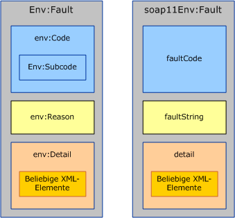
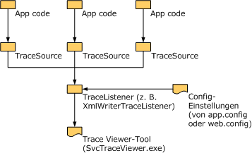

# <a name="handling-exceptions-and-faults"></a><span data-ttu-id="fc3a5-102">Behandeln von Ausnahmen und Fehlern</span><span class="sxs-lookup"><span data-stu-id="fc3a5-102">Handling Exceptions and Faults</span></span>
<span data-ttu-id="fc3a5-103">Mit Ausnahmen werden Fehlfunktionen lokal in der Dienst- oder der Clientimplementierung übermittelt.</span><span class="sxs-lookup"><span data-stu-id="fc3a5-103">Exceptions are used to communicate errors locally within the service or the client implementation.</span></span> <span data-ttu-id="fc3a5-104">Fehler übermitteln hingegen Fehlfunktionen über die Grenzen eines Dienstes hinaus, z.&#160;B. vom Server zum Client und umgekehrt.</span><span class="sxs-lookup"><span data-stu-id="fc3a5-104">Faults, on the other hand, are used to communicate errors across service boundaries, such as from the server to the client or vice versa.</span></span> <span data-ttu-id="fc3a5-105">Darüber hinaus verwenden Transportkanäle häufig transportspezifische Mechanismen, um Fehlfunktionen auf Transportebene zu übermitteln.</span><span class="sxs-lookup"><span data-stu-id="fc3a5-105">In addition to faults, transport channels often use transport-specific mechanisms to communicate transport-level errors.</span></span> <span data-ttu-id="fc3a5-106">Der HTTP-Transport verwendet z.&#160;B. Statuscodes wie 404 zur Übermittlung einer nicht vorhandenen Endpunkt-URL (es gibt keinen Endpunkt, an den der Fehler zurückgegeben werden kann).</span><span class="sxs-lookup"><span data-stu-id="fc3a5-106">For example, HTTP transport uses status codes such as 404 to communicate a non-existing endpoint URL (there is no endpoint to send back a fault).</span></span> <span data-ttu-id="fc3a5-107">Dieses Dokument besteht aus drei Abschnitten mit Hinweisen für Autoren benutzerdefinierter Kanäle.</span><span class="sxs-lookup"><span data-stu-id="fc3a5-107">This document consists of three sections that provide guidance to custom channel authors.</span></span> <span data-ttu-id="fc3a5-108">Der erste Abschnitt enthält Hinweise dazu, wann und wie Ausnahmen definiert und ausgelöst werden.</span><span class="sxs-lookup"><span data-stu-id="fc3a5-108">The first section provides guidance on when and how to define and throw exceptions.</span></span> <span data-ttu-id="fc3a5-109">Der zweite Abschnitt enthält Hinweise zum Auslösen und Behandeln von Fehlern.</span><span class="sxs-lookup"><span data-stu-id="fc3a5-109">The second section provides guidance around generating and consuming faults.</span></span> <span data-ttu-id="fc3a5-110">Im dritten Abschnitt wird das Bereitstellen von Ablaufinformationen erklärt, mit deren Hilfe die Benutzer Ihres benutzerdefinierten Kanals Probleme in laufenden Anwendungen behandeln können.</span><span class="sxs-lookup"><span data-stu-id="fc3a5-110">The third section explains how to provide trace information to aid the user of your custom channel in troubleshooting running applications.</span></span>  
  
## <a name="exceptions"></a><span data-ttu-id="fc3a5-111">Ausnahmen</span><span class="sxs-lookup"><span data-stu-id="fc3a5-111">Exceptions</span></span>  
 <span data-ttu-id="fc3a5-112">Beim Auslösen einer Ausnahme müssen zwei Punkte berücksichtigt werden: Zuerst muss Sie einen Typ aufweisen, der es Benutzern ermöglicht, korrekten Code zu schreiben, der entsprechend auf die Ausnahme reagieren kann.</span><span class="sxs-lookup"><span data-stu-id="fc3a5-112">There are two things to keep in mind when throwing an exception: First it has to be of a type that allows users to write correct code that can react appropriately to the exception.</span></span> <span data-ttu-id="fc3a5-113">Zweiten müssen dabei ausreichend Informationen angegeben werden, damit der Benutzer die Fehlerursache, die Auswirkung des Fehlers und dessen Behebung erkennen kann.</span><span class="sxs-lookup"><span data-stu-id="fc3a5-113">Second, it has to provide enough information for the user to understand what went wrong, the failure impact, and how to fix it.</span></span> <span data-ttu-id="fc3a5-114">Die folgenden Abschnitte unterstützen Sie bei Ausnahme Typen und Nachrichten für Windows Communication Foundation (WCF)-Kanälen.</span><span class="sxs-lookup"><span data-stu-id="fc3a5-114">The following sections give guidance around exception types and messages for Windows Communication Foundation (WCF) channels.</span></span> <span data-ttu-id="fc3a5-115">Allgemeine Hinweise zu Ausnahmen in .NET finden Sie außerdem in den Entwurfsrichtlinien für Ausnahmen.</span><span class="sxs-lookup"><span data-stu-id="fc3a5-115">There is also general guidance around exceptions in .NET in the Design Guidelines for Exceptions document.</span></span>  
  
### <a name="exception-types"></a><span data-ttu-id="fc3a5-116">Ausnahmetypen</span><span class="sxs-lookup"><span data-stu-id="fc3a5-116">Exception Types</span></span>  
 <span data-ttu-id="fc3a5-117">Bei allen von Kanälen ausgelösten Ausnahmen muss es sich entweder um <xref:System.TimeoutException?displayProperty=nameWithType>, <xref:System.ServiceModel.CommunicationException?displayProperty=nameWithType> oder einen Typ handeln, der von <xref:System.ServiceModel.CommunicationException> abgeleitet wird.</span><span class="sxs-lookup"><span data-stu-id="fc3a5-117">All exceptions thrown by channels must be either a <xref:System.TimeoutException?displayProperty=nameWithType>, <xref:System.ServiceModel.CommunicationException?displayProperty=nameWithType>, or a type derived from <xref:System.ServiceModel.CommunicationException>.</span></span> <span data-ttu-id="fc3a5-118">(Auch Ausnahmen wie <xref:System.ObjectDisposedException> können ausgelöst werden, jedoch nur um anzugeben, dass der aufrufende Code den Kanal missbräuchlich verwendet hat.</span><span class="sxs-lookup"><span data-stu-id="fc3a5-118">(Exceptions such as <xref:System.ObjectDisposedException> may also be thrown, but only to indicate that the calling code has misused the channel.</span></span> <span data-ttu-id="fc3a5-119">Wenn ein Kanal ordnungsgemäß verwendet wird, darf er nur die angegebenen Ausnahmen auslösen.) WCF stellt sieben Ausnahme Typen bereit, die von <xref:System.ServiceModel.CommunicationException> abgeleitet sind und von Kanälen verwendet werden sollen.</span><span class="sxs-lookup"><span data-stu-id="fc3a5-119">If a channel is used correctly, it must only throw the given exceptions.) WCF provides seven exception types that derive from <xref:System.ServiceModel.CommunicationException> and are designed to be used by channels.</span></span> <span data-ttu-id="fc3a5-120">Es gibt noch weitere von <xref:System.ServiceModel.CommunicationException> abgeleitete Ausnahmen, die der Verwendung durch andere Teile des Systems dienen.</span><span class="sxs-lookup"><span data-stu-id="fc3a5-120">There are other <xref:System.ServiceModel.CommunicationException>-derived exceptions that are designed to be used by other parts of the system.</span></span> <span data-ttu-id="fc3a5-121">Dazu gehören die folgenden Ausnahmetypen:</span><span class="sxs-lookup"><span data-stu-id="fc3a5-121">These exception types are:</span></span>  
  
|<span data-ttu-id="fc3a5-122">Ausnahmetyp</span><span class="sxs-lookup"><span data-stu-id="fc3a5-122">Exception Type</span></span>|<span data-ttu-id="fc3a5-123">Bedeutung</span><span class="sxs-lookup"><span data-stu-id="fc3a5-123">Meaning</span></span>|<span data-ttu-id="fc3a5-124">Inhalt der internen Ausnahme</span><span class="sxs-lookup"><span data-stu-id="fc3a5-124">Inner Exception Content</span></span>|<span data-ttu-id="fc3a5-125">Wiederherstellungsstrategie</span><span class="sxs-lookup"><span data-stu-id="fc3a5-125">Recovery Strategy</span></span>|  
|--------------------|-------------|-----------------------------|-----------------------|  
|<xref:System.ServiceModel.AddressAlreadyInUseException>|<span data-ttu-id="fc3a5-126">Die zur Überwachung angegebene Endpunktadresse wird bereits verwendet.</span><span class="sxs-lookup"><span data-stu-id="fc3a5-126">The endpoint address specified for listening is already in use.</span></span>|<span data-ttu-id="fc3a5-127">Gibt, sofern vorhanden, weitere Details zum Transportfehler an, der diese Ausnahme verursacht hat.</span><span class="sxs-lookup"><span data-stu-id="fc3a5-127">If present, provides more details about the transport error that caused this exception.</span></span> <span data-ttu-id="fc3a5-128">Beispiel:</span><span class="sxs-lookup"><span data-stu-id="fc3a5-128">For example.</span></span> <span data-ttu-id="fc3a5-129"><xref:System.IO.PipeException>, <xref:System.Net.HttpListenerException> oder <xref:System.Net.Sockets.SocketException>.</span><span class="sxs-lookup"><span data-stu-id="fc3a5-129"><xref:System.IO.PipeException>, <xref:System.Net.HttpListenerException>, or <xref:System.Net.Sockets.SocketException>.</span></span>|<span data-ttu-id="fc3a5-130">Versuchen Sie es mit einer anderen Adresse.</span><span class="sxs-lookup"><span data-stu-id="fc3a5-130">Try a different address.</span></span>|  
|<xref:System.ServiceModel.AddressAccessDeniedException>|<span data-ttu-id="fc3a5-131">Der Prozess darf nicht auf die zur Überwachung angegebene Endpunktadresse zugreifen.</span><span class="sxs-lookup"><span data-stu-id="fc3a5-131">The process is not allowed access to the endpoint address specified for listening.</span></span>|<span data-ttu-id="fc3a5-132">Gibt, sofern vorhanden, weitere Details zum Transportfehler an, der diese Ausnahme verursacht hat.</span><span class="sxs-lookup"><span data-stu-id="fc3a5-132">If present, provides more details about the transport error that caused this exception.</span></span> <span data-ttu-id="fc3a5-133">Beispielsweise <xref:System.IO.PipeException> oder <xref:System.Net.HttpListenerException>.</span><span class="sxs-lookup"><span data-stu-id="fc3a5-133">For example, <xref:System.IO.PipeException>, or <xref:System.Net.HttpListenerException>.</span></span>|<span data-ttu-id="fc3a5-134">Versuchen Sie es mit anderen Anmeldeinformationen.</span><span class="sxs-lookup"><span data-stu-id="fc3a5-134">Try with different credentials.</span></span>|  
|<xref:System.ServiceModel.CommunicationObjectFaultedException>|<span data-ttu-id="fc3a5-135">Der verwendete <xref:System.ServiceModel.ICommunicationObject> befindet sich im Faulted-Zustand (Weitere Informationen finden Sie Untergrund Legendes zu [Zustandsänderungen](understanding-state-changes.md)).</span><span class="sxs-lookup"><span data-stu-id="fc3a5-135">The <xref:System.ServiceModel.ICommunicationObject> being used is in the Faulted state (for more information, see [Understanding State Changes](understanding-state-changes.md)).</span></span> <span data-ttu-id="fc3a5-136">Wenn ein Objekt mit mehreren ausstehenden Aufrufen in den Faulted-Status wechselt, löst nur ein Aufruf eine Ausnahme aus, die sich auf den Fehler bezieht. Die übrigen Aufrufe lösen <xref:System.ServiceModel.CommunicationObjectFaultedException> aus.</span><span class="sxs-lookup"><span data-stu-id="fc3a5-136">Note that when an object with multiple pending calls transitions to the Faulted state, only one call throws an exception that is related to the failure and the rest of the calls throw a <xref:System.ServiceModel.CommunicationObjectFaultedException>.</span></span> <span data-ttu-id="fc3a5-137">Diese Ausnahme wird in der Regel ausgelöst, weil eine Anwendung eine Ausnahme übersieht und ein bereits fehlerhaftes Objekt verwenden will, möglicherweise in einem anderen Thread als dem, der die ursprüngliche Ausnahme abfing.</span><span class="sxs-lookup"><span data-stu-id="fc3a5-137">This exception is typically thrown because an application overlooks some exception and tries to use an already faulted object, possibly on a thread other than the one that caught the original exception.</span></span>|<span data-ttu-id="fc3a5-138">Gibt, sofern vorhanden, Details zur inneren Ausnahme an.</span><span class="sxs-lookup"><span data-stu-id="fc3a5-138">If present provides details about the inner exception.</span></span>|<span data-ttu-id="fc3a5-139">Erstellen Sie ein neues Objekt.</span><span class="sxs-lookup"><span data-stu-id="fc3a5-139">Create a new object.</span></span> <span data-ttu-id="fc3a5-140">Beachten Sie, dass je nachdem, was den Fehler von <xref:System.ServiceModel.ICommunicationObject> ursprünglich verursacht hat, weitere Maßnahmen zur Problembehandlung erforderlich sein können.</span><span class="sxs-lookup"><span data-stu-id="fc3a5-140">Note that depending on what caused the <xref:System.ServiceModel.ICommunicationObject> to fault in the first place, there may be other work required to recover.</span></span>|  
|<xref:System.ServiceModel.CommunicationObjectAbortedException>|<span data-ttu-id="fc3a5-141">Der verwendete <xref:System.ServiceModel.ICommunicationObject> wurde abgebrochen (Weitere Informationen finden Sie Untergrund Legendes zu [Zustandsänderungen](understanding-state-changes.md)).</span><span class="sxs-lookup"><span data-stu-id="fc3a5-141">The <xref:System.ServiceModel.ICommunicationObject> being used has been Aborted (for more information, see [Understanding State Changes](understanding-state-changes.md)).</span></span> <span data-ttu-id="fc3a5-142">Ähnlich wie bei <xref:System.ServiceModel.CommunicationObjectFaultedException> gibt diese Ausnahme an, dass die Anwendung <xref:System.ServiceModel.ICommunicationObject.Abort%2A> für ein Objekt aufgerufen hat, möglicherweise aus einem anderen Thread, und das Objekt deshalb nicht mehr verwendet werden kann.</span><span class="sxs-lookup"><span data-stu-id="fc3a5-142">Similar to <xref:System.ServiceModel.CommunicationObjectFaultedException>, his exception indicates the application has called <xref:System.ServiceModel.ICommunicationObject.Abort%2A> on the object, possibly from another thread, and the object is no longer usable for that reason.</span></span>|<span data-ttu-id="fc3a5-143">Gibt, sofern vorhanden, Details zur inneren Ausnahme an.</span><span class="sxs-lookup"><span data-stu-id="fc3a5-143">If present provides details about the inner exception.</span></span>|<span data-ttu-id="fc3a5-144">Erstellen Sie ein neues Objekt.</span><span class="sxs-lookup"><span data-stu-id="fc3a5-144">Create a new object.</span></span> <span data-ttu-id="fc3a5-145">Beachten Sie, dass je nachdem, was den Abbruch von <xref:System.ServiceModel.ICommunicationObject> ursprünglich verursacht hat, weitere Maßnahmen zur Problembehandlung erforderlich sein können.</span><span class="sxs-lookup"><span data-stu-id="fc3a5-145">Note that depending on what caused the <xref:System.ServiceModel.ICommunicationObject> to abort in the first place, there may be other work required to recover.</span></span>|  
|<xref:System.ServiceModel.EndpointNotFoundException>|<span data-ttu-id="fc3a5-146">Der Remotezielendpunkt führt keine Überwachung aus.</span><span class="sxs-lookup"><span data-stu-id="fc3a5-146">The target remote endpoint is not listening.</span></span> <span data-ttu-id="fc3a5-147">Möglicherweise ist ein Teil der Endpunktadresse falsch oder kann nicht ausgelöst werden, oder der Endpunkt ist deaktiviert.</span><span class="sxs-lookup"><span data-stu-id="fc3a5-147">This can result from any part of the endpoint address being incorrect, irresolvable, or the endpoint being down.</span></span> <span data-ttu-id="fc3a5-148">Beispiele hierfür sind DNS-Fehler, der Warteschlangen-Manager ist nicht verfügbar oder der Dienst wird nicht ausgeführt.</span><span class="sxs-lookup"><span data-stu-id="fc3a5-148">Examples include DNS error, Queue Manager not available, and service not running.</span></span>|<span data-ttu-id="fc3a5-149">Die innere Ausnahme stellt Details bereit, in der Regel aus dem zugrunde liegenden Transport.</span><span class="sxs-lookup"><span data-stu-id="fc3a5-149">The inner exception provides details, typically from the underlying transport.</span></span>|<span data-ttu-id="fc3a5-150">Versuchen Sie es mit einer anderen Adresse.</span><span class="sxs-lookup"><span data-stu-id="fc3a5-150">Try a different address.</span></span> <span data-ttu-id="fc3a5-151">Stattdessen kann der Absender auch eine Weile warten und es noch einmal versuchen, für den Fall, dass der Dienst ausgefallen war.</span><span class="sxs-lookup"><span data-stu-id="fc3a5-151">Alternatively, the sender may wait a while and try again in case the service was down</span></span>|  
|<xref:System.ServiceModel.ProtocolException>|<span data-ttu-id="fc3a5-152">Die Kommunikationsprotokolle, die von der Richtlinie des Endpunkts beschrieben werden, stimmen zwischen den Endpunkten nicht überein.</span><span class="sxs-lookup"><span data-stu-id="fc3a5-152">The communication protocols, as described by the endpoint’s policy, are mismatched between endpoints.</span></span> <span data-ttu-id="fc3a5-153">Beispiele: Rahmeninhaltstypenkonflikt oder die maximale Nachrichtengröße wurde überschritten.</span><span class="sxs-lookup"><span data-stu-id="fc3a5-153">For example, framing content type mismatch or max message size exceeded.</span></span>|<span data-ttu-id="fc3a5-154">Gibt, sofern vorhanden, Informationen zum speziellen Protokollfehler an.</span><span class="sxs-lookup"><span data-stu-id="fc3a5-154">If present provides more information about the specific protocol error.</span></span> <span data-ttu-id="fc3a5-155">Beispielsweise ist <xref:System.ServiceModel.QuotaExceededException> die innere Ausnahme, wenn die Fehlerursache eine Überschreitung von MaxReceivedMessageSize ist.</span><span class="sxs-lookup"><span data-stu-id="fc3a5-155">For example, <xref:System.ServiceModel.QuotaExceededException> is the inner exception when the error cause is exceeding MaxReceivedMessageSize.</span></span>|<span data-ttu-id="fc3a5-156">Wiederherstellung: Stellen Sie sicher, dass Absender und empfangene Protokoll Einstellungen mit</span><span class="sxs-lookup"><span data-stu-id="fc3a5-156">Recovery: Ensure sender and received protocol settings match.</span></span> <span data-ttu-id="fc3a5-157">Eine Möglichkeit hierfür besteht darin, die Metadaten (Richtlinie) des Dienstendpunkts neu zu importieren und mit der generierten Bindung den Kanal neu zu erstellen.</span><span class="sxs-lookup"><span data-stu-id="fc3a5-157">One way to do this is to re-import the service endpoint’s metadata (policy) and use the generated binding to recreate the channel.</span></span>|  
|<xref:System.ServiceModel.ServerTooBusyException>|<span data-ttu-id="fc3a5-158">Der Remoteendpunkt führt eine Überwachung aus, ist jedoch noch nicht zur Verarbeitung von Nachrichten bereit.</span><span class="sxs-lookup"><span data-stu-id="fc3a5-158">The remote endpoint is listening but is not prepared to process messages.</span></span>|<span data-ttu-id="fc3a5-159">Sofern vorhanden, gibt die innere Ausnahme die Details des SOAP- oder Tansportfehlers an.</span><span class="sxs-lookup"><span data-stu-id="fc3a5-159">If present, the inner Exception provides the SOAP fault or transport-level error details.</span></span>|<span data-ttu-id="fc3a5-160">Wiederherstellung: Warten Sie, und wiederholen Sie den Vorgang später.</span><span class="sxs-lookup"><span data-stu-id="fc3a5-160">Recovery: Wait and retry the operation later.</span></span>|  
|<xref:System.TimeoutException>|<span data-ttu-id="fc3a5-161">Der Vorgang konnte innerhalb des angegebenen Timeouts nicht abgeschlossen werden.</span><span class="sxs-lookup"><span data-stu-id="fc3a5-161">The operation failed to complete within the timeout period.</span></span>|<span data-ttu-id="fc3a5-162">Stellt möglicherweise Details über das Timeout bereit.</span><span class="sxs-lookup"><span data-stu-id="fc3a5-162">May provide details about the timeout.</span></span>|<span data-ttu-id="fc3a5-163">Warten Sie, und wiederholen Sie den Vorgang später.</span><span class="sxs-lookup"><span data-stu-id="fc3a5-163">Wait and retry the operation later.</span></span>|  
  
 <span data-ttu-id="fc3a5-164">Definieren Sie nur dann einen neuen Ausnahmetyp, wenn dieser Typ einer bestimmten Wiederherstellungsstrategie entspricht, die sich von allen vorhandenen Ausnahmetypen unterscheidet.</span><span class="sxs-lookup"><span data-stu-id="fc3a5-164">Define a new exception type only if that type corresponds to a specific recovery strategy different from all of the existing exception types.</span></span> <span data-ttu-id="fc3a5-165">Wenn Sie einen neuen Ausnahmetyp definieren, muss er von <xref:System.ServiceModel.CommunicationException> oder einer der davon abgeleiteten Klassen abgeleitet werden.</span><span class="sxs-lookup"><span data-stu-id="fc3a5-165">If you do define a new exception type, it must derive from <xref:System.ServiceModel.CommunicationException> or one of its derived classes.</span></span>  
  
### <a name="exception-messages"></a><span data-ttu-id="fc3a5-166">Ausnahmemeldungen</span><span class="sxs-lookup"><span data-stu-id="fc3a5-166">Exception Messages</span></span>  
 <span data-ttu-id="fc3a5-167">Ausnahmemeldungen richten sich an den Benutzer, nicht an das Programm. Deshalb sollten sie ausreichend Informationen enthalten, mit denen der Benutzer das Problem verstehen und beheben kann.</span><span class="sxs-lookup"><span data-stu-id="fc3a5-167">Exception messages are targeted at the user not the program so they should provide sufficient information to help the user understand and solve the problem.</span></span> <span data-ttu-id="fc3a5-168">Eine gute Ausnahmemeldung besteht im Wesentlichen aus den folgenden drei Teilen:</span><span class="sxs-lookup"><span data-stu-id="fc3a5-168">The three essential parts of a good exception message are:</span></span>  
  
 <span data-ttu-id="fc3a5-169">Was ist passiert.</span><span class="sxs-lookup"><span data-stu-id="fc3a5-169">What happened.</span></span> <span data-ttu-id="fc3a5-170">Beschreiben Sie das Problem eindeutig und mit Begriffen, die dem Benutzer vertraut sind.</span><span class="sxs-lookup"><span data-stu-id="fc3a5-170">Provide a clear description of the problem using terms that relate to the user’s experience.</span></span> <span data-ttu-id="fc3a5-171">Eine schlechte Ausnahmemeldung wäre z.&#160;B. "Ungültiger Konfigurationsabschnitt".</span><span class="sxs-lookup"><span data-stu-id="fc3a5-171">For example, a bad exception message would be "Invalid configuration section".</span></span> <span data-ttu-id="fc3a5-172">Dabei bleibt der Benutzer im Unklaren, welcher Konfigurationsabschnitt falsch ist und warum er falsch ist.</span><span class="sxs-lookup"><span data-stu-id="fc3a5-172">This leaves the user wondering which configuration section is incorrect and why it is incorrect.</span></span> <span data-ttu-id="fc3a5-173">Eine verbesserte Meldung wäre "Ungültiger Konfigurations Abschnitt \<CustomBinding >".</span><span class="sxs-lookup"><span data-stu-id="fc3a5-173">An improved message would be "Invalid configuration section \<customBinding>".</span></span> <span data-ttu-id="fc3a5-174">Und eine noch bessere Meldung wäre „Der Transport mit der Bezeichnung ,meinTransport‘ kann der Bindung ,meineBindung‘ nicht hinzugefügt werden, da die Bindung bereits einen Transport mit dem Namen ,meinTransport‘ besitzt“.</span><span class="sxs-lookup"><span data-stu-id="fc3a5-174">An even better message would be "Cannot add the transport named myTransport to the binding named myBinding because the binding already has a transport named myTransport".</span></span> <span data-ttu-id="fc3a5-175">Diese Meldung ist sehr genau und verwendet Begriffe und Namen, die der Benutzer schnell in der Konfigurationsdatei der Anwendung findet.</span><span class="sxs-lookup"><span data-stu-id="fc3a5-175">This is a very specific message using terms and names that the user can easily identify in the application’s configuration file.</span></span> <span data-ttu-id="fc3a5-176">Es fehlen jedoch noch immer einige entscheidende Komponenten.</span><span class="sxs-lookup"><span data-stu-id="fc3a5-176">However, there are still a few key components missing.</span></span>  
  
 <span data-ttu-id="fc3a5-177">Die Relevanz des Fehlers.</span><span class="sxs-lookup"><span data-stu-id="fc3a5-177">The significance of the error.</span></span> <span data-ttu-id="fc3a5-178">Wenn die Meldung nicht klar angibt, was der Fehler bedeutet, weiß der Benutzer nicht, ob der Fehler schwerwiegend ist oder ignoriert werden kann.</span><span class="sxs-lookup"><span data-stu-id="fc3a5-178">Unless the message states clearly what the error means, the user is likely to wonder whether it is a fatal error or if it can be ignored.</span></span> <span data-ttu-id="fc3a5-179">Im Allgemeinen sollten Fehlermeldungen mit der Bedeutung oder der Relevanz des Fehlers eingeleitet werden.</span><span class="sxs-lookup"><span data-stu-id="fc3a5-179">In general, messages should lead with the meaning or significance of the error.</span></span> <span data-ttu-id="fc3a5-180">Um das vorherige Beispiel zu verbessern, könnte die Meldung lauten, dass Service Host aufgrund eines Konfigurations Fehlers nicht geöffnet werden konnte: Der Transport mit dem Namen mytransport kann der Bindung mit dem Namen myBinding nicht hinzugefügt werden, da die Bindung bereits einen Transport mit dem Namen mytransport aufweist.</span><span class="sxs-lookup"><span data-stu-id="fc3a5-180">To improve the previous example, the message could be "ServiceHost failed to Open due to a configuration error: Cannot add the transport named myTransport to the binding named myBinding because the binding already has a transport named myTransport".</span></span>  
  
 <span data-ttu-id="fc3a5-181">Vorgehensweise zum Beheben des Problems.</span><span class="sxs-lookup"><span data-stu-id="fc3a5-181">How the user should correct the problem.</span></span> <span data-ttu-id="fc3a5-182">Der wichtigste Teil der Meldung besteht darin, dem Benutzer beim Beheben des Problem zu helfen.</span><span class="sxs-lookup"><span data-stu-id="fc3a5-182">The most important part of the message is helping the user fix the problem.</span></span> <span data-ttu-id="fc3a5-183">Die Meldung sollte einige Anweisungen und Hinweise enthalten, was zu überprüfen oder zu korrigieren ist.</span><span class="sxs-lookup"><span data-stu-id="fc3a5-183">The message should include some guidance or hints about what to check or fix to remedy the problem.</span></span> <span data-ttu-id="fc3a5-184">Beispiel: "Service Host konnte aufgrund eines Konfigurations Fehlers nicht geöffnet werden: Der Transport mit dem Namen mytransport kann der Bindung mit dem Namen myBinding nicht hinzugefügt werden, da die Bindung bereits einen Transport mit dem Namen mytransport aufweist.</span><span class="sxs-lookup"><span data-stu-id="fc3a5-184">For example, "ServiceHost failed to Open due to a configuration error: Cannot add the transport named myTransport to the binding named myBinding because the binding already has a transport named myTransport.</span></span> <span data-ttu-id="fc3a5-185">Stellen Sie sicher, dass die Bindung nur einen Transport enthält.“</span><span class="sxs-lookup"><span data-stu-id="fc3a5-185">Please ensure there is only one transport in the binding".</span></span>  
  
## <a name="communicating-faults"></a><span data-ttu-id="fc3a5-186">Übermitteln von Fehlern</span><span class="sxs-lookup"><span data-stu-id="fc3a5-186">Communicating Faults</span></span>  
 <span data-ttu-id="fc3a5-187">SOAP 1.1 und SOAP 1.2 definieren jeweils eine spezielle Struktur für Fehler.</span><span class="sxs-lookup"><span data-stu-id="fc3a5-187">SOAP 1.1 and SOAP 1.2 both define a specific structure for faults.</span></span> <span data-ttu-id="fc3a5-188">Es gibt einige Unterschiede zwischen den beiden Spezifikationen. Im Allgemeinen werden jedoch die Typen Message und MessageFault zum Erstellen und Behandeln von Fehlern verwendet.</span><span class="sxs-lookup"><span data-stu-id="fc3a5-188">There are some differences between the two specifications but in general, the Message and MessageFault types are used to create and consume faults.</span></span>  
  
 <span data-ttu-id="fc3a5-189"></span><span class="sxs-lookup"><span data-stu-id="fc3a5-189"></span></span>  
<span data-ttu-id="fc3a5-190">Fehler in SOAP 1.2 (links) und Fehler in SOAP 1.1 (rechts).</span><span class="sxs-lookup"><span data-stu-id="fc3a5-190">SOAP 1.2 Fault (left) and SOAP 1.1 Fault (right).</span></span> <span data-ttu-id="fc3a5-191">In SOAP 1.1 ist nur das Fault-Element namespacequalifiziert.</span><span class="sxs-lookup"><span data-stu-id="fc3a5-191">Note that in SOAP 1.1 only the Fault element is namespace qualified.</span></span>  
  
 <span data-ttu-id="fc3a5-192">SOAP definiert eine Fehlermeldung als Meldung, die nur ein Fehlerelement (ein Element, dessen Name `<env:Fault>`) als untergeordnetes Element von`<env:Body>` enthält.</span><span class="sxs-lookup"><span data-stu-id="fc3a5-192">SOAP defines a fault message as a message that contains only a fault element (an element whose name is `<env:Fault>`) as a child of `<env:Body>`.</span></span> <span data-ttu-id="fc3a5-193">Der Inhalt des Fehlerelements unterscheidet sich ein wenig zwischen SOAP 1.1 und SOAP 1.2 (siehe Abbildung 1).</span><span class="sxs-lookup"><span data-stu-id="fc3a5-193">The contents of the fault element differ slightly between SOAP 1.1 and SOAP 1.2 as shown in figure 1.</span></span> <span data-ttu-id="fc3a5-194">Die <xref:System.ServiceModel.Channels.MessageFault?displayProperty=nameWithType>-Klasse normalisiert diese Unterschiede jedoch in ein Objektmodell:</span><span class="sxs-lookup"><span data-stu-id="fc3a5-194">However, the <xref:System.ServiceModel.Channels.MessageFault?displayProperty=nameWithType> class normalizes these differences into one object model:</span></span>  
  
```csharp
public abstract class MessageFault  
{  
    protected MessageFault();  
  
    public virtual string Actor { get; }  
    public virtual string Node { get; }  
    public static string DefaultAction { get; }  
    public abstract FaultCode Code { get; }  
    public abstract bool HasDetail { get; }  
    public abstract FaultReason Reason { get; }  
  
    public T GetDetail<T>();  
    public T GetDetail<T>( XmlObjectSerializer serializer);  
    public System.Xml.XmlDictionaryReader GetReaderAtDetailContents();  
  
    // other methods omitted  
}  
```  
  
 <span data-ttu-id="fc3a5-195">Die `Code`-Eigenschaft entspricht `env:Code` (oder `faultCode` in SOAP 1.1) und identifiziert den Typ des Fehlers.</span><span class="sxs-lookup"><span data-stu-id="fc3a5-195">The `Code` property corresponds to the `env:Code` (or `faultCode` in SOAP 1.1) and identifies the type of the fault.</span></span> <span data-ttu-id="fc3a5-196">SOAP 1.2 definiert fünf zulässige Werte für `faultCode` (z.&#160;B. Sender und Receiver) und definiert ein `Subcode`-Element, das einen beliebigen Subcodewert enthalten kann.</span><span class="sxs-lookup"><span data-stu-id="fc3a5-196">SOAP 1.2 defines five allowable values for `faultCode` (for example, Sender and Receiver) and defines a `Subcode` element which can contain any subcode value.</span></span> <span data-ttu-id="fc3a5-197">(In der [SOAP 1,2-Spezifikation](https://go.microsoft.com/fwlink/?LinkId=95176) finden Sie eine Liste zulässiger Fehlercodes und ihre Bedeutung.) SOAP 1,1 verfügt über einen etwas anderen Mechanismus: Sie definiert vier `faultCode` Werte (z. b. Client und Server), die entweder durch die Definition völlig neuer Werte oder durch die Verwendung der Punkt Notation erweitert werden können, um spezifischere `faultCodes`zu erstellen, z. b. Client. Authentication.</span><span class="sxs-lookup"><span data-stu-id="fc3a5-197">(See the [SOAP 1.2 specification](https://go.microsoft.com/fwlink/?LinkId=95176) for the list of allowable fault codes and their meaning.) SOAP 1.1 has a slightly different mechanism: It defines four `faultCode` values (for example, Client and Server) that can be extended either by defining entirely new ones or by using the dot notation to create more specific `faultCodes`, for example, Client.Authentication.</span></span>  
  
 <span data-ttu-id="fc3a5-198">Wenn Sie MessageFault zum Programmieren von Fehlern verwenden, wird FaultCode.Name und FaultCode.Namespace jeweils dem Namen und dem Namespace von `env:Code` in SOAP 1.2 oder `faultCode` in SOAP 1.1 zugeordnet.</span><span class="sxs-lookup"><span data-stu-id="fc3a5-198">When you use MessageFault to program faults, the FaultCode.Name and FaultCode.Namespace maps to the name and namespace of the SOAP 1.2 `env:Code` or the SOAP 1.1 `faultCode`.</span></span> <span data-ttu-id="fc3a5-199">FaultCode.SubCode wird `env:Subcode` für SOAP 1.2 zugeordnet und ist für SOAP 1.1 NULL.</span><span class="sxs-lookup"><span data-stu-id="fc3a5-199">The FaultCode.SubCode maps to `env:Subcode` for SOAP 1.2 and is null for SOAP 1.1.</span></span>  
  
 <span data-ttu-id="fc3a5-200">Erstellen Sie neue Fehlersubcodes (oder bei SOAP 1.1 neue Fehlercodes), wenn eine programmgesteuerte Unterscheidung eines Fehlers von Interesse ist.</span><span class="sxs-lookup"><span data-stu-id="fc3a5-200">You should create new fault subcodes (or new fault codes if using SOAP 1.1) if it is interesting to programmatically distinguish a fault.</span></span> <span data-ttu-id="fc3a5-201">Diese Vorgehensweise entspricht dem Erstellen eines neuen Ausnahmetyps.</span><span class="sxs-lookup"><span data-stu-id="fc3a5-201">This is analogous to creating a new exception type.</span></span> <span data-ttu-id="fc3a5-202">Vermeiden Sie die Verwendung der Punktnotation mit SOAP 1.1-Fehlercodes.</span><span class="sxs-lookup"><span data-stu-id="fc3a5-202">You should avoid using the dot notation with SOAP 1.1 fault codes.</span></span> <span data-ttu-id="fc3a5-203">(Das [WS-I Basic-Profil](https://go.microsoft.com/fwlink/?LinkId=95177) verhindert auch die Verwendung der Fehlercode Punkt Notation.)</span><span class="sxs-lookup"><span data-stu-id="fc3a5-203">(The [WS-I Basic Profile](https://go.microsoft.com/fwlink/?LinkId=95177) also discourages the use of the fault code dot notation.)</span></span>  
  
```csharp
public class FaultCode  
{  
    public FaultCode(string name);  
    public FaultCode(string name, FaultCode subCode);  
    public FaultCode(string name, string ns);  
    public FaultCode(string name, string ns, FaultCode subCode);  
  
    public bool IsPredefinedFault { get; }  
    public bool IsReceiverFault { get; }  
    public bool IsSenderFault { get; }  
    public string Name { get; }  
    public string Namespace { get; }  
    public FaultCode SubCode { get; }  
  
//  methods omitted  
  
}  
```  
  
 <span data-ttu-id="fc3a5-204">Die `Reason`-Eigenschaft entspricht `env:Reason` (oder `faultString` in SOAP 1.1), einer lesbaren Beschreibung der Fehlerbedingung analog zur Meldung einer Ausnahme.</span><span class="sxs-lookup"><span data-stu-id="fc3a5-204">The `Reason` property corresponds to the `env:Reason` (or `faultString` in SOAP 1.1) a human-readable description of the error condition analogous to an exception’s message.</span></span> <span data-ttu-id="fc3a5-205">In der `FaultReason`-Klasse (und SOAP `env:Reason/faultString`) ist eine Unterstützung mehrerer Übersetzungen für Globalisierungszwecke integriert.</span><span class="sxs-lookup"><span data-stu-id="fc3a5-205">The `FaultReason` class (and SOAP `env:Reason/faultString`) has built-in support for having multiple translations in the interest of globalization.</span></span>  
  
```csharp
public class FaultReason  
{  
    public FaultReason(FaultReasonText translation);  
    public FaultReason(IEnumerable<FaultReasonText> translations);  
    public FaultReason(string text);  
  
    public SynchronizedReadOnlyCollection<FaultReasonText> Translations   
    {   
       get;   
    }  
  
 }  
```  
  
 <span data-ttu-id="fc3a5-206">Der Inhalt der Fehlerdetails wird in MessageFault mithilfe verschiedener Methoden, einschließlich der `GetDetail`\<t > und `GetReaderAtDetailContents`(), verfügbar gemacht.</span><span class="sxs-lookup"><span data-stu-id="fc3a5-206">The fault detail contents are exposed on MessageFault using various methods including the `GetDetail`\<T> and `GetReaderAtDetailContents`().</span></span> <span data-ttu-id="fc3a5-207">Das Fehlerdetail ist ein nicht transparentes Element zur Aufnahme zusätzlicher Fehlerdetails.</span><span class="sxs-lookup"><span data-stu-id="fc3a5-207">The fault detail is an opaque element for carrying additional detail about the fault.</span></span> <span data-ttu-id="fc3a5-208">Das ist nützlich, wenn Sie dem Fehler willkürlich strukturierte Details hinzufügen möchten.</span><span class="sxs-lookup"><span data-stu-id="fc3a5-208">This is useful if there is some arbitrary structured detail that you want to carry with the fault.</span></span>  
  
### <a name="generating-faults"></a><span data-ttu-id="fc3a5-209">Generieren von Fehlern</span><span class="sxs-lookup"><span data-stu-id="fc3a5-209">Generating Faults</span></span>  
 <span data-ttu-id="fc3a5-210">In diesem Abschnitt wird das Generieren eines Fehlers als Reaktion auf eine Fehlerbedingung erläutert, die in einem Kanal oder in einer von einem Kanal erstellten Nachrichteneigenschaft festgestellt wird.</span><span class="sxs-lookup"><span data-stu-id="fc3a5-210">This section explains the process of generating a fault in response to an error condition detected in a channel or in a message property created by the channel.</span></span> <span data-ttu-id="fc3a5-211">Ein typisches Beispiel ist die Rückgabe eines Fehlers als Antwort auf eine Anforderungsnachricht, die ungültige Daten enthält.</span><span class="sxs-lookup"><span data-stu-id="fc3a5-211">A typical example is sending back a fault in response to a request message that contains invalid data.</span></span>  
  
 <span data-ttu-id="fc3a5-212">Beim Generieren eines Fehlers sollte der benutzerdefinierte Kanal den Fehler nicht direkt senden, sondern eine Ausnahme auslösen, um es der übergeordneten Ebene zu überlassen, ob diese Ausnahme in einen Fehler konvertiert wird und wie der Fehler zu senden ist.</span><span class="sxs-lookup"><span data-stu-id="fc3a5-212">When generating a fault, the custom channel should not send the fault directly, rather, it should throw an exception and let the layer above decide whether to convert that exception to a fault and how to send it.</span></span> <span data-ttu-id="fc3a5-213">Als Hilfestellung bei dieser Konvertierung sollte der Kanal eine `FaultConverter`-Implementierung bereitstellen, die die vom benutzerdefinierten Kanal ausgelöste Ausnahme in den geeigneten Fehler konvertieren kann.</span><span class="sxs-lookup"><span data-stu-id="fc3a5-213">To aid in this conversion, the channel should provide a `FaultConverter` implementation that can convert the exception thrown by the custom channel to the appropriate fault.</span></span> <span data-ttu-id="fc3a5-214">`FaultConverter` wird folgendermaßen definiert:</span><span class="sxs-lookup"><span data-stu-id="fc3a5-214">`FaultConverter` is defined as:</span></span>  
  
```csharp
public class FaultConverter  
{  
    public static FaultConverter GetDefaultFaultConverter(  
                                   MessageVersion version);  
    protected abstract bool OnTryCreateFaultMessage(  
                                   Exception exception,   
                                   out Message message);  
    public bool TryCreateFaultMessage(  
                                   Exception exception,   
                                   out Message message);  
}  
```  
  
 <span data-ttu-id="fc3a5-215">Jeder Kanal, der benutzerdefinierte Fehler generiert, muss `FaultConverter` implementieren und nach einem Aufruf von `GetProperty<FaultConverter>` zurückgeben.</span><span class="sxs-lookup"><span data-stu-id="fc3a5-215">Each channel that generates custom faults must implement `FaultConverter` and return it from a call to `GetProperty<FaultConverter>`.</span></span> <span data-ttu-id="fc3a5-216">Die benutzerdefinierte `OnTryCreateFaultMessage`-Implementierung muss die Ausnahme in einen Fehler konvertieren oder an den `FaultConverter` des inneren Kanals delegieren.</span><span class="sxs-lookup"><span data-stu-id="fc3a5-216">The custom `OnTryCreateFaultMessage` implementation must either convert the exception to a fault or delegate to the inner channel’s `FaultConverter`.</span></span> <span data-ttu-id="fc3a5-217">Wenn es sich bei dem Kanal um einen Transport handelt, muss er entweder die Ausnahme oder den Delegaten in den `FaultConverter` des Encoders oder den in WCF bereitgestellten Standard `FaultConverter` konvertieren.</span><span class="sxs-lookup"><span data-stu-id="fc3a5-217">If the channel is a transport it must either convert the exception or delegate to the encoder’s `FaultConverter` or the default `FaultConverter` provided in WCF .</span></span> <span data-ttu-id="fc3a5-218">Der standardmäßige `FaultConverter` konvertiert Fehler entsprechend der in der WS-Adressierung und SOAP angegebenen Fehlermeldungen.</span><span class="sxs-lookup"><span data-stu-id="fc3a5-218">The default `FaultConverter` converts errors corresponding to fault messages specified by WS-Addressing and SOAP.</span></span> <span data-ttu-id="fc3a5-219">Im Folgenden sehen Sie ein Beispiel für eine `OnTryCreateFaultMessage`-Implementierung.</span><span class="sxs-lookup"><span data-stu-id="fc3a5-219">Here is an example `OnTryCreateFaultMessage` implementation.</span></span>  
  
```csharp
public override bool OnTryCreateFaultMessage(Exception exception,   
                                             out Message message)  
{  
    if (exception is ...)  
    {  
        message = ...;  
        return true;  
    }  
  
#if IMPLEMENTING_TRANSPORT_CHANNEL  
    FaultConverter encoderConverter =   
                    this.encoder.GetProperty<FaultConverter>();  
    if ((encoderConverter != null) &&               
        (encoderConverter.TryCreateFaultMessage(  
         exception, out message)))  
    {  
        return true;  
    }  
  
    FaultConverter defaultConverter =   
                   FaultConverter.GetDefaultFaultConverter(  
                   this.channel.messageVersion);  
    return defaultConverter.TryCreateFaultMessage(  
                   exception,   
                   out message);  
#else  
    FaultConverter inner =   
                   this.innerChannel.GetProperty<FaultConverter>();  
    if (inner != null)  
    {  
        return inner.TryCreateFaultMessage(exception, out message);  
    }  
    else  
    {  
        message = null;  
        return false;  
    }  
#endif  
}  
```  
  
 <span data-ttu-id="fc3a5-220">Eine Folge dieses Musters ist, dass die zwischen Schichten für Fehlerbedingungen ausgelösten Ausnahmen, die Fehler erfordern, genügend Informationen enthalten müssen, damit der entsprechende Fehlergenerator den richtigen Fehler erstellen kann.</span><span class="sxs-lookup"><span data-stu-id="fc3a5-220">An implication of this pattern is that exceptions thrown between layers for error conditions that require faults must contain enough information for the corresponding fault generator to create the correct fault.</span></span> <span data-ttu-id="fc3a5-221">Als Autor eines benutzerdefinierten Kanals definieren Sie möglicherweise Ausnahmetypen, die verschiedenen Fehlerbedingungen entsprechen, falls solche Ausnahmen nicht bereits vorhanden sind.</span><span class="sxs-lookup"><span data-stu-id="fc3a5-221">As a custom channel author, you may define exception types that correspond to different fault conditions if such exceptions do not already exist.</span></span> <span data-ttu-id="fc3a5-222">Beachten Sie, dass Ausnahmen, die Kanalschichten durchlaufen, eher die Fehlerbedingung statt der nicht transparenten Fehlerdaten übermitteln sollten.</span><span class="sxs-lookup"><span data-stu-id="fc3a5-222">Note that exceptions traversing channel layers should communicate the error condition rather than opaque fault data.</span></span>  
  
### <a name="fault-categories"></a><span data-ttu-id="fc3a5-223">Fehlerkategorien</span><span class="sxs-lookup"><span data-stu-id="fc3a5-223">Fault Categories</span></span>  
 <span data-ttu-id="fc3a5-224">Es gibt im Allgemeinen drei Kategorien von Fehlern:</span><span class="sxs-lookup"><span data-stu-id="fc3a5-224">There are generally three categories of faults:</span></span>  
  
1. <span data-ttu-id="fc3a5-225">Fehler, die den ganzen Stapel durchdringen.</span><span class="sxs-lookup"><span data-stu-id="fc3a5-225">Faults that are pervasive throughout the entire stack.</span></span> <span data-ttu-id="fc3a5-226">Diese Fehler können in jeder Schicht des Kanalstapels auftreten, z.&#160;B. InvalidCardinalityAddressingException.</span><span class="sxs-lookup"><span data-stu-id="fc3a5-226">These faults could be encountered at any layer in the channel stack, for example InvalidCardinalityAddressingException.</span></span>  
  
2. <span data-ttu-id="fc3a5-227">Fehler, die an jeder beliebigen Stelle über einer bestimmten Schicht im Stapel auftreten können. Hierzu gehören z.&#160;B. Fehler, die einen Transaktionsfluss oder Sicherheitsrollen betreffen.</span><span class="sxs-lookup"><span data-stu-id="fc3a5-227">Faults that can be encountered anywhere above a certain layer in the stack for example some errors that pertain to a flowed transaction or to security roles.</span></span>  
  
3. <span data-ttu-id="fc3a5-228">Fehler, die sich auf eine einzelne Schicht im Stapel beziehen. Hierzu zählen z.&#160;B. Fehler wie WS-RM-Sequenznummernfehler.</span><span class="sxs-lookup"><span data-stu-id="fc3a5-228">Faults that are directed at a single layer in the stack, for example errors like WS-RM sequence number faults.</span></span>  
  
 <span data-ttu-id="fc3a5-229">Kategorie 1.</span><span class="sxs-lookup"><span data-stu-id="fc3a5-229">Category 1.</span></span> <span data-ttu-id="fc3a5-230">Fehler sind im Allgemeinen WS-Adressierungs- und SOAP-Fehler.</span><span class="sxs-lookup"><span data-stu-id="fc3a5-230">Faults are generally WS-Addressing and SOAP faults.</span></span> <span data-ttu-id="fc3a5-231">Die von WCF bereitgestellte Basis `FaultConverter` Klasse konvertiert Fehler entsprechend den von der WS-Adressierung und SOAP angegebenen Fehlermeldungen, sodass Sie die Konvertierung dieser Ausnahmen nicht selbst behandeln müssen.</span><span class="sxs-lookup"><span data-stu-id="fc3a5-231">The base `FaultConverter` class provided by WCF converts errors corresponding to fault messages specified by WS-Addressing and SOAP so you do not have to handle conversion of these exceptions yourself.</span></span>  
  
 <span data-ttu-id="fc3a5-232">Kategorie 2.</span><span class="sxs-lookup"><span data-stu-id="fc3a5-232">Category 2.</span></span> <span data-ttu-id="fc3a5-233">Fehler treten auf, wenn der Nachricht von einer Schicht eine Eigenschaft hinzugefügt wird und diese Eigenschaft Nachrichteninformationen, die diese Schicht betreffen, nicht vollständig behandelt.</span><span class="sxs-lookup"><span data-stu-id="fc3a5-233">Faults occur when a layer adds a property to the message that does not completely consume message information that pertains to that layer.</span></span> <span data-ttu-id="fc3a5-234">Fehler werden möglicherweise später erkannt, wenn eine höhere Schicht von der Eigenschaft eine weitere Verarbeitung von Nachrichteninformationen verlangt.</span><span class="sxs-lookup"><span data-stu-id="fc3a5-234">Errors may be detected later when a higher layer asks the message property to process message information further.</span></span> <span data-ttu-id="fc3a5-235">Solche Kanäle sollten wie erwähnt `GetProperty` implementieren, um der höheren Schicht, die Rückgabe des richtigen Fehlers zu ermöglichen.</span><span class="sxs-lookup"><span data-stu-id="fc3a5-235">Such channels should implement the `GetProperty` specified previously to enable the higher layer to send back the correct fault.</span></span> <span data-ttu-id="fc3a5-236">TransactionMessageProperty ist hierfür ein Beispiel.</span><span class="sxs-lookup"><span data-stu-id="fc3a5-236">An example of this is the TransactionMessageProperty.</span></span> <span data-ttu-id="fc3a5-237">Diese Eigenschaft wird der Nachricht hinzugefügt, ohne dass alle Daten im Header vollständig überprüft werden (dadurch wird möglicherweise eine Verbindung mit dem Distributed Transaction Coordinator (DTC) hergestellt).</span><span class="sxs-lookup"><span data-stu-id="fc3a5-237">This property is added to the message without fully validating all the data in the header (doing so may involve contacting the distributed transaction coordinator (DTC).</span></span>  
  
 <span data-ttu-id="fc3a5-238">Kategorie 3.</span><span class="sxs-lookup"><span data-stu-id="fc3a5-238">Category 3.</span></span> <span data-ttu-id="fc3a5-239">Fehler werden nur von einer einzelnen Schicht im Prozessor generiert und gesendet.</span><span class="sxs-lookup"><span data-stu-id="fc3a5-239">Faults are only generated and sent by a single layer in the processor.</span></span> <span data-ttu-id="fc3a5-240">Deshalb sind alle Ausnahmen innerhalb der Schicht enthalten.</span><span class="sxs-lookup"><span data-stu-id="fc3a5-240">Therefore all the exceptions are contained within the layer.</span></span> <span data-ttu-id="fc3a5-241">Um die Einheitlichkeit zwischen den Kanälen zu verbessern und die Wartung zu erleichtern, sollte der benutzerdefinierte Kanal oben beschriebene Muster verwenden, um auch für interne Fehler Fehlermeldungen zu generieren.</span><span class="sxs-lookup"><span data-stu-id="fc3a5-241">To improve consistency among channels and ease maintenance, your custom channel should use the pattern specified previously to generate fault messages even for internal faults.</span></span>  
  
### <a name="interpreting-received-faults"></a><span data-ttu-id="fc3a5-242">Interpretieren empfangener Fehler</span><span class="sxs-lookup"><span data-stu-id="fc3a5-242">Interpreting Received Faults</span></span>  
 <span data-ttu-id="fc3a5-243">Dieser Abschnitt enthält Hinweise zum Generieren der richtigen Ausnahme beim Empfang einer Fehlermeldung.</span><span class="sxs-lookup"><span data-stu-id="fc3a5-243">This section provides guidance for generating the appropriate exception when receiving a fault message.</span></span> <span data-ttu-id="fc3a5-244">Die Entscheidungsstruktur zur Verarbeitung einer Meldung in den einzelnen Schichten eines Stapels lautet wie folgt:</span><span class="sxs-lookup"><span data-stu-id="fc3a5-244">The decision tree for processing a message at every layer in the stack is as follows:</span></span>  
  
1. <span data-ttu-id="fc3a5-245">Wenn die Meldung von der Schicht als ungültig angesehen wird, sollte deren Verarbeitung für ungültige Nachrichten erfolgen.</span><span class="sxs-lookup"><span data-stu-id="fc3a5-245">If the layer considers the message to be invalid, the layer should do its ‘invalid message’ processing.</span></span> <span data-ttu-id="fc3a5-246">Diese Verarbeitung hängt von der jeweiligen Schicht ab, kann jedoch das Verwerfen der Meldung, eine Ablaufverfolgung oder das Auslösen einer Ausnahme beinhalten, die in einen Fehler konvertiert wird.</span><span class="sxs-lookup"><span data-stu-id="fc3a5-246">Such processing is specific to the layer but could include dropping the message, tracing, or throwing an exception that gets converted to a fault.</span></span> <span data-ttu-id="fc3a5-247">Zu den Beispielen hierfür zählen, dass die Sicherheit eine nicht ordnungsgemäß gesicherte Nachricht erhält oder dass RM eine Nachricht mit einer falschen Sequenznummer empfängt.</span><span class="sxs-lookup"><span data-stu-id="fc3a5-247">Examples include security receiving a message that is not secured properly, or RM receiving a message with a bad sequence number.</span></span>  
  
2. <span data-ttu-id="fc3a5-248">Andernfalls sollte die Schicht die Fehlerbedingung behandeln, wenn die Meldung eine Fehlermeldung ist, die sich speziell auf die Schicht bezieht und die Meldung außerhalb der Schicht keine Bedeutung hat.</span><span class="sxs-lookup"><span data-stu-id="fc3a5-248">Otherwise, if the message is a fault message that applies specifically to the layer, and the message is not meaningful outside the layer’s interaction, the layer should handle the error condition.</span></span> <span data-ttu-id="fc3a5-249">Ein Beispiel hierfür ist ein Fehler aufgrund einer abgelehnten RM-Sequenz. Dieser Fehler ist für die Schichten über dem RM-Kanal bedeutungslos und impliziert, dass der RM-Kanal einen Fehler ausgibt und ausstehende Vorgänge eine Ausnahme auslösen.</span><span class="sxs-lookup"><span data-stu-id="fc3a5-249">An example of this is an RM Sequence Refused fault that is meaningless to layers above the RM channel and that implies faulting the RM channel and throwing from pending operations.</span></span>  
  
3. <span data-ttu-id="fc3a5-250">Andernfalls sollte die Meldung von Request() oder Receive() zurückgegeben werden.</span><span class="sxs-lookup"><span data-stu-id="fc3a5-250">Otherwise, the message should be returned from Request() or Receive().</span></span> <span data-ttu-id="fc3a5-251">Dazu gehören Fälle, in denen die Schicht den Fehler erkennt, der Fehler jedoch nur angibt, dass eine Anforderung fehlgeschlagen ist. Dabei impliziert der Fehler nicht, dass der RM-Kanal einen Fehler ausgibt und ausstehende Vorgänge eine Ausnahme auslösen.</span><span class="sxs-lookup"><span data-stu-id="fc3a5-251">This includes cases where the layer recognizes the fault, but the fault just indicates that a request failed and does not imply faulting the channel and throwing from pending operations.</span></span> <span data-ttu-id="fc3a5-252">Um die Verwendbarkeit in einem solchen Fall zu verbessern, sollte die Schicht `GetProperty<FaultConverter>` implementieren und eine von `FaultConverter` abgeleitete Klasse zurückgeben, die den Fehler durch Außerkraftsetzen von `OnTryCreateException` konvertieren kann.</span><span class="sxs-lookup"><span data-stu-id="fc3a5-252">To improve usability in such a case, the layer should implement `GetProperty<FaultConverter>` and return a `FaultConverter` derived class that can convert the fault to an exception by overriding `OnTryCreateException`.</span></span>  
  
 <span data-ttu-id="fc3a5-253">Das folgende Objektmodell unterstützt das Konvertieren von Meldungen in Ausnahmen:</span><span class="sxs-lookup"><span data-stu-id="fc3a5-253">The following object model supports converting messages to exceptions:</span></span>  
  
```csharp
public class FaultConverter  
{  
    public static FaultConverter GetDefaultFaultConverter(  
                                  MessageVersion version);  
    protected abstract bool OnTryCreateException(  
                                 Message message,   
                                 MessageFault fault,   
                                 out Exception exception);  
    public bool TryCreateException(  
                                 Message message,   
                                 MessageFault fault,   
                                 out Exception exception);  
}  
```  
  
 <span data-ttu-id="fc3a5-254">Eine Kanalschicht kann `GetProperty<FaultConverter>` implementieren, um das Konvertieren von Fehlermeldungen in Ausnahmen zu unterstützen.</span><span class="sxs-lookup"><span data-stu-id="fc3a5-254">A channel layer can implement `GetProperty<FaultConverter>` to support converting fault messages to exceptions.</span></span> <span data-ttu-id="fc3a5-255">Setzen Sie dazu `OnTryCreateException` außer Kraft, und überprüfen Sie die Fehlermeldung.</span><span class="sxs-lookup"><span data-stu-id="fc3a5-255">To do so, override `OnTryCreateException` and inspect the fault message.</span></span> <span data-ttu-id="fc3a5-256">Wenn sie erkannt wird, führen Sie die Konvertierung aus, überlassen Sie andernfalls den Kanal die Konvertierung.</span><span class="sxs-lookup"><span data-stu-id="fc3a5-256">If recognized, do the conversion, otherwise ask the inner channel to convert it.</span></span> <span data-ttu-id="fc3a5-257">Transportkanäle sollten eine Delegierung an `FaultConverter.GetDefaultFaultConverter` ausführen, um den standardmäßigen FaultConverter der SOAP/WS-Adressierung abzurufen.</span><span class="sxs-lookup"><span data-stu-id="fc3a5-257">Transport channels should delegate to `FaultConverter.GetDefaultFaultConverter` to get the default SOAP/WS-Addressing FaultConverter.</span></span>  
  
 <span data-ttu-id="fc3a5-258">Eine typische Implementierung sieht folgendermaßen aus:</span><span class="sxs-lookup"><span data-stu-id="fc3a5-258">A typical implementation looks like this:</span></span>  
  
```csharp
public override bool OnTryCreateException(  
                            Message message,   
                            MessageFault fault,   
                            out Exception exception)  
{  
    if (message.Action == "...")  
    {  
        exception = ...;  
        return true;  
    }  
    // OR  
    if ((fault.Code.Name == "...") && (fault.Code.Namespace == "..."))  
    {  
        exception = ...;  
        return true;  
    }  
  
    if (fault.IsMustUnderstand)  
    {  
        if (fault.WasHeaderNotUnderstood(  
                   message.Headers, "...", "..."))  
        {  
            exception = new ProtocolException(...);  
            return true;  
        }  
    }  
  
#if IMPLEMENTING_TRANSPORT_CHANNEL  
    FaultConverter encoderConverter =   
              this.encoder.GetProperty<FaultConverter>();  
    if ((encoderConverter != null) &&   
        (encoderConverter.TryCreateException(  
                              message, fault, out exception)))  
    {  
        return true;  
    }  
  
    FaultConverter defaultConverter =  
             FaultConverter.GetDefaultFaultConverter(  
                             this.channel.messageVersion);  
    return defaultConverter.TryCreateException(  
                             message, fault, out exception);  
#else  
    FaultConverter inner =   
                    this.innerChannel.GetProperty<FaultConverter>();  
    if (inner != null)  
    {  
        return inner.TryCreateException(message, fault, out exception);  
    }  
    else  
    {  
        exception = null;  
        return false;  
    }  
#endif  
}  
```  
  
 <span data-ttu-id="fc3a5-259">Definieren Sie gegebenenfalls für spezielle Fehlerbedingungen mit besonderen Wiederherstellungszenarien eine abgeleitete Klasse von `ProtocolException`.</span><span class="sxs-lookup"><span data-stu-id="fc3a5-259">For specific fault conditions that have distinct recovery scenarios, consider defining a derived class of `ProtocolException`.</span></span>  
  
### <a name="mustunderstand-processing"></a><span data-ttu-id="fc3a5-260">Verarbeitung von MustUnderstand</span><span class="sxs-lookup"><span data-stu-id="fc3a5-260">MustUnderstand Processing</span></span>  
 <span data-ttu-id="fc3a5-261">SOAP definiert einen allgemeinen Fehler, wenn ein erforderlicher Header vom Empfänger nicht interpretiert werden konnte.</span><span class="sxs-lookup"><span data-stu-id="fc3a5-261">SOAP defines a general fault for signaling that a required header was not understood by the receiver.</span></span> <span data-ttu-id="fc3a5-262">Dieser Fehler wird `mustUnderstand` genannt.</span><span class="sxs-lookup"><span data-stu-id="fc3a5-262">This fault is known as the `mustUnderstand` fault.</span></span> <span data-ttu-id="fc3a5-263">In WCF generieren benutzerdefinierte Kanäle niemals `mustUnderstand` Fehler.</span><span class="sxs-lookup"><span data-stu-id="fc3a5-263">In WCF, custom channels never generate `mustUnderstand` faults.</span></span> <span data-ttu-id="fc3a5-264">Stattdessen überprüft der WCF-Verteiler, der sich am Anfang des WCF-Kommunikations Stapels befindet, ob alle Header, die als MustUnderstand = true gekennzeichnet waren, vom zugrunde liegenden Stapel verstanden wurden.</span><span class="sxs-lookup"><span data-stu-id="fc3a5-264">Instead, the WCF Dispatcher, which is located at the top of the WCF communication stack, checks to see that all headers that were marked as MustUnderstand=true were understood by the underlying stack.</span></span> <span data-ttu-id="fc3a5-265">Sind Header dabei, die nicht interpretiert werden konnten, wird an dieser Stelle ein `mustUnderstand`-Fehler generiert.</span><span class="sxs-lookup"><span data-stu-id="fc3a5-265">If any were not understood, a `mustUnderstand` fault is generated at that point.</span></span> <span data-ttu-id="fc3a5-266">(Der Benutzer kann diese `mustUnderstand`-Verarbeitung deaktivieren und die Anwendung alle Nachrichtenheader empfangen lassen.</span><span class="sxs-lookup"><span data-stu-id="fc3a5-266">(The user can choose to turn off this `mustUnderstand` processing and have the application receive all message headers.</span></span> <span data-ttu-id="fc3a5-267">In diesem Fall ist die Anwendung für die Ausführung `mustUnderstand` Verarbeitung zuständig.) Der generierte Fehler schließt einen NotUnderstood-Header ein, der die Namen aller nicht interpretierten Header mit MustUnderstand=true enthält.</span><span class="sxs-lookup"><span data-stu-id="fc3a5-267">In that case the application is responsible for performing `mustUnderstand` processing.) The generated fault includes a NotUnderstood header that contains the names of all headers with MustUnderstand=true that were not understood.</span></span>  
  
 <span data-ttu-id="fc3a5-268">Wenn Ihr Protokollkanal einen benutzerdefinierten Header mit MustUnderstand=true sendet und einen `mustUnderstand`-Fehler empfängt, muss er überprüfen, ob dieser Fehler durch einen von ihm gesendeten Header verursacht wurde.</span><span class="sxs-lookup"><span data-stu-id="fc3a5-268">If your protocol channel sends a custom header with MustUnderstand=true and receives a `mustUnderstand` fault, it must figure out whether that fault is due to the header it sent.</span></span> <span data-ttu-id="fc3a5-269">Die `MessageFault`-Klasse besitzt zwei Member, die für diesen Zweck nützlich sind:</span><span class="sxs-lookup"><span data-stu-id="fc3a5-269">There are two members on the `MessageFault` class that are useful for this:</span></span>  
  
```csharp
public class MessageFault  
{  
    ...  
    public bool IsMustUnderstandFault { get; }  
    public static bool WasHeaderNotUnderstood(MessageHeaders headers,   
        string name, string ns) { }  
    ...  
  
}  
```  
  
 <span data-ttu-id="fc3a5-270">`IsMustUnderstandFault` gibt `true` zurück, wenn der Fehler ein `mustUnderstand`-Fehler ist.</span><span class="sxs-lookup"><span data-stu-id="fc3a5-270">`IsMustUnderstandFault` returns `true` if the fault is a `mustUnderstand` fault.</span></span> <span data-ttu-id="fc3a5-271">`WasHeaderNotUnderstood` gibt `true` zurück, wenn der Header mit dem angegebenen Namen und Namespace im Fehler als NotUnderstood-Header enthalten ist.</span><span class="sxs-lookup"><span data-stu-id="fc3a5-271">`WasHeaderNotUnderstood` returns `true` if the header with the specified name and namespace is included in the fault as a NotUnderstood header.</span></span>  <span data-ttu-id="fc3a5-272">Andernfalls wird `false`zurückgegeben.</span><span class="sxs-lookup"><span data-stu-id="fc3a5-272">Otherwise, it returns `false`.</span></span>  
  
 <span data-ttu-id="fc3a5-273">Wenn dieser Kanal einen Header ausgibt, der mit MustUnderstand = true gekennzeichnet ist, sollte diese Schicht auch das Exception Generation API-Muster implementieren. Außerdem sollte sie `mustUnderstand`-Fehler, die durch diesen Fehler verursacht wurden, wie weiter oben beschrieben in eine nützlichere Ausnahme konvertieren.</span><span class="sxs-lookup"><span data-stu-id="fc3a5-273">If a channel emits a header that is marked MustUnderstand = true, then that layer should also implement the Exception Generation API pattern and should convert `mustUnderstand` faults caused by that header to a more useful exception as described previously.</span></span>  
  
## <a name="tracing"></a><span data-ttu-id="fc3a5-274">Ablaufverfolgung</span><span class="sxs-lookup"><span data-stu-id="fc3a5-274">Tracing</span></span>  
 <span data-ttu-id="fc3a5-275">.NET Framework stellt einen Mechanismus bereit, mit dem die Programmausführung verfolgt werden kann. Damit wird die Diagnose von Produktionsanwendungen oder von zeitweiligen Problemen unterstützt, bei denen es nicht möglich ist, einfach ein Debugger hinzuzufügen und den Code zu durchlaufen.</span><span class="sxs-lookup"><span data-stu-id="fc3a5-275">The .NET Framework provides a mechanism to trace program execution as a way to aid diagnosing production applications or intermittent problems where it is not possible to just attach a debugger and step through the code.</span></span> <span data-ttu-id="fc3a5-276">Die folgenden Kernkomponenten dieses Mechanismus befinden sich im <xref:System.Diagnostics?displayProperty=nameWithType>-Namespace:</span><span class="sxs-lookup"><span data-stu-id="fc3a5-276">The core components of this mechanism are in the <xref:System.Diagnostics?displayProperty=nameWithType> namespace and consist of:</span></span>  
  
- <span data-ttu-id="fc3a5-277"><xref:System.Diagnostics.TraceSource?displayProperty=nameWithType> stellt die Quelle der zu schreibenden Anlaufverfolgungsinformationen dar, <xref:System.Diagnostics.TraceListener?displayProperty=nameWithType>, stellt die abstrakte Basisklasse für konkrete Listener dar, die zu verfolgende Informationen von <xref:System.Diagnostics.TraceSource> erhalten und an ein für die Listener spezifisches Ziel ausgeben.</span><span class="sxs-lookup"><span data-stu-id="fc3a5-277"><xref:System.Diagnostics.TraceSource?displayProperty=nameWithType>, which is the source of trace information to be written, <xref:System.Diagnostics.TraceListener?displayProperty=nameWithType>, which is an abstract base class for concrete listeners that receive the information to be traced from the <xref:System.Diagnostics.TraceSource> and output it to a listener-specific destination.</span></span> <span data-ttu-id="fc3a5-278">Beispielsweise gibt <xref:System.Diagnostics.XmlWriterTraceListener> Ablaufverfolgungsinformationen in eine XML-Datei aus.</span><span class="sxs-lookup"><span data-stu-id="fc3a5-278">For example, <xref:System.Diagnostics.XmlWriterTraceListener> outputs trace information to an XML file.</span></span> <span data-ttu-id="fc3a5-279"><xref:System.Diagnostics.TraceSwitch?displayProperty=nameWithType> wird in der Konfiguration angegeben und ermöglicht dem Benutzer der Anwendung die Ausführlichkeit der Ablaufverfolgung zu steuern.</span><span class="sxs-lookup"><span data-stu-id="fc3a5-279">Finally, <xref:System.Diagnostics.TraceSwitch?displayProperty=nameWithType>, which lets the application user control the tracing verbosity and is typically specified in configuration.</span></span>  
  
- <span data-ttu-id="fc3a5-280">Zusätzlich zu den Kernkomponenten können Sie das [Service Trace Viewer-Tool (SvcTraceViewer. exe)](../service-trace-viewer-tool-svctraceviewer-exe.md) verwenden, um WCF-Ablauf Verfolgungen anzuzeigen und zu durchsuchen.</span><span class="sxs-lookup"><span data-stu-id="fc3a5-280">In addition to the core components, you can use the [Service Trace Viewer Tool (SvcTraceViewer.exe)](../service-trace-viewer-tool-svctraceviewer-exe.md) to view and search WCF traces.</span></span> <span data-ttu-id="fc3a5-281">Das Tool wurde speziell für von WCF generierte Ablauf Verfolgungs Dateien entwickelt und mithilfe von <xref:System.Diagnostics.XmlWriterTraceListener>geschrieben.</span><span class="sxs-lookup"><span data-stu-id="fc3a5-281">The tool is designed specifically for trace files generated by WCF and written out using <xref:System.Diagnostics.XmlWriterTraceListener>.</span></span> <span data-ttu-id="fc3a5-282">Die folgende Abbildung zeigt die verschiedenen Komponenten der Ablaufverfolgung.</span><span class="sxs-lookup"><span data-stu-id="fc3a5-282">The following figure shows the various components involved in tracing.</span></span>  
  
 <span data-ttu-id="fc3a5-283"></span><span class="sxs-lookup"><span data-stu-id="fc3a5-283"></span></span>  
  
### <a name="tracing-from-a-custom-channel"></a><span data-ttu-id="fc3a5-284">Ablaufverfolgung durch einen benutzerdefinierten Kanal</span><span class="sxs-lookup"><span data-stu-id="fc3a5-284">Tracing from a Custom Channel</span></span>  
 <span data-ttu-id="fc3a5-285">Als Hilfestellung bei der Diagnose von Problemen, bei denen es nicht möglich ist, der laufenden Anwendung einen Debugger hinzuzufügen, sollten benutzerdefinierte Kanäle Ablaufverfolgungsmeldungen ausgeben.</span><span class="sxs-lookup"><span data-stu-id="fc3a5-285">Custom channels should write out trace messages to assist in diagnosing problems when it is not possible to attach a debugger to the running application.</span></span> <span data-ttu-id="fc3a5-286">Dies umfasst zwei allgemeine Aufgaben: Instanziieren eines <xref:System.Diagnostics.TraceSource> und Aufrufen seiner Methoden zum Schreiben von Ablauf Verfolgungen.</span><span class="sxs-lookup"><span data-stu-id="fc3a5-286">This involves two high level tasks: Instantiating a <xref:System.Diagnostics.TraceSource> and calling its methods to write traces.</span></span>  
  
 <span data-ttu-id="fc3a5-287">Bei der Instanziierung einer <xref:System.Diagnostics.TraceSource> dient die von Ihnen angegebene Zeichenfolge als Name dieser Quelle.</span><span class="sxs-lookup"><span data-stu-id="fc3a5-287">When instantiating a <xref:System.Diagnostics.TraceSource>, the string you specify becomes the name of that source.</span></span> <span data-ttu-id="fc3a5-288">Mit diesem Namen wird die Ablaufverfolgungsquelle konfiguriert (Aktivieren/Deaktivieren/Festlegen der Ablaufverfolgungsebene).</span><span class="sxs-lookup"><span data-stu-id="fc3a5-288">This name is used to configure (enable/disable/set tracing level) the trace source.</span></span> <span data-ttu-id="fc3a5-289">Der Name wird außerdem direkt in der Ausgabe der Ablaufverfolgung angegeben.</span><span class="sxs-lookup"><span data-stu-id="fc3a5-289">It also appears in the trace output itself.</span></span> <span data-ttu-id="fc3a5-290">Benutzerdefinierte Kanäle sollten einen eindeutigen Quellennamen verwenden, damit Leser der Ablaufverfolgungsausgabe erkennen können, woher die Ablaufverfolgungsinformationen stammen.</span><span class="sxs-lookup"><span data-stu-id="fc3a5-290">Custom channels should use a unique source name to help readers of the trace output understand where the trace information comes from.</span></span> <span data-ttu-id="fc3a5-291">Im Allgemeinen wird als Name der Ablaufverfolgungsquelle der Name der Assembly verwendet, die diese Informationen schreibt.</span><span class="sxs-lookup"><span data-stu-id="fc3a5-291">Using the name of the assembly that is writing the information as the name of the trace source is the common practice.</span></span> <span data-ttu-id="fc3a5-292">WCF verwendet beispielsweise System. Service Model als Ablauf Verfolgungs Quelle für Informationen, die aus der System. Service Model-Assembly geschrieben wurden.</span><span class="sxs-lookup"><span data-stu-id="fc3a5-292">For example, WCF uses System.ServiceModel as the trace source for information written from the System.ServiceModel assembly.</span></span>  
  
 <span data-ttu-id="fc3a5-293">Sobald eine Ablaufverfolgungsquelle vorhanden ist, rufen Sie ihre Methoden <xref:System.Diagnostics.TraceSource.TraceData%2A><xref:System.Diagnostics.TraceSource.TraceEvent%2A> oder <xref:System.Diagnostics.TraceSource.TraceInformation%2A> auf, um Ablaufverfolgungseinträge für den Ablaufverfolgungslistener zu schreiben.</span><span class="sxs-lookup"><span data-stu-id="fc3a5-293">Once you have a trace source, you call its <xref:System.Diagnostics.TraceSource.TraceData%2A>, <xref:System.Diagnostics.TraceSource.TraceEvent%2A>, or <xref:System.Diagnostics.TraceSource.TraceInformation%2A> methods to write trace entries to the trace listeners.</span></span> <span data-ttu-id="fc3a5-294">Für jeden geschriebenen Ablaufverfolgungseintrag müssen Sie den Typ des Ereignisses als einen der in <xref:System.Diagnostics.TraceEventType> definierten Ereignistypen klassifizieren.</span><span class="sxs-lookup"><span data-stu-id="fc3a5-294">For each trace entry you write, you need to classify the type of event as one of the event types defined in <xref:System.Diagnostics.TraceEventType>.</span></span> <span data-ttu-id="fc3a5-295">Diese Klassifikation und die Einstellung der Ablaufverfolgungsebene in der Konfiguration bestimmen, ob der Ablaufverfolgungseintrag an den Listener ausgegeben wird.</span><span class="sxs-lookup"><span data-stu-id="fc3a5-295">This classification and the trace level setting in configuration determine whether the trace entry is output to the listener.</span></span> <span data-ttu-id="fc3a5-296">Wenn z.&#160;B. die Ablaufverfolgungsebene in der Konfiguration auf `Warning` festgelegt wird, können `Warning`- `Error`- und `Critical`-Ablaufverfolgungsereignisse geschrieben werden, Information- und Verbose-Einträge werden jedoch blockiert.</span><span class="sxs-lookup"><span data-stu-id="fc3a5-296">For example, setting the trace level in configuration to `Warning` allows `Warning`, `Error` and `Critical` trace entries to be written but blocks Information and Verbose entries.</span></span> <span data-ttu-id="fc3a5-297">Das folgende Beispiel veranschaulicht die Instanziierung einer Ablaufverfolgungsquelle und das Schreiben eines Eintrags auf Information-Ebene:</span><span class="sxs-lookup"><span data-stu-id="fc3a5-297">Here is an example of instantiating a trace source and writing out an entry at Information level:</span></span>  
  
```csharp
using System.Diagnostics;  
//...  
TraceSource udpSource = new TraceSource("Microsoft.Samples.Udp");  
//...  
udpsource.TraceInformation("UdpInputChannel received a message");  
```  
  
> [!IMPORTANT]
> <span data-ttu-id="fc3a5-298">Geben Sie unbedingt einen Namen für die Ablaufverfolgungsquellen an, der in Ihren benutzerdefinierten Kanal eindeutig ist, damit Leser der Ablaufverfolgungsausgabe erkennen können, woher die Ausgabe stammt.</span><span class="sxs-lookup"><span data-stu-id="fc3a5-298">It is highly recommended that you specify a trace source name that is unique to your custom channel to help trace output readers understand where the output came from.</span></span>  
  
#### <a name="integrating-with-the-trace-viewer"></a><span data-ttu-id="fc3a5-299">Integration des Ablaufverfolgungs-Viewers</span><span class="sxs-lookup"><span data-stu-id="fc3a5-299">Integrating with the Trace Viewer</span></span>  
 <span data-ttu-id="fc3a5-300">Vom Kanal generierte Ablauf Verfolgungen können in einem Format ausgegeben werden, das vom [Service Trace Viewer-Tool (SvcTraceViewer. exe)](../service-trace-viewer-tool-svctraceviewer-exe.md) gelesen werden kann, indem <xref:System.Diagnostics.XmlWriterTraceListener?displayProperty=nameWithType> als Ablaufverfolgungslistener verwendet wird.</span><span class="sxs-lookup"><span data-stu-id="fc3a5-300">Traces generated by your channel can be output in a format readable by the [Service Trace Viewer Tool (SvcTraceViewer.exe)](../service-trace-viewer-tool-svctraceviewer-exe.md) by using <xref:System.Diagnostics.XmlWriterTraceListener?displayProperty=nameWithType> as the trace listener.</span></span> <span data-ttu-id="fc3a5-301">Allerdings ist das kein Schritt, den Sie als Kanalentwickler vornehmen müssen.</span><span class="sxs-lookup"><span data-stu-id="fc3a5-301">This is not something you, as the channel developer, need to do.</span></span> <span data-ttu-id="fc3a5-302">Dieser Ablaufverfolgungslistener muss eher vom Benutzer der Anwendung (oder demjenigen, der Anwendungsprobleme behandelt) in der Konfigurationsdatei der Anwendung konfiguriert werden.</span><span class="sxs-lookup"><span data-stu-id="fc3a5-302">Rather, it is the application user (or the person troubleshooting the application) that needs to configure this trace listener in the application’s configuration file.</span></span> <span data-ttu-id="fc3a5-303">Beispielsweise werden mit der folgenden Konfiguration Ablaufverfolgungsinformationen von <xref:System.ServiceModel?displayProperty=nameWithType> und von `Microsoft.Samples.Udp` an die Datei `TraceEventsFile.e2e` ausgegeben:</span><span class="sxs-lookup"><span data-stu-id="fc3a5-303">For example, the following configuration outputs trace information from both <xref:System.ServiceModel?displayProperty=nameWithType> and `Microsoft.Samples.Udp` to the file named `TraceEventsFile.e2e`:</span></span>  
  
```xml  
<configuration>  
  <system.diagnostics>  
    <sources>  
      <!-- configure System.ServiceModel trace source -->  
      <source name="System.ServiceModel" switchValue="Verbose"   
              propagateActivity="true">  
        <listeners>  
          <add name="e2e" />  
        </listeners>  
      </source>  
      <!-- configure Microsoft.Samples.Udp trace source -->  
      <source name="Microsoft.Samples.Udp" switchValue="Verbose" >  
        <listeners>  
          <add name="e2e" />  
        </listeners>  
      </source>  
    </sources>  
    <!--   
    Define a shared trace listener that outputs to TraceFile.e2e  
    The listener name is e2e   
    -->  
    <sharedListeners>  
      <add name="e2e" type="System.Diagnostics.XmlWriterTraceListener"  
        initializeData=".\TraceFile.e2e"/>  
    </sharedListeners>  
    <trace autoflush="true" />  
  </system.diagnostics>  
</configuration>  
```  
  
#### <a name="tracing-structured-data"></a><span data-ttu-id="fc3a5-304">Verfolgen strukturierter Daten</span><span class="sxs-lookup"><span data-stu-id="fc3a5-304">Tracing Structured Data</span></span>  
 <span data-ttu-id="fc3a5-305"><xref:System.Diagnostics.TraceSource?displayProperty=nameWithType> besitzt eine <xref:System.Diagnostics.TraceSource.TraceData%2A>-Methode, die ein oder mehrere Objekte in den Ablaufverfolgungseintrag aufnimmt.</span><span class="sxs-lookup"><span data-stu-id="fc3a5-305"><xref:System.Diagnostics.TraceSource?displayProperty=nameWithType> has a <xref:System.Diagnostics.TraceSource.TraceData%2A> method that takes one or more objects that are to be included in the trace entry.</span></span> <span data-ttu-id="fc3a5-306">Im Allgemeinen wird die <xref:System.Object.ToString%2A?displayProperty=nameWithType>-Methode für jedes Objekt aufgerufen, und die resultierende Zeichenfolge wird als Teil des Ablaufverfolgungseintrags geschrieben.</span><span class="sxs-lookup"><span data-stu-id="fc3a5-306">In general, the <xref:System.Object.ToString%2A?displayProperty=nameWithType> method is called on each object and the resulting string is written as part of the trace entry.</span></span> <span data-ttu-id="fc3a5-307">Wenn mit <xref:System.Diagnostics.XmlWriterTraceListener?displayProperty=nameWithType> Ablaufverfolgungen ausgegeben werden, können Sie <xref:System.Xml.XPath.IXPathNavigable?displayProperty=nameWithType> als Datenobjekt an <xref:System.Diagnostics.TraceSource.TraceData%2A> übergeben.</span><span class="sxs-lookup"><span data-stu-id="fc3a5-307">When using <xref:System.Diagnostics.XmlWriterTraceListener?displayProperty=nameWithType> to output traces, you can pass an <xref:System.Xml.XPath.IXPathNavigable?displayProperty=nameWithType> as the data object to <xref:System.Diagnostics.TraceSource.TraceData%2A>.</span></span> <span data-ttu-id="fc3a5-308">Der resultierende Ablaufverfolgungseintrag schließt die von <xref:System.Xml.XPath.XPathNavigator?displayProperty=nameWithType> bereitgestellten XML-Daten ein.</span><span class="sxs-lookup"><span data-stu-id="fc3a5-308">The resulting trace entry includes the XML provided by the <xref:System.Xml.XPath.XPathNavigator?displayProperty=nameWithType>.</span></span> <span data-ttu-id="fc3a5-309">Der folgende Beispieleintrag enthält XML-Anwendungsdaten:</span><span class="sxs-lookup"><span data-stu-id="fc3a5-309">Here is an example entry with XML application data:</span></span>  
  
```xml  
<E2ETraceEvent xmlns="http://schemas.microsoft.com/2004/06/E2ETraceEvent">  
  <System xmlns="...">  
    <EventID>12</EventID>  
    <Type>3</Type>  
    <SubType Name="Information">0</SubType>  
    <Level>8</Level>  
    <TimeCreated SystemTime="2006-01-13T22:58:03.0654832Z" />  
    <Source Name="Microsoft.ServiceModel.Samples.Udp" />  
    <Correlation ActivityID="{00000000-0000-0000-0000-000000000000}" />  
    <Execution  ProcessName="UdpTestConsole"   
                ProcessID="3348" ThreadID="4" />  
    <Channel />  
    <Computer>COMPUTER-LT01</Computer>  
  </System>  
<!-- XML application data -->  
  <ApplicationData>  
  <TraceData>  
   <DataItem>  
   <TraceRecord   
     Severity="Information"  
     xmlns="…">  
        <TraceIdentifier>some trace id</TraceIdentifier>  
        <Description>EndReceive called</Description>  
        <AppDomain>UdpTestConsole.exe</AppDomain>  
        <Source>UdpInputChannel</Source>  
      </TraceRecord>  
    </DataItem>  
  </TraceData>  
  </ApplicationData>  
</E2ETraceEvent>  
```  
  
 <span data-ttu-id="fc3a5-310">Der WCF Trace Viewer versteht das Schema des zuvor gezeigten `TraceRecord` Elements und extrahiert die Daten aus den untergeordneten Elementen und zeigt Sie in einem tabellarischen Format an.</span><span class="sxs-lookup"><span data-stu-id="fc3a5-310">The WCF trace viewer understands the schema of the `TraceRecord` element shown previously and extracts the data from its child elements and displays it in a tabular format.</span></span> <span data-ttu-id="fc3a5-311">Ihr Kanal sollte beim Verfolgen strukturierter Anwendungsdaten dieses Schema verwenden, damit Benutzer von Svctraceviewer.exe die Daten lesen können.</span><span class="sxs-lookup"><span data-stu-id="fc3a5-311">Your channel should use this schema when tracing structured application data to help Svctraceviewer.exe users read the data.</span></span>
