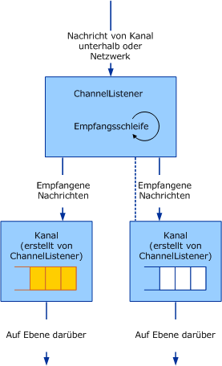

# <a name="service-channel-listeners-and-channels"></a><span data-ttu-id="2c9f5-102">Dienst: Kanallistener und Kanäle</span><span class="sxs-lookup"><span data-stu-id="2c9f5-102">Service: Channel listeners and channels</span></span>

<span data-ttu-id="2c9f5-103">Es gibt drei Kategorien von kanalobjekten: Kanäle, Kanallistener und kanalfactorys.</span><span class="sxs-lookup"><span data-stu-id="2c9f5-103">There are three categories of channel objects: channels, channel listeners, and channel factories.</span></span> <span data-ttu-id="2c9f5-104">Kanäle sind die Schnittstelle zwischen der Anwendung und dem Kanalstapel.</span><span class="sxs-lookup"><span data-stu-id="2c9f5-104">Channels are the interface between the application and the channel stack.</span></span> <span data-ttu-id="2c9f5-105">Kanallistener sind für die Erstellung von Kanälen auf der Empfänger- (oder Abhör-)Seite zuständig, normalerweise als Reaktion auf eine neue eingehende Nachricht oder Verbindung.</span><span class="sxs-lookup"><span data-stu-id="2c9f5-105">Channel listeners are responsible for creating channels on the receive (or listen) side, typically in response to a new incoming message or connection.</span></span> <span data-ttu-id="2c9f5-106">Kanalfactorys sind dafür zuständig, Kanäle auf der Senderseite zu erstellen, um eine Kommunikation mit einem Endpunkt zu initiieren.</span><span class="sxs-lookup"><span data-stu-id="2c9f5-106">Channel factories are responsible for creating channels on the send side to initiate communication with an endpoint.</span></span>

## <a name="channel-listeners-and-channels"></a><span data-ttu-id="2c9f5-107">Kanallistener und Kanäle</span><span class="sxs-lookup"><span data-stu-id="2c9f5-107">Channel listeners and channels</span></span>

<span data-ttu-id="2c9f5-108">Kanallistener sind für die Erstellung von Kanälen und den Empfang von Nachrichten von der unteren Ebene oder vom Netzwerk zuständig.</span><span class="sxs-lookup"><span data-stu-id="2c9f5-108">Channel listeners are responsible for creating channels and receiving messages from the layer below or from the network.</span></span> <span data-ttu-id="2c9f5-109">Empfangene Nachrichten werden der oberen Ebene mithilfe eines Kanals, der durch den Kanallistener erstellt wird, zugestellt.</span><span class="sxs-lookup"><span data-stu-id="2c9f5-109">Received messages are delivered to the layer above using a channel that is created by the channel listener.</span></span>

<span data-ttu-id="2c9f5-110">Im folgenden Diagramm wird der Prozess des Empfangs von Nachrichten und ihrer Übermittlung an die obere Ebene veranschaulicht.</span><span class="sxs-lookup"><span data-stu-id="2c9f5-110">The following diagram illustrates the process of receiving messages and delivering them to the layer above.</span></span>

<span data-ttu-id="2c9f5-111"></span><span class="sxs-lookup"><span data-stu-id="2c9f5-111"></span></span>

<span data-ttu-id="2c9f5-112">Ein Kanallistener, der Nachrichten empfängt und sie der oberen Ebene über Kanäle zustellt.</span><span class="sxs-lookup"><span data-stu-id="2c9f5-112">A channel listener receiving messages and delivering to the layer above through channels.</span></span>

<span data-ttu-id="2c9f5-113">Der Prozess kann in jedem Kanal als Warteschlange konzipiert werden, obwohl die Implementierung möglicherweise keine Warteschlange verwendet.</span><span class="sxs-lookup"><span data-stu-id="2c9f5-113">The process can be conceptually modeled as a queue inside each channel although the implementation may not actually use a queue.</span></span> <span data-ttu-id="2c9f5-114">Der Kanallistener ist dafür zuständig, Nachrichten von der unteren Ebene oder vom Netzwerk zu empfangen und sie in die Warteschlange zu stellen.</span><span class="sxs-lookup"><span data-stu-id="2c9f5-114">The channel listener is responsible for receiving messages from the layer below or the network and putting them in the queue.</span></span> <span data-ttu-id="2c9f5-115">Der Kanal ist für das Abrufen von Nachrichten aus der Warteschlange und ihre Übergabe an die obere Ebene zuständig, wenn diese Ebene eine Nachricht anfordert, z. B. durch Aufrufen von `Receive` im Kanal.</span><span class="sxs-lookup"><span data-stu-id="2c9f5-115">The channel is responsible for getting messages from the queue and handing them to the layer above when that layer asks for a message, for example by calling `Receive` on the channel.</span></span>

<span data-ttu-id="2c9f5-116">WCF stellt basisklassenhilfen für diesen Prozess bereit.</span><span class="sxs-lookup"><span data-stu-id="2c9f5-116">WCF provides base class helpers for this process.</span></span> <span data-ttu-id="2c9f5-117">(Für ein Diagramm der Kanal-Hilfsklassen, die in diesem Artikel beschrieben wird, finden Sie unter [Übersicht über das Kanalmodell](channel-model-overview.md).)</span><span class="sxs-lookup"><span data-stu-id="2c9f5-117">(For a diagram of the channel helper classes discussed in this article, see [Channel Model Overview](channel-model-overview.md).)</span></span>

- <span data-ttu-id="2c9f5-118">Die <xref:System.ServiceModel.Channels.CommunicationObject> -Klasse implementiert <xref:System.ServiceModel.ICommunicationObject> und erzwingt die in Schritt 2 beschriebenen Zustandsautomaten [Entwickeln von Kanälen](developing-channels.md).</span><span class="sxs-lookup"><span data-stu-id="2c9f5-118">The <xref:System.ServiceModel.Channels.CommunicationObject> class implements <xref:System.ServiceModel.ICommunicationObject> and enforces the state machine described in step 2 of [Developing Channels](developing-channels.md).</span></span>

- <span data-ttu-id="2c9f5-119">Die <xref:System.ServiceModel.Channels.ChannelManagerBase> -Klasse implementiert <xref:System.ServiceModel.Channels.CommunicationObject> und bietet eine einheitliche Basisklasse für <xref:System.ServiceModel.Channels.ChannelFactoryBase> und <xref:System.ServiceModel.Channels.ChannelListenerBase>.</span><span class="sxs-lookup"><span data-stu-id="2c9f5-119">The <xref:System.ServiceModel.Channels.ChannelManagerBase> class implements <xref:System.ServiceModel.Channels.CommunicationObject> and provides a unified base class for <xref:System.ServiceModel.Channels.ChannelFactoryBase> and <xref:System.ServiceModel.Channels.ChannelListenerBase>.</span></span> <span data-ttu-id="2c9f5-120">Die <xref:System.ServiceModel.Channels.ChannelManagerBase>-Klasse funktioniert in Verbindung mit <xref:System.ServiceModel.Channels.ChannelBase>. Dies ist eine Basisklasse, die <xref:System.ServiceModel.Channels.IChannel> implementiert.</span><span class="sxs-lookup"><span data-stu-id="2c9f5-120">The <xref:System.ServiceModel.Channels.ChannelManagerBase> class works in conjunction with <xref:System.ServiceModel.Channels.ChannelBase>, which is a base class that implements <xref:System.ServiceModel.Channels.IChannel>.</span></span>

- <span data-ttu-id="2c9f5-121">Die <xref:System.ServiceModel.Channels.ChannelFactoryBase> -Klasse implementiert <xref:System.ServiceModel.Channels.ChannelManagerBase> und <xref:System.ServiceModel.Channels.IChannelFactory> und konsolidiert die `CreateChannel` -Überladungen in einer `OnCreateChannel` abstrakte Methode.</span><span class="sxs-lookup"><span data-stu-id="2c9f5-121">The <xref:System.ServiceModel.Channels.ChannelFactoryBase> class implements <xref:System.ServiceModel.Channels.ChannelManagerBase> and <xref:System.ServiceModel.Channels.IChannelFactory> and consolidates the `CreateChannel` overloads into one `OnCreateChannel` abstract method.</span></span>

- <span data-ttu-id="2c9f5-122">Die <xref:System.ServiceModel.Channels.ChannelListenerBase> -Klasse implementiert <xref:System.ServiceModel.Channels.IChannelListener>.</span><span class="sxs-lookup"><span data-stu-id="2c9f5-122">The <xref:System.ServiceModel.Channels.ChannelListenerBase> class implements <xref:System.ServiceModel.Channels.IChannelListener>.</span></span> <span data-ttu-id="2c9f5-123">Die Klasse wird für grundlegende Zustandsverwaltung verwendet.</span><span class="sxs-lookup"><span data-stu-id="2c9f5-123">It takes care of basic state management.</span></span>

<span data-ttu-id="2c9f5-124">Die folgende Diskussion basiert auf der [Transport: UDP](../../../../docs/framework/wcf/samples/transport-udp.md) Beispiel.</span><span class="sxs-lookup"><span data-stu-id="2c9f5-124">The following discussion is based upon the [Transport: UDP](../../../../docs/framework/wcf/samples/transport-udp.md) sample.</span></span>

## <a name="creating-a-channel-listener"></a><span data-ttu-id="2c9f5-125">Erstellen eines kanallisteners</span><span class="sxs-lookup"><span data-stu-id="2c9f5-125">Creating a channel listener</span></span>

<span data-ttu-id="2c9f5-126">Die `UdpChannelListener` abgeleitet, dass das Beispiel implementiert die <xref:System.ServiceModel.Channels.ChannelListenerBase> Klasse.</span><span class="sxs-lookup"><span data-stu-id="2c9f5-126">The `UdpChannelListener` that the sample implements derives from the <xref:System.ServiceModel.Channels.ChannelListenerBase> class.</span></span> <span data-ttu-id="2c9f5-127">Er verwendet einen einzelnen UDP-Socket, um Datagramme zu empfangen.</span><span class="sxs-lookup"><span data-stu-id="2c9f5-127">It uses a single UDP socket to receive datagrams.</span></span> <span data-ttu-id="2c9f5-128">Die `OnOpen`-Methode empfängt Daten mit dem UDP-Socket in einer asynchronen Schleife.</span><span class="sxs-lookup"><span data-stu-id="2c9f5-128">The `OnOpen` method receives data using the UDP socket in an asynchronous loop.</span></span> <span data-ttu-id="2c9f5-129">Die Daten werden dann mit dem Nachrichtencodierungssystem in Nachrichten konvertiert:</span><span class="sxs-lookup"><span data-stu-id="2c9f5-129">The data are then converted into messages using the message encoding system:</span></span>

```csharp
message = UdpConstants.MessageEncoder.ReadMessage(
  new ArraySegment<byte>(buffer, 0, count),
  bufferManager
);
```

<span data-ttu-id="2c9f5-130">Da derselbe Datagrammkanal Nachrichten darstellt, die aus einer Reihe von Quellen eintreffen, ist der `UdpChannelListener` ein Singletonlistener.</span><span class="sxs-lookup"><span data-stu-id="2c9f5-130">Because the same datagram channel represents messages that arrive from a number of sources, the `UdpChannelListener` is a singleton listener.</span></span> <span data-ttu-id="2c9f5-131">Es gibt höchstens einen aktiven <xref:System.ServiceModel.Channels.IChannel> diesem Listener gleichzeitig zugeordnet.</span><span class="sxs-lookup"><span data-stu-id="2c9f5-131">There is at most one active <xref:System.ServiceModel.Channels.IChannel> associated with this listener at a time.</span></span> <span data-ttu-id="2c9f5-132">In diesem Beispiel wird nur dann ein weiterer generiert, wenn ein Kanal, der mit der <xref:System.ServiceModel.Channels.ChannelListenerBase%601.AcceptChannel%2A>-Methode zurückgegeben wird, anschließend freigegeben wird.</span><span class="sxs-lookup"><span data-stu-id="2c9f5-132">The sample generates another one only if a channel that is returned by the <xref:System.ServiceModel.Channels.ChannelListenerBase%601.AcceptChannel%2A> method is subsequently disposed.</span></span> <span data-ttu-id="2c9f5-133">Wenn eine Nachricht empfangen wird, ist es in diesem in die Warteschlange eingereiht.</span><span class="sxs-lookup"><span data-stu-id="2c9f5-133">When a message is received, it's enqueued into this singleton channel.</span></span>

### <a name="udpinputchannel"></a><span data-ttu-id="2c9f5-134">UdpInputChannel</span><span class="sxs-lookup"><span data-stu-id="2c9f5-134">UdpInputChannel</span></span>

<span data-ttu-id="2c9f5-135">Die `UdpInputChannel` -Klasse implementiert <xref:System.ServiceModel.Channels.IInputChannel>.</span><span class="sxs-lookup"><span data-stu-id="2c9f5-135">The `UdpInputChannel` class implements <xref:System.ServiceModel.Channels.IInputChannel>.</span></span> <span data-ttu-id="2c9f5-136">Sie besteht aus einer Warteschlange mit eingehenden Nachrichten, die vom `UdpChannelListener`-Socket gefüllt wird.</span><span class="sxs-lookup"><span data-stu-id="2c9f5-136">It consists of a queue of incoming messages that is populated by the `UdpChannelListener`'s socket.</span></span> <span data-ttu-id="2c9f5-137">Diese Nachrichten werden mit der <xref:System.ServiceModel.Channels.IInputChannel.Receive%2A>-Methode aus der Warteschlange entfernt.</span><span class="sxs-lookup"><span data-stu-id="2c9f5-137">These messages are dequeued by the <xref:System.ServiceModel.Channels.IInputChannel.Receive%2A> method.</span></span>
