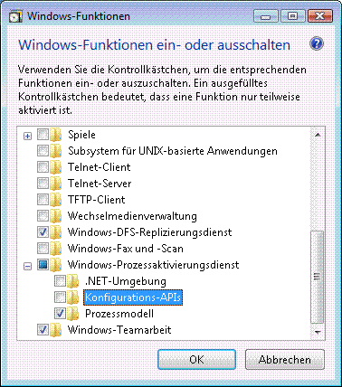
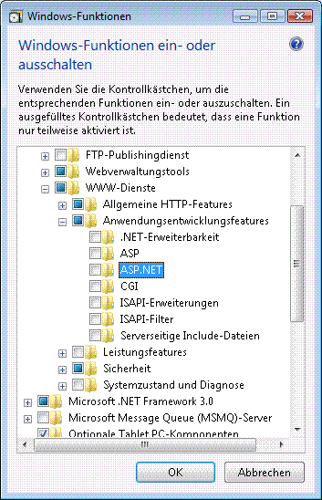
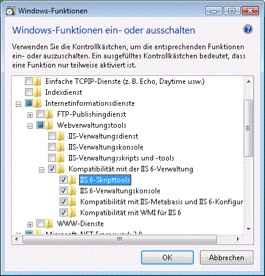

# <a name="configuring-internet-information-services-70-for-windows-communication-foundation"></a>Konfigurieren von Internetinformationsdienste 7.0 für Windows Communication Foundation

Internetinformationsdienste (IIS) 7.0 weist einen modularen Aufbau auf, der es Ihnen ermöglicht, die benötigten Komponenten selektiv zu installieren. Dieser Entwurf basiert auf der neuen, in Windows Vista eingeführten manifestressorisierungstechnologie. Es gibt mehr als 40 eigenständige Funktionskomponenten von IIS 7,0, die unabhängig installiert werden können. Dies ermöglicht es IT-Profis, die Installation problemlos nach Bedarf anzupassen. In diesem Thema wird erläutert, wie Sie IIS 7,0 für die Verwendung mit Windows Communication Foundation (WCF) konfigurieren und ermitteln, welche Komponenten erforderlich sind.

## <a name="minimal-installation-installing-was"></a>Minimale Installation: Installieren von WAS
 Die minimale Installation des gesamten IIS 7,0-Pakets besteht darin, den Windows-Prozess Aktivierungs Dienst (was) zu installieren. Was ist ein eigenständiges Feature, das das einzige Feature von IIS 7,0 ist, das für alle Windows Vista-Betriebssysteme (Home Basic, Home Premium, Business und Ultimate und Enterprise) verfügbar ist.

 Klicken Sie in der Systemsteuerung auf **Programme** und dann **auf Windows-Funktionen ein-oder ausschalten** , die unter **Programme und Funktionen**aufgeführt sind. die was-Komponente wird in der Liste wie in der folgenden Abbildung dargestellt angezeigt.

 

 Diese Funktion weist die folgenden untergeordneten Komponenten auf:

- .NET-Umgebung

- Konfiguration-APIs

- Prozessmodell

 Wenn Sie den Stamm Knoten von was ausgewählt haben, ist nur der untergeordnete Knoten **Prozessmodell** standardmäßig aktiviert. Beachten Sie, dass Sie mit dieser Installation lediglich WAS installieren, da kein Webserver unterstützt wird.

 Aktivieren Sie das Kontrollkästchen **.NET-Umgebung** , damit WCF oder eine beliebige ASP.NET-Anwendung funktioniert. Dies bedeutet, dass alle was-Komponenten erforderlich sind, damit WCF und ASP.net ordnungsgemäß funktionieren. Diese werden automatisch überprüft, sobald Sie eine dieser Komponenten installieren.

## <a name="iis-70-default-installation"></a>IIS 7.0: Standardinstallation
 Wenn Sie die **Internetinformationsdienste** Funktion aktivieren, werden einige der untergeordneten Knoten automatisch überprüft, wie in der folgenden Abbildung dargestellt.

 

 Dies ist die Standardinstallation von IIS 7,0. Mit dieser Installation können Sie IIS 7,0 verwenden, um statische Inhalte (z. b. HTML-Seiten und anderen Inhalt) zu bedienen. Sie können jedoch keine ASP.net-oder CGI-Anwendungen ausführen oder WCF-Dienste hosten.

## <a name="iis-70-installation-with-aspnet-support"></a>IIS 7.0: Installation mit ASP.NET-Unterstützung
 Sie müssen ASP.NET installieren, damit ASP.net auf IIS 7,0 funktioniert. Nachdem Sie **ASP.net**überprüft haben, sollte der Bildschirm wie in der folgenden Abbildung aussehen.

 

 Dies ist die minimale Umgebung für WCF-und ASP.NET-Anwendungen, die in IIS 7,0 funktionieren.

## <a name="iis-70-installation-with-iis-60-compatibility-components"></a>IIS 7.0: Installation mit IIS 6.0-Kompatibilitätskomponenten
 Bei der Installation von IIS 7,0 auf einem System mit Visual Studio 2005 oder einigen anderen Automatisierungs Skripts oder Tools (z. b. Adsutil. vb), die virtuelle Anwendungen konfigurieren, die die IIS 6,0-Metabasis-API verwenden, müssen Sie die IIS 6,0- **Skript Tools**überprüfen. Hierdurch werden automatisch die anderen untergeordneten Knoten der IIS 6,0- **Verwaltungs Kompatibilität**überprüft. Die folgende Abbildung zeigt den Bildschirm, nachdem dieser Vorgang abgeschlossen wurde:

 

 Mit dieser Installation haben Sie alles, was Sie für die Verwendung von IIS 7,0, ASP.net und WCF-Features und-Beispielen benötigen, die im Web verfügbar sind.

## <a name="request-limits"></a>Anforderungsbeschränkungen
 Unter Windows Vista mit IIS 7 wurde der Standardwert der `maxUri` `maxQueryStringSize` Einstellungen und geändert. Standardmäßig sind in Anforderungsfiltern in IIS 7.0 eine URL-Länge von 4096 Zeichen und Abfragezeichenfolgen mit einer Länge von 2048 Zeichen zulässig. Um diese Standardwerte zu ändern, fügen Sie das folgende XML der Datei App.config hinzu.

```xml
 <system.webServer>
    <security>
        <requestFiltering>
            <requestLimits maxUrl="8192" maxQueryString="8192" />
        </requestFiltering>
    </security>
 </system.webServer>
 ```

## <a name="see-also"></a>Siehe auch

- [WAS-Aktivierungsarchitektur](was-activation-architecture.md)
- [Konfigurieren von WAS für die Verwendung mit WCF](configuring-the-wpa--service-for-use-with-wcf.md)
- [Vorgehensweise: Installieren und Konfigurieren von WCF-Aktivierungskomponenten](how-to-install-and-configure-wcf-activation-components.md)
- [Windows Server AppFabric-Hostingfunktionen](/previous-versions/appfabric/ee677189(v=azure.10))
