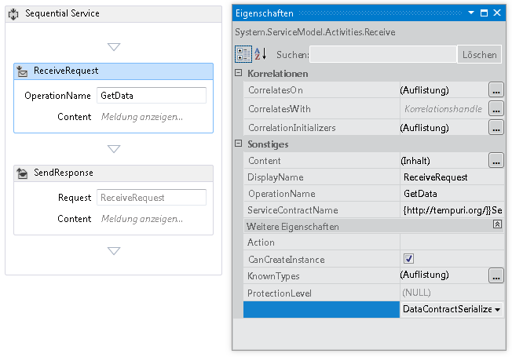
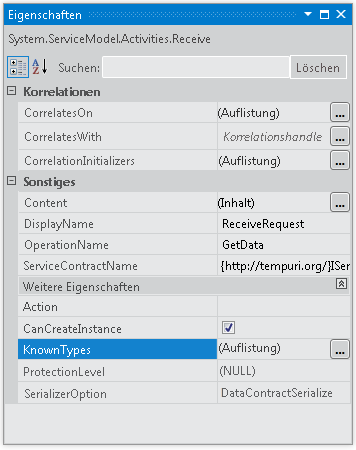
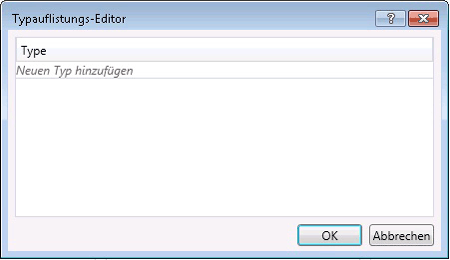

# <a name="configuring-serialization-in-a-workflow-service"></a><span data-ttu-id="a0ed5-102">Konfigurieren der Serialisierung in einem Workflowdienst</span><span class="sxs-lookup"><span data-stu-id="a0ed5-102">Configuring Serialization in a Workflow Service</span></span>
<span data-ttu-id="a0ed5-103">Workflowdienste sind Windows Communication Foundation (WCF)-Dienste, und daher haben die Möglichkeit, entweder die <xref:System.Runtime.Serialization.DataContractSerializer> (Standard) oder die <xref:System.Xml.Serialization.XmlSerializer>.</span><span class="sxs-lookup"><span data-stu-id="a0ed5-103">Workflow services are Windows Communication Foundation (WCF) services and so have the option of using either the <xref:System.Runtime.Serialization.DataContractSerializer> (the default) or the <xref:System.Xml.Serialization.XmlSerializer>.</span></span> <span data-ttu-id="a0ed5-104">Beim Schreiben von Nicht-Workflowdiensten wird der Typ des zu verwendenden Serialisierungsprogramms im Dienstvertrag oder Vorgangsvertrag angegeben.</span><span class="sxs-lookup"><span data-stu-id="a0ed5-104">When writing non-workflow services the type of serializer to use is specified on the service or operation contract.</span></span> <span data-ttu-id="a0ed5-105">Beim Erstellen von WCF-Workflowdienste keinen diese Verträge im Code angeben, aber sie werden vielmehr zur Laufzeit generiert, durch vertragsrückschluss.</span><span class="sxs-lookup"><span data-stu-id="a0ed5-105">When creating WCF workflow services you don’t specify these contracts in code, but rather they are generated at runtime by contract inference.</span></span> <span data-ttu-id="a0ed5-106">Weitere Informationen zum vertragsrückschluss finden Sie unter [mithilfe von Verträgen im Workflow](../../../../docs/framework/wcf/feature-details/using-contracts-in-workflow.md).</span><span class="sxs-lookup"><span data-stu-id="a0ed5-106">For more information about contract inference, see  [Using Contracts in Workflow](../../../../docs/framework/wcf/feature-details/using-contracts-in-workflow.md).</span></span>  <span data-ttu-id="a0ed5-107">Das Serialisierungsprogramm wird mithilfe der <xref:System.ServiceModel.Activities.Receive.SerializerOption%2A>-Eigenschaft angegeben.</span><span class="sxs-lookup"><span data-stu-id="a0ed5-107">The serializer is specified using the <xref:System.ServiceModel.Activities.Receive.SerializerOption%2A> property.</span></span> <span data-ttu-id="a0ed5-108">Diese kann im Designer festgelegt werden, wie in der folgenden Abbildung dargestellt.</span><span class="sxs-lookup"><span data-stu-id="a0ed5-108">This can be set in the designer as shown in the following illustration.</span></span>  
  
 <span data-ttu-id="a0ed5-109"></span><span class="sxs-lookup"><span data-stu-id="a0ed5-109"></span></span>  
  
 <span data-ttu-id="a0ed5-110">Das Serialisierungsprogramm kann auch im Code festgelegt werden, wie im folgenden Beispiel gezeigt.</span><span class="sxs-lookup"><span data-stu-id="a0ed5-110">The serializer can also be set in code as shown in the following example,</span></span>  
  
```  
Receive approveExpense = new Receive  
            {  
                OperationName = "ApproveExpense",  
                CanCreateInstance = true,  
                ServiceContractName = "FinanceService",  
                SerializerOption = SerializerOption.DataContractSerializer,  
                Content = ReceiveContent.Create(new OutArgument<Expense>(expense))  
            };  
```  
  
 <span data-ttu-id="a0ed5-111">Bekannte Typen können auch für Workflowdienste angegeben werden.</span><span class="sxs-lookup"><span data-stu-id="a0ed5-111">Known types can be specified on Workflow services as well.</span></span> <span data-ttu-id="a0ed5-112">Weitere Informationen zu bekannten Typen finden Sie unter [Data Contract Known Types](../../../../docs/framework/wcf/feature-details/data-contract-known-types.md).</span><span class="sxs-lookup"><span data-stu-id="a0ed5-112">For more information about Known Types see [Data Contract Known Types](../../../../docs/framework/wcf/feature-details/data-contract-known-types.md).</span></span> <span data-ttu-id="a0ed5-113">Bekannte Typen können im Designer oder im Code angegeben werden.</span><span class="sxs-lookup"><span data-stu-id="a0ed5-113">Known types can be specified in the designer or in code.</span></span> <span data-ttu-id="a0ed5-114">Um bekannte Typen im Designer anzugeben, klicken Sie im Eigenschaftenfenster für eine <xref:System.ServiceModel.Activities.Receive>-Aktivität neben der KnownTypes-Eigenschaft auf die Schaltfläche mit den Auslassungspunkten, wie in der folgenden Abbildung gezeigt.</span><span class="sxs-lookup"><span data-stu-id="a0ed5-114">To specify known types in the designer, click the ellipsis button next to the KnownTypes property in the properties window for a <xref:System.ServiceModel.Activities.Receive> activity as shown in the following illustration.</span></span>  
  
 <span data-ttu-id="a0ed5-115"></span><span class="sxs-lookup"><span data-stu-id="a0ed5-115"></span></span>  
  
 <span data-ttu-id="a0ed5-116">Dadurch wird der Typauflistungs-Editor angezeigt, mit dem Sie bekannte Typen suchen und angeben können.</span><span class="sxs-lookup"><span data-stu-id="a0ed5-116">This will display the Type Collections Editor that will allow you to search for and specify known types.</span></span>  
  
 <span data-ttu-id="a0ed5-117"></span><span class="sxs-lookup"><span data-stu-id="a0ed5-117"></span></span>  
  
 <span data-ttu-id="a0ed5-118">Klicken Sie auf die **neuen Typ hinzufügen** verknüpfen und mithilfe der Dropdownliste wählen oder suchen Sie für einen Typ der Auflistung bekannter Typen hinzu.</span><span class="sxs-lookup"><span data-stu-id="a0ed5-118">Click the **Add new type** link and use the drop down to select or search for a type to add to the known types collection.</span></span> <span data-ttu-id="a0ed5-119">Verwenden Sie die <xref:System.ServiceModel.Activities.Receive.KnownTypes%2A>-Eigenschaft, um bekannte Typen im Code anzugeben, wie im folgenden Beispiel gezeigt.</span><span class="sxs-lookup"><span data-stu-id="a0ed5-119">To specify known types in code use the <xref:System.ServiceModel.Activities.Receive.KnownTypes%2A> property as shown in the following example.</span></span>  
  
```csharp
Receive approveExpense = new Receive  
            {  
                OperationName = "ApproveExpense",  
                CanCreateInstance = true,  
                ServiceContractName = "FinanceService",  
                SerializerOption = SerializerOption.DataContractSerializer,  
                Content = ReceiveContent.Create(new OutArgument<Expense>(expense))  
            };  
            approveExpense.KnownTypes.Add(typeof(Travel));  
            approveExpense.KnownTypes.Add(typeof(Meal));  
```
