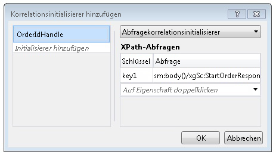

# Inhaltsbasierte KorrelationContent Based Correlation
Wenn Workflowdienste mit Clients und anderen Diensten kommunizieren, sind in den ausgetauschten Nachrichten häufig Daten enthalten, die eine Nachricht eindeutig mit einer bestimmten Instanz verknüpfen.When workflow services communicate with clients and other services, often there is some data in the exchanged messages that uniquely relates a message to a particular instance. Die inhaltsbasierte Korrelation verwendet diese Daten in der Nachricht, z. B. eine Kundennummer oder Bestellt-ID, um Nachrichten an die richtige Workflowinstanz weiterzuleiten.Content-based correlation uses this data in the message, such as a customer number or order ID, to route messages to the proper workflow instance. In diesem Thema wird erklärt, wie Sie die inhaltsbasierte Korrelation in Workflows verwenden.This topic explains how to use content-based correlation in workflows.  
  
## Verwenden der inhaltsbasierten KorrelationUsing Content-Based Correlation  
 Die inhaltsbasierte Korrelation wird verwendet, wenn ein Workflowdienst über mehrere Methoden verfügt, auf die von einem einzelnen Client zugegriffen wird, und ein Datenelement in den ausgetauschten Nachrichten die gewünschte Instanz angibt.Content-based correlation is used when a workflow service has multiple methods that are accessed by a single client and a piece of data in the exchanged messages identifies the desired instance.  
  
> [!NOTE]
>  Die inhaltsbasierte Korrelation ist nützlich, wenn die Kontextkorrelation nicht verwendet werden kann, weil es sich bei der Bindung nicht um eine der unterstützten Bindungen für den Kontextaustausch handelt.Content-based correlation is useful when context correlation cannot be used because the binding is not one of the supported context exchange bindings. Weitere Informationen zu kontextkorrelation, finden Sie unter [Kontextaustausch](../../../../docs/framework/wcf/feature-details/context-exchange-correlation.md).For more information about context correlation, see [Context Exchange](../../../../docs/framework/wcf/feature-details/context-exchange-correlation.md).  
  
 Jede bei dieser Kommunikation verwendete Messagingaktivität muss die Position der Daten in der Nachricht angeben, die die Instanz eindeutig identifizieren.Each messaging activity used in these communications must specify the location of the data in the message that uniquely identifies the instance. Dazu wird <xref:System.ServiceModel.MessageQuerySet> mit <xref:System.ServiceModel.Activities.QueryCorrelationInitializer> oder <xref:System.ServiceModel.Activities.Receive.CorrelatesOn%2A> bereitgestellt, um die Nachricht nach einem oder mehreren Datenelementen abzufragen, die die Instanz eindeutig identifizieren.This is done by providing a <xref:System.ServiceModel.MessageQuerySet>, using either a <xref:System.ServiceModel.Activities.QueryCorrelationInitializer> or <xref:System.ServiceModel.Activities.Receive.CorrelatesOn%2A>, that queries the message for the piece or pieces of data that uniquely identify the instance.  
  
> [!WARNING]
>  Die Daten zur Identifikation der Instanz werden per Hash in einen Korrelationsschlüssel umgewandelt.The data that is used to identify the instance is hashed into a correlation key. Dabei müssen Sie sicherstellen, dass die für die Korrelation verwendeten Daten eindeutig sind, da sonst Konflikte im Hashschlüssel auftreten und Nachrichten ggf. falsch weitergeleitet werden können.Care must be taken to ensure that the data used for correlation is unique or else collisions in the hashed key could occur and cause messages to be misrouted. Wenn eine Korrelation z. B. ausschließlich auf einem Kundennamen basiert, kann es zu einem Konflikt kommen, da es möglicherweise mehrere Kunden mit dem gleichen Namen gibt.For example, a correlation based solely on a customer name may cause a collision because there may be multiple customers with the same name. Der Doppelpunkt (`:`) darf nicht als Bestandteil der Daten verwendet werden, mit denen die Meldung korreliert wird, da hiermit bereits Schlüssel und Wert der Meldungsabfrage begrenzt werden, um die Zeichenfolge zu bilden, für die anschließend der Hashwert berechnet wird.The colon (`:`) should not be used as part of the data used to correlate the message because it is already used to delimit the message query’s key and value to form the string that is subsequently hashed.  
  
 Im folgenden Beispiel werden die ursprünglichen <xref:System.ServiceModel.Activities.Receive> / <xref:System.ServiceModel.Activities.SendReply> gibt in einem Workflowdienst eine `OrderId`, dem wird dann vom Client zurück übergeben, auf den Aufruf der folgenden <xref:System.ServiceModel.Activities.Receive> Aktivität im Workflowdienst.In the following example, the initial <xref:System.ServiceModel.Activities.Receive>/<xref:System.ServiceModel.Activities.SendReply> in a workflow service returns an `OrderId`, which is then passed back by the client on the call to the following <xref:System.ServiceModel.Activities.Receive> activity in the workflow service.  
  
 [!code-csharp[CFX_ContentCorrelation#1](../../../../samples/snippets/csharp/VS_Snippets_CFX/cfx_contentcorrelation/cs/program.cs#1)]  
  
 Im vorherigen Beispiel wird eine von der <xref:System.ServiceModel.Activities.SendReply>-Antwort initialisierte inhaltsbasierte Korrelation veranschaulicht.The previous example shows a content-based correlation that is initialized by the <xref:System.ServiceModel.Activities.SendReply>. Der <xref:System.ServiceModel.MessageQuerySet> gibt an, dass die Dateneinheit, mit der nachfolgende Nachrichten an diesen Dienst identifiziert werden, die `OrderId` ist.The <xref:System.ServiceModel.MessageQuerySet> specifies that the data used to identify subsequent messages to this service is the `OrderId`.  
  
 [!code-csharp[CFX_ContentCorrelation#2](../../../../samples/snippets/csharp/VS_Snippets_CFX/cfx_contentcorrelation/cs/program.cs#2)]  
  
 Die <xref:System.ServiceModel.Activities.Receive>-Aktivität, die der <xref:System.ServiceModel.Activities.SendReply> im Workflow folgt, folgt der Korrelation, die von der <xref:System.ServiceModel.Activities.SendReply> initialisiert wurde.The <xref:System.ServiceModel.Activities.Receive> activity that follows the <xref:System.ServiceModel.Activities.SendReply> in the workflow follows the correlation that was initialized by the <xref:System.ServiceModel.Activities.SendReply>. Beide Aktivitäten haben den gleichen <xref:System.ServiceModel.Activities.CorrelationHandle>, aber jede hat einen eigenen <xref:System.ServiceModel.MessageQuerySet> und eine eigene <xref:System.ServiceModel.XPathMessageQuery>, die angeben, wo in der jeweiligen Nachricht die identifizierenden Daten enthalten sind.Both activities share the same <xref:System.ServiceModel.Activities.CorrelationHandle>, but each one has its own <xref:System.ServiceModel.MessageQuerySet> and <xref:System.ServiceModel.XPathMessageQuery> that specifies where the identifying data is in that particular message. Auf die die Korrelation initialisierende Aktivität hin wird dieser <xref:System.ServiceModel.MessageQuerySet> in der <xref:System.ServiceModel.Activities.Receive.CorrelationInitializers%2A>-Eigenschaft angegeben, und bei weiteren <xref:System.ServiceModel.Activities.Receive>-Aktivitäten wird er mit der <xref:System.ServiceModel.Activities.Receive.CorrelatesOn%2A>-Eigenschaft angegeben.On the activity that initializes the correlation, this <xref:System.ServiceModel.MessageQuerySet> is specified in the <xref:System.ServiceModel.Activities.Receive.CorrelationInitializers%2A> property, and for any following <xref:System.ServiceModel.Activities.Receive> activities, it is specified using the <xref:System.ServiceModel.Activities.Receive.CorrelatesOn%2A> property.  
  
 [!code-csharp[CFX_ContentCorrelation#3](../../../../samples/snippets/csharp/VS_Snippets_CFX/cfx_contentcorrelation/cs/program.cs#3)]  
  
 Eine inhaltsbasierte Korrelation kann von jeder Messagingaktivität (<xref:System.ServiceModel.Activities.Send>, <xref:System.ServiceModel.Activities.Receive>, <xref:System.ServiceModel.Activities.SendReply>, <xref:System.ServiceModel.Activities.ReceiveReply>) initialisiert werden, wenn die Daten als Teil einer Nachricht weitergegeben werden.A content-based correlation can be initialized by any messaging activity (<xref:System.ServiceModel.Activities.Send>, <xref:System.ServiceModel.Activities.Receive>, <xref:System.ServiceModel.Activities.SendReply>, <xref:System.ServiceModel.Activities.ReceiveReply>) when the data flows as part of a message. Wenn die entsprechenden Daten nicht als Teil einer Nachricht weitergegeben werden, können sie unter Verwendung der <xref:System.ServiceModel.Activities.InitializeCorrelation>-Aktivität ausdrücklich initialisiert werden.If the particular piece of data does not flow as part of a message, then it can be initialized explicitly by using the <xref:System.ServiceModel.Activities.InitializeCorrelation> activity. Wenn zur eindeutigen Identifizierung der Nachricht verschiedene Daten erforderlich sind, können dem <xref:System.ServiceModel.MessageQuerySet> mehrere Abfragen hinzugefügt werden.If multiple pieces of data are required to uniquely identify the message, then multiple queries can be added to the <xref:System.ServiceModel.MessageQuerySet>. In diesen Beispielen wurde ein <xref:System.ServiceModel.Activities.CorrelationHandle> explizit für jede der Aktivitäten bereitgestellt, die die `CorrelatesWith`-Eigenschaft oder die `CorrelationHandle`-Eigenschaft verwenden, aber wenn nur eine Korrelation für den ganzen Workflow erforderlich ist, z. B. in diesem Beispiel, wo alles mit `OrderId` korreliert, ist die von <xref:System.ServiceModel.Activities.WorkflowServiceHost> bereitgestellte implizite Korrelationshandleverwaltung ausreichend.In these examples, a <xref:System.ServiceModel.Activities.CorrelationHandle> was explicitly provided to each of the activities using the `CorrelatesWith` or `CorrelationHandle` properties, but if there is only one correlation required for the entire workflow, such as in this example where everything correlates on `OrderId`, the implicit correlation handle management provided by <xref:System.ServiceModel.Activities.WorkflowServiceHost> is sufficient.  
  
## Verwenden der InitializeCorrelation-AktivitätUsing the InitializeCorrelation Activity  
 Im vorherigen Beispiel wurde die `OrderId` durch die <xref:System.ServiceModel.Activities.SendReply>-Aktivität an den Aufrufer weitergegeben, und hier wurde die Korrelation initialisiert.In the previous example, the `OrderId` flowed to the caller through the <xref:System.ServiceModel.Activities.SendReply> activity and this is where the correlation was initialized. Das gleiche Verhalten kann mit der <xref:System.ServiceModel.Activities.InitializeCorrelation>-Aktivität erreicht werden.The same behavior can be accomplished by using the <xref:System.ServiceModel.Activities.InitializeCorrelation> activity. Die <xref:System.ServiceModel.Activities.InitializeCorrelation>-Aktivität akzeptiert den <xref:System.ServiceModel.Activities.CorrelationHandle> und ein Wörterbuch von Elementen, die die Daten darstellen, mit denen die Nachricht der richtigen Instanz zugeordnet wird.The <xref:System.ServiceModel.Activities.InitializeCorrelation> activity takes the <xref:System.ServiceModel.Activities.CorrelationHandle> and a dictionary of items that represent the data used to map the message to the correct instance. Um im vorhergehenden Beispiel die <xref:System.ServiceModel.Activities.InitializeCorrelation>-Aktivität zu verwenden, entfernen Sie die <xref:System.ServiceModel.Activities.SendReply.CorrelationInitializers%2A> aus der <xref:System.ServiceModel.Activities.SendReply>-Aktivität, und initialisieren Sie die Korrelation mit der <xref:System.ServiceModel.Activities.InitializeCorrelation>-Aktivität.To use the <xref:System.ServiceModel.Activities.InitializeCorrelation> activity in the preceding sample, remove the <xref:System.ServiceModel.Activities.SendReply.CorrelationInitializers%2A> from the <xref:System.ServiceModel.Activities.SendReply> activity and initialize the correlation using the <xref:System.ServiceModel.Activities.InitializeCorrelation> activity.  
  
 [!code-csharp[CFX_ContentCorrelation#4](../../../../samples/snippets/csharp/VS_Snippets_CFX/cfx_contentcorrelation/cs/program.cs#4)]  
  
 Die <xref:System.ServiceModel.Activities.InitializeCorrelation>-Aktivität wird dann im Workflow verwendet, nachdem die die Daten enthaltenden Variablen aufgefüllt wurden, aber vor der <xref:System.ServiceModel.Activities.Receive>-Aktivität, die dem initialisierten <xref:System.ServiceModel.Activities.CorrelationHandle> entspricht.The <xref:System.ServiceModel.Activities.InitializeCorrelation> activity is then used in the workflow, after the variables that hold the data are populated but before the <xref:System.ServiceModel.Activities.Receive> activity that correlates with the initialized <xref:System.ServiceModel.Activities.CorrelationHandle>.  
  
 [!code-csharp[CFX_ContentCorrelation#5](../../../../samples/snippets/csharp/VS_Snippets_CFX/cfx_contentcorrelation/cs/program.cs#5)]  
  
## Konfigurieren von XPath-Abfragen mit Workflow-DesignerConfiguring XPath Queries Using the Workflow Designer  
 In den vorherigen Beispielen wurden die in der Nachricht verwendeten Aktivitäten und XPath-Abfragen im Code angegeben.In the previous examples, the activities and the XPath queries used in the message queries were specified in code. Der Workflow-Designer in [!INCLUDE[vs_current_long](../../../../includes/vs-current-long-md.md)] bietet auch die Möglichkeit, XPaths aus `DataContract`-Typen für inhaltsbasierte Korrelation zu generieren.The workflow designer in [!INCLUDE[vs_current_long](../../../../includes/vs-current-long-md.md)] also provides the ability to generate XPaths from `DataContract` types for content-based correlation. Der erste im vorherigen Beispiel konfigurierte XPath wurde für die <xref:System.ServiceModel.Activities.SendReply> konfiguriert.The first XPath configured in the previous example was configured for the <xref:System.ServiceModel.Activities.SendReply>.  
  
 [!code-csharp[CFX_ContentCorrelation#2](../../../../samples/snippets/csharp/VS_Snippets_CFX/cfx_contentcorrelation/cs/program.cs#2)]  
  
 Um den XPath für eine Messagingaktivität im Workflow-Designer zu konfigurieren, wählen Sie die Aktivität im Workflow-Designer aus.To configure the XPath for a messaging activity in the workflow designer, select the activity in the workflow designer. Wenn die Aktivität die Korrelation, wie im vorherigen Beispiel initialisiert wird, klicken Sie auf die Schaltfläche mit den Auslassungspunkten, für die **CorrelationInitializers** Eigenschaft in der **Eigenschaften** Fenster.If the activity is initializing the correlation, as in the previous example, click the ellipsis button for the **CorrelationInitializers** property in the **Properties** window. Dadurch wird die **Korrelationsinitialisierer hinzufügen** Dialogfenster.This displays the **Add Correlation Initializers** dialog window. In diesem Dialogfeld können Sie die Korrelationsart angeben und den Inhalt auswählen, der für die Korrelation verwendet werden soll.From this dialog you can specify the correlation type and select the content that is used for the correlation. Die <xref:System.ServiceModel.Activities.CorrelationHandle> Variablen wird angegeben, der **Initialisierer hinzufügen** Feld Korrelationstyp und die Daten der Korrelation ausgewählt ist, aus der **XPath-Abfragen** Abschnitt des Dialogfelds.The <xref:System.ServiceModel.Activities.CorrelationHandle> variable is specified in the **Add initializer** box, and the correlation type and data used for the correlation is selected from the **XPath Queries** section of the dialog box.  
  
   
  
 Die zweite XPath-Abfrage im vorherigen Beispiel wurde in der <xref:System.ServiceModel.Activities.Receive>-Aktivität konfiguriert.The second XPath query in the previous example was configured in the <xref:System.ServiceModel.Activities.Receive> activity.  
  
 [!code-csharp[CFX_ContentCorrelation#3](../../../../samples/snippets/csharp/VS_Snippets_CFX/cfx_contentcorrelation/cs/program.cs#3)]  
  
 Um die XPath-Abfrage für eine Messagingaktivität zu konfigurieren, die nicht die Korrelation initialisiert, wählen Sie die Aktivität im Workflow-Designer, und klicken Sie dann auf die Schaltfläche mit den Auslassungspunkten, für die **CorrelatesOn** Eigenschaft in der  **Eigenschaften** Fenster.To configure the XPath query for a messaging activity that does not initialize the correlation, select the activity in the workflow designer and then click the ellipsis button for the **CorrelatesOn** property in the **Properties** window. Dadurch wird die **CorrelatesOn-Definition** Dialogfenster.This displays the **CorrelatesOn Definition** dialog window.  
  
   
  
 In diesem Dialogfeld Geben Sie die <xref:System.ServiceModel.Activities.CorrelationHandle> und wählen Elemente in der **XPath-Abfragen** Liste aus, um die XPath-Abfrage zu erstellen.From this dialog you specify the <xref:System.ServiceModel.Activities.CorrelationHandle> and choose items in the **XPath Queries** list to build the XPath query.
