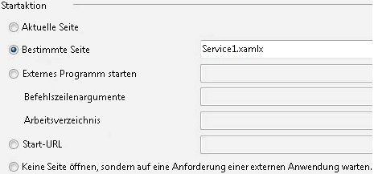

# <a name="creating-a-long-running-workflow-service"></a><span data-ttu-id="ade18-102">Erstellen eines Workflowdiensts mit langer Ausführungszeit</span><span class="sxs-lookup"><span data-stu-id="ade18-102">Creating a Long-running Workflow Service</span></span>
<span data-ttu-id="ade18-103">In diesem Thema wird beschrieben, wie ein Workflowdienst mit langer Laufzeit erstellt wird.</span><span class="sxs-lookup"><span data-stu-id="ade18-103">This topic describes how to create a long-running workflow service.</span></span> <span data-ttu-id="ade18-104">Workflowdienste mit langer Laufzeit können über einen sehr großen Zeitraum hinweg ausgeführt werden.</span><span class="sxs-lookup"><span data-stu-id="ade18-104">Long running workflow services may run for long periods of time.</span></span> <span data-ttu-id="ade18-105">Währenddessen kann der Workflow in den Leerlauf wechseln und auf weitere Informationen warten.</span><span class="sxs-lookup"><span data-stu-id="ade18-105">At some point the workflow may go idle waiting for some additional information.</span></span> <span data-ttu-id="ade18-106">In diesem Fall wird der Workflow in einer SQL-Datenbank beibehalten und aus dem Arbeitsspeicher entfernt.</span><span class="sxs-lookup"><span data-stu-id="ade18-106">When this occurs the workflow is persisted to a SQL database and is removed from memory.</span></span> <span data-ttu-id="ade18-107">Wenn weitere Informationen für die Workflowinstanz verfügbar sind, wird diese wieder in den Arbeitsspeicher geladen, und die Ausführung wird fortgesetzt.</span><span class="sxs-lookup"><span data-stu-id="ade18-107">When the additional information becomes available the workflow instance is loaded back into memory and continues executing.</span></span>  <span data-ttu-id="ade18-108">In diesem Szenario implementieren Sie ein stark vereinfachtes Bestellsystem.</span><span class="sxs-lookup"><span data-stu-id="ade18-108">In this scenario you are implementing a very simplified ordering system.</span></span>  <span data-ttu-id="ade18-109">Zunächst wird eine Nachricht vom Client an den Workflow gesendet, um die Bestellung zu beginnen.</span><span class="sxs-lookup"><span data-stu-id="ade18-109">The client sends an initial message to the workflow service to start the order.</span></span> <span data-ttu-id="ade18-110">Die Bestell-ID wird an den Client zurückgegeben.</span><span class="sxs-lookup"><span data-stu-id="ade18-110">It returns an order ID to the client.</span></span> <span data-ttu-id="ade18-111">Der Workflowdienst wartet nun auf eine weitere Nachricht vom Client, wechselt in den Leerlauf und wird in der SQL-Datenbank beibehalten.</span><span class="sxs-lookup"><span data-stu-id="ade18-111">At this point the workflow service is waiting for another message from the client and goes into the idle state and is persisted to a SQL Server database.</span></span>  <span data-ttu-id="ade18-112">Wenn die nächste Nachricht vom Client mit der Bestellung eines Artikels empfangen wird, wird der Workflowdienst wieder in den Arbeitsspeicher geladen, und die Bestellung wird abschließend bearbeitet.</span><span class="sxs-lookup"><span data-stu-id="ade18-112">When the client sends the next message to order an item, the workflow service is loaded back into memory and finishes processing the order.</span></span> <span data-ttu-id="ade18-113">In diesem Codebeispiel wird eine Zeichenfolge zurückgegeben, die angibt, dass der Artikel der Bestellung hinzugefügt wurde.</span><span class="sxs-lookup"><span data-stu-id="ade18-113">In the code sample it returns a string stating the item has been added to the order.</span></span> <span data-ttu-id="ade18-114">Das Codebeispiel ist nicht als reale Anwendung der Technologie gedacht. Es soll vielmehr auf einfache Weise einen Workflowdienst mit langer Laufzeit veranschaulichen.</span><span class="sxs-lookup"><span data-stu-id="ade18-114">The code sample is not meant to be a real world application of the technology, but rather a simple sample that illustrates long running workflow services.</span></span> <span data-ttu-id="ade18-115">In diesem Thema wird davon ausgegangen, dass Sie mit dem Erstellen von [!INCLUDE[vs_current_long](../../../../includes/vs-current-long-md.md)]-Projekten und -Projektmappen vertraut sind.</span><span class="sxs-lookup"><span data-stu-id="ade18-115">This topic assumes you know how to create [!INCLUDE[vs_current_long](../../../../includes/vs-current-long-md.md)] projects and solutions.</span></span>  
  
## <a name="prerequisites"></a><span data-ttu-id="ade18-116">Erforderliche Komponenten</span><span class="sxs-lookup"><span data-stu-id="ade18-116">Prerequisites</span></span>  
 <span data-ttu-id="ade18-117">Sie müssen folgende Software installiert haben, um diese exemplarische Vorgehensweise verwenden zu können:</span><span class="sxs-lookup"><span data-stu-id="ade18-117">You must have the following software installed to use this walkthrough:</span></span>  
  
1.  <span data-ttu-id="ade18-118">Microsoft SQL Server 2008</span><span class="sxs-lookup"><span data-stu-id="ade18-118">Microsoft SQL Server 2008</span></span>  
  
2.  [!INCLUDE[vs_current_long](../../../../includes/vs-current-long-md.md)]  
  
3.  <span data-ttu-id="ade18-119">Microsoft [!INCLUDE[netfx_current_long](../../../../includes/netfx-current-long-md.md)]</span><span class="sxs-lookup"><span data-stu-id="ade18-119">Microsoft  [!INCLUDE[netfx_current_long](../../../../includes/netfx-current-long-md.md)]</span></span>  
  
4.  <span data-ttu-id="ade18-120">Sie sind mit WCF und [!INCLUDE[vs_current_long](../../../../includes/vs-current-long-md.md)] vertraut und wissen, wie Projekte und Projektmappen erstellt werden.</span><span class="sxs-lookup"><span data-stu-id="ade18-120">You are familiar with WCF and [!INCLUDE[vs_current_long](../../../../includes/vs-current-long-md.md)] and know how to create projects/solutions.</span></span>  
  
### <a name="to-setup-the-sql-database"></a><span data-ttu-id="ade18-121">So richten Sie die SQL-Datenbank ein</span><span class="sxs-lookup"><span data-stu-id="ade18-121">To Setup the SQL Database</span></span>  
  
1.  <span data-ttu-id="ade18-122">Damit Workflowdienstinstanzen beibehalten werden können, muss Microsoft SQL Server installiert sein, und Sie müssen eine Datenbank konfiguriert haben, in der die beibehaltenen Workflowinstanzen gespeichert werden können.</span><span class="sxs-lookup"><span data-stu-id="ade18-122">In order for workflow service instances to be persisted you must have Microsoft SQL Server installed and you must configure a database to store the persisted workflow instances.</span></span> <span data-ttu-id="ade18-123">Microsoft SQL Management Studio ausführen, indem Sie auf die **starten** Schaltfläche auswählen **Programme**, **Microsoft SQL Server 2008**, und **Microsoft SQL Management Studio**.</span><span class="sxs-lookup"><span data-stu-id="ade18-123">Run Microsoft SQL Management Studio by clicking the **Start** button, selecting **All Programs**, **Microsoft SQL Server 2008**, and **Microsoft SQL Management Studio**.</span></span>  
  
2.  <span data-ttu-id="ade18-124">Klicken Sie auf die **verbinden** Schaltfläche zur Anmeldung beim SQL Server-Instanz</span><span class="sxs-lookup"><span data-stu-id="ade18-124">Click the **Connect** button to log on to the SQL Server instance</span></span>  
  
3.  <span data-ttu-id="ade18-125">Klicken Sie mit der rechten Maustaste auf **Datenbanken** in der Strukturansicht, und wählen **neue Datenbank...**</span><span class="sxs-lookup"><span data-stu-id="ade18-125">Right click **Databases** in the tree view and select **New Database..**</span></span> <span data-ttu-id="ade18-126">So erstellen eine neue Datenbank mit dem Namen `SQLPersistenceStore`.</span><span class="sxs-lookup"><span data-stu-id="ade18-126">to create a new database called `SQLPersistenceStore`.</span></span>  
  
4.  <span data-ttu-id="ade18-127">Führen Sie die Skriptdatei SqlWorkflowInstanceStoreSchema.sql unter C:\Windows\Microsoft.NET\Framework\v4.0\SQL\en in der SQLPersistenceStore-Datenbank aus, um die erforderlichen Datenbankschemas einzurichten.</span><span class="sxs-lookup"><span data-stu-id="ade18-127">Run the SqlWorkflowInstanceStoreSchema.sql script file located in the C:\Windows\Microsoft.NET\Framework\v4.0\SQL\en directory on the SQLPersistenceStore database to set up the needed database schemas.</span></span>  
  
5.  <span data-ttu-id="ade18-128">Führen Sie die Skriptdatei SqlWorkflowInstanceStoreLogic.sql unter C:\Windows\Microsoft.NET\Framework\v4.0\SQL\en in der SQLPersistenceStore-Datenbank aus, um die erforderliche Datenbanklogik einzurichten.</span><span class="sxs-lookup"><span data-stu-id="ade18-128">Run the SqlWorkflowInstanceStoreLogic.sql script file located in the C:\Windows\Microsoft.NET\Framework\v4.0\SQL\en directory on the SQLPersistenceStore database to set up the needed database logic.</span></span>  
  
### <a name="to-create-the-web-hosted-workflow-service"></a><span data-ttu-id="ade18-129">So erstellen Sie den im Internet gehosteten Workflowdienst</span><span class="sxs-lookup"><span data-stu-id="ade18-129">To Create the Web Hosted Workflow Service</span></span>  
  
1.  <span data-ttu-id="ade18-130">Erstellen Sie eine [!INCLUDE[vs_current_long](../../../../includes/vs-current-long-md.md)]-Projektmappe mit dem Namen `OrderProcessing`.</span><span class="sxs-lookup"><span data-stu-id="ade18-130">Create an empty [!INCLUDE[vs_current_long](../../../../includes/vs-current-long-md.md)] solution, name it `OrderProcessing`.</span></span>  
  
2.  <span data-ttu-id="ade18-131">Fügen Sie der Projektmappe das neue [!INCLUDE[indigo2](../../../../includes/indigo2-md.md)]-Workflowdienstanwendungsprojekt `OrderService` hinzu.</span><span class="sxs-lookup"><span data-stu-id="ade18-131">Add a new [!INCLUDE[indigo2](../../../../includes/indigo2-md.md)] Workflow Service Application project called `OrderService` to the solution.</span></span>  
  
3.  <span data-ttu-id="ade18-132">Wählen Sie im Eigenschaftendialogfeld Projekts die **Web** Registerkarte.</span><span class="sxs-lookup"><span data-stu-id="ade18-132">In the project properties dialog, select the **Web** tab.</span></span>  
  
    1.  <span data-ttu-id="ade18-133">Klicken Sie unter **Startaktion** wählen **bestimmte Seite** , und geben Sie `Service1.xamlx`.</span><span class="sxs-lookup"><span data-stu-id="ade18-133">Under **Start Action** select **Specific Page** and specify `Service1.xamlx`.</span></span>  
  
         <span data-ttu-id="ade18-134"></span><span class="sxs-lookup"><span data-stu-id="ade18-134"></span></span>  
  
    2.  <span data-ttu-id="ade18-135">Klicken Sie unter **Server** wählen **lokalen IIS-Webserver verwenden**.</span><span class="sxs-lookup"><span data-stu-id="ade18-135">Under **Servers** select **Use Local IIS Web server**.</span></span>  
  
         <span data-ttu-id="ade18-136"></span><span class="sxs-lookup"><span data-stu-id="ade18-136"></span></span>  
  
        > [!WARNING]
        >  <span data-ttu-id="ade18-137">[!INCLUDE[vs_current_long](../../../../includes/vs-current-long-md.md)] muss im Administratormodus ausgeführt werden, um diese Einstellung vorzunehmen.</span><span class="sxs-lookup"><span data-stu-id="ade18-137">You must run [!INCLUDE[vs_current_long](../../../../includes/vs-current-long-md.md)] in administrator mode to make this setting.</span></span>  
  
         <span data-ttu-id="ade18-138">Mit diesen beiden Schritten wird das Workflowdienstprojekt konfiguriert, das von IIS gehostet werden soll.</span><span class="sxs-lookup"><span data-stu-id="ade18-138">These two steps configure the workflow service project to be hosted by IIS.</span></span>  
  
4.  <span data-ttu-id="ade18-139">Öffnen Sie `Service1.xamlx` ist dies nicht bereits geöffnet ist, und löschen Sie die vorhandene **ReceiveRequest** und **SendResponse** Aktivitäten.</span><span class="sxs-lookup"><span data-stu-id="ade18-139">Open `Service1.xamlx` if it is not open already and delete the existing **ReceiveRequest** and **SendResponse** activities.</span></span>  
  
5.  <span data-ttu-id="ade18-140">Wählen Sie die **sequenzieller Dienst** Aktivität, und klicken Sie auf die **Variablen** verknüpfen, und fügen die Variablen in der folgenden Abbildung gezeigt.</span><span class="sxs-lookup"><span data-stu-id="ade18-140">Select the **Sequential Service** activity and click the **Variables** link and add the variables shown in the following illustration.</span></span> <span data-ttu-id="ade18-141">Dadurch werden einige Variablen hinzugefügt, die im weiteren Verlauf in diesem Workflow verwendet werden.</span><span class="sxs-lookup"><span data-stu-id="ade18-141">Doing this adds some variables that will be used later on in the workflow service.</span></span>  
  
    > [!NOTE]
    >  <span data-ttu-id="ade18-142">Wenn CorrelationHandle nicht in der Dropdownliste Variablentyp enthalten ist, wählen Sie **nach Typen suchen** aus der Dropdownliste aus.</span><span class="sxs-lookup"><span data-stu-id="ade18-142">If CorrelationHandle is not in the Variable Type drop-down, select **Browse for types** from the drop-down.</span></span> <span data-ttu-id="ade18-143">Geben Sie CorrelationHandle im die **Typnamen** Feld, wählen Sie CorrelationHandle aus dem Listenfeld aus, und klicken Sie auf **OK**.</span><span class="sxs-lookup"><span data-stu-id="ade18-143">Type CorrelationHandle in the **Type name** box, select CorrelationHandle from the listbox and click **OK**.</span></span>  
  
     <span data-ttu-id="ade18-144"></span><span class="sxs-lookup"><span data-stu-id="ade18-144"></span></span>  
  
6.  <span data-ttu-id="ade18-145">Drag & drop eine **ReceiveAndSendReply** Aktivitätsvorlage in der **sequenzieller Dienst** Aktivität.</span><span class="sxs-lookup"><span data-stu-id="ade18-145">Drag and drop a **ReceiveAndSendReply** activity template into the **Sequential Service** activity.</span></span> <span data-ttu-id="ade18-146">Diese Gruppe von Aktivitäten empfängt eine Nachricht von einem Client und sendet eine Antwort.</span><span class="sxs-lookup"><span data-stu-id="ade18-146">This set of activities will receive a message from a client and send a reply back.</span></span>  
  
    1.  <span data-ttu-id="ade18-147">Wählen Sie die **Receive** Aktivität, und legen die Eigenschaften in der folgenden Abbildung hervorgehoben.</span><span class="sxs-lookup"><span data-stu-id="ade18-147">Select the **Receive** activity and set the properties highlighted in the following illustration.</span></span>  
  
         <span data-ttu-id="ade18-148"></span><span class="sxs-lookup"><span data-stu-id="ade18-148"></span></span>  
  
         <span data-ttu-id="ade18-149">Mit der DisplayName-Eigenschaft wird der angezeigte Name für die Receive-Aktivität im Designer festgelegt.</span><span class="sxs-lookup"><span data-stu-id="ade18-149">The DisplayName property sets the name displayed for the Receive activity in the designer.</span></span> <span data-ttu-id="ade18-150">Mit der ServiceContractName-Eigenschaft und der OperationName-Eigenschaft wird der Name des Dienstvertrags und des Vorgangs angegeben, die von der Receive-Aktivität implementiert werden.</span><span class="sxs-lookup"><span data-stu-id="ade18-150">The ServiceContractName and OperationName properties specify the name of the service contract and operation that are implemented by the Receive activity.</span></span> [!INCLUDE[crabout](../../../../includes/crabout-md.md)]<span data-ttu-id="ade18-151">Weitere Informationen finden Sie Dienste wie Verträgen im Workflow verwendet werden [Verwenden von Verträgen im Workflow](../../../../docs/framework/wcf/feature-details/using-contracts-in-workflow.md).</span><span class="sxs-lookup"><span data-stu-id="ade18-151"> how contracts are used in Workflow services see [Using Contracts in Workflow](../../../../docs/framework/wcf/feature-details/using-contracts-in-workflow.md).</span></span>  
  
    2.  <span data-ttu-id="ade18-152">Klicken Sie auf die **definieren...**  wiederherstellungsverknüpfung in der **ReceiveStartOrder** Aktivität, und legen Sie die Eigenschaften, die in der folgenden Abbildung gezeigt.</span><span class="sxs-lookup"><span data-stu-id="ade18-152">Click the **Define...** link in the **ReceiveStartOrder** activity and set the properties shown in the following illustration.</span></span>  <span data-ttu-id="ade18-153">Beachten Sie, dass die **Parameter** Optionsfeld ausgewählt ist, einen Parameter namens `p_customerName` gebunden ist, um die `customerName` Variable.</span><span class="sxs-lookup"><span data-stu-id="ade18-153">Notice that the **Parameters** radio button is selected, a parameter named `p_customerName` is bound to the `customerName` variable.</span></span> <span data-ttu-id="ade18-154">Konfiguriert, um die **Receive** Aktivität einige Daten zu empfangen und diese Daten zu lokalen Variablen zu binden.</span><span class="sxs-lookup"><span data-stu-id="ade18-154">This configures the **Receive** activity to receive some data and bind that data to local variables.</span></span>  
  
         <span data-ttu-id="ade18-155"></span><span class="sxs-lookup"><span data-stu-id="ade18-155"></span></span>  
  
    3.  <span data-ttu-id="ade18-156">Wählen Sie die **SendReplyToReceive** Aktivität, und legen die hervorgehobene Eigenschaft, die in der folgenden Abbildung gezeigt.</span><span class="sxs-lookup"><span data-stu-id="ade18-156">Select The **SendReplyToReceive** activity and set the highlighted property shown in the following illustration.</span></span>  
  
         <span data-ttu-id="ade18-157"></span><span class="sxs-lookup"><span data-stu-id="ade18-157"></span></span>  
  
    4.  <span data-ttu-id="ade18-158">Klicken Sie auf die **definieren...**  wiederherstellungsverknüpfung in der **SendReplyToStartOrder** Aktivität, und legen Sie die Eigenschaften, die in der folgenden Abbildung gezeigt.</span><span class="sxs-lookup"><span data-stu-id="ade18-158">Click the **Define...** link in the **SendReplyToStartOrder** activity and set the properties shown in the following illustration.</span></span> <span data-ttu-id="ade18-159">Beachten Sie, dass die **Parameter** Optionsfeld aktiviert und der Parameter `p_orderId` gebunden ist, um die `orderId` Variable.</span><span class="sxs-lookup"><span data-stu-id="ade18-159">Notice that the **Parameters** radio button is selected; a parameter named `p_orderId` is bound to the `orderId` variable.</span></span> <span data-ttu-id="ade18-160">Mit dieser Einstellung wird festgelegt, dass von der SendReplyToStartOrder-Aktivität ein Wert vom Typ Zeichenfolge an den Aufrufer zurückgegeben wird.</span><span class="sxs-lookup"><span data-stu-id="ade18-160">This setting specifies that the SendReplyToStartOrder activity will return a value of type string to the caller.</span></span>  
  
         <span data-ttu-id="ade18-161"></span><span class="sxs-lookup"><span data-stu-id="ade18-161"></span></span>  
  
    5.  <span data-ttu-id="ade18-162">Drag & drop eine Assign-Aktivität zwischen der **Receive** und **SendReply** Aktivitäten und die Eigenschaften festlegen, wie in der folgenden Abbildung gezeigt:</span><span class="sxs-lookup"><span data-stu-id="ade18-162">Drag and drop an Assign activity in between the **Receive** and **SendReply** activities and set the properties as shown in the following illustration:</span></span>  
  
         <span data-ttu-id="ade18-163"></span><span class="sxs-lookup"><span data-stu-id="ade18-163"></span></span>  
  
         <span data-ttu-id="ade18-164">Dadurch wird eine neue Bestell-ID erstellt, und der Wert wird in der orderId-Variablen platziert.</span><span class="sxs-lookup"><span data-stu-id="ade18-164">This creates a new order ID and places the value in the orderId variable.</span></span>  
  
    6.  <span data-ttu-id="ade18-165">Wählen Sie die **ReplyToStartOrder** Aktivität.</span><span class="sxs-lookup"><span data-stu-id="ade18-165">Select the **ReplyToStartOrder** activity.</span></span> <span data-ttu-id="ade18-166">Klicken Sie im Eigenschaftenfenster auf die Schaltfläche mit den Auslassungspunkten für **CorrelationInitializers**.</span><span class="sxs-lookup"><span data-stu-id="ade18-166">In the properties window click the ellipsis button for **CorrelationInitializers**.</span></span> <span data-ttu-id="ade18-167">Wählen Sie die **Initialisierer hinzufügen** verknüpfen möchten, geben Sie `orderIdHandle` im initialisierertextfeld ein, wählen Sie abfragekorrelationsinitialisierer für den Korrelationstyp aus, und wählen Sie im Dropdownfeld XPath-Abfragen den Eintrag P_orderId.</span><span class="sxs-lookup"><span data-stu-id="ade18-167">Select the **Add initializer** link, enter `orderIdHandle` in the Initializer text box, select Query correlation initializer for the Correlation type, and select p_orderId under the XPATH Queries dropdown box.</span></span> <span data-ttu-id="ade18-168">Diese Einstellungen sind in der folgenden Abbildung dargestellt.</span><span class="sxs-lookup"><span data-stu-id="ade18-168">These settings are shown in the following illustration.</span></span> <span data-ttu-id="ade18-169">Klicken Sie auf **OK**.</span><span class="sxs-lookup"><span data-stu-id="ade18-169">Click **OK**.</span></span>  <span data-ttu-id="ade18-170">Dadurch wird eine Korrelation zwischen dem Client und dieser Instanz des Workflowdiensts initialisiert.</span><span class="sxs-lookup"><span data-stu-id="ade18-170">This initializes a correlation between the client and this instance of the workflow service.</span></span> <span data-ttu-id="ade18-171">Wenn eine Nachricht mit dieser Bestell-ID empfangen wird, wird sie an diese Instanz des Workflowdiensts weitergeleitet.</span><span class="sxs-lookup"><span data-stu-id="ade18-171">When a message containing this order ID is received it is routed to this instance of the workflow service.</span></span>  
  
         <span data-ttu-id="ade18-172"></span><span class="sxs-lookup"><span data-stu-id="ade18-172"></span></span>  
  
7.  <span data-ttu-id="ade18-173">Drag & drop ein weiteres **ReceiveAndSendReply** Aktivität bis zum Ende des Workflows (außerhalb der **Sequenz** , enthält die erste **Receive** und  **SendReply** Aktivitäten).</span><span class="sxs-lookup"><span data-stu-id="ade18-173">Drag and drop another **ReceiveAndSendReply** activity to the end of the workflow (outside the **Sequence** containing the first **Receive** and **SendReply** activities).</span></span> <span data-ttu-id="ade18-174">Dadurch wird die zweite Meldung empfangen, die vom Client gesendet wurde, und beantwortet.</span><span class="sxs-lookup"><span data-stu-id="ade18-174">This will receive the second message sent by the client and respond to it.</span></span>  
  
    1.  <span data-ttu-id="ade18-175">Wählen Sie die **Sequenz** , enthält die neu hinzugefügte **Receive** und **SendReply** Aktivitäten, und klicken Sie auf die **Variablen** Schaltfläche.</span><span class="sxs-lookup"><span data-stu-id="ade18-175">Select the **Sequence** that contains the newly added **Receive** and **SendReply** activities and click the **Variables** button.</span></span> <span data-ttu-id="ade18-176">Fügen Sie die in der folgenden Abbildung hervorgehobene Variable hinzu:</span><span class="sxs-lookup"><span data-stu-id="ade18-176">Add the variable highlighted in the following illustration:</span></span>  
  
         <span data-ttu-id="ade18-177"></span><span class="sxs-lookup"><span data-stu-id="ade18-177"></span></span>  
  
    2.  <span data-ttu-id="ade18-178">Wählen Sie die **Receive** Aktivität, und legen Sie die Eigenschaften, die in der folgenden Abbildung gezeigt:</span><span class="sxs-lookup"><span data-stu-id="ade18-178">Select the **Receive** activity and set the properties shown in the following illustration:</span></span>  
  
         <span data-ttu-id="ade18-179"></span><span class="sxs-lookup"><span data-stu-id="ade18-179"></span></span>  
  
    3.  <span data-ttu-id="ade18-180">Klicken Sie auf die **definieren...**  wiederherstellungsverknüpfung in der **ReceiveAddItem** Aktivität, und fügen Sie die Parameter in der folgenden Abbildung dargestellt: konfiguriert, um die Receive-Aktivität akzeptiert zwei Parameter, die die Bestell-ID und die ID des zu sortierenden Elements.</span><span class="sxs-lookup"><span data-stu-id="ade18-180">Click the **Define...** link in the **ReceiveAddItem** activity and add the parameters shown in the following illustration:This configures the receive activity to accept two parameters, the order ID and the ID of the item being ordered.</span></span>  
  
         <span data-ttu-id="ade18-181"></span><span class="sxs-lookup"><span data-stu-id="ade18-181"></span></span>  
  
    4.  <span data-ttu-id="ade18-182">Klicken Sie auf die **CorrelateOn** Auslassungszeichen und geben Sie `orderIdHandle`.</span><span class="sxs-lookup"><span data-stu-id="ade18-182">Click the **CorrelateOn** ellipsis button and enter `orderIdHandle`.</span></span> <span data-ttu-id="ade18-183">Klicken Sie unter **XPath-Abfragen**, klicken Sie auf den Dropdownpfeil, und wählen Sie `p_orderId`.</span><span class="sxs-lookup"><span data-stu-id="ade18-183">Under **XPath Queries**, click the drop down arrow and select `p_orderId`.</span></span> <span data-ttu-id="ade18-184">Dadurch wird die Korrelation für die zweite Receive-Aktivität konfiguriert.</span><span class="sxs-lookup"><span data-stu-id="ade18-184">This configures the correlation on the second receive activity.</span></span> [!INCLUDE[crabout](../../../../includes/crabout-md.md)]<span data-ttu-id="ade18-185">Korrelation finden Sie unter [Korrelation](../../../../docs/framework/wcf/feature-details/correlation.md).</span><span class="sxs-lookup"><span data-stu-id="ade18-185"> correlation see [Correlation](../../../../docs/framework/wcf/feature-details/correlation.md).</span></span>  
  
         <span data-ttu-id="ade18-186"></span><span class="sxs-lookup"><span data-stu-id="ade18-186"></span></span>  
  
    5.  <span data-ttu-id="ade18-187">Drag & drop ein **Wenn** Aktivität unmittelbar nach der **ReceiveAddItem** Aktivität.</span><span class="sxs-lookup"><span data-stu-id="ade18-187">Drag and drop an **If** activity immediately after the **ReceiveAddItem** activity.</span></span> <span data-ttu-id="ade18-188">Diese Aktivität verhält sich analog zu einer Anweisung.</span><span class="sxs-lookup"><span data-stu-id="ade18-188">This activity acts just like an if statement.</span></span>  
  
        1.  <span data-ttu-id="ade18-189">Legen Sie die **Bedingung** Eigenschaft`itemId=="Zune HD" (itemId="Zune HD" for Visual Basic)`</span><span class="sxs-lookup"><span data-stu-id="ade18-189">Set the **Condition** property to `itemId=="Zune HD" (itemId="Zune HD" for Visual Basic)`</span></span>  
  
        2.  <span data-ttu-id="ade18-190">Drag & drop ein **zuweisen** Aktivität in der **dann** Abschnitt und eine andere in der **Else** Abschnitt Festlegen der Eigenschaften eines der **zuweisen** Aktivitäten, wie in der folgenden Abbildung dargestellt.</span><span class="sxs-lookup"><span data-stu-id="ade18-190">Drag and drop an **Assign** activity in to the **Then** section and another into the **Else** section set the properties of the **Assign** activities as shown in the following illustration.</span></span>  
  
             <span data-ttu-id="ade18-191"></span><span class="sxs-lookup"><span data-stu-id="ade18-191"></span></span>  
  
             <span data-ttu-id="ade18-192">Wenn die Bedingung `true` der **dann** Abschnitt ausgeführt wird.</span><span class="sxs-lookup"><span data-stu-id="ade18-192">If the condition is `true` the **Then** section will be executed.</span></span> <span data-ttu-id="ade18-193">Wenn die Bedingung `false` der **Else** Bereich wird ausgeführt.</span><span class="sxs-lookup"><span data-stu-id="ade18-193">If the condition is `false` the **Else** section is executed.</span></span>  
  
        3.  <span data-ttu-id="ade18-194">Wählen Sie die **SendReplyToReceive** Aktivität, und legen die **DisplayName** Eigenschaft, die in der folgenden Abbildung gezeigt.</span><span class="sxs-lookup"><span data-stu-id="ade18-194">Select the **SendReplyToReceive** activity and set the **DisplayName** property shown in the following illustration.</span></span>  
  
             <span data-ttu-id="ade18-195"></span><span class="sxs-lookup"><span data-stu-id="ade18-195"></span></span>  
  
        4.  <span data-ttu-id="ade18-196">Klicken Sie auf die **definieren...**  wiederherstellungsverknüpfung in der **SetReplyToAddItem** Aktivität und konfigurieren Sie ihn wie in der folgenden Abbildung dargestellt.</span><span class="sxs-lookup"><span data-stu-id="ade18-196">Click the **Define ...** link in the **SetReplyToAddItem** activity and configure it as shown in the following illustration.</span></span> <span data-ttu-id="ade18-197">Konfiguriert, um die **SendReplyToAddItem** Aktivität zum Zurückgeben des Werts in der `orderResult` Variable.</span><span class="sxs-lookup"><span data-stu-id="ade18-197">This configures the **SendReplyToAddItem** activity to return the value in the `orderResult` variable.</span></span>  
  
             <span data-ttu-id="ade18-198"></span><span class="sxs-lookup"><span data-stu-id="ade18-198"></span></span>  
  
8.  <span data-ttu-id="ade18-199">Öffnen Sie die Datei "Web.config", und fügen Sie die folgenden Elemente in der \<Verhalten > Abschnitt aus, um die Workflowpersistenz zu aktivieren.</span><span class="sxs-lookup"><span data-stu-id="ade18-199">Open the web.config file and add the following elements in the \<behavior> section to enable workflow persistence.</span></span>  
  
    ```xml  
    <sqlWorkflowInstanceStore connectionString="Data Source=your-machine\SQLExpress;Initial Catalog=SQLPersistenceStore;Integrated Security=True;Asynchronous Processing=True" instanceEncodingOption="None" instanceCompletionAction="DeleteAll" instanceLockedExceptionAction="BasicRetry" hostLockRenewalPeriod="00:00:30" runnableInstancesDetectionPeriod="00:00:02" />  
              <workflowIdle timeToUnload="0"/>  
    ```  
  
    > [!WARNING]
    >  <span data-ttu-id="ade18-200">Ersetzen Sie den Namen des Hosts und der SQL Server-Instanz aus dem vorherigen Codeausschnitt.</span><span class="sxs-lookup"><span data-stu-id="ade18-200">Make sure to replace your host and SQL server instance name in the previous code snippet.</span></span>  
  
9. <span data-ttu-id="ade18-201">Erstellen Sie die Projektmappe.</span><span class="sxs-lookup"><span data-stu-id="ade18-201">Build the solution.</span></span>  
  
### <a name="to-create-a-client-application-to-call-the-workflow-service"></a><span data-ttu-id="ade18-202">So erstellen Sie eine Clientanwendung zum Aufrufen des Workflowdiensts</span><span class="sxs-lookup"><span data-stu-id="ade18-202">To Create a Client Application to Call the Workflow Service</span></span>  
  
1.  <span data-ttu-id="ade18-203">Fügen Sie der Projektmappe ein neues Konsolenanwendungsprojekt mit dem Namen `OrderClient` hinzu.</span><span class="sxs-lookup"><span data-stu-id="ade18-203">Add a new Console application project called `OrderClient` to the solution.</span></span>  
  
2.  <span data-ttu-id="ade18-204">Fügen Sie dem `OrderClient`-Projekt Verweise auf die folgenden Assemblys hinzu:</span><span class="sxs-lookup"><span data-stu-id="ade18-204">Add references to the following assemblies to the `OrderClient` project</span></span>  
  
    1.  <span data-ttu-id="ade18-205">System.ServiceModel.dll</span><span class="sxs-lookup"><span data-stu-id="ade18-205">System.ServiceModel.dll</span></span>  
  
    2.  <span data-ttu-id="ade18-206">System.ServiceModel.Activities.dll</span><span class="sxs-lookup"><span data-stu-id="ade18-206">System.ServiceModel.Activities.dll</span></span>  
  
3.  <span data-ttu-id="ade18-207">Fügen Sie dem Workflowdienst einen Dienstverweis hinzu, und geben Sie `OrderService` als Namespace an.</span><span class="sxs-lookup"><span data-stu-id="ade18-207">Add a service reference to the workflow service and specify `OrderService` as the namespace.</span></span>  
  
4.  <span data-ttu-id="ade18-208">Fügen Sie der `Main()`-Methode des Clientprojekts den folgenden Code hinzu:</span><span class="sxs-lookup"><span data-stu-id="ade18-208">In the `Main()` method of the client project add the following code:</span></span>  
  
    ```  
    static void Main(string[] args)  
    {  
       // Send initial message to start the workflow service  
       Console.WriteLine("Sending start message");  
       StartOrderClient startProxy = new StartOrderClient();  
       string orderId = startProxy.StartOrder("Kim Abercrombie");  
  
       // The workflow service is now waiting for the second message to be sent  
       Console.WriteLine("Workflow service is idle...");  
       Console.WriteLine("Press [ENTER] to send an add item message to reactivate the workflow service...");  
       Console.ReadLine();  
  
       // Send the second message  
       Console.WriteLine("Sending add item message");  
       AddItemClient addProxy = new AddItemClient();  
       AddItem item = new AddItem();  
       item.p_itemId = "Zune HD";  
       item.p_orderId = orderId;  
  
       string orderResult = addProxy.AddItem(item);  
       Console.WriteLine("Service returned: " + orderResult);  
    }  
    ```  
  
5.  <span data-ttu-id="ade18-209">Erstellen Sie die Projektmappe, und führen Sie die `OrderClient`-Anwendung aus.</span><span class="sxs-lookup"><span data-stu-id="ade18-209">Build the solution and run the `OrderClient` application.</span></span> <span data-ttu-id="ade18-210">Der folgende Text wird vom Client angezeigt:</span><span class="sxs-lookup"><span data-stu-id="ade18-210">The client will display the following text:</span></span>  
  
    ```Output  
    Sending start messageWorkflow service is idle...Press [ENTER] to send an add item message to reactivate the workflow service...  
    ```  
  
6.  <span data-ttu-id="ade18-211">Um sicherzustellen, dass der Workflowdienst beibehalten wurde, starten Sie SQL Server Management Studio durch das Aufrufen der **starten** im Menü auswählen **Programme**, **fürMicrosoftSQLServer2008**, **SQL Server Management Studio**.</span><span class="sxs-lookup"><span data-stu-id="ade18-211">To verify that the workflow service has been persisted, start the SQL Server Management Studio by going to the **Start** menu, Selecting **All Programs**, **Microsoft SQL Server 2008**, **SQL Server Management Studio**.</span></span>  
  
    1.  <span data-ttu-id="ade18-212">Erweitern Sie im linken Bereich **Datenbanken**, **SQLPersistenceStore**, **Ansichten** und mit der rechten Maustaste auf **System.Activities.DurableInstancing.Instances**  , und wählen Sie **oberste 1000 Zeilen auswählen**.</span><span class="sxs-lookup"><span data-stu-id="ade18-212">In the left hand pane expand, **Databases**, **SQLPersistenceStore**, **Views** and right click **System.Activities.DurableInstancing.Instances** and select **Select Top 1000 Rows**.</span></span> <span data-ttu-id="ade18-213">In der **Ergebnisse** Bereich sollte mindestens eine Instanz aufgeführt.</span><span class="sxs-lookup"><span data-stu-id="ade18-213">In the **Results** pane verify you see at least one instance listed.</span></span> <span data-ttu-id="ade18-214">Es kann sein, dass auch Instanzen früherer Ausführungen aufgelistet sind, wenn Fehler bei der Ausführung aufgetreten sind.</span><span class="sxs-lookup"><span data-stu-id="ade18-214">There may be other instances from prior runs if an exception occurred while running.</span></span> <span data-ttu-id="ade18-215">Sie können vorhandene Zeilen löschen, indem Sie mit der rechten Maustaste auf **System.Activities.DurableInstancing.Instances** auswählen und **oberste 200 Zeilen bearbeiten**, drücken die **Execute** Schaltfläche Wählen Sie alle Zeilen im Ergebnisbereich und **löschen**.</span><span class="sxs-lookup"><span data-stu-id="ade18-215">You can delete existing rows by right clicking **System.Activities.DurableInstancing.Instances** and selecting **Edit Top 200 rows**, pressing the **Execute** button, selecting all rows in the results pane and selecting **delete**.</span></span>  <span data-ttu-id="ade18-216">Um zu überprüfen, ob in der Datenbank die Instanz angezeigt wird, die von Ihrer Anwendung erstellt wurde, können Sie überprüfen, ob die Ansicht für Instanzen vor Ausführung des Clients leer ist.</span><span class="sxs-lookup"><span data-stu-id="ade18-216">To verify the instance displayed in the database is the instance your application created, verify the instances view is empty prior to running the client.</span></span> <span data-ttu-id="ade18-217">Führen Sie die Abfrage (Oberste 1000 Zeilen auswählen) erneut aus, sobald der Client ausgeführt wird, und überprüfen Sie, ob eine neue Instanz hinzugefügt wurde.</span><span class="sxs-lookup"><span data-stu-id="ade18-217">Once the client is running re-run the query (Select Top 1000 Rows) and verify a new instance has been added.</span></span>  
  
7.  <span data-ttu-id="ade18-218">Drücken Sie die EINGABETASTE, um die Nachricht zum Hinzufügen des Artikels an den Workflowdienst zu senden.</span><span class="sxs-lookup"><span data-stu-id="ade18-218">Press enter to send the add item message to the workflow service.</span></span> <span data-ttu-id="ade18-219">Der folgende Text wird vom Client angezeigt:</span><span class="sxs-lookup"><span data-stu-id="ade18-219">The client will display the following text:</span></span>  
  
    ```Output  
    Sending add item messageService returned: Item added to orderPress any key to continue . . .  
    ```  
  
## <a name="see-also"></a><span data-ttu-id="ade18-220">Siehe auch</span><span class="sxs-lookup"><span data-stu-id="ade18-220">See Also</span></span>  
 [<span data-ttu-id="ade18-221">Workflowdienste</span><span class="sxs-lookup"><span data-stu-id="ade18-221">Workflow Services</span></span>](../../../../docs/framework/wcf/feature-details/workflow-services.md)
