# <a name="creating-a-long-running-workflow-service"></a>Erstellen eines Workflowdiensts mit langer Ausführungszeit
In diesem Thema wird beschrieben, wie ein Workflowdienst mit langer Laufzeit erstellt wird. Workflowdienste mit langer Laufzeit können über einen sehr großen Zeitraum hinweg ausgeführt werden. Währenddessen kann der Workflow in den Leerlauf wechseln und auf weitere Informationen warten. In diesem Fall wird der Workflow in einer SQL-Datenbank beibehalten und aus dem Arbeitsspeicher entfernt. Wenn weitere Informationen für die Workflowinstanz verfügbar sind, wird diese wieder in den Arbeitsspeicher geladen, und die Ausführung wird fortgesetzt.  In diesem Szenario implementieren Sie ein stark vereinfachtes Bestellsystem.  Zunächst wird eine Nachricht vom Client an den Workflow gesendet, um die Bestellung zu beginnen. Die Bestell-ID wird an den Client zurückgegeben. Der Workflowdienst wartet nun auf eine weitere Nachricht vom Client, wechselt in den Leerlauf und wird in der SQL-Datenbank beibehalten.  Wenn die nächste Nachricht vom Client mit der Bestellung eines Artikels empfangen wird, wird der Workflowdienst wieder in den Arbeitsspeicher geladen, und die Bestellung wird abschließend bearbeitet. In diesem Codebeispiel wird eine Zeichenfolge zurückgegeben, die angibt, dass der Artikel der Bestellung hinzugefügt wurde. Das Codebeispiel ist nicht als reale Anwendung der Technologie gedacht. Es soll vielmehr auf einfache Weise einen Workflowdienst mit langer Laufzeit veranschaulichen. In diesem Thema wird davon ausgegangen, dass Sie mit dem Erstellen von [!INCLUDE[vs_current_long](../../../../includes/vs-current-long-md.md)]-Projekten und -Projektmappen vertraut sind.  
  
## <a name="prerequisites"></a>Erforderliche Komponenten  
 Sie müssen folgende Software installiert haben, um diese exemplarische Vorgehensweise verwenden zu können:  
  
1.  Microsoft SQL Server 2008  
  
2.  [!INCLUDE[vs_current_long](../../../../includes/vs-current-long-md.md)]  
  
3.  Microsoft [!INCLUDE[netfx_current_long](../../../../includes/netfx-current-long-md.md)]  
  
4.  Sie sind mit WCF und [!INCLUDE[vs_current_long](../../../../includes/vs-current-long-md.md)] vertraut und wissen, wie Projekte und Projektmappen erstellt werden.  
  
### <a name="to-setup-the-sql-database"></a>So richten Sie die SQL-Datenbank ein  
  
1.  Damit Workflowdienstinstanzen beibehalten werden können, muss Microsoft SQL Server installiert sein, und Sie müssen eine Datenbank konfiguriert haben, in der die beibehaltenen Workflowinstanzen gespeichert werden können. Microsoft SQL Management Studio ausführen, indem Sie auf die **starten** Schaltfläche auswählen **Programme**, **Microsoft SQL Server 2008**, und **Microsoft SQL Management Studio**.  
  
2.  Klicken Sie auf die **verbinden** Schaltfläche zur Anmeldung beim SQL Server-Instanz  
  
3.  Klicken Sie mit der rechten Maustaste auf **Datenbanken** in der Strukturansicht, und wählen **neue Datenbank...** So erstellen eine neue Datenbank mit dem Namen `SQLPersistenceStore`.  
  
4.  Führen Sie die Skriptdatei SqlWorkflowInstanceStoreSchema.sql unter C:\Windows\Microsoft.NET\Framework\v4.0\SQL\en in der SQLPersistenceStore-Datenbank aus, um die erforderlichen Datenbankschemas einzurichten.  
  
5.  Führen Sie die Skriptdatei SqlWorkflowInstanceStoreLogic.sql unter C:\Windows\Microsoft.NET\Framework\v4.0\SQL\en in der SQLPersistenceStore-Datenbank aus, um die erforderliche Datenbanklogik einzurichten.  
  
### <a name="to-create-the-web-hosted-workflow-service"></a>So erstellen Sie den im Internet gehosteten Workflowdienst  
  
1.  Erstellen Sie eine [!INCLUDE[vs_current_long](../../../../includes/vs-current-long-md.md)]-Projektmappe mit dem Namen `OrderProcessing`.  
  
2.  Fügen Sie der Projektmappe das neue [!INCLUDE[indigo2](../../../../includes/indigo2-md.md)]-Workflowdienstanwendungsprojekt `OrderService` hinzu.  
  
3.  Wählen Sie im Eigenschaftendialogfeld Projekts die **Web** Registerkarte.  
  
    1.  Klicken Sie unter **Startaktion** wählen **bestimmte Seite** , und geben Sie `Service1.xamlx`.  
  
           
  
    2.  Klicken Sie unter **Server** wählen **lokalen IIS-Webserver verwenden**.  
  
         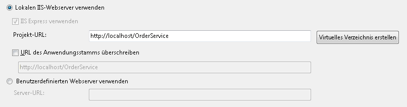  
  
        > [!WARNING]
        >  [!INCLUDE[vs_current_long](../../../../includes/vs-current-long-md.md)] muss im Administratormodus ausgeführt werden, um diese Einstellung vorzunehmen.  
  
         Mit diesen beiden Schritten wird das Workflowdienstprojekt konfiguriert, das von IIS gehostet werden soll.  
  
4.  Öffnen Sie `Service1.xamlx` ist dies nicht bereits geöffnet ist, und löschen Sie die vorhandene **ReceiveRequest** und **SendResponse** Aktivitäten.  
  
5.  Wählen Sie die **sequenzieller Dienst** Aktivität, und klicken Sie auf die **Variablen** verknüpfen, und fügen die Variablen in der folgenden Abbildung gezeigt. Dadurch werden einige Variablen hinzugefügt, die im weiteren Verlauf in diesem Workflow verwendet werden.  
  
    > [!NOTE]
    >  Wenn CorrelationHandle nicht in der Dropdownliste Variablentyp enthalten ist, wählen Sie **nach Typen suchen** aus der Dropdownliste aus. Geben Sie CorrelationHandle im die **Typnamen** Feld, wählen Sie CorrelationHandle aus dem Listenfeld aus, und klicken Sie auf **OK**.  
  
     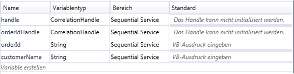  
  
6.  Drag & drop eine **ReceiveAndSendReply** Aktivitätsvorlage in der **sequenzieller Dienst** Aktivität. Diese Gruppe von Aktivitäten empfängt eine Nachricht von einem Client und sendet eine Antwort.  
  
    1.  Wählen Sie die **Receive** Aktivität, und legen die Eigenschaften in der folgenden Abbildung hervorgehoben.  
  
         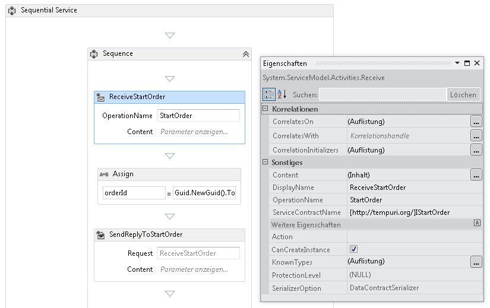  
  
         Mit der DisplayName-Eigenschaft wird der angezeigte Name für die Receive-Aktivität im Designer festgelegt. Mit der ServiceContractName-Eigenschaft und der OperationName-Eigenschaft wird der Name des Dienstvertrags und des Vorgangs angegeben, die von der Receive-Aktivität implementiert werden. [!INCLUDE[crabout](../../../../includes/crabout-md.md)]Weitere Informationen finden Sie Dienste wie Verträgen im Workflow verwendet werden [Verwenden von Verträgen im Workflow](../../../../docs/framework/wcf/feature-details/using-contracts-in-workflow.md).  
  
    2.  Klicken Sie auf die **definieren...**  wiederherstellungsverknüpfung in der **ReceiveStartOrder** Aktivität, und legen Sie die Eigenschaften, die in der folgenden Abbildung gezeigt.  Beachten Sie, dass die **Parameter** Optionsfeld ausgewählt ist, einen Parameter namens `p_customerName` gebunden ist, um die `customerName` Variable. Konfiguriert, um die **Receive** Aktivität einige Daten zu empfangen und diese Daten zu lokalen Variablen zu binden.  
  
         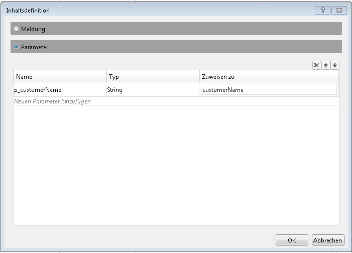  
  
    3.  Wählen Sie die **SendReplyToReceive** Aktivität, und legen die hervorgehobene Eigenschaft, die in der folgenden Abbildung gezeigt.  
  
         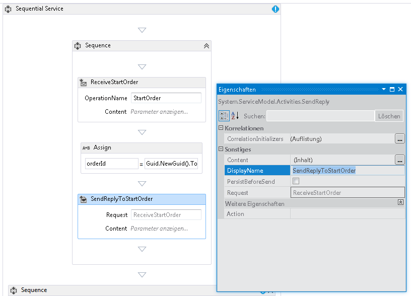  
  
    4.  Klicken Sie auf die **definieren...**  wiederherstellungsverknüpfung in der **SendReplyToStartOrder** Aktivität, und legen Sie die Eigenschaften, die in der folgenden Abbildung gezeigt. Beachten Sie, dass die **Parameter** Optionsfeld aktiviert und der Parameter `p_orderId` gebunden ist, um die `orderId` Variable. Mit dieser Einstellung wird festgelegt, dass von der SendReplyToStartOrder-Aktivität ein Wert vom Typ Zeichenfolge an den Aufrufer zurückgegeben wird.  
  
         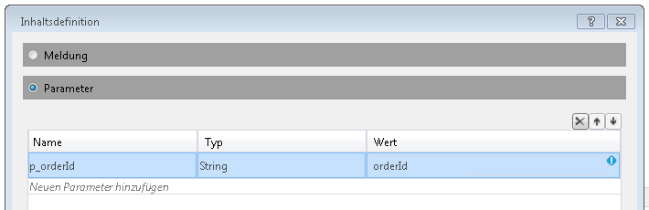  
  
    5.  Drag & drop eine Assign-Aktivität zwischen der **Receive** und **SendReply** Aktivitäten und die Eigenschaften festlegen, wie in der folgenden Abbildung gezeigt:  
  
         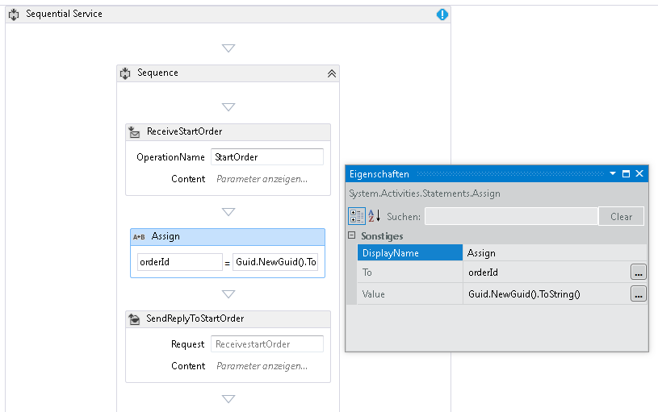  
  
         Dadurch wird eine neue Bestell-ID erstellt, und der Wert wird in der orderId-Variablen platziert.  
  
    6.  Wählen Sie die **ReplyToStartOrder** Aktivität. Klicken Sie im Eigenschaftenfenster auf die Schaltfläche mit den Auslassungspunkten für **CorrelationInitializers**. Wählen Sie die **Initialisierer hinzufügen** verknüpfen möchten, geben Sie `orderIdHandle` im initialisierertextfeld ein, wählen Sie abfragekorrelationsinitialisierer für den Korrelationstyp aus, und wählen Sie im Dropdownfeld XPath-Abfragen den Eintrag P_orderId. Diese Einstellungen sind in der folgenden Abbildung dargestellt. Klicken Sie auf **OK**.  Dadurch wird eine Korrelation zwischen dem Client und dieser Instanz des Workflowdiensts initialisiert. Wenn eine Nachricht mit dieser Bestell-ID empfangen wird, wird sie an diese Instanz des Workflowdiensts weitergeleitet.  
  
         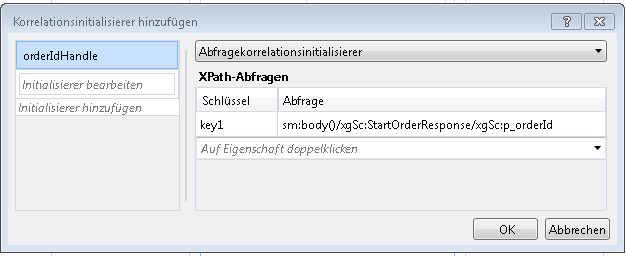  
  
7.  Drag & drop ein weiteres **ReceiveAndSendReply** Aktivität bis zum Ende des Workflows (außerhalb der **Sequenz** , enthält die erste **Receive** und  **SendReply** Aktivitäten). Dadurch wird die zweite Meldung empfangen, die vom Client gesendet wurde, und beantwortet.  
  
    1.  Wählen Sie die **Sequenz** , enthält die neu hinzugefügte **Receive** und **SendReply** Aktivitäten, und klicken Sie auf die **Variablen** Schaltfläche. Fügen Sie die in der folgenden Abbildung hervorgehobene Variable hinzu:  
  
         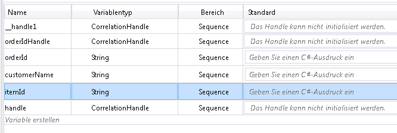  
  
    2.  Wählen Sie die **Receive** Aktivität, und legen Sie die Eigenschaften, die in der folgenden Abbildung gezeigt:  
  
         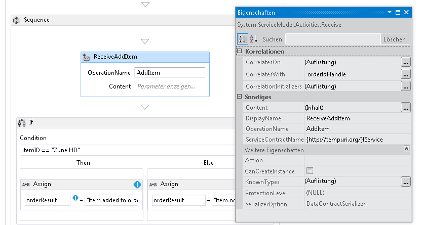  
  
    3.  Klicken Sie auf die **definieren...**  wiederherstellungsverknüpfung in der **ReceiveAddItem** Aktivität, und fügen Sie die Parameter in der folgenden Abbildung dargestellt: konfiguriert, um die Receive-Aktivität akzeptiert zwei Parameter, die die Bestell-ID und die ID des zu sortierenden Elements.  
  
         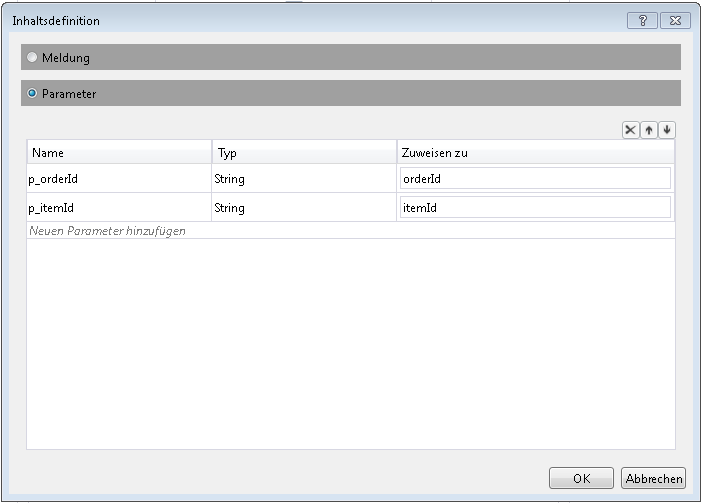  
  
    4.  Klicken Sie auf die **CorrelateOn** Auslassungszeichen und geben Sie `orderIdHandle`. Klicken Sie unter **XPath-Abfragen**, klicken Sie auf den Dropdownpfeil, und wählen Sie `p_orderId`. Dadurch wird die Korrelation für die zweite Receive-Aktivität konfiguriert. [!INCLUDE[crabout](../../../../includes/crabout-md.md)]Korrelation finden Sie unter [Korrelation](../../../../docs/framework/wcf/feature-details/correlation.md).  
  
         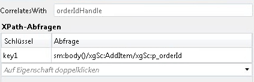  
  
    5.  Drag & drop ein **Wenn** Aktivität unmittelbar nach der **ReceiveAddItem** Aktivität. Diese Aktivität verhält sich analog zu einer Anweisung.  
  
        1.  Legen Sie die **Bedingung** Eigenschaft`itemId=="Zune HD" (itemId="Zune HD" for Visual Basic)`  
  
        2.  Drag & drop ein **zuweisen** Aktivität in der **dann** Abschnitt und eine andere in der **Else** Abschnitt Festlegen der Eigenschaften eines der **zuweisen** Aktivitäten, wie in der folgenden Abbildung dargestellt.  
  
             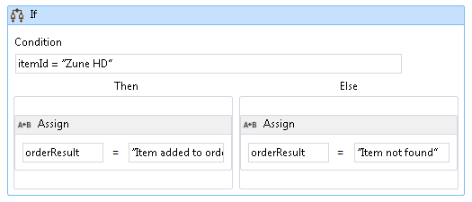  
  
             Wenn die Bedingung `true` der **dann** Abschnitt ausgeführt wird. Wenn die Bedingung `false` der **Else** Bereich wird ausgeführt.  
  
        3.  Wählen Sie die **SendReplyToReceive** Aktivität, und legen die **DisplayName** Eigenschaft, die in der folgenden Abbildung gezeigt.  
  
             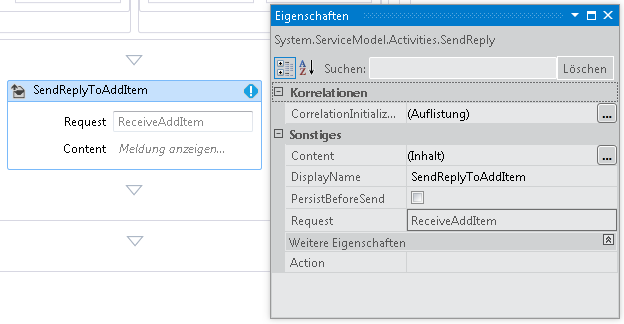  
  
        4.  Klicken Sie auf die **definieren...**  wiederherstellungsverknüpfung in der **SetReplyToAddItem** Aktivität und konfigurieren Sie ihn wie in der folgenden Abbildung dargestellt. Konfiguriert, um die **SendReplyToAddItem** Aktivität zum Zurückgeben des Werts in der `orderResult` Variable.  
  
             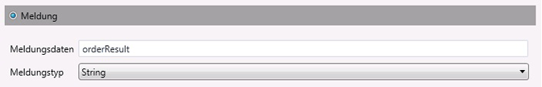  
  
8.  Öffnen Sie die Datei "Web.config", und fügen Sie die folgenden Elemente in der \<Verhalten > Abschnitt aus, um die Workflowpersistenz zu aktivieren.  
  
    ```xml  
    <sqlWorkflowInstanceStore connectionString="Data Source=your-machine\SQLExpress;Initial Catalog=SQLPersistenceStore;Integrated Security=True;Asynchronous Processing=True" instanceEncodingOption="None" instanceCompletionAction="DeleteAll" instanceLockedExceptionAction="BasicRetry" hostLockRenewalPeriod="00:00:30" runnableInstancesDetectionPeriod="00:00:02" />  
              <workflowIdle timeToUnload="0"/>  
    ```  
  
    > [!WARNING]
    >  Ersetzen Sie den Namen des Hosts und der SQL Server-Instanz aus dem vorherigen Codeausschnitt.  
  
9. Erstellen Sie die Projektmappe.  
  
### <a name="to-create-a-client-application-to-call-the-workflow-service"></a>So erstellen Sie eine Clientanwendung zum Aufrufen des Workflowdiensts  
  
1.  Fügen Sie der Projektmappe ein neues Konsolenanwendungsprojekt mit dem Namen `OrderClient` hinzu.  
  
2.  Fügen Sie dem `OrderClient`-Projekt Verweise auf die folgenden Assemblys hinzu:  
  
    1.  System.ServiceModel.dll  
  
    2.  System.ServiceModel.Activities.dll  
  
3.  Fügen Sie dem Workflowdienst einen Dienstverweis hinzu, und geben Sie `OrderService` als Namespace an.  
  
4.  Fügen Sie der `Main()`-Methode des Clientprojekts den folgenden Code hinzu:  
  
    ```  
    static void Main(string[] args)  
    {  
       // Send initial message to start the workflow service  
       Console.WriteLine("Sending start message");  
       StartOrderClient startProxy = new StartOrderClient();  
       string orderId = startProxy.StartOrder("Kim Abercrombie");  
  
       // The workflow service is now waiting for the second message to be sent  
       Console.WriteLine("Workflow service is idle...");  
       Console.WriteLine("Press [ENTER] to send an add item message to reactivate the workflow service...");  
       Console.ReadLine();  
  
       // Send the second message  
       Console.WriteLine("Sending add item message");  
       AddItemClient addProxy = new AddItemClient();  
       AddItem item = new AddItem();  
       item.p_itemId = "Zune HD";  
       item.p_orderId = orderId;  
  
       string orderResult = addProxy.AddItem(item);  
       Console.WriteLine("Service returned: " + orderResult);  
    }  
    ```  
  
5.  Erstellen Sie die Projektmappe, und führen Sie die `OrderClient`-Anwendung aus. Der folgende Text wird vom Client angezeigt:  
  
    ```Output  
    Sending start messageWorkflow service is idle...Press [ENTER] to send an add item message to reactivate the workflow service...  
    ```  
  
6.  Um sicherzustellen, dass der Workflowdienst beibehalten wurde, starten Sie SQL Server Management Studio durch das Aufrufen der **starten** im Menü auswählen **Programme**, **fürMicrosoftSQLServer2008**, **SQL Server Management Studio**.  
  
    1.  Erweitern Sie im linken Bereich **Datenbanken**, **SQLPersistenceStore**, **Ansichten** und mit der rechten Maustaste auf **System.Activities.DurableInstancing.Instances**  , und wählen Sie **oberste 1000 Zeilen auswählen**. In der **Ergebnisse** Bereich sollte mindestens eine Instanz aufgeführt. Es kann sein, dass auch Instanzen früherer Ausführungen aufgelistet sind, wenn Fehler bei der Ausführung aufgetreten sind. Sie können vorhandene Zeilen löschen, indem Sie mit der rechten Maustaste auf **System.Activities.DurableInstancing.Instances** auswählen und **oberste 200 Zeilen bearbeiten**, drücken die **Execute** Schaltfläche Wählen Sie alle Zeilen im Ergebnisbereich und **löschen**.  Um zu überprüfen, ob in der Datenbank die Instanz angezeigt wird, die von Ihrer Anwendung erstellt wurde, können Sie überprüfen, ob die Ansicht für Instanzen vor Ausführung des Clients leer ist. Führen Sie die Abfrage (Oberste 1000 Zeilen auswählen) erneut aus, sobald der Client ausgeführt wird, und überprüfen Sie, ob eine neue Instanz hinzugefügt wurde.  
  
7.  Drücken Sie die EINGABETASTE, um die Nachricht zum Hinzufügen des Artikels an den Workflowdienst zu senden. Der folgende Text wird vom Client angezeigt:  
  
    ```Output  
    Sending add item messageService returned: Item added to orderPress any key to continue . . .  
    ```  
  
## <a name="see-also"></a>Siehe auch  
 [Workflowdienste](../../../../docs/framework/wcf/feature-details/workflow-services.md)
