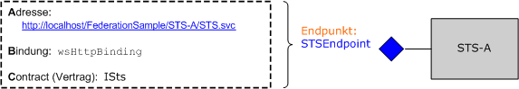

# <a name="federation"></a>Verbund
Dieses Thema enthält eine kurze Übersicht über den Begriff Verbundsicherheit. Außerdem wird die Unterstützung der Windows Communication Foundation (WCF) für die Bereitstellung von Verbundsicherheitsarchitekturen beschrieben. Eine Beispielanwendung, die den Verbund veranschaulicht, finden Sie unter [Verbundbeispiel](../../../../docs/framework/wcf/samples/federation-sample.md).  
  
## <a name="definition-of-federated-security"></a>Definition von Verbundsicherheit  
 Verbundsicherheit ermöglicht eine saubere Trennung zwischen dem Dienst, auf den ein Client zugreift, und den dazugehörigen Authentifizierungs- und Autorisierungsvorgängen. Darüber hinaus aktiviert Verbundsicherheit die Zusammenarbeit über mehrere Systeme, Netzwerke und Organisationen in anderen Vertrauensbereichen.  
  
 WCF bietet Unterstützung beim Erstellen und Bereitstellen verteilter Systeme, die Verbundsicherheit verwenden.  
  
### <a name="elements-of-a-federated-security-architecture"></a>Elemente einer Verbundsicherheitsarchitektur  
 Die Verbundsicherheitsarchitektur verfügt über drei Hauptelemente (siehe Beschreibung in der folgenden Tabelle).  
  
|Element|Beschreibung|  
|-------------|-----------------|  
|Domäne/Bereich|Eine einzelne Einheit von Sicherheitsverwaltung oder -vertrauen. Eine typische Domäne könnte eine einzelne Organisation einschließen.|  
|Verbund|Eine Auflistung von Domänen, die Vertrauenswürdigkeit bewiesen haben. Der Vertrauensgrad kann variieren, beinhaltet aber in der Regel eine Authentifizierung und fast immer eine Autorisierung. Ein typischer Verbund kann eine Reihe von Organisationen umfassen, die sich gegenseitig vertrauen und gemeinsam auf bestimmte Ressourcen zugreifen.|  
|Sicherheitstokendienst (STS; Security Token Service)|Hierbei handelt es sich um einen Webdienst, der Sicherheitstoken herausgibt, d. h. es werden basierend auf Beweisen, die als vertrauenswürdig eingestuft werden, Assertionen erstellt. Dies bildet die Grundlage für die Vertrauensvermittlung zwischen Domänen.|  
  
### <a name="example-scenario"></a>Beispielszenario  
 Die folgende Abbildung zeigt ein Beispiel für Verbundsicherheit:  
  
   
  
 Dieses Szenario enthält zwei Organisationen: A und B. Organisation B hat eine Webressource (einen Webdienst), die einige Benutzer in der Organisation A als wertvoll betrachten.  
  
> [!NOTE]
> In diesem Abschnitt werden die Begriffe *Ressource*, *Dienst*und *Webdienst* austauschbar verwendet.  
  
 Üblicherweise fordert Organisation B, dass ein Benutzer der Organisation A eine gültige Form der Authentifizierung bereitstellt, bevor der Zugriff auf den Dienst gewährt wird. Darüber hinaus kann die Organisation verlangen, dass der Benutzer für den Zugriff auf die spezifische Ressource autorisiert wird. Eine Art der Problemlösung und Ermöglichung des Zugriffs auf die Ressource in der Organisation B durch die Benutzer in der Organisation A ist folgendermaßen:  
  
- Benutzer von Organisation A registrieren Ihre Anmeldeinformationen (Benutzername und Kennwort) bei der Organisation B.  
  
- Während des Zugriffs auf die Ressource geben Benutzer der Organisation A Ihre Anmeldeinformationen an die Organisation B weiter und werden vor Zugriff auf die Ressource authentifiziert.  
  
 Dieser Ansatz hat drei bedeutende Nachteile:  
  
- Zusätzlich zur Verwaltung der Anmeldeinformationen der lokalen Benutzer muss die Organisation B die Anmeldeinformationen für Benutzer der Organisation A verwalten.  
  
- Benutzer der Organisation A müssen, abgesehen von den Anmeldeinformationen, die sie sonst für den Zugriff auf die Ressourcen innerhalb der Organisation verwenden, zusätzliche Anmeldeinformationen pflegen (d. h. einen zusätzlichen Benutzernamen und ein zusätzliches Kennwort). Es wird daher empfohlen, denselben Benutzernamen und dasselbe Kennwort für unterschiedliche Dienstsites zu verwenden, wobei es sich um eine anfällige Sicherheitsmaßnahme handelt.  
  
- Die Architektur nimmt keine Skalierung vor, während weitere Organisationen die Ressource bei Organisation B als wertvoll betrachten.  
  
 Ein alternativer Ansatz, der die zuvor erwähnten Nachteile berücksichtigt, ist die Bereitstellung von Verbundsicherheit. In diesem Ansatz bauen die Organisationen A und B eine Vertrauensbeziehung auf und verwenden STS (Security Token Service), um die Vermittlung des aufgebauten Vertrauens zu ermöglichen.  
  
 In einer Verbundsicherheitsarchitektur wissen Benutzer der Organisation A, dass sie einen gültigen Sicherheitstoken aus STS bei der Organisation vorlegen müssen, der ihren Zugang zum entsprechenden Dienst authentifiziert und autorisiert, wenn sie auf den Webdienst in Organisation B zugreifen möchten.  
  
 Durch die Kontaktaufnahme mit dem STS B erhalten die Benutzer eine andere Dereferenzierungsebene aus der zum STS gehörenden Richtlinie. Sie müssen einen gültigen Sicherheitstoken aus STS A (d. h. den Clientvertrauensbereich) vorweisen, bevor der STS B einen Sicherheitstoken an sie ausgeben kann. Hierbei handelt es sich um eine Folgeerscheinung aus der zwischen den beiden Organisationen aufgebauten Vertrauensbeziehung, wobei impliziert wird, dass Organisation B die Identitäten für Benutzer aus der Organisation A nicht verwalten muss. In der Praxis verfügt der STS B üblicherweise über eine Null-`issuerAddress` und eine `issuerMetadataAddress`. Weitere Informationen finden Sie unter [Gewusst wie: Konfigurieren eines lokalen Ausstellers](../../../../docs/framework/wcf/feature-details/how-to-configure-a-local-issuer.md). In diesem Fall konsultiert der Client eine lokale Richtlinie, um STS A zu finden. Diese Konfiguration wird als *Home Realm-Föderation* bezeichnet und wird besser skaliert, da STS B keine Informationen über STS A verwalten muss.  
  
 Die Benutzer kontaktieren nun den STS bei Organisation A und erhalten einen Sicherheitstoken, indem sie Authentifizierungsanmeldeinformationen vorlegen, die sie normalerweise für den Zugang zu anderen Ressourcen innerhalb der Organisation A verwenden. Hierdurch wird auch das Problem gemindert, dass Benutzer mehrere Sätze an Anmeldeinformationen pflegen müssen oder den gleichen Satz an Anmeldeinformationen für mehrere Dienstsites verwenden.  
  
 Nachdem die Benutzer einen Sicherheitstoken vom STS A erhalten haben, legen Sie den Token dem STS B vor. Organisation B führt die Autorisierung der Benutzeranfragen durch und gibt an die Benutzer einen Sicherheitstoken aus ihrem eigenen Satz an Sicherheitstoken heraus. Die Benutzer können dann ihren Token bei der Ressource bei Organisation B vorlegen und auf den Dienst zugreifen.  
  
## <a name="support-for-federated-security-in-wcf"></a>Unterstützung für Verbundsicherheit in WCF  
 WCF bietet schlüsselfertige Unterstützung für die Bereitstellung von Verbundsicherheitsarchitekturen über die [ \<wsFederationHttpBinding>](../../../../docs/framework/configure-apps/file-schema/wcf/wsfederationhttpbinding.md).  
  
 Das [ \<>-Element wsFederationHttpBinding](../../../../docs/framework/configure-apps/file-schema/wcf/wsfederationhttpbinding.md) bietet eine sichere, zuverlässige und interoperable Bindung, die die Verwendung von HTTP als zugrunde liegendem Transportmechanismus für den Kommunikationsstil für Anforderungs-Antwort-Kommunikation umfasst und Text und XML als Drahtformat für die Codierung verwendet.  
  
 Die Verwendung von [ \<wsFederationHttpBinding>](../../../../docs/framework/configure-apps/file-schema/wcf/wsfederationhttpbinding.md) in einem Verbundsicherheitsszenario kann in zwei logisch unabhängige Phasen entkoppelt werden, wie in den folgenden Abschnitten beschrieben.  
  
### <a name="phase-1-design-phase"></a>Phase 1: Entwurfsphase  
 Während der Entwurfsphase verwendet der Client das [ServiceModel Metadata Utility Tool (Svcutil.exe),](../../../../docs/framework/wcf/servicemodel-metadata-utility-tool-svcutil-exe.md) um die Vom Dienstendpunkt verfügbar gemachte Richtlinie zu lesen und die Authentifizierungs- und Autorisierungsanforderungen des Dienstes zu erfassen. Die entsprechenden Proxys werden erzeugt, um das folgende Verbundsicherheitskommunikationsmuster beim Client zu erstellen:  
  
- Erhalt eines Sicherheitstoken vom STS im Clientvertrauensbereich.  
  
- Präsentation des Token vor dem STS im Dienstvertrauensbereich.  
  
- Erhalt eines Sicherheitstoken vom STS im Dienstvertrauensbereich.  
  
- Präsentation des Token vor dem Dienst für den Zugriff auf den Dienst.  
  
### <a name="phase-2-run-time-phase"></a>Phase 2: Laufzeitphase  
 Während der Laufzeitphase instanziiert der Client ein Objekt der WCF-Clientklasse und führt einen Aufruf mithilfe des WCF-Clients aus. Das zugrunde liegende Framework von WCF verarbeitet die zuvor genannten Schritte im Verbundsicherheitskommunikationsmuster und ermöglicht dem Client die nahtlose Nutzung des Dienstes.  
  
## <a name="sample-implementation-using-wcf"></a>Beispielimplementierung mithilfe von WCF  
 Die folgende Abbildung zeigt eine Beispielimplementierung für eine Verbundsicherheitsarchitektur unter Verwendung systemeigener Unterstützung von WCF.  
  
   
  
### <a name="example-myservice"></a>Beispiel MyService  
 Der Dienst `MyService` macht durch `MyServiceEndpoint` einen einzelnen Endpunkt verfügbar. Die folgende Abbildung zeigt Adresse, Bindung und Vertrag an, die zum Endpunkt gehören.  
  
   
  
 Der Dienstendpunkt `MyServiceEndpoint` verwendet die `accessAuthorized` [ \<wsFederationHttpBinding->](../../../../docs/framework/configure-apps/file-schema/wcf/wsfederationhttpbinding.md) und erfordert ein gültiges SAML-Token (Security Assertions Markup Language) mit einem von STS B ausgegebenen Anspruch. Dies wird deklarativ in der Dienstkonfiguration angegeben.  
  
```xml  
<system.serviceModel>  
  <services>  
    <service type="FederationSample.MyService"
        behaviorConfiguration='MyServiceBehavior'>  
        <endpoint address=""  
            binding=" wsFederationHttpBinding"  
            bindingConfiguration='MyServiceBinding'  
            contract="Federation.IMyService" />  
   </service>  
  </services>  
  
  <bindings>  
    <wsFederationHttpBinding>  
    <!-- This is the binding used by MyService. It redirects   
    clients to STS-B. -->  
      <binding name='MyServiceBinding'>  
        <security mode="Message">  
           <message issuedTokenType=  
"http://docs.oasis-open.org/wss/oasis-wss-saml-token-profile-1.1#SAMLV1.1">  
           <issuer address="http://localhost/FederationSample/STS-B/STS.svc" />  
            <issuerMetadata
           address=  
"http://localhost/FederationSample/STS-B/STS.svc/mex" />  
         <requiredClaimTypes>  
            <add claimType="http://tempuri.org:accessAuthorized" />  
         </requiredClaimTypes>  
        </message>  
      </security>  
      </binding>  
    </wsFederationHttpBinding>  
  </bindings>  
  
  <behaviors>  
    <behavior name='MyServiceBehavior'>  
      <serviceAuthorization
operationRequirementType="FederationSample.MyServiceOperationRequirement, MyService" />  
       <serviceCredentials>  
         <serviceCertificate findValue="CN=FederationSample.com"  
         x509FindType="FindBySubjectDistinguishedName"  
         storeLocation='LocalMachine'  
         storeName='My' />  
      </serviceCredentials>  
    </behavior>  
  </behaviors>  
</system.serviceModel>  
```  
  
> [!NOTE]
> Ein Punkt über die für `MyService` erforderlichen Ansprüche sollte beachtet werden. Die zweite Abbildung zeigt, dass `MyService` ein SAML-Token mit einem `accessAuthorized`-Anspruch erfordert. Genauer gesagt gibt dies den Anspruchstyp an, den `MyService` erfordert. Der vollqualifizierte Name dieses Anspruchstyps ist `http://tempuri.org:accessAuthorized` (zusammen mit dem zugehörigen Namespace), der in der Dienstkonfigurationsdatei verwendet wird. Der Wert dieses Anspruchs zeigt das Vorhandensein dieses Anspruchs an und wird als von STS B auf `true` festgelegt angenommen.  
  
 Zur Laufzeit wird diese Richtlinie von der `MyServiceOperationRequirement`-Klasse erzwungen, die als Teil von `MyService` implementiert ist.  
  
 [!code-csharp[C_Federation#0](../../../../samples/snippets/csharp/VS_Snippets_CFX/c_federation/cs/source.cs#0)]
 [!code-vb[C_Federation#0](../../../../samples/snippets/visualbasic/VS_Snippets_CFX/c_federation/vb/source.vb#0)]  
[!code-csharp[C_Federation#1](../../../../samples/snippets/csharp/VS_Snippets_CFX/c_federation/cs/source.cs#1)]
[!code-vb[C_Federation#1](../../../../samples/snippets/visualbasic/VS_Snippets_CFX/c_federation/vb/source.vb#1)]  
  
#### <a name="sts-b"></a>STS B  
 Die folgende Abbildung zeigt den STS B. Wie zuvor erwähnt, ist ein STS (Security Token Service) auch ein Webdienst und kann über zugehörige Endpunkte, Richtlinien usw. verfügen.  
  
   
  
 STS B macht einen einzelnen Endpunkt namens `STSEndpoint` verfügbar, der verwendet werden kann, um das Sicherheitstoken anzufordern. STS B gibt insbesondere SAML-Token mit `accessAuthorized`-Anspruch heraus, die der `MyService`-Dienstsite vorgelegt werden können, um Zugriff auf den Dienst zu erhalten. Allerdings erfordert STS B, dass Benutzer ein gültiges SAML-Token vorlegen, das von STS A herausgegeben wurde und den `userAuthenticated`-Anspruch enthält. Dies wird deklarativ in der STS-Konfiguration angegeben.  
  
```xml  
<system.serviceModel>  
  <services>  
    <service type="FederationSample.STS_B" behaviorConfiguration=  
     "STS-B_Behavior">  
    <endpoint address=""  
              binding="wsFederationHttpBinding"  
              bindingConfiguration='STS-B_Binding'  
      contract="FederationSample.ISts" />  
    </service>  
  </services>  
  <bindings>  
    <wsFederationHttpBinding>  
    <!-- This is the binding used by STS-B. It redirects clients to   
         STS-A. -->  
      <binding name='STS-B_Binding'>  
        <security mode='Message'>  
          <message issuedTokenType="http://docs.oasis-open.org/wss/oasis-wss-saml-token-profile-1.1#SAMLV1.1">  
          <issuer address='http://localhost/FederationSample/STS-A/STS.svc' />  
          <issuerMetadata address='http://localhost/FederationSample/STS-A/STS.svc/mex'/>  
          <requiredClaimTypes>  
            <add claimType='http://tempuri.org:userAuthenticated'/>  
          </requiredClaimTypes>  
          </message>  
        </security>  
    </binding>  
   </wsFederationHttpBinding>  
  </bindings>  
  <behaviors>  
  <behavior name='STS-B_Behavior'>  
    <serviceAuthorization   operationRequirementType='FederationSample.STS_B_OperationRequirement, STS_B' />  
    <serviceCredentials>  
      <serviceCertificate findValue='CN=FederationSample.com'  
      x509FindType='FindBySubjectDistinguishedName'  
       storeLocation='LocalMachine'  
       storeName='My' />  
     </serviceCredentials>  
   </behavior>  
  </behaviors>  
</system.serviceModel>  
```  
  
> [!NOTE]
> Auch hier `userAuthenticated` handelt es sich bei dem Anspruch um die Anspruchsart, die von STS B verlangt wird. Der vollqualifizierte Name dieses Anspruchstyps ist `http://tempuri.org:userAuthenticated` (zusammen mit dem zugehörigen Namespace), der in der STS-Konfigurationsdatei verwendet wird. Der Wert dieses Anspruchs zeigt das Vorhandensein dieses Anspruchs an und wird als von STS A auf `true` festgelegt angenommen.  
  
 Zur Laufzeit erzwingt die `STS_B_OperationRequirement`-Klasse diese Richtlinie, die als Teil von STS B implementiert ist.  
  
 [!code-csharp[C_Federation#2](../../../../samples/snippets/csharp/VS_Snippets_CFX/c_federation/cs/source.cs#2)]
 [!code-vb[C_Federation#2](../../../../samples/snippets/visualbasic/VS_Snippets_CFX/c_federation/vb/source.vb#2)]  
  
 Wenn die Zugriffsprüfung klar ist, gibt STS B ein SAML-Token mit dem `accessAuthorized`-Anspruch aus.  
  
 [!code-csharp[C_Federation#3](../../../../samples/snippets/csharp/VS_Snippets_CFX/c_federation/cs/source.cs#3)]
 [!code-vb[C_Federation#3](../../../../samples/snippets/visualbasic/VS_Snippets_CFX/c_federation/vb/source.vb#3)]  
  
#### <a name="sts-a"></a>STS A  
 Die folgende Abbildung zeigt den STS A.  
  
   
  
 Ähnlich wie beim STS B ist auch der STS A ein Webdienst, der Sicherheitstoken herausgibt und einen einzelnen Endpunkt für diesen Zweck zur Verfügung stellt. Es verwendet jedoch eine`wsHttpBinding`andere Bindung ( ) und erfordert, `emailAddress` dass Benutzer einen gültigen CardSpace mit einem Anspruch vorlegen. Als Antwort gibt er SAML-Token mit dem `userAuthenticated`-Anspruch heraus. Dies wird deklarativ in der Dienstkonfiguration angegeben.  
  
```xml  
<system.serviceModel>  
  <services>  
    <service type="FederationSample.STS_A" behaviorConfiguration="STS-A_Behavior">  
      <endpoint address=""  
                binding="wsHttpBinding"  
                bindingConfiguration="STS-A_Binding"  
                contract="FederationSample.ISts">  
       <identity>  
       <certificateReference findValue="CN=FederationSample.com"
                       x509FindType="FindBySubjectDistinguishedName"  
                       storeLocation="LocalMachine"
                       storeName="My" />  
       </identity>  
    <endpoint>  
  </service>  
</services>  
  
<bindings>  
  <wsHttpBinding>  
  <!-- This is the binding used by STS-A. It requires users to present  
   a CardSpace. -->  
    <binding name='STS-A_Binding'>  
      <security mode='Message'>  
        <message clientCredentialType="CardSpace" />  
      </security>  
    </binding>  
  </wsHttpBinding>  
</bindings>  
  
<behaviors>  
  <behavior name='STS-A_Behavior'>  
    <serviceAuthorization operationRequirementType=  
     "FederationSample.STS_A_OperationRequirement, STS_A" />  
      <serviceCredentials>  
  <serviceCertificate findValue="CN=FederationSample.com"  
                     x509FindType='FindBySubjectDistinguishedName'  
                     storeLocation='LocalMachine'  
                     storeName='My' />  
      </serviceCredentials>  
    </behavior>  
  </behaviors>  
</system.serviceModel>  
```  
  
 Zur Laufzeit erzwingt die `STS_A_OperationRequirement`-Klasse diese Richtlinie, die als Teil von STS A implementiert ist.  
  
 [!code-csharp[C_Federation#4](../../../../samples/snippets/csharp/VS_Snippets_CFX/c_federation/cs/source.cs#4)]
 [!code-vb[C_Federation#4](../../../../samples/snippets/visualbasic/VS_Snippets_CFX/c_federation/vb/source.vb#4)]  
  
 Ist der Zugang `true`, gibt STS A ein SAML-Token mit `userAuthenticated`-Anspruch heraus.  
  
 [!code-csharp[C_Federation#5](../../../../samples/snippets/csharp/VS_Snippets_CFX/c_federation/cs/source.cs#5)]
 [!code-vb[C_Federation#5](../../../../samples/snippets/visualbasic/VS_Snippets_CFX/c_federation/vb/source.vb#5)]  
  
### <a name="client-at-organization-a"></a>Client bei Organisation A  
 Die folgende Abbildung zeigt den Client bei Organisation A sowie die Schritte zur Durchführung eines `MyService`-Dienstaufrufs. Der Vollständigkeit halber sind auch die anderen funktionalen Komponenten aufgeführt.  
  
   
  
## <a name="summary"></a>Zusammenfassung  
 Verbundsicherheit liefert eine klare Trennung der Verantwortungsbereiche und unterstützt den Aufbau einer sicheren und skalierbaren Dienstarchitektur. Als Plattform zum Erstellen und Bereitstellen verteilter Anwendungen bietet WCF systemeigene Unterstützung für die Implementierung von Verbundsicherheit.  
  
## <a name="see-also"></a>Weitere Informationen

- [Sicherheit](../../../../docs/framework/wcf/feature-details/security.md)
