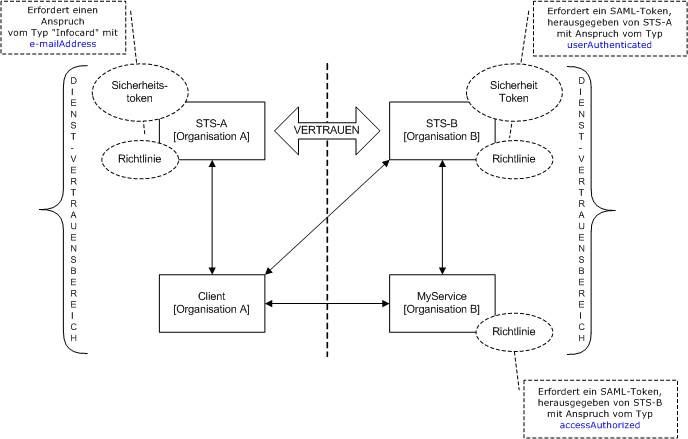
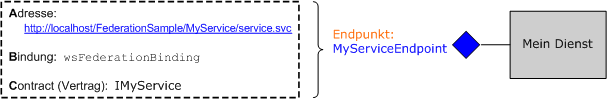
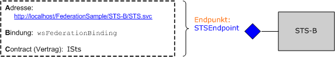
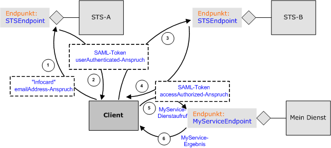

# <a name="federation"></a><span data-ttu-id="228d6-102">Verbund</span><span class="sxs-lookup"><span data-stu-id="228d6-102">Federation</span></span>
<span data-ttu-id="228d6-103">Dieses Thema enthält eine kurze Übersicht über den Begriff Verbundsicherheit.</span><span class="sxs-lookup"><span data-stu-id="228d6-103">This topic provides a brief overview of the concept of federated security.</span></span> <span data-ttu-id="228d6-104">Darüber hinaus wird die [!INCLUDE[indigo1](../../../../includes/indigo1-md.md)]-Unterstützung für die Einbindung von Verbundsicherheitsarchitekturen beschrieben.</span><span class="sxs-lookup"><span data-stu-id="228d6-104">It also describes [!INCLUDE[indigo1](../../../../includes/indigo1-md.md)] support for deploying federated security architectures.</span></span> <span data-ttu-id="228d6-105">Eine beispielanwendung, Verbund veranschaulicht, finden Sie unter [Verbundbeispiel](../../../../docs/framework/wcf/samples/federation-sample.md).</span><span class="sxs-lookup"><span data-stu-id="228d6-105">For a sample application that demonstrates federation, see [Federation Sample](../../../../docs/framework/wcf/samples/federation-sample.md).</span></span>  
  
## <a name="definition-of-federated-security"></a><span data-ttu-id="228d6-106">Definition von Verbundsicherheit</span><span class="sxs-lookup"><span data-stu-id="228d6-106">Definition of Federated Security</span></span>  
 <span data-ttu-id="228d6-107">Verbundsicherheit ermöglicht eine saubere Trennung zwischen dem Dienst, auf den ein Client zugreift, und den dazugehörigen Authentifizierungs- und Autorisierungsvorgängen.</span><span class="sxs-lookup"><span data-stu-id="228d6-107">Federated security allows for clean separation between the service a client is accessing and the associated authentication and authorization procedures.</span></span> <span data-ttu-id="228d6-108">Darüber hinaus aktiviert Verbundsicherheit die Zusammenarbeit über mehrere Systeme, Netzwerke und Organisationen in anderen Vertrauensbereichen.</span><span class="sxs-lookup"><span data-stu-id="228d6-108">Federated security also enables collaboration across multiple systems, networks, and organizations in different trust realms.</span></span>  
  
 [!INCLUDE[indigo2](../../../../includes/indigo2-md.md)]<span data-ttu-id="228d6-109"> unterstützt die Erstellung und Bereitstellung von verteilten Systemen, die Verbundsicherheit verwenden.</span><span class="sxs-lookup"><span data-stu-id="228d6-109"> provides support for building and deploying distributed systems that employ federated security.</span></span>  
  
### <a name="elements-of-a-federated-security-architecture"></a><span data-ttu-id="228d6-110">Elemente einer Verbundsicherheitsarchitektur</span><span class="sxs-lookup"><span data-stu-id="228d6-110">Elements of a Federated Security Architecture</span></span>  
 <span data-ttu-id="228d6-111">Die Verbundsicherheitsarchitektur verfügt über drei Hauptelemente (siehe Beschreibung in der folgenden Tabelle).</span><span class="sxs-lookup"><span data-stu-id="228d6-111">The federated security architecture has three key elements, as described in the following table.</span></span>  
  
|<span data-ttu-id="228d6-112">Element</span><span class="sxs-lookup"><span data-stu-id="228d6-112">Element</span></span>|<span data-ttu-id="228d6-113">Beschreibung</span><span class="sxs-lookup"><span data-stu-id="228d6-113">Description</span></span>|  
|-------------|-----------------|  
|<span data-ttu-id="228d6-114">Domäne/Bereich</span><span class="sxs-lookup"><span data-stu-id="228d6-114">Domain/realm</span></span>|<span data-ttu-id="228d6-115">Eine einzelne Einheit von Sicherheitsverwaltung oder -vertrauen.</span><span class="sxs-lookup"><span data-stu-id="228d6-115">A single unit of security administration or trust.</span></span> <span data-ttu-id="228d6-116">Eine typische Domäne könnte eine einzelne Organisation einschließen.</span><span class="sxs-lookup"><span data-stu-id="228d6-116">A typical domain might include a single organization.</span></span>|  
|<span data-ttu-id="228d6-117">Verbund</span><span class="sxs-lookup"><span data-stu-id="228d6-117">Federation</span></span>|<span data-ttu-id="228d6-118">Eine Auflistung von Domänen, die Vertrauenswürdigkeit bewiesen haben.</span><span class="sxs-lookup"><span data-stu-id="228d6-118">A collection of domains that have established trust.</span></span> <span data-ttu-id="228d6-119">Die Ebene der Vertrauenswürdigkeit ändert sich möglicherweise, schließt aber in der Regel die Authentifizierung und fast immer die Autorisierung ein.</span><span class="sxs-lookup"><span data-stu-id="228d6-119">The level of trust may vary, but typically includes authentication and almost always includes authorization.</span></span> <span data-ttu-id="228d6-120">Zu einem typischen Verbund kann eine Anzahl an Organisationen gehören, die Vertrauen für einen gemeinsamen Zugriff auf Ressourcen aufgebaut haben.</span><span class="sxs-lookup"><span data-stu-id="228d6-120">A typical federation might include a number of organizations that have established trust for shared access to a set of resources.</span></span>|  
|<span data-ttu-id="228d6-121">Sicherheitstokendienst (STS; Security Token Service)</span><span class="sxs-lookup"><span data-stu-id="228d6-121">Security Token Service (STS)</span></span>|<span data-ttu-id="228d6-122">Hierbei handelt es sich um einen Webdienst, der Sicherheitstoken herausgibt, d. h. es werden basierend auf Beweisen, die als vertrauenswürdig eingestuft werden, Assertionen erstellt.</span><span class="sxs-lookup"><span data-stu-id="228d6-122">A Web service that issues security tokens; that is, it makes assertions based on evidence that it trusts, to whomever trusts it.</span></span> <span data-ttu-id="228d6-123">Dies bildet die Grundlage für die Vertrauensvermittlung zwischen Domänen.</span><span class="sxs-lookup"><span data-stu-id="228d6-123">This forms the basis of trust brokering between domains.</span></span>|  
  
### <a name="example-scenario"></a><span data-ttu-id="228d6-124">Beispielszenario</span><span class="sxs-lookup"><span data-stu-id="228d6-124">Example Scenario</span></span>  
 <span data-ttu-id="228d6-125">Die folgende Abbildung zeigt ein Beispiel für Verbundsicherheit.</span><span class="sxs-lookup"><span data-stu-id="228d6-125">The following illustration shows an example of federated security.</span></span>  
  
 <span data-ttu-id="228d6-126"></span><span class="sxs-lookup"><span data-stu-id="228d6-126"></span></span>  
  
 <span data-ttu-id="228d6-127">Dieses Szenario enthält zwei Organisationen: A und B. Organisation B hat eine Webressource (einen Webdienst), die einige Benutzer in der Organisation A als wertvoll betrachten.</span><span class="sxs-lookup"><span data-stu-id="228d6-127">This scenario includes two organizations: A and B. Organization B has a Web resource (a Web service) that some users in organization A find valuable.</span></span>  
  
> [!NOTE]
>  <span data-ttu-id="228d6-128">In diesem Abschnitt sind die verwendeten Begriffe *Ressource*, *Service*, und *-Webdienst* austauschbar.</span><span class="sxs-lookup"><span data-stu-id="228d6-128">This section uses the terms *resource*, *service*, and *Web service* interchangeably.</span></span>  
  
 <span data-ttu-id="228d6-129">Üblicherweise fordert Organisation B, dass ein Benutzer der Organisation A eine gültige Form der Authentifizierung bereitstellt, bevor der Zugriff auf den Dienst gewährt wird.</span><span class="sxs-lookup"><span data-stu-id="228d6-129">Typically, organization B requires that a user from organization A provide some valid form of authentication before accessing the service.</span></span> <span data-ttu-id="228d6-130">Darüber hinaus kann die Organisation verlangen, dass der Benutzer für den Zugriff auf die spezifische Ressource autorisiert wird.</span><span class="sxs-lookup"><span data-stu-id="228d6-130">In addition, the organization may also require that the user be authorized to access the specific resource in question.</span></span> <span data-ttu-id="228d6-131">Eine Art der Problemlösung und Ermöglichung des Zugriffs auf die Ressource in der Organisation B durch die Benutzer in der Organisation A ist folgendermaßen:</span><span class="sxs-lookup"><span data-stu-id="228d6-131">One way to address this problem and enable users in organization A to access the resource in organization B is as follows:</span></span>  
  
-   <span data-ttu-id="228d6-132">Benutzer von Organisation A registrieren Ihre Anmeldeinformationen (Benutzername und Kennwort) bei der Organisation B.</span><span class="sxs-lookup"><span data-stu-id="228d6-132">Users from organization A register their credentials (a user name and password) with organization B.</span></span>  
  
-   <span data-ttu-id="228d6-133">Während des Zugriffs auf die Ressource geben Benutzer der Organisation A Ihre Anmeldeinformationen an die Organisation B weiter und werden vor Zugriff auf die Ressource authentifiziert.</span><span class="sxs-lookup"><span data-stu-id="228d6-133">During the resource access, users from organization A present their credentials to organization B and are authenticated before accessing the resource.</span></span>  
  
 <span data-ttu-id="228d6-134">Dieser Ansatz hat drei bedeutende Nachteile:</span><span class="sxs-lookup"><span data-stu-id="228d6-134">This approach has three significant drawbacks:</span></span>  
  
-   <span data-ttu-id="228d6-135">Zusätzlich zur Verwaltung der Anmeldeinformationen der lokalen Benutzer muss die Organisation B die Anmeldeinformationen für Benutzer der Organisation A verwalten.</span><span class="sxs-lookup"><span data-stu-id="228d6-135">Organization B has to manage the credentials for users from organization A in addition to managing the credentials of its local users.</span></span>  
  
-   <span data-ttu-id="228d6-136">Benutzer der Organisation A müssen, abgesehen von den Anmeldeinformationen, die sie sonst für den Zugriff auf die Ressourcen innerhalb der Organisation verwenden, zusätzliche Anmeldeinformationen pflegen (d. h. einen zusätzlichen Benutzernamen und ein zusätzliches Kennwort). Es wird daher empfohlen, denselben Benutzernamen und dasselbe Kennwort für unterschiedliche Dienstsites zu verwenden, wobei es sich um eine anfällige Sicherheitsmaßnahme handelt.</span><span class="sxs-lookup"><span data-stu-id="228d6-136">Users in organization A need to maintain an additional set of credentials (that is, remember an additional user name and password) apart from the credentials they normally use to gain access to resources within organization A. This usually encourages the practice of using the same user name and password at multiple service sites, which is a weak security measure.</span></span>  
  
-   <span data-ttu-id="228d6-137">Die Architektur nimmt keine Skalierung vor, während weitere Organisationen die Ressource bei Organisation B als wertvoll betrachten.</span><span class="sxs-lookup"><span data-stu-id="228d6-137">The architecture does not scale as more organizations perceive the resource at organization B as being of some value.</span></span>  
  
 <span data-ttu-id="228d6-138">Ein alternativer Ansatz, der die zuvor erwähnten Nachteile berücksichtigt, ist die Bereitstellung von Verbundsicherheit.</span><span class="sxs-lookup"><span data-stu-id="228d6-138">An alternative approach, which addresses the previously mentioned drawbacks, is to employ federated security.</span></span> <span data-ttu-id="228d6-139">In diesem Ansatz bauen die Organisationen A und B eine Vertrauensbeziehung auf und verwenden STS (Security Token Service), um die Vermittlung des aufgebauten Vertrauens zu ermöglichen.</span><span class="sxs-lookup"><span data-stu-id="228d6-139">In this approach, organizations A and B establish a trust relationship and employ Security Token Service (STS) to enable brokering of the established trust.</span></span>  
  
 <span data-ttu-id="228d6-140">In einer Verbundsicherheitsarchitektur wissen Benutzer der Organisation A, dass sie einen gültigen Sicherheitstoken aus STS bei der Organisation vorlegen müssen, der ihren Zugang zum entsprechenden Dienst authentifiziert und autorisiert, wenn sie auf den Webdienst in Organisation B zugreifen möchten.</span><span class="sxs-lookup"><span data-stu-id="228d6-140">In a federated security architecture, users from organization A know that if they want to access the Web service in organization B that they must present a valid security token from the STS at organization B, which authenticates and authorizes their access to the specific service.</span></span>  
  
 <span data-ttu-id="228d6-141">Durch die Kontaktaufnahme mit dem STS B erhalten die Benutzer eine andere Dereferenzierungsebene aus der zum STS gehörenden Richtlinie.</span><span class="sxs-lookup"><span data-stu-id="228d6-141">On contacting the STS B, the users receive another level of indirection from the policy associated with the STS.</span></span> <span data-ttu-id="228d6-142">Sie müssen einen gültigen Sicherheitstoken aus STS A (d. h. den Clientvertrauensbereich) vorweisen, bevor der STS B einen Sicherheitstoken an sie ausgeben kann.</span><span class="sxs-lookup"><span data-stu-id="228d6-142">They must present a valid security token from the STS A (that is, the client trust realm) before the STS B can issue them a security token.</span></span> <span data-ttu-id="228d6-143">Hierbei handelt es sich um eine Folgeerscheinung aus der zwischen den beiden Organisationen aufgebauten Vertrauensbeziehung, wobei impliziert wird, dass Organisation B die Identitäten für Benutzer aus der Organisation A nicht verwalten muss. In der Praxis verfügt der STS B üblicherweise über eine Null-`issuerAddress` und eine `issuerMetadataAddress`.</span><span class="sxs-lookup"><span data-stu-id="228d6-143">This is a corollary of the trust relationship established between the two organizations and implies that organization B does not have to manage identities for users from organization A. In practice, STS B typically has a null `issuerAddress` and `issuerMetadataAddress`.</span></span> [!INCLUDE[crdefault](../../../../includes/crdefault-md.md)]<span data-ttu-id="228d6-144">[Vorgehensweise: Konfigurieren eines lokalen Ausstellers](../../../../docs/framework/wcf/feature-details/how-to-configure-a-local-issuer.md).</span><span class="sxs-lookup"><span data-stu-id="228d6-144"> [How to: Configure a Local Issuer](../../../../docs/framework/wcf/feature-details/how-to-configure-a-local-issuer.md).</span></span> <span data-ttu-id="228d6-145">In diesem Fall konsultiert der Client eine lokale Richtlinie STS A. Suchen Diese Konfiguration wird aufgerufen, *home Realm Verbund* und skaliert eine bessere Leistung, da STS B keine Informationen über STS A. verwalten</span><span class="sxs-lookup"><span data-stu-id="228d6-145">In that case, the client consults a local policy to locate STS A. This configuration is called *home realm federation* and it scales better because STS B does not have to maintain information about STS A.</span></span>  
  
 <span data-ttu-id="228d6-146">Die Benutzer kontaktieren nun den STS bei Organisation A und erhalten einen Sicherheitstoken, indem sie Authentifizierungsanmeldeinformationen vorlegen, die sie normalerweise für den Zugang zu anderen Ressourcen innerhalb der Organisation A verwenden. Hierdurch wird auch das Problem gemindert, dass Benutzer mehrere Sätze an Anmeldeinformationen pflegen müssen oder den gleichen Satz an Anmeldeinformationen für mehrere Dienstsites verwenden.</span><span class="sxs-lookup"><span data-stu-id="228d6-146">The users then contact the STS at organization A and obtain a security token by presenting authentication credentials that they normally use to gain access to any other resource within organization A. This also alleviates the problem of users having to maintain multiple sets of credentials or using the same set of credentials at multiple service sites.</span></span>  
  
 <span data-ttu-id="228d6-147">Nachdem die Benutzer einen Sicherheitstoken vom STS A erhalten haben, legen Sie den Token dem STS B vor. Organisation B führt die Autorisierung der Benutzeranfragen durch und gibt an die Benutzer einen Sicherheitstoken aus ihrem eigenen Satz an Sicherheitstoken heraus.</span><span class="sxs-lookup"><span data-stu-id="228d6-147">Once the users obtain a security token from the STS A, they present the token to the STS B. Organization B proceeds to perform authorization of the users' requests and issues a security token to the users from its own set of security tokens.</span></span> <span data-ttu-id="228d6-148">Die Benutzer können dann ihren Token bei der Ressource bei Organisation B vorlegen und auf den Dienst zugreifen.</span><span class="sxs-lookup"><span data-stu-id="228d6-148">The users can then present their token to the resource at organization B and access the service.</span></span>  
  
## <a name="support-for-federated-security-in-wcf"></a><span data-ttu-id="228d6-149">Unterstützung für Verbundsicherheit in WCF</span><span class="sxs-lookup"><span data-stu-id="228d6-149">Support for Federated Security in WCF</span></span>  
 [!INCLUDE[indigo2](../../../../includes/indigo2-md.md)]<span data-ttu-id="228d6-150">bietet sofort verwendbare Unterstützung für die Bereitstellung von verbundsicherheitsarchitekturen durch die [ \<WsFederationHttpBinding >](../../../../docs/framework/configure-apps/file-schema/wcf/wsfederationhttpbinding.md).</span><span class="sxs-lookup"><span data-stu-id="228d6-150"> provides turnkey support for deploying federated security architectures through the [\<wsFederationHttpBinding>](../../../../docs/framework/configure-apps/file-schema/wcf/wsfederationhttpbinding.md).</span></span>  
  
 <span data-ttu-id="228d6-151">Die [ \<WsFederationHttpBinding >](../../../../docs/framework/configure-apps/file-schema/wcf/wsfederationhttpbinding.md) -Element stellt für eine sichere, zuverlässige und interoperable Bindung, die die Verwendung von HTTP als den zugrunde liegenden Transportmechanismus für Anforderung-Antwort-Kommunikation-Format umfasst bereit. Einsatz von Text- und XML als Übertragungsformate für die Codierung.</span><span class="sxs-lookup"><span data-stu-id="228d6-151">The [\<wsFederationHttpBinding>](../../../../docs/framework/configure-apps/file-schema/wcf/wsfederationhttpbinding.md) element provides for a secure, reliable, interoperable binding that entails the use of HTTP as the underlying transport mechanism for request-reply communication style, employing text and XML as the wire format for encoding.</span></span>  
  
 <span data-ttu-id="228d6-152">Die Verwendung von [ \<WsFederationHttpBinding >](../../../../docs/framework/configure-apps/file-schema/wcf/wsfederationhttpbinding.md) in einem verbundenen Szenario in zwei Phasen logisch unabhängig, entkoppelt werden, wie in den folgenden Abschnitten beschrieben.</span><span class="sxs-lookup"><span data-stu-id="228d6-152">The use of [\<wsFederationHttpBinding>](../../../../docs/framework/configure-apps/file-schema/wcf/wsfederationhttpbinding.md) in a federated security scenario can be decoupled into two logically independent phases, as described in the following sections.</span></span>  
  
### <a name="phase-1-design-phase"></a><span data-ttu-id="228d6-153">Phase 1: Entwurfsphase</span><span class="sxs-lookup"><span data-stu-id="228d6-153">Phase 1: Design Phase</span></span>  
 <span data-ttu-id="228d6-154">Während der Entwurfsphase der Client verwendet die [ServiceModel Metadata Utility Tool (Svcutil.exe)](../../../../docs/framework/wcf/servicemodel-metadata-utility-tool-svcutil-exe.md) , die Richtlinie zu lesen, die Dienstendpunkt verfügbar macht, und Anforderungen an den Dienst-Authentifizierung und Autorisierung zu sammeln.</span><span class="sxs-lookup"><span data-stu-id="228d6-154">During the design phase, the client uses the [ServiceModel Metadata Utility Tool (Svcutil.exe)](../../../../docs/framework/wcf/servicemodel-metadata-utility-tool-svcutil-exe.md) to read the policy the service endpoint exposes and to collect the service's authentication and authorization requirements.</span></span> <span data-ttu-id="228d6-155">Die entsprechenden Proxys werden erzeugt, um das folgende Verbundsicherheitskommunikationsmuster beim Client zu erstellen:</span><span class="sxs-lookup"><span data-stu-id="228d6-155">The appropriate proxies are constructed to create the following federated security communication pattern at the client:</span></span>  
  
-   <span data-ttu-id="228d6-156">Erhalt eines Sicherheitstoken vom STS im Clientvertrauensbereich.</span><span class="sxs-lookup"><span data-stu-id="228d6-156">Obtain a security token from the STS in the client trust realm.</span></span>  
  
-   <span data-ttu-id="228d6-157">Präsentation des Token vor dem STS im Dienstvertrauensbereich.</span><span class="sxs-lookup"><span data-stu-id="228d6-157">Present the token to the STS in the service trust realm.</span></span>  
  
-   <span data-ttu-id="228d6-158">Erhalt eines Sicherheitstoken vom STS im Dienstvertrauensbereich.</span><span class="sxs-lookup"><span data-stu-id="228d6-158">Obtain a security token from the STS in the service trust realm.</span></span>  
  
-   <span data-ttu-id="228d6-159">Präsentation des Token vor dem Dienst für den Zugriff auf den Dienst.</span><span class="sxs-lookup"><span data-stu-id="228d6-159">Present the token to the service to access the service.</span></span>  
  
### <a name="phase-2-run-time-phase"></a><span data-ttu-id="228d6-160">Phase 2: Laufzeitphase</span><span class="sxs-lookup"><span data-stu-id="228d6-160">Phase 2: Run-Time Phase</span></span>  
 <span data-ttu-id="228d6-161">Während der Laufzeitphase instanziiert ein Objekt der [!INCLUDE[indigo2](../../../../includes/indigo2-md.md)]-Clientklasse und nimmt mithilfe des [!INCLUDE[indigo2](../../../../includes/indigo2-md.md)]-Clients einen Aufruf vor.</span><span class="sxs-lookup"><span data-stu-id="228d6-161">During the run-time phase, the client instantiates an object of the [!INCLUDE[indigo2](../../../../includes/indigo2-md.md)] client class and makes a call using the [!INCLUDE[indigo2](../../../../includes/indigo2-md.md)] client.</span></span> <span data-ttu-id="228d6-162">Das zugrunde liegende Framework von [!INCLUDE[indigo2](../../../../includes/indigo2-md.md)] behandelt die zuvor genannten Schritte im Verbundsicherheitskommunikationsmuster und ermöglicht es dem Client, den Dienst nahtlos zu nutzen.</span><span class="sxs-lookup"><span data-stu-id="228d6-162">The underlying framework of [!INCLUDE[indigo2](../../../../includes/indigo2-md.md)] handles the previously mentioned steps in the federated security communication pattern and enables the client to seamlessly consume the service.</span></span>  
  
## <a name="sample-implementation-using-wcf"></a><span data-ttu-id="228d6-163">Beispielimplementierung mithilfe von WCF</span><span class="sxs-lookup"><span data-stu-id="228d6-163">Sample Implementation Using WCF</span></span>  
 <span data-ttu-id="228d6-164">Die folgende Abbildung zeigt eine Beispielimplementierung für eine Verbundsicherheitsarchitektur mit systemeigener Unterstützung von [!INCLUDE[indigo2](../../../../includes/indigo2-md.md)].</span><span class="sxs-lookup"><span data-stu-id="228d6-164">The following illustration shows a sample implementation for a federated security architecture using native support from [!INCLUDE[indigo2](../../../../includes/indigo2-md.md)].</span></span>  
  
 <span data-ttu-id="228d6-165"></span><span class="sxs-lookup"><span data-stu-id="228d6-165"></span></span>  
  
### <a name="example-myservice"></a><span data-ttu-id="228d6-166">Beispiel MyService</span><span class="sxs-lookup"><span data-stu-id="228d6-166">Example MyService</span></span>  
 <span data-ttu-id="228d6-167">Der Dienst `MyService` macht durch `MyServiceEndpoint` einen einzelnen Endpunkt verfügbar.</span><span class="sxs-lookup"><span data-stu-id="228d6-167">The service `MyService` exposes a single endpoint through `MyServiceEndpoint`.</span></span> <span data-ttu-id="228d6-168">Die folgende Abbildung zeigt Adresse, Bindung und Vertrag an, die zum Endpunkt gehören.</span><span class="sxs-lookup"><span data-stu-id="228d6-168">The following illustration shows the address, binding, and contract associated with the endpoint.</span></span>  
  
 <span data-ttu-id="228d6-169"></span><span class="sxs-lookup"><span data-stu-id="228d6-169"></span></span>  
  
 <span data-ttu-id="228d6-170">Der Dienstendpunkt `MyServiceEndpoint` verwendet die [ \<WsFederationHttpBinding >](../../../../docs/framework/configure-apps/file-schema/wcf/wsfederationhttpbinding.md) und erfordert ein gültiges Security Assertions Markup Language (SAML)-Token mit einer `accessAuthorized` von STS B. ausgestellten Anspruchs Dies wird deklarativ in der Dienstkonfiguration angegeben.</span><span class="sxs-lookup"><span data-stu-id="228d6-170">The service endpoint `MyServiceEndpoint` uses the [\<wsFederationHttpBinding>](../../../../docs/framework/configure-apps/file-schema/wcf/wsfederationhttpbinding.md) and requires a valid Security Assertions Markup Language (SAML) token with an `accessAuthorized` claim issued by STS B. This is declaratively specified in the service configuration.</span></span>  
  
```xml  
<system.serviceModel>  
  <services>  
    <service type="FederationSample.MyService"      
        behaviorConfiguration='MyServiceBehavior'>  
        <endpoint address=""  
            binding=" wsFederationHttpBinding"  
            bindingConfiguration='MyServiceBinding'  
            contract="Federation.IMyService" />  
   </service>  
  </services>  
  
  <bindings>  
    <wsFederationHttpBinding>  
    <!-- This is the binding used by MyService. It redirects   
    clients to STS-B. -->  
      <binding name='MyServiceBinding'>  
        <security mode="Message">  
           <message issuedTokenType=  
"http://docs.oasis-open.org/wss/oasis-wss-saml-token-profile-1.1#SAMLV1.1">  
           <issuer address="http://localhost/FederationSample/STS-B/STS.svc" />  
            <issuerMetadata   
           address=  
"http://localhost/FederationSample/STS-B/STS.svc/mex" />  
         <requiredClaimTypes>  
            <add claimType="http://tempuri.org:accessAuthorized" />  
         </requiredClaimTypes>  
        </message>  
      </security>  
      </binding>  
    </wsFederationHttpBinding>  
  </bindings>  
  
  <behaviors>  
    <behavior name='MyServiceBehavior'>  
      <serviceAuthorization   
operationRequirementType="FederationSample.MyServiceOperationRequirement, MyService" />  
       <serviceCredentials>  
         <serviceCertificate findValue="CN=FederationSample.com"  
         x509FindType="FindBySubjectDistinguishedName"  
         storeLocation='LocalMachine'  
         storeName='My' />  
      </serviceCredentials>  
    </behavior>  
  </behaviors>  
</system.serviceModel>  
```  
  
> [!NOTE]
>  <span data-ttu-id="228d6-171">Ein Punkt über die für `MyService` erforderlichen Ansprüche sollte beachtet werden.</span><span class="sxs-lookup"><span data-stu-id="228d6-171">A subtle point should be noted about the claims required by `MyService`.</span></span> <span data-ttu-id="228d6-172">Die zweite Abbildung zeigt, dass `MyService` ein SAML-Token mit einem `accessAuthorized`-Anspruch erfordert.</span><span class="sxs-lookup"><span data-stu-id="228d6-172">The second figure indicates that `MyService` requires a SAML token with the `accessAuthorized` claim.</span></span> <span data-ttu-id="228d6-173">Genauer gesagt gibt dies den Anspruchstyp an, den `MyService` erfordert.</span><span class="sxs-lookup"><span data-stu-id="228d6-173">To be more precise, this specifies the claim type that `MyService` requires.</span></span> <span data-ttu-id="228d6-174">Der vollqualifizierte Name dieses Anspruchstyps ist http://tempuri.org:accessAuthorized (mit dem zugehörigen Namespace). Dieser wird in der Dienstkonfigurationsdatei verwendet.</span><span class="sxs-lookup"><span data-stu-id="228d6-174">The fully-qualified name of this claim type is http://tempuri.org:accessAuthorized (along with the associated namespace), which is used in the service configuration file.</span></span> <span data-ttu-id="228d6-175">Der Wert dieses Anspruchs zeigt das Vorhandensein dieses Anspruchs an und wird als von STS B auf `true` festgelegt angenommen.</span><span class="sxs-lookup"><span data-stu-id="228d6-175">The value of this claim indicates the presence of this claim and is assumed to be set to `true` by STS B.</span></span>  
  
 <span data-ttu-id="228d6-176">Zur Laufzeit wird diese Richtlinie von der `MyServiceOperationRequirement`-Klasse erzwungen, die als Teil von `MyService` implementiert ist.</span><span class="sxs-lookup"><span data-stu-id="228d6-176">At runtime, this policy is enforced by the `MyServiceOperationRequirement` class that is implemented as part of the `MyService`.</span></span>  
  
 [!code-csharp[C_Federation#0](../../../../samples/snippets/csharp/VS_Snippets_CFX/c_federation/cs/source.cs#0)]
 [!code-vb[C_Federation#0](../../../../samples/snippets/visualbasic/VS_Snippets_CFX/c_federation/vb/source.vb#0)]  
[!code-csharp[C_Federation#1](../../../../samples/snippets/csharp/VS_Snippets_CFX/c_federation/cs/source.cs#1)]
[!code-vb[C_Federation#1](../../../../samples/snippets/visualbasic/VS_Snippets_CFX/c_federation/vb/source.vb#1)]  
  
#### <a name="sts-b"></a><span data-ttu-id="228d6-177">STS B</span><span class="sxs-lookup"><span data-stu-id="228d6-177">STS B</span></span>  
 <span data-ttu-id="228d6-178">Die folgende Abbildung zeigt den STS B. Wie zuvor erwähnt, ist ein STS (Security Token Service) auch ein Webdienst und kann über zugehörige Endpunkte, Richtlinien usw. verfügen.</span><span class="sxs-lookup"><span data-stu-id="228d6-178">The following illustration shows the STS B. As stated earlier, a security token service (STS) is also a Web service and can have its associated endpoints, policy, and so on.</span></span>  
  
 <span data-ttu-id="228d6-179"></span><span class="sxs-lookup"><span data-stu-id="228d6-179"></span></span>  
  
 <span data-ttu-id="228d6-180">STS B macht einen einzelnen Endpunkt namens `STSEndpoint` verfügbar, der verwendet werden kann, um das Sicherheitstoken anzufordern.</span><span class="sxs-lookup"><span data-stu-id="228d6-180">STS B exposes a single endpoint, called `STSEndpoint` that can be use to request security tokens.</span></span> <span data-ttu-id="228d6-181">STS B gibt insbesondere SAML-Token mit `accessAuthorized`-Anspruch heraus, die der `MyService`-Dienstsite vorgelegt werden können, um Zugriff auf den Dienst zu erhalten.</span><span class="sxs-lookup"><span data-stu-id="228d6-181">Specifically, STS B issues SAML tokens with the `accessAuthorized` claim, which can be presented at the `MyService` service site for accessing the service.</span></span> <span data-ttu-id="228d6-182">Allerdings erfordert STS B, dass Benutzer ein gültiges SAML-Token vorlegen, das von STS A herausgegeben wurde und den `userAuthenticated`-Anspruch enthält.</span><span class="sxs-lookup"><span data-stu-id="228d6-182">However, STS B requires users to present a valid SAML token issued by STS A that contains the `userAuthenticated` claim.</span></span> <span data-ttu-id="228d6-183">Dies wird deklarativ in der STS-Konfiguration angegeben.</span><span class="sxs-lookup"><span data-stu-id="228d6-183">This is declaratively specified in the STS configuration.</span></span>  
  
```xml  
<system.serviceModel>  
  <services>  
    <service type="FederationSample.STS_B" behaviorConfiguration=  
     "STS-B_Behavior">  
    <endpoint address=""  
              binding="wsFederationHttpBinding"  
              bindingConfiguration='STS-B_Binding'  
      contract="FederationSample.ISts" />  
    </service>  
  </services>  
  <bindings>  
    <wsFederationHttpBinding>  
    <!-- This is the binding used by STS-B. It redirects clients to   
         STS-A. -->  
      <binding name='STS-B_Binding'>  
        <security mode='Message'>  
          <message issuedTokenType="http://docs.oasis-open.org/wss/oasis-wss-saml-token-profile-1.1#SAMLV1.1">  
          <issuer address='http://localhost/FederationSample/STS-A/STS.svc' />  
          <issuerMetadata address='http://localhost/FederationSample/STS-A/STS.svc/mex'/>  
          <requiredClaimTypes>  
            <add claimType='http://tempuri.org:userAuthenticated'/>  
          </requiredClaimTypes>  
          </message>  
        </security>  
    </binding>  
   </wsFederationHttpBinding>  
  </bindings>  
  <behaviors>  
  <behavior name='STS-B_Behavior'>  
    <serviceAuthorization   operationRequirementType='FederationSample.STS_B_OperationRequirement, STS_B' />  
    <serviceCredentials>  
      <serviceCertificate findValue='CN=FederationSample.com'  
      x509FindType='FindBySubjectDistinguishedName'  
       storeLocation='LocalMachine'  
       storeName='My' />  
     </serviceCredentials>  
   </behavior>  
  </behaviors>  
</system.serviceModel>  
```  
  
> [!NOTE]
>  <span data-ttu-id="228d6-184">Wiederum ist der `userAuthenticated`-Anspruch der Anspruchstyp, der von STS B gefordert wird. Der vollqualifizierte Name dieses Anspruchstyps ist http://tempuri.org:userAuthenticated (mit dem zugehörigen Namespace). Dieser wird von der STS-Konfigurationsdatei verwendet.</span><span class="sxs-lookup"><span data-stu-id="228d6-184">Again, the `userAuthenticated` claim is the claim type that is required by STS B. The fully-qualified name of this claim type is http://tempuri.org:userAuthenticated (along with the associated namespace), which is used in the STS configuration file.</span></span> <span data-ttu-id="228d6-185">Der Wert dieses Anspruchs zeigt das Vorhandensein dieses Anspruchs an und wird als von STS A auf `true` festgelegt angenommen.</span><span class="sxs-lookup"><span data-stu-id="228d6-185">The value of this claim indicates the presence of this claim and is assumed to be set to `true` by STS A.</span></span>  
  
 <span data-ttu-id="228d6-186">Zur Laufzeit erzwingt die `STS_B_OperationRequirement`-Klasse diese Richtlinie, die als Teil von STS B implementiert ist.</span><span class="sxs-lookup"><span data-stu-id="228d6-186">At runtime, the `STS_B_OperationRequirement` class enforces this policy, which is implemented as part of STS B.</span></span>  
  
 [!code-csharp[C_Federation#2](../../../../samples/snippets/csharp/VS_Snippets_CFX/c_federation/cs/source.cs#2)]
 [!code-vb[C_Federation#2](../../../../samples/snippets/visualbasic/VS_Snippets_CFX/c_federation/vb/source.vb#2)]  
  
 <span data-ttu-id="228d6-187">Wenn die Zugriffsprüfung klar ist, gibt STS B ein SAML-Token mit dem `accessAuthorized`-Anspruch aus.</span><span class="sxs-lookup"><span data-stu-id="228d6-187">If the access check is clear, STS B issues a SAML token with the `accessAuthorized` claim.</span></span>  
  
 [!code-csharp[C_Federation#3](../../../../samples/snippets/csharp/VS_Snippets_CFX/c_federation/cs/source.cs#3)]
 [!code-vb[C_Federation#3](../../../../samples/snippets/visualbasic/VS_Snippets_CFX/c_federation/vb/source.vb#3)]  
  
#### <a name="sts-a"></a><span data-ttu-id="228d6-188">STS A</span><span class="sxs-lookup"><span data-stu-id="228d6-188">STS A</span></span>  
 <span data-ttu-id="228d6-189">Die folgende Abbildung zeigt den STS A.</span><span class="sxs-lookup"><span data-stu-id="228d6-189">The following illustration shows the STS A.</span></span>  
  
 <span data-ttu-id="228d6-190"></span><span class="sxs-lookup"><span data-stu-id="228d6-190"></span></span>  
  
 <span data-ttu-id="228d6-191">Ähnlich wie beim STS B ist auch der STS A ein Webdienst, der Sicherheitstoken herausgibt und einen einzelnen Endpunkt für diesen Zweck zur Verfügung stellt.</span><span class="sxs-lookup"><span data-stu-id="228d6-191">Similar to the STS B, the STS A is also a Web service that issues security tokens and exposes a single endpoint for this purpose.</span></span> <span data-ttu-id="228d6-192">Allerdings verwendet er eine andere Bindung (`wsHttpBinding`) und erfordert, dass Benutzer eine gültige [!INCLUDE[infocard](../../../../includes/infocard-md.md)] mit `emailAddress`-Anspruch vorlegen.</span><span class="sxs-lookup"><span data-stu-id="228d6-192">However, it uses a different binding (`wsHttpBinding`) and requires users to present a valid [!INCLUDE[infocard](../../../../includes/infocard-md.md)] with an `emailAddress` claim.</span></span> <span data-ttu-id="228d6-193">Als Antwort gibt er SAML-Token mit dem `userAuthenticated`-Anspruch heraus.</span><span class="sxs-lookup"><span data-stu-id="228d6-193">In response, it issues SAML tokens with the `userAuthenticated` claim.</span></span> <span data-ttu-id="228d6-194">Dies wird deklarativ in der Dienstkonfiguration angegeben.</span><span class="sxs-lookup"><span data-stu-id="228d6-194">This is declaratively specified in the service configuration.</span></span>  
  
```xml  
<system.serviceModel>  
  <services>  
    <service type="FederationSample.STS_A" behaviorConfiguration="STS-A_Behavior">  
      <endpoint address=""  
                binding="wsHttpBinding"  
                bindingConfiguration="STS-A_Binding"  
                contract="FederationSample.ISts">  
       <identity>  
       <certificateReference findValue="CN=FederationSample.com"    
                       x509FindType="FindBySubjectDistinguishedName"  
                       storeLocation="LocalMachine"   
                       storeName="My" />  
       </identity>  
    <endpoint>  
  </service>  
</services>  
  
<bindings>  
  <wsHttpBinding>  
  <!-- This is the binding used by STS-A. It requires users to present  
   a CardSpace. -->  
    <binding name='STS-A_Binding'>  
      <security mode='Message'>  
        <message clientCredentialType="CardSpace" />  
      </security>  
    </binding>  
  </wsHttpBinding>  
</bindings>  
  
<behaviors>  
  <behavior name='STS-A_Behavior'>  
    <serviceAuthorization operationRequirementType=  
     "FederationSample.STS_A_OperationRequirement, STS_A" />  
      <serviceCredentials>  
  <serviceCertificate findValue="CN=FederationSample.com"  
                     x509FindType='FindBySubjectDistinguishedName'  
                     storeLocation='LocalMachine'  
                     storeName='My' />  
      </serviceCredentials>  
    </behavior>  
  </behaviors>  
</system.serviceModel>  
```  
  
 <span data-ttu-id="228d6-195">Zur Laufzeit erzwingt die `STS_A_OperationRequirement`-Klasse diese Richtlinie, die als Teil von STS A implementiert ist.</span><span class="sxs-lookup"><span data-stu-id="228d6-195">At runtime, the `STS_A_OperationRequirement` class enforces this policy, which is implemented as part of STS A.</span></span>  
  
 [!code-csharp[C_Federation#4](../../../../samples/snippets/csharp/VS_Snippets_CFX/c_federation/cs/source.cs#4)]
 [!code-vb[C_Federation#4](../../../../samples/snippets/visualbasic/VS_Snippets_CFX/c_federation/vb/source.vb#4)]  
  
 <span data-ttu-id="228d6-196">Ist der Zugang `true`, gibt STS A ein SAML-Token mit `userAuthenticated`-Anspruch heraus.</span><span class="sxs-lookup"><span data-stu-id="228d6-196">If the access is `true`, STS A issues a SAML token with `userAuthenticated` claim.</span></span>  
  
 [!code-csharp[C_Federation#5](../../../../samples/snippets/csharp/VS_Snippets_CFX/c_federation/cs/source.cs#5)]
 [!code-vb[C_Federation#5](../../../../samples/snippets/visualbasic/VS_Snippets_CFX/c_federation/vb/source.vb#5)]  
  
### <a name="client-at-organization-a"></a><span data-ttu-id="228d6-197">Client bei Organisation A</span><span class="sxs-lookup"><span data-stu-id="228d6-197">Client at Organization A</span></span>  
 <span data-ttu-id="228d6-198">Die folgende Abbildung zeigt den Client bei Organisation A sowie die Schritte zur Durchführung eines `MyService`-Dienstaufrufs.</span><span class="sxs-lookup"><span data-stu-id="228d6-198">The following illustration shows the client at organization A, along with the steps involved in making a `MyService` service call.</span></span> <span data-ttu-id="228d6-199">Der Vollständigkeit halber sind auch die anderen funktionalen Komponenten aufgeführt.</span><span class="sxs-lookup"><span data-stu-id="228d6-199">The other functional components are also included for completeness.</span></span>  
  
 <span data-ttu-id="228d6-200"></span><span class="sxs-lookup"><span data-stu-id="228d6-200"></span></span>  
  
## <a name="summary"></a><span data-ttu-id="228d6-201">Zusammenfassung</span><span class="sxs-lookup"><span data-stu-id="228d6-201">Summary</span></span>  
 <span data-ttu-id="228d6-202">Verbundsicherheit liefert eine klare Trennung der Verantwortungsbereiche und unterstützt den Aufbau einer sicheren und skalierbaren Dienstarchitektur.</span><span class="sxs-lookup"><span data-stu-id="228d6-202">Federated security provides a clean division of responsibility and helps to build secure, scalable service architectures.</span></span> <span data-ttu-id="228d6-203">Als Plattform für den Aufbau und die Bereitstellung von verteilten Anwendungen bietet [!INCLUDE[indigo2](../../../../includes/indigo2-md.md)] systemeigene Unterstützung für die Implementierung von Verbundsicherheit.</span><span class="sxs-lookup"><span data-stu-id="228d6-203">As a platform for building and deploying distributed applications, [!INCLUDE[indigo2](../../../../includes/indigo2-md.md)] provides native support for implementing federated security.</span></span>  
  
## <a name="see-also"></a><span data-ttu-id="228d6-204">Siehe auch</span><span class="sxs-lookup"><span data-stu-id="228d6-204">See Also</span></span>  
 [<span data-ttu-id="228d6-205">Sicherheit</span><span class="sxs-lookup"><span data-stu-id="228d6-205">Security</span></span>](../../../../docs/framework/wcf/feature-details/security.md)
