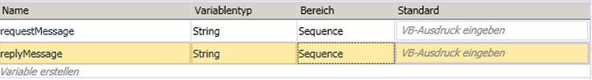

# <a name="flowing-transactions-into-and-out-of-workflow-services"></a><span data-ttu-id="97f9e-102">Transaktionsfluss in Workflowdienste und aus Workflowdiensten</span><span class="sxs-lookup"><span data-stu-id="97f9e-102">Flowing Transactions into and out of Workflow Services</span></span>
<span data-ttu-id="97f9e-103">Workflowdienste und Clients können an Transaktionen teilnehmen.</span><span class="sxs-lookup"><span data-stu-id="97f9e-103">Workflow services and clients can participate in transactions.</span></span>  <span data-ttu-id="97f9e-104">Damit ein Dienstvorgang Teil einer Ambient-Transaktion wird, fügen Sie eine <xref:System.ServiceModel.Activities.Receive>-Aktivität in eine <xref:System.ServiceModel.Activities.TransactedReceiveScope>-Aktivität ein.</span><span class="sxs-lookup"><span data-stu-id="97f9e-104">For a service operation to become part of an ambient transaction, place a <xref:System.ServiceModel.Activities.Receive> activity within a <xref:System.ServiceModel.Activities.TransactedReceiveScope> activity.</span></span> <span data-ttu-id="97f9e-105">Alle Aufrufe, die von einer <xref:System.ServiceModel.Activities.Send>-Aktivität oder einer <xref:System.ServiceModel.Activities.SendReply>-Aktivität in <xref:System.ServiceModel.Activities.TransactedReceiveScope> durchgeführt werden, werden auch in der Ambient-Transaktion durchgeführt.</span><span class="sxs-lookup"><span data-stu-id="97f9e-105">Any calls made by a <xref:System.ServiceModel.Activities.Send> or a <xref:System.ServiceModel.Activities.SendReply> activity within the <xref:System.ServiceModel.Activities.TransactedReceiveScope> will also be made within the ambient transaction.</span></span> <span data-ttu-id="97f9e-106">Eine Workflowclientanwendung kann mit der <xref:System.Activities.Statements.TransactionScope>-Aktivität eine Ambient-Transaktion erstellen und Dienstvorgänge mithilfe der Ambient-Transaktion aufrufen.</span><span class="sxs-lookup"><span data-stu-id="97f9e-106">A workflow client application can create an ambient transaction by using the <xref:System.Activities.Statements.TransactionScope> activity and call service operations using the ambient transaction.</span></span> <span data-ttu-id="97f9e-107">In diesem Thema wird die Erstellung eines Workflowdiensts und Workflowclients, die an Transaktionen teilnehmen, erläutert.</span><span class="sxs-lookup"><span data-stu-id="97f9e-107">This topic walks you through creating a workflow service and workflow client that participate in transactions.</span></span>  
  
> [!WARNING]
>  <span data-ttu-id="97f9e-108">Wenn eine Workflowdienstinstanz innerhalb einer Transaktion geladen wird und der Workflow eine <xref:System.Activities.Statements.Persist>-Aktivität enthält, bleibt die Workflowinstanz bis zum Timeout der Transaktion hängen.</span><span class="sxs-lookup"><span data-stu-id="97f9e-108">If a workflow service instance is loaded within a transaction and the workflow contains a <xref:System.Activities.Statements.Persist> activity, the workflow instance will hang until the transaction times out.</span></span>  
  
> [!IMPORTANT]
>  <span data-ttu-id="97f9e-109">Es wird empfohlen, bei Verwendung von <xref:System.ServiceModel.Activities.TransactedReceiveScope> alle empfangenen Nachrichten im Workflow in <xref:System.ServiceModel.Activities.TransactedReceiveScope>-Aktivitäten zu platzieren.</span><span class="sxs-lookup"><span data-stu-id="97f9e-109">Whenever you use a <xref:System.ServiceModel.Activities.TransactedReceiveScope> it is recommended to place all Receives in the workflow within <xref:System.ServiceModel.Activities.TransactedReceiveScope> activities.</span></span>  
  
> [!IMPORTANT]
>  <span data-ttu-id="97f9e-110">Wenn Sie <xref:System.ServiceModel.Activities.TransactedReceiveScope> verwenden und Nachrichten in der falschen Reihenfolge eintreffen, wird beim Versuch, die erste der Nachrichten außerhalb der normalen Reihenfolge zu übermitteln, der Workflow abgebrochen.</span><span class="sxs-lookup"><span data-stu-id="97f9e-110">When using <xref:System.ServiceModel.Activities.TransactedReceiveScope> and messages arrive in the incorrect order, the workflow will be aborted when trying to deliver the first out of order message.</span></span> <span data-ttu-id="97f9e-111">Sie müssen sicherstellen, dass der Workflow im Leerlauf stets einen konsistenten Haltepunkt aufweist.</span><span class="sxs-lookup"><span data-stu-id="97f9e-111">You must make sure your workflow is always at a consistent stopping point when the workflow idles.</span></span> <span data-ttu-id="97f9e-112">Falls der Workflow abgebrochen wird, können Sie ihn auf diese Weise anhand eines früheren Persistenzpunkts erneut starten.</span><span class="sxs-lookup"><span data-stu-id="97f9e-112">This will allow you to restart the workflow from a previous persistence point should the workflow be aborted.</span></span>  
  
### <a name="create-a-shared-library"></a><span data-ttu-id="97f9e-113">Erstellen einer freigegebenen Bibliothek</span><span class="sxs-lookup"><span data-stu-id="97f9e-113">Create a shared library</span></span>  
  
1.  <span data-ttu-id="97f9e-114">Erstellen Sie eine neue leere Visual Studio-Projektmappe.</span><span class="sxs-lookup"><span data-stu-id="97f9e-114">Create a new empty Visual Studio Solution.</span></span>  
  
2.  <span data-ttu-id="97f9e-115">Fügen Sie ein neues Klassenbibliotheksprojekt mit dem Namen `Common` hinzu.</span><span class="sxs-lookup"><span data-stu-id="97f9e-115">Add a new class library project called `Common`.</span></span> <span data-ttu-id="97f9e-116">Fügen Sie Verweise auf die folgenden Assemblys hinzu:</span><span class="sxs-lookup"><span data-stu-id="97f9e-116">Add references to the following assemblies:</span></span>  
  
    -   <span data-ttu-id="97f9e-117">System.Activities.dll</span><span class="sxs-lookup"><span data-stu-id="97f9e-117">System.Activities.dll</span></span>  
  
    -   <span data-ttu-id="97f9e-118">System.ServiceModel.dll</span><span class="sxs-lookup"><span data-stu-id="97f9e-118">System.ServiceModel.dll</span></span>  
  
    -   <span data-ttu-id="97f9e-119">System.ServiceModel.Activities.dll</span><span class="sxs-lookup"><span data-stu-id="97f9e-119">System.ServiceModel.Activities.dll</span></span>  
  
    -   <span data-ttu-id="97f9e-120">System.Transactions.dll</span><span class="sxs-lookup"><span data-stu-id="97f9e-120">System.Transactions.dll</span></span>  
  
3.  <span data-ttu-id="97f9e-121">Fügen Sie dem `PrintTransactionInfo`-Projekt eine neue Klasse mit dem Namen `Common` hinzu.</span><span class="sxs-lookup"><span data-stu-id="97f9e-121">Add a new class called `PrintTransactionInfo` to the `Common` project.</span></span> <span data-ttu-id="97f9e-122">Diese Klasse wird von <xref:System.Activities.NativeActivity> abgeleitet und überlädt die <xref:System.Activities.NativeActivity.Execute%2A>-Methode.</span><span class="sxs-lookup"><span data-stu-id="97f9e-122">This class is derived from <xref:System.Activities.NativeActivity> and overloads the <xref:System.Activities.NativeActivity.Execute%2A> method.</span></span>  
  
    ```  
    using System;  
    using System;  
    using System.Activities;  
    using System.Transactions;  
  
    namespace Common  
    {  
        public class PrintTransactionInfo : NativeActivity  
        {  
            protected override void Execute(NativeActivityContext context)  
            {  
                RuntimeTransactionHandle rth = context.Properties.Find(typeof(RuntimeTransactionHandle).FullName) as RuntimeTransactionHandle;  
  
                if (rth == null)  
                {  
                    Console.WriteLine("There is no ambient RuntimeTransactionHandle");  
                }  
  
                Transaction t = rth.GetCurrentTransaction(context);  
  
                if (t == null)  
                {  
                    Console.WriteLine("There is no ambient transaction");  
                }  
                else  
                {  
                    Console.WriteLine("Transaction: {0} is {1}", t.TransactionInformation.DistributedIdentifier, t.TransactionInformation.Status);  
                }  
            }  
        }  
  
    }  
    ```  
  
     <span data-ttu-id="97f9e-123">Diese native Aktivität, in der Informationen zur Ambient-Transaktion angezeigt werden, wird in den in diesem Thema verwendeten Dienst- und Clientworkflows eingesetzt.</span><span class="sxs-lookup"><span data-stu-id="97f9e-123">This is a native activity that displays information about the ambient transaction and is used in both the service and client workflows used in this topic.</span></span> <span data-ttu-id="97f9e-124">Erstellen der Projektmappe, um diese Aktivität in verfügbar zu machen die **allgemeine** Teil der **Toolbox**.</span><span class="sxs-lookup"><span data-stu-id="97f9e-124">Build the solution to make this activity available in the **Common** section of the **Toolbox**.</span></span>  
  
### <a name="implement-the-workflow-service"></a><span data-ttu-id="97f9e-125">Implementieren des Workflowdiensts</span><span class="sxs-lookup"><span data-stu-id="97f9e-125">Implement the workflow service</span></span>  
  
1.  <span data-ttu-id="97f9e-126">Hinzufügen einer neuen WCF-Workflowdienst aufgerufen `WorkflowService` auf die `Common` Projekt.</span><span class="sxs-lookup"><span data-stu-id="97f9e-126">Add a new WCF Workflow Service, called `WorkflowService` to the `Common` project.</span></span> <span data-ttu-id="97f9e-127">Rechts klicken Sie hierzu die `Common` -Projekt, wählen **hinzufügen**, **neues Element...** Option **Workflow** unter **installierte Vorlagen** , und wählen Sie **WCF-Workflowdienst**.</span><span class="sxs-lookup"><span data-stu-id="97f9e-127">To do this right click the `Common` project, select **Add**, **New Item ...**, Select **Workflow** under **Installed Templates** and select **WCF Workflow Service**.</span></span>  
  
     <span data-ttu-id="97f9e-128"></span><span class="sxs-lookup"><span data-stu-id="97f9e-128"></span></span>  
  
2.  <span data-ttu-id="97f9e-129">Löschen Sie die `ReceiveRequest`-Standardaktivität und `SendResponse`-Standardaktivität.</span><span class="sxs-lookup"><span data-stu-id="97f9e-129">Delete the default `ReceiveRequest` and `SendResponse` activities.</span></span>  
  
3.  <span data-ttu-id="97f9e-130">Ziehen Sie eine <xref:System.Activities.Statements.WriteLine>-Aktivität in die `Sequential Service`-Aktivität.</span><span class="sxs-lookup"><span data-stu-id="97f9e-130">Drag and drop a <xref:System.Activities.Statements.WriteLine> activity into the `Sequential Service` activity.</span></span> <span data-ttu-id="97f9e-131">Legen Sie die Texteigenschaft auf `"Workflow Service starting ..."` fest, wie im folgenden Beispiel gezeigt.</span><span class="sxs-lookup"><span data-stu-id="97f9e-131">Set the text property to `"Workflow Service starting ..."` as shown in the following example.</span></span>  
  
     <span data-ttu-id="97f9e-132"></span><span class="sxs-lookup"><span data-stu-id="97f9e-132"></span></span>  
  
4.  <span data-ttu-id="97f9e-133">Verschieben Sie eine <xref:System.ServiceModel.Activities.TransactedReceiveScope>-Aktivität per Drag & Drop an die Stelle nach der <xref:System.Activities.Statements.WriteLine>-Aktivität.</span><span class="sxs-lookup"><span data-stu-id="97f9e-133">Drag and drop a <xref:System.ServiceModel.Activities.TransactedReceiveScope> after the <xref:System.Activities.Statements.WriteLine> activity.</span></span> <span data-ttu-id="97f9e-134">Die <xref:System.ServiceModel.Activities.TransactedReceiveScope> -Aktivität befindet sich der **Messaging** Teil der **Toolbox**.</span><span class="sxs-lookup"><span data-stu-id="97f9e-134">The <xref:System.ServiceModel.Activities.TransactedReceiveScope> activity can be found in the **Messaging** section of the **Toolbox**.</span></span> <span data-ttu-id="97f9e-135">Die <xref:System.ServiceModel.Activities.TransactedReceiveScope> Aktivität besteht aus zwei Abschnitten **anfordern** und **Text**.</span><span class="sxs-lookup"><span data-stu-id="97f9e-135">The <xref:System.ServiceModel.Activities.TransactedReceiveScope> activity is composed of two sections **Request** and **Body**.</span></span> <span data-ttu-id="97f9e-136">Die **anfordern** Abschnitt enthält die <xref:System.ServiceModel.Activities.Receive> Aktivität.</span><span class="sxs-lookup"><span data-stu-id="97f9e-136">The **Request** section contains the <xref:System.ServiceModel.Activities.Receive> activity.</span></span> <span data-ttu-id="97f9e-137">Die **Text** Abschnitt enthält die Aktivitäten, die innerhalb einer Transaktion ausgeführt wird, nachdem eine Nachricht empfangen wurde.</span><span class="sxs-lookup"><span data-stu-id="97f9e-137">The **Body** section contains the activities to execute within a transaction after a message has been received.</span></span>  
  
     <span data-ttu-id="97f9e-138"></span><span class="sxs-lookup"><span data-stu-id="97f9e-138"></span></span>  
  
5.  <span data-ttu-id="97f9e-139">Wählen Sie die <xref:System.ServiceModel.Activities.TransactedReceiveScope> Aktivität, und klicken Sie auf die **Variablen** Schaltfläche.</span><span class="sxs-lookup"><span data-stu-id="97f9e-139">Select the <xref:System.ServiceModel.Activities.TransactedReceiveScope> activity and click the **Variables** button.</span></span> <span data-ttu-id="97f9e-140">Fügen Sie die folgenden Variablen hinzu:</span><span class="sxs-lookup"><span data-stu-id="97f9e-140">Add the following variables.</span></span>  
  
     <span data-ttu-id="97f9e-141"></span><span class="sxs-lookup"><span data-stu-id="97f9e-141"></span></span>  
  
    > [!NOTE]
    >  <span data-ttu-id="97f9e-142">Sie können die standardmäßig vorhandene Datenvariable löschen.</span><span class="sxs-lookup"><span data-stu-id="97f9e-142">You can delete the data variable that is there by default.</span></span> <span data-ttu-id="97f9e-143">Sie können auch die vorhandene Handlevariable verwenden.</span><span class="sxs-lookup"><span data-stu-id="97f9e-143">You can also use the existing handle variable.</span></span>  
  
6.  <span data-ttu-id="97f9e-144">Drag & drop eine <xref:System.ServiceModel.Activities.Receive> Aktivität innerhalb der **anfordern** Teil der <xref:System.ServiceModel.Activities.TransactedReceiveScope> Aktivität.</span><span class="sxs-lookup"><span data-stu-id="97f9e-144">Drag and drop a <xref:System.ServiceModel.Activities.Receive> activity within the **Request** section of the <xref:System.ServiceModel.Activities.TransactedReceiveScope> activity.</span></span> <span data-ttu-id="97f9e-145">Legen Sie die folgenden Eigenschaften fest:</span><span class="sxs-lookup"><span data-stu-id="97f9e-145">Set the following properties:</span></span>  
  
    |<span data-ttu-id="97f9e-146">Eigenschaft</span><span class="sxs-lookup"><span data-stu-id="97f9e-146">Property</span></span>|<span data-ttu-id="97f9e-147">Wert</span><span class="sxs-lookup"><span data-stu-id="97f9e-147">Value</span></span>|  
    |--------------|-----------|  
    |<span data-ttu-id="97f9e-148">CanCreateInstance</span><span class="sxs-lookup"><span data-stu-id="97f9e-148">CanCreateInstance</span></span>|<span data-ttu-id="97f9e-149">Wahr (aktivieren Sie das Kontrollkästchen)</span><span class="sxs-lookup"><span data-stu-id="97f9e-149">True (check the checkbox)</span></span>|  
    |<span data-ttu-id="97f9e-150">OperationName</span><span class="sxs-lookup"><span data-stu-id="97f9e-150">OperationName</span></span>|<span data-ttu-id="97f9e-151">StartSample</span><span class="sxs-lookup"><span data-stu-id="97f9e-151">StartSample</span></span>|  
    |<span data-ttu-id="97f9e-152">ServiceContractName</span><span class="sxs-lookup"><span data-stu-id="97f9e-152">ServiceContractName</span></span>|<span data-ttu-id="97f9e-153">ITransactionSample</span><span class="sxs-lookup"><span data-stu-id="97f9e-153">ITransactionSample</span></span>|  
  
     <span data-ttu-id="97f9e-154">Der Workflow müsste wie folgt aussehen:</span><span class="sxs-lookup"><span data-stu-id="97f9e-154">The workflow should look like this:</span></span>  
  
     <span data-ttu-id="97f9e-155"></span><span class="sxs-lookup"><span data-stu-id="97f9e-155"></span></span>  
  
7.  <span data-ttu-id="97f9e-156">Klicken Sie auf die **definieren...**  wiederherstellungsverknüpfung in der <xref:System.ServiceModel.Activities.Receive> Aktivität, und legen Sie die folgenden Einstellungen:</span><span class="sxs-lookup"><span data-stu-id="97f9e-156">Click the **Define...** link in the <xref:System.ServiceModel.Activities.Receive> activity and make the following settings:</span></span>  
  
     <span data-ttu-id="97f9e-157"></span><span class="sxs-lookup"><span data-stu-id="97f9e-157"></span></span>  
  
8.  <span data-ttu-id="97f9e-158">Ziehen Sie eine <xref:System.Activities.Statements.Sequence>-Aktivität per Drag & Drop in den Textabschnitt vom <xref:System.ServiceModel.Activities.TransactedReceiveScope>.</span><span class="sxs-lookup"><span data-stu-id="97f9e-158">Drag and drop a <xref:System.Activities.Statements.Sequence> activity into the Body section of the <xref:System.ServiceModel.Activities.TransactedReceiveScope>.</span></span> <span data-ttu-id="97f9e-159">Verschieben Sie innerhalb der <xref:System.Activities.Statements.Sequence>-Aktivität zwei <xref:System.Activities.Statements.WriteLine>-Aktivitäten per Drag & Drop, und legen Sie die <xref:System.Activities.Statements.WriteLine.Text%2A>-Eigenschaften wie in der folgenden Tabelle gezeigt fest.</span><span class="sxs-lookup"><span data-stu-id="97f9e-159">Within the <xref:System.Activities.Statements.Sequence> activity drag and drop two <xref:System.Activities.Statements.WriteLine> activities and set the <xref:System.Activities.Statements.WriteLine.Text%2A> properties as shown in the following table.</span></span>  
  
    |<span data-ttu-id="97f9e-160">Aktivität</span><span class="sxs-lookup"><span data-stu-id="97f9e-160">Activity</span></span>|<span data-ttu-id="97f9e-161">Wert</span><span class="sxs-lookup"><span data-stu-id="97f9e-161">Value</span></span>|  
    |--------------|-----------|  
    |<span data-ttu-id="97f9e-162">1. WriteLine</span><span class="sxs-lookup"><span data-stu-id="97f9e-162">1st WriteLine</span></span>|<span data-ttu-id="97f9e-163">"Service: abgeschlossene empfangen"</span><span class="sxs-lookup"><span data-stu-id="97f9e-163">"Service: Receive Completed"</span></span>|  
    |<span data-ttu-id="97f9e-164">2. WriteLine</span><span class="sxs-lookup"><span data-stu-id="97f9e-164">2nd WriteLine</span></span>|<span data-ttu-id="97f9e-165">"Service: Received = " + requestMessage</span><span class="sxs-lookup"><span data-stu-id="97f9e-165">"Service: Received = " + requestMessage</span></span>|  
  
     <span data-ttu-id="97f9e-166">Der Workflow müsste jetzt wie folgt aussehen:</span><span class="sxs-lookup"><span data-stu-id="97f9e-166">The workflow should now look like this:</span></span>  
  
     <span data-ttu-id="97f9e-167"></span><span class="sxs-lookup"><span data-stu-id="97f9e-167"></span></span>  
  
9. <span data-ttu-id="97f9e-168">Drag & drop die `PrintTransactionInfo` Aktivität nach der zweiten <xref:System.Activities.Statements.WriteLine> Aktivität in der **Text** in die <xref:System.ServiceModel.Activities.TransactedReceiveScope> Aktivität.</span><span class="sxs-lookup"><span data-stu-id="97f9e-168">Drag and drop the `PrintTransactionInfo` activity after the second <xref:System.Activities.Statements.WriteLine> activity in the **Body** in the <xref:System.ServiceModel.Activities.TransactedReceiveScope> activity.</span></span>  
  
     <span data-ttu-id="97f9e-169"></span><span class="sxs-lookup"><span data-stu-id="97f9e-169"></span></span>  
  
10. <span data-ttu-id="97f9e-170">Ziehen Sie eine <xref:System.Activities.Statements.Assign>-Aktivität per Drag & Drop an die Stelle nach der `PrintTransactionInfo`-Aktivität, und legen Sie die Eigenschaften entsprechend der folgenden Tabelle fest.</span><span class="sxs-lookup"><span data-stu-id="97f9e-170">Drag and drop an <xref:System.Activities.Statements.Assign> activity after the `PrintTransactionInfo` activity and set its properties according to the following table.</span></span>  
  
    |<span data-ttu-id="97f9e-171">Eigenschaft</span><span class="sxs-lookup"><span data-stu-id="97f9e-171">Property</span></span>|<span data-ttu-id="97f9e-172">Wert</span><span class="sxs-lookup"><span data-stu-id="97f9e-172">Value</span></span>|  
    |--------------|-----------|  
    |<span data-ttu-id="97f9e-173">Beschreibung</span><span class="sxs-lookup"><span data-stu-id="97f9e-173">To</span></span>|<span data-ttu-id="97f9e-174">replyMessage</span><span class="sxs-lookup"><span data-stu-id="97f9e-174">replyMessage</span></span>|  
    |<span data-ttu-id="97f9e-175">Wert</span><span class="sxs-lookup"><span data-stu-id="97f9e-175">Value</span></span>|<span data-ttu-id="97f9e-176">"Service: Sending reply."</span><span class="sxs-lookup"><span data-stu-id="97f9e-176">"Service: Sending reply."</span></span>|  
  
11. <span data-ttu-id="97f9e-177">Ziehen Sie eine <xref:System.Activities.Statements.WriteLine>-Aktivität per Drag & Drop an die Stelle nach der <xref:System.Activities.Statements.Assign>-Aktivität, und legen Sie die <xref:System.Activities.Statements.WriteLine.Text%2A>-Eigenschaft auf "Service: Begin reply" fest.</span><span class="sxs-lookup"><span data-stu-id="97f9e-177">Drag and drop a <xref:System.Activities.Statements.WriteLine> activity after the <xref:System.Activities.Statements.Assign> activity and set its <xref:System.Activities.Statements.WriteLine.Text%2A> property to "Service: Begin reply."</span></span>  
  
     <span data-ttu-id="97f9e-178">Der Workflow müsste jetzt wie folgt aussehen:</span><span class="sxs-lookup"><span data-stu-id="97f9e-178">The workflow should now look like this:</span></span>  
  
     <span data-ttu-id="97f9e-179"></span><span class="sxs-lookup"><span data-stu-id="97f9e-179"></span></span>  
  
12. <span data-ttu-id="97f9e-180">Klicken Sie mit der rechten Maustaste auf die <xref:System.ServiceModel.Activities.Receive> Aktivität, und wählen **SendReply erstellen** und fügen Sie ihn nach dem letzten <xref:System.Activities.Statements.WriteLine> Aktivität.</span><span class="sxs-lookup"><span data-stu-id="97f9e-180">Right click the <xref:System.ServiceModel.Activities.Receive> activity and select **Create SendReply** and paste it after the last <xref:System.Activities.Statements.WriteLine> activity.</span></span> <span data-ttu-id="97f9e-181">Klicken Sie auf die **definieren...**  wiederherstellungsverknüpfung in der `SendReplyToReceive` Aktivität, und legen Sie die folgenden Einstellungen.</span><span class="sxs-lookup"><span data-stu-id="97f9e-181">Click the **Define...** link in the `SendReplyToReceive` activity and make the following settings.</span></span>  
  
     <span data-ttu-id="97f9e-182"></span><span class="sxs-lookup"><span data-stu-id="97f9e-182"></span></span>  
  
13. <span data-ttu-id="97f9e-183">Drag & drop eine <xref:System.Activities.Statements.WriteLine> Aktivität nach dem der `SendReplyToReceive` Aktivität, und legen sie hat <xref:System.Activities.Statements.WriteLine.Text%2A> Eigenschaft, um "Service: Reply sent."</span><span class="sxs-lookup"><span data-stu-id="97f9e-183">Drag and drop a <xref:System.Activities.Statements.WriteLine> activity after the `SendReplyToReceive` activity and set it’s <xref:System.Activities.Statements.WriteLine.Text%2A> property to "Service: Reply sent."</span></span>  
  
14. <span data-ttu-id="97f9e-184">Verschieben Sie eine <xref:System.Activities.Statements.WriteLine>-Aktivität per Drag & Drop an das Ende des Workflows, und legen Sie die Eigenschaft <xref:System.Activities.Statements.WriteLine.Text%2A> auf "Service: Workflow ends, press ENTER to exit" fest.</span><span class="sxs-lookup"><span data-stu-id="97f9e-184">Drag and drop a <xref:System.Activities.Statements.WriteLine> activity at the bottom of the workflow and set its <xref:System.Activities.Statements.WriteLine.Text%2A> property to "Service: Workflow ends, press ENTER to exit."</span></span>  
  
     <span data-ttu-id="97f9e-185">Der abgeschlossene Dienstworkflow müsste wie folgt aussehen:</span><span class="sxs-lookup"><span data-stu-id="97f9e-185">The completed service workflow should look like this:</span></span>  
  
     <span data-ttu-id="97f9e-186"></span><span class="sxs-lookup"><span data-stu-id="97f9e-186"></span></span>  
  
### <a name="implement-the-workflow-client"></a><span data-ttu-id="97f9e-187">Implementieren des Workflowclients</span><span class="sxs-lookup"><span data-stu-id="97f9e-187">Implement the workflow client</span></span>  
  
1.  <span data-ttu-id="97f9e-188">Fügen Sie eine neue WCF-Workflowanwendung mit dem Namen `WorkflowClient` zum `Common`-Projekt hinzu.</span><span class="sxs-lookup"><span data-stu-id="97f9e-188">Add a new WCF Workflow application, called `WorkflowClient` to the `Common` project.</span></span> <span data-ttu-id="97f9e-189">Rechts klicken Sie hierzu die `Common` -Projekt, wählen **hinzufügen**, **neues Element...** Option **Workflow** unter **installierte Vorlagen** , und wählen Sie **Aktivität**.</span><span class="sxs-lookup"><span data-stu-id="97f9e-189">To do this right click the `Common` project, select **Add**, **New Item ...**, Select **Workflow** under **Installed Templates** and select **Activity**.</span></span>  
  
     <span data-ttu-id="97f9e-190"></span><span class="sxs-lookup"><span data-stu-id="97f9e-190"></span></span>  
  
2.  <span data-ttu-id="97f9e-191">Ziehen Sie eine <xref:System.Activities.Statements.Sequence>-Aktivität per Drag & Drop auf die Entwurfsoberfläche.</span><span class="sxs-lookup"><span data-stu-id="97f9e-191">Drag and drop a <xref:System.Activities.Statements.Sequence> activity onto the design surface.</span></span>  
  
3.  <span data-ttu-id="97f9e-192">Verschieben Sie in der <xref:System.Activities.Statements.Sequence>-Aktivität eine <xref:System.Activities.Statements.WriteLine>-Aktivität per Drag & Drop, und legen Sie die <xref:System.Activities.Statements.WriteLine.Text%2A>-Eigenschaft auf `"Client: Workflow starting"` fest.</span><span class="sxs-lookup"><span data-stu-id="97f9e-192">Within the <xref:System.Activities.Statements.Sequence> activity drag and drop a <xref:System.Activities.Statements.WriteLine> activity and set its <xref:System.Activities.Statements.WriteLine.Text%2A> property to `"Client: Workflow starting"`.</span></span> <span data-ttu-id="97f9e-193">Der Workflow müsste jetzt wie folgt aussehen:</span><span class="sxs-lookup"><span data-stu-id="97f9e-193">The workflow should now look like this:</span></span>  
  
     <span data-ttu-id="97f9e-194"></span><span class="sxs-lookup"><span data-stu-id="97f9e-194"></span></span>  
  
4.  <span data-ttu-id="97f9e-195">Verschieben Sie eine <xref:System.Activities.Statements.TransactionScope>-Aktivität per Drag & Drop an die Stelle nach der <xref:System.Activities.Statements.WriteLine>-Aktivität.</span><span class="sxs-lookup"><span data-stu-id="97f9e-195">Drag and drop a <xref:System.Activities.Statements.TransactionScope> activity after the <xref:System.Activities.Statements.WriteLine> activity.</span></span>  <span data-ttu-id="97f9e-196">Wählen Sie die <xref:System.Activities.Statements.TransactionScope>-Aktivität aus, klicken Sie auf die Schaltfläche Variablen, und fügen Sie die folgenden Variablen hinzu.</span><span class="sxs-lookup"><span data-stu-id="97f9e-196">Select the <xref:System.Activities.Statements.TransactionScope> activity, click the Variables button and add the following variables.</span></span>  
  
     <span data-ttu-id="97f9e-197"></span><span class="sxs-lookup"><span data-stu-id="97f9e-197"></span></span>  
  
5.  <span data-ttu-id="97f9e-198">Ziehen Sie eine <xref:System.Activities.Statements.Sequence>-Aktivität per Drag & Drop in den Text der <xref:System.Activities.Statements.TransactionScope>-Aktivität.</span><span class="sxs-lookup"><span data-stu-id="97f9e-198">Drag and drop a <xref:System.Activities.Statements.Sequence> activity into the body of the <xref:System.Activities.Statements.TransactionScope> activity.</span></span>  
  
6.  <span data-ttu-id="97f9e-199">Verschieben Sie eine `PrintTransactionInfo`-Aktivität per Drag & Drop innerhalb der <xref:System.Activities.Statements.Sequence>-Aktivität.</span><span class="sxs-lookup"><span data-stu-id="97f9e-199">Drag and drop a `PrintTransactionInfo` activity within the <xref:System.Activities.Statements.Sequence></span></span>  
  
7.  <span data-ttu-id="97f9e-200">Drag & drop eine <xref:System.Activities.Statements.WriteLine> Aktivität nach dem die `PrintTransactionInfo` Aktivität, und legen dessen <xref:System.Activities.Statements.WriteLine.Text%2A> Eigenschaft auf "Client: Beginning Send".</span><span class="sxs-lookup"><span data-stu-id="97f9e-200">Drag and drop a <xref:System.Activities.Statements.WriteLine> activity after the `PrintTransactionInfo` activity and set its <xref:System.Activities.Statements.WriteLine.Text%2A> property to "Client: Beginning Send".</span></span> <span data-ttu-id="97f9e-201">Der Workflow müsste jetzt wie folgt aussehen:</span><span class="sxs-lookup"><span data-stu-id="97f9e-201">The workflow should now look like this:</span></span>  
  
     <span data-ttu-id="97f9e-202"></span><span class="sxs-lookup"><span data-stu-id="97f9e-202"></span></span>  
  
8.  <span data-ttu-id="97f9e-203">Ziehen Sie eine <xref:System.ServiceModel.Activities.Send>-Aktivität per Drag & Drop an die Stelle nach der <xref:System.Activities.Statements.Assign>-Aktivität, und legen Sie die folgenden Eigenschaften fest:</span><span class="sxs-lookup"><span data-stu-id="97f9e-203">Drag and drop a <xref:System.ServiceModel.Activities.Send> activity after the <xref:System.Activities.Statements.Assign> activity and set the following properties:</span></span>  
  
    |<span data-ttu-id="97f9e-204">Eigenschaft</span><span class="sxs-lookup"><span data-stu-id="97f9e-204">Property</span></span>|<span data-ttu-id="97f9e-205">Wert</span><span class="sxs-lookup"><span data-stu-id="97f9e-205">Value</span></span>|  
    |--------------|-----------|  
    |<span data-ttu-id="97f9e-206">EndpointConfigurationName</span><span class="sxs-lookup"><span data-stu-id="97f9e-206">EndpointConfigurationName</span></span>|<span data-ttu-id="97f9e-207">workflowServiceEndpoint</span><span class="sxs-lookup"><span data-stu-id="97f9e-207">workflowServiceEndpoint</span></span>|  
    |<span data-ttu-id="97f9e-208">OperationName</span><span class="sxs-lookup"><span data-stu-id="97f9e-208">OperationName</span></span>|<span data-ttu-id="97f9e-209">StartSample</span><span class="sxs-lookup"><span data-stu-id="97f9e-209">StartSample</span></span>|  
    |<span data-ttu-id="97f9e-210">ServiceContractName</span><span class="sxs-lookup"><span data-stu-id="97f9e-210">ServiceContractName</span></span>|<span data-ttu-id="97f9e-211">ITransactionSample</span><span class="sxs-lookup"><span data-stu-id="97f9e-211">ITransactionSample</span></span>|  
  
     <span data-ttu-id="97f9e-212">Der Workflow müsste jetzt wie folgt aussehen:</span><span class="sxs-lookup"><span data-stu-id="97f9e-212">The workflow should now look like this:</span></span>  
  
     <span data-ttu-id="97f9e-213"></span><span class="sxs-lookup"><span data-stu-id="97f9e-213"></span></span>  
  
9. <span data-ttu-id="97f9e-214">Klicken Sie auf die **definieren...**  verknüpfen, und legen Sie die folgenden Einstellungen:</span><span class="sxs-lookup"><span data-stu-id="97f9e-214">Click the **Define...** link and make the following settings:</span></span>  
  
     <span data-ttu-id="97f9e-215"></span><span class="sxs-lookup"><span data-stu-id="97f9e-215"></span></span>  
  
10. <span data-ttu-id="97f9e-216">Klicken Sie mit der rechten Maustaste auf die <xref:System.ServiceModel.Activities.Send> Aktivität, und wählen **ReceiveReply erstellen**.</span><span class="sxs-lookup"><span data-stu-id="97f9e-216">Right click the <xref:System.ServiceModel.Activities.Send> activity and select **Create ReceiveReply**.</span></span> <span data-ttu-id="97f9e-217">Die <xref:System.ServiceModel.Activities.ReceiveReply>-Aktivität wird automatisch nach der <xref:System.ServiceModel.Activities.Send>-Aktivität platziert.</span><span class="sxs-lookup"><span data-stu-id="97f9e-217">The <xref:System.ServiceModel.Activities.ReceiveReply> activity will be automatically placed after the <xref:System.ServiceModel.Activities.Send> activity.</span></span>  
  
11. <span data-ttu-id="97f9e-218">Klicken Sie in der ReceiveReplyForSend-Aktivität auf den Link Definieren..., und legen Sie die folgenden Einstellungen fest:</span><span class="sxs-lookup"><span data-stu-id="97f9e-218">Click the Define... link on the ReceiveReplyForSend activity and make the following settings:</span></span>  
  
     <span data-ttu-id="97f9e-219"></span><span class="sxs-lookup"><span data-stu-id="97f9e-219"></span></span>  
  
12. <span data-ttu-id="97f9e-220">Verschieben Sie eine <xref:System.Activities.Statements.WriteLine>-Aktivität per Drag & Drop zwischen der <xref:System.ServiceModel.Activities.Send>-Aktivität und der <xref:System.ServiceModel.Activities.ReceiveReply>-Aktivität, und legen Sie die <xref:System.Activities.Statements.WriteLine.Text%2A>-Eigenschaft auf "Client: Send complete" fest.</span><span class="sxs-lookup"><span data-stu-id="97f9e-220">Drag and drop a <xref:System.Activities.Statements.WriteLine> activity between the <xref:System.ServiceModel.Activities.Send> and <xref:System.ServiceModel.Activities.ReceiveReply> activities and set its <xref:System.Activities.Statements.WriteLine.Text%2A> property to "Client: Send complete."</span></span>  
  
13. <span data-ttu-id="97f9e-221">Ziehen Sie eine <xref:System.Activities.Statements.WriteLine>-Aktivität per Drag & Drop an die Stelle nach der <xref:System.ServiceModel.Activities.ReceiveReply>-Aktivität, und legen Sie die <xref:System.Activities.Statements.WriteLine.Text%2A>-Eigenschaft auf "Client side: Reply received = " + replyMessage fest.</span><span class="sxs-lookup"><span data-stu-id="97f9e-221">Drag and drop a <xref:System.Activities.Statements.WriteLine> activity after the <xref:System.ServiceModel.Activities.ReceiveReply> activity and set its <xref:System.Activities.Statements.WriteLine.Text%2A> property to "Client side: Reply received = " + replyMessage</span></span>  
  
14. <span data-ttu-id="97f9e-222">Verschieben Sie eine `PrintTransactionInfo`-Aktivität per Drag & Drop an die Stelle nach der <xref:System.Activities.Statements.WriteLine>-Aktivität.</span><span class="sxs-lookup"><span data-stu-id="97f9e-222">Drag and drop a `PrintTransactionInfo` activity after the <xref:System.Activities.Statements.WriteLine> activity.</span></span>  
  
15. <span data-ttu-id="97f9e-223">Verschieben Sie eine <xref:System.Activities.Statements.WriteLine>-Aktivität per Drag & Drop an das Ende des Workflows, und legen Sie die <xref:System.Activities.Statements.WriteLine.Text%2A>-Eigenschaft auf "Client workflow ends" fest.</span><span class="sxs-lookup"><span data-stu-id="97f9e-223">Drag and drop a <xref:System.Activities.Statements.WriteLine> activity at the end of the workflow and set its <xref:System.Activities.Statements.WriteLine.Text%2A> property to "Client workflow ends."</span></span> <span data-ttu-id="97f9e-224">Der abgeschlossene Clientworkflow sollte wie das folgende Diagramm aussehen.</span><span class="sxs-lookup"><span data-stu-id="97f9e-224">The completed client workflow should look like the following diagram.</span></span>  
  
     <span data-ttu-id="97f9e-225"></span><span class="sxs-lookup"><span data-stu-id="97f9e-225"></span></span>  
  
16. <span data-ttu-id="97f9e-226">Erstellen Sie die Projektmappe.</span><span class="sxs-lookup"><span data-stu-id="97f9e-226">Build the solution.</span></span>  
  
### <a name="create-the-service-application"></a><span data-ttu-id="97f9e-227">Erstellen der Dienstanwendung</span><span class="sxs-lookup"><span data-stu-id="97f9e-227">Create the Service application</span></span>  
  
1.  <span data-ttu-id="97f9e-228">Fügen Sie der Projektmappe ein neues Konsolenanwendungsprojekt mit dem Namen `Service` hinzu.</span><span class="sxs-lookup"><span data-stu-id="97f9e-228">Add a new Console Application project called `Service` to the solution.</span></span> <span data-ttu-id="97f9e-229">Fügen Sie Verweise auf die folgenden Assemblys hinzu:</span><span class="sxs-lookup"><span data-stu-id="97f9e-229">Add references to the following assemblies:</span></span>  
  
    1.  <span data-ttu-id="97f9e-230">System.Activities.dll</span><span class="sxs-lookup"><span data-stu-id="97f9e-230">System.Activities.dll</span></span>  
  
    2.  <span data-ttu-id="97f9e-231">System.ServiceModel.dll</span><span class="sxs-lookup"><span data-stu-id="97f9e-231">System.ServiceModel.dll</span></span>  
  
    3.  <span data-ttu-id="97f9e-232">System.ServiceModel.Activities.dll</span><span class="sxs-lookup"><span data-stu-id="97f9e-232">System.ServiceModel.Activities.dll</span></span>  
  
2.  <span data-ttu-id="97f9e-233">Öffnen Sie die generierte Datei Program.cs und den folgenden Code:</span><span class="sxs-lookup"><span data-stu-id="97f9e-233">Open the generated Program.cs file and the following code:</span></span>  
  
    ```  
    static void Main()  
          {  
              Console.WriteLine("Building the server.");  
              using (WorkflowServiceHost host = new WorkflowServiceHost(new DeclarativeServiceWorkflow(), new Uri("net.tcp://localhost:8000/TransactedReceiveService/Declarative")))  
              {                
                  //Start the server  
                  host.Open();  
                  Console.WriteLine("Service started.");  
  
                  Console.WriteLine();  
                  Console.ReadLine();  
                  //Shutdown  
                  host.Close();  
              };         
          }  
    ```  
  
3.  <span data-ttu-id="97f9e-234">Fügen Sie dem Projekt die folgende app.config-Datei hinzu.</span><span class="sxs-lookup"><span data-stu-id="97f9e-234">Add the following app.config file to the project.</span></span>  
  
    ```xml  
    <?xml version="1.0" encoding="utf-8" ?>  
    <!-- Copyright © Microsoft Corporation.  All rights reserved. -->  
    <configuration>  
        <system.serviceModel>  
            <bindings>  
                <netTcpBinding>  
                    <binding transactionFlow="true" />  
                </netTcpBinding>  
            </bindings>  
        </system.serviceModel>  
    </configuration>  
    ```  
  
### <a name="create-the-client-application"></a><span data-ttu-id="97f9e-235">Erstellen der Clientanwendung</span><span class="sxs-lookup"><span data-stu-id="97f9e-235">Create the client application</span></span>  
  
1.  <span data-ttu-id="97f9e-236">Fügen Sie der Projektmappe ein neues Konsolenanwendungsprojekt mit dem Namen `Client` hinzu.</span><span class="sxs-lookup"><span data-stu-id="97f9e-236">Add a new Console Application project called `Client` to the solution.</span></span> <span data-ttu-id="97f9e-237">Fügen Sie einen Verweis auf System.Activities.dll hinzu.</span><span class="sxs-lookup"><span data-stu-id="97f9e-237">Add a reference to System.Activities.dll.</span></span>  
  
2.  <span data-ttu-id="97f9e-238">Öffnen Sie die Datei program.cs, und fügen Sie den folgenden Code hinzu.</span><span class="sxs-lookup"><span data-stu-id="97f9e-238">Open the program.cs file and add the following code.</span></span>  
  
    ```  
    class Program  
        {  
  
            private static AutoResetEvent syncEvent = new AutoResetEvent(false);  
  
            static void Main(string[] args)  
            {  
                //Build client  
                Console.WriteLine("Building the client.");  
                WorkflowApplication client = new WorkflowApplication(new DeclarativeClientWorkflow());  
                client.Completed = Program.Completed;  
                client.Aborted = Program.Aborted;  
                client.OnUnhandledException = Program.OnUnhandledException;  
  
                //Wait for service to start  
                Console.WriteLine("Press ENTER once service is started.");  
                Console.ReadLine();  
  
                //Start the client              
                Console.WriteLine("Starting the client.");  
                client.Run();  
                syncEvent.WaitOne();  
  
                //Sample complete  
                Console.WriteLine();  
                Console.WriteLine("Client complete. Press ENTER to exit.");  
                Console.ReadLine();  
            }  
  
            private static void Completed(WorkflowApplicationCompletedEventArgs e)  
            {  
                Program.syncEvent.Set();  
            }  
  
            private static void Aborted(WorkflowApplicationAbortedEventArgs e)  
            {  
                Console.WriteLine("Client Aborted: {0}", e.Reason);  
                Program.syncEvent.Set();  
            }  
  
            private static UnhandledExceptionAction OnUnhandledException(WorkflowApplicationUnhandledExceptionEventArgs e)  
            {  
                Console.WriteLine("Client had an unhandled exception: {0}", e.UnhandledException);  
                return UnhandledExceptionAction.Cancel;  
            }  
        }  
    ```  
  
## <a name="see-also"></a><span data-ttu-id="97f9e-239">Siehe auch</span><span class="sxs-lookup"><span data-stu-id="97f9e-239">See Also</span></span>  
 [<span data-ttu-id="97f9e-240">Workflowdienste</span><span class="sxs-lookup"><span data-stu-id="97f9e-240">Workflow Services</span></span>](../../../../docs/framework/wcf/feature-details/workflow-services.md)  
 [<span data-ttu-id="97f9e-241">Übersicht über Windows Communication Foundation-Transaktionen</span><span class="sxs-lookup"><span data-stu-id="97f9e-241">Windows Communication Foundation Transactions Overview</span></span>](../../../../docs/framework/wcf/feature-details/transactions-overview.md)  
 [<span data-ttu-id="97f9e-242">Verwendung von TransactedReceiveScope</span><span class="sxs-lookup"><span data-stu-id="97f9e-242">Use of TransactedReceiveScope</span></span>](../../../../docs/framework/windows-workflow-foundation/samples/use-of-transactedreceivescope.md)
