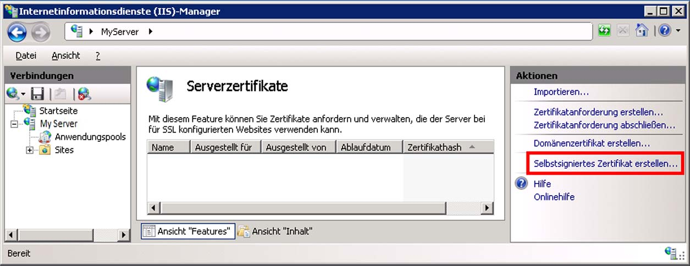
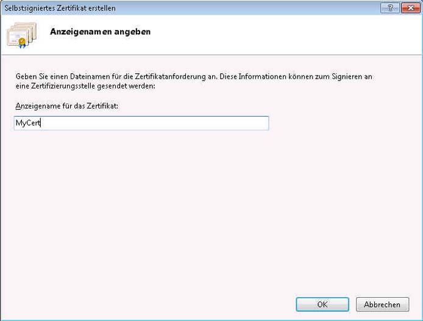
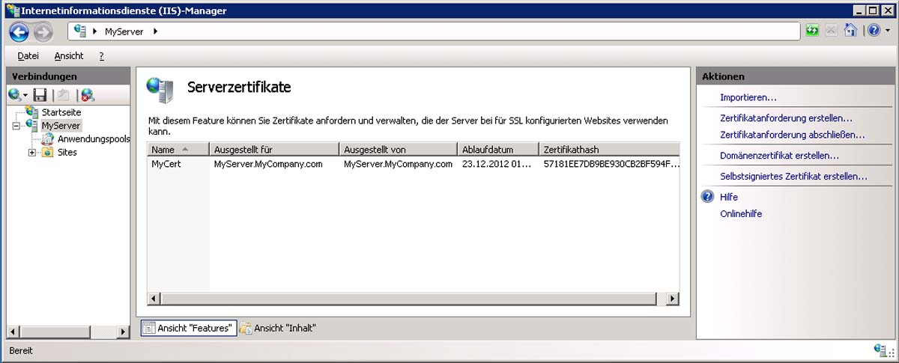
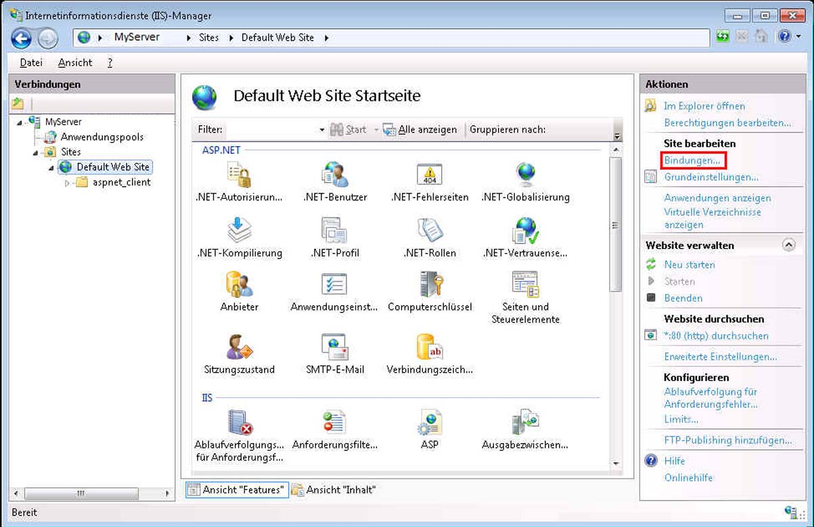
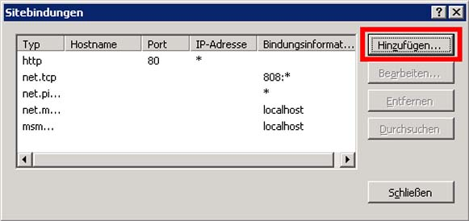
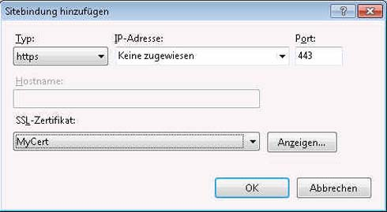
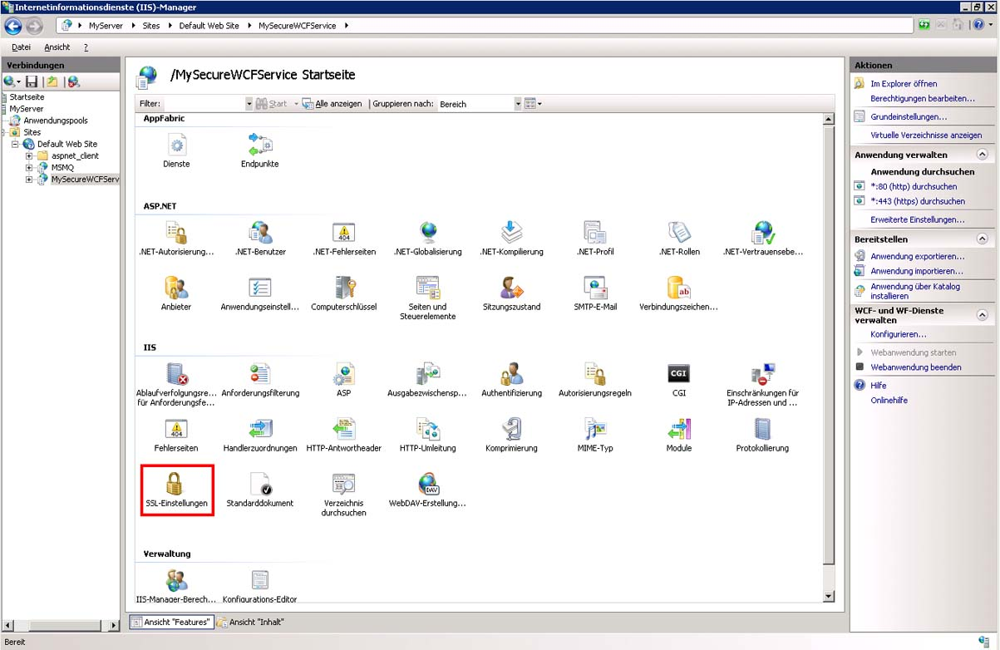
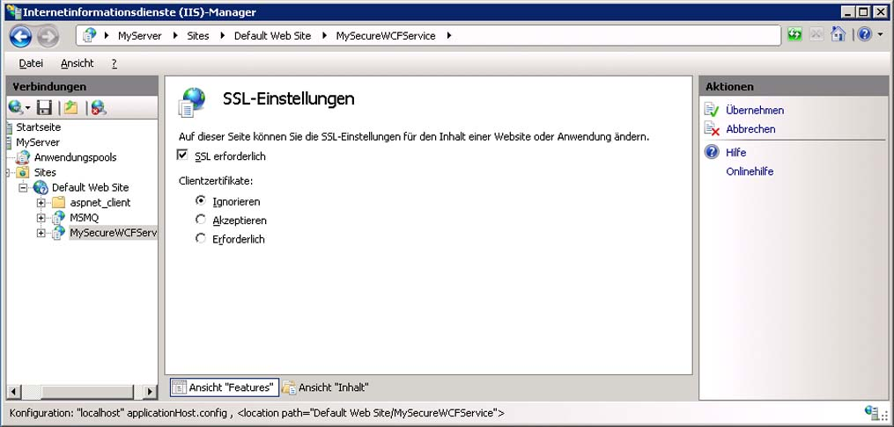

# <a name="how-to-configure-an-iis-hosted-wcf-service-with-ssl"></a><span data-ttu-id="dc61b-103">Vorgehensweise: Konfigurieren eines IIS-gehosteten WCF-Diensts mit SSL</span><span class="sxs-lookup"><span data-stu-id="dc61b-103">How to: Configure an IIS-hosted WCF service with SSL</span></span>
<span data-ttu-id="dc61b-104">In diesem Thema wird beschrieben, wie ein von IIS gehosteter WCF-Dienst für die Verwendung der HTTP-Transportsicherheit eingerichtet wird.</span><span class="sxs-lookup"><span data-stu-id="dc61b-104">This topic describes how to set up an IIS-hosted WCF service to use HTTP transport security.</span></span> <span data-ttu-id="dc61b-105">Die HTTP-Transportsicherheit erfordert für die Registrierung bei IIS ein SSL-Zertifikat.</span><span class="sxs-lookup"><span data-stu-id="dc61b-105">HTTP transport security requires an SSL certificate to be registered with IIS.</span></span> <span data-ttu-id="dc61b-106">Wenn Sie über kein SSL-Zertifikat verfügen, können Sie mit IIS ein Testzertifikat generieren.</span><span class="sxs-lookup"><span data-stu-id="dc61b-106">If you do not have an SSL certificate you can use IIS to generate a test certificate.</span></span> <span data-ttu-id="dc61b-107">Danach müssen Sie der Website eine SSL-Bindung hinzufügen und die Authentifizierungseigenschaften der Website konfigurieren.</span><span class="sxs-lookup"><span data-stu-id="dc61b-107">Next you must add an SSL binding to the web site and configure the web site’s authentication properties.</span></span> <span data-ttu-id="dc61b-108">Abschließend müssen Sie den WCF-Dienst für die Verwendung von HTTPS konfigurieren.</span><span class="sxs-lookup"><span data-stu-id="dc61b-108">Finally you need to configure the WCF service to use HTTPS.</span></span>  
  
### <a name="creating-a-self-signed-certificate"></a><span data-ttu-id="dc61b-109">Erstellen eines selbstsignierten Zertifikats</span><span class="sxs-lookup"><span data-stu-id="dc61b-109">Creating a Self-Signed Certificate</span></span>  
  
1. <span data-ttu-id="dc61b-110">Öffnen Sie den Internetinformationsdienste-Manager (inetmgr.exe), und wählen Sie in der linken Strukturansicht den Computernamen aus.</span><span class="sxs-lookup"><span data-stu-id="dc61b-110">Open Internet Information Services Manager (inetmgr.exe), and select your computer name in the left-hand tree view.</span></span> <span data-ttu-id="dc61b-111">Wählen Sie auf der rechten Seite des Bildschirms Serverzertifikate aus.</span><span class="sxs-lookup"><span data-stu-id="dc61b-111">On the right-hand side of the screen select Server Certificates</span></span>  
  
     <span data-ttu-id="dc61b-112"></span><span class="sxs-lookup"><span data-stu-id="dc61b-112"></span></span>  
  
2. <span data-ttu-id="dc61b-113">Klicken Sie im Fenster Server Zertifikate auf das Feld **selbst signiertes Zertifikat erstellen....**</span><span class="sxs-lookup"><span data-stu-id="dc61b-113">In the Server Certificates window click the **Create Self-Signed Certificate….**</span></span> <span data-ttu-id="dc61b-114">Verknüpfen.</span><span class="sxs-lookup"><span data-stu-id="dc61b-114">Link.</span></span>  
  
     <span data-ttu-id="dc61b-115"></span><span class="sxs-lookup"><span data-stu-id="dc61b-115"></span></span>  
  
3. <span data-ttu-id="dc61b-116">Geben Sie einen anzeigen Amen für das selbst signierte Zertifikat ein, und klicken Sie auf **OK**.</span><span class="sxs-lookup"><span data-stu-id="dc61b-116">Enter a friendly name for the self-signed certificate and click **OK**.</span></span>  
  
     <span data-ttu-id="dc61b-117"></span><span class="sxs-lookup"><span data-stu-id="dc61b-117"></span></span>  
  
     <span data-ttu-id="dc61b-118">Die neu erstellten selbst signierten Zertifikat Details werden nun im Fenster **Server Zertifikate** angezeigt.</span><span class="sxs-lookup"><span data-stu-id="dc61b-118">The newly created self-signed certificate details are now shown in the **Server Certificates** window.</span></span>  
  
     <span data-ttu-id="dc61b-119"></span><span class="sxs-lookup"><span data-stu-id="dc61b-119"></span></span>  
  
     <span data-ttu-id="dc61b-120">Das generierte Zertifikat wird im Speicher für vertrauenswürdige Stammzertifizierungsstellen installiert.</span><span class="sxs-lookup"><span data-stu-id="dc61b-120">The generated certificate is installed in the Trusted Root Certification Authorities store.</span></span>  
  
### <a name="add-ssl-binding"></a><span data-ttu-id="dc61b-121">Hinzufügen einer SSL-Bindung</span><span class="sxs-lookup"><span data-stu-id="dc61b-121">Add SSL Binding</span></span>  
  
1. <span data-ttu-id="dc61b-122">Erweitern Sie in Internetinformationsdienste-Manager den Ordner **Sites** und dann den **Standardordner Website** in der Strukturansicht auf der linken Seite des Bildschirms.</span><span class="sxs-lookup"><span data-stu-id="dc61b-122">Still in Internet Information Services Manager, expand the **Sites** folder and then the **Default Web Site** folder in the tree view on the left-hand side of the screen.</span></span>  
  
2. <span data-ttu-id="dc61b-123">Klicken Sie auf **Bindungen....**</span><span class="sxs-lookup"><span data-stu-id="dc61b-123">Click the **Bindings….**</span></span> <span data-ttu-id="dc61b-124">Link im Abschnitt " **Aktionen** " im oberen rechten Bereich des Fensters.</span><span class="sxs-lookup"><span data-stu-id="dc61b-124">Link in the **Actions** section in the upper right hand portion of the window.</span></span>  
  
     <span data-ttu-id="dc61b-125"></span><span class="sxs-lookup"><span data-stu-id="dc61b-125"></span></span>  
  
3. <span data-ttu-id="dc61b-126">Klicken Sie im Fenster Site Bindungen auf die Schaltfläche **Hinzufügen** .</span><span class="sxs-lookup"><span data-stu-id="dc61b-126">In the Site Bindings window click the **Add** button.</span></span>  
  
     <span data-ttu-id="dc61b-127"></span><span class="sxs-lookup"><span data-stu-id="dc61b-127"></span></span>  
  
4. <span data-ttu-id="dc61b-128">Wählen Sie im Dialogfeld **Site Bindung hinzufügen** HTTPS für den Typ und den anzeigen amen des selbst signierten Zertifikats aus, das Sie soeben erstellt haben.</span><span class="sxs-lookup"><span data-stu-id="dc61b-128">In the **Add Site Binding** dialog, select https for the type and the friendly name of the self-signed certificate you just created.</span></span>  
  
     <span data-ttu-id="dc61b-129"></span><span class="sxs-lookup"><span data-stu-id="dc61b-129"></span></span>  
  
### <a name="configure-virtual-directory-for-ssl"></a><span data-ttu-id="dc61b-130">Konfigurieren eines virtuellen Verzeichnisses für SSL</span><span class="sxs-lookup"><span data-stu-id="dc61b-130">Configure Virtual Directory for SSL</span></span>  
  
1. <span data-ttu-id="dc61b-131">Wählen Sie im Internetinformationsdienste-Manager das virtuelle Verzeichnis aus, das den sicheren WCF-Dienst enthält.</span><span class="sxs-lookup"><span data-stu-id="dc61b-131">Still in Internet Information Services Manager, select the virtual directory that contains your WCF secure service.</span></span>  
  
2. <span data-ttu-id="dc61b-132">Wählen Sie im mittleren Fensterbereich im Abschnitt IIS die Option **SSL-Einstellungen** aus.</span><span class="sxs-lookup"><span data-stu-id="dc61b-132">In the center pane of the window, select **SSL Settings** in the IIS section.</span></span>  
  
     <span data-ttu-id="dc61b-133"></span><span class="sxs-lookup"><span data-stu-id="dc61b-133"></span></span>  
  
3. <span data-ttu-id="dc61b-134">Aktivieren Sie im Bereich SSL-Einstellungen das Kontrollkästchen **SSL erforderlich** , und klicken Sie im Abschnitt **Aktionen** auf der rechten Seite des Bildschirms auf den Link **anwenden** .</span><span class="sxs-lookup"><span data-stu-id="dc61b-134">In the SSL Settings pane, select the **Require SSL** checkbox and click the **Apply** link in the **Actions** section on the right hand side of the screen.</span></span>  
  
     <span data-ttu-id="dc61b-135"></span><span class="sxs-lookup"><span data-stu-id="dc61b-135"></span></span>  
  
### <a name="configure-wcf-service-for-http-transport-security"></a><span data-ttu-id="dc61b-136">Konfigurieren des WCF-Dienstes für HTTP-Transportsicherheit</span><span class="sxs-lookup"><span data-stu-id="dc61b-136">Configure WCF Service for HTTP Transport Security</span></span>  
  
1. <span data-ttu-id="dc61b-137">Konfigurieren Sie in der Datei web.config des WCF-Diensts die HTTP-Bindung für die Verwendung der Transportsicherheit, wie im folgenden XML-Code dargestellt.</span><span class="sxs-lookup"><span data-stu-id="dc61b-137">In the WCF service’s web.config configure the HTTP binding to use transport security as shown in the following XML.</span></span>  
  
    ```xml  
    <bindings>  
          <basicHttpBinding>  
            <binding name="secureHttpBinding">  
              <security mode="Transport">  
                <transport clientCredentialType="None"/>  
              </security>  
            </binding>  
          </basicHttpBinding>  
    </bindings>  
    ```  
  
2. <span data-ttu-id="dc61b-138">Geben Sie den Dienst und Dienstendpunkt an, wie im folgenden XML-Code gezeigt.</span><span class="sxs-lookup"><span data-stu-id="dc61b-138">Specify your service and service endpoint as shown in the following XML.</span></span>  
  
    ```xml  
    <services>  
          <service name="MySecureWCFService.Service1">  
            <endpoint address=""  
                      binding="basicHttpBinding"  
                      bindingConfiguration="secureHttpBinding"  
                      contract="MySecureWCFService.IService1"/>  
  
            <endpoint address="mex"  
                      binding="mexHttpsBinding"  
                      contract="IMetadataExchange" />  
          </service>  
    </services>  
    ```  
  
## <a name="example"></a><span data-ttu-id="dc61b-139">Beispiel</span><span class="sxs-lookup"><span data-stu-id="dc61b-139">Example</span></span>  
 <span data-ttu-id="dc61b-140">Im Folgenden finden Sie ein vollständiges Beispiel für die Datei web.config eines WCF-Diensts, der HTTP-Transportsicherheit verwendet.</span><span class="sxs-lookup"><span data-stu-id="dc61b-140">The following is a complete example of a web.config file for a WCF service using HTTP transport security</span></span>  
  
```xml  
<?xml version="1.0"?>  
<configuration>  
  
  <system.web>  
    <compilation debug="true" targetFramework="4.0" />  
  </system.web>  
  <system.serviceModel>  
    <services>  
      <service name="MySecureWCFService.Service1">  
        <endpoint address=""  
                  binding="basicHttpBinding"  
                  bindingConfiguration="secureHttpBinding"  
                  contract="MySecureWCFService.IService1"/>  
  
        <endpoint address="mex"  
                  binding="mexHttpsBinding"  
                  contract="IMetadataExchange" />  
      </service>  
    </services>  
    <bindings>  
      <basicHttpBinding>  
        <binding name="secureHttpBinding">  
          <security mode="Transport">  
            <transport clientCredentialType="None"/>  
          </security>  
        </binding>  
      </basicHttpBinding>  
    </bindings>  
    <behaviors>  
      <serviceBehaviors>  
        <behavior>  
          <!-- To avoid disclosing metadata information, set the value below to false and remove the metadata endpoint above before deployment -->  
          <serviceMetadata httpsGetEnabled="true"/>  
          <!-- To receive exception details in faults for debugging purposes, set the value below to true.  Set to false before deployment to avoid disclosing exception information -->  
          <serviceDebug includeExceptionDetailInFaults="false"/>  
        </behavior>  
      </serviceBehaviors>  
    </behaviors>  
    <serviceHostingEnvironment multipleSiteBindingsEnabled="true" />  
  </system.serviceModel>  
  <system.webServer>  
    <modules runAllManagedModulesForAllRequests="true"/>  
  </system.webServer>  
  
</configuration>  
```  
  
## <a name="see-also"></a><span data-ttu-id="dc61b-141">Weitere Informationen</span><span class="sxs-lookup"><span data-stu-id="dc61b-141">See also</span></span>

- [<span data-ttu-id="dc61b-142">Hosten in Internetinformationsdiensten</span><span class="sxs-lookup"><span data-stu-id="dc61b-142">Hosting in Internet Information Services</span></span>](hosting-in-internet-information-services.md)
- [<span data-ttu-id="dc61b-143">Hostinganweisungen des Internetinformationsdiensts</span><span class="sxs-lookup"><span data-stu-id="dc61b-143">Internet Information Service Hosting Instructions</span></span>](../samples/internet-information-service-hosting-instructions.md)
- [<span data-ttu-id="dc61b-144">Empfohlene Vorgehensweisen für das Hosten in Internetinformationsdiensten</span><span class="sxs-lookup"><span data-stu-id="dc61b-144">Internet Information Services Hosting Best Practices</span></span>](internet-information-services-hosting-best-practices.md)
- [<span data-ttu-id="dc61b-145">IIS-Hosting mithilfe von Inlinecode</span><span class="sxs-lookup"><span data-stu-id="dc61b-145">IIS Hosting Using Inline Code</span></span>](../samples/iis-hosting-using-inline-code.md)
