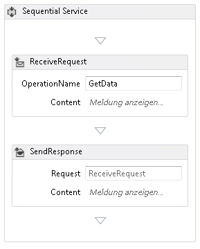
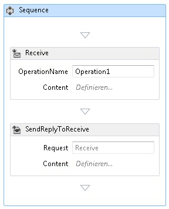
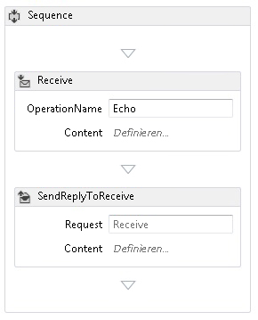
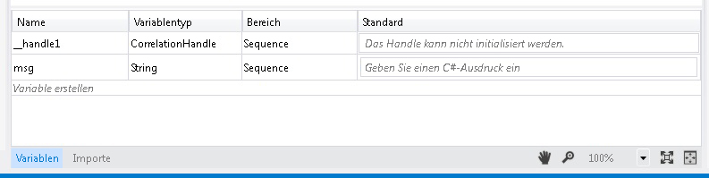
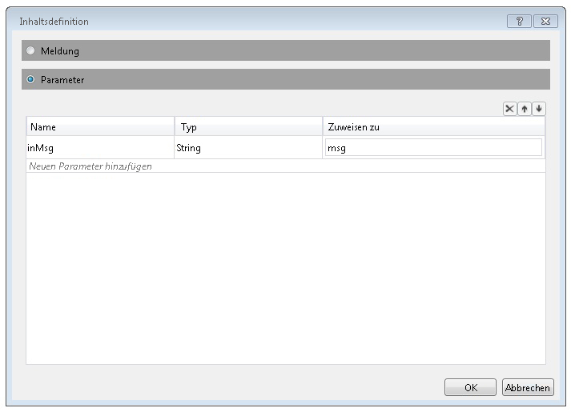
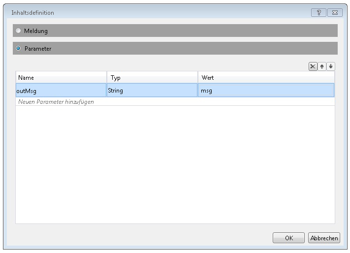
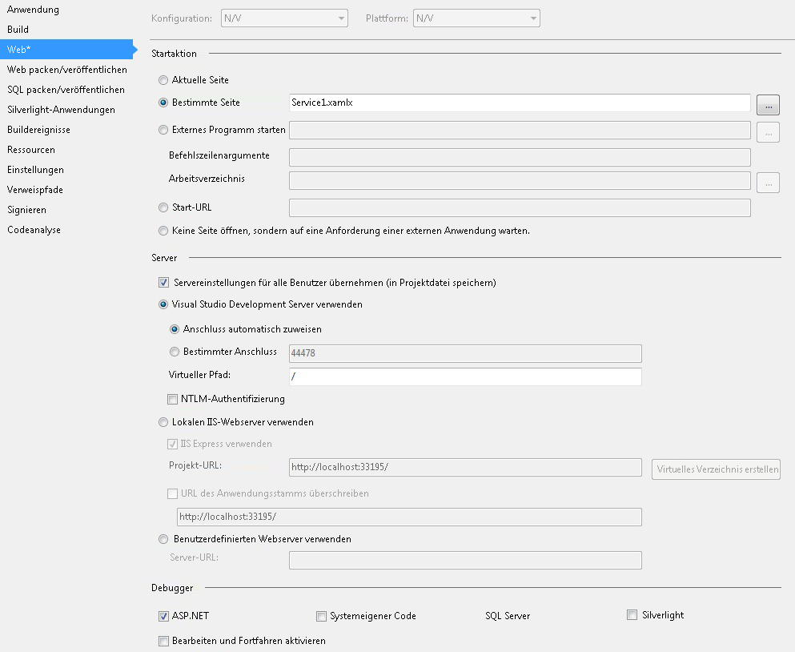

# Vorgehensweise: Erstellen eines Workflowdiensts mit MessagingaktivitätenHow to: Create a Workflow Service with Messaging Activities
In diesem Thema wird beschrieben, wie Sie mithilfe der Messagingaktivitäten einen einfachen Workflowdienst erstellen.This topic describes how to create a simple workflow service using messaging activities. Der Schwerpunkt des Themas liegt auf der Mechanik zum Erstellen eines Workflowdiensts. Der Dienst besteht ausschließlich aus Messagingaktivitäten.This topic focuses on the mechanics of creating a workflow service where the service consists solely of messaging activities. In einem realen Dienst enthält der Workflow noch viele andere Aktivitäten.In a real-world service, the workflow contains many other activities. Der Dienst implementiert einen Vorgang mit dem Namen "Echo", der eine Zeichenfolge verwendet und diese an den Aufrufer zurückgibt.The service implements one operation called Echo, which takes a string and returns the string to the caller. Dieses Thema ist das erste von zwei Themen, die zusammengehören.This topic is the first in a series of two topics. Im nächsten Thema [Vorgehensweise: Zugreifen auf einen Dienst aus einer Workflowanwendung](../../../../docs/framework/wcf/feature-details/how-to-access-a-service-from-a-workflow-application.md) erläutert, wie eine workflowanwendung erstellen, die den in diesem Thema erstellten Dienst aufrufen kann.The next topic [How To: Access a Service From a Workflow Application](../../../../docs/framework/wcf/feature-details/how-to-access-a-service-from-a-workflow-application.md) discusses how to create a workflow application that can call the service created in this topic.  
  
### So erstellen Sie ein WorkflowdienstprojektTo create a workflow service project  
  
1.  Starten Sie [!INCLUDE[vs_current_long](../../../../includes/vs-current-long-md.md)].Start [!INCLUDE[vs_current_long](../../../../includes/vs-current-long-md.md)].  
  
2.  Klicken Sie auf die **Datei** klicken Sie im Menü **neu**, und klicken Sie dann **Projekt** zum Anzeigen der **Dialogfeld "Neues Projekt"**.Click the **File** menu, select **New**, and then **Project** to display the **New Project Dialog**. Wählen Sie **Workflow** aus der Liste der installierten Vorlagen und **WCF-Workflowdienstanwendung** aus der Liste der Projekttypen zur Verfügung.Select **Workflow** from the list of installed templates and **WCF Workflow Service Application** from the list of project types. Nennen Sie das Projekt `MyWFService` und verwenden Sie den Standardspeicherort, wie in der folgenden Abbildung dargestellt.Name the project `MyWFService` and use the default location as shown in the following illustration.  
  
     Klicken Sie auf die **OK** Schaltfläche beim Schließen der **Dialogfeld "Neues Projekt"**.Click the **OK** button to dismiss the **New Project Dialog**.  
  
3.  Nachdem das Projekt erstellt wurde, wird die Datei "Service1.xamlx" im Designer geöffnet. Dies ist in der folgenden Abbildung dargestellt.When the project is created, the Service1.xamlx file is opened in the designer as shown in the following illustration.  
  
       
  
     Mit der rechten Maustaste in der Aktivität, die mit der Bezeichnung **sequenzieller Dienst** , und wählen Sie **löschen**.Right-click the activity labeled **Sequential Service** and select **Delete**.  
  
### So implementiert Sie den WorkflowdienstTo implement the workflow service  
  
1.  Wählen Sie die **Toolbox** Registerkarte auf der linken Seite des Bildschirms, um die Toolbox anzuzeigen, und klicken Sie auf das Pinsymbol, damit das Fenster geöffnet bleibt.Select the **Toolbox** tab on the left side of the screen to display the toolbox and click the pushpin to keep the window open. Erweitern Sie die **Messaging** Abschnitt der Toolbox, um die messagingaktivitäten und die Vorlagen für messagingaktivitäten anzuzeigen, wie in der folgenden Abbildung dargestellt.Expand the **Messaging** section of the toolbox to display the messaging activities and the messaging activity templates as shown in the following illustration.  
  
       
  
2.  Drag & drop eine **ReceiveAndSendReply** Vorlage in den Workflowdesigner.Drag and drop a **ReceiveAndSendReply** template to the workflow designer. Erstellt eine <!--zz <xref:System.ServiceModel.Activities.Sequence>--> `System.ServiceModel.Activities.Sequence` Aktivität mit dem eine **empfangen** -Aktivität gefolgt von einer <xref:System.ServiceModel.Activities.SendReply> Aktivität wie in der folgenden Abbildung dargestellt.This creates a <!--zz <xref:System.ServiceModel.Activities.Sequence>--> `System.ServiceModel.Activities.Sequence` activity with a **Receive** activity followed by a <xref:System.ServiceModel.Activities.SendReply> activity as shown in the following illustration.  
  
       
  
     Beachten Sie, dass die <xref:System.ServiceModel.Activities.SendReply>-Eigenschaft der <xref:System.ServiceModel.Activities.SendReply.Request%2A>-Aktivität auf `Receive` festgelegt ist, also auf den Namen der <xref:System.ServiceModel.Activities.Receive>-Aktivität, auf die die <xref:System.ServiceModel.Activities.SendReply>-Aktivität antwortet.Notice that the <xref:System.ServiceModel.Activities.SendReply> activity’s <xref:System.ServiceModel.Activities.SendReply.Request%2A> property is set to `Receive`, the name of the <xref:System.ServiceModel.Activities.Receive> activity to which the <xref:System.ServiceModel.Activities.SendReply> activity is replying.  
  
3.  In der <xref:System.ServiceModel.Activities.Receive> Aktivitätstyp `Echo` in das Textfeld mit der Bezeichnung **OperationName**.In the <xref:System.ServiceModel.Activities.Receive> activity type `Echo` into the textbox labeled **OperationName**. Dadurch wird der Name des Vorgangs definiert, den der Dienst implementiert.This defines the name of the operation the service implements.  
  
       
  
4.  Mit der <xref:System.ServiceModel.Activities.Receive> Aktivität ausgewählt, um das Eigenschaftenfenster zu öffnen, wenn nicht bereits geöffnet, indem Sie auf die **Ansicht** Menü- und Auswählen von **Fenster "Eigenschaften"**.With the <xref:System.ServiceModel.Activities.Receive> activity selected, open the properties window if not already open by clicking the **View** menu and selecting **Properties Window**. In der **Fenster "Eigenschaften"** einen Bildlauf nach unten, bis Sie finden Sie unter **CanCreateInstance** , und klicken Sie auf das Kontrollkästchen, wie in der folgenden Abbildung dargestellt.In the **Properties Window** scroll down until you see **CanCreateInstance** and click the checkbox as shown in the following illustration. Mit dieser Einstellung wird es dem Workflowdiensthost ermöglicht, (bei Bedarf) eine neue Instanz des Diensts zu erstellen, wenn eine Meldung empfangen wird.This setting enables the workflow service host to create a new instance of the service (if needed) when a message is received.  
  
       
  
5.  Wählen Sie die <!--zz <xref:System.ServiceModel.Activities.Sequence>--> `System.ServiceModel.Activities.Sequence` Aktivität, und klicken Sie auf die **Variablen** Schaltfläche in der unteren linken Ecke des Designers.Select the <!--zz <xref:System.ServiceModel.Activities.Sequence>--> `System.ServiceModel.Activities.Sequence` activity and click the **Variables** button in the lower left corner of the designer. Der Variablen-Editor wird angezeigt.This displays the variables editor. Klicken Sie auf die **Variable erstellen** Link, um eine Variable zum Speichern der Zeichenfolge, die gesendet, um den Vorgang hinzuzufügen.Click the **Create Variable** link to add a variable to store the string sent to the operation. Benennen Sie die Variable `msg` und legen Sie dessen **Variable** Geben Sie in eine Zeichenfolge, wie in der folgenden Abbildung dargestellt.Name the variable `msg` and set its **Variable** type to String as shown in the following illustration.  
  
       
  
     Klicken Sie auf die **Variablen** Schaltfläche erneut aus, um den Variablen-Editor zu schließen.Click the **Variables** button again to close the variables editor.  
  
6.  Klicken Sie auf die **definieren...**Click the **Define..** Link der **Inhalt** Textfeld in der <xref:System.ServiceModel.Activities.Receive> Aktivität zum Anzeigen der **Inhaltsdefinition** Dialogfeld.link in the **Content** text box in the <xref:System.ServiceModel.Activities.Receive> activity to display the **Content Definition** dialog. Wählen Sie die **Parameter** Optionsfeld, klicken Sie auf die **hinzufügen neuen Parameter** verknüpfen möchten, geben Sie `inMsg` in der **Namen** wählen Sie im Textfeld **Zeichenfolge**in der **Typ** Dropdown-Listenfeld, und geben `msg` in der **zuordnen zu** Textfeld wie in der folgenden Abbildung dargestellt.Select the **Parameters** radio button, click the **Add new Parameter** link, type `inMsg` in the **name** text box, select **String** in the **Type** drop down list box, and type `msg` in the **Assign To** text box as shown in the following illustration.  
  
       
  
     Dadurch wird angegeben, dass die Empfangsaktivität Zeichenfolgenparameter empfängt und dass diese Daten an die `msg`-Variable gebunden werden.This specifies that the Receive activity receives string parameter and that data is bound to the `msg` variable. Klicken Sie auf **OK** schließen die **Inhaltsdefinition** Dialogfeld.Click **OK** to close the **Content Definition** dialog.  
  
7.  Klicken Sie auf die **definieren...**  link die **Content** im Feld der <xref:System.ServiceModel.Activities.SendReply> Aktivität zum Anzeigen der **Inhaltsdefinition** Dialogfeld.Click the **Define...** link in the **Content** box in the <xref:System.ServiceModel.Activities.SendReply> activity to display the **Content Definition** dialog. Wählen Sie die **Parameter** Optionsfeld, klicken Sie auf die **hinzufügen neuen Parameter** verknüpfen möchten, geben Sie `outMsg` in der **Namen** Textfeld, wählen **Zeichenfolge**in der **Typ** im Dropdown-Listenfeld und `msg` in der **Wert** Textfeld wie in der folgenden Abbildung dargestellt.Select the **Parameters** radio button, click the **Add new Parameter** link, type `outMsg` in the **name** textbox, select **String** in the **Type** dropdown list box, and `msg` in the **Value** text box as shown in the following illustration.  
  
       
  
     Dadurch wird angegeben, dass die <xref:System.ServiceModel.Activities.SendReply>-Aktivität eine Nachricht oder einen Nachrichtenvertragstyp sendet und dass die Daten an die `msg`-Variable gebunden werden.This specifies that the <xref:System.ServiceModel.Activities.SendReply> activity sends a message or message contract type and that data is bound to the `msg` variable. Da dies eine <xref:System.ServiceModel.Activities.SendReply>-Aktivität ist, werden die Daten von `msg` verwendet, um die von der Aktivität an den Client zurückgesendete Nachricht aufzufüllen.Because this is a <xref:System.ServiceModel.Activities.SendReply> activity, this means the data in `msg` is used to populate the message the activity sends back to the client. Klicken Sie auf **OK** schließen die **Inhaltsdefinition** Dialogfeld.Click **OK** to close the **Content Definition** dialog.  
  
8.  Speichern und erstellen Sie die Projektmappe, indem Sie auf die **erstellen** Menü- und Auswählen von **Projektmappe**.Save and build the solution by clicking the **Build** menu and selecting **Build Solution**.  
  
## Konfigurieren des WorkflowdienstprojektsConfigure the Workflow Service Project  
 Der Workflowdienst wurde abgeschlossen.The workflow service is complete. In diesem Abschnitt wird erklärt, wie Sie die Workflowdienstprojektmappe so konfigurieren, dass sie auf einfache Weise gehostet und ausgeführt werden kann.This section explains how to configure the workflow service solution to make it easy to host and run. Diese Projektmappe verwendet den ASP.NET Development Server zum Hosten des Diensts.This solution uses the ASP.NET Development Server to host the service.  
  
#### So legen Sie Projektstartoptionen festTo set project start up options  
  
1.  In der **Projektmappen-Explorer**, mit der rechten Maustaste **MyWFService** , und wählen Sie **Eigenschaften** zum Anzeigen der **Projekteigenschaften** Dialogfeld.In the **Solution Explorer**, right-click **MyWFService** and select **Properties** to display the **Project Properties** dialog.  
  
2.  Wählen Sie die **Web** Registerkarte, und wählen Sie **bestimmte Seite** unter **Startaktion** und Typ `Service1.xamlx` in das Textfeld ein, wie in der folgenden Abbildung dargestellt.Select the **Web** tab and select **Specific Page** under **Start Action** and type `Service1.xamlx` in the text box as shown in the following illustration.  
  
       
  
     Der in "Service1.xamlx" definierte Dienst wird dann unter ASP.NET Development Server gehostet.This hosts the service defined in Service1.xamlx in the ASP.NET Development Server.  
  
3.  Drücken Sie STRG+F5, um den Dienst zu starten.Press Ctrl + F5 to launch the service. Das Symbol "ASP.NET Development Server" wird in der unteren rechten Ecke des Desktops angezeigt. Dies ist in der folgenden Abbildung dargestellt.The ASP.NET Development Server icon is displayed in the lower right side of the desktop as shown in the following image.  
  
       
  
     Außerdem zeigt Internet Explorer für den Dienst die Hilfeseite für WCF-Dienste an.In addition, Internet Explorer displays the WCF Service Help Page for the service.  
  
       
  
4.  Fortfahren mit dem [Vorgehensweise: Zugreifen auf einen Dienst aus einer Workflowanwendung](../../../../docs/framework/wcf/feature-details/how-to-access-a-service-from-a-workflow-application.md) Thema, um einen workflowclient zu erstellen, die diesen Dienst aufruft.Continue on to the [How To: Access a Service From a Workflow Application](../../../../docs/framework/wcf/feature-details/how-to-access-a-service-from-a-workflow-application.md) topic to create a workflow client that calls this service.  
  
## Siehe auchSee Also  
 [WorkflowdiensteWorkflow Services](../../../../docs/framework/wcf/feature-details/workflow-services.md)  
 [Übersicht über Hosting WorkflowdiensteHosting Workflow Services Overview](../../../../docs/framework/wcf/feature-details/hosting-workflow-services-overview.md)  
 [MessagingaktivitätenMessaging Activities](../../../../docs/framework/wcf/feature-details/messaging-activities.md)
