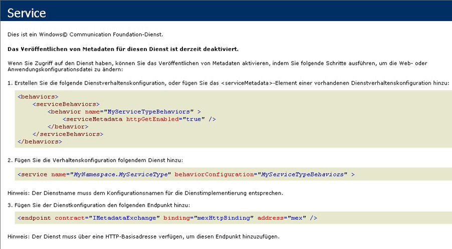

# <a name="how-to-host-a-non-service-workflow-in-iis"></a>Vorgehensweise: Hosten eines Nicht-Dienstworkflows in IIS
Workflows, die keine Workflowdienste darstellen, können unter IIS/WAS gehostet werden. Dies ist hilfreich, wenn ein Workflow gehostet werden muss, der von einem anderen Benutzer geschrieben wurde. Beispiel: Der Workflow-Designer wird erneut gehostet, und Benutzer können eigene Workflows erstellen.  Durch das Hosten eines Workflows in IIS, bei dem es sich nicht um einen Dienstworkflow handelt, wird Unterstützung für Funktionen wie die Prozesswiederverwendung, das Herunterfahren der Anwendung und ihrer Dienste bei Leerlauf, die Prozessüberwachung und die meldungsbasierte Aktivierung bereitgestellt. Workflowdienste, die in IIS gehostet werden, enthalten <xref:System.ServiceModel.Activities.Receive>-Aktivitäten und werden beim Empfang einer Meldung durch IIS aktiviert. Workflows, die keine Dienstworkflows sind, enthalten keine Messagingaktivitäten und können standardmäßig nicht durch Senden einer Meldung aktiviert werden.  Um eine Instanz des Workflows zu erstellen, müssen Sie eine Klasse von <xref:System.ServiceModel.Activities.WorkflowHostingEndpoint> ableiten und einen Dienstvertrag mit Vorgängen erstellen. Dieses Thema führt Sie durch das Erstellen eines einfachen Workflows, definieren einen Dienstvertrag, ein Client verwenden kann, um den Workflow zu aktivieren, und Ableiten einer Klasse von <xref:System.ServiceModel.Activities.WorkflowHostingEndpoint> verwendet den Dienstvertrag für Workflow Erstellen von Anforderungen zu lauschen.  
  
### <a name="create-a-simple-workflow"></a>Erstellen eines einfachen Workflows  
  
1.  Erstellen Sie eine neue leere [!INCLUDE[vs_current_long](../../../../includes/vs-current-long-md.md)]-Projektmappe mit dem Namen `CreationEndpointTest`.  
  
2.  Fügen Sie der Projektmappe ein neues Projekt für eine WCF-Workflowdienstanwendung mit dem Namen `SimpleWorkflow` hinzu. Der Workflow-Designer wird geöffnet.  
  
3.  Löschen Sie die ReceiveRequest-Aktivität und die SendResponse-Aktivität. Durch diese Aktivitäten wird aus einem Workflow ein Workflowdienst. Da im vorliegenden Fall nicht mit einem Workflowdienst gearbeitet wird, sind sie nicht länger erforderlich.  
  
4.  Legen Sie den DisplayName für die Sequenzaktivität auf "Sequenzieller Workflow".  
  
5.  Benennen Sie Service1.xamlx in Workflow1.xamlx um.  
  
6.  Klicken Sie auf den Designer außerhalb der Sequenzaktivität, und legen Sie die Eigenschaften "Name" und "ConfigurationName" auf "Workflow1"fest.  
  
7.  Ziehen Sie eine <xref:System.Activities.Statements.WriteLine>-Aktivität in die <xref:System.Activities.Statements.Sequence>. Die <xref:System.Activities.Statements.WriteLine> -Aktivität befindet sich der **primitive** Abschnitt der Toolbox. Festlegen der <xref:System.Activities.Statements.WriteLine.Text%2A> Eigenschaft von der <xref:System.Activities.Statements.WriteLine> Aktivität "Hello, World".  
  
     Der Workflow sollte jetzt wie das folgende Diagramm aussehen.  
  
       
  
### <a name="create-the-workflow-creation-service-contract"></a>Erstellen des Dienstvertrags für die Workflowerstellung  
  
1.  Fügen Sie der Projektmappe `Shared` das neue Klassenbibliotheksprojekt `CreationEndpointTest` hinzu.  
  
2.  Fügen Sie dem Projekt `Shared` Verweise auf System.ServiceModel.dll, System.Configuration und System.ServiceModel.Activities hinzu.  
  
3.  Benennen Sie die Datei Class1.cs in IWorkflowCreation.cs um, und fügen Sie der Datei folgenden Code hinzu:  
  
    ```  
    using System;  
    using System.Collections.Generic;  
    using System.Linq;  
    using System.Text;  
    using System.ServiceModel;  
  
    namespace Shared  
    {  
        //service contract exposed from the endpoint  
        [ServiceContract(Name = "IWorkflowCreation")]  
        public interface IWorkflowCreation  
        {  
            [OperationContract(Name = "Create")]  
            Guid Create(IDictionary<string, object> inputs);  
  
            [OperationContract(Name = "CreateWithInstanceId", IsOneWay = true)]  
            void CreateWithInstanceId(IDictionary<string, object> inputs, Guid instanceId);  
        }  
    }  
    ```  
  
     Mit diesem Vertrag werden zwei Vorgänge definiert, mit denen jeweils eine neue Instanz des soeben erstellten Workflows erstellt wird, der kein Dienstworkflow ist. Während in dem einem Vorgang eine neue Instanz mit einer generierten Instanz-ID erstellt wird, können Sie die Instanz-ID für die neue Workflowinstanz in dem anderen Vorgang selbst angeben.  Beide Methoden ermöglichen das Übergeben von Parametern an die neue Workflowinstanz. Dieser Vertrag wird verfügbar gemacht werden, indem die <xref:System.ServiceModel.Activities.WorkflowHostingEndpoint> damit Clients neue Instanzen eines nicht-Workflows erstellen können.  
  
### <a name="derive-a-class-from-workflowhostingendpoint"></a>Ableiten einer Klasse von WorkflowHostingEndpoint  
  
1.  Fügen Sie eine neue Klasse namens `CreationEndpoint` abgeleitet <xref:System.ServiceModel.Activities.WorkflowHostingEndpoint> auf die `Shared` Projekt.  
  
    ```  
    using System;  
    using System.Collections.Generic;  
    using System.Diagnostics;  
    using System.Globalization;  
    using System.ServiceModel;  
    using System.ServiceModel.Activities;  
    using System.ServiceModel.Channels;  
  
    namespace Shared  
    {  
        public class CreationEndpoint : WorkflowHostingEndpoint  
        {  
        }  
    }  
    ```  
  
2.  Fügen Sie der <xref:System.Uri>-Klasse die lokale statische `defaultBaseUri`-Variable mit dem Namen `CreationEndpoint` hinzu.  
  
    ```  
    public class CreationEndpoint : WorkflowHostingEndpoint  
    {  
        static Uri defaultBaseUri;  
    }  
    ```  
  
3.  Fügen Sie der `CreationEndpoint`-Klasse den folgenden Konstruktor hinzu. Beachten Sie, dass der `IWorkflowCreation`-Dienstvertrag im Aufruf des Basiskonstruktors angegeben wird.  
  
    ```  
    public CreationEndpoint(Binding binding, EndpointAddress address)  
       : base(typeof(IWorkflowCreation), binding, address)  
       {  
       }  
    ```  
  
4.  Fügen Sie der `CreationEndpoint`-Klasse den folgenden Standardkonstruktor hinzu.  
  
    ```  
    public CreationEndpoint()  
       : this(GetDefaultBinding(),  
       new EndpointAddress(new Uri(DefaultBaseUri, new Uri(Guid.NewGuid().ToString(), UriKind.Relative))))  
       {  
       }  
    ```  
  
5.  Fügen Sie der `DefaultBaseUri`-Klasse eine statische `CreationEndpoint`-Eigenschaft hinzu. Diese Eigenschaft enthält einen standardmäßigen Basis-URI, sofern keiner angegeben wurde.  
  
    ```  
    static Uri DefaultBaseUri  
    {  
       get  
       {  
          if (defaultBaseUri == null)  
          {  
             defaultBaseUri = new Uri(string.Format(CultureInfo.InvariantCulture, "net.pipe://localhost/workflowCreationEndpoint/{0}/{1}",  
                Process.GetCurrentProcess().Id,  
                AppDomain.CurrentDomain.Id));  
          }  
          return defaultBaseUri;  
       }  
     }  
    ```  
  
6.  Erstellen Sie die folgende Methode, um die Standardbindung für den Erstellungsendpunkt abzurufen.  
  
    ```  
    //defaults to NetNamedPipeBinding  
    public static Binding GetDefaultBinding()  
    {  
       return new NetNamedPipeBinding(NetNamedPipeSecurityMode.None) { TransactionFlow = true };  
    }  
    ```  
  
7.  Überschreiben Sie die <xref:System.ServiceModel.Activities.WorkflowHostingEndpoint.OnGetInstanceId%2A>-Methode, um die Instanz-ID für den Workflow zurückzugeben. Wenn die `Action` Header endet mit "Create" eine leere GUID zurück, wenn die `Action` Header mit die GUID, die an die Methode übergebenen "CreateWithInstanceId" endet. Andernfalls wird eine <xref:System.InvalidOperationException> ausgelöst. Diese `Action`-Header entsprechen den beiden Vorgängen, die im `IWorkflowCreation`-Dienstvertrag definiert sind.  
  
    ```  
    protected override Guid OnGetInstanceId(object[] inputs, OperationContext operationContext)  
    {  
       //Create was called by client  
       if (operationContext.IncomingMessageHeaders.Action.EndsWith("Create"))  
       {  
          return Guid.Empty;  
       }  
       //CreateWithInstanceId was called by client  
       else if (operationContext.IncomingMessageHeaders.Action.EndsWith("CreateWithInstanceId"))  
       {  
          return (Guid)inputs[1];  
       }  
       else  
       {  
          throw new InvalidOperationException("Invalid Action: " + operationContext.IncomingMessageHeaders.Action);  
       }  
    }  
    ```  
  
8.  Überschreiben Sie die <xref:System.ServiceModel.Activities.WorkflowHostingEndpoint.OnGetCreationContext%2A>-Methode, um einen <xref:System.ServiceModel.Activities.WorkflowCreationContext> zu erstellen. Fügen Sie Argumente für den Workflow hinzu, senden Sie die Instanz-ID an den Client, und geben Sie den <xref:System.ServiceModel.Activities.WorkflowCreationContext> zurück.  
  
    ```  
    protected override WorkflowCreationContext OnGetCreationContext(object[] inputs, OperationContext operationContext, Guid instanceId, WorkflowHostingResponseContext responseContext)  
    {  
       WorkflowCreationContext creationContext = new WorkflowCreationContext();  
       if (operationContext.IncomingMessageHeaders.Action.EndsWith("Create") || (operationContext.IncomingMessageHeaders.Action.EndsWith("CreateWithInstanceId")))  
       {  
          Dictionary<string, object> arguments = (Dictionary<string, object>)inputs[0];  
          if (arguments != null && arguments.Count > 0)  
          {  
             foreach (KeyValuePair<string, object> pair in arguments)  
             {  
                //arguments to pass to the workflow  
                creationContext.WorkflowArguments.Add(pair.Key, pair.Value);  
             }  
          }  
          //reply to client with instanceId  
          responseContext.SendResponse(instanceId, null);  
       }  
       else  
       {  
          throw new InvalidOperationException("Invalid Action: " + operationContext.IncomingMessageHeaders.Action);  
       }  
       return creationContext;  
    }  
    ```  
  
### <a name="create-a-standard-endpoint-element-to-allow-you-to-configure-the-workflowcreationendpoint"></a>Erstellen eines Standardendpunktelements zum Konfigurieren des WorkflowCreationEndpoint  
  
1.  Fügen Sie dem Projekt `CreationEndpoint` einen Verweis auf Shared hinzu.  
  
2.  Fügen Sie dem Projekt `CreationEndpointElement` die neue <xref:System.ServiceModel.Configuration.StandardEndpointElement>-Klasse hinzu, die von `CreationEndpoint` abgeleitet wurde. Diese Klasse stellt einen `CreationEndpoint` in einer web.config-Datei dar.  
  
    ```  
    using System;  
    using System.Configuration;  
    using System.ServiceModel.Activities;  
    using System.ServiceModel.Configuration;  
    using System.ServiceModel.Description;  
    using Shared;  
  
    namespace CreationEndpointTest  
    {  
        //config element for CreationEndpoint  
        public class CreationEndpointElement : StandardEndpointElement  
        {  
       }  
    ```  
  
3.  Fügen Sie die `EndpointType`-Eigenschaft hinzu, um den Typ des Endpunkts zurückzugeben.  
  
    ```  
    protected override Type EndpointType  
    {  
       get { return typeof(CreationEndpoint); }  
    }  
    ```  
  
4.  Überschreiben Sie die <xref:System.ServiceModel.Configuration.StandardEndpointElement.CreateServiceEndpoint%2A>-Methode, und geben Sie einen neuen `CreationEndpoint` zurück.  
  
    ```  
    protected override ServiceEndpoint CreateServiceEndpoint(ContractDescription contractDescription)  
    {  
       return new CreationEndpoint();  
    }  
    ```  
  
5.  Überladen Sie die folgenden Methoden: <xref:System.ServiceModel.Configuration.StandardEndpointElement.OnApplyConfiguration%2A>, <xref:System.ServiceModel.Configuration.StandardEndpointElement.OnApplyConfiguration%2A>, <xref:System.ServiceModel.Configuration.StandardEndpointElement.OnInitializeAndValidate%2A> und <xref:System.ServiceModel.Configuration.StandardEndpointElement.OnInitializeAndValidate%2A>. Diese Methoden müssen lediglich definiert werden; es ist nicht erforderlich, Code hinzuzufügen.  
  
    ```  
    protected override void OnApplyConfiguration(ServiceEndpoint endpoint, ChannelEndpointElement channelEndpointElement)  
    {  
    }  
  
    protected override void OnApplyConfiguration(ServiceEndpoint endpoint, ServiceEndpointElement serviceEndpointElement)  
    {  
    }  
  
    protected override void OnInitializeAndValidate(ChannelEndpointElement channelEndpointElement)  
    {  
    }  
  
    protected override void OnInitializeAndValidate(ServiceEndpointElement serviceEndpointElement)  
    {  
    }  
    ```  
  
6.  Fügen Sie der Datei CreationEndpointElement.cs im Projekt `CreationEndpoint` die Auflistungsklasse für `CreationEndpoint` hinzu. Diese Klasse wird von der Konfiguration für eine Reihe von `CreationEndpoint`-Instanzen in einer web.config-Datei verwendet.  
  
    ```  
    public class CreationEndpointCollection : StandardEndpointCollectionElement<CreationEndpoint, CreationEndpointElement>  
    {  
    }  
    ```  
  
7.  Erstellen Sie die Projektmappe.  
  
### <a name="host-the-workflow-in-iis"></a>Hosten des Workflows in IIS  
  
1.  Erstellen Sie in IIS die neue Anwendung `MyCreationEndpoint`.  
  
2.  Kopieren Sie die Datei workflow1.xaml, die vom Workflow-Designer generiert wurde, in das Anwendungsverzeichnis, und benennen Sie sie in workflow1.xamlx um.  
  
3.  Kopieren Sie die Datei shared.dll und die Datei CreationEndpoint.dll in das BIN-Verzeichnis der Anwendung (ggf. müssen Sie das Verzeichnis zunächst erstellen).  
  
4.  Ersetzen Sie den Inhalt der web.config-Datei im Projekt `CreationEndpoint` durch folgenden Code.  
  
    ```xaml  
    <?xml version="1.0" encoding="utf-8" ?>  
    <configuration>  
      <system.web>  
        <compilation debug="true" targetFramework="4.0" />  
      </system.web>   
    </configuration>  
    ```  
  
5.  Registrieren Sie den `<system.web>` nach dem `CreationEndpoint`-Element durch Hinzufügen des folgenden Konfigurationscodes.  
  
    ```xml  
    <system.serviceModel>  
        <!--register CreationEndpoint-->  
        <serviceHostingEnvironment multipleSiteBindingsEnabled="true" />  
        <extensions>  
          <endpointExtensions>  
            <add name="creationEndpoint" type="CreationEndpointTest.CreationEndpointCollection, CreationEndpoint, Version=1.0.0.0, Culture=neutral, PublicKeyToken=null" />  
          </endpointExtensions>  
        </extensions>  
    </system.serviceModel>  
    ```  
  
     Dadurch wird die `CreationEndpointCollection`-Klasse registriert, und Sie können einen `CreationEndpoint` in einer web.config-Datei konfigurieren.  
  
6.  Hinzufügen einer `<service>` Element (nach der \</extensions > Tag) mit einem `CreationEndpoint` , um eingehende Nachrichten zu lauschen.  
  
    ```xml  
    <services>  
          <!-- add endpoint to service-->  
          <service name="Workflow1" behaviorConfiguration="basicConfig" >  
            <endpoint kind="creationEndpoint" binding="basicHttpBinding" address=""/>  
          </service>  
        </services>  
    ```  
  
7.  Hinzufügen einer \<Verhalten > Element (nach der  \< /services > Tag) um Dienstmetadaten zu aktivieren.  
  
    ```xml  
    <behaviors>  
          <serviceBehaviors>  
            <behavior name="basicConfig">  
              <serviceMetadata httpGetEnabled="true" />  
            </behavior>  
          </serviceBehaviors>  
        </behaviors>  
    ```  
  
8.  Kopieren Sie die web.config-Datei in Ihr IIS-Anwendungsverzeichnis.  
  
9. Test, um festzustellen, ob es sich bei der erstellungsendpunkt funktionsfähig ist, indem Sie Internet Explorer starten und das Navigieren zu http://localhost/MyCreationEndpoint/Workflow1.xamlx. Internet Explorer sollte nun folgenden Bildschirm anzeigen:  
  
       
  
### <a name="create-a-client-that-will-call-the-creationendpoint"></a>Erstellen Sie einen Client, mit dem der CreationEndpoint aufgerufen wird.  
  
1.  Fügen Sie der Projektmappe `CreationEndpointTest` eine neue Konsolenanwendung hinzu.  
  
2.  Fügen Sie Verweise auf System.ServiceModel.dll und System.ServiceModel.Activities sowie das Projekt `Shared` hinzu.  
  
3.  In der `Main` Methode erstellt eine <xref:System.ServiceModel.ChannelFactory%601> des Typs `IWorkflowCreation` , und rufen Sie <xref:System.ServiceModel.ChannelFactory%601.CreateChannel%2A>. Dadurch wird ein Proxy zurückgegeben. Anschließend können Sie `Create` für den Proxy aufrufen, um die Workflowinstanz zu erstellen, die unter IIS gehostet wird:  
  
    ```  
    using System.Text;  
    using Shared;  
    using System.ServiceModel;  
  
    namespace CreationEndpointClient  
    {  
        class Program  
        {  
            static void Main(string[] args)  
            {  
                try  
                {  
                    //client using BasicHttpBinding  
                    IWorkflowCreation client = new ChannelFactory<IWorkflowCreation>(new BasicHttpBinding(), new EndpointAddress("http://localhost/CreationEndpoint/Workflow1.xamlx")).CreateChannel();  
  
                    Console.WriteLine("Workflow Instance created using CreationEndpoint added in config. Instance Id: {0}", client.Create(null));  
                    Console.WriteLine("Press return to exit ...");  
                    Console.ReadLine();  
                }  
                catch (Exception ex)  
                {  
                    Console.WriteLine(ex);  
                    Console.ReadLine();  
                }  
            }  
        }  
    }  
    ```  
  
4.  Führen Sie den CreationEndpointClient aus. Die Ausgabe sollte wie folgt aussehen:  
  
    ```Output  
    Workflow Instance created using CreationEndpoint added in config. Instance Id: 0875dac0-2b8b-473e-b3cc-abcb235e9693Press return to exit ...  
    ```  
  
    > [!NOTE]
    >  Die Ausgabe des Workflows wird nicht angezeigt, da IIS nicht über eine Konsolenausgabe verfügt.  
  
## <a name="example"></a>Beispiel  
 Nachfolgend ist der vollständige Code für dieses Beispiel angegeben.  
  
```xaml  
<!-— workflow1.xamlx -->  
<WorkflowService mc:Ignorable="sap"   
                 ConfigurationName="Workflow1"   
                 sap:VirtualizedContainerService.HintSize="263,230"   
                 Name="Workflow1"   
                 mva:VisualBasic.Settings="Assembly references and imported namespaces serialized as XML namespaces"   
                 xmlns="http://schemas.microsoft.com/netfx/2009/xaml/servicemodel"   
                 xmlns:mc="http://schemas.openxmlformats.org/markup-compatibility/2006"   
                 xmlns:mv="clr-namespace:Microsoft.VisualBasic;assembly=System"   
                 xmlns:mva="clr-namespace:Microsoft.VisualBasic.Activities;assembly=System.Activities"   
                 xmlns:p="http://schemas.microsoft.com/netfx/2009/xaml/activities"   
                 xmlns:s="clr-namespace:System;assembly=mscorlib"   
                 xmlns:s1="clr-namespace:System;assembly=System"   
                 xmlns:s2="clr-namespace:System;assembly=System.Xml"   
                 xmlns:s3="clr-namespace:System;assembly=System.Core"   
                 xmlns:sad="clr-namespace:System.Activities.Debugger;assembly=System.Activities"   
                 xmlns:sap="http://schemas.microsoft.com/netfx/2009/xaml/activities/presentation"   
                 xmlns:scg="clr-namespace:System.Collections.Generic;assembly=System"   
                 xmlns:scg1="clr-namespace:System.Collections.Generic;assembly=System.ServiceModel"   
                 xmlns:scg2="clr-namespace:System.Collections.Generic;assembly=System.Core"   
                 xmlns:scg3="clr-namespace:System.Collections.Generic;assembly=mscorlib"   
                 xmlns:sd="clr-namespace:System.Data;assembly=System.Data"   
                 xmlns:sl="clr-namespace:System.Linq;assembly=System.Core"   
                 xmlns:st="clr-namespace:System.Text;assembly=mscorlib"   
                 xmlns:x="http://schemas.microsoft.com/winfx/2006/xaml">  
  <p:Sequence DisplayName="Sequential Service"   
              sad:XamlDebuggerXmlReader.FileName="c:\projects\CreationEndpointTest\CreationEndpoint\Service1.xamlx"   
              sap:VirtualizedContainerService.HintSize="233,200"   
              mva:VisualBasic.Settings="Assembly references and imported namespaces serialized as XML namespaces">  
    <p:Sequence.Variables>  
      <p:Variable x:TypeArguments="CorrelationHandle" Name="handle" />  
      <p:Variable x:TypeArguments="x:Int32" Name="data" />  
    </p:Sequence.Variables>  
    <sap:WorkflowViewStateService.ViewState>  
      <scg3:Dictionary x:TypeArguments="x:String, x:Object">  
        <x:Boolean x:Key="IsExpanded">True</x:Boolean>  
      </scg3:Dictionary>  
    </sap:WorkflowViewStateService.ViewState>  
    <p:WriteLine sap:VirtualizedContainerService.HintSize="211,61" Text="Hello, world" />  
  </p:Sequence>  
</WorkflowService>  
```  
  
```csharp  
// CreationEndpointElement.cs  
using System;  
using System.Configuration;  
using System.ServiceModel.Activities;  
using System.ServiceModel.Configuration;  
using System.ServiceModel.Description;  
using Shared;  
  
namespace CreationEndpointTest  
{  
    //config element for CreationEndpoint  
    public class CreationEndpointElement : StandardEndpointElement  
    {  
        protected override Type EndpointType  
        {  
            get { return typeof(CreationEndpoint); }  
        }  
  
        protected override ConfigurationPropertyCollection Properties  
        {  
            get  
            {  
                ConfigurationPropertyCollection properties = base.Properties;  
                properties.Add(new ConfigurationProperty("name", typeof(String), null, ConfigurationPropertyOptions.IsRequired));  
                return properties;  
            }  
        }  
  
        protected override ServiceEndpoint CreateServiceEndpoint(ContractDescription contractDescription)  
        {  
            return new CreationEndpoint();  
        }  
  
        protected override void OnApplyConfiguration(ServiceEndpoint endpoint, ChannelEndpointElement channelEndpointElement)  
        {  
        }  
  
        protected override void OnApplyConfiguration(ServiceEndpoint endpoint, ServiceEndpointElement serviceEndpointElement)  
        {  
        }  
  
        protected override void OnInitializeAndValidate(ChannelEndpointElement channelEndpointElement)  
        {  
        }  
  
        protected override void OnInitializeAndValidate(ServiceEndpointElement serviceEndpointElement)  
        {  
        }  
    }  
  
    public class CreationEndpointCollection : StandardEndpointCollectionElement<CreationEndpoint, CreationEndpointElement>  
    {  
    }  
}  
```  
  
```xml  
<!-- web.config -->  
<?xml version="1.0" encoding="utf-8" ?>  
<configuration>  
  <system.web>  
    <compilation debug="true" targetFramework="4.0" />  
  </system.web>  
  <system.serviceModel>  
    <!--register CreationEndpoint-->  
    <serviceHostingEnvironment multipleSiteBindingsEnabled="true" />  
    <extensions>  
      <endpointExtensions>  
        <add name="creationEndpoint" type="CreationEndpointTest.CreationEndpointCollection, Shared, Version=1.0.0.0, Culture=neutral, PublicKeyToken=null" />  
      </endpointExtensions>  
    </extensions>  
    <services>  
      <!-- add endpoint to service-->  
      <service name="Workflow1" behaviorConfiguration="basicConfig" >  
        <endpoint kind="creationEndpoint" binding="basicHttpBinding" address=""/>  
      </service>  
    </services>  
    <behaviors>  
      <serviceBehaviors>  
        <behavior name="basicConfig">  
          <serviceMetadata httpGetEnabled="true" />  
        </behavior>  
      </serviceBehaviors>  
    </behaviors>  
  </system.serviceModel>  
</configuration>  
```  
  
```csharp  
// IWorkflowCreation.cs  
using System;  
using System.Collections.Generic;  
using System.Linq;  
using System.Text;  
using System.ServiceModel;  
  
namespace Shared  
{  
    //service contract exposed from the endpoint  
    [ServiceContract(Name = "IWorkflowCreation")]  
    public interface IWorkflowCreation  
    {  
        [OperationContract(Name = "Create")]  
        Guid Create(IDictionary<string, object> inputs);  
  
        [OperationContract(Name = "CreateWithInstanceId", IsOneWay = true)]  
        void CreateWithInstanceId(IDictionary<string, object> inputs, Guid instanceId);  
    }  
}  
```  
  
```csharp  
// CreationEndpoint.cs  
using System;  
using System.Collections.Generic;  
using System.Linq;  
using System.Text;  
using System.ServiceModel.Activities;  
using System.ServiceModel.Channels;  
using System.ServiceModel;  
using System.Globalization;  
using System.Diagnostics;  
  
namespace Shared  
{  
    public class CreationEndpoint : WorkflowHostingEndpoint  
    {  
        static Uri defaultBaseUri;  
  
        public CreationEndpoint(Binding binding, EndpointAddress address)  
            : base(typeof(IWorkflowCreation), binding, address) { }  
  
        public CreationEndpoint()  
            : this(GetDefaultBinding(),  
                new EndpointAddress(new Uri(DefaultBaseUri, new Uri(Guid.NewGuid().ToString(), UriKind.Relative)))) { }  
  
        static Uri DefaultBaseUri  
        {  
            get  
            {  
                if (defaultBaseUri == null)  
                {  
                    defaultBaseUri = new Uri(string.Format(CultureInfo.InvariantCulture, "net.pipe://localhost/workflowCreationEndpoint/{0}/{1}",  
                        Process.GetCurrentProcess().Id,  
                        AppDomain.CurrentDomain.Id));  
                }  
                return defaultBaseUri;  
            }  
        }  
  
        //defaults to NetNamedPipeBinding  
        public static Binding GetDefaultBinding()  
        {  
            return new NetNamedPipeBinding(NetNamedPipeSecurityMode.None) { TransactionFlow = true };  
        }  
  
        protected override Guid OnGetInstanceId(object[] inputs, OperationContext operationContext)  
        {  
            //Create was called by client  
            if (operationContext.IncomingMessageHeaders.Action.EndsWith("Create"))  
            {  
                return Guid.Empty;  
            }  
  
            //CreateWithInstanceId was called by client  
            else if (operationContext.IncomingMessageHeaders.Action.EndsWith("CreateWithInstanceId"))  
            {  
                return (Guid)inputs[1];  
            }  
            else  
            {  
                throw new InvalidOperationException("Invalid Action: " + operationContext.IncomingMessageHeaders.Action);  
            }  
        }  
  
        protected override WorkflowCreationContext OnGetCreationContext(object[] inputs, OperationContext operationContext, Guid instanceId, WorkflowHostingResponseContext responseContext)  
        {  
            WorkflowCreationContext creationContext = new WorkflowCreationContext();  
            if (operationContext.IncomingMessageHeaders.Action.EndsWith("Create"))  
            {  
                Dictionary<string, object> arguments = (Dictionary<string, object>)inputs[0];  
                if (arguments != null && arguments.Count > 0)  
                {  
                    foreach (KeyValuePair<string, object> pair in arguments)  
                    {  
                        //arguments to pass to the workflow  
                        creationContext.WorkflowArguments.Add(pair.Key, pair.Value);  
                    }  
                }  
                //reply to client with instanceId  
                responseContext.SendResponse(instanceId, null);  
            }  
            else if (operationContext.IncomingMessageHeaders.Action.EndsWith("CreateWithInstanceId"))  
            {  
                Dictionary<string, object> arguments = (Dictionary<string, object>)inputs[0];  
                if (arguments != null && arguments.Count > 0)  
                {  
                    foreach (KeyValuePair<string, object> pair in arguments)  
                    {  
                        //arguments to pass to workflow  
                        creationContext.WorkflowArguments.Add(pair.Key, pair.Value);  
                    }  
                }  
            }  
            else  
            {  
                throw new InvalidOperationException("Invalid Action: " + operationContext.IncomingMessageHeaders.Action);  
            }  
            return creationContext;  
        }  
    }  
}  
```  
  
```csharp  
// CreationEndpointClient.cs  
using System;  
using System.Collections.Generic;  
using System.Linq;  
using System.Text;  
using Shared;  
using System.ServiceModel;  
  
namespace CreationClient  
{  
    class Program  
    {  
        static void Main(string[] args)  
        {  
            try  
            {  
                //client using BasicHttpBinding  
                IWorkflowCreation client = new ChannelFactory<IWorkflowCreation>(new BasicHttpBinding(), new EndpointAddress("http://localhost/MyCreationEndpoint/Workflow1.xamlx")).CreateChannel();  
  
                Console.WriteLine("Workflow Instance created using CreationEndpoint added in config. Instance Id: {0}", client.Create(null));  
                Console.WriteLine("Press return to exit ...");  
                Console.ReadLine();  
            }  
            catch (Exception ex)  
            {  
                Console.WriteLine(ex);  
                Console.ReadLine();  
            }  
  
        }  
    }  
  
}  
```  
  
 Möglicherweise erscheint dieses Beispiel verwirrend, da zu keiner Zeit ein Dienst implementiert wird, der `IWorkflowCreation` implementiert. Diese Aufgabe wird von `CreationEndpoint` übernommen.  
  
## <a name="see-also"></a>Siehe auch  
 [Workflowdienste](../../../../docs/framework/wcf/feature-details/workflow-services.md)  
 [Hosten in IIS (Internetinformationsdienste)](../../../../docs/framework/wcf/feature-details/hosting-in-internet-information-services.md)  
 [Bewährte Methoden für das Hosten in IIS (Internetinformationsdienste)](../../../../docs/framework/wcf/feature-details/internet-information-services-hosting-best-practices.md)  
 [Hostinganweisungen des Internetinformationsdiensts](../../../../docs/framework/wcf/samples/internet-information-service-hosting-instructions.md)  
 [Architektur von Windows-Workflows](../../../../docs/framework/windows-workflow-foundation/architecture.md)  
 [WorkflowHostingEndpoint: Lesezeichenwiederaufnahme](../../../../docs/framework/windows-workflow-foundation/samples/workflowhostingendpoint-resume-bookmark.md)  
 [Erneutes Hosten des Workflow-Designers](../../../../docs/framework/windows-workflow-foundation/rehosting-the-workflow-designer.md)  
 [Übersicht über Windows-Workflow](../../../../docs/framework/windows-workflow-foundation/overview.md)
