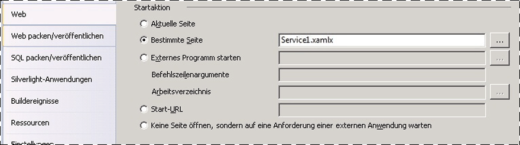
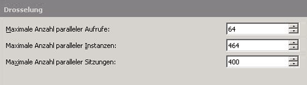
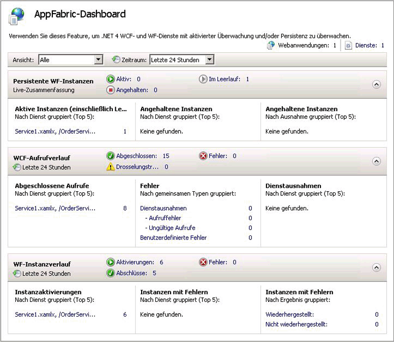
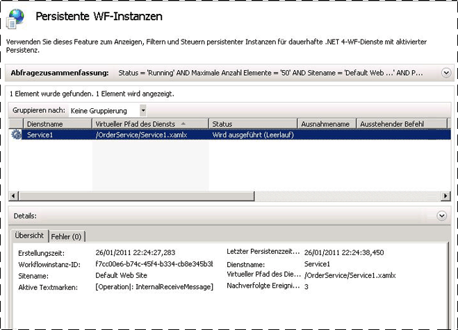

# Vorgehensweise: Hosten eines Workflowdiensts mit Windows Server AppFabricHow to: Host a Workflow Service with Windows Server App Fabric
Das Hosten von Workflowdiensten in AppFabric ähnelt dem Hosten unter IIS/WAS.Hosting workflow services in App Fabric is similar to hosting under IIS/WAS. Der einzige Unterschied besteht in den Tools von AppFabric zum Bereitstellen, Überwachen und Verwalten von Workflowdiensten.The only difference is the tools App Fabric provides for deploying, monitoring, and managing workflow services. In diesem Thema verwendet den Workflowdienst erstellt der [Erstellen eines Workflowdiensts langer](../../../../docs/framework/wcf/feature-details/creating-a-long-running-workflow-service.md).This topic uses the workflow service created in the [Creating a Long-running Workflow Service](../../../../docs/framework/wcf/feature-details/creating-a-long-running-workflow-service.md). Sie werden Schritt für Schritt durch das Erstellen eines Workflowdiensts geführt.That topic will walk you through creating a workflow service. In diesem Thema wird erläutert, wie der Workflowdienst mit AppFabric gehostet wird.This topic will explain how to host the workflow service using App Fabric. Weitere Informationen zu Windows Server AppFabric finden Sie unter [Dokumentation zu Windows Server App Fabric](http://go.microsoft.com/fwlink/?LinkID=193037&clcid=0x409).For more information about Windows Server App Fabric, see [Windows Server App Fabric Documentation](http://go.microsoft.com/fwlink/?LinkID=193037&clcid=0x409). Vergewissern Sie sich, dass Windows Server AppFabric installiert ist, bevor Sie die nachfolgenden Schritte ausführen.Before completing the steps below make sure you have Windows Server App Fabric installed.  Um diese öffnen Sie Internet Information Services (inetmgr.exe) zu erreichen, klicken Sie auf den Servernamen in der **Verbindungen** anzeigen, klicken Sie auf Standorte, und klicken Sie auf **Default Web Site**.To do this open up Internet Information Services (inetmgr.exe), click your server name in the **Connections** view, click Sites, and click **Default Web Site**. In der rechten Seite des Bildschirms sehen Sie einen Abschnitt aufgerufen **AppFabric**.In the right-hand side of the screen you should see a section called **App Fabric**. Wenn dieser Bereich nicht (oben rechts) angezeigt wird, ist AppFabric nicht installiert.If you don’t see this section (it will be on the top of the right-hand pane) you do not have App Fabric installed. Weitere Informationen zum Installieren von Windows Server AppFabric finden Sie unter [Installieren von Windows Server AppFabric](http://go.microsoft.com/fwlink/?LinkId=193136).For more information about installing Windows Server App Fabric see [Installing Windows Server App Fabric](http://go.microsoft.com/fwlink/?LinkId=193136).  
  
### Erstellen eines einfachen WorkflowdienstsCreating a Simple Workflow Service  
  
1.  Open [!INCLUDE[vs_current_long](../../../../includes/vs-current-long-md.md)] und Laden Sie die OrderProcessing-Projektmappe, die Sie erstellt, in haben der [Erstellen eines Workflowdiensts langer](../../../../docs/framework/wcf/feature-details/creating-a-long-running-workflow-service.md) Thema.Open [!INCLUDE[vs_current_long](../../../../includes/vs-current-long-md.md)] and load the OrderProcessing solution you created in the [Creating a Long-running Workflow Service](../../../../docs/framework/wcf/feature-details/creating-a-long-running-workflow-service.md) topic.  
  
2.  Klicken Sie mit der rechten Maustaste auf die **OrderService** Projekt, und wählen Sie **Eigenschaften** , und wählen Sie die **Web** Registerkarte.Right click the **OrderService** project and select **Properties** and select the **Web** tab.  
  
3.  In der **Startaktion** wählen Sie im Abschnitt der Eigenschaftenseite **bestimmte Seite** , und geben Sie im Eingabefeld Service1.xamlx.In the **Start Action** section of the property page select **Specific Page** and type Service1.xamlx in the edit box.  
  
4.  In der **Server** wählen Sie im Abschnitt der Eigenschaftenseite **lokalen IIS-Webserver verwenden** und geben Sie die folgende URL: `http://localhost/OrderService`.In the **Servers** section of the property page select **Use Local IIS Web Server** and type in the following URL: `http://localhost/OrderService`.  
  
5.  Klicken Sie auf die **virtuelles Verzeichnis erstellen** Schaltfläche.Click the **Create Virtual Directory** button. Dadurch wird ein neues virtuelles Verzeichnis erstellt, und das Projekt wird eingerichtet, damit die erforderlichen Dateien beim Erstellen des Projekts in das virtuelle Verzeichnis kopiert werden.This will create a new virtual directory and set up the project to copy the needed files to the virtual directory when the project is built.  Sie können die XAMLX-, die web.config- sowie alle erforderlichen DLL-Dateien auch manuell in das virtuelle Verzeichnis kopieren.Alternatively you could manually copy the .xamlx, the web.config, and any needed DLLs to the virtual directory.  
  
### Konfigurieren eines Workflowdiensts zum Hosten in Windows Server AppFabricConfiguring a Workflow Service Hosted in Windows Server App Fabric  
  
1.  Öffnen Sie den Internetinformationsdienste-Manager (inetmgr.exe).Open Internet Information Services Manager (inetmgr.exe).  
  
2.  Navigieren Sie zum virtuellen Verzeichnis OrderService in der **Verbindungen** Bereich.Navigate to the OrderService virtual directory in the **Connections** pane.  
  
3.  Klicken Sie mit der rechten Maustaste auf OrderService, und wählen Sie **WCF- und WF-Dienste verwalten**, **konfigurieren...** .Right click OrderService and select **Manage WCF and WF Services**, **Configure…**. Die **WCF und WF für Anwendung konfigurieren** Dialogfeld wird angezeigt.The **Configure WCF and WF for Application** dialog box is displayed.  
  
4.  Wählen Sie die **allgemeine** Registerkarte ", um allgemeine Informationen zur Anwendung anzuzeigen, wie im folgenden Screenshot gezeigt.Select the **General** tab to display general information about the application as shown in the following screen shot.  
  
       
  
5.  Wählen Sie die **Überwachung** Registerkarte. Es werden verschiedene Überwachungseinstellungen angezeigt, wie in der folgenden Bildschirmabbildung veranschaulicht.Select the **Monitoring** tab. This shows various monitoring settings as shown in the following screen shot.  
  
       
  
     Weitere Informationen zum Konfigurieren der Workflowdienst in AppFabric Überwachung finden Sie unter [Konfigurieren der Überwachung mit AppFabric](http://go.microsoft.com/fwlink/?LinkId=193153).For more information about configuring workflow service monitoring in App Fabric see [Configuring monitoring with App Fabric](http://go.microsoft.com/fwlink/?LinkId=193153).  
  
6.  Wählen Sie die **Workflowpersistenz** Registerkarte. Dort können Sie Ihre Anwendung für die Verwendung des Standardpersistenzanbieters von AppFabric konfigurieren, wie in der folgenden Bildschirmabbildung veranschaulicht.Select the **Workflow Persistence** tab. This allows you to configure your application to use App Fabric’s default persistence provider as shown in the following screen shot.  
  
       
  
     Weitere Informationen zum Konfigurieren von Workflowpersistenz in Windows Server AppFabric finden Sie unter [Workflowpersistenz in AppFabric konfigurieren](http://go.microsoft.com/fwlink/?LinkId=193148).For more information about configuring workflow persistence in Windows Server App Fabric see [Configuring Workflow Persistence in App Fabric](http://go.microsoft.com/fwlink/?LinkId=193148).  
  
7.  Wählen Sie die **Workflowhostverwaltung** Registerkarte. Dort können Sie angeben, wann Workflowdienstinstanzen im Leerlauf entladen und beibehalten werden sollen, wie in der folgenden Bildschirmabbildung veranschaulicht.Select the **Workflow Host Management** tab. This allows you to specify when idle workflow service instances should be unloaded and persisted as shown in the following screen shot.  
  
       
  
     Weitere Informationen zu Workflow Host-Management-Konfiguration finden Sie unter [Konfiguration – Workflowhostverwaltung in AppFabric](http://go.microsoft.com/fwlink/?LinkId=193151).For more information about workflow host management configuration see [Configuring Workflow Host Management in App Fabric](http://go.microsoft.com/fwlink/?LinkId=193151).  
  
8.  Wählen Sie die **Autostart-** Registerkarte. Dort können Sie Autostarteinstellungen für die Workflowdienste in der Anwendung angeben, wie in der folgenden Bildschirmabbildung veranschaulicht.Select the **Auto-Start** tab. This allows you to specify auto-start settings for the workflow services in the application as shown in the following screen shot.  
  
       
  
     Weitere Informationen zum Konfigurieren des automatischen Starts finden Sie unter [konfigurieren Autostart-mit AppFabric](http://go.microsoft.com/fwlink/?LinkId=193150).For more information about configuring Auto-Start see [Configuring Auto-Start with App Fabric](http://go.microsoft.com/fwlink/?LinkId=193150).  
  
9. Wählen Sie die **Einschränkung** Registerkarte. Dort können Sie Einschränkungseinstellungen für den Workflowdienst konfigurieren, wie in der folgenden Bildschirmabbildung veranschaulicht.Select the **Throttling** tab. This allows you to configure throttling settings for the workflow service as shown in the following screen shot.  
  
       
  
     Weitere Informationen zum Konfigurieren der Drosselung finden Sie unter [Konfigurieren von Einschränkung mit AppFabric](http://go.microsoft.com/fwlink/?LinkId=193149).For more information about configuring throttling see [Configuring Throttling with App Fabric](http://go.microsoft.com/fwlink/?LinkId=193149).  
  
10. Wählen Sie die **Sicherheit** Registerkarte. Dort können Sie Sicherheitseinstellungen für die Anwendung konfigurieren, wie in der folgenden Bildschirmabbildung veranschaulicht.Select the **Security** tab. This allows you to configure security settings for the application as shown in the following screen shot.  
  
       
  
     Weitere Informationen zum Konfigurieren der Sicherheit mit Windows Server AppFabric finden Sie unter [Konfigurieren der Sicherheit mit AppFabric](http://go.microsoft.com/fwlink/?LinkId=193152).For more information about configuring security with Windows Server App Fabric see [Configuring Security with App Fabric](http://go.microsoft.com/fwlink/?LinkId=193152).  
  
### Verwenden von Windows Server AppFabricUsing Windows Server App Fabric  
  
1.  Erstellen Sie die Projektmappe, um die benötigten Dateien in das virtuelle Verzeichnis zu kopieren.Build the solution to copy the necessary files to the virtual directory.  
  
2.  Klicken Sie mit der mit der rechten Maustaste auf das OrderClient-Projekt, und wählen Sie **Debuggen**, **neue Instanz starten** an die Clientanwendung gestartet.Right click the OrderClient project and select **Debug**, **Start New Instance** to launch the client application.  
  
3.  Der Client wird ausgeführt und zeigt Visual Studio eine **Sicherheitswarnung Anfügen** (Dialogfeld), klicken Sie auf die **nicht Anfügen** Schaltfläche.The client will run and Visual Studio will display an **Attach Security Warning** dialog box, click the **Don’t Attach** button. Damit wird Visual Studio angewiesen, den IIS-Prozess nicht zum Debuggen anzufügen.This tells Visual Studio to not attach to the IIS process for debugging.  
  
4.  Der Workflowdienst wird unmittelbar von der Clientanwendung aufgerufen; anschließend wartet die Anwendung.The client application will immediately call the Workflow service and then wait. Der Workflowdienst wird in den Leerlauf versetzt und beibehalten.The workflow service will go idle and be persisted. Sie können dies überprüfen, indem Sie Internetinformationsdienste (inetmgr.exe) starten, im Bereich Verbindungen zu OrderService navigieren und die Instanz auswählen.You can verify this by starting Internet Information Services (inetmgr.exe), navigating to the OrderService in the Connections pane and selecting it. Klicken Sie dann im rechten Bereich auf das Symbol für das AppFabric-Dashboard.Next, click the App Fabric Dashboard icon in the right-hand pane. Unter Persistente WF-Instanzen wird eine beibehaltene Workflowdienstinstanz angezeigt, wie in der folgenden Bildschirmabbildung veranschaulicht.Under Persisted WF Instances you will see there is one persisted workflow service instance as shown in the following screen shot.  
  
       
  
     Die **WF Instanz Verlauf** listet Informationen zu den Workflowdienst, z. B. die Anzahl der Aktivierungen für Workflow-Dienst, die Anzahl der Workflows instanzverlauf und die Anzahl der Workflowinstanzen Fehler aufwiesen.The **WF Instance History** lists information about the workflow service such as the number of workflow service activations, the number of workflow service instance completions, and the number of workflow instances with failures. Unter Aktive Instanzen (einschließlich Leerlauf) wird ein Link angezeigt. Wenn Sie darauf klicken, werden weitere Informationen über Workflowinstanzen im Leerlauf angezeigt, wie in der folgenden Bildschirmabbildung veranschaulicht.Under Active or Idle instances a link will be displayed, clicking on the link will display more information about the idle workflow instances as shown in the following screen shot.  
  
       
  
     Weitere Informationen zu Windows Server AppFabric-Features und deren Verwendung finden Sie unter [Windows Server App Fabric-Hostingfunktionen](http://go.microsoft.com/fwlink/?LinkID=193143&clcid=0x409)For more information about Windows Server App Fabric features and how to use them see [Windows Server App Fabric Hosting Features](http://go.microsoft.com/fwlink/?LinkID=193143&clcid=0x409)  
  
## Siehe auchSee Also  
 [Erstellen eines Workflowdiensts mit langer AusführungszeitCreating a Long-running Workflow Service](../../../../docs/framework/wcf/feature-details/creating-a-long-running-workflow-service.md)  
 [Windows Server AppFabric-HostingfunktionenWindows Server App Fabric Hosting Features](http://go.microsoft.com/fwlink/?LinkId=193143)  
 [Installieren von Windows Server AppFabricInstalling Windows Server App Fabric](http://go.microsoft.com/fwlink/?LinkId=193136)  
 [Windows Server AppFabric-DokumentationWindows Server App Fabric Documentation](http://go.microsoft.com/fwlink/?LinkID=193037&clcid=0x409)
