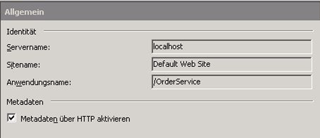
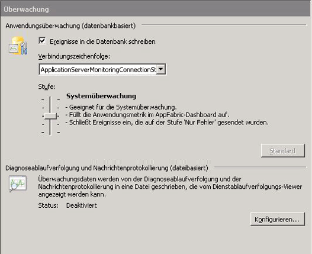
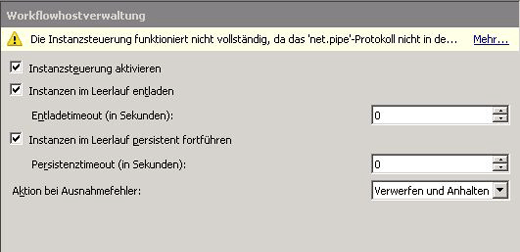
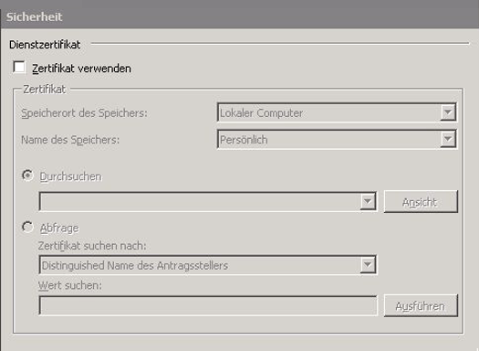

# Vorgehensweise: Hosten eines Workflowdiensts mit Windows Server AppFabricHow to: Host a Workflow Service with Windows Server App Fabric

Das Hosten von Workflowdiensten in AppFabric ähnelt dem Hosten unter IIS/WAS.Hosting workflow services in App Fabric is similar to hosting under IIS/WAS. Der einzige Unterschied besteht in den Tools von AppFabric zum Bereitstellen, Überwachen und Verwalten von Workflowdiensten.The only difference is the tools App Fabric provides for deploying, monitoring, and managing workflow services. In diesem Thema wird der Workflow Dienst verwendet, der im [Erstellen eines Workflow Dienstanbieter mit langer Laufzeit](../../../../docs/framework/wcf/feature-details/creating-a-long-running-workflow-service.md)erstellt wurde.This topic uses the workflow service created in the [Creating a Long-running Workflow Service](../../../../docs/framework/wcf/feature-details/creating-a-long-running-workflow-service.md). Sie werden Schritt für Schritt durch das Erstellen eines Workflowdiensts geführt.That topic will walk you through creating a workflow service. In diesem Thema wird erläutert, wie der Workflowdienst mit AppFabric gehostet wird.This topic will explain how to host the workflow service using App Fabric. Weitere Informationen zu Windows Server App Fabric finden Sie in der [Dokumentation zu Windows Server](https://docs.microsoft.com/previous-versions/appfabric/ff384253(v=azure.10))AppFabric.For more information about Windows Server App Fabric, see [Windows Server App Fabric Documentation](https://docs.microsoft.com/previous-versions/appfabric/ff384253(v=azure.10)). Vergewissern Sie sich, dass Windows Server AppFabric installiert ist, bevor Sie die nachfolgenden Schritte ausführen.Before completing the steps below make sure you have Windows Server App Fabric installed.  Öffnen Sie hierzu Internetinformationsdienste (inetmgr. exe), klicken Sie in der Ansicht **Verbindungen** auf den Servernamen, klicken Sie auf Sites, und klicken Sie auf **Standard Website**.To do this open up Internet Information Services (inetmgr.exe), click your server name in the **Connections** view, click Sites, and click **Default Web Site**. Auf der rechten Seite des Bildschirms sollte ein Abschnitt mit dem Namen **App Fabric**angezeigt werden.In the right-hand side of the screen you should see a section called **App Fabric**. Wenn dieser Bereich nicht (oben rechts) angezeigt wird, ist AppFabric nicht installiert.If you don’t see this section (it will be on the top of the right-hand pane) you do not have App Fabric installed. Weitere Informationen zum Installieren von Windows Server App Fabric finden Sie unter [Installieren von Windows Server](https://docs.microsoft.com/previous-versions/appfabric/ee790960(v=azure.10))AppFabric.For more information about installing Windows Server App Fabric see [Installing Windows Server App Fabric](https://docs.microsoft.com/previous-versions/appfabric/ee790960(v=azure.10)).  
  
### Erstellen eines einfachen WorkflowdienstsCreating a Simple Workflow Service  
  
1. Öffnen Sie Visual Studio 2012, und laden Sie die Projekt Mappe Order Processing, die Sie im Thema [Erstellen eines Workflow Dienstanbieter mit langer Laufzeit](../../../../docs/framework/wcf/feature-details/creating-a-long-running-workflow-service.md) erstellt haben.Open Visual Studio 2012 and load the OrderProcessing solution you created in the [Creating a Long-running Workflow Service](../../../../docs/framework/wcf/feature-details/creating-a-long-running-workflow-service.md) topic.  
  
2. Klicken Sie mit der rechten Maustaste auf das Projekt **OrderService** , und wählen Sie **Eigenschaften** und dann die Registerkarte **Web**Right click the **OrderService** project and select **Properties** and select the **Web** tab.  
  
3. Wählen Sie im Abschnitt **Start Aktion** der Eigenschaften Seite **bestimmte Seite** aus, und geben Sie Service1. xamlx in das Bearbeitungsfeld ein.In the **Start Action** section of the property page select **Specific Page** and type Service1.xamlx in the edit box.  
  
4. Wählen Sie auf der Eigenschaften Seite im Abschnitt **Server** die Option **lokalen IIS-Webserver verwenden** aus, und geben Sie die folgende URL ein: `http://localhost/OrderService`.In the **Servers** section of the property page select **Use Local IIS Web Server** and type in the following URL: `http://localhost/OrderService`.  
  
5. Klicken Sie auf die Schaltfläche **virtuelles Verzeichnis erstellen** .Click the **Create Virtual Directory** button. Dadurch wird ein neues virtuelles Verzeichnis erstellt, und das Projekt wird eingerichtet, damit die erforderlichen Dateien beim Erstellen des Projekts in das virtuelle Verzeichnis kopiert werden.This will create a new virtual directory and set up the project to copy the needed files to the virtual directory when the project is built.  Sie können die XAMLX-, die web.config- sowie alle erforderlichen DLL-Dateien auch manuell in das virtuelle Verzeichnis kopieren.Alternatively you could manually copy the .xamlx, the web.config, and any needed DLLs to the virtual directory.  
  
### Konfigurieren eines Workflowdiensts zum Hosten in Windows Server AppFabricConfiguring a Workflow Service Hosted in Windows Server App Fabric  
  
1. Öffnen Sie den Internetinformationsdienste-Manager (inetmgr.exe).Open Internet Information Services Manager (inetmgr.exe).  
  
2. Navigieren Sie im Bereich **Verbindungen** zum virtuellen Verzeichnis OrderService.Navigate to the OrderService virtual directory in the **Connections** pane.  
  
3. Klicken Sie mit der rechten Maustaste auf OrderService, und wählen Sie **WCF-und WF-Dienste verwalten**, **Konfigurieren**aus.Right click OrderService and select **Manage WCF and WF Services**, **Configure…**. Das Dialogfeld **WCF und WF für die Anwendung konfigurieren** wird angezeigt.The **Configure WCF and WF for Application** dialog box is displayed.  
  
4. Wählen Sie die Registerkarte **Allgemein** aus, um allgemeine Informationen zur Anwendung anzuzeigen, wie im folgenden Screenshot zu sehen.Select the **General** tab to display general information about the application as shown in the following screenshot.  
  
       
  
5. Wählen Sie die Registerkarte **Überwachung** aus. Dies zeigt verschiedene Überwachungs Einstellungen, wie im folgenden Screenshot gezeigt.Select the **Monitoring** tab. This shows various monitoring settings as shown in the following screenshot.  
  
       
  
     Weitere Informationen zum Konfigurieren der Workflow Dienst Überwachung in App Fabric finden Sie unter [Konfigurieren der Überwachung mit App-Fabric](https://docs.microsoft.com/previous-versions/appfabric/ee677384(v=azure.10)).For more information about configuring workflow service monitoring in App Fabric see [Configuring monitoring with App Fabric](https://docs.microsoft.com/previous-versions/appfabric/ee677384(v=azure.10)).  
  
6. Wählen Sie die Registerkarte **Workflow Persistenz** aus. Dies ermöglicht es Ihnen, Ihre Anwendung so zu konfigurieren, dass Sie den Standard Dauerhaftigkeits Anbieter von App Fabric verwendet, wie im folgenden Screenshot gezeigt.Select the **Workflow Persistence** tab. This allows you to configure your application to use App Fabric’s default persistence provider as shown in the following screenshot.  
  
       
  
     Weitere Informationen zum Konfigurieren der Workflow Persistenz in Windows Server App Fabric finden Sie [unter Konfigurieren der Workflow Persistenz in der APP-Fabric](https://docs.microsoft.com/previous-versions/appfabric/ee677353(v=azure.10)).For more information about configuring workflow persistence in Windows Server App Fabric see [Configuring Workflow Persistence in App Fabric](https://docs.microsoft.com/previous-versions/appfabric/ee677353(v=azure.10)).  
  
7. Wählen Sie die Registerkarte **Workflow Host Verwaltung** aus. Dadurch können Sie angeben, wann Workflow Dienst Instanzen im Leerlauf entladen und beibehalten werden sollen, wie im folgenden Screenshot gezeigt.Select the **Workflow Host Management** tab. This allows you to specify when idle workflow service instances should be unloaded and persisted as shown in the following screenshot.  
  
       
  
     Weitere Informationen zur Konfiguration der Workflow Host Verwaltung finden Sie [unter Konfigurieren der Workflow Host Verwaltung in App-Fabric](https://docs.microsoft.com/previous-versions/appfabric/ff383424(v=azure.10)).For more information about workflow host management configuration see [Configuring Workflow Host Management in App Fabric](https://docs.microsoft.com/previous-versions/appfabric/ff383424(v=azure.10)).  
  
8. Wählen Sie die Registerkarte **automatisch starten** aus. Auf diese Weise können Sie Einstellungen für den automatischen Start für die Workflow Dienste in der Anwendung angeben, wie im folgenden Screenshot gezeigt.Select the **Auto-Start** tab. This allows you to specify auto-start settings for the workflow services in the application as shown in the following screenshot.  
  
       
  
     Weitere Informationen zum Konfigurieren des automatischen Starts finden Sie [unter Konfigurieren des automatischen Starts mit App-Fabric](https://docs.microsoft.com/previous-versions/appfabric/ee677261(v=azure.10)).For more information about configuring Auto-Start see [Configuring Auto-Start with App Fabric](https://docs.microsoft.com/previous-versions/appfabric/ee677261(v=azure.10)).  
  
9. Wählen Sie die Registerkarte **Drosselung** aus. Dies ermöglicht es Ihnen, einschränerungs Einstellungen für den Workflow Dienst zu konfigurieren, wie im folgenden Screenshot zu sehen.Select the **Throttling** tab. This allows you to configure throttling settings for the workflow service as shown in the following screenshot.  
  
       
  
     Weitere Informationen zum Konfigurieren der Drosselung finden Sie [unter Konfigurieren der Drosselung mit App-Fabric](https://docs.microsoft.com/previous-versions/appfabric/ee677261(v=azure.10)).For more information about configuring throttling see [Configuring Throttling with App Fabric](https://docs.microsoft.com/previous-versions/appfabric/ee677261(v=azure.10)).  
  
10. Wählen Sie die Registerkarte **Sicherheit** aus. Auf diese Weise können Sie die Sicherheitseinstellungen für die Anwendung konfigurieren, wie im folgenden Screenshot zu sehen.Select the **Security** tab. This allows you to configure security settings for the application as shown in the following screenshot.  
  
       
  
     Weitere Informationen zum Konfigurieren der Sicherheit mit Windows Server AppFabric finden Sie unter [Konfigurieren der Sicherheit mit App-Fabric](https://docs.microsoft.com/previous-versions/appfabric/ee677278(v=azure.10)).For more information about configuring security with Windows Server App Fabric see [Configuring Security with App Fabric](https://docs.microsoft.com/previous-versions/appfabric/ee677278(v=azure.10)).  
  
### Verwenden von Windows Server AppFabricUsing Windows Server App Fabric  
  
1. Erstellen Sie die Projektmappe, um die benötigten Dateien in das virtuelle Verzeichnis zu kopieren.Build the solution to copy the necessary files to the virtual directory.  
  
2. Klicken Sie mit der rechten Maustaste auf das Projekt Order Client, und wählen Sie **Debuggen**, **neue Instanz starten** , um die Client AnwendungRight click the OrderClient project and select **Debug**, **Start New Instance** to launch the client application.  
  
3. Der Client wird ausgeführt, und Visual Studio zeigt das Dialogfeld **Sicherheitswarnung anfügen** an, und klicken Sie auf die Schaltfläche **nicht anfügen** .The client will run and Visual Studio will display an **Attach Security Warning** dialog box, click the **Don’t Attach** button. Damit wird Visual Studio angewiesen, den IIS-Prozess nicht zum Debuggen anzufügen.This tells Visual Studio to not attach to the IIS process for debugging.  
  
4. Der Workflowdienst wird unmittelbar von der Clientanwendung aufgerufen; anschließend wartet die Anwendung.The client application will immediately call the Workflow service and then wait. Der Workflowdienst wird in den Leerlauf versetzt und beibehalten.The workflow service will go idle and be persisted. Sie können dies überprüfen, indem Sie Internetinformationsdienste (inetmgr.exe) starten, im Bereich Verbindungen zu OrderService navigieren und die Instanz auswählen.You can verify this by starting Internet Information Services (inetmgr.exe), navigating to the OrderService in the Connections pane and selecting it. Klicken Sie dann im rechten Bereich auf das Symbol für das AppFabric-Dashboard.Next, click the App Fabric Dashboard icon in the right-hand pane. Unter persistente WF-Instanzen sehen Sie, dass eine beibehaltene Workflow Dienst Instanz vorhanden ist, wie im folgenden Screenshot gezeigt.Under Persisted WF Instances you will see there is one persisted workflow service instance as shown in the following screenshot.  
  
       
  
     Der **WF-Instanzverlauf** listet Informationen zum Workflow Dienst auf, z. b. die Anzahl der Workflow Dienst Aktivierungen, die Anzahl der Vervollständigungen von Workflow Dienst Instanzen und die Anzahl der Workflow Instanzen mit Fehlern.The **WF Instance History** lists information about the workflow service such as the number of workflow service activations, the number of workflow service instance completions, and the number of workflow instances with failures. Unter "aktive" oder "Leerlauf"-Instanzen wird ein Link angezeigt. Wenn Sie auf den Link klicken, werden weitere Informationen zu den Workflow Instanzen im Leerlauf angezeigt, wie im folgenden Screenshot zu sehen.Under Active or Idle instances a link will be displayed, clicking on the link will display more information about the idle workflow instances as shown in the following screenshot.  
  
       
  
     Weitere Informationen zu Windows Server App Fabric-Features und deren Verwendung finden Sie unter [Windows Server App Fabric-Hostingfunktionen](https://docs.microsoft.com/previous-versions/appfabric/ee677189(v=azure.10)) .For more information about Windows Server App Fabric features and how to use them see [Windows Server App Fabric Hosting Features](https://docs.microsoft.com/previous-versions/appfabric/ee677189(v=azure.10))  
  
## Siehe auchSee also

- [Erstellen eines Workflowdiensts mit langer AusführungszeitCreating a Long-running Workflow Service](../../../../docs/framework/wcf/feature-details/creating-a-long-running-workflow-service.md)
- [Windows Server AppFabric-Hostingfunktionen](https://docs.microsoft.com/previous-versions/appfabric/ee677189(v=azure.10))[Windows Server App Fabric Hosting Features](https://docs.microsoft.com/previous-versions/appfabric/ee677189(v=azure.10))
- [Installieren von Windows Server-App-Fabric](https://docs.microsoft.com/previous-versions/appfabric/ee790960(v=azure.10))[Installing Windows Server App Fabric](https://docs.microsoft.com/previous-versions/appfabric/ee790960(v=azure.10))
- [Dokumentation zu Windows Server App Fabric](https://docs.microsoft.com/previous-versions/appfabric/ff384253(v=azure.10))[Windows Server App Fabric Documentation](https://docs.microsoft.com/previous-versions/appfabric/ff384253(v=azure.10))
