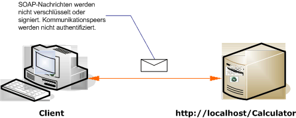

# <a name="internet-unsecured-client-and-service"></a>Internet: Ungesicherter Client und Dienst
Die folgende Illustration zeigt ein Beispiel eines öffentlichen, ungesicherten [!INCLUDE[indigo1](../../../../includes/indigo1-md.md)]-Clients und eines Diensts an.  
  
   
  
|Merkmal|Beschreibung|  
|--------------------|-----------------|  
|Sicherheitsmodus|Keine|  
|Transport|HTTP|  
|Bindung|<xref:System.ServiceModel.BasicHttpBinding>im Code oder die [ \<BasicHttpBinding >](../../../../docs/framework/configure-apps/file-schema/wcf/basichttpbinding.md) Element in der Konfiguration.|  
|Interoperabilität|Mit vorhandenen Webdienstclients und Diensten|  
|Authentifizierung|Keine|  
|Integrität|Keine|  
|Vertraulichkeit|Keine|  
  
## <a name="service"></a>Dienst  
 Der folgende Code und die folgende Konfiguration werden unabhängig voneinander ausgeführt. Führen Sie einen der folgenden Schritte aus:  
  
-   Erstellen Sie einen separaten Dienst, indem Sie den Code ohne Konfiguration verwenden.  
  
-   Erstellen Sie mit der angegebenen Konfiguration einen Dienst, aber definieren Sie keine Endpunkte.  
  
### <a name="code"></a>Code  
 Im folgenden Code wird gezeigt, wie ein Endpunkt ohne Sicherheit erstellt wird: Standardmäßig verfügt die <xref:System.ServiceModel.BasicHttpBinding> über den Sicherheitsmodus <xref:System.ServiceModel.BasicHttpSecurityMode.None>.  
  
 [!code-csharp[C_UnsecuredService#1](../../../../samples/snippets/csharp/VS_Snippets_CFX/c_unsecuredservice/cs/source.cs#1)]
 [!code-vb[C_UnsecuredService#1](../../../../samples/snippets/visualbasic/VS_Snippets_CFX/c_unsecuredservice/vb/source.vb#1)]  
  
### <a name="service-configuration"></a>Dienstkonfiguration  
 Mit dem folgenden Code wird derselbe Endpunkt mithilfe von Konfiguration eingerichtet.  
  
```xml  
<?xml version="1.0" encoding="utf-8"?>  
<configuration>  
  <system.serviceModel>  
    <behaviors />  
    <services>  
      <service behaviorConfiguration="" name="ServiceModel.Calculator">  
        <endpoint address="http://localhost/Calculator"   
                  binding="basicHttpBinding"  
                  bindingConfiguration="Basic_Unsecured"   
                  name="BasicHttp_ICalculator"  
                  contract="ServiceModel.ICalculator" />  
      </service>  
    </services>  
    <bindings>  
      <basicHttpBinding>  
        <binding name="Basic_Unsecured" />  
      </basicHttpBinding>  
    </bindings>  
    <client />  
  </system.serviceModel>  
</configuration>  
```  
  
## <a name="client"></a>Client  
 Der folgende Code und die folgende Konfiguration werden unabhängig voneinander ausgeführt. Führen Sie einen der folgenden Schritte aus:  
  
-   Erstellen Sie mit dem Code (und Clientcode) einen eigenständigen Client.  
  
-   Erstellen Sie einen Client, der keine Endpunktadressen definiert. Verwenden Sie stattdessen den Clientkonstruktor, der den Konfigurationsnamen als Argument verwendet. Beispiel:  
  
     [!code-csharp[C_SecurityScenarios#0](../../../../samples/snippets/csharp/VS_Snippets_CFX/c_securityscenarios/cs/source.cs#0)]
     [!code-vb[C_SecurityScenarios#0](../../../../samples/snippets/visualbasic/VS_Snippets_CFX/c_securityscenarios/vb/source.vb#0)]  
  
### <a name="code"></a>Code  
 Im folgenden Code wird ein grundlegender [!INCLUDE[indigo2](../../../../includes/indigo2-md.md)]-Client gezeigt, der auf einen ungesicherten Endpunkt zugreift.  
  
 [!code-csharp[C_UnsecuredClient#1](../../../../samples/snippets/csharp/VS_Snippets_CFX/c_unsecuredclient/cs/source.cs#1)]
 [!code-vb[C_UnsecuredClient#1](../../../../samples/snippets/visualbasic/VS_Snippets_CFX/c_unsecuredclient/vb/source.vb#1)]  
  
### <a name="client-configuration"></a>Clientkonfiguration  
 Der folgende Code dient zum Konfigurieren des Clients.  
  
```xml  
<?xml version="1.0" encoding="utf-8"?>  
<configuration>  
  <system.serviceModel>  
    <bindings>  
      <basicHttpBinding>  
        <binding name="BasicHttpBinding_ICalculator" >  
          <security mode="None">  
          </security>  
        </binding>  
      </basicHttpBinding>  
    </bindings>  
    <client>  
      <endpoint address="http://localhost/Calculator/Unsecured"  
          binding="basicHttpBinding"   
          bindingConfiguration="BasicHttpBinding_ICalculator"  
          contract="ICalculator"   
          name="BasicHttpBinding_ICalculator" />  
    </client>  
  </system.serviceModel>  
</configuration>  
```  
  
## <a name="see-also"></a>Siehe auch  
 [Häufige Sicherheitsszenarien](../../../../docs/framework/wcf/feature-details/common-security-scenarios.md)  
 [Sicherheit (Übersicht)](../../../../docs/framework/wcf/feature-details/security-overview.md)  
 [Sicherheitsmodell für Windows Server AppFabric](http://go.microsoft.com/fwlink/?LinkID=201279&clcid=0x409)
