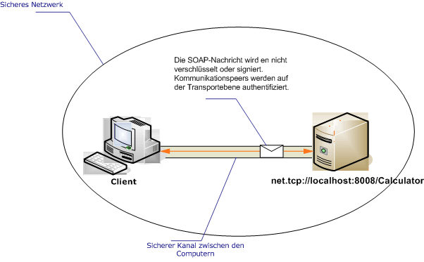

# <a name="intranet-unsecured-client-and-service"></a><span data-ttu-id="f5f6a-102">Intranet: Ungesicherter Client und Dienst</span><span class="sxs-lookup"><span data-stu-id="f5f6a-102">Intranet Unsecured Client and Service</span></span>
<span data-ttu-id="f5f6a-103">Die folgende Abbildung zeigt einen einfachen Windows Communication Foundation (WCF)-Dienst entwickelt, um Informationen zu einem sicheren privaten Netzwerk zu einer WCF-Anwendung bereitstellen.</span><span class="sxs-lookup"><span data-stu-id="f5f6a-103">The following illustration depicts a simple Windows Communication Foundation (WCF) service developed to provide information on a secure private network to a WCF application.</span></span> <span data-ttu-id="f5f6a-104">Sicherheit ist nicht erforderlich, da die Daten weniger wichtig ist, das Netzwerk als grundsätzlich sicher erwartet wird, oder die Sicherheit wird durch eine Ebene unterhalb der WCF-Infrastruktur bereitgestellt.</span><span class="sxs-lookup"><span data-stu-id="f5f6a-104">Security is not required because the data is of low importance, the network is expected to be inherently secure, or security is provided by a layer below the WCF infrastructure.</span></span>  
  
 <span data-ttu-id="f5f6a-105"></span><span class="sxs-lookup"><span data-stu-id="f5f6a-105"></span></span>  
  
|<span data-ttu-id="f5f6a-106">Merkmal</span><span class="sxs-lookup"><span data-stu-id="f5f6a-106">Characteristic</span></span>|<span data-ttu-id="f5f6a-107">Beschreibung</span><span class="sxs-lookup"><span data-stu-id="f5f6a-107">Description</span></span>|  
|--------------------|-----------------|  
|<span data-ttu-id="f5f6a-108">Sicherheitsmodus</span><span class="sxs-lookup"><span data-stu-id="f5f6a-108">Security Mode</span></span>|<span data-ttu-id="f5f6a-109">Keine</span><span class="sxs-lookup"><span data-stu-id="f5f6a-109">None</span></span>|  
|<span data-ttu-id="f5f6a-110">Transport</span><span class="sxs-lookup"><span data-stu-id="f5f6a-110">Transport</span></span>|<span data-ttu-id="f5f6a-111">TCP</span><span class="sxs-lookup"><span data-stu-id="f5f6a-111">TCP</span></span>|  
|<span data-ttu-id="f5f6a-112">Bindung</span><span class="sxs-lookup"><span data-stu-id="f5f6a-112">Binding</span></span>|<xref:System.ServiceModel.NetTcpBinding>|  
|<span data-ttu-id="f5f6a-113">Interoperabilität</span><span class="sxs-lookup"><span data-stu-id="f5f6a-113">Interoperability</span></span>|<span data-ttu-id="f5f6a-114">Nur WCF</span><span class="sxs-lookup"><span data-stu-id="f5f6a-114">WCF only</span></span>|  
|<span data-ttu-id="f5f6a-115">Authentifizierung</span><span class="sxs-lookup"><span data-stu-id="f5f6a-115">Authentication</span></span>|<span data-ttu-id="f5f6a-116">Keine</span><span class="sxs-lookup"><span data-stu-id="f5f6a-116">None</span></span>|  
|<span data-ttu-id="f5f6a-117">Integrität</span><span class="sxs-lookup"><span data-stu-id="f5f6a-117">Integrity</span></span>|<span data-ttu-id="f5f6a-118">Keine</span><span class="sxs-lookup"><span data-stu-id="f5f6a-118">None</span></span>|  
|<span data-ttu-id="f5f6a-119">Vertraulichkeit</span><span class="sxs-lookup"><span data-stu-id="f5f6a-119">Confidentiality</span></span>|<span data-ttu-id="f5f6a-120">Keine</span><span class="sxs-lookup"><span data-stu-id="f5f6a-120">None</span></span>|  
  
## <a name="service"></a><span data-ttu-id="f5f6a-121">Dienst</span><span class="sxs-lookup"><span data-stu-id="f5f6a-121">Service</span></span>  
 <span data-ttu-id="f5f6a-122">Der folgende Code und die folgende Konfiguration werden unabhängig voneinander ausgeführt.</span><span class="sxs-lookup"><span data-stu-id="f5f6a-122">The following code and configuration are meant to run independently.</span></span> <span data-ttu-id="f5f6a-123">Führen Sie einen der folgenden Schritte aus:</span><span class="sxs-lookup"><span data-stu-id="f5f6a-123">Do one of the following:</span></span>  
  
-   <span data-ttu-id="f5f6a-124">Erstellen Sie einen separaten Dienst, indem Sie den Code ohne Konfiguration verwenden.</span><span class="sxs-lookup"><span data-stu-id="f5f6a-124">Create a stand-alone service using the code with no configuration.</span></span>  
  
-   <span data-ttu-id="f5f6a-125">Erstellen Sie mit der angegebenen Konfiguration einen Dienst, aber definieren Sie keine Endpunkte.</span><span class="sxs-lookup"><span data-stu-id="f5f6a-125">Create a service using the supplied configuration, but do not define any endpoints.</span></span>  
  
### <a name="code"></a><span data-ttu-id="f5f6a-126">Code</span><span class="sxs-lookup"><span data-stu-id="f5f6a-126">Code</span></span>  
 <span data-ttu-id="f5f6a-127">Im folgenden Code wird gezeigt, wie ein Endpunkt ohne Sicherheit erstellt wird:</span><span class="sxs-lookup"><span data-stu-id="f5f6a-127">The following code shows how to create an endpoint with no security:</span></span>  
  
 [!code-csharp[C_UnsecuredService#2](../../../../samples/snippets/csharp/VS_Snippets_CFX/c_unsecuredservice/cs/source.cs#2)]
 [!code-vb[C_UnsecuredService#2](../../../../samples/snippets/visualbasic/VS_Snippets_CFX/c_unsecuredservice/vb/source.vb#2)]  
  
### <a name="configuration"></a><span data-ttu-id="f5f6a-128">Konfiguration</span><span class="sxs-lookup"><span data-stu-id="f5f6a-128">Configuration</span></span>  
 <span data-ttu-id="f5f6a-129">Mit dem folgenden Code wird derselbe Endpunkt mithilfe von Konfiguration eingerichtet:</span><span class="sxs-lookup"><span data-stu-id="f5f6a-129">The following code sets up the same endpoint using configuration:</span></span>  
  
```xml  
<?xml version="1.0" encoding="utf-8"?>  
<configuration>  
  <system.serviceModel>  
    <behaviors />  
    <services>  
      <service behaviorConfiguration=""   
               name="ServiceModel.Calculator">  
        <endpoint address="net.tcp://localhost:8008/Calculator"   
                  binding="netTcpBinding"  
                  bindingConfiguration="tcp_Unsecured"   
                  name="netTcp_ICalculator"  
                  contract="ServiceModel.ICalculator" />  
      </service>  
    </services>  
    <bindings>  
      <netTcpBinding>  
        <binding name="tcp_Unsecured">  
          <security mode="None" />  
        </binding>  
      </netTcpBinding>  
    </bindings>  
    <client />  
  </system.serviceModel>  
</configuration>  
```  
  
## <a name="client"></a><span data-ttu-id="f5f6a-130">Client</span><span class="sxs-lookup"><span data-stu-id="f5f6a-130">Client</span></span>  
 <span data-ttu-id="f5f6a-131">Der folgende Code und die folgende Konfiguration werden unabhängig voneinander ausgeführt.</span><span class="sxs-lookup"><span data-stu-id="f5f6a-131">The following code and configuration are meant to run independently.</span></span> <span data-ttu-id="f5f6a-132">Führen Sie einen der folgenden Schritte aus:</span><span class="sxs-lookup"><span data-stu-id="f5f6a-132">Do one of the following:</span></span>  
  
-   <span data-ttu-id="f5f6a-133">Erstellen Sie mit dem Code (und Clientcode) einen eigenständigen Client.</span><span class="sxs-lookup"><span data-stu-id="f5f6a-133">Create a stand-alone client using the code (and client code).</span></span>  
  
-   <span data-ttu-id="f5f6a-134">Erstellen Sie einen Client, der keine Endpunktadressen definiert.</span><span class="sxs-lookup"><span data-stu-id="f5f6a-134">Create a client that does not define any endpoint addresses.</span></span> <span data-ttu-id="f5f6a-135">Verwenden Sie stattdessen den Clientkonstruktor, der den Konfigurationsnamen als Argument verwendet.</span><span class="sxs-lookup"><span data-stu-id="f5f6a-135">Instead, use the client constructor that takes the configuration name as an argument.</span></span> <span data-ttu-id="f5f6a-136">Beispiel:</span><span class="sxs-lookup"><span data-stu-id="f5f6a-136">For example:</span></span>  
  
     [!code-csharp[C_SecurityScenarios#0](../../../../samples/snippets/csharp/VS_Snippets_CFX/c_securityscenarios/cs/source.cs#0)]
     [!code-vb[C_SecurityScenarios#0](../../../../samples/snippets/visualbasic/VS_Snippets_CFX/c_securityscenarios/vb/source.vb#0)]  
  
### <a name="code"></a><span data-ttu-id="f5f6a-137">Code</span><span class="sxs-lookup"><span data-stu-id="f5f6a-137">Code</span></span>  
 <span data-ttu-id="f5f6a-138">Der folgende Code zeigt einen grundlegenden WCF-Client, der auf einen ungesicherten Endpunkt mit dem TCP-Protokoll zugreift.</span><span class="sxs-lookup"><span data-stu-id="f5f6a-138">The following code shows a basic WCF client that accesses an unsecured endpoint using the TCP protocol.</span></span>  
  
 [!code-csharp[C_UnsecuredClient#2](../../../../samples/snippets/csharp/VS_Snippets_CFX/c_unsecuredclient/cs/source.cs#2)]
 [!code-vb[C_UnsecuredClient#2](../../../../samples/snippets/visualbasic/VS_Snippets_CFX/c_unsecuredclient/vb/source.vb#2)]  
  
### <a name="configuration"></a><span data-ttu-id="f5f6a-139">Konfiguration</span><span class="sxs-lookup"><span data-stu-id="f5f6a-139">Configuration</span></span>  
 <span data-ttu-id="f5f6a-140">Der folgende Konfigurationscode gilt für den Client:</span><span class="sxs-lookup"><span data-stu-id="f5f6a-140">The following configuration code applies to the client:</span></span>  
  
```xml  
<?xml version="1.0" encoding="utf-8"?>  
<configuration>  
  <system.serviceModel>  
    <bindings>  
      <netTcpBinding>  
        <binding name="NetTcpBinding_ICalculator" >  
          <security mode="None">  
          </security>  
        </binding>  
      </netTcpBinding>  
    </bindings>  
    <client>  
      <endpoint address="net.tcp://machineName:8008/Calculator "  
                binding="netTcpBinding"   
                bindingConfiguration="NetTcpBinding_ICalculator"  
                contract="ICalculator"   
                name="NetTcpBinding_ICalculator" />  
    </client>  
  </system.serviceModel>  
</configuration>  
```  
  
## <a name="see-also"></a><span data-ttu-id="f5f6a-141">Siehe auch</span><span class="sxs-lookup"><span data-stu-id="f5f6a-141">See also</span></span>
- <xref:System.ServiceModel.NetTcpBinding>
- [<span data-ttu-id="f5f6a-142">Übersicht über die Sicherheit</span><span class="sxs-lookup"><span data-stu-id="f5f6a-142">Security Overview</span></span>](../../../../docs/framework/wcf/feature-details/security-overview.md)
- [<span data-ttu-id="f5f6a-143">Sicherheitsmodell für Windows Server AppFabric</span><span class="sxs-lookup"><span data-stu-id="f5f6a-143">Security Model for Windows Server App Fabric</span></span>](https://go.microsoft.com/fwlink/?LinkID=201279&clcid=0x409)
