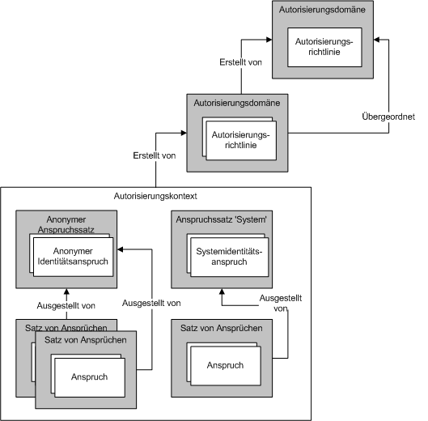

# Verwalten von Ansprüchen und Autorisierung mit dem IdentitätsmodellManaging Claims and Authorization with the Identity Model
Mit Autorisierung wird der Prozess bezeichnet, in dem entschieden wird, welche Entitäten berechtigt sind, eine Computerressource zu ändern, anzuzeigen oder anderweitig darauf zuzugreifen.Authorization is the process of determining which entities have permission to change, view, or otherwise access a computer resource. In einem Unternehmen sind beispielsweise nur Manager berechtigt, auf die Dateien ihrer Mitarbeiter zuzugreifen.For example, in a business, only managers may be allowed to access the files of their employees. Windows Communication Foundation (WCF) unterstützt zwei Mechanismen zum Durchführen der Autorisierungs Verarbeitung.Windows Communication Foundation (WCF) supports two mechanisms for performing authorization processing. Der erste Mechanismus ermöglicht Ihnen, die Autorisierung mit vorhandenen CLR-Konstrukten (Common Language Runtime) zu kontrollieren.The first mechanism enables you to control authorization using existing common language runtime (CLR) constructs. Die zweite ist ein Anspruchs basiertes Modell, das als *Identitäts Modell*bezeichnet wird.The second is a claims-based model known as the *Identity Model*. WCF verwendet das Identitäts Modell zum Erstellen von Ansprüchen aus eingehenden Nachrichten. Identitäts Modellklassen können erweitert werden, um neue Anspruchs Typen für benutzerdefinierte Autorisierungs Schemas zu unterstützen.WCF uses the Identity Model to create claims from incoming messages; Identity Model classes can be extended to support new claim types for custom authorization schemes. Dieses Thema bietet eine Übersicht über die wichtigsten Programmierkonzepte der Identitätsmodellfunktion sowie eine Auflistung der wichtigsten von dieser Funktion verwendeten Klassen.This topic presents an overview of the major programming concepts of the Identity Model feature, as well as a listing of the most important classes the feature uses.  
  
## IdentitätsmodellszenarienIdentity Model Scenarios  
 Die folgenden Szenarien stellen die Verwendung des Identitätsmodells dar.The following scenarios represent Identity Model use.  
  
### Szenario 1: Unterstützung der Ansprüche Identität, Rolle und GruppeScenario 1: Supporting Identity, Role, and Group Claims  
 Benutzer senden Nachrichten an einen Webdienst.Users send messages to a Web service. Für die Anforderungen der Zugriffssteuerung des Webdiensts werden Identität, Rollen und Gruppen verwendet.The access control requirements of the Web service use identity, roles, or groups. Der Absender der Nachricht wird einer Reihe von Rollen oder Gruppen zugeordnet.The message sender is mapped to a set of roles or groups. Mit Rollen- oder Gruppeninformationen werden Zugriffsprüfungen ausgeführt.Role or group information is used to perform access checks.  
  
### Szenario 2: Unterstützung umfangreicher AnsprücheScenario 2: Supporting Rich Claims  
 Benutzer senden Nachrichten an einen Webdienst.Users send messages to a Web service. Für die Anforderungen der Zugriffssteuerung des Webdiensts ist ein umfangreicheres Modell als Identität, Rollen oder Gruppen erforderlich.The access control requirements of the Web service require a richer model than identity, roles, or groups. Der Webdienst bestimmt anhand des umfangreichen anspruchsbasierten Modells, ob ein bestimmter Benutzer Zugriff auf eine bestimmte geschützte Ressource hat.The Web service determines whether a given user has access to a particular protected resource using the rich claims-based model. Ein Benutzer kann beispielsweise berechtigt sein, bestimmte Informationen, wie Gehaltsinformationen, zu lesen, während andere Benutzer keinen Zugriff auf diese Informationen haben.For example, one user may be able to read particular information, such as salary information, that other users do not have access to.  
  
### Szenario 3: Zuordnen von ungleichartigen AnsprüchenScenario 3: Mapping Disparate Claims  
 Ein Benutzer sendet eine Nachricht an einen Webdienst.A user sends a message to a Web service. Der Benutzer kann seine Benutzerinformationen auf verschiedene Weisen angeben: X.509-Zertifikat, Benutzernamentoken oder Kerberos-Token.The user may specify their credentials in a number of different ways: X.509 certificate, user name token, or Kerberos token. Der Webdienst muss unabhängig vom Typ der Benutzeranmeldeinformationen die gleichen Zugriffsteuerungsprüfungen durchführen.The Web service is required to perform access control checks in the same way, regardless of the user credential type. Werden im Laufe der Zeit zusätzliche Anmeldeinformationstypen unterstützt, sollte das System entsprechend weiterentwickelt werden.If additional credential types are supported over time, the system should evolve accordingly.  
  
### Szenario 4: Bestimmen des Zugriffs auf mehrere RessourcenScenario 4: Determining Access to Multiple Resources  
 Ein Webdienst versucht, auf mehrere Ressourcen zuzugreifen.A Web service attempts to access multiple resources. Der Webdienst bestimmt, auf welche geschützten Ressourcen ein bestimmter Benutzer Zugriff hat, indem die mit dem Benutzer verbundenen Ansprüche mit den Ansprüchen verglichen werden, die für den Zugriff auf die Ressource erforderlich sind.The service determines which protected resources a given user has access to by comparing the claims associated with the user with the claims required to access the resource.  
  
## Begriffe im Zusammenhang mit dem IdentitätsmodellIdentity Model Terms  
 Die folgende Liste definiert Schlüsselbegriffe, die Identitätsmodellkonzepte beschreiben.The following list defines key terms used to describe Identity Model concepts.  
  
 AutorisierungsrichtlinieAuthorization policy  
 Eine Reihe von Regeln für die Zuordnung eines Satzes von Eingabeansprüchen zu einem Satz von Ausgabeansprüchen.A set of rules for mapping a set of input claims to a set of output claims. Die Auswertung der Autorisierungsrichtlinie führt dazu, dass Sätze von Ansprüchen zu einem Evaluierungskontext und schließlich zu einem Autorisierungskontext hinzugefügt werden.Evaluating authorization policy results in claim sets being added to an evaluation context and subsequently an authorization context.  
  
 AutorisierungskontextAuthorization context  
 Eine Gruppe von Anspruchssätzen und 0 (null) oder mehr Eigenschaften.A set of claim sets and zero or more properties. Das Ergebnis der Auswertung von einer oder mehreren Autorisierungsrichtlinien.The result of evaluating one or more authorization policies.  
  
 AnspruchClaim  
 Eine Kombination aus Anspruchstyp, Recht und Wert.A combination of a claim type, right, and a value.  
  
 Satz von AnsprüchenClaim set  
 Ein Satz von Ansprüchen, die von einem bestimmten Aussteller ausgegeben werden.A set of claims issued by a particular issuer.  
  
 AnspruchstypClaim type  
 Eine Art Anspruch.A kind of claim. Ansprüche, die von der Identitätsmodell-API definiert werden, sind Eigenschaften der <xref:System.IdentityModel.Claims.Claim.ClaimType%2A>-Klasse.Claims defined by the Identity Model API are properties of the <xref:System.IdentityModel.Claims.Claim.ClaimType%2A> class. Beispiele für vom System bereitgestellte Anspruchstypen sind <xref:System.IdentityModel.Claims.ClaimTypes.Dns%2A>, <xref:System.IdentityModel.Claims.ClaimTypes.Email%2A>, <xref:System.IdentityModel.Claims.ClaimTypes.Hash%2A>, <xref:System.IdentityModel.Claims.ClaimTypes.Name%2A>, <xref:System.IdentityModel.Claims.ClaimTypes.Rsa%2A>, <xref:System.IdentityModel.Claims.ClaimTypes.Sid%2A>, <xref:System.IdentityModel.Claims.ClaimTypes.Spn%2A>, <xref:System.IdentityModel.Claims.ClaimTypes.System%2A>, <xref:System.IdentityModel.Claims.ClaimTypes.Thumbprint%2A>, <xref:System.IdentityModel.Claims.ClaimTypes.Uri%2A> und <xref:System.IdentityModel.Claims.ClaimTypes.X500DistinguishedName%2A>.Examples of system-provided claim types are <xref:System.IdentityModel.Claims.ClaimTypes.Dns%2A>, <xref:System.IdentityModel.Claims.ClaimTypes.Email%2A>, <xref:System.IdentityModel.Claims.ClaimTypes.Hash%2A>, <xref:System.IdentityModel.Claims.ClaimTypes.Name%2A>, <xref:System.IdentityModel.Claims.ClaimTypes.Rsa%2A>, <xref:System.IdentityModel.Claims.ClaimTypes.Sid%2A>, <xref:System.IdentityModel.Claims.ClaimTypes.Spn%2A>, <xref:System.IdentityModel.Claims.ClaimTypes.System%2A>, <xref:System.IdentityModel.Claims.ClaimTypes.Thumbprint%2A>, <xref:System.IdentityModel.Claims.ClaimTypes.Uri%2A>, and <xref:System.IdentityModel.Claims.ClaimTypes.X500DistinguishedName%2A>.  
  
 EvaluierungskontextEvaluation context  
 Ein Kontext, in dem eine Autorisierungsrichtlinie ausgewertet wird.A context in which an authorization policy is evaluated. Er enthält Eigenschaften und Anspruchssätze.Contains properties and claim sets. Der Evaluierungskontext wird zur Grundlage eines Autorisierungskontexts, sobald die Auswertung abgeschlossen ist.Becomes the basis of an authorization context once evaluation is complete.  
  
 IdentitätsanspruchIdentity claim  
 Ein Anspruch, dessen Berechtigung die Identität ist.A claim whose right is identity.  
  
 AusstellerIssuer  
 Ein Anspruchssatz, der mindestens einen Identitätsanspruch enthält und von dem angenommen wird, dass er einen anderen Anspruchssatz ausgestellt hat.A claim set that contains at least one identity claim and is considered to have issued another claim set.  
  
 EigenschaftenProperties  
 Eine Reihe von Informationen, die mit einem Evaluierungskontext oder einem Autorisierungskontext verbunden sind.A set of information associated with an evaluation context or authorization context.  
  
 Geschützte RessourceProtected resource  
 Ein Element im System, dessen Verwendung, Zugriff oder anderweitige Bearbeitung nur erfolgen kann, wenn bestimmte Anforderungen erfüllt sind.Something in the system that can only be used, accessed, or otherwise manipulated if certain requirements are first met.  
  
 RechtsRight  
 Eine Berechtigung für eine Ressource.A capability over a resource. Rechte, die von der Identitätsmodell-API definiert werden, sind Eigenschaften der <xref:System.IdentityModel.Claims.Rights>-Klasse.Rights defined by the Identity Model API are properties of the <xref:System.IdentityModel.Claims.Rights> class. Beispiele für vom System bereitgestellte Rechte sind <xref:System.IdentityModel.Claims.Rights.Identity%2A> und <xref:System.IdentityModel.Claims.Rights.PossessProperty%2A>.Examples of system-provided rights are <xref:System.IdentityModel.Claims.Rights.Identity%2A> and <xref:System.IdentityModel.Claims.Rights.PossessProperty%2A>.  
  
 WertValue  
 Ein Element, für das ein Recht beansprucht wird.Something over which a right is claimed.  
  
## AnsprücheClaims  
 Das Identitätsmodell ist ein anspruchsbasiertes System.The Identity Model is a claims-based system. Ansprüche beschreiben die Funktionen, die mit einer Entität im System, häufig einem Benutzer des entsprechenden Systems, verbunden sind.Claims describe the capabilities associated with some entity in the system, often a user of that system. Den mit einer bestimmten Entität verbundenen Satz von Ansprüchen kann man sich als Schlüssel vorstellen.The set of claims associated with a given entity can be thought of as a key. Die jeweiligen Ansprüche definieren die Form des Schlüssels, ähnlich wie bei einem richtigen Schlüssel, der zum Öffnen einer Tür verwendet wird.The particular claims define the shape of that key, similar to a physical key used to open a lock in a door. Ansprüche dienen dazu, Zugriff auf Ressourcen zu erhalten.Claims are used to gain access to resources. Der Zugriff auf eine bestimmte geschützte Ressource wird bestimmt, indem die für den Zugriff auf diese Ressource erforderlichen Ansprüche mit den Ansprüchen verglichen werden, die mit der Entität verbunden sind, die zuzugreifen versucht.Access to a given protected resource is determined by comparing the claims needed to access that resource with the claims associated with the entity attempting access.  
  
 Ein Anspruch ist der Ausdruck eines Rechts in Bezug auf einen bestimmten Wert.A claim is the expression of a right with respect to a particular value. Ein Recht kann beispielsweise "Lesen", "Schreiben" oder "Ausführen" sein.A right could be something like "Read", "Write", or "Execute." Ein Wert kann eine Datenbank, eine Datei, ein Postfach oder eine Eigenschaft sein.A value could be a database, a file, a mailbox, or a property. Ansprüche besitzen außerdem einen Anspruchtyp.Claims also have a claim type. Die Kombination aus Anspruchstyp und Recht stellt den Mechanismus zur Angabe der Funktionen in Bezug auf den Wert dar.The combination of claim type and right provides the mechanism for specifying capabilities with respect to the value. Ein Anspruch des Typs "file" mit der rechten "Read"-Berechtigung über den Wert "Biography.doc" gibt beispielsweise an, dass die Entität, mit der ein solcher Anspruch verknüpft ist, über Lesezugriff auf die Datei Biography.doc verfügt. Ein Anspruch des Typs "Name" mit der rechten "PossessProperty" für den Wert "Martin" gibt an, dass die Entität, mit der ein solcher Anspruch verknüpft ist, eine Namenseigenschaft mit dem Wert "Martin" besitzt.For example, a claim of type "File", with right "Read" over the value "Biography.doc", indicates that the entity with which such a claim is associated has read access to the file Biography.doc. A claim of type "Name", with right "PossessProperty" over the value "Martin", indicates that the entity with which such a claim is associated possesses a Name property with the value "Martin".  
  
 Obwohl verschiedene Anspruchstypen und Rechte im Rahmen des Identitätsmodells definiert werden, ist das System erweiterbar und ermöglicht verschiedenen Systemen, die auf die Identitätsmodellinfrastruktur aufsetzen, bei Bedarf zusätzliche Anspruchstypen und Rechte zu definieren.Although various claim types and rights are defined as part of the Identity Model, the system is extensible, allowing the various systems, building on top of the Identity Model infrastructure, to define additional claim types and rights as required.  
  
### IdentitätsansprücheIdentity Claims  
 Ein besonderes Recht stellt die Identität dar.One particular right is that of identity. Ansprüche, die dieses Recht besitzen, sagen etwas über die Identität der Entität aus.Claims that possess this right make a statement about the identity of the entity. Ein Anspruch des Typs "Benutzer Prinzipal Name" (UPN) mit dem Wert " someone@example.com " und dem Recht der Identität gibt z. b. eine bestimmte Identität in einer bestimmten Domäne an.For example, a claim of type "user principal name" (UPN) with a value of "someone@example.com" and a right of Identity indicates a particular identity in a particular domain.  
  
#### SystemidentitätsanspruchSystem Identity Claim  
 Das Identitätsmodell definiert einen Identitätsanspruch: System.The Identity Model defines one identity claim: System. Der Identitätsanspruch "System" gibt an, dass eine Entität der aktuellen Anwendung oder dem aktuellen System entspricht.The System identity claim indicates that an entity is the current application or system.  
  
### Sätze von AnsprüchenSets of Claims  
 Das Modell von Ansprüchen, die die Identität darstellen, ist wichtig, da Ansprüche immer von einer Entität im System ausgegeben werden, auch wenn diese Entität letztendlich eine Form eines "Selbst" ist.The model of claims that represent identity is important because claims are always issued by some entity in the system, even if that entity is ultimately some concept of "self". Ansprüche werden in Gruppen zusammengefasst, die als Sätze bezeichnet werden. Jeder Satz hat einen Aussteller.Claims are grouped together as a set and each set has an issuer. Ein Aussteller ist lediglich ein Satz von Ansprüchen.An issuer is just a set of claims. Eine solche rekursive Beziehung muss schließlich enden, und jeder Anspruchssatz kann sein eigener Aussteller sein.Such a recursive relationship must eventually end and any claim set can be its own issuer.  
  
 Die folgende Abbildung zeigt ein Beispiel mit drei Sätzen von Ansprüchen, wobei ein Satz von Ansprüchen als eigener Aussteller einen Satz von Ansprüchen besitzt, der wiederum den Anspruchssatz "System" als Aussteller aufweist.The following figure shows an example of three sets of claims where one set of claims has, as its issuer, another set of claims, which in turn has the System claim set as its issuer. Daher bilden Sätze von Ansprüchen eine Hierarchie mit einer willkürlichen Tiefe.Therefore, sets of claims form a hierarchy that may be arbitrarily deep.  
  
   
  
 Mehrere Sätze von Ansprüchen können denselben ausstellenden Anspruchssatz aufweisen, wie in der folgenden Abbildung dargestellt:Multiple sets of claims may have the same issuing claim set, as illustrated in the following figure:
  
   
  
 Mit Ausnahme eines Anspruchssatzes, der sein eigener Aussteller ist, bietet das Identitätsmodell keine Unterstützung für Anspruchssätze zur Bildung einer Schleife.With the exception of a claim set that is its own issuer, the Identity Model does not provide any support for claim sets to form a loop. Daher kann es nie zu einer Situation kommen, in der der Anspruchssatz A vom Anspruchssatz B ausgestellt wird, der wiederum selbst von Anspruchsatz A ausgestellt wurde.Thus a situation where claim set A is issued by claim set B, which is itself issued by claim set A, can never arise. Außerdem bietet das Identitätsmodell keine Unterstützung für Anspruchssätze mit mehreren Ausstellern.Also, the Identity Model does not provide any support for claim sets to have multiple issuers. Wenn zwei oder mehr Aussteller einen bestimmten Satz von Ansprüchen ausstellen müssen, müssen Sie mehrere Anspruchssätze verwenden. Jeder Satz enthält dabei dieselben Ansprüche, jedoch unterschiedliche Aussteller.If two or more issuers must issue a given set of claims, then you must use multiple claim sets, each containing the same claims, but having different issuers.  
  
### Der Ursprung von AnsprüchenThe Origin of Claims  
 Ansprüche können aus einer Vielzahl von Quellen stammen.Claims can come from a variety of sources. Eine gängige Quelle für Ansprüche sind Anmeldeinformationen, die von einem Benutzer angegeben werden, z. B. als Teil einer an den Webdienst gesendeten Nachricht.One common source of claims is credentials presented by a user, for example as part of a message sent to a Web service. Das System überprüft derartige Ansprüche, und diese Ansprüche werden Teil eines Satzes von mit dem Benutzer verbundenen Ansprüchen.The system validates such claims, and they become part of a set of claims associated with the user. Andere Systemkomponenten können ebenfalls die Quelle für Ansprüche sein, einschließlich, aber nicht beschränkt auf das Betriebssystem, den Netzwerkstapel, die Laufzeitumgebung oder die Anwendung.Other system components may also be sources of claims, including, but not limited to, the operating system, the network stack, the run-time environment, or the application. Darüber hinaus können auch Remotedienste eine Quelle für Ansprüche sein.In addition, remote services may also be a source of claims.  
  
### AutorisierungsrichtlinienAuthorization Policies  
 Im Identitätsmodell werden Ansprüche im Rahmen des Prozesses zur Evaluierung der Autorisierungsrichtlinie generiert.In the Identity Model, claims are generated as part of the process of evaluating the authorization policy. Eine Autorisierungsrichtlinie untersucht den (möglicherweise leeren) Satz von vorhandenen Ansprüchen und kann weitere Ansprüche basierend auf den bereits vorhandenen Ansprüchen und zusätzlich verfügbare Informationen hinzufügen.An authorization policy examines the (possibly empty) set of existing claims and may choose to add additional claims based on the claims already present and additional information at its disposal. Dies schafft die Basis für die Zuordnung von Ansprüchen.This provides the basis of mapping between claims. Das Vorhandensein oder Fehlen von Ansprüchen im System beeinflusst das Verhalten einer Autorisierungsrichtlinie im Hinblick darauf, ob zusätzliche Ansprüche hinzugefügt werden.The presence or absence of claims in the system influences the behavior of an authorization policy with respect to whether it adds additional claims.  
  
 Die Autorisierungsrichtlinie hat beispielsweise Zugriff auf eine Datenbank, die die Geburtstage der verschiedenen Entitäten, die das System verwenden, enthält.For example, the authorization policy has access to a database that includes the birthdates of the various entities using the system. Die Autorisierungsrichtlinie verwendet diese Informationen, um einen "Over18"-Anspruch zum Kontext hinzuzufügen.The authorization policy uses that information to add an "Over18" claim to the context. Beachten Sie, dass dieser "Over18"-Anspruch keine anderen Informationen über die Entität offenlegt als die Tatsache, dass sie über 18 Jahre alt ist.Note that this Over18 claim does not disclose any information about the entity other than the fact that it is over 18 years of age. Die Interpretation des "Over18"-Anspruchs hängt vom Verständnis der semantischen Bedeutung dieses Anspruchs ab.Note that interpretation of the 'Over18' claim depends on understanding the semantics of that claim. Die Autorisierungsrichtlinie, die den Anspruch hinzugefügt hat, versteht diese semantische Bedeutung bis zu einem gewissen Grad.The authorization policy that added the claim understands those semantics at some level. Der Code, der daraufhin die Ansprüche untersucht, die sich aus der Richtlinienauswertung ergeben, erhält ebenfalls Informationen über diese semantische Bedeutung.Code that subsequently examines the claims that result from policy evaluation also be informed of those semantics.  
  
 Für eine bestimmte Autorisierungsrichtlinie kann eine mehrfache Evaluierung erforderlich sein, da diese Autorisierungsrichtlinie während des Hinzufügens von Ansprüchen durch andere Autorisierungsrichtlinien noch weitere Ansprüche hinzufügen kann.A given authorization policy may require that it be evaluated multiple times because, as other authorization policies add claims, that authorization policy might add yet more claims. Das Identitätsmodell wurde entwickelt, um die Evaluierung fortzusetzen, bis keine weiteren Ansprüche mehr von einer der gültigen Autorisierungsrichtlinien zum Kontext hinzugefügt werden.Identity Model is designed to continue evaluation until no more claims are added to the context by any of the authorization policies in force. Diese fortlaufende Evaluierung der Autorisierungsrichtlinien verhindert, dass die Anforderung eine bestimmte Evaluierungsreihenfolge im Hinblick auf die Autorisierungsrichtlinien durchsetzt. Sie können in jeder beliebigen Reihenfolge evaluiert werden.This continued evaluation of authorization policies prevents the requirement to enforce any specific evaluation order with respect to authorization policies; they can be evaluated in any order. Wenn beispielsweise die Richtlinie X nur den Anspruch Z hinzufügt, wenn die Richtlinie A den Anspruch B hinzugefügt hat, und wenn die Richtlinie X dann zuerst evaluiert wird, wird der Anspruch Z zunächst nicht hinzugefügt. Anschließend wird die Richtlinie A evaluiert, und diese fügt den Anspruch B hinzu. Die Richtlinie X wird dann ein zweites Mal evaluiert, und dieses Mal fügt sie den Anspruch Z hinzu.For example, if policy X only adds Claim Z if policy A has added Claim B, then if X is evaluated first, it initially does not add the Claim Z. Subsequently, A is evaluated and adds Claim B. X is then evaluated a second time, and this time it adds Claim Z.  
  
 Ein vorhandenes System kann mehrere gültige Autorisierungsrichtlinien besitzen.A given system may have many authorization policies in force.  
  
### Eine SchlüsselprägemaschineA Key-Making Machine  
 Die Evaluierung einer Gruppe von verbundenen Autorisierungsrichtlinien ist mit dem Einsatz einer Maschine vergleichbar, die Schlüssel prägt.Evaluating a group of associated authorization policies is like using a machine that makes keys. Die Autorisierungsrichtlinien werden jeweils evaluiert und Sätze von Ansprüchen generiert. So wird die Form des Schlüssels erzeugt.The authorization policies are each evaluated and sets of claims are generated, building up the shape of the key. Nachdem die Form des Schlüssels fertig ist, kann er für das Öffnen von Schlössern verwendet werden.Once the shape of the key is completed, it can be used to try to open some locks. Die Form des Schlüssels wird in einem "Autorisierungskontext" gespeichert, der von einem Autorisierungs-Manager erstellt wird.The shape of the key is stored in an "authorization context," which is created by an authorization manager.  
  
### AutorisierungskontextAuthorization Context  
 Ein Autorisierungs-Manager evaluiert die verschiedenen Autorisierungsrichtlinien, wie beschrieben, und das Ergebnis ist ein Autorisierungskontext (ein Satz von Anspruchssätzen und einige zugehörige Eigenschaften).An authorization manager evaluates the various authorization policies as described, and the result is an authorization context (a set of claim sets and some associated properties). Der Autorisierungskontext kann untersucht werden, um zu bestimmen, welche Ansprüche in diesem Kontext vorhanden sind, welche Beziehungen zwischen den verschiedenen Ansprüchen bestehen (z. B. der ausstellende Anspruchssatz), und um sie schließlich mit einigen Anforderungen zu vergleichen, die sie für den Zugriff auf eine Ressource erfüllen müssen.The authorization context can be examined to determine what claims are present in that context, the relationships between those various claims (for example, the issuing claim set), and ultimately compare them against some requirements they must meet to access a resource.  
  
### LocksLocks  
 Wenn ein Autorisierungskontext (ein Satz von Ansprüchen) ein Schlüssel ist, dann bilden die Anforderungen, die zur Erteilung des Zugriffs auf eine bestimmte geschützte Ressource erfüllt werden müssen, das Schloss, in das der Schlüssel passen muss.If an authorization context (a set of claims) is a key, then the requirements that must be satisfied to grant access to a particular protected resource constitute the lock that the key must fit. Das Identitätsmodell legt nicht fest, wie diese Anforderungen ausgedrückt werden. Es beinhaltet jedoch angesichts der anspruchsbasierten Beschaffenheit des Systems den Vergleich der Ansprüche im Autorisierungskontext mit einem Satz von erforderlichen Ansprüchen.Identity Model does not formalize how such requirements are expressed but they do, given the claim-based nature of the system, involve comparing the claims in the authorization context against some set of required claims.  
  
### ZusammenfassungA Recap  
 Das Identitätsmodell basiert auf dem Konzept von Ansprüchen.Identity Model is based around the concept of claims. Ansprüche werden zu Sätzen zusammengefasst und in einem Autorisierungskontext aggregiert.Claims are grouped into sets and aggregated in an authorization context. Ein Autorisierungskontext enthält einen Satz von Ansprüchen und ist das Ergebnis der Evaluierung von einer oder mehreren Autorisierungsrichtlinien, die mit einem Autorisierungs-Manager verbunden sind.An authorization context contains a set of claims and is the result of evaluating one or more authorization policies associated with an authorization manager. Anhand dieser Ansprüche kann bestimmt werden, ob die Zugriffsanforderungen erfüllt werden.These claim sets can be examined to determine if access requirements have been met. In der folgenden Abbildung ist die Beziehung zwischen verschiedenen Identitätsmodellkonzepten dargestellt.The following figure shows the relationships between these various Identity Model concepts.  
  
   
  
## WCF und IdentitätsmodellWCF and Identity Model  
 WCF verwendet die Identitäts Modell Infrastruktur als Grundlage für die Durchführung der Autorisierung.WCF uses the Identity Model infrastructure as the basis for performing authorization. In WCF können Sie mithilfe der- <xref:System.ServiceModel.Description.ServiceAuthorizationBehavior> Klasse *Autorisierungs* Richtlinien als Teil eines Dienstanbieter angeben.In WCF, the <xref:System.ServiceModel.Description.ServiceAuthorizationBehavior> class allows you to specify *authorization* policies as part of a service. Solche Autorisierungs Richtlinien werden als *externe Autorisierungs Richtlinien*bezeichnet und können die Anspruchs Verarbeitung basierend auf der lokalen Richtlinie oder durch Interaktion mit einem Remote Dienst durchführen.Such authorization policies are known as *external authorization policies*, and they can perform claim processing based on local policy or by interaction with a remote service. Der Autorisierungs-Manager, der durch die-Klasse dargestellt wird, <xref:System.ServiceModel.ServiceAuthorizationManager> wertet externe Autorisierungs Richtlinien zusammen mit Autorisierungs Richtlinien aus, die die verschiedenen Anmelde Informationstypen (Token) erkennen, und füllt den sogenannten *Autorisierungs Kontext* mit den Ansprüchen für eine eingehende Nachricht.The authorization manager, represented by the <xref:System.ServiceModel.ServiceAuthorizationManager> class evaluates external authorization policies together with authorization policies that recognize the various credential types (tokens) and populates what is called an *authorization context* with the claims appropriate to an incoming message. Der Autorisierungskontext wird durch die <xref:System.IdentityModel.Policy.AuthorizationContext>-Klasse dargestellt.The authorization context is represented by the <xref:System.IdentityModel.Policy.AuthorizationContext> class.  
  
## Programmierung des IdentitätsmodellsIdentity Model Programming  
 In der folgenden Tabelle wird das Objektmodell beschrieben, mit dem Identitätsmodellerweiterungen programmiert werden.The following table describes the object model used to program Identity Model extensions. Diese Klassen sind alle entweder im <xref:System.IdentityModel.Policy>-Namespace oder im <xref:System.IdentityModel.Claims>-Namespace enthalten.These classes all exist in either the <xref:System.IdentityModel.Policy> or the <xref:System.IdentityModel.Claims> namespaces.  
  
|KlasseClass|BESCHREIBUNGDescription|  
|-----------|-----------------|  
|AutorisierungskomponenteAuthorization Component|Eine Identitätsmodellklasse, die die <xref:System.IdentityModel.Policy.IAuthorizationComponent>-Schnittstelle implementiert.An Identity Model class that implements the <xref:System.IdentityModel.Policy.IAuthorizationComponent> interface.|  
|<xref:System.IdentityModel.Policy.IAuthorizationComponent>|Eine Schnittstelle, die eine einzelne schreibgeschützte Zeichen folgen Eigenschaft bereitstellt: ID. Der Wert dieser Eigenschaft ist für jede Instanz im System, die diese Schnittstelle implementiert, eindeutig.An interface that provides a single read-only string property: Id. The value of this property is unique for each instance in the system that implements this interface.|  
|<xref:System.IdentityModel.Policy.AuthorizationContext>|Eine *Autorisierungs Komponente* , die einen Satz von- `ClaimSet` Instanzen mit 0 (null) oder mehr Eigenschaften enthält; das Ergebnis der Auswertung einer oder mehrerer Autorisierungs Richtlinien.An *authorization component* that contains a set of `ClaimSet` instances with zero or more properties; the result of evaluating one or more Authorization Policies.|  
|<xref:System.IdentityModel.Claims.Claim>|Eine Kombination aus Anspruchstyp, Recht und Wert.A combination of a claim type, right, and value. Die Bestandteile Recht und Wert werden durch den Anspruchstyp beschränkt.The right and value parts are constrained by the claim type.|  
|<xref:System.IdentityModel.Claims.ClaimSet>|Eine abstrakte Basisklasse.An abstract base class. Eine Auflistung von `Claim`-Instanzen.A collection of `Claim` instances.|  
|<xref:System.IdentityModel.Claims.DefaultClaimSet>|Eine versiegelte Klasse.A sealed class. Eine Implementierung der `ClaimSet`-Klasse.An implementation of the `ClaimSet` class.|  
|<xref:System.IdentityModel.Policy.EvaluationContext>|Eine abstrakte Basisklasse.An abstract base class. Wird bei der Richtlinienevaluierung an eine Autorisierungsrichtlinie weitergegeben.Passed to an authorization policy during policy evaluation.|  
|<xref:System.IdentityModel.Policy.IAuthorizationPolicy>|Eine von abgeleitete `IAuthorizationComponent` und von Autorisierungs Richtlinien Klassen implementierte Schnittstelle.An interface derived from `IAuthorizationComponent` and implemented by authorization policy classes.|  
|<xref:System.IdentityModel.Claims.Rights>|Eine statische Klasse, die vordefinierte "Recht"-Werte enthält.A static class that contains predefined right values.|  
  
 Die folgenden Klassen werden ebenfalls für die Programmierung des Identitätsmodells verwendet, sind jedoch nicht im <xref:System.IdentityModel.Policy>-Namespace oder im <xref:System.IdentityModel.Claims>-Namespace vorhanden.The following classes are also used for Identity Model programming, but are not found in the <xref:System.IdentityModel.Policy> or <xref:System.IdentityModel.Claims> namespaces.  
  
|KlasseClass|BESCHREIBUNGDescription|  
|-----------|-----------------|  
|<xref:System.ServiceModel.ServiceAuthorizationManager>|Eine Klasse, die eine Methode – <xref:System.ServiceModel.ServiceAuthorizationManager.CheckAccessCore%2A> – zur Durchführung von anspruchsbasierten Autorisierungsprüfungen für jeden Vorgang in einem Dienst bereitstellt.A class that provides a method— <xref:System.ServiceModel.ServiceAuthorizationManager.CheckAccessCore%2A>—to perform claim-based authorization checks for each operation in a service. Sie müssen von der Klasse ableiten und die Methode überschreiben.You must derive from the class and override the method.|  
|<xref:System.ServiceModel.Description.ServiceAuthorizationBehavior>|Eine versiegelte Klasse, die verschiedene Eigenschaften in Bezug auf das Verhalten eines Diensts bietet, da sie zur Autorisierung gehört.A sealed class that provides various properties related to the behavior of a service as it pertains to authorization.|  
|<xref:System.ServiceModel.ServiceSecurityContext>|Eine Klasse, die den Sicherheitskontext, einschließlich Autorisierungskontext, für den aktuell ausgeführten (oder auszuführenden) Vorgang bereitstellt.A class that provides security context, including authorization context, for the currently running (or about to be run) operation. Eine Instanz dieser Klasse ist Teil des <xref:System.ServiceModel.OperationContext>.An instance of this class is part of the <xref:System.ServiceModel.OperationContext>.|  
  
### Wesentliche MemberSignificant Members  
 Die folgenden Member werden im Allgemeinen zum Erstellen neuer Anspruchstypen verwendet.The following members are commonly used to create new claim types.  
  
|MemberMember|BeschreibungDescription|  
|------------|-----------------|  
|<xref:System.ServiceModel.ServiceAuthorizationManager.CheckAccessCore%2A>|Abgeleitete Klassen implementieren diese Methode zur Durchführung von anspruchsbasierten Zugriffsprüfungen, bevor Vorgänge in einem Dienst ausgeführt werden.Derived classes implement this method to perform claim-based access checks prior to running operations in a service. Alle Informationen im bereitgestellten <xref:System.ServiceModel.OperationContext> oder anderswo können untersucht werden, wenn die Zugriffsprüfungsentscheidung getroffen wird.Any and all information in the supplied <xref:System.ServiceModel.OperationContext>, or elsewhere, can be examined when making the access check decision. Wenn <xref:System.ServiceModel.ServiceAuthorizationManager.CheckAccessCore%2A>`true` zurückgibt, wird der Zugriff erteilt und der Vorgang darf ausgeführt werden.If <xref:System.ServiceModel.ServiceAuthorizationManager.CheckAccessCore%2A> returns `true`, then access is granted and the operation is allowed to run. Gibt `CheckAccessCore``false` zurück, wird der Zugriff verweigert und der Vorgang wird nicht ausgeführt.If `CheckAccessCore` returns `false`, then access is denied and the operation does not run. Ein Beispiel finden Sie unter Gewusst [wie: Erstellen eines benutzerdefinierten Autorisierungs-Managers für einen Dienst](../extending/how-to-create-a-custom-authorization-manager-for-a-service.md).For an example, see [How to: Create a Custom Authorization Manager for a Service](../extending/how-to-create-a-custom-authorization-manager-for-a-service.md).|  
|<xref:System.ServiceModel.Description.ServiceAuthorizationBehavior.ServiceAuthorizationManager%2A>|Gibt den <xref:System.ServiceModel.ServiceAuthorizationManager> für den Dienst zurück.Returns the <xref:System.ServiceModel.ServiceAuthorizationManager> for the service. Der <xref:System.ServiceModel.ServiceAuthorizationManager> ist für Autorisierungsentscheidungen verantwortlich.The <xref:System.ServiceModel.ServiceAuthorizationManager> is responsible for making authorization decisions.|  
|<xref:System.ServiceModel.Description.ServiceAuthorizationBehavior.ExternalAuthorizationPolicies%2A>|Die Sammlung benutzerdefinierter Autorisierungsrichtlinien, die für den Dienst angegeben sind.The collection of custom authorization policies specified for the service. Diese Richtlinien werden zusätzlich zu den Richtlinien evaluiert, die mit den Anmeldeinformationen in eingehenden Nachrichten verbunden sind.These policies are evaluated in addition to those policies associated with credentials in incoming messages.|  
  
## Weitere InformationenSee also

- <xref:System.IdentityModel.Policy.AuthorizationContext>
- <xref:System.IdentityModel.Claims.Claim>
- <xref:System.IdentityModel.Policy.EvaluationContext>
- <xref:System.IdentityModel.Policy.IAuthorizationComponent>
- <xref:System.IdentityModel.Policy.IAuthorizationPolicy>
- <xref:System.IdentityModel.Claims.Rights>
- <xref:System.IdentityModel.Claims>
- <xref:System.IdentityModel.Policy>
- <xref:System.IdentityModel.Tokens>
- <xref:System.IdentityModel.Selectors>
- [Ansprüche und TokenClaims and Tokens](claims-and-tokens.md)
- [Ansprüche und das Verweigern des Zugriffs auf RessourcenClaims and Denying Access to Resources](claims-and-denying-access-to-resources.md)
- [Erstellen von Ansprüchen und RessourcenwerteClaim Creation and Resource Values](claim-creation-and-resource-values.md)
- [Vorgehensweise: Erstellen eines benutzerdefinierten AnspruchsHow to: Create a Custom Claim](../extending/how-to-create-a-custom-claim.md)
- [Vorgehensweise: Vergleichen von AnsprüchenHow to: Compare Claims](../extending/how-to-compare-claims.md)
- [Vorgehensweise: Erstellen einer benutzerdefinierten AutorisierungsrichtlinieHow to: Create a Custom Authorization Policy](../extending/how-to-create-a-custom-authorization-policy.md)
- [Vorgehensweise: Erstellen eines benutzerdefinierten Autorisierungs-Managers für einen DienstHow to: Create a Custom Authorization Manager for a Service](../extending/how-to-create-a-custom-authorization-manager-for-a-service.md)
- [SicherheitsübersichtSecurity Overview](security-overview.md)
- [AutorisierungAuthorization](authorization-in-wcf.md)
