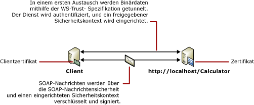

# <a name="message-security-with-a-certificate-client"></a><span data-ttu-id="5d05d-102">Nachrichtensicherheit durch einem Zertifikatclient</span><span class="sxs-lookup"><span data-stu-id="5d05d-102">Message Security with a Certificate Client</span></span>
<span data-ttu-id="5d05d-103">Das folgende Szenario zeigt, wie ein Client und ein Dienst von [!INCLUDE[indigo1](../../../../includes/indigo1-md.md)] mit dem Nachrichtensicherheitsmodus gesichert werden.</span><span class="sxs-lookup"><span data-stu-id="5d05d-103">The following scenario shows a [!INCLUDE[indigo1](../../../../includes/indigo1-md.md)] client and service secured using message security mode.</span></span> <span data-ttu-id="5d05d-104">Sowohl der Client als auch der Dienst werden mit Zertifikaten authentifiziert.</span><span class="sxs-lookup"><span data-stu-id="5d05d-104">Both the client and the service are authenticated with certificates.</span></span> [!INCLUDE[crdefault](../../../../includes/crdefault-md.md)]<span data-ttu-id="5d05d-105">[Distributed Application Security](../../../../docs/framework/wcf/feature-details/distributed-application-security.md).</span><span class="sxs-lookup"><span data-stu-id="5d05d-105"> [Distributed Application Security](../../../../docs/framework/wcf/feature-details/distributed-application-security.md).</span></span>  
  
 <span data-ttu-id="5d05d-106">Eine beispielanwendung finden Sie unter [Nachrichtensicherheitszertifikat](../../../../docs/framework/wcf/samples/message-security-certificate.md).</span><span class="sxs-lookup"><span data-stu-id="5d05d-106">For a sample application, see [Message Security Certificate](../../../../docs/framework/wcf/samples/message-security-certificate.md).</span></span>  
  
 <span data-ttu-id="5d05d-107"></span><span class="sxs-lookup"><span data-stu-id="5d05d-107"></span></span>  
  
|<span data-ttu-id="5d05d-108">Merkmal</span><span class="sxs-lookup"><span data-stu-id="5d05d-108">Characteristic</span></span>|<span data-ttu-id="5d05d-109">Beschreibung</span><span class="sxs-lookup"><span data-stu-id="5d05d-109">Description</span></span>|  
|--------------------|-----------------|  
|<span data-ttu-id="5d05d-110">Sicherheitsmodus</span><span class="sxs-lookup"><span data-stu-id="5d05d-110">Security Mode</span></span>|<span data-ttu-id="5d05d-111">Meldung</span><span class="sxs-lookup"><span data-stu-id="5d05d-111">Message</span></span>|  
|<span data-ttu-id="5d05d-112">Interoperabilität</span><span class="sxs-lookup"><span data-stu-id="5d05d-112">Interoperability</span></span>|<span data-ttu-id="5d05d-113">Nur [!INCLUDE[indigo2](../../../../includes/indigo2-md.md)]</span><span class="sxs-lookup"><span data-stu-id="5d05d-113">[!INCLUDE[indigo2](../../../../includes/indigo2-md.md)] only</span></span>|  
|<span data-ttu-id="5d05d-114">Authentifizierung (Server)</span><span class="sxs-lookup"><span data-stu-id="5d05d-114">Authentication (Server)</span></span>|<span data-ttu-id="5d05d-115">Mit Dienstzertifikat</span><span class="sxs-lookup"><span data-stu-id="5d05d-115">Using service certificate</span></span>|  
|<span data-ttu-id="5d05d-116">Authentifizierung (Client)</span><span class="sxs-lookup"><span data-stu-id="5d05d-116">Authentication (Client)</span></span>|<span data-ttu-id="5d05d-117">Mit Clientzertifikat</span><span class="sxs-lookup"><span data-stu-id="5d05d-117">Using client certificate</span></span>|  
|<span data-ttu-id="5d05d-118">Integrität</span><span class="sxs-lookup"><span data-stu-id="5d05d-118">Integrity</span></span>|<span data-ttu-id="5d05d-119">Ja</span><span class="sxs-lookup"><span data-stu-id="5d05d-119">Yes</span></span>|  
|<span data-ttu-id="5d05d-120">Vertraulichkeit</span><span class="sxs-lookup"><span data-stu-id="5d05d-120">Confidentiality</span></span>|<span data-ttu-id="5d05d-121">Ja</span><span class="sxs-lookup"><span data-stu-id="5d05d-121">Yes</span></span>|  
|<span data-ttu-id="5d05d-122">Transport</span><span class="sxs-lookup"><span data-stu-id="5d05d-122">Transport</span></span>|<span data-ttu-id="5d05d-123">HTTP</span><span class="sxs-lookup"><span data-stu-id="5d05d-123">HTTP</span></span>|  
|<span data-ttu-id="5d05d-124">Bindung</span><span class="sxs-lookup"><span data-stu-id="5d05d-124">Binding</span></span>|<xref:System.ServiceModel.WSHttpBinding>|  
  
## <a name="service"></a><span data-ttu-id="5d05d-125">Dienst</span><span class="sxs-lookup"><span data-stu-id="5d05d-125">Service</span></span>  
 <span data-ttu-id="5d05d-126">Der folgende Code und die folgende Konfiguration werden unabhängig voneinander ausgeführt.</span><span class="sxs-lookup"><span data-stu-id="5d05d-126">The following code and configuration are meant to run independently.</span></span> <span data-ttu-id="5d05d-127">Führen Sie einen der folgenden Schritte aus:</span><span class="sxs-lookup"><span data-stu-id="5d05d-127">Do one of the following:</span></span>  
  
-   <span data-ttu-id="5d05d-128">Erstellen Sie einen separaten Dienst, indem Sie den Code ohne Konfiguration verwenden.</span><span class="sxs-lookup"><span data-stu-id="5d05d-128">Create a stand-alone service using the code with no configuration.</span></span>  
  
-   <span data-ttu-id="5d05d-129">Erstellen Sie mit der angegebenen Konfiguration einen Dienst, aber definieren Sie keine Endpunkte.</span><span class="sxs-lookup"><span data-stu-id="5d05d-129">Create a service using the supplied configuration, but do not define any endpoints.</span></span>  
  
### <a name="code"></a><span data-ttu-id="5d05d-130">Code</span><span class="sxs-lookup"><span data-stu-id="5d05d-130">Code</span></span>  
 <span data-ttu-id="5d05d-131">Der folgende Code zeigt, wie Sie einen Dienstendpunkt erstellen, der zum Herstellen eines sicheren Kontextes die Nachrichtensicherheit verwendet.</span><span class="sxs-lookup"><span data-stu-id="5d05d-131">The following code shows how to create a service endpoint that uses message security to establish a secure context.</span></span>  
  
 [!code-csharp[C_SecurityScenarios#10](../../../../samples/snippets/csharp/VS_Snippets_CFX/c_securityscenarios/cs/source.cs#10)]
 [!code-vb[C_SecurityScenarios#10](../../../../samples/snippets/visualbasic/VS_Snippets_CFX/c_securityscenarios/vb/source.vb#10)]  
  
### <a name="configuration"></a><span data-ttu-id="5d05d-132">Konfiguration</span><span class="sxs-lookup"><span data-stu-id="5d05d-132">Configuration</span></span>  
 <span data-ttu-id="5d05d-133">Anstelle des Codes kann die folgende Konfiguration verwendet werden:</span><span class="sxs-lookup"><span data-stu-id="5d05d-133">The following configuration can be used instead of the code.</span></span>  
  
```xml  
<?xml version="1.0" encoding="utf-8"?>  
<configuration>  
  <system.serviceModel>  
    <behaviors>  
      <serviceBehaviors>  
        <behavior name="ServiceCredentialsBehavior">  
          <serviceCredentials>  
            <serviceCertificate findValue="Contoso.com"  
                                x509FindType="FindBySubjectName" />  
          </serviceCredentials>  
        </behavior>  
      </serviceBehaviors>  
    </behaviors>  
    <services>  
      <service behaviorConfiguration="ServiceCredentialsBehavior"   
               name="ServiceModel.Calculator">  
        <endpoint address="http://localhost/Calculator"   
                  binding="wsHttpBinding"  
                  bindingConfiguration="MessageAndCerficiateClient"   
                  name="SecuredByClientCertificate"  
                  contract="ServiceModel.ICalculator" />  
      </service>  
    </services>  
    <bindings>  
      <wsHttpBinding>  
        <binding name="WSHttpBinding_ICalculator">  
          <security mode="Message">  
            <message clientCredentialType="Certificate" />  
          </security>  
        </binding>  
      </wsHttpBinding>  
    </bindings>  
    <client />  
  </system.serviceModel>  
</configuration>  
```  
  
## <a name="client"></a><span data-ttu-id="5d05d-134">Client</span><span class="sxs-lookup"><span data-stu-id="5d05d-134">Client</span></span>  
 <span data-ttu-id="5d05d-135">Der folgende Code und die folgende Konfiguration werden unabhängig voneinander ausgeführt.</span><span class="sxs-lookup"><span data-stu-id="5d05d-135">The following code and configuration are meant to run independently.</span></span> <span data-ttu-id="5d05d-136">Führen Sie einen der folgenden Schritte aus:</span><span class="sxs-lookup"><span data-stu-id="5d05d-136">Do one of the following:</span></span>  
  
-   <span data-ttu-id="5d05d-137">Erstellen Sie mit dem Code (und Clientcode) einen eigenständigen Client.</span><span class="sxs-lookup"><span data-stu-id="5d05d-137">Create a stand-alone client using the code (and client code).</span></span>  
  
-   <span data-ttu-id="5d05d-138">Erstellen Sie einen Client, der keine Endpunktadressen definiert.</span><span class="sxs-lookup"><span data-stu-id="5d05d-138">Create a client that does not define any endpoint addresses.</span></span> <span data-ttu-id="5d05d-139">Verwenden Sie stattdessen den Clientkonstruktor, der den Konfigurationsnamen als Argument verwendet.</span><span class="sxs-lookup"><span data-stu-id="5d05d-139">Instead, use the client constructor that takes the configuration name as an argument.</span></span> <span data-ttu-id="5d05d-140">Beispiel:</span><span class="sxs-lookup"><span data-stu-id="5d05d-140">For example:</span></span>  
  
     [!code-csharp[C_SecurityScenarios#0](../../../../samples/snippets/csharp/VS_Snippets_CFX/c_securityscenarios/cs/source.cs#0)]
     [!code-vb[C_SecurityScenarios#0](../../../../samples/snippets/visualbasic/VS_Snippets_CFX/c_securityscenarios/vb/source.vb#0)]  
  
### <a name="code"></a><span data-ttu-id="5d05d-141">Code</span><span class="sxs-lookup"><span data-stu-id="5d05d-141">Code</span></span>  
 <span data-ttu-id="5d05d-142">Der folgende Code erstellt den Client.</span><span class="sxs-lookup"><span data-stu-id="5d05d-142">The following code creates the client.</span></span> <span data-ttu-id="5d05d-143">Die Bindung bezieht sich auf den Nachrichtensicherheitsmodus, und der Clientanmeldeinformationstyp wird auf `Certificate` festgelegt.</span><span class="sxs-lookup"><span data-stu-id="5d05d-143">The binding is to message mode security, and the client credential type is set to `Certificate`.</span></span>  
  
 [!code-csharp[C_SecurityScenarios#17](../../../../samples/snippets/csharp/VS_Snippets_CFX/c_securityscenarios/cs/source.cs#17)]
 [!code-vb[C_SecurityScenarios#17](../../../../samples/snippets/visualbasic/VS_Snippets_CFX/c_securityscenarios/vb/source.vb#17)]  
  
### <a name="configuration"></a><span data-ttu-id="5d05d-144">Konfiguration</span><span class="sxs-lookup"><span data-stu-id="5d05d-144">Configuration</span></span>  
 <span data-ttu-id="5d05d-145">Die folgende Konfiguration gibt das Clientzertifikat mit einem Endpunktverhalten an.</span><span class="sxs-lookup"><span data-stu-id="5d05d-145">The following configuration specifies the client certificate using an endpoint behavior.</span></span> <span data-ttu-id="5d05d-146">Weitere Informationen zu Zertifikaten finden Sie unter [Arbeiten mit Zertifikaten](../../../../docs/framework/wcf/feature-details/working-with-certificates.md).</span><span class="sxs-lookup"><span data-stu-id="5d05d-146">For more information about certificates, see [Working with Certificates](../../../../docs/framework/wcf/feature-details/working-with-certificates.md).</span></span> <span data-ttu-id="5d05d-147">Der Code verwendet zudem eine <`identity`> Element, um einen DNS Domain Name System () der Serveridentität des erwarteten anzugeben.</span><span class="sxs-lookup"><span data-stu-id="5d05d-147">The code also uses an <`identity`> element to specify a Domain Name System (DNS) of the expected server identity.</span></span> [!INCLUDE[crabout](../../../../includes/crabout-md.md)]<span data-ttu-id="5d05d-148">Identität, finden Sie unter [-Dienstidentität und Authentifizierung](../../../../docs/framework/wcf/feature-details/service-identity-and-authentication.md).</span><span class="sxs-lookup"><span data-stu-id="5d05d-148"> identity, see [Service Identity and Authentication](../../../../docs/framework/wcf/feature-details/service-identity-and-authentication.md).</span></span>  
  
```xml  
<?xml version="1.0" encoding="utf-8"?>  
<configuration>  
  <system.serviceModel>  
    <behaviors>  
      <endpointBehaviors>  
        <behavior name="endpointCredentialsBehavior">  
          <clientCredentials>  
            <clientCertificate findValue="Cohowinery.com"   
               storeLocation="LocalMachine"  
              x509FindType="FindBySubjectName" />  
          </clientCredentials>  
        </behavior>  
      </endpointBehaviors>  
    </behaviors>  
    <bindings>  
      <wsHttpBinding>  
        <binding name="WSHttpBinding_ICalculator" >  
          <security mode="Message">  
            <message clientCredentialType="Certificate" />  
          </security>  
        </binding>  
      </wsHttpBinding>  
    </bindings>  
    <client>  
      <endpoint address="http://machineName/Calculator"   
                behaviorConfiguration="endpointCredentialsBehavior"  
                binding="wsHttpBinding"  
                bindingConfiguration="WSHttpBinding_ICalculator"  
                contract="ICalculator"  
                name="WSHttpBinding_ICalculator">  
        <identity>  
          <dns value="Contoso.com" />  
        </identity>  
      </endpoint>  
    </client>  
  </system.serviceModel>  
</configuration>  
```  
  
## <a name="see-also"></a><span data-ttu-id="5d05d-149">Siehe auch</span><span class="sxs-lookup"><span data-stu-id="5d05d-149">See Also</span></span>  
 [<span data-ttu-id="5d05d-150">Übersicht über die Sicherheit</span><span class="sxs-lookup"><span data-stu-id="5d05d-150">Security Overview</span></span>](../../../../docs/framework/wcf/feature-details/security-overview.md)  
 [<span data-ttu-id="5d05d-151">Dienstidentität und Authentifizierung</span><span class="sxs-lookup"><span data-stu-id="5d05d-151">Service Identity and Authentication</span></span>](../../../../docs/framework/wcf/feature-details/service-identity-and-authentication.md)  
 [<span data-ttu-id="5d05d-152">Arbeiten mit Zertifikaten</span><span class="sxs-lookup"><span data-stu-id="5d05d-152">Working with Certificates</span></span>](../../../../docs/framework/wcf/feature-details/working-with-certificates.md)  
 [<span data-ttu-id="5d05d-153">Sicherheitsmodell für Windows Server AppFabric</span><span class="sxs-lookup"><span data-stu-id="5d05d-153">Security Model for Windows Server App Fabric</span></span>](http://go.microsoft.com/fwlink/?LinkID=201279&clcid=0x409)
