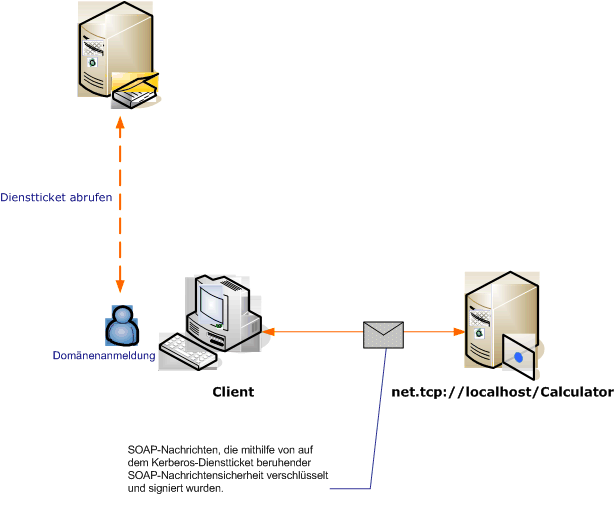

# <a name="message-security-with-a-windows-client-without-credential-negotiation"></a><span data-ttu-id="e0ee5-102">Nachrichtensicherheit mit einem Windows-Client ohne Anmeldeinformationen-Aushandlung</span><span class="sxs-lookup"><span data-stu-id="e0ee5-102">Message Security with a Windows Client without Credential Negotiation</span></span>

<span data-ttu-id="e0ee5-103">Das folgende Szenario zeigt einen Windows Communication Foundation (WCF)-Client und-Dienst, der durch das Kerberos-Protokoll gesichert wird.</span><span class="sxs-lookup"><span data-stu-id="e0ee5-103">The following scenario shows a Windows Communication Foundation (WCF) client and service secured by the Kerberos protocol.</span></span>

<span data-ttu-id="e0ee5-104">Sowohl der Dienst als auch der Client befinden sich in der gleichen Domäne bzw. in den gleichen vertrauenswürdigen Domänen.</span><span class="sxs-lookup"><span data-stu-id="e0ee5-104">Both the service and the client are in the same domain or trusted domains.</span></span>

> [!NOTE]
> <span data-ttu-id="e0ee5-105">Der Unterschied zwischen diesem Szenario und der [Nachrichten Sicherheit mit einem Windows-Client](message-security-with-a-windows-client.md) besteht darin, dass in diesem Szenario vor dem Senden der Anwendungs Nachricht nicht die Dienst Anmelde Informationen mit dem Dienst ausgehandelt werden.</span><span class="sxs-lookup"><span data-stu-id="e0ee5-105">The difference between this scenario and [Message Security with a Windows Client](message-security-with-a-windows-client.md) is that this scenario does not negotiate the service credential with the service prior to sending the application message.</span></span> <span data-ttu-id="e0ee5-106">Da hierzu das Kerberos-Protokoll erforderlich ist, muss für dieses Szenario auch eine Windows-Domänenumgebung vorhanden sein.</span><span class="sxs-lookup"><span data-stu-id="e0ee5-106">Additionally, because this requires the Kerberos protocol, this scenario requires a Windows domain environment.</span></span>

<span data-ttu-id="e0ee5-107"></span><span class="sxs-lookup"><span data-stu-id="e0ee5-107"></span></span>

|<span data-ttu-id="e0ee5-108">Merkmal</span><span class="sxs-lookup"><span data-stu-id="e0ee5-108">Characteristic</span></span>|<span data-ttu-id="e0ee5-109">BESCHREIBUNG</span><span class="sxs-lookup"><span data-stu-id="e0ee5-109">Description</span></span>|
|--------------------|-----------------|
|<span data-ttu-id="e0ee5-110">Sicherheitsmodus</span><span class="sxs-lookup"><span data-stu-id="e0ee5-110">Security Mode</span></span>|<span data-ttu-id="e0ee5-111">`Message`</span><span class="sxs-lookup"><span data-stu-id="e0ee5-111">Message</span></span>|
|<span data-ttu-id="e0ee5-112">Interoperabilität</span><span class="sxs-lookup"><span data-stu-id="e0ee5-112">Interoperability</span></span>|<span data-ttu-id="e0ee5-113">Ja, WS-Security mit Clients mit Kerberos-Tokenprofilkompatibilität</span><span class="sxs-lookup"><span data-stu-id="e0ee5-113">Yes, WS-Security with Kerberos token-profile compatible clients</span></span>|
|<span data-ttu-id="e0ee5-114">Authentifizierung (Server)</span><span class="sxs-lookup"><span data-stu-id="e0ee5-114">Authentication (Server)</span></span>|<span data-ttu-id="e0ee5-115">Gegenseitige Authentifizierung des Servers und des Clients</span><span class="sxs-lookup"><span data-stu-id="e0ee5-115">Mutual authentication of the server and client</span></span>|
|<span data-ttu-id="e0ee5-116">Authentifizierung (Client)</span><span class="sxs-lookup"><span data-stu-id="e0ee5-116">Authentication (Client)</span></span>|<span data-ttu-id="e0ee5-117">Gegenseitige Authentifizierung des Servers und des Clients</span><span class="sxs-lookup"><span data-stu-id="e0ee5-117">Mutual authentication of the server and client</span></span>|
|<span data-ttu-id="e0ee5-118">Integrität</span><span class="sxs-lookup"><span data-stu-id="e0ee5-118">Integrity</span></span>|<span data-ttu-id="e0ee5-119">Ja</span><span class="sxs-lookup"><span data-stu-id="e0ee5-119">Yes</span></span>|
|<span data-ttu-id="e0ee5-120">Vertraulichkeit</span><span class="sxs-lookup"><span data-stu-id="e0ee5-120">Confidentiality</span></span>|<span data-ttu-id="e0ee5-121">Ja</span><span class="sxs-lookup"><span data-stu-id="e0ee5-121">Yes</span></span>|
|<span data-ttu-id="e0ee5-122">Transport</span><span class="sxs-lookup"><span data-stu-id="e0ee5-122">Transport</span></span>|<span data-ttu-id="e0ee5-123">HTTP</span><span class="sxs-lookup"><span data-stu-id="e0ee5-123">HTTP</span></span>|
|<span data-ttu-id="e0ee5-124">Bindung</span><span class="sxs-lookup"><span data-stu-id="e0ee5-124">Binding</span></span>|<xref:System.ServiceModel.WSHttpBinding>|

## <a name="service"></a><span data-ttu-id="e0ee5-125">Dienst</span><span class="sxs-lookup"><span data-stu-id="e0ee5-125">Service</span></span>

<span data-ttu-id="e0ee5-126">Der folgende Code und die folgende Konfiguration werden unabhängig voneinander ausgeführt.</span><span class="sxs-lookup"><span data-stu-id="e0ee5-126">The following code and configuration are meant to run independently.</span></span> <span data-ttu-id="e0ee5-127">Führen Sie einen der folgenden Schritte aus:</span><span class="sxs-lookup"><span data-stu-id="e0ee5-127">Do one of the following:</span></span>

- <span data-ttu-id="e0ee5-128">Erstellen Sie einen separaten Dienst, indem Sie den Code ohne Konfiguration verwenden.</span><span class="sxs-lookup"><span data-stu-id="e0ee5-128">Create a stand-alone service using the code with no configuration.</span></span>

- <span data-ttu-id="e0ee5-129">Erstellen Sie mit der angegebenen Konfiguration einen Dienst, aber definieren Sie keine Endpunkte.</span><span class="sxs-lookup"><span data-stu-id="e0ee5-129">Create a service using the supplied configuration, but do not define any endpoints.</span></span>

### <a name="code"></a><span data-ttu-id="e0ee5-130">Code</span><span class="sxs-lookup"><span data-stu-id="e0ee5-130">Code</span></span>

<span data-ttu-id="e0ee5-131">Der folgende Code dient zum Erstellen eines Dienstendpunkts mit Nachrichtensicherheit.</span><span class="sxs-lookup"><span data-stu-id="e0ee5-131">The following code creates a service endpoint that uses message security.</span></span> <span data-ttu-id="e0ee5-132">Mit diesem Code wird das Aushandeln der Dienstanmeldeinformationen sowie das Einrichten eines Sicherheitskontexttokens (Security Context Token, SCT) deaktiviert.</span><span class="sxs-lookup"><span data-stu-id="e0ee5-132">The code disables service credential negotiation, and the establishment of a security context token (SCT).</span></span>

> [!NOTE]
> <span data-ttu-id="e0ee5-133">Zur Verwendung des Windows-Anmeldeinformationstyps ohne Aushandlung muss das Benutzerkonto des Diensts Zugriff auf den bei der Active Directory-Domäne registrierten Dienstprinzipalnamen (Service Principal Name, SPN) haben.</span><span class="sxs-lookup"><span data-stu-id="e0ee5-133">To use the Windows credential type without negotiation, the service's user account must have access to service principal name (SPN) that is registered with the Active Directory domain.</span></span> <span data-ttu-id="e0ee5-134">Hierzu stehen zwei Möglichkeiten zur Verfügung:</span><span class="sxs-lookup"><span data-stu-id="e0ee5-134">You can do this in two ways:</span></span>

1. <span data-ttu-id="e0ee5-135">Verwenden Sie das `NetworkService`-Konto oder das `LocalSystem`-Konto, um den Dienst auszuführen.</span><span class="sxs-lookup"><span data-stu-id="e0ee5-135">Use the `NetworkService` or `LocalSystem` account to run your service.</span></span> <span data-ttu-id="e0ee5-136">Da diese Konten Zugriff auf den Computer-SPN haben, der hergestellt wird, wenn der Computer der Active Directory Domäne Beitritt, generiert WCF automatisch das entsprechende SPN-Element innerhalb des Dienst-Endpunkts in den Metadaten des dienstanders (Web Services Description Language oder WSDL).</span><span class="sxs-lookup"><span data-stu-id="e0ee5-136">Because those accounts have access to the machine SPN that is established when the machine joins the Active Directory domain, WCF automatically generates the proper SPN element inside the service's endpoint in the service's metadata (Web Services Description Language, or WSDL).</span></span>

2. <span data-ttu-id="e0ee5-137">Verwenden Sie ein beliebiges Active Directory-Domänenkonto, um den Dienst auszuführen.</span><span class="sxs-lookup"><span data-stu-id="e0ee5-137">Use an arbitrary Active Directory domain account to run your service.</span></span> <span data-ttu-id="e0ee5-138">In diesem Fall muss für das Domänenkonto ein SPN eingerichtet werden.</span><span class="sxs-lookup"><span data-stu-id="e0ee5-138">In this case, you need to establish an SPN for that domain account.</span></span> <span data-ttu-id="e0ee5-139">Eine mögliche Vorgehensweise hierzu besteht in der Verwendung des Tools Setspn.exe.</span><span class="sxs-lookup"><span data-stu-id="e0ee5-139">One way of doing this is to use the Setspn.exe utility tool.</span></span> <span data-ttu-id="e0ee5-140">Nachdem der SPN für das Dienst Konto erstellt wurde, konfigurieren Sie WCF so, dass dieser SPN über seine Metadaten (WSDL) auf den Clients des dienstanders veröffentlicht wird.</span><span class="sxs-lookup"><span data-stu-id="e0ee5-140">Once the SPN is created for the service's account, configure WCF to publish that SPN to the service's clients through its metadata (WSDL).</span></span> <span data-ttu-id="e0ee5-141">Legen Sie hierzu die Endpunktidentität für den angezeigten Endpunkt entweder mit einer Anwendungskonfigurationsdatei oder mit Code fest.</span><span class="sxs-lookup"><span data-stu-id="e0ee5-141">This is done by setting the endpoint identity for the exposed endpoint, either though an application configuration file or code.</span></span> <span data-ttu-id="e0ee5-142">Im folgenden Beispiel wird die Identität programmgesteuert veröffentlicht:</span><span class="sxs-lookup"><span data-stu-id="e0ee5-142">The following example publishes the identity programmatically.</span></span>

<span data-ttu-id="e0ee5-143">Weitere Informationen zu SPNs, zum Kerberos-Protokoll und Active Directory finden Sie in der [technischen Ergänzung zu Kerberos für Windows](https://docs.microsoft.com/previous-versions/msp-n-p/ff649429(v=pandp.10)).</span><span class="sxs-lookup"><span data-stu-id="e0ee5-143">For more information about SPNs, the Kerberos protocol, and Active Directory, see [Kerberos Technical Supplement for Windows](https://docs.microsoft.com/previous-versions/msp-n-p/ff649429(v=pandp.10)).</span></span> <span data-ttu-id="e0ee5-144">Weitere Informationen zu Endpunkt Identitäten finden Sie unter [SecurityBindingElement-Authentifizierungs Modi](securitybindingelement-authentication-modes.md).</span><span class="sxs-lookup"><span data-stu-id="e0ee5-144">For more information about endpoint identities, see [SecurityBindingElement Authentication Modes](securitybindingelement-authentication-modes.md).</span></span>

[!code-csharp[C_SecurityScenarios#12](../../../../samples/snippets/csharp/VS_Snippets_CFX/c_securityscenarios/cs/source.cs#12)]
[!code-vb[C_SecurityScenarios#12](../../../../samples/snippets/visualbasic/VS_Snippets_CFX/c_securityscenarios/vb/source.vb#12)]

### <a name="configuration"></a><span data-ttu-id="e0ee5-145">Konfiguration</span><span class="sxs-lookup"><span data-stu-id="e0ee5-145">Configuration</span></span>

<span data-ttu-id="e0ee5-146">Anstelle des Codes kann die folgende Konfiguration verwendet werden:</span><span class="sxs-lookup"><span data-stu-id="e0ee5-146">The following configuration can be used instead of the code.</span></span>

```xml
<?xml version="1.0" encoding="utf-8"?>
<configuration>
  <system.serviceModel>
    <behaviors />
    <services>
      <service behaviorConfiguration="" name="ServiceModel.Calculator">
        <endpoint address="http://localhost/Calculator"
                  binding="wsHttpBinding"
                  bindingConfiguration="KerberosBinding"
                  name="WSHttpBinding_ICalculator"
                  contract="ServiceModel.ICalculator"
                  listenUri="net.tcp://localhost/metadata" >
         <identity>
            <servicePrincipalName value="service_spn_name" />
         </identity>
        </endpoint>
      </service>
    </services>
    <bindings>
      <wsHttpBinding>
        <binding name="KerberosBinding">
          <security>
            <message negotiateServiceCredential="false"
                     establishSecurityContext="false" />
          </security>
        </binding>
      </wsHttpBinding>
    </bindings>
    <client />
  </system.serviceModel>
</configuration>
```

## <a name="client"></a><span data-ttu-id="e0ee5-147">Client</span><span class="sxs-lookup"><span data-stu-id="e0ee5-147">Client</span></span>

<span data-ttu-id="e0ee5-148">Der folgende Code und die folgende Konfiguration werden unabhängig voneinander ausgeführt.</span><span class="sxs-lookup"><span data-stu-id="e0ee5-148">The following code and configuration are meant to run independently.</span></span> <span data-ttu-id="e0ee5-149">Führen Sie einen der folgenden Schritte aus:</span><span class="sxs-lookup"><span data-stu-id="e0ee5-149">Do one of the following:</span></span>

- <span data-ttu-id="e0ee5-150">Erstellen Sie mit dem Code (und Clientcode) einen eigenständigen Client.</span><span class="sxs-lookup"><span data-stu-id="e0ee5-150">Create a stand-alone client using the code (and client code).</span></span>

- <span data-ttu-id="e0ee5-151">Erstellen Sie einen Client, der keine Endpunktadressen definiert.</span><span class="sxs-lookup"><span data-stu-id="e0ee5-151">Create a client that does not define any endpoint addresses.</span></span> <span data-ttu-id="e0ee5-152">Verwenden Sie stattdessen den Clientkonstruktor, der den Konfigurationsnamen als Argument verwendet.</span><span class="sxs-lookup"><span data-stu-id="e0ee5-152">Instead, use the client constructor that takes the configuration name as an argument.</span></span> <span data-ttu-id="e0ee5-153">Beispiel:</span><span class="sxs-lookup"><span data-stu-id="e0ee5-153">For example:</span></span>

  [!code-csharp[C_SecurityScenarios#0](../../../../samples/snippets/csharp/VS_Snippets_CFX/c_securityscenarios/cs/source.cs#0)]
  [!code-vb[C_SecurityScenarios#0](../../../../samples/snippets/visualbasic/VS_Snippets_CFX/c_securityscenarios/vb/source.vb#0)]

### <a name="code"></a><span data-ttu-id="e0ee5-154">Code</span><span class="sxs-lookup"><span data-stu-id="e0ee5-154">Code</span></span>

<span data-ttu-id="e0ee5-155">Der folgende Code dient zum Konfigurieren des Clients.</span><span class="sxs-lookup"><span data-stu-id="e0ee5-155">The following code configures the client.</span></span> <span data-ttu-id="e0ee5-156">Der Sicherheitsmodus ist auf Nachrichtensicherheit, der Typ der Clientanmeldeinformationen auf Windows festgelegt.</span><span class="sxs-lookup"><span data-stu-id="e0ee5-156">The security mode is set to Message, and the client credential type is set to Windows.</span></span> <span data-ttu-id="e0ee5-157">Die Eigenschaften <xref:System.ServiceModel.MessageSecurityOverHttp.NegotiateServiceCredential%2A> und <xref:System.ServiceModel.NonDualMessageSecurityOverHttp.EstablishSecurityContext%2A> sind auf `false` festgelegt.</span><span class="sxs-lookup"><span data-stu-id="e0ee5-157">Note that the <xref:System.ServiceModel.MessageSecurityOverHttp.NegotiateServiceCredential%2A> and <xref:System.ServiceModel.NonDualMessageSecurityOverHttp.EstablishSecurityContext%2A> properties are set to `false`.</span></span>

> [!NOTE]
> <span data-ttu-id="e0ee5-158">Zur Verwendung des Windows-Anmeldeinformationstyps ohne Aushandlung muss der Client vor dem Starten der Kommunikation mit dem Dienst mit dem Konto-SPN des Diensts konfiguriert werden.</span><span class="sxs-lookup"><span data-stu-id="e0ee5-158">To use Windows credential type without negotiation, the client must be configured with the service's account SPN prior to commencing the communication with the service.</span></span> <span data-ttu-id="e0ee5-159">Der SPN wird vom Client zum Abrufen des Kerberos-Tokens verwendet, um damit die Kommunikation mit dem Dienst zu authentifizieren und zu sichern.</span><span class="sxs-lookup"><span data-stu-id="e0ee5-159">The client uses the SPN to get the Kerberos token to authenticate and secure the communication with the service.</span></span> <span data-ttu-id="e0ee5-160">Im folgenden Beispiel wird das Konfigurieren des Clients mit dem SPN des Diensts veranschaulicht.</span><span class="sxs-lookup"><span data-stu-id="e0ee5-160">The following sample shows how to configure the client with the service's SPN.</span></span> <span data-ttu-id="e0ee5-161">Wenn Sie das [Service Model Metadata Utility-Tool (Svcutil. exe)](../servicemodel-metadata-utility-tool-svcutil-exe.md) verwenden, um den Client zu generieren, wird der SPN des dienstanders automatisch aus den Metadaten des dienstangs (WSDL) an den Client weitergegeben, wenn die Metadaten des dienstanders diese Informationen enthalten.</span><span class="sxs-lookup"><span data-stu-id="e0ee5-161">If you are using the [ServiceModel Metadata Utility Tool (Svcutil.exe)](../servicemodel-metadata-utility-tool-svcutil-exe.md) to generate the client, the service's SPN will be automatically propagated to the client from the service's metadata (WSDL), if the service's metadata contains that information.</span></span> <span data-ttu-id="e0ee5-162">Weitere Informationen dazu, wie Sie den Dienst so konfigurieren, dass der zugehörige SPN in die Metadaten des dienstanznamens eingeschlossen wird, finden Sie weiter unten in diesem Thema im Abschnitt "Dienst".</span><span class="sxs-lookup"><span data-stu-id="e0ee5-162">For more information about how to configure the service to include its SPN in the service's metadata, see the "Service" section later in this topic .</span></span>
>
> <span data-ttu-id="e0ee5-163">Weitere Informationen zu SPNs, Kerberos und Active Directory finden Sie in der [technischen Ergänzung zu Kerberos für Windows](https://docs.microsoft.com/previous-versions/msp-n-p/ff649429(v=pandp.10)).</span><span class="sxs-lookup"><span data-stu-id="e0ee5-163">For more information about SPNs, Kerberos, and Active Directory, see [Kerberos Technical Supplement for Windows](https://docs.microsoft.com/previous-versions/msp-n-p/ff649429(v=pandp.10)).</span></span> <span data-ttu-id="e0ee5-164">Weitere Informationen zu Endpunkt Identitäten finden Sie im Thema [SecurityBindingElement-Authentifizierungs Modi](securitybindingelement-authentication-modes.md) .</span><span class="sxs-lookup"><span data-stu-id="e0ee5-164">For more information about endpoint identities, see [SecurityBindingElement Authentication Modes](securitybindingelement-authentication-modes.md) topic.</span></span>

[!code-csharp[C_SecurityScenarios#19](../../../../samples/snippets/csharp/VS_Snippets_CFX/c_securityscenarios/cs/source.cs#19)]
[!code-vb[C_SecurityScenarios#19](../../../../samples/snippets/visualbasic/VS_Snippets_CFX/c_securityscenarios/vb/source.vb#19)]

### <a name="configuration"></a><span data-ttu-id="e0ee5-165">Konfiguration</span><span class="sxs-lookup"><span data-stu-id="e0ee5-165">Configuration</span></span>

<span data-ttu-id="e0ee5-166">Der folgende Code dient zum Konfigurieren des Clients.</span><span class="sxs-lookup"><span data-stu-id="e0ee5-166">The following code configures the client.</span></span> <span data-ttu-id="e0ee5-167">Beachten Sie, dass das [\<servicePrincipalName>](../../configure-apps/file-schema/wcf/serviceprincipalname.md) -Element so festgelegt werden muss, dass es dem Dienst Prinzipal Namen, der für das Dienst Konto in der Active Directory Domäne registriert ist, entspricht.</span><span class="sxs-lookup"><span data-stu-id="e0ee5-167">Note that the [\<servicePrincipalName>](../../configure-apps/file-schema/wcf/serviceprincipalname.md) element must be set to match the service's SPN as registered for the service's account in the Active Directory domain.</span></span>

```xml
<?xml version="1.0" encoding="utf-8"?>
<configuration>
  <system.serviceModel>
    <bindings>
      <wsHttpBinding>
        <binding name="WSHttpBinding_ICalculator" >
          <security mode="Message">
            <message clientCredentialType="Windows"
                     negotiateServiceCredential="false"
                     establishSecurityContext="false" />
          </security>
        </binding>
      </wsHttpBinding>
    </bindings>
    <client>
      <endpoint address="http://localhost/Calculator"
                binding="wsHttpBinding"
                bindingConfiguration="WSHttpBinding_ICalculator"
                contract="ICalculator"
                name="WSHttpBinding_ICalculator">
        <identity>
          <servicePrincipalName value="service_spn_name" />
        </identity>
      </endpoint>
    </client>
  </system.serviceModel>
</configuration>
```

## <a name="see-also"></a><span data-ttu-id="e0ee5-168">Weitere Informationen</span><span class="sxs-lookup"><span data-stu-id="e0ee5-168">See also</span></span>

- [<span data-ttu-id="e0ee5-169">Sicherheitsübersicht</span><span class="sxs-lookup"><span data-stu-id="e0ee5-169">Security Overview</span></span>](security-overview.md)
- [<span data-ttu-id="e0ee5-170">Dienstidentität und Authentifizierung</span><span class="sxs-lookup"><span data-stu-id="e0ee5-170">Service Identity and Authentication</span></span>](service-identity-and-authentication.md)
- <span data-ttu-id="e0ee5-171">[Sicherheitsmodell für Windows Server AppFabric](https://docs.microsoft.com/previous-versions/appfabric/ee677202(v=azure.10))</span><span class="sxs-lookup"><span data-stu-id="e0ee5-171">[Security Model for Windows Server App Fabric](https://docs.microsoft.com/previous-versions/appfabric/ee677202(v=azure.10))</span></span>
