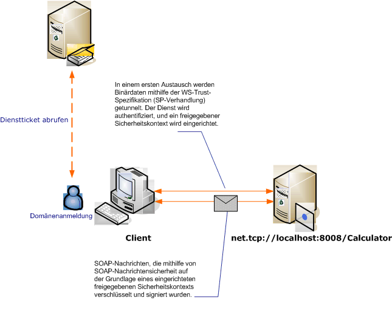

# <a name="message-security-with-a-windows-client"></a>Nachrichtensicherheit über einen Windows-Client
Dieses Szenario zeigt einen Windows Communication Foundation (WCF)-Client und -Server, der durch den Nachrichtensicherheitsmodus gesichert ist. Client und Dienst werden mit Windows-Anmeldeinformationen authentifiziert.  
  
   
  
|Merkmal|Beschreibung|  
|--------------------|-----------------|  
|Sicherheitsmodus|`Message`|  
|Interoperabilität|Nur WCF|  
|Authentifizierung (Server)|Gegenseitige Authentifizierung des Servers und des Clients|  
|Authentifizierung (Client)|Gegenseitige Authentifizierung des Servers und des Clients|  
|Integrität|Ja, mit freigegebenem Sicherheitskontext|  
|Vertraulichkeit|Ja, mit freigegebenem Sicherheitskontext|  
|Transport|NET.TCP|  
|Bindung|<xref:System.ServiceModel.NetTcpBinding>|  
  
## <a name="service"></a>Dienst  
 Der folgende Code und die folgende Konfiguration werden unabhängig voneinander ausgeführt. Führen Sie eines der folgenden Verfahren aus:  
  
- Erstellen Sie einen separaten Dienst, indem Sie den Code ohne Konfiguration verwenden.  
  
- Erstellen Sie mit der angegebenen Konfiguration einen Dienst, aber definieren Sie keine Endpunkte.  
  
### <a name="code"></a>Code  
 Der folgende Code zeigt, wie Sie einen Dienstendpunkt erstellen, der die Nachrichtensicherheit zum Herstellen eines sicheren Kontexts mit einem Windows-Computer verwendet.  
  
 [!code-csharp[C_SecurityScenarios#11](../../../../samples/snippets/csharp/VS_Snippets_CFX/c_securityscenarios/cs/source.cs#11)]
 [!code-vb[C_SecurityScenarios#11](../../../../samples/snippets/visualbasic/VS_Snippets_CFX/c_securityscenarios/vb/source.vb#11)]  
  
### <a name="configuration"></a>Konfiguration  
 Die folgende Konfiguration kann statt des Codes zum Einrichten des Diensts verwendet werden:  
  
```xml  
<?xml version="1.0" encoding="utf-8"?>  
<configuration>  
  <system.serviceModel>  
    <services>  
      <service behaviorConfiguration=""  
               name="ServiceModel.Calculator">  
        <endpoint address="net.tcp://localhost:8008/Calculator"  
                  binding="netTcpBinding"  
                  bindingConfiguration="Windows"  
                  name="WindowsOverMessage"  
                  contract="ServiceModel.ICalculator" />  
      </service>  
    </services>  
    <bindings>  
      <netTcpBinding>  
        <binding name="Windows">  
          <security mode="Message">  
            <message clientCredentialType="Windows" />  
          </security>  
        </binding>  
      </netTcpBinding>  
    </bindings>  
    <client />  
  </system.serviceModel>  
</configuration>  
```  
  
## <a name="client"></a>Client  
 Der folgende Code und die folgende Konfiguration werden unabhängig voneinander ausgeführt. Führen Sie eines der folgenden Verfahren aus:  
  
- Erstellen Sie mit dem Code (und Clientcode) einen eigenständigen Client.  
  
- Erstellen Sie einen Client, der keine Endpunktadressen definiert. Verwenden Sie stattdessen den Clientkonstruktor, der den Konfigurationsnamen als Argument verwendet. Beispiel:  
  
     [!code-csharp[C_SecurityScenarios#0](../../../../samples/snippets/csharp/VS_Snippets_CFX/c_securityscenarios/cs/source.cs#0)]
     [!code-vb[C_SecurityScenarios#0](../../../../samples/snippets/visualbasic/VS_Snippets_CFX/c_securityscenarios/vb/source.vb#0)]  
  
### <a name="code"></a>Code  
 Mit dem folgenden Code wird ein Client erstellt. Die Bindung bezieht sich auf den Nachrichtensicherheitsmodus, und der Clientanmeldeinformationstyp wird auf `Windows` festgelegt.  
  
 [!code-csharp[C_SecurityScenarios#18](../../../../samples/snippets/csharp/VS_Snippets_CFX/c_securityscenarios/cs/source.cs#18)]
 [!code-vb[C_SecurityScenarios#18](../../../../samples/snippets/visualbasic/VS_Snippets_CFX/c_securityscenarios/vb/source.vb#18)]  
  
### <a name="configuration"></a>Konfiguration  
 Die folgende Konfiguration wird zum Festlegen der Clienteigenschaften verwendet.  
  
```xml  
<?xml version="1.0" encoding="utf-8"?>  
<configuration>  
  <system.serviceModel>  
    <bindings>  
      <netTcpBinding>  
        <binding name="NetTcpBinding_ICalculator" >  
         <security mode="Message">  
            <message clientCredentialType="Windows" />  
          </security>  
        </binding>  
      </netTcpBinding>  
    </bindings>  
    <client>  
      <endpoint address="net.tcp://machineName:8008/Calculator"
                binding="netTcpBinding"  
                bindingConfiguration="NetTcpBinding_ICalculator"  
                contract="ICalculator"  
                name="NetTcpBinding_ICalculator">
      </endpoint>  
    </client>  
  </system.serviceModel>  
</configuration>  
```  
  
## <a name="see-also"></a>Weitere Informationen

- [Sicherheitsübersicht](../../../../docs/framework/wcf/feature-details/security-overview.md)
- [Sicherheitsmodell für Windows Server AppFabric](https://docs.microsoft.com/previous-versions/appfabric/ee677202(v=azure.10))
