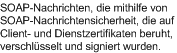

# <a name="message-security-with-mutual-certificates"></a>Nachrichtensicherheit durch gegenseitige Zertifikate
Das folgende Szenario zeigt einen Windows Communication Foundation (WCF)-Dienst und einen Client, der mithilfe des Nachrichten Sicherheitsmodus gesichert wurde. Sowohl der Client als auch der Dienst werden mit Zertifikaten authentifiziert.  
  
 Dieses Szenario ist interoperabel, da es WS-Sicherheit mit dem X.509-Zertifikatstokenprofil verwendet.  
  
> [!NOTE]
> Dieses Szenario führt keine Aushandlung für das Dienstzertifikat aus. Das Dienstzertifikat muss dem Client vor jeder Kommunikation bereitgestellt werden. Das Serverzertifikat kann mit der Anwendung oder im Rahmen einer Out-of-Band-Kommunikation bereitgestellt werden.  
  
   
  
|Merkmal|BESCHREIBUNG|  
|--------------------|-----------------|  
|Sicherheitsmodus|Nachricht|  
|Interoperabilität|Ja, mit WS-Sicherheit und X.509-Zertifikatstokenprofil kompatible Clients und Dienste.|  
|Authentifizierung|Gegenseitige Authentifizierung des Servers und des Clients.|  
|Integrität|Ja|  
|Vertraulichkeit|Ja|  
|Transport|HTTP|  
|Bindung|<xref:System.ServiceModel.WSHttpBinding>|  
  
## <a name="service"></a>Dienst  
 Der folgende Code und die folgende Konfiguration werden unabhängig voneinander ausgeführt. Führen Sie eines der folgenden Verfahren aus:  
  
- Erstellen Sie einen separaten Dienst, indem Sie den Code ohne Konfiguration verwenden.  
  
- Erstellen Sie mit der angegebenen Konfiguration einen Dienst, aber definieren Sie keine Endpunkte.  
  
### <a name="code"></a>Code  
 Im folgenden Code wird gezeigt, wie ein Dienstendpunkt, der Nachrichtensicherheit verwendet, erstellt wird. Der Dienst benötigt ein Zertifikat, um sich zu authentifizieren.  
  
 [!code-csharp[C_SecurityScenarios#13](../../../../samples/snippets/csharp/VS_Snippets_CFX/c_securityscenarios/cs/source.cs#13)]
 [!code-vb[C_SecurityScenarios#13](../../../../samples/snippets/visualbasic/VS_Snippets_CFX/c_securityscenarios/vb/source.vb#13)]  
  
### <a name="configuration"></a>Konfiguration  
 Die folgende Konfiguration kann statt des Codes verwendet werden, um denselben Dienst einzurichten.  
  
```xml  
<?xml version="1.0" encoding="utf-8"?>  
<configuration>  
  <system.serviceModel>  
    <behaviors>  
      <serviceBehaviors>  
        <behavior name="serviceCredentialBehavior">  
          <serviceCredentials>  
            <serviceCertificate findValue="Contoso.com"
                                storeLocation="LocalMachine"  
                                storeName="My"
                                x509FindType="FindBySubjectName" />  
          </serviceCredentials>  
        </behavior>  
      </serviceBehaviors>  
    </behaviors>  
    <services>  
      <service behaviorConfiguration="serviceCredentialBehavior"
               name="ServiceModel.Calculator">  
        <endpoint address="http://localhost/Calculator"
                  binding="wsHttpBinding"  
                  bindingConfiguration="InteropCertificateBinding"  
                  name="WSHttpBinding_ICalculator"  
                  contract="ServiceModel.ICalculator" />  
      </service>  
    </services>  
    <bindings>  
      <wsHttpBinding>  
        <binding name="InteropCertificateBinding">  
          <security mode="Message">  
            <message clientCredentialType="Certificate"  
                     negotiateServiceCredential="false"  
                     establishSecurityContext="false" />  
          </security>  
        </binding>  
      </wsHttpBinding>  
    </bindings>  
    <client />  
  </system.serviceModel>  
</configuration>  
```  
  
## <a name="client"></a>Client  
 Der folgende Code und die folgende Konfiguration werden unabhängig voneinander ausgeführt. Führen Sie eines der folgenden Verfahren aus:  
  
- Erstellen Sie mit dem Code (und Clientcode) einen eigenständigen Client.  
  
- Erstellen Sie einen Client, der keine Endpunktadressen definiert. Verwenden Sie stattdessen den Clientkonstruktor, der den Konfigurationsnamen als Argument verwendet. Zum Beispiel:  
  
     [!code-csharp[C_SecurityScenarios#0](../../../../samples/snippets/csharp/VS_Snippets_CFX/c_securityscenarios/cs/source.cs#0)]
     [!code-vb[C_SecurityScenarios#0](../../../../samples/snippets/visualbasic/VS_Snippets_CFX/c_securityscenarios/vb/source.vb#0)]  
  
### <a name="code"></a>Code  
 Der folgende Code erstellt den Client. Der Sicherheitsmodus wird auf "Nachricht" und der Clientanmeldeinformationstyp wird auf "Zertifikat" eingestellt.  
  
 [!code-csharp[C_SecurityScenarios#20](../../../../samples/snippets/csharp/VS_Snippets_CFX/c_securityscenarios/cs/source.cs#20)]
 [!code-vb[C_SecurityScenarios#20](../../../../samples/snippets/visualbasic/VS_Snippets_CFX/c_securityscenarios/vb/source.vb#20)]  
  
### <a name="configuration"></a>Konfiguration  
 Der Client wird wie folgt konfiguriert. Ein Client Zertifikat muss mithilfe von angegeben werden [\<clientCertificate>](../../configure-apps/file-schema/wcf/clientcertificate-of-clientcredentials-element.md) . Außerdem wird das Dienst Zertifikat mithilfe von angegeben [\<defaultCertificate>](../../configure-apps/file-schema/wcf/defaultcertificate-element.md) .  
  
```xml  
<?xml version="1.0" encoding="utf-8"?>  
<configuration>  
  <system.serviceModel>  
    <behaviors>  
      <endpointBehaviors>  
        <behavior name="ClientCredentialsBehavior">  
          <clientCredentials>  
            <clientCertificate findValue="Cohowinery.com"
                 storeLocation="CurrentUser"  
                 storeName="My"  
                 x509FindType="FindBySubjectName" />  
            <serviceCertificate>  
              <defaultCertificate findValue="Contoso.com"
                                  storeLocation="CurrentUser"  
                                  storeName="TrustedPeople"  
                                  x509FindType="FindBySubjectName" />  
            </serviceCertificate>  
          </clientCredentials>  
        </behavior>  
      </endpointBehaviors>  
    </behaviors>  
    <bindings>  
      <wsHttpBinding>  
        <binding name="WSHttpBinding_ICalculator" >  
          <security mode="Message">  
            <message clientCredentialType="Certificate"
                     negotiateServiceCredential="false"  
                     establishSecurityContext="false" />  
          </security>  
        </binding>  
      </wsHttpBinding>  
    </bindings>  
    <client>  
      <endpoint address="http://machineName/Calculator"
                behaviorConfiguration="ClientCredentialsBehavior"  
                binding="wsHttpBinding"
                bindingConfiguration="WSHttpBinding_ICalculator"  
                contract="ICalculator"  
                name="WSHttpBinding_ICalculator">  
        <identity>  
          <certificate encodedValue="Encoded_Value_Not_Shown" />  
        </identity>  
      </endpoint>  
    </client>  
  </system.serviceModel>  
</configuration>  
```  
  
## <a name="see-also"></a>Siehe auch

- [Sicherheitsübersicht](security-overview.md)
- [Sicherheitsmodell für Windows Server AppFabric](/previous-versions/appfabric/ee677202(v=azure.10))
- [Vorgehensweise: Erstellen und installieren temporärer Zertifikate in WCF für die Transport Sicherheit während der Entwicklung](/previous-versions/msp-n-p/ff648498(v=pandp.10))
