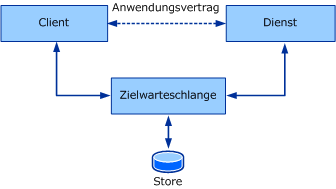
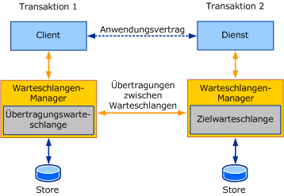

# Übersicht über Warteschlangen

In diesem Abschnitt werden die allgemeinen Begriffe und Kernbegriffe der Warteschlangenkommunikation vorgestellt. In den nachfolgenden Abschnitten wird erläutert, wie sich die hier beschriebenen queuingkonzepte in Windows Communication Foundation (WCF) manifestieren.  
  
## Grundlegende Warteschlangenbegriffe  
 Beim Entwerfen einer verteilten Anwendung ist das Wählen der richtigen Transportart für die Kommunikation zwischen Diensten und Clients sehr wichtig. Mehrere Faktoren beeinflussen, für welche Transportart Sie sich entscheiden sollten. Ein wichtiger Faktor, nämlich die Isolation zwischen Dienst, Client und Transport, bestimmt die Verwendung eines Warteschlangentransports oder eines direkten Transports wie TCP oder HTTP. Aufgrund des Aufbaus von direkten Transporten (wie TCP und HTTP) wird die Kommunikation vollständig gestoppt, wenn der Dienst oder der Client nicht ordnungsgemäß funktioniert oder wenn Netzwerkprobleme auftreten. Der Dienst, der Client und das Netzwerk müssen gleichzeitig ausgeführt werden, damit die Anwendung funktioniert. Warteschlangentransporte ermöglichen eine Isolation. Dies bedeutet, dass der Client und der Dienst weiterhin funktionieren, wenn der Dienst bzw. der Client ausfallen oder wenn die jeweiligen Kommunikationsverbindungen ausfallen.  
  
 Warteschlangen sorgen sogar für die zuverlässige Kommunikation, wenn Ausfälle bei den Kommunikationspartnern oder im Netzwerk auftreten. Warteschlangen erfassen Nachrichten, die zwischen den Kommunikationspartnern ausgetauscht werden, und stellen diese zu. Warteschlangen werden in der Regel von einem Speicher eines bestimmten Typs unterstützt, beispielsweise flüchtiger oder permanenter Speicher. Warteschlangen speichern Nachrichten für einen Dienst und leiten diese Nachrichten später dann an den Dienst weiter. Die Dereferenzierungswarteschlangen ermöglichen eine sichere Fehlerisolation für beide Parteien. Aus diesem Grund ist dies der bevorzugte Kommunikationsmechanismus für Systeme, die eine hohe Verfügbarkeit erfordern, sowie für verteilte Dienste. Die Dereferenzierung führt jedoch zu einer hohen Latenz. *Latenz* ist die Zeitverzögerung zwischen dem Zeitpunkt, an dem der Client eine Nachricht sendet, und dem Zeitpunkt, zu dem der Dienst den Dienst empfängt. Dies bedeutet, dass Sie nach dem Senden einer Nachricht nicht wissen, wann die Nachricht verarbeitet wird. Die meisten Warteschlangenanwendungen weisen eine hohe Latenz auf. Die folgende Abbildung zeigt ein Modell einer Warteschlangenkommunikation.  
  
   
  
 Modell einer Warteschlangenkommunikation  
  
 In Wirklichkeit ist die Warteschlange verteilt angeordnet. Eine Warteschlange kann also für eine Partei lokal oder für beide Parteien entfernt angeordnet sein. Normalerweise befindet sich die Warteschlange lokal beim Dienst. Bei dieser Konfiguration kann der Client sich nicht darauf verlassen, dass die Verbindung zur Remotewarteschlange ständig verfügbar ist. Außerdem muss die Warteschlange unabhängig von der Verfügbarkeit des Diensts, der aus der Warteschlange ausliest, verfügbar sein. Ein Warteschlangen-Manager verwaltet eine Auflistung von Warteschlangen. Der Manager ist dafür verantwortlich, Nachrichten anzunehmen, die von anderen Warteschlangen-Managern an seine Warteschlangen gesendet werden. Er ist auch dafür verantwortlich, die Konnektivität zu Remotewarteschlangen zu verwalten und Nachrichten an diese Remotewarteschlangen zu übertragen. Um die Verfügbarkeit auch bei Ausfällen der Client- oder Dienstanwendung sicherzustellen, wird der Warteschlangen-Manager normalerweise als externer Dienst ausgeführt.  
  
 Wenn ein Client eine Nachricht an eine Warteschlange sendet, adressiert er die Nachricht an die Zielwarteschlange. Dabei handelt es sich um die Warteschlange, die vom Warteschlangen-Manager des Diensts verwaltet wird. Der Warteschlangen-Manager auf dem Client sendet die Nachricht an eine Übertragungswarteschlange (auch: Ausgangswarteschlange). Die Übertragungswarteschlange ist eine Warteschlange im Warteschlangen-Manager des Clients, in der die Nachrichten zur Übertragung an die Zielwarteschlange gespeichert werden. Der Warteschlangen-Manager ermittelt dann einen Pfad zu dem Warteschlangen-Manager, der die Zielwarteschlange verwaltet, und überträgt die Nachricht. Um eine zuverlässige Kommunikation sicherzustellen, implementieren die Warteschlangen-Manager zur Verhinderung von Datenverlusten ein zuverlässiges Übertragungsprotokoll. Der Zielwarteschlangen-Manager nimmt an seine Zielwarteschlangen adressierte Nachrichten an und speichert die Nachrichten. Wenn der Dienst Leseanforderungen für die Zielwarteschlange sendet, stellt der Warteschlangen-Manager die Nachricht an die Zielanwendung zu. Die folgende Abbildung zeigt die Kommunikation zwischen den vier Parteien.  
  
 ")  
  
 Warteschlangenkommunikation in einem typischen Bereitstellungsszenario  
  
 Der Warteschlangen-Manager stellt die erforderliche Isolation bereit, damit es sich nicht auf die Kommunikation auswirkt, wenn der Absender und Empfänger einzeln ausfallen. Der Vorteil der zusätzlichen Dereferenzierung, den Warteschlangen bieten, ermöglicht es außerdem, dass mehrere Anwendungsinstanzen aus ein und derselben Warteschlange auslesen, damit beim Farming zwischen den Knoten ein höherer Durchsatz erzielt wird. Deshalb ist es nicht ungewöhnlich, dass Warteschlangen verwendet werden, um höhere Skalierungs- und Durchsatzanforderungen zu erfüllen.  
  
## Warteschlangen und Transaktionen  
 Transaktionen ermöglichen es Ihnen, mehrere Vorgänge zu gruppieren, so dass alle Vorgänge fehlschlagen, wenn ein Vorgang fehlschlägt. Ein Beispiel für die Verwendung von Transaktionen ist, wenn eine Person einen ATM-Wert verwendet, um $1.000 aus Ihrem Einsparungs Konto an Ihr Überprüfungs Konto zu übertragen. Dazu sind die folgenden Vorgänge erforderlich:  
  
- Das Abbuchen von 1.000 € vom Sparkonto.  
  
- Das Einzahlen von 1.000 € auf das Girokonto.  
  
 Wenn der erste Vorgang erfolgreich ist und 1.000 € vom Sparkonto abgebucht werden, der zweite Vorgang jedoch fehlschlägt, sind die 1.000 € verloren, weil sie bereits vom Sparkonto abgebucht wurden. Wenn ein Vorgang fehlschlägt, müssen also beide Vorgänge fehlschlagen, um für die Konten die richtigen Kontostände beizubehalten.  
  
 Bei Verwendung von Transaktionsnachrichten können Nachrichten an die Warteschlange gesendet und von der Warteschlange im Rahmen einer Transaktion empfangen werden. Wenn eine Nachricht also über eine Transaktion gesendet und für die Transaktion ein Rollback ausgeführt wird, wird ein Zustand wiederhergestellt, als ob die Nachricht nie an die Warteschlange gesendet wurde. Wenn eine Nachricht über eine Transaktion empfangen und für die Transaktion ein Rollback ausgeführt wird, wird ebenfalls ein Zustand wiederhergestellt, als ob die Nachricht nie empfangen wurde. Die Nachricht verbleibt in der Warteschlange, damit sie bei Bedarf gelesen werden kann.  
  
 Aufgrund der hohen Latenz beim Senden einer Nachricht können Sie weder wissen, wie lange diese zum Erreichen der Zielwarteschlange benötigt, noch ist Ihnen bekannt, wie lange der Dienst zum Verarbeiten der Nachricht benötigt. Aus diesem Grund sollten Sie keine einzelne Transaktion verwenden, um die Nachricht zu senden, die Nachricht zu empfangen und die Nachricht zu verarbeiten. Dabei wird eine Transaktion erstellt, für die für einen unbestimmten Zeitraum kein Commit besteht. Wenn ein Client und ein Dienst über eine Warteschlange mithilfe von Transaktionen kommunizieren, sind daran zwei Transaktionen beteiligt: eine beim Client und eine beim Dienst. Die folgende Abbildung zeigt die Transaktionsgrenzen einer typischen Warteschlangenkommunikation.  
  
   
  
 Warteschlangenkommunikation mit separaten Transaktionen zur Erfassung und Zustellung  
  
 Die Clienttransaktion verarbeitet und sendet die Nachricht. Wenn ein Commit für die Transaktion ausgeführt wird, befindet sich die Nachricht in der Übertragungswarteschlange. Beim Dienst liest die Transaktion die Nachricht aus der Zielwarteschlange aus und führt für die Transaktion einen Commit aus. Wenn während der Verarbeitung ein Fehler auftritt, wird für die Nachricht ein Rollback ausgeführt, und sie wird wieder in die Zielwarteschlange eingefügt.  
  
## Asynchrone Kommunikation mit Warteschlangen  
 Warteschlangen sind ein asynchrones Mittel der Kommunikation. Anwendungen, die Nachrichten mithilfe von Warteschlangen senden, können nicht darauf warten, dass die Nachricht vom Empfänger empfangen und verarbeitet wird. Dies liegt an der hohen Latenz des Warteschlangen-Managers. Nachrichten verbleiben ggf. für einen weit längeren Zeitraum in der Warteschlange, als die Anwendung beabsichtigt hat. Um dies zu vermeiden, kann die Anwendung für die Nachricht einen Gültigkeitsdauerwert angeben. Dieser Wert gibt an, wie lange die Nachricht in der Übertragungswarteschlange verbleiben soll. Wenn dieser Zeitwert überschritten wird und die Nachricht noch nicht an die Zielwarteschlange gesendet wurde, kann die Nachricht an eine Warteschlange für unzustellbare Nachrichten übertragen werden.  
  
 Wenn der Absender eine Nachricht sendet, sagt die Rückgabe des Sendevorgangs aus, dass die Nachricht nur bis in die Übertragungswarteschlange des Absenders gelangt ist. Wenn beim Senden der Nachricht an die Zielwarteschlange also ein Fehler auftritt, erfährt die sendende Anwendung dies nicht sofort. Um solche Fehler anzuzeigen, wird die fehlgeschlagene Nachricht in eine Warteschlange für unzustellbare Nachrichten übertragen.  
  
 Alle Fehler, beispielsweise eine Nachricht, die die Zielwarteschlange nicht erreicht oder deren Gültigkeitsdauer abgelaufen ist, müssen einzeln verarbeitet werden. Es ist deshalb nicht ungewöhnlich, dass Warteschlangenanwendungen zwei Arten von Logik schreiben:  
  
- Die normale Client- und Dienstlogik zum Senden und Empfangen von Nachrichten.  
  
- Die Kompensationslogik zum Verarbeiten von Nachrichten, deren Übertragung oder Zustellung fehlgeschlagen ist.  
  
 Diese Begriffe werden in den folgenden Abschnitten erläutert.  
  
## Programmierung der Warteschlange für unzustellbare Nachrichten  
 Warteschlangen für unzustellbare Nachrichten enthalten Nachrichten, die die Zielwarteschlange aus verschiedenen Gründen nicht erreichen. Die Gründe können von abgelaufenen Nachrichten bis zu Konnektivitätsproblemen reichen, die die Übertragung der Nachricht an die Zielwarteschlange verhindern.  
  
 Normalerweise ist eine Anwendung dazu in der Lage, Nachrichten aus einer systemweiten Warteschlange für unzustellbare Nachrichten auszulesen, zu ermitteln, welcher Fehler vorliegt, und entsprechende Schritte einzuleiten, wie das Beheben der Fehler und das erneute Senden der Nachricht bzw. das Aufzeichnen des Status.  
  
## Programmierung für Warteschlangen für potenziell schädliche Nachrichten  
 Nachdem eine Nachricht in der Zielwarteschlange eingetroffen ist, schlägt der Dienst beim Verarbeiten der Nachricht ggf. wiederholt fehl. Eine Anwendung, die im Rahmen einer Transaktion eine Nachricht aus einer Warteschlange ausliest und eine Datenbank aktualisiert, kann zum Beispiel auf das Problem treffen, dass die Verbindung zur Datenbank vorübergehend unterbrochen ist. In diesem Fall wird für die Transaktion ein Rollback ausgeführt, es wird eine neue Transaktion erstellt, und die Nachricht wird erneut aus der Warteschlange ausgelesen. Ein zweiter Versuch kann erfolgreich sein oder fehlschlagen. Es kann je nach Fehlerursache auch vorkommen, dass die Nachricht wiederholt nicht an die Anwendung zugestellt wird. In diesem Fall wird die Nachricht als "potenziell schädlich" eingestuft. Nachrichten dieser Art werden in eine Warteschlange für potenziell schädliche Nachrichten verschoben, die von einer Anwendung zur Bearbeitung von potenziell schädlichen Nachrichten gelesen werden kann.  
  
## Weitere Informationen

- [Warteschlangen in WCF](queuing-in-wcf.md)
- [Sitzungen und Warteschlangen](../samples/sessions-and-queues.md)
- [Warteschlangen für unzustellbare Meldungen](../samples/dead-letter-queues.md)
- [Flüchtige Kommunikation unter Verwendung von Warteschlangen](../samples/volatile-queued-communication.md)
- [Windows Communication Foundation zu Message Queuing](../samples/wcf-to-message-queuing.md)
- [Installieren von Message Queuing (MSMQ)](../samples/installing-message-queuing-msmq.md)
- [Message Queuing zu Windows Communication Foundation](../samples/message-queuing-to-wcf.md)
- [Nachrichtensicherheit über Message Queuing](../samples/message-security-over-message-queuing.md)
