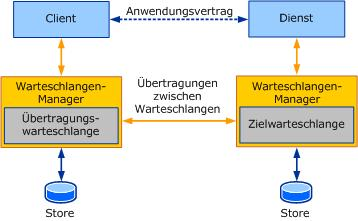

# Warteschlangen in WCFQueuing in WCF
In diesem Abschnitt wird beschrieben, wie die Warteschlangen Kommunikation in Windows Communication Foundation (WCF) verwendet wird.This section describes how to use queued communication in Windows Communication Foundation (WCF).  
  
## Warteschlangen als WCF-TransportbindungQueues as a WCF transport binding  
 In WCF geben die Verträge an, was ausgetauscht wird.In WCF, the contracts specify what is being exchanged. Verträge sind geschäftsabhängige oder anwendungsspezifische Nachrichtenaustausche.Contracts are business-dependent or application-specific message exchanges. Der Mechanismus (oder die „Art und Weise“) zum Austausch von Nachrichten wird in den Bindungen angegeben.The mechanism used to exchange messages (or the "how") is specified in the bindings. Bindungen in WCF Kapseln Details zum Nachrichtenaustausch.Bindings in WCF encapsulate details of the message exchange. Die Bindungen stellen dem Benutzer Konfigurationssteuerelemente zur Verfügung, mit denen verschiedene Aspekte des Transports oder des Protokolls gesteuert werden, der bzw. das von den Bindungen dargestellt wird.They expose configuration knobs for the user to control various aspects of the transport or the protocol that the bindings represent. Warteschlangen werden in WCF wie jede andere Transport Bindung behandelt. Dies ist ein großer Vorteil für viele Warteschlangen Anwendungen.Queuing in WCF is treated like any other transport binding, which is a big advantage for many queuing applications. Heute werden zahlreiche Warteschlangenanwendungen anders geschrieben als andere verteilte RPC (Remote Procedure Call)-Anwendungen, wodurch die Verfolgung und Verwaltung erschwert wird.Today, many queuing applications are written differently from other remote procedure call (RPC)-style distributed applications, making it harder to follow and maintain. Mit WCF ist das Schreiben einer verteilten Anwendung sehr ähnlich, sodass Sie leichter befolgt und gewartet werden kann.With WCF, the style of writing a distributed application is much the same, making it easier to follow and maintain. Durch separates Trennen des Austauschmechanismus von der Geschäftslogik wird zudem die Konfiguration des Transports oder das Vornehmen von Änderungen erleichtert, ohne dass der anwendungsspezifische Code davon betroffen ist.Moreover, by factoring out the mechanism of exchange separately from the business logic, it is easier to configure the transport or make changes to it without affecting application specific code. Die folgende Abbildung zeigt die Struktur eines WCF-Diensts und eines Clients mit MSMQ als Transport.The following figure illustrates the structure of a WCF service and client using MSMQ as a transport.  
  
 ")  
  
 Aus der vorherigen Abbildung geht hervor, dass mit dem Client und dem Dienst nur die Anwendungssemantik definiert werden muss, d.&#160;h. der Vertrag und die Implementierung.As you can see from the preceding figure, the client and service must define only the application semantics, that is, the contract and implementation. Eine der Warteschlange hinzugefügte Bindung wird vom Dienst mit den bevorzugten Einstellungen konfiguriert.The service configures a queued binding with preferred settings. Der Client verwendet das [Service Model Metadata Utility-Tool (Svcutil. exe)](../servicemodel-metadata-utility-tool-svcutil-exe.md) , um einen WCF-Client für den Dienst zu generieren und eine Konfigurationsdatei zu generieren, in der die Bindungen beschrieben werden, die zum Senden von Nachrichten an den Dienst verwendet werden sollen.The client uses the [ServiceModel Metadata Utility Tool (Svcutil.exe)](../servicemodel-metadata-utility-tool-svcutil-exe.md) to generate a WCF client to the service and to generate a configuration file that describes the bindings to use to send messages to the service. Damit eine Nachricht in der Warteschlange gesendet werden kann, instanziiert der Client einen WCF-Client und Ruft einen Vorgang darauf auf.Thus, to send a queued message, the client instantiates a WCF client and invokes an operation on it. Daraufhin wird die Nachricht an die Übertragungswarteschlange gesendet und an die Zielwarteschlange übertragen.This causes the message to be sent to the transmission queue and transferred to the target queue. Alle Komplexitäten der in der Warteschlange enthaltenen Kommunikation werden der Anwendung, die Nachrichten sendet und empfängt, nicht angezeigt.All the complexities of queued communication are hidden from the application that is sending and receiving messages.  
  
 Einschränkungen bei der in der Warteschlange befindlichen Bindung in WCF umfassen Folgendes:Caveats about queued binding in WCF include:  
  
- Alle Dienst Vorgänge müssen unidirektional sein, da die Standard Bindung in der Warteschlange in WCF keine Duplex Kommunikation mithilfe von Warteschlangen unterstützt.All service operations must be one-way because the default queued binding in WCF does not support duplex communication using queues. Ein Beispiel für eine bidirektionale Kommunikation (bidirektionale[Kommunikation](../samples/two-way-communication.md)) veranschaulicht die Verwendung von 2 1-Wege-Verträgen zum Implementieren der Duplex Kommunikation mithilfe von Warteschlangen.A two-way communication sample ([Two-Way Communication](../samples/two-way-communication.md)) illustrates how to use two one-way contracts to implement duplex communication using queues.  
  
- Zum Generieren eines WCF-Clients mit Metadatenaustausch ist ein zusätzlicher HTTP-Endpunkt für den Dienst erforderlich, damit er direkt abgefragt werden kann, um den WCF-Client zu generieren, und Bindungs Informationen abrufen, um die Kommunikation in der Warteschlange entsprechend zu konfigurieren.To generate a WCF client using metadata exchange requires an additional HTTP endpoint on the service so that it can be queried directly to generate the WCF client and obtain binding information to appropriately configure queued communication.  
  
- Basierend auf der Bindung in der Warteschlange ist eine zusätzliche Konfiguration außerhalb von WCF erforderlich.Based on the queued binding, extra configuration outside of WCF is required. Beispielsweise müssen Sie für die- <xref:System.ServiceModel.NetMsmqBinding> Klasse, die mit WCF ausgeliefert wird, die Bindungen konfigurieren und Message Queuing (MSMQ) minimal konfigurieren.For example, the <xref:System.ServiceModel.NetMsmqBinding> class that is shipped with WCF requires you to configure the bindings as well as minimally configure Message Queuing (MSMQ).  
  
 In den folgenden Abschnitten werden die spezifischen Bindungen in der Warteschlange beschrieben, die mit WCF ausgeliefert werden und auf dem MSMQ basieren.The following sections describe the specific queued bindings shipped with WCF, which are based on MSMQ.  
  
### MSMQMSMQ  
 Der in der Warteschlange befindliche Transport in WCF verwendet MSMQ für die Kommunikation in der Warteschlange.The queued transport in WCF uses MSMQ for its queued communication.  
  
 MSMQ steht als optionale Windows-Komponente zur Verfügung und wird als NT-Dienst ausgeführt.MSMQ ships as an optional component with Windows and runs as an NT service. MSMQ erfasst Nachrichten, die in einer Übertragungswarteschlange übertragen und an eine Zielwarteschlange gesendet werden.It captures messages for transmission in a transmission queue and for delivery in a target queue. Die MSMQ-Warteschlangen-Manager implementieren ein zuverlässiges Nachrichtenübertragungsprotokoll, damit Nachrichten bei der Übertragung nicht verloren gehen.The MSMQ queue managers implement a reliable message-transfer protocol so that messages are not lost in transmission. Das Protokoll kann entweder systemeigen oder SOAP-basiert sein, zum Beispiel das SOAP Reliable Message Protocol (SRMP).The protocol can be either native or SOAP-based, such as the SOAP Reliable Message Protocol (SRMP).  
  
 In MSMQ können Warteschlangen transaktional oder nicht transaktional sein.In MSMQ, queues can be transactional or non-transactional. Eine transaktionale Warteschlange ermöglicht das Erfassen und Zustellen von Nachrichten in einer Transaktion und das anschließende dauerhafte Speichern in der Warteschlange.A transactional queue allows messages to be captured and delivered in a transaction and then stored durably in the queue. An eine transaktionale Warteschlange gesendete Nachrichten werden genau einmal entsprechend ihrer Reihenfolge übertragen.Messages sent to a transactional queue are transferred exactly once in order. Mit einer nicht transaktionalen Warteschlange können sowohl flüchtige als auch permanente Nachrichten gesendet werden.You can use a non-transactional queue to send both volatile and durable messages. An nicht transaktionale Warteschlange gesendete Nachrichten werden nicht zuverlässig übertragen, sodass manche Nachrichten verloren gehen können.A message sent to a non-transactional queue does not carry any reliable transfer assurances; thus, messages can be lost.  
  
 MSMQ-Warteschlangen können auch mit einer Windows-Identität, die im Active Directory-Verzeichnisdienst registriert wird, gesichert werden.MSMQ queues can also be secured using a Windows identity registered with the Active Directory directory service. Bei der Installation von MSMQ kann die Active Directory-Integration installiert werden. Der Computer muss in diesem Fall Teil eines Windows-Domänennetzwerks sein.When installing MSMQ, you can install Active Directory integration, which requires the computer to be part of a Windows domain network.  
  
 Weitere Informationen zu MSMQ finden Sie unter [Installieren von Message Queuing (MSMQ)](../samples/installing-message-queuing-msmq.md).For more information about MSMQ, see [Installing Message Queuing (MSMQ)](../samples/installing-message-queuing-msmq.md).  
  
### NetMsmqBindingNetMsmqBinding  
 Der [\<netMsmqBinding>](../../configure-apps/file-schema/wcf/netmsmqbinding.md) ist die in der Warteschlange befindliche Bindung, die WCF für zwei WCF-Endpunkte zur Kommunikation mit MSMQ bereitstellt.The [\<netMsmqBinding>](../../configure-apps/file-schema/wcf/netmsmqbinding.md) is the queued binding WCF provides for two WCF endpoints to communicate using MSMQ. Die Bindung macht deshalb MSMQ-spezifische Eigenschaften verfügbar.The binding, therefore, exposes properties that are specific to MSMQ. Allerdings sind nicht alle MSMQ-Features und -Eigenschaften in `NetMsmqBinding` verfügbar.However, not all MSMQ features and properties are exposed in the `NetMsmqBinding`. Die kompakte `NetMsmqBinding` verfügt über ein optimales Spektrum an Funktionen, die für die meisten Kunden ausreichend sind.The compact `NetMsmqBinding` is designed with an optimal set of features that most customers should find sufficient.  
  
 `NetMsmqBinding` beschreibt die grundlegenden Warteschlangenkonzepte, die bisher in Form von Bindungseigenschaften erörtert wurden.The `NetMsmqBinding` manifests the core queuing concepts discussed thus far in the form of properties on the bindings. Mit diesen Eigenschaften wird wiederum MSMQ mitgeteilt, wie Nachrichten übertragen und zugestellt werden sollen.These properties, in turn, communicate to MSMQ how to transfer and deliver the messages. Eine Erläuterung der Eigenschaftenkategorien befindet sich in den folgenden Abschnitten.A discussion of the property categories is in the following sections. Weitere Informationen finden Sie in den konzeptionellen Themen, in denen bestimmte Eigenschaften vollständig beschrieben werden.For more information, see the conceptual topics that describe specific properties more completely.  
  
#### ExactlyOnce-Eigenschaft und Durable-EigenschaftExactlyOnce and Durable Properties  
 Die `ExactlyOnce`-Eigenschaft und die `Durable`-Eigenschaft beeinflussen die Übertragung von Nachrichten zwischen Warteschlangen:The `ExactlyOnce` and `Durable` properties affect how messages are transferred between queues:  
  
- `ExactlyOnce`: Bei einer Festlegung auf `true` (Standard) wird durch den in der Warteschlange stehenden Kanal sichergestellt, dass die Nachricht im Falle der Zustellung nicht dupliziert wird.`ExactlyOnce`: When set to `true` (the default), the queued channel ensures that the message, if delivered, is not duplicated. Dabei wird auch gewährleistet, dass die Nachricht nicht verloren geht.It also ensures that the message is not lost. Falls eine Zustellung der Nachricht nicht möglich ist oder die Gültigkeitsdauer der Nachricht abläuft, bevor die Nachricht zugestellt werden kann, wird die nicht zugestellte Nachricht mit der Ursache für den Zustellungsfehler in einer Warteschlange für unzustellbare Nachrichten aufgezeichnet.If the message cannot be delivered, or the message Time-To Live expires before the message can be delivered, the failed message along with the delivery failure reason is recorded in a dead-letter queue. Wenn der der Warteschlange hinzugefügte Kanal auf `false` festgelegt ist, wird versucht, die Nachricht zu übertragen.When set to `false`, the queued channel makes an effort to transfer the message. In diesem Fall können Sie optional eine Warteschlange für unzustellbare Nachrichten auswählen.In this case, you can optionally choose a dead-letter queue.  
  
- `Durable:` Bei einer Festlegung auf `true` (Standard) wird durch den der Warteschlange hinzugefügten Kanal sichergestellt, dass MSMQ die Nachricht permanent auf einem Datenträger speichert.`Durable:` When set to `true` (the default), the queued channel ensures that MSMQ stores the message durably on disk. Wird der MSMQ-Dienst beendet und neu gestartet, werden die Nachrichten auf dem Datenträger somit an die Zielwarteschlange übertragen oder an den Dienst gesendet.Thus, if the MSMQ service were to stop and restart, the messages on disk is transferred to the target queue or delivered to the service. Bei einer Festlegung auf `false` werden die Nachrichten in einem flüchtigen Speicher gespeichert und gehen beim Beenden und Neustarten des MSMQ-Diensts verloren.When set to `false`, the messages are stored in volatile store and are lost on stopping and restarting the MSMQ service.  
  
 Für eine zuverlässige Übertragung von `ExactlyOnce` wird von MSMQ eine transaktionale Warteschlange gefordert.For `ExactlyOnce` reliable transfer, MSMQ requires the queue to be transactional. Zudem wird von MSMQ gefordert, dass eine Transaktion von einer Transaktionswarteschlange gelesen wird.Also, MSMQ requires a transaction to read from a transactional queue. Bei Verwendung von `NetMsmqBinding` muss eine Transaktion daher Nachrichten senden oder empfangen, wenn `ExactlyOnce` auf `true` festgelegt ist.As such, when you use the `NetMsmqBinding`, remember that a transaction is required to send or receive messages when `ExactlyOnce` is set to `true`. Vergleichbar damit ist, dass MSMQ eine nicht transaktionale Warteschlange für Zusicherungen nach dem Best-Effort-Prinzip (beispielsweise wenn `ExactlyOnce` auf `false` festgelegt ist) sowie für flüchtiges Messaging benötigt.Similarly, MSMQ requires the queue to be non-transactional for best-effort assurances, such as when `ExactlyOnce` is `false` and for volatile messaging. Wird `ExactlyOnce` auf `false` oder durable auf `false` festgelegt, ist Senden oder Empfangen mithilfe einer Transaktion nicht möglich.Thus, when setting `ExactlyOnce` to `false` or durable to `false`, you cannot send or receive using a transaction.  
  
> [!NOTE]
> Stellen Sie sicher, dass die richtige Warteschlange (transaktional oder nicht transaktional) auf Grundlage der Einstellungen in den Bindungen erstellt wird.Ensure that the correct queue (transactional or non-transactional) is created based on settings in the bindings. Wenn für `ExactlyOnce` der Wert `true` gilt, verwenden Sie eine Transaktionswarteschlange und andernfalls eine nicht transaktionale Warteschlange.If `ExactlyOnce` is `true`, use a transactional queue; otherwise, use a non-transactional queue.  
  
#### Eigenschaften der Warteschlange für unzustellbare NachrichtenDead-Letter Queue Properties  
 Die Warteschlange für unzustellbare Nachrichten wird verwendet, um unzustellbare Nachrichten zu speichern.The dead-letter queue is used to store messages that fail delivery. Der Benutzer kann kompensierende Logik schreiben, die Nachrichten aus der Warteschlange für unzustellbare Nachrichten liest.The user can write compensating logic that reads messages out of the dead-letter queue.  
  
 Viele Warteschlangensysteme verfügen über eine systemweite Warteschlange für unzustellbare Nachrichten.Many queuing systems provide for a system-wide dead-letter queue. MSMQ verfügt über eine systemweite Warteschlange für unzustellbare nicht transaktionale Nachrichten. Diese Warteschlange wird für Nachrichten verwendet, deren Zustellung an nicht transaktionale Warteschlangen nicht möglich ist. Darüber hinaus besitzt MSMQ eine systemweite transaktionale Warteschlange für unzustellbare Nachrichten, die für Nachrichten verwendet wird, die nicht an Transaktionswarteschlange gesendet werden können.MSMQ provides a system-wide non-transactional dead-letter queue for messages that fail delivery to non-transactional queues and a system-wide transactional dead-letter queue for messages that fail delivery to transactional queues.  
  
 Wird der MSMQ-Dienst von mehreren Clients, die Nachrichten an verschiedene Zielwarteschlangen senden, gemeinsam verwendet, werden alle von den Clients gesendeten Nachrichten in dieselbe Warteschlange für unzustellbare Nachrichten verschoben.If multiple clients sending messages to different target queues share the MSMQ service, all messages sent by the clients go to the same dead-letter queue. Dies ist nicht immer empfehlenswert.This is not always preferable. Zur besseren Isolation bieten WCF und MSMQ in Windows Vista eine benutzerdefinierte Warteschlange für unzustellbare Nachrichten (oder eine anwendungsspezifische Warteschlange für unzustellbare Nachrichten), die der Benutzer angeben kann, um Nachrichten zu speichern, die nicht zugestellt werdenFor better isolation, WCF and MSMQ in Windows Vista provide a custom dead-letter queue (or application-specific dead-letter queue) that the user can specify to store messages that fail delivery. Daher verwenden unterschiedliche Clients nicht gemeinsam dieselbe Warteschlange für unzustellbare Nachrichten.Therefore, different clients do not share the same dead-letter queue.  
  
 Die Bindung verfügt über zwei wichtige Eigenschaften:The binding has two properties of interest:  
  
- `DeadLetterQueue`: Diese Eigenschaft ist eine Enumeration, die angibt, ob eine Warteschlange für unzustellbare Nachrichten angefordert wird.`DeadLetterQueue`: This property is an enumeration that indicates whether a dead-letter queue is requested. Die Enumeration enthält auch die Art der Warteschlange für unzustellbare Nachrichten, sofern eine Warteschlange angefordert wird.The enumeration also contains the kind of dead-letter queue, if one is requested. Mögliche Werte sind `None`, `System` und `Custom`.The values are `None`, `System`, and `Custom`. Weitere Informationen zur Interpretation dieser Eigenschaften finden Sie unter Verwenden von Warteschlangen für unzustellbare [Nachrichten zur](using-dead-letter-queues-to-handle-message-transfer-failures.md) Behandlung von Fehlern bei der Nachrichtenübertragung.For more information about the interpretation of these properties, see [Using Dead-Letter Queues to Handle Message Transfer Failures](using-dead-letter-queues-to-handle-message-transfer-failures.md)  
  
- `CustomDeadLetterQueue`: Diese Eigenschaft ist die Uniform Resource Identifier (URI)-Adresse der anwendungsspezifischen Warteschlange für unzustellbare Nachrichten.`CustomDeadLetterQueue`: This property is the Uniform Resource Identifier (URI) address of the application-specific dead-letter queue. Dies ist erforderlich, wenn `DeadLetterQueue` .`Custom`This is required if `DeadLetterQueue`.`Custom` wird ausgewählt.is chosen.  
  
#### Eigenschaften der Behandlung nicht verarbeitbarer NachrichtenPoison Message Handling properties  
 Liest der Dienst im Rahmen einer Transaktion Nachrichten aus der Zielwarteschlange, kann die Nachricht vom Dienst aus verschiedenen Gründen möglicherweise nicht verarbeitet werden.When the service reads messages from the target queue under a transaction, the service may fail to process the message for various reasons. Die Nachricht wird anschließend zum erneuten Lesen in die Warteschlange zurückgestellt.The message is then put back into the queue to be read again. Zur Verarbeitung von Nachrichten, die mehrmals nicht zugestellt werden konnten, kann in der Bindung ein Satz Eigenschaften zur Behandlung nicht verarbeitbarer Nachrichten konfiguriert werden.To deal with messages that fail repeatedly, a set of poison-message handling properties can be configured in the binding. Es gibt vier Eigenschaften: `ReceiveRetryCount`, `MaxRetryCycles`, `RetryCycleDelay` und `ReceiveErrorHandling`.There are four properties: `ReceiveRetryCount`, `MaxRetryCycles`, `RetryCycleDelay`, and `ReceiveErrorHandling`. Weitere Informationen zu diesen Eigenschaften finden Sie unter [Behandlung](poison-message-handling.md)von nicht verarbeitbaren Nachrichten.For more information about these properties, see [Poison Message Handling](poison-message-handling.md).  
  
#### SicherheitseigenschaftenSecurity Properties  
 MSMQ verfügt über ein eigenes Sicherheitsmodell, zu dem beispielsweise Zugriffssteuerungslisten in einer Warteschlange oder das Senden von authentifizierten Nachrichten gehören.MSMQ exposes its own security model, such as access control lists (ACLs) on a queue or sending authenticated messages. `NetMsmqBinding` macht diese Sicherheitseigenschaften als Teil der Transportsicherheitseinstellungen verfügbar.The `NetMsmqBinding` exposes these security properties as part of its transport security settings. Die Bindung für Transportsicherheit besitzt zwei Eigenschaften: `MsmqAuthenticationMode` und `MsmqProtectionLevel`.There are two properties in the binding for transport security: `MsmqAuthenticationMode` and `MsmqProtectionLevel`. Einstellungen in diesen Eigenschaften sind von der Konfiguration von MSMQ abhängig.Settings in these properties depend on how MSMQ is configured. Weitere Informationen finden Sie unter [Sichern von Nachrichten mit Transport Sicherheit](securing-messages-using-transport-security.md).For more information, see [Securing Messages Using Transport Security](securing-messages-using-transport-security.md).  
  
 Zusätzlich zur Transportsicherheit kann die eigentliche SOAP-Nachricht mit Nachrichtensicherheit gesichert werden.In addition to transport security, the actual SOAP message itself can be secured using message security. Weitere Informationen finden Sie unter [Sichern von Nachrichten mithilfe der Nachrichten Sicherheit](securing-messages-using-message-security.md).For more information, see [Securing Messages Using Message Security](securing-messages-using-message-security.md).  
  
 `MsmqTransportSecurity` macht ebenfalls zwei Eigenschaften verfügbar, `MsmqEncryptionAlgorithm` und `MsmqHashAlgorithm`.`MsmqTransportSecurity` also exposes two properties, `MsmqEncryptionAlgorithm` and `MsmqHashAlgorithm`. Dabei handelt es sich um Enumerationen verschiedener Algorithmen, die bei Übertragungen zwischen Warteschlangen für die Verschlüsselung von Nachrichten und das Hashing der Signaturen gewählt werden können.These are enumerations of different algorithms to choose for queue-to-queue transfer encryption of messages and hashing of the signatures.  
  
#### Andere EigenschaftenOther Properties  
 Neben den zuvor genannten Eigenschaften stehen in der Bindung auch andere MSMQ-spezifische Eigenschaften zur Verfügung:In addition to the preceding properties, other MSMQ-specific properties exposed in the binding include:  
  
- `UseSourceJournal`: Eine Eigenschaft, mit der angegeben wird, dass die Führung von Quelljournalen aktiviert ist.`UseSourceJournal`: A property to indicate that source journaling is turned on. Die Führung von Quelljournalen ist eine MSMQ-Funktion zum Erfassen von Nachrichten, die erfolgreich von der Übertragungswarteschlange übertragen wurden.Source journaling is an MSMQ feature that keeps track of messages that have been successfully transmitted from the transmission queue.  
  
- `UseMsmqTracing`: Eine Eigenschaft, mit der angegeben wird, dass die MSMQ-Ablaufverfolgung aktiviert ist.`UseMsmqTracing`: A property to indicate that MSMQ tracing is turned on. Die MSMQ-Ablaufverfolgung sendet Berichtsnachrichten an eine Berichtwarteschlange, wenn eine Nachricht einen Computer, der als Host für einen MSMQ-Warteschlangen-Manager fungiert, verlässt oder bei diesem eingeht.MSMQ tracing sends report messages to a report queue each time a message leaves or arrives at a machine hosting an MSMQ queue manager.  
  
- `QueueTransferProtocol`: Eine Enumeration des Protokolls, das für Nachrichtenübertragungen zwischen Warteschlangen verwendet wird.`QueueTransferProtocol`: An enumeration of the protocol to use for queue-to-queue message transfers. MSMQ implementiert ein systemeigenes Protokoll für Übertragungen zwischen Warteschlangen und ein SOAP-basiertes Protokoll mit der Bezeichnung SOAP Reliable Messaging Protocol (SRMP).MSMQ implements a native queue-to-queue transfer protocol and a SOAP-based protocol called SOAP Reliable Messaging Protocol (SRMP). SRMP wird bei Verwendung von HTTP-Transport für Übertragungen zwischen Warteschlangen verwendet.SRMP is used when using HTTP transport for queue-to-queue transfers. Sicheres SRMP wird bei Verwendung von HTTPS für Übertragungen zwischen Warteschlangen verwendet.SRMP secure is used when using HTTPS for queue-to-queue transfers.  
  
- `UseActiveDirectory`: Ein boolescher Wert, mit dem angegeben wird, ob Active Directory für die Auflösung von Warteschlangenadressen verwendet werden muss.`UseActiveDirectory`: A Boolean value to indicate whether the Active Directory must be used for queue address resolution. Standardmäßig ist dieser Wert deaktiviert.By default, this is off. Weitere Informationen finden Sie unter [Dienst Endpunkte und Adressierung von Warteschlangen](service-endpoints-and-queue-addressing.md).For more information, see [Service Endpoints and Queue Addressing](service-endpoints-and-queue-addressing.md).  
  
### MsmqIntegrationBindingMsmqIntegrationBinding  
 `MsmqIntegrationBinding`Wird verwendet, wenn ein WCF-Endpunkt mit einer vorhandenen MSMQ-Anwendung kommunizieren soll, die in C-, C++-, com-oder System. Messaging-APIs geschrieben wurde.The `MsmqIntegrationBinding` is used when you want a WCF endpoint to communicate with an existing MSMQ application written in C, C++, COM, or System.Messaging APIs.  
  
 Die Bindungseigenschaften sind für `NetMsmqBinding` identisch.The binding properties are the same as for `NetMsmqBinding`. Folgende Unterschiede sind jedoch zu berücksichtigen:However, the following differences apply:  
  
- Der Vorgangsvertrag für `MsmqIntegrationBinding` ist auf das Verwenden eines Einzelparameters vom Typ <xref:System.ServiceModel.MsmqIntegration.MsmqMessage%601> beschränkt, in dem der Typparameter der Texttyp ist.The operation contract for `MsmqIntegrationBinding` is restricted to taking a single parameter of type <xref:System.ServiceModel.MsmqIntegration.MsmqMessage%601> where the type parameter is the body type.  
  
- Ein Großteil der Eigenschaften der systemeigenen MSMQ-Nachrichten steht in <xref:System.ServiceModel.MsmqIntegration.MsmqMessage%601> zur Verfügung.Much of MSMQ native message properties are exposed in the <xref:System.ServiceModel.MsmqIntegration.MsmqMessage%601> for use.  
  
- Die Serialisierung und Deserialisierung des Nachrichtentexts wird durch verfügbare Serialisierungsprogramme wie XML und ActiveX unterstützt.To help with serialization and deserialization of the message body, serializers such as XML and ActiveX are provided.  
  
### BeispielcodeSample Code  
 Schritt-für-Schritt-Anweisungen zum Schreiben von WCF-Diensten, die MSMQ verwenden, finden Sie in den folgenden Themen:For step by step instructions on how to write WCF services that use MSMQ see the following topics:  
  
- [Vorgehensweise: Nachrichtenaustausch mit WCF-Endpunkten und Message Queuing-AnwendungenHow to: Exchange Messages with WCF Endpoints and Message Queuing Applications](how-to-exchange-messages-with-wcf-endpoints-and-message-queuing-applications.md)  
  
- [Vorgehensweise: Austauschen von Nachrichten in einer Warteschlange mit WCF-EndpunktenHow to: Exchange Queued Messages with WCF Endpoints](how-to-exchange-queued-messages-with-wcf-endpoints.md)  
  
 Ein vollständiges Codebeispiel, das die Verwendung von MSMQ in WCF veranschaulicht, finden Sie in den folgenden Themen:For a completed code sample illustrating the use of MSMQ in WCF see the following topics:  
  
- [Abgewickelte MSMQ-BindungTransacted MSMQ Binding](../samples/transacted-msmq-binding.md)  
  
- [Flüchtige Kommunikation unter Verwendung von WarteschlangenVolatile Queued Communication](../samples/volatile-queued-communication.md)  
  
- [Warteschlangen für unzustellbare MeldungenDead Letter Queues](../samples/dead-letter-queues.md)  
  
- [Sitzungen und WarteschlangenSessions and Queues](../samples/sessions-and-queues.md)  
  
- [Bidirektionale KommunikationTwo-Way Communication](../samples/two-way-communication.md)
  
- [SRMPSRMP](../samples/srmp.md)  
  
- [Nachrichtensicherheit über Message QueuingMessage Security over Message Queuing](../samples/message-security-over-message-queuing.md)  
  
## Weitere InformationenSee also

- [Dienstendpunkte und Adressieren von WarteschlangenService Endpoints and Queue Addressing](service-endpoints-and-queue-addressing.md)
- [Webhosting einer Anwendung mit QueuingWeb Hosting a Queued Application](web-hosting-a-queued-application.md)
