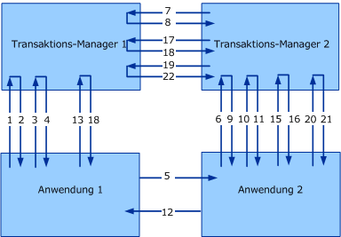

# <a name="transaction-protocols"></a><span data-ttu-id="8031a-102">Transaktionsprotokolle</span><span class="sxs-lookup"><span data-stu-id="8031a-102">Transaction Protocols</span></span>
[!INCLUDE[indigo1](../../../../includes/indigo1-md.md)]<span data-ttu-id="8031a-103"> implementiert die WS-AtomicTransaction- und WS-Coordination-Protokolle.</span><span class="sxs-lookup"><span data-stu-id="8031a-103"> implements WS-Atomic Transaction and WS-Coordination protocols.</span></span>  
  
|<span data-ttu-id="8031a-104">Spezifikation/Dokument</span><span class="sxs-lookup"><span data-stu-id="8031a-104">Specification/Document</span></span>|<span data-ttu-id="8031a-105">Version</span><span class="sxs-lookup"><span data-stu-id="8031a-105">Version</span></span>|<span data-ttu-id="8031a-106">Link</span><span class="sxs-lookup"><span data-stu-id="8031a-106">Link</span></span>|  
|-----------------------------|-------------|----------|  
|<span data-ttu-id="8031a-107">WS-Coordination</span><span class="sxs-lookup"><span data-stu-id="8031a-107">WS-Coordination</span></span>|<span data-ttu-id="8031a-108">1,0</span><span class="sxs-lookup"><span data-stu-id="8031a-108">1.0</span></span><br /><br /> <span data-ttu-id="8031a-109">1,1</span><span class="sxs-lookup"><span data-stu-id="8031a-109">1.1</span></span>|[<span data-ttu-id="8031a-110">http://go.Microsoft.com/fwlink/?LinkId=96104</span><span class="sxs-lookup"><span data-stu-id="8031a-110">http://go.microsoft.com/fwlink/?LinkId=96104</span></span>](http://go.microsoft.com/fwlink/?LinkId=96104)<br /><br /> [<span data-ttu-id="8031a-111">http://go.Microsoft.com/fwlink/?LinkId=96079</span><span class="sxs-lookup"><span data-stu-id="8031a-111">http://go.microsoft.com/fwlink/?LinkId=96079</span></span>](http://go.microsoft.com/fwlink/?LinkId=96079)|  
|<span data-ttu-id="8031a-112">WS-AtomicTransaction</span><span class="sxs-lookup"><span data-stu-id="8031a-112">WS-AtomicTransaction</span></span>|<span data-ttu-id="8031a-113">1,0</span><span class="sxs-lookup"><span data-stu-id="8031a-113">1.0</span></span><br /><br /> <span data-ttu-id="8031a-114">1,1</span><span class="sxs-lookup"><span data-stu-id="8031a-114">1.1</span></span>|[<span data-ttu-id="8031a-115">http://go.Microsoft.com/fwlink/?LinkId=96080</span><span class="sxs-lookup"><span data-stu-id="8031a-115">http://go.microsoft.com/fwlink/?LinkId=96080</span></span>](http://go.microsoft.com/fwlink/?LinkId=96080)<br /><br /> <span data-ttu-id="8031a-116">http://go.microsoft.com/fwlink/?LinkId=96081</span><span class="sxs-lookup"><span data-stu-id="8031a-116">http://go.microsoft.com/fwlink/?LinkId=96081</span></span>|  
  
 <span data-ttu-id="8031a-117">Die Interoperabilität für diese Protokolle ist für zwei Ebenen erforderlich: zwischen Anwendungen und zwischen Transaktions-Managern (siehe folgende Abbildung).</span><span class="sxs-lookup"><span data-stu-id="8031a-117">Interoperability on these protocol specifications is required at two levels: between applications and between transaction managers (see the following figure).</span></span> <span data-ttu-id="8031a-118">In den Spezifikationen werden die Nachrichtenformate und der Nachrichtenaustausch für beide Interoperabilitätsebenen ausführlich beschrieben.</span><span class="sxs-lookup"><span data-stu-id="8031a-118">Specifications describe in great detail the message formats and message exchange for both interoperability levels.</span></span> <span data-ttu-id="8031a-119">Bestimmte Sicherheits- und Zuverlässigkeitsstufen sowie Codierungen gelten für einen Austausch von Anwendung zu Anwendung wie bei einem normalen Anwendungsaustausch.</span><span class="sxs-lookup"><span data-stu-id="8031a-119">Certain security, reliability, and encodings for application-to-application exchange apply as they do for regular application exchange.</span></span> <span data-ttu-id="8031a-120">Für eine erfolgreiche Interoperabilität zwischen den Transaktions-Managern ist eine Einigung auf eine bestimmte Bindung erforderlich, weil diese in der Regel nicht vom Benutzer konfiguriert wird.</span><span class="sxs-lookup"><span data-stu-id="8031a-120">However, successful interoperability between transaction managers requires agreement on the particular binding, because it is usually not configured by the user.</span></span>  
  
 <span data-ttu-id="8031a-121">In diesem Thema wird die Verbindung der WS-Atomic-Transaktion (WS-AT)-Spezifikation und der Sicherheitsfunktion beschrieben. Außerdem wird die für eine Kommunikation zwischen den Transaktions-Managern verwendete sichere Bindung beschrieben.</span><span class="sxs-lookup"><span data-stu-id="8031a-121">This topic describes a composition of the WS-Atomic Transaction (WS-AT) specification with security and describes the secure binding used for communication between transaction managers.</span></span> <span data-ttu-id="8031a-122">Der in diesem Dokument beschriebene Ansatz wurde erfolgreich mit anderen Implementierungen von WS-AT und WS-Coordination getestet, u.&#160;a. IBM, IONA und Sun Microsystems.</span><span class="sxs-lookup"><span data-stu-id="8031a-122">The approach described in this document has been successfully tested with other implementations of WS-AT and WS-Coordination including IBM, IONA, Sun Microsystems, and others.</span></span>  
  
 <span data-ttu-id="8031a-123">In der folgenden Abbildung wird die Interoperabilität zwischen zwei Transaktions-Managern beschrieben, Transaktions-Manager 1 und Transaktions-Manager 2, sowie zwischen zwei Anwendungen, Anwendung 1 und Anwendung 2.</span><span class="sxs-lookup"><span data-stu-id="8031a-123">The following figure depicts the interoperability between two transaction managers, Transaction Manager 1 and Transaction Manager 2, and two applications, Application 1 and Application 2.</span></span>  
  
 <span data-ttu-id="8031a-124"></span><span class="sxs-lookup"><span data-stu-id="8031a-124"></span></span>  
  
 <span data-ttu-id="8031a-125">Betrachten Sie ein typisches WS-Coordination/WS-Atomic-Transaktionsszenario mit einem Initiator (I) und einem Teilnehmer (P).</span><span class="sxs-lookup"><span data-stu-id="8031a-125">Consider a typical WS-Coordination/WS-Atomic Transaction scenario with one Initiator (I) and one Participant (P).</span></span> <span data-ttu-id="8031a-126">Sowohl Initiator als auch Teilnehmer verfügen über Transaktions-Manager (ITM und PTM).</span><span class="sxs-lookup"><span data-stu-id="8031a-126">Both Initiator and Participant have Transaction Managers, (ITM and PTM, respectively).</span></span> <span data-ttu-id="8031a-127">In diesem Thema wird das Zweiphasen-Commit als 2PC bezeichnet.</span><span class="sxs-lookup"><span data-stu-id="8031a-127">Two-phase commit is referred to as 2PC in this topic.</span></span>  
  
|||  
|-|-|  
|<span data-ttu-id="8031a-128">1. CreateCoordinationContext</span><span class="sxs-lookup"><span data-stu-id="8031a-128">1. CreateCoordinationContext</span></span>|<span data-ttu-id="8031a-129">12. Anwendungsnachrichtenantwort</span><span class="sxs-lookup"><span data-stu-id="8031a-129">12. Application Message Response</span></span>|  
|<span data-ttu-id="8031a-130">2. CreateCoordinationContextResponse</span><span class="sxs-lookup"><span data-stu-id="8031a-130">2. CreateCoordinationContextResponse</span></span>|<span data-ttu-id="8031a-131">13. Commit (Abschluss)</span><span class="sxs-lookup"><span data-stu-id="8031a-131">13. Commit (Completion)</span></span>|  
|<span data-ttu-id="8031a-132">3. Register (Abschluss)</span><span class="sxs-lookup"><span data-stu-id="8031a-132">3. Register (Completion)</span></span>|<span data-ttu-id="8031a-133">14. Prepare (2PC)</span><span class="sxs-lookup"><span data-stu-id="8031a-133">14. Prepare (2PC)</span></span>|  
|<span data-ttu-id="8031a-134">4. RegisterResponse</span><span class="sxs-lookup"><span data-stu-id="8031a-134">4. RegisterResponse</span></span>|<span data-ttu-id="8031a-135">15. Prepare (2PC)</span><span class="sxs-lookup"><span data-stu-id="8031a-135">15. Prepare (2PC)</span></span>|  
|<span data-ttu-id="8031a-136">5. Anwendungsnachricht</span><span class="sxs-lookup"><span data-stu-id="8031a-136">5. Application Message</span></span>|<span data-ttu-id="8031a-137">16. Prepared (2PC)</span><span class="sxs-lookup"><span data-stu-id="8031a-137">16. Prepared (2PC)</span></span>|  
|<span data-ttu-id="8031a-138">6. CreateCoordinationContext mit Kontext</span><span class="sxs-lookup"><span data-stu-id="8031a-138">6. CreateCoordinationContext with Context</span></span>|<span data-ttu-id="8031a-139">17. Prepared (2PC)</span><span class="sxs-lookup"><span data-stu-id="8031a-139">17. Prepared (2PC)</span></span>|  
|<span data-ttu-id="8031a-140">7. Register (Durable)</span><span class="sxs-lookup"><span data-stu-id="8031a-140">7. Register (Durable)</span></span>|<span data-ttu-id="8031a-141">18. Commit ausgeführt (Abschluss)</span><span class="sxs-lookup"><span data-stu-id="8031a-141">18. Committed (Completion)</span></span>|  
|<span data-ttu-id="8031a-142">8. RegisterResponse</span><span class="sxs-lookup"><span data-stu-id="8031a-142">8. RegisterResponse</span></span>|<span data-ttu-id="8031a-143">19. Commit (2PC)</span><span class="sxs-lookup"><span data-stu-id="8031a-143">19. Commit (2PC)</span></span>|  
|<span data-ttu-id="8031a-144">9. CreateCoordinationContextResponse</span><span class="sxs-lookup"><span data-stu-id="8031a-144">9. CreateCoordinationContextResponse</span></span>|<span data-ttu-id="8031a-145">20. Commit (2PC)</span><span class="sxs-lookup"><span data-stu-id="8031a-145">20. Commit (2PC)</span></span>|  
|<span data-ttu-id="8031a-146">10. Register (Durable)</span><span class="sxs-lookup"><span data-stu-id="8031a-146">10. Register (Durable)</span></span>|<span data-ttu-id="8031a-147">21. Commit ausgeführt (2PC)</span><span class="sxs-lookup"><span data-stu-id="8031a-147">21. Committed (2PC)</span></span>|  
|<span data-ttu-id="8031a-148">11. RegisterResponse</span><span class="sxs-lookup"><span data-stu-id="8031a-148">11. RegisterResponse</span></span>|<span data-ttu-id="8031a-149">22. Commit ausgeführt (2PC)</span><span class="sxs-lookup"><span data-stu-id="8031a-149">22. Committed (2PC)</span></span>|  
  
 <span data-ttu-id="8031a-150">In diesem Dokument wird die Verbindung der WS-Atomic-Transaktion (WS-AT)-Spezifikation und der Sicherheitsfunktion beschrieben. Außerdem wird die für eine Kommunikation zwischen den Transaktions-Managern verwendete sichere Bindung beschrieben.</span><span class="sxs-lookup"><span data-stu-id="8031a-150">This document describes a composition of the WS-AtomicTransaction specification with security and describes the secure binding used for communication between transaction managers.</span></span> <span data-ttu-id="8031a-151">Der in diesem Dokument beschriebene Ansatz wurde erfolgreich mit anderen Implementierungen von WS-AT und WS-Coordination getestet.</span><span class="sxs-lookup"><span data-stu-id="8031a-151">The approach described in this document has been successfully tested with other implementations of WS-AT and WS-Coordination.</span></span>  
  
 <span data-ttu-id="8031a-152">In der Abbildung und in der Tabelle werden vier Nachrichtenklassen vom Standpunkt der Sicherheit dargestellt:</span><span class="sxs-lookup"><span data-stu-id="8031a-152">The figure and table illustrate four classes of messages from the viewpoint of security:</span></span>  
  
-   <span data-ttu-id="8031a-153">Aktivierungsnachrichten (CreateCoordinationContext und CreateCoordinationContextResponse).</span><span class="sxs-lookup"><span data-stu-id="8031a-153">Activation messages (CreateCoordinationContext and CreateCoordinationContextResponse).</span></span>  
  
-   <span data-ttu-id="8031a-154">Registrierungsnachrichten (Register und RegisterResponse)</span><span class="sxs-lookup"><span data-stu-id="8031a-154">Registration messages (Register and RegisterResponse)</span></span>  
  
-   <span data-ttu-id="8031a-155">Protokollnachrichten (Prepare, Rollback, Commit, Aborted usw.).</span><span class="sxs-lookup"><span data-stu-id="8031a-155">Protocol messages (Prepare, Rollback, Commit, Aborted, and so on).</span></span>  
  
-   <span data-ttu-id="8031a-156">Anwendungsnachrichten.</span><span class="sxs-lookup"><span data-stu-id="8031a-156">Application messages.</span></span>  
  
 <span data-ttu-id="8031a-157">Die ersten drei Nachrichten werden als Transaktions-Manager-Nachrichten betrachtet, deren Bindungskonfiguration weiter unten in diesem Thema unter "Anwendungsnachrichtenaustausch" behandelt wird.</span><span class="sxs-lookup"><span data-stu-id="8031a-157">The first three message classes are considered Transaction Manager messages and their binding configuration is described in the "Application Message Exchange" later in this topic.</span></span> <span data-ttu-id="8031a-158">Bei der vierten Klasse von Nachrichten handelt es sich um Nachrichten von Anwendung zu Anwendung, die weiter unten in diesem Thema im Abschnitt "Nachrichtenbeispiele" beschrieben werden.</span><span class="sxs-lookup"><span data-stu-id="8031a-158">The fourth class of message is application to application messages and is described in the "Message Examples" section later in this topic.</span></span> <span data-ttu-id="8031a-159">In diesem Abschnitt werden die für jede dieser Klassen von [!INCLUDE[indigo2](../../../../includes/indigo2-md.md)] verwendeten Protokollbindungen beschrieben.</span><span class="sxs-lookup"><span data-stu-id="8031a-159">This section describes the protocol bindings used for each of these classes by [!INCLUDE[indigo2](../../../../includes/indigo2-md.md)].</span></span>  
  
 <span data-ttu-id="8031a-160">Die folgenden XML-Namespaces und zugeordneten Präfixe werden in diesem Thema verwendet.</span><span class="sxs-lookup"><span data-stu-id="8031a-160">The following XML Namespaces and associated prefixes are used throughout this document.</span></span>  
  
|<span data-ttu-id="8031a-161">Präfix</span><span class="sxs-lookup"><span data-stu-id="8031a-161">Prefix</span></span>|<span data-ttu-id="8031a-162">Version</span><span class="sxs-lookup"><span data-stu-id="8031a-162">Version</span></span>|<span data-ttu-id="8031a-163">Namespace-URI</span><span class="sxs-lookup"><span data-stu-id="8031a-163">Namespace URI</span></span>|  
|------------|-------------|-------------------|  
|<span data-ttu-id="8031a-164">s11</span><span class="sxs-lookup"><span data-stu-id="8031a-164">s11</span></span>||[<span data-ttu-id="8031a-165">http://go.Microsoft.com/fwlink/?LinkId=96014</span><span class="sxs-lookup"><span data-stu-id="8031a-165">http://go.microsoft.com/fwlink/?LinkId=96014</span></span>](http://go.microsoft.com/fwlink/?LinkId=96014)|  
|<span data-ttu-id="8031a-166">wsa</span><span class="sxs-lookup"><span data-stu-id="8031a-166">wsa</span></span>|<span data-ttu-id="8031a-167">Vor 1.0</span><span class="sxs-lookup"><span data-stu-id="8031a-167">Pre-1.0</span></span><br /><br /> <span data-ttu-id="8031a-168">1,0</span><span class="sxs-lookup"><span data-stu-id="8031a-168">1.0</span></span>|<span data-ttu-id="8031a-169">http://www.w3.org/2004/08/Addressing</span><span class="sxs-lookup"><span data-stu-id="8031a-169">http://www.w3.org/2004/08/addressing</span></span><br /><br /> [<span data-ttu-id="8031a-170">http://go.Microsoft.com/fwlink/?LinkId=96022</span><span class="sxs-lookup"><span data-stu-id="8031a-170">http://go.microsoft.com/fwlink/?LinkId=96022</span></span>](http://go.microsoft.com/fwlink/?LinkId=96022)|  
|<span data-ttu-id="8031a-171">wscoor</span><span class="sxs-lookup"><span data-stu-id="8031a-171">wscoor</span></span>|<span data-ttu-id="8031a-172">1,0</span><span class="sxs-lookup"><span data-stu-id="8031a-172">1.0</span></span><br /><br /> <span data-ttu-id="8031a-173">1,1</span><span class="sxs-lookup"><span data-stu-id="8031a-173">1.1</span></span>|[<span data-ttu-id="8031a-174">http://go.Microsoft.com/fwlink/?LinkId=96078</span><span class="sxs-lookup"><span data-stu-id="8031a-174">http://go.microsoft.com/fwlink/?LinkId=96078</span></span>](http://go.microsoft.com/fwlink/?LinkId=96078)<br /><br /> [<span data-ttu-id="8031a-175">http://go.Microsoft.com/fwlink/?LinkId=96079</span><span class="sxs-lookup"><span data-stu-id="8031a-175">http://go.microsoft.com/fwlink/?LinkId=96079</span></span>](http://go.microsoft.com/fwlink/?LinkId=96079)|  
|<span data-ttu-id="8031a-176">wsat</span><span class="sxs-lookup"><span data-stu-id="8031a-176">wsat</span></span>|<span data-ttu-id="8031a-177">1,0</span><span class="sxs-lookup"><span data-stu-id="8031a-177">1.0</span></span><br /><br /> <span data-ttu-id="8031a-178">1,1</span><span class="sxs-lookup"><span data-stu-id="8031a-178">1.1</span></span>|[<span data-ttu-id="8031a-179">http://go.Microsoft.com/fwlink/?LinkId=96080</span><span class="sxs-lookup"><span data-stu-id="8031a-179">http://go.microsoft.com/fwlink/?LinkId=96080</span></span>](http://go.microsoft.com/fwlink/?LinkId=96080)<br /><br /> [<span data-ttu-id="8031a-180">http://go.Microsoft.com/fwlink/?LinkId=96081</span><span class="sxs-lookup"><span data-stu-id="8031a-180">http://go.microsoft.com/fwlink/?LinkId=96081</span></span>](http://go.microsoft.com/fwlink/?LinkId=96081)|  
|<span data-ttu-id="8031a-181">t</span><span class="sxs-lookup"><span data-stu-id="8031a-181">t</span></span>|<span data-ttu-id="8031a-182">Vor 1.3</span><span class="sxs-lookup"><span data-stu-id="8031a-182">Pre-1.3</span></span><br /><br /> <span data-ttu-id="8031a-183">1.3</span><span class="sxs-lookup"><span data-stu-id="8031a-183">1.3</span></span>|[<span data-ttu-id="8031a-184">http://go.Microsoft.com/fwlink/?LinkId=96082</span><span class="sxs-lookup"><span data-stu-id="8031a-184">http://go.microsoft.com/fwlink/?LinkId=96082</span></span>](http://go.microsoft.com/fwlink/?LinkId=96082)<br /><br /> [<span data-ttu-id="8031a-185">http://go.Microsoft.com/fwlink/?LinkId=96100</span><span class="sxs-lookup"><span data-stu-id="8031a-185">http://go.microsoft.com/fwlink/?LinkId=96100</span></span>](http://go.microsoft.com/fwlink/?LinkId=96100)|  
|<span data-ttu-id="8031a-186">o</span><span class="sxs-lookup"><span data-stu-id="8031a-186">o</span></span>||[<span data-ttu-id="8031a-187">http://go.Microsoft.com/fwlink/?LinkId=96101</span><span class="sxs-lookup"><span data-stu-id="8031a-187">http://go.microsoft.com/fwlink/?LinkId=96101</span></span>](http://go.microsoft.com/fwlink/?LinkId=96101)|  
|<span data-ttu-id="8031a-188">xsd</span><span class="sxs-lookup"><span data-stu-id="8031a-188">xsd</span></span>||[<span data-ttu-id="8031a-189">http://go.Microsoft.com/fwlink/?LinkId=96102</span><span class="sxs-lookup"><span data-stu-id="8031a-189">http://go.microsoft.com/fwlink/?LinkId=96102</span></span>](http://go.microsoft.com/fwlink/?LinkId=96102)|  
  
## <a name="transaction-manager-bindings"></a><span data-ttu-id="8031a-190">Transaktions-Manager-Bindungen</span><span class="sxs-lookup"><span data-stu-id="8031a-190">Transaction Manager Bindings</span></span>  
 <span data-ttu-id="8031a-191">R1001: Transaktions-Managern, die einen WS-AT 1.0-Transaktion beteiligten müssen SOAP 1.1 und WS-Adressierung 2004/08 für WS-Atomic Transaction und WS-Coordination-Nachrichtenaustausch verwenden Sie.</span><span class="sxs-lookup"><span data-stu-id="8031a-191">R1001: Transaction Managers participating in a WS-AT 1.0 transaction must use SOAP 1.1 and WS-Addressing 2004/08 for WS-Atomic Transaction and WS-Coordination message exchanges.</span></span>  
  
 <span data-ttu-id="8031a-192">R1002: Transaktions-Manager, die an einer WS-AT 1.1-Transaktion teilnehmen, müssen SOAP 1.1 und WS-Adressierung 2005/08 für einen WS-AtomicTransaction- und WS-Coordination-Nachrichtenaustausch verwenden.</span><span class="sxs-lookup"><span data-stu-id="8031a-192">R1002: Transaction Managers participating in a WS-AT 1.1 transaction must use SOAP 1.1 and WS-Addressing 2005/08 for WS-Atomic Transaction and WS-Coordination message exchanges.</span></span>  
  
 <span data-ttu-id="8031a-193">Anwendungsnachrichten werden nicht auf diese Bindungen eingeschränkt und werden später beschrieben.</span><span class="sxs-lookup"><span data-stu-id="8031a-193">Application messages are not constrained to these bindings and are described later.</span></span>  
  
### <a name="transaction-manager-https-binding"></a><span data-ttu-id="8031a-194">HTTPS-Bindungen des Transaktions-Managers</span><span class="sxs-lookup"><span data-stu-id="8031a-194">Transaction Manager HTTPS Binding</span></span>  
 <span data-ttu-id="8031a-195">Die HTTPS-Bindung des Transaktions-Managers richtet sich lediglich nach der Transportsicherheit, um Sicherheit zu gewährleisten und eine Vertrauenswürdigkeit zwischen den einzelnen Absender-Empfänger-Paaren in der Transaktionsstruktur herzustellen.</span><span class="sxs-lookup"><span data-stu-id="8031a-195">The transaction manager HTTPS binding relies solely on transport security to achieve security and establish trust between each sender-receiver pair in the transaction tree.</span></span>  
  
#### <a name="https-transport-configuration"></a><span data-ttu-id="8031a-196">HTTPS-Transportkonfiguration</span><span class="sxs-lookup"><span data-stu-id="8031a-196">HTTPS Transport Configuration</span></span>  
 <span data-ttu-id="8031a-197">X.509-Zertifikate werden verwendet, um eine Transaktions-Manager-Identität herzustellen.</span><span class="sxs-lookup"><span data-stu-id="8031a-197">X.509 certificates are used to establish Transaction Manager Identity.</span></span> <span data-ttu-id="8031a-198">Die Client/Server-Authentifizierung ist erforderlich, und die Client/Server-Autorisierung wird als Implementierungsdetail beibehalten:</span><span class="sxs-lookup"><span data-stu-id="8031a-198">Client/server authentication is required, and client/server authorization is left as an implementation detail:</span></span>  
  
-   <span data-ttu-id="8031a-199">R1111: Über die Verbindung vorgestellte X.509-Zertifikate müssen einen Antragstellernamen aufweisen, der dem vollqualifizierten Domänennamen (FQDN) des sendenden Computers entspricht.</span><span class="sxs-lookup"><span data-stu-id="8031a-199">R1111: X.509 certificates presented over the wire must have a subject name that matches the fully qualified domain name (FQDN) of the originating machine.</span></span>  
  
-   <span data-ttu-id="8031a-200">B1112: DNS muss zwischen den einzelnen Absender-Empfänger-Paaren im System funktionieren, damit eine Prüfung der X.509-Antragstellernamen erfolgreich ist.</span><span class="sxs-lookup"><span data-stu-id="8031a-200">B1112: DNS must be functional between each sender-receiver pair in the system for X.509 subject name checks to succeed.</span></span>  
  
#### <a name="activation-and-registration-binding-configuration"></a><span data-ttu-id="8031a-201">Bindungskonfiguration von Aktivierung und Registrierung</span><span class="sxs-lookup"><span data-stu-id="8031a-201">Activation and Registration Binding Configuration</span></span>  
 [!INCLUDE[indigo2](../../../../includes/indigo2-md.md)]<span data-ttu-id="8031a-202"> erfordert Anforderungs-/Antwort-Duplexbindung mit Korrelation über HTTPS.</span><span class="sxs-lookup"><span data-stu-id="8031a-202"> requires request/reply duplex binding with correlation over HTTPS.</span></span> <span data-ttu-id="8031a-203">(Weitere Informationen über Korrelation und Beschreibungen der Anforderungs-/Antwortnachrichten-Austauschmuster finden Sie unter WS-Atomic-Transaktion, Abschnitt 8.)</span><span class="sxs-lookup"><span data-stu-id="8031a-203">(For more information about correlation and descriptions of the request/reply message exchange patterns, see WS-Atomic Transaction, Section 8.)</span></span>  
  
#### <a name="2pc-protocol-binding-configuration"></a><span data-ttu-id="8031a-204">Bindungskonfiguration des 2PC-Protokolls</span><span class="sxs-lookup"><span data-stu-id="8031a-204">2PC Protocol Binding Configuration</span></span>  
 [!INCLUDE[indigo2](../../../../includes/indigo2-md.md)]<span data-ttu-id="8031a-205"> unterstützt unidirektionale (Datagramm-) Nachrichten über HTTPS.</span><span class="sxs-lookup"><span data-stu-id="8031a-205"> supports one-way (datagram) messages over HTTPS.</span></span> <span data-ttu-id="8031a-206">Korrelation unter den Nachrichten wird als Implementierungsdetail beibehalten.</span><span class="sxs-lookup"><span data-stu-id="8031a-206">Correlation among the messages is left as an implementation detail.</span></span>  
  
 <span data-ttu-id="8031a-207">B1131: Implementierungen müssen unterstützen `wsa:ReferenceParameters` wie beschrieben in WS-Adressierung Korrelation von erzielen [!INCLUDE[indigo2](../../../../includes/indigo2-md.md)]des 2PC-Nachrichten.</span><span class="sxs-lookup"><span data-stu-id="8031a-207">B1131: Implementations must support `wsa:ReferenceParameters` as described in WS-Addressing to achieve correlation of [!INCLUDE[indigo2](../../../../includes/indigo2-md.md)]’s 2PC messages.</span></span>  
  
### <a name="transaction-manager-mixed-security-binding"></a><span data-ttu-id="8031a-208">Gemischte Sicherheitsbindung des Transaktions-Managers</span><span class="sxs-lookup"><span data-stu-id="8031a-208">Transaction Manager Mixed Security Binding</span></span>  
 <span data-ttu-id="8031a-209">Hierbei handelt es sich um eine alternative Bindung (gemischter Modus), der die Transportsicherheit kombiniert mit dem WS-Coordination Issued Token-Modell zu Identitätserstellungszwecken verwendet.</span><span class="sxs-lookup"><span data-stu-id="8031a-209">This is an alternate (mixed mode) binding that uses transport security combined with the WS-Coordination Issued Token model for identity establishment purposes.</span></span> <span data-ttu-id="8031a-210">Aktivierung und Registrierung sind die einzigen Elemente, die sich zwischen den beiden Bindungen unterscheiden.</span><span class="sxs-lookup"><span data-stu-id="8031a-210">Activation and Registration are the only elements that differ between the two bindings.</span></span>  
  
#### <a name="https-transport-configuration"></a><span data-ttu-id="8031a-211">HTTPS-Transportkonfiguration</span><span class="sxs-lookup"><span data-stu-id="8031a-211">HTTPS Transport Configuration</span></span>  
 <span data-ttu-id="8031a-212">X.509-Zertifikate werden verwendet, um eine Transaktions-Manager-Identität herzustellen.</span><span class="sxs-lookup"><span data-stu-id="8031a-212">X.509 certificates are used to establish Transaction Manager Identity.</span></span> <span data-ttu-id="8031a-213">Die Client/Server-Authentifizierung ist erforderlich, und die Client/Server-Autorisierung wird als Implementierungsdetail beibehalten:</span><span class="sxs-lookup"><span data-stu-id="8031a-213">Client/Server authentication is required, and client/server authorization is left as an implementation detail.</span></span>  
  
#### <a name="activation-message-binding-configuration"></a><span data-ttu-id="8031a-214">Bindungskonfiguration von Aktivierungsnachrichten</span><span class="sxs-lookup"><span data-stu-id="8031a-214">Activation Message Binding Configuration</span></span>  
 <span data-ttu-id="8031a-215">Aktivierungsnachrichten nehmen in der Regel nicht an der Interoperabilität teil, da sie normalerweise zwischen einer Anwendung und dem lokalen Transaktions-Manager auftreten.</span><span class="sxs-lookup"><span data-stu-id="8031a-215">Activation Messages usually do not participate in interoperability because they typically occur between an application and its local Transaction Manager.</span></span>  
  
 <span data-ttu-id="8031a-216">B1221: [!INCLUDE[indigo2](../../../../includes/indigo2-md.md)] duplexbindung HTTPS verwendet (beschrieben [Messaging-Protokolle](../../../../docs/framework/wcf/feature-details/messaging-protocols.md)) für Aktivierungsnachrichten.</span><span class="sxs-lookup"><span data-stu-id="8031a-216">B1221: [!INCLUDE[indigo2](../../../../includes/indigo2-md.md)] uses duplex HTTPS binding (described in [Messaging Protocols](../../../../docs/framework/wcf/feature-details/messaging-protocols.md)) for Activation messages.</span></span> <span data-ttu-id="8031a-217">Es besteht eine Korrelation zwischen Anforderungs- und Antwortnachrichten, die WS-Adressierung 2004/08 für WS-AT 1.0 und WS-Adressierung 2005/08 für WS-AT 1.1 verwenden.</span><span class="sxs-lookup"><span data-stu-id="8031a-217">Request and Reply messages are correlated using WS-Addressing 2004/08 for WS-AT 1.0 and WS-Addressing 2005/08 for WS-AT 1.1.</span></span>  
  
 <span data-ttu-id="8031a-218">In der WS-AtomicTransaction-Spezifikation, Abschnitt 8, werden die Korrelation und die Nachrichtenaustauschmuster ausführlich beschrieben.</span><span class="sxs-lookup"><span data-stu-id="8031a-218">WS-Atomic Transaction specification, Section 8, describes further details about correlation and the message exchange patterns.</span></span>  
  
-   <span data-ttu-id="8031a-219">R1222: Beim Eingang eines `CreateCoordinationContext` muss der Koordinator ein `SecurityContextToken` mit zugewiesenem geheimen `STx` ausgeben.</span><span class="sxs-lookup"><span data-stu-id="8031a-219">R1222: Upon receiving a `CreateCoordinationContext`, the Coordinator must issue a `SecurityContextToken` with associated secret `STx`.</span></span> <span data-ttu-id="8031a-220">Dieses Token wird entsprechend der WS-Trust-Spezifikation in einem `t:IssuedTokens`-Header zurückgegeben.</span><span class="sxs-lookup"><span data-stu-id="8031a-220">This token is returned inside a `t:IssuedTokens` header following WS-Trust specification.</span></span>  
  
-   <span data-ttu-id="8031a-221">R1223: Falls die Aktivierung innerhalb eines bereits vorhandenen Koordinationskontexts stattfindet, muss der `t:IssuedTokens`-Header, bei dem `SecurityContextToken` dem bereits vorhandenem Kontext zugewiesen ist, in der `CreateCoordinationContext`-Nachricht fließen.</span><span class="sxs-lookup"><span data-stu-id="8031a-221">R1223: If Activation occurs within an existing Coordination Context, the `t:IssuedTokens` header with the `SecurityContextToken` associated with existing Context must flow on the `CreateCoordinationContext` message.</span></span>  
  
 <span data-ttu-id="8031a-222">Ein neues `t:IssuedTokens` Header generiert werden soll, zum Anfügen an den ausgehenden `wscoor:CreateCoordinationContextResponse` Nachricht.</span><span class="sxs-lookup"><span data-stu-id="8031a-222">A new `t:IssuedTokens` header should be generated for attaching to the outgoing `wscoor:CreateCoordinationContextResponse` message.</span></span>  
  
#### <a name="registration-message-binding-configuration"></a><span data-ttu-id="8031a-223">Bindungskonfiguration von Registrierungsnachrichten</span><span class="sxs-lookup"><span data-stu-id="8031a-223">Registration Message Binding Configuration</span></span>  
 <span data-ttu-id="8031a-224">B1231: [!INCLUDE[indigo2](../../../../includes/indigo2-md.md)] duplexbindung HTTPS verwendet (beschrieben [Messaging-Protokolle](../../../../docs/framework/wcf/feature-details/messaging-protocols.md)).</span><span class="sxs-lookup"><span data-stu-id="8031a-224">B1231: [!INCLUDE[indigo2](../../../../includes/indigo2-md.md)] uses duplex HTTPS binding (described in [Messaging Protocols](../../../../docs/framework/wcf/feature-details/messaging-protocols.md)).</span></span> <span data-ttu-id="8031a-225">Es besteht eine Korrelation zwischen Anforderungs- und Antwortnachrichten, die WS-Adressierung 2004/08 für WS-AT 1.0 und WS-Adressierung 2005/08 für WS-AT 1.1 verwenden.</span><span class="sxs-lookup"><span data-stu-id="8031a-225">Request and Reply messages are correlated using WS-Addressing 2004/08 for WS-AT 1.0 and WS-Addressing 2005/08 for WS-AT 1.1.</span></span>  
  
 <span data-ttu-id="8031a-226">In der WS-AtomicTransaction-Spezifikation, Abschnitt 8, werden weitere Details zur Korrelation und die Nachrichtenaustauschmuster ausführlich beschrieben.</span><span class="sxs-lookup"><span data-stu-id="8031a-226">WS-AtomicTransaction, Section 8, describes further details about correlation and descriptions of the message exchange patterns.</span></span>  
  
 <span data-ttu-id="8031a-227">R1232: Ausgehende `wscoor:Register` Nachrichten verwenden müssen die `IssuedTokenOverTransport` Authentifizierungsmodus in beschriebenen [Sicherheitsprotokolle](../../../../docs/framework/wcf/feature-details/security-protocols.md).</span><span class="sxs-lookup"><span data-stu-id="8031a-227">R1232: Outgoing `wscoor:Register` messages must use the `IssuedTokenOverTransport` authentication mode described in [Security Protocols](../../../../docs/framework/wcf/feature-details/security-protocols.md).</span></span>  
  
 <span data-ttu-id="8031a-228">Die `wsse:Timestamp` Element muss signiert sein, mit der `SecurityContextToken``STx` ausgegeben.</span><span class="sxs-lookup"><span data-stu-id="8031a-228">The `wsse:Timestamp` element must be signed using the `SecurityContextToken``STx` issued.</span></span> <span data-ttu-id="8031a-229">Diese Signatur ist Beweis für den Besitz des einer bestimmten Transaktion zugewiesenen Tokens und wird für die Authentifizierung einer Teilnehmerliste während der Transaktion verwendet.</span><span class="sxs-lookup"><span data-stu-id="8031a-229">This signature is a proof of possession of the token associated with particular transaction and is used to authenticate a participant enlisting in the transaction.</span></span> <span data-ttu-id="8031a-230">Die RegistrationResponse-Nachricht wird über HTTPS zurückgesendet.</span><span class="sxs-lookup"><span data-stu-id="8031a-230">The RegistrationResponse message is sent back over HTTPS.</span></span>  
  
#### <a name="2pc-protocol-binding-configuration"></a><span data-ttu-id="8031a-231">Bindungskonfiguration des 2PC-Protokolls</span><span class="sxs-lookup"><span data-stu-id="8031a-231">2PC Protocol Binding Configuration</span></span>  
 [!INCLUDE[indigo2](../../../../includes/indigo2-md.md)]<span data-ttu-id="8031a-232"> unterstützt unidirektionale (Datagramm-) Nachrichten über HTTPS.</span><span class="sxs-lookup"><span data-stu-id="8031a-232"> supports one-way (datagram) messages over HTTPS.</span></span> <span data-ttu-id="8031a-233">Korrelation unter den Nachrichten wird als Implementierungsdetail beibehalten.</span><span class="sxs-lookup"><span data-stu-id="8031a-233">Correlation among the messages is left as an implementation detail.</span></span>  
  
 <span data-ttu-id="8031a-234">B1241: Implementierungen müssen `wsa:ReferenceParameters` unterstützen, wie in WS-Adressierung beschrieben, um eine Korrelation von [!INCLUDE[indigo2](../../../../includes/indigo2-md.md)]-2PC-Nachrichten zu erreichen.</span><span class="sxs-lookup"><span data-stu-id="8031a-234">B1241: Implementations must support `wsa:ReferenceParameters` as described in WS-Addressing to achieve correlation of [!INCLUDE[indigo2](../../../../includes/indigo2-md.md)]’s 2PC messages.</span></span>  
  
## <a name="application-message-exchange"></a><span data-ttu-id="8031a-235">Austausch von Anwendungsnachrichten</span><span class="sxs-lookup"><span data-stu-id="8031a-235">Application Message Exchange</span></span>  
 <span data-ttu-id="8031a-236">In Anwendungen können beliebige Bindungen für Nachrichten verwendet werden, die von Anwendung zu Anwendung gesendet werden, solange die Bindung die folgenden Sicherheitsanforderungen erfüllt:</span><span class="sxs-lookup"><span data-stu-id="8031a-236">Applications are free to use any particular binding for application-to-application messages, as long as the binding meets the following security requirements:</span></span>  
  
-   <span data-ttu-id="8031a-237">R2001: Nachrichten von Anwendung zu Anwendung müssen im Nachrichtenheader den `t:IssuedTokens`-Header zusammen mit `CoordinationContext` aufweisen.</span><span class="sxs-lookup"><span data-stu-id="8031a-237">R2001: Application-to-application messages must flow the `t:IssuedTokens` header along with the `CoordinationContext` in the header of the message.</span></span>  
  
-   <span data-ttu-id="8031a-238">R2002: Integrität und Vertraulichkeit von `t:IssuedToken` müssen bereitgestellt werden.</span><span class="sxs-lookup"><span data-stu-id="8031a-238">R2002: Integrity and confidentiality of `t:IssuedToken` must be provided.</span></span>  
  
 <span data-ttu-id="8031a-239">Der `CoordinationContext`-Header enthält `wscoor:Identifier`.</span><span class="sxs-lookup"><span data-stu-id="8031a-239">The `CoordinationContext` header contains `wscoor:Identifier`.</span></span> <span data-ttu-id="8031a-240">Während die Definition von `xsd:AnyURI` die Verwendung der absoluten und relativen URIs zulässt, unterstützt [!INCLUDE[indigo2](../../../../includes/indigo2-md.md)] lediglich `wscoor:Identifiers`, wobei es sich um absolute URIs handelt.</span><span class="sxs-lookup"><span data-stu-id="8031a-240">While the definition of `xsd:AnyURI` allows the use of both absolute and relative URIs, [!INCLUDE[indigo2](../../../../includes/indigo2-md.md)] supports only `wscoor:Identifiers`, which are absolute URIs.</span></span>  
  
 <span data-ttu-id="8031a-241">B2003: Falls es sich bei `wscoor:Identifier` von `wscoor:CoordinationContext` um einen relativen URI handelt, werden von den [!INCLUDE[indigo2](../../../../includes/indigo2-md.md)]-Transaktionsdiensten Fehler gemeldet.</span><span class="sxs-lookup"><span data-stu-id="8031a-241">B2003: If the `wscoor:Identifier` of the `wscoor:CoordinationContext` is a relative URI, faults will be returned from transactional [!INCLUDE[indigo2](../../../../includes/indigo2-md.md)] services.</span></span>  
  
## <a name="message-examples"></a><span data-ttu-id="8031a-242">Nachrichtenbeispiele</span><span class="sxs-lookup"><span data-stu-id="8031a-242">Message Examples</span></span>  
  
### <a name="createcoordinationcontext-requestresponse-messages"></a><span data-ttu-id="8031a-243">CreateCoordinationContext-Anforderungs-/Antwortmeldungen</span><span class="sxs-lookup"><span data-stu-id="8031a-243">CreateCoordinationContext Request/Response Messages</span></span>  
 <span data-ttu-id="8031a-244">Die folgenden Nachrichten folgen einem Anforderungs-/Antwortmuster.</span><span class="sxs-lookup"><span data-stu-id="8031a-244">The following messages follow a request/response pattern.</span></span>  
  
#### <a name="createcoordinationcontext-with-wscoor-10"></a><span data-ttu-id="8031a-245">CreateCoordinationContext mit WSCoor 1.0</span><span class="sxs-lookup"><span data-stu-id="8031a-245">CreateCoordinationContext with WSCoor 1.0</span></span>  
  
```xml  
<s:Envelope>  
  <s:Header>  
    <a:Action>http://.../ws/2004/10/wscoor/CreateCoordinationContext</Action>  
    <a:MessageID>urn:uuid:069f5104-fd88-4264-9f99-60032a82854e</MessageID>  
    <a:ReplyTo>  
      <Address>https://...</a:Address>  
    </a:ReplyTo>  
    <a:To>https://...</a:To>  
    <wsse:Security>  
      <u:Timestamp>  
        <wsu:Created>2005-12-15T23:36:09.921Z</u:Created>  
        <wsu:Expires>2005-12-15T23:41:09.921Z</u:Expires>  
      </u:Timestamp>  
    </wsse:Security>  
  </s:Header>  
  <s:Body xmlns:s="http://schemas.xmlsoap.org/soap/envelope/">  
    <wscoor:CreateCoordinationContext>  
      <wscoor:CoordinationType>...</wscoor:CoordinationType>  
    </wscoor:CreateCoordinationContext>  
  </s:Body>  
</s11:Envelope>  
```  
  
#### <a name="createcoordinationcontext-with-wscoor-11"></a><span data-ttu-id="8031a-246">CreateCoordinationContext mit WSCoor 1.1</span><span class="sxs-lookup"><span data-stu-id="8031a-246">CreateCoordinationContext with WSCoor 1.1</span></span>  
  
```xml  
<s:Envelope>   
<s:Header>  
<a:Action>http://docs.oasis-open.org/ws-tx/wscoor/2006/06/CreateCoordinationContext</Action>  
<a:MessageID>urn:uuid:069f5104-fd88-4264-9f99-60032a82854e</MessageID>  
<a:ReplyTo>   
<Address>https://...</a:Address>   
</a:ReplyTo>   
<a:To>https://...</a:To>   
<wsse:Security>  
 <u:Timestamp>  
<wsu:Created>2005-12-15T23:36:09.921Z</u:Created>  
<wsu:Expires>2005-12-15T23:41:09.921Z</u:Expires>  
</u:Timestamp>   
</wsse:Security>   
</s:Header>   
<s:Body xmlns:s="http://schemas.xmlsoap.org/soap/envelope/">  
<wscoor:CreateCoordinationContext>  
<wscoor:CoordinationType>...</wscoor:CoordinationType>  
</wscoor:CreateCoordinationContext>  
 </s:Body>  
</s11:Envelope>  
```  
  
#### <a name="createcoordinationcontextresponse-with-trust-pre-13-and-wscoor-10"></a><span data-ttu-id="8031a-247">CreateCoordinationContextResponse mit Vertrauenswürdigkeit vor 1.3 und WSCoor 1.0</span><span class="sxs-lookup"><span data-stu-id="8031a-247">CreateCoordinationContextResponse with Trust Pre-1.3 and WSCoor 1.0</span></span>  
  
```xml  
<s:Envelope>  
  <!-- Data below is shown in the clear for  
       illustration purposes only. -->  
  <s:Header>  
    <a:Action>./ws/2004/10/wscoor/CreateCoordinationContextResponse </a:Action>  
    <a:RelatesTo>urn:uuid:069f5104-fd88-4264-9f99-60032a82854e</a:RelatesTo>  
    <a:To s:mustUnderstand="1">https://... </a:To>  
    <t:IssuedTokens>  
 <wst:RequestSecurityTokenResponse     
    xmlns:wsse="http://docs.oasis-open.org/wss/2004/01/oasis-200401-wss-wssecurity-secext-1.0.xsd"  
    xmlns:wssu="http://docs.oasis-open.org/wss/2004/01/oasis-200401-wss-wssecurity-utility-1.0.xsd"   
    xmlns:wst="http://schemas.xmlsoap.org/ws/2005/02/trust"  
    xmlns:wsc="http://schemas.xmlsoap.org/ws/2005/02/sc"  
    xmlns:wsp="http://schemas.xmlsoap.org/ws/2004/09/policy">  
    <wst:TokenType>http://schemas.xmlsoap.org/ws/2005/02/sc/sct</wst:TokenType>  
    <wst:RequestedSecurityToken>  
      <wsc:SecurityContextToken>  
        <wssu:Identifier>  
          http://fabrikam123.com/SCTi  
        </wssu:Identifier>  
      </wsc:SecurityContextToken>   
    </wst:RequestedSecurityToken>  
    <wsp:AppliesTo>  
        http://fabrikam123.com/CCi  
    </wsp:AppliesTo>    
    <wst:RequestedAttachedReference>  
      <wsse:SecurityTokenReference >  
        <wsse:Reference   
           ValueType="http://schemas.xmlsoap.org/ws/2005/02/sc/sct"  
           URI="http://fabrikam123.com/SCTi"/>  
      </wsse:SecurityTokenReference>  
    </wst:RequestedAttachedReference>  
    <wst:RequestedUnattachedReference>  
      <wsse:SecurityTokenReference>  
        <wsse:Reference   
          ValueType="http://schemas.xmlsoap.org/ws/2005/02/sc/sct"  
          URI="http://fabrikam123.com/SCTi"/>  
      </wsse:SecurityTokenReference>  
    </wst:RequestedUnattachedReference>  
    <wst:RequestedProofToken>  
      <wst:BinarySecret   
        Type="http://schemas.xmlsoap.org/ws/2005/02/trust/SymmetricKey">  
        <!-- base64 encoded value -->  
      </wst:BinarySecret>  
    </wst:RequestedProofToken>  
    <wst:Lifetime>  
      <wssu:Created>2005-10-24T20:19:26.526Z</wssu:Created>  
      <wssu:Expires>2005-10-25T06:24:26.526Z</wssu:Expires>  
    </wst:Lifetime>  
    <wst:KeySize>256</wst:KeySize>  
</wst:RequestSecurityTokenResponse>  
    </t:IssuedTokens>  
    <o:Security xmlns:o="http://docs.oasis-open.org/wss/2004/01/oasis-200401-wss-wssecurity-secext-1.0.xsd">  
      <u:Timestamp u:Id="_0">  
        <u:Created>2005-12-15T23:36:12.015Z</u:Created>  
        <u:Expires>2005-12-15T23:41:12.015Z</u:Expires>  
      </u:Timestamp>  
    </o:Security>  
  </s:Header>  
  <s:Body>  
    <wscoor:CreateCoordinationContextResponse>  
      <wscoor:CoordinationContext>  
        <wscoor:Identifier>  
     http://fabrikam123.com/CCi  
      </wscoor:Identifier>  
        <wscoor:Expires>...</wscoor:Expires>  
        <wscoor:CoordinationType>...</wscoor:CoordinationType>  
        <wscoor:RegistrationService>  
          <a:Address>https://...</a:Address>  
          <a:ReferenceParameters>  
             ...  
          </a:ReferenceParameters>  
        </wscoor:RegistrationService>  
      </wscoor:CoordinationContext>  
    </wscoor:CreateCoordinationContextResponse>  
  </s:Body>  
</s:Envelope>  
```  
  
#### <a name="createcoordinationcontextresponse-with-trust-13-and-wscoor-11"></a><span data-ttu-id="8031a-248">CreateCoordinationContextResponse mit Vertrauenswürdigkeit vor 1.3 und WSCoor 1.1</span><span class="sxs-lookup"><span data-stu-id="8031a-248">CreateCoordinationContextResponse with Trust 1.3 and WSCoor 1.1</span></span>  
  
```xml  
<s:Envelope>  
<!-- Data below is shown in the clear for illustration purposes only. -->   
<s:Header>   
<a:Action>http://docs.oasis-open.org/ws-tx/wscoor/2006/06/CreateCoordinationContextResponse </a:Action>  
<a:RelatesTo>urn:uuid:069f5104-fd88-4264-9f99-60032a82854e</a:RelatesTo>  
<a:To s:mustUnderstand="1">https://... </a:To>   
<t:IssuedTokens>   
<wst:RequestSecurityTokenResponse   
xmlns:wsse="http://docs.oasis-open.org/wss/2004/01/oasis-200401-wss-wssecurity-secext-1.0.xsd"   
xmlns:wssu="http://docs.oasis-open.org/wss/2004/01/oasis-200401-wss-     wssecurity-utility-1.0.xsd"   
xmlns:wst=http://docs.oasis-open.org/ws-sx/ws-trust/200512  
xmlns:wsc=http://schemas.xmlsoap.org/ws/2005/02/sc  
xmlns:wsp="http://schemas.xmlsoap.org/ws/2004/09/policy">  
<wst:TokenType>http://schemas.xmlsoap.org/ws/2005/02/sc/sct</wst:TokenType>  
<wst:RequestedSecurityToken>   
<wsc:SecurityContextToken>   
<wssu:Identifier> http://fabrikam123.com/SCTi  
</wssu:Identifier>   
</wsc:SecurityContextToken>   
</wst:RequestedSecurityToken>   
<wsp:AppliesTo> http://fabrikam123.com/CCi </wsp:AppliesTo>  
<wst:RequestedAttachedReference>   
<wsse:SecurityTokenReference >   
<wsse:Reference  
  ValueType=http://schemas.xmlsoap.org/ws/2005/02/sc/sct  
  URI="http://fabrikam123.com/SCTi"/>  
</wsse:SecurityTokenReference>   
</wst:RequestedAttachedReference>   
<wst:RequestedUnattachedReference>   
<wsse:SecurityTokenReference>   
<wsse:Reference  
 ValueType=http://schemas.xmlsoap.org/ws/2005/02/sc/sct  
 URI="http://fabrikam123.com/SCTi"/>  
</wsse:SecurityTokenReference>   
</wst:RequestedUnattachedReference>   
<wst:RequestedProofToken>   
<wst:BinarySecret  
  Type="http://docs.oasis-open.org/ws-sx/ws-trust/200512/SymmetricKey">  
  <!-- base64 encoded value -->   
</wst:BinarySecret>   
</wst:RequestedProofToken>   
<wst:Lifetime>   
<wssu:Created>2005-10-24T20:19:26.526Z</wssu:Created>  
<wssu:Expires>2005-10-25T06:24:26.526Z</wssu:Expires>  
</wst:Lifetime>   
<wst:KeySize>256</wst:KeySize>   
</wst:RequestSecurityTokenResponse>   
</t:IssuedTokens>   
<o:Security xmlns:o="http://docs.oasis-open.org/wss/2004/01/oasis-200401-wss-wssecurity-secext-1.0.xsd">   
<u:Timestamp u:Id="_0">   
<u:Created>2005-12-15T23:36:12.015Z</u:Created>   
<u:Expires>2005-12-15T23:41:12.015Z</u:Expires>   
</u:Timestamp>   
</o:Security>   
</s:Header>   
<s:Body>   
<wscoor:CreateCoordinationContextResponse>   
<wscoor:CoordinationContext>   
<wscoor:Identifier> http://fabrikam123.com/CCi  
</wscoor:Identifier>   
<wscoor:Expires>...</wscoor:Expires>  
<wscoor:CoordinationType>...</wscoor:CoordinationType>  
<wscoor:RegistrationService>   
<a:Address>https://...</a:Address>  
<a:ReferenceParameters> ...  
</a:ReferenceParameters>  
</wscoor:RegistrationService>   
</wscoor:CoordinationContext>   
</wscoor:CreateCoordinationContextResponse>   
</s:Body>   
</s:Envelope>  
```  
  
### <a name="registration-messages"></a><span data-ttu-id="8031a-249">Registrierungsnachrichten</span><span class="sxs-lookup"><span data-stu-id="8031a-249">Registration Messages</span></span>  
 <span data-ttu-id="8031a-250">Bei den folgenden Nachrichten handelt es sich um Registrierungsnachrichten.</span><span class="sxs-lookup"><span data-stu-id="8031a-250">The following messages are registration messages.</span></span>  
  
#### <a name="register-with-wscoor-10"></a><span data-ttu-id="8031a-251">Register mit WSCoor 1.0</span><span class="sxs-lookup"><span data-stu-id="8031a-251">Register with WSCoor 1.0</span></span>  
  
```xml  
<s:Envelope>  
  <s:Header>  
    <a:Action>http://schemas.xmlsoap.org/ws/2004/10/wscoor/Register</a:Action>  
    <a:MessageID>urn:uuid:ed418b86-a75e-4aea-9d4e-a5d0cb5c088e</a:MessageID>  
    <a:ReplyTo>  
      <a:Address>https://...</a:Address>        
    </a:ReplyTo>  
    <a:To>https://...</a:To>  
    <wsse:Security   
      s:mustUnderstand="1"   
      xmlns:wsse="http://docs.oasis-open.org/wss/2004/01/oasis-200401-wss-wssecurity-secext-1.0.xsd"  
      xmlns:wssu="http://docs.oasis-open.org/wss/2004/01/oasis-200401-wss-wssecurity-utility-1.0.xsd">  
      <wssu:Timestamp wssu:Id="_0" >  
        <wssu:Created>2005-12-15T23:36:13.827Z</wssu:Created>  
        <wssu:Expires>2005-12-15T23:41:13.827Z</wssu:Expires>  
      </wssu:Timestamp>  
      <wsc:SecurityContextToken>  
      <wssu:Identifier>  
          http://fabrikam123.com/SCTi  
      </wssu:Identifier>  
      </wsc:SecurityContextToken>  
      <!-- supporting signature over the timestamp -->  
      <wsse:Signature xmlns:ds="http://www.w3.org/2000/09/xmldsig#">  
        <ds:SignedInfo>  
          <ds:CanonicalizationMethod Algorithm="http://www.w3.org/2001/10/xml-exc-c14n#"/>  
          <ds:SignatureMethod Algorithm="http://www.w3.org/2000/09/xmldsig#hmac-sha1"/>  
          <ds:Reference URI="#_0">  
            <ds:Transforms>  
              <ds:Transform Algorithm="http://www.w3.org/2001/10/xml-exc-c14n#"/>  
            </ds:Transforms>  
            <ds:DigestMethod Algorithm="http://www.w3.org/2000/09/xmldsig#sha1"/>  
            <ds:DigestValue>  
              alRzyhjLgoUOYoh8cx4n75eTcUk=  
            </ds:DigestValue>  
          </ds:Reference>  
        </ds:SignedInfo>  
        <ds:SignatureValue>YZYjnVvSOVasAQqQxaaviTSWtqI=</ds:SignatureValue>  
        <ds:KeyInfo>  
          <wsse:SecurityTokenReference  
            xmlns:wsse="http://docs.oasis-open.org/wss/2004/01/oasis-200401-wss-wssecurity-secext-1.0.xsd">  
            <wsse:Reference   
              URI="http://fabrikam123.com/SCTi"/>  
          </wsse:SecurityTokenReference>  
        </ds:KeyInfo>  
      </wsse:Signature>  
    </wsse:Security>  
  </s:Header>  
  <s:Body xmlns:s="http://schemas.xmlsoap.org/soap/envelope/">  
    <wscoor:Register>  
      <wscoor:ProtocolIdentifier>...</wscoor:ProtocolIdentifier>  
      <wscoor:ParticipantProtocolService>  
        <a:Address>https://... </a:Address>  
      </wscoor:ParticipantProtocolService>  
    </wscoor:Register>  
  </s:Body>  
</s:Envelope>  
```  
  
#### <a name="register-with-wscoor-11"></a><span data-ttu-id="8031a-252">Register mit WSCoor 1.1</span><span class="sxs-lookup"><span data-stu-id="8031a-252">Register with WSCoor 1.1</span></span>  
  
```xml  
<s:Envelope>  
<s:Header>   
<a:Action>http://docs.oasis-open.org/ws-tx/wscoor/2006/06/Register</a:Action>   
<a:MessageID>urn:uuid:ed418b86-a75e-4aea-9d4e-a5d0cb5c088e</a:MessageID>  
<a:ReplyTo>   
<a:Address>https://...</a:Address>   
</a:ReplyTo>  
<a:To>https://...</a:To>   
<wsse:Security   
s:mustUnderstand="1"   
xmlns:wsse="http://docs.oasis-open.org/wss/2004/01/oasis-200401-wss-wssecurity-secext-1.0.xsd"   
xmlns:wssu="http://docs.oasis-open.org/wss/2004/01/oasis-200401-wss-wssecurity-utility-1.0.xsd">  
<wssu:Timestamp wssu:Id="_0" >   
<wssu:Created>2005-12-15T23:36:13.827Z</wssu:Created>  
<wssu:Expires>2005-12-15T23:41:13.827Z</wssu:Expires>  
</wssu:Timestamp>   
<wsc:SecurityContextToken>   
<wssu:Identifier> http://fabrikam123.com/SCTi  
</wssu:Identifier>   
</wsc:SecurityContextToken>   
<!-- supporting signature over the timestamp -->  
<wsse:Signature xmlns:ds="http://www.w3.org/2000/09/xmldsig#">  
<ds:SignedInfo>   
<ds:CanonicalizationMethod Algorithm="http://www.w3.org/2001/10/xml-exc-c14n#"/>   
<ds:SignatureMethod Algorithm="http://www.w3.org/2000/09/xmldsig#hmac-sha1"/>   
<ds:Reference URI="#_0">   
<ds:Transforms>   
<ds:Transform Algorithm="http://www.w3.org/2001/10/xml-exc-c14n#"/>   
</ds:Transforms>   
<ds:DigestMethod  
Algorithm="http://www.w3.org/2000/09/xmldsig#sha1"/>   
<ds:DigestValue> alRzyhjLgoUOYoh8cx4n75eTcUk=  
</ds:DigestValue>   
</ds:Reference>   
</ds:SignedInfo>  
<ds:SignatureValue>YZYjnVvSOVasAQqQxaaviTSWtqI=  
</ds:SignatureValue>  
<ds:KeyInfo>   
<wsse:SecurityTokenReference xmlns:wsse="http://docs.oasis-open.org/wss/2004/01/oasis-200401-wss-wssecurity-secext-1.0.xsd">  
  <wsse:Reference URI="http://fabrikam123.com/SCTi"/>  
</wsse:SecurityTokenReference>   
</ds:KeyInfo>   
</wsse:Signature>   
</wsse:Security>   
</s:Header>   
<s:Body xmlns:s="http://schemas.xmlsoap.org/soap/envelope/">   
<wscoor:Register>   
<wscoor:ProtocolIdentifier>...</wscoor:ProtocolIdentifier>  
<wscoor:ParticipantProtocolService>   
<a:Address>https://... </a:Address>  
</wscoor:ParticipantProtocolService>   
</wscoor:Register>   
</s:Body>   
</s:Envelope>  
```  
  
#### <a name="register-response-with-wscoor-10"></a><span data-ttu-id="8031a-253">RegisterResponse mit WSCoor 1.0</span><span class="sxs-lookup"><span data-stu-id="8031a-253">Register Response with WSCoor 1.0</span></span>  
  
```xml  
<s:Envelope>  
  <s:Header>  
    <a:Action>  
      http://schemas.xmlsoap.org/ws/2004/10/wscoor/RegisterResponse  
    </a:Action>  
    <a:MessageID>urn:uuid:ed418b86-a75e-4aea-9d4e-a5d0cb5c088d</a:MessageID>  
    <a:RelatesTo>  
      urn:uuid:ed418b86-a75e-4aea-9d4e-a5d0cb5c088e        
    </a:RelatesTo>  
    <a:To>https://...</a:To>  
    <wsse:Security   
      s:mustUnderstand="1"   
      xmlns:wsse="http://docs.oasis-open.org/wss/2004/01/oasis-200401-wss-wssecurity-secext-1.0.xsd"  
      xmlns:wssu="http://docs.oasis-open.org/wss/2004/01/oasis-200401-wss-wssecurity-utility-1.0.xsd">  
      <wssu:Timestamp>  
        <wssu:Created>2005-12-15T23:36:13.827Z</wssu:Created>  
        <wssu:Expires>2005-12-15T23:41:13.827Z</wssu:Expires>  
      </wssu:Timestamp>  
    </wsse:Security>  
  </s:Header>  
  <s:Body xmlns:s="http://schemas.xmlsoap.org/soap/envelope/">  
    <wscoor:RegisterResponse>  
      <wscoor:CoordinatorProtocolService>  
        <a:Address>https://...</a:Address>  
        <a:ReferenceParameters>  
          ...  
        </a:ReferenceParameters>  
      </wscoor:CoordinatorProtocolService>  
    </wscoor:RegisterResponse>  
  </s:Body>  
</s:Envelope>  
```  
  
#### <a name="register-response-with-wscoor-11"></a><span data-ttu-id="8031a-254">RegisterResponse mit WSCoor 1.1</span><span class="sxs-lookup"><span data-stu-id="8031a-254">Register Response with WSCoor 1.1</span></span>  
  
```xml  
<s:Envelope>  
<s:Header>   
<a:Action> http://docs.oasis-open.org/ws-tx/wscoor/2006/06/RegisterResponse  
</a:Action>   
<a:MessageID>urn:uuid:ed418b86-a75e-4aea-9d4e-a5d0cb5c088d</a:MessageID>  
<a:RelatesTo> urn:uuid:ed418b86-a75e-4aea-9d4e-a5d0cb5c088e </a:RelatesTo>  
<a:To>https://...</a:To>   
<wsse:Security   
s:mustUnderstand="1"   
xmlns:wsse="http://docs.oasis-open.org/wss/2004/01/oasis-200401-wss-wssecurity-secext-1.0.xsd"   
xmlns:wssu="http://docs.oasis-open.org/wss/2004/01/oasis-200401-wss-wssecurity-utility-1.0.xsd">   
<wssu:Timestamp>   
<wssu:Created>2005-12-15T23:36:13.827Z</wssu:Created>  
<wssu:Expires>2005-12-15T23:41:13.827Z</wssu:Expires>  
</wssu:Timestamp>   
</wsse:Security>   
</s:Header>   
<s:Body xmlns:s="http://schemas.xmlsoap.org/soap/envelope/">   
<wscoor:RegisterResponse>   
<wscoor:CoordinatorProtocolService>  
<a:Address>https://...</a:Address>  
<a:ReferenceParameters> ... </a:ReferenceParameters>  
</wscoor:CoordinatorProtocolService>   
</wscoor:RegisterResponse>   
</s:Body>   
</s:Envelope>  
```  
  
### <a name="two-phase-commit-protocol-messages"></a><span data-ttu-id="8031a-255">Zweiphasen-Commit-Protokollnachrichten</span><span class="sxs-lookup"><span data-stu-id="8031a-255">Two Phase Commit Protocol Messages</span></span>  
 <span data-ttu-id="8031a-256">Die folgende Nachricht bezieht sich auf das Zweiphasen-Commit-Protokoll (2PC).</span><span class="sxs-lookup"><span data-stu-id="8031a-256">The following message relates to the two-phase commit (2PC) protocol.</span></span>  
  
#### <a name="commit-with-wsat-10"></a><span data-ttu-id="8031a-257">Commit mit WSAT 1.0</span><span class="sxs-lookup"><span data-stu-id="8031a-257">Commit with WSAT 1.0</span></span>  
  
```xml  
<s:Envelope>  
  <s:Header>  
    <a:Action>http://.../ws/2004/10/wsat/Commit</a:Action>  
    <a:To>https://...</a:To>  
    <wsse:Security   
      s:mustUnderstand="1"   
      xmlns:wsse="http://docs.oasis-open.org/wss/2004/01/oasis-200401-wss-wssecurity-secext-1.0.xsd"  
      xmlns:wssu="http://docs.oasis-open.org/wss/2004/01/oasis-200401-wss-wssecurity-utility-1.0.xsd">  
      <wssu:Timestamp wssu:Id="_0" >  
        <wssu:Created>2005-12-15T23:36:13.827Z</wssu:Created>  
        <wssu:Expires>2005-12-15T23:41:13.827Z</wssu:Expires>  
      </wssu:Timestamp>  
   </wsse:Security>  
  </s:Header>  
  <s:Body xmlns:s="http://schemas.xmlsoap.org/soap/envelope/">  
    <wsat:Commit />  
  </s:Body>  
</s:Envelope>  
```  
  
#### <a name="commit-with-wsat-11"></a><span data-ttu-id="8031a-258">Commit mit WSAT 1.1</span><span class="sxs-lookup"><span data-stu-id="8031a-258">Commit with WSAT 1.1</span></span>  
  
```xml  
<s:Envelope>  
<s:Header>   
<a:Action>http://docs.oasis-open.org/ws-tx/wsat/2006/06</a:Action>  
<a:To>https://...</a:To>   
<wsse:Security   
s:mustUnderstand="1"   
xmlns:wsse="http://docs.oasis-open.org/wss/2004/01/oasis-200401-wss-wssecurity-secext-1.0.xsd"   
xmlns:wssu="http://docs.oasis-open.org/wss/2004/01/oasis-200401-wss-wssecurity-utility-1.0.xsd">   
<wssu:Timestamp wssu:Id="_0" >   
<wssu:Created>2005-12-15T23:36:13.827Z</wssu:Created>  
<wssu:Expires>2005-12-15T23:41:13.827Z</wssu:Expires>  
</wssu:Timestamp>   
</wsse:Security>   
</s:Header>   
<s:Body xmlns:s="http://schemas.xmlsoap.org/soap/envelope/">   
<wsat:Commit />   
</s:Body>   
</s:Envelope>  
```  
  
### <a name="application-messages"></a><span data-ttu-id="8031a-259">Anwendungsnachrichten</span><span class="sxs-lookup"><span data-stu-id="8031a-259">Application Messages</span></span>  
 <span data-ttu-id="8031a-260">Bei den folgenden Nachrichten handelt es sich um Anwendungsnachrichten.</span><span class="sxs-lookup"><span data-stu-id="8031a-260">The following messages are application messages.</span></span>  
  
#### <a name="application-message-request"></a><span data-ttu-id="8031a-261">Anwendungsnachrichtenanforderung</span><span class="sxs-lookup"><span data-stu-id="8031a-261">Application message-Request</span></span>  
  
```xml  
<s:Envelope>  
  <s:Header>  
<!-- Addressing headers, all signed-->  
    <wsse:Security s:mustUnderstand="1">  
      <wssu:Timestamp wssu:Id="timestamp">   
        <wssu:Created>2005-10-25T06:29:18.703Z</wssu:Created>  
        <wssu:Expires>2005-10-25T06:34:18.703Z</wssu:Expires>  
      </wssu:Timestamp>  
      <wsse:BinarySecurityToken   
          wssu:Id="IA_Certificate"   
          ValueType="...#X509v3"   
          EncodingType="...#Base64Binary">  
        <!-- IA certificate -->  
      </wsse:BinarySecurityToken>  
      <e:EncryptedKey Id="encrypted_key">  
            <!-- ephemeral key encrypted for PA certificate -->    
        <e:ReferenceList xmlns:e="http://www.w3.org/2001/04/xmlenc#">  
          <e:DataReference URI="#encrypted_body"/>  
          <e:DataReference URI="#encrypted_CCi"/>  
          <e:DataReference URI="#encrypted_issuedtokens"/>  
        </e:ReferenceList>  
      </e:EncryptedKey>  
      <Signature xmlns="http://www.w3.org/2000/09/xmldsig#">  
        <!-- signature over Addressing headers, Timestamp, and Body -->  
      </Signature>  
    </wsse:Security>  
    <wsse11:EncryptedHeader >  
     <!-- encrypted wscoor:CoordinationContext header containing CCi -->  
    </wsse11:EncryptedHeader>  
    <wsse11:EncryptedHeader   
      <!-- encrypted wst:IssuedTokens header containing SCTi -->  
      <!-- wst:IssuedTokens header is taken verbatim from message #2 above, omitted for brevity -->  
    </wsse11:EncryptedHeader>  
  </s:Header>  
  <s:Body wssu:Id="body">  
    <!-- encrypted content of the Body element of the application message -->      
    <e:EncryptedData Id="encrypted_body"   
           Type="http://www.w3.org/2001/04/xmlenc#Content"   
           xmlns:e="http://www.w3.org/2001/04/xmlenc#">  
...  
    </e:EncryptedData>  
  </s:Body>  
</s:Envelope>  
```
