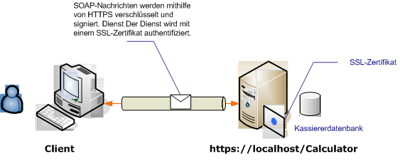

# <a name="transport-security-with-an-anonymous-client"></a><span data-ttu-id="d3eb4-104">Transport Sicherheit mit einem anonymen Client</span><span class="sxs-lookup"><span data-stu-id="d3eb4-104">Transport security with an anonymous client</span></span>

<span data-ttu-id="d3eb4-105">Dieses Windows Communication Foundation (WCF)-Szenario verwendet Transportsicherheit (HTTPS), um Vertraulichkeit und Integrität sicherzustellen.</span><span class="sxs-lookup"><span data-stu-id="d3eb4-105">This Windows Communication Foundation (WCF) scenario uses transport security (HTTPS) to ensure confidentiality and integrity.</span></span> <span data-ttu-id="d3eb4-106">Der Server muss mit einem SSL-Zertifikat authentifiziert werden, und die Clients müssen das Zertifikat des Servers als vertrauenswürdig ansehen.</span><span class="sxs-lookup"><span data-stu-id="d3eb4-106">The server must be authenticated with a Secure Sockets Layer (SSL) certificate, and the clients must trust the server's certificate.</span></span> <span data-ttu-id="d3eb4-107">Der Client wird von keinem Mechanismus authentifiziert und ist deshalb anonym.</span><span class="sxs-lookup"><span data-stu-id="d3eb4-107">The client is not authenticated by any mechanism and is, therefore, anonymous.</span></span>

<span data-ttu-id="d3eb4-108">Eine Beispielanwendung finden Sie unter [WS-Transport Sicherheit](../samples/ws-transport-security.md).</span><span class="sxs-lookup"><span data-stu-id="d3eb4-108">For a sample application, see [WS Transport Security](../samples/ws-transport-security.md).</span></span> <span data-ttu-id="d3eb4-109">Weitere Informationen zur Transportsicherheit finden Sie unter [Übersicht über die Transportsicherheit](transport-security-overview.md).</span><span class="sxs-lookup"><span data-stu-id="d3eb4-109">For more information about transport security, see [Transport Security Overview](transport-security-overview.md).</span></span>

<span data-ttu-id="d3eb4-110">Weitere Informationen zum Verwenden eines Zertifikats mit einem Dienst finden Sie unter [Arbeiten mit Zertifikaten](working-with-certificates.md) und Gewusst [wie: Konfigurieren eines Ports mit einem SSL-Zertifikat](how-to-configure-a-port-with-an-ssl-certificate.md).</span><span class="sxs-lookup"><span data-stu-id="d3eb4-110">For more information about using a certificate with a service, see [Working with Certificates](working-with-certificates.md) and [How to: Configure a Port with an SSL Certificate](how-to-configure-a-port-with-an-ssl-certificate.md).</span></span>



|<span data-ttu-id="d3eb4-112">Merkmal</span><span class="sxs-lookup"><span data-stu-id="d3eb4-112">Characteristic</span></span>|<span data-ttu-id="d3eb4-113">BESCHREIBUNG</span><span class="sxs-lookup"><span data-stu-id="d3eb4-113">Description</span></span>|
|--------------------|-----------------|
|<span data-ttu-id="d3eb4-114">Sicherheitsmodus</span><span class="sxs-lookup"><span data-stu-id="d3eb4-114">Security Mode</span></span>|<span data-ttu-id="d3eb4-115">Transport</span><span class="sxs-lookup"><span data-stu-id="d3eb4-115">Transport</span></span>|
|<span data-ttu-id="d3eb4-116">Interoperabilität</span><span class="sxs-lookup"><span data-stu-id="d3eb4-116">Interoperability</span></span>|<span data-ttu-id="d3eb4-117">Mit vorhandenen Webdiensten und Webclients</span><span class="sxs-lookup"><span data-stu-id="d3eb4-117">With existing Web services and clients</span></span>|
|<span data-ttu-id="d3eb4-118">Authentifizierung (Server)</span><span class="sxs-lookup"><span data-stu-id="d3eb4-118">Authentication (Server)</span></span><br /><br /> <span data-ttu-id="d3eb4-119">Authentifizierung (Client)</span><span class="sxs-lookup"><span data-stu-id="d3eb4-119">Authentication (Client)</span></span>|<span data-ttu-id="d3eb4-120">Ja</span><span class="sxs-lookup"><span data-stu-id="d3eb4-120">Yes</span></span><br /><br /> <span data-ttu-id="d3eb4-121">Anwendungsebene (keine WCF-Unterstützung)</span><span class="sxs-lookup"><span data-stu-id="d3eb4-121">Application level (no WCF support)</span></span>|
|<span data-ttu-id="d3eb4-122">Integrität</span><span class="sxs-lookup"><span data-stu-id="d3eb4-122">Integrity</span></span>|<span data-ttu-id="d3eb4-123">Ja</span><span class="sxs-lookup"><span data-stu-id="d3eb4-123">Yes</span></span>|
|<span data-ttu-id="d3eb4-124">Vertraulichkeit</span><span class="sxs-lookup"><span data-stu-id="d3eb4-124">Confidentiality</span></span>|<span data-ttu-id="d3eb4-125">Ja</span><span class="sxs-lookup"><span data-stu-id="d3eb4-125">Yes</span></span>|
|<span data-ttu-id="d3eb4-126">Transport</span><span class="sxs-lookup"><span data-stu-id="d3eb4-126">Transport</span></span>|<span data-ttu-id="d3eb4-127">HTTPS</span><span class="sxs-lookup"><span data-stu-id="d3eb4-127">HTTPS</span></span>|
|<span data-ttu-id="d3eb4-128">Bindung</span><span class="sxs-lookup"><span data-stu-id="d3eb4-128">Binding</span></span>|<xref:System.ServiceModel.WSHttpBinding>|

## <a name="service"></a><span data-ttu-id="d3eb4-129">Dienst</span><span class="sxs-lookup"><span data-stu-id="d3eb4-129">Service</span></span>

<span data-ttu-id="d3eb4-130">Der folgende Code und die folgende Konfiguration werden unabhängig voneinander ausgeführt.</span><span class="sxs-lookup"><span data-stu-id="d3eb4-130">The following code and configuration are meant to run independently.</span></span> <span data-ttu-id="d3eb4-131">Führen Sie eines der folgenden Verfahren aus:</span><span class="sxs-lookup"><span data-stu-id="d3eb4-131">Do one of the following:</span></span>

- <span data-ttu-id="d3eb4-132">Erstellen Sie einen separaten Dienst, indem Sie den Code ohne Konfiguration verwenden.</span><span class="sxs-lookup"><span data-stu-id="d3eb4-132">Create a stand-alone service using the code with no configuration.</span></span>

- <span data-ttu-id="d3eb4-133">Erstellen Sie mit der angegebenen Konfiguration einen Dienst, aber definieren Sie keine Endpunkte.</span><span class="sxs-lookup"><span data-stu-id="d3eb4-133">Create a service using the supplied configuration, but do not define any endpoints.</span></span>

### <a name="code"></a><span data-ttu-id="d3eb4-134">Code</span><span class="sxs-lookup"><span data-stu-id="d3eb4-134">Code</span></span>

<span data-ttu-id="d3eb4-135">Im folgenden Code wird gezeigt, wie ein Endpunkt mit Transportsicherheit erstellt wird:</span><span class="sxs-lookup"><span data-stu-id="d3eb4-135">The following code shows how to create an endpoint using transport security:</span></span>

[!code-csharp[c_SecurityScenarios#5](~/samples/snippets/csharp/VS_Snippets_CFX/c_securityscenarios/cs/source.cs#5)]
[!code-vb[c_SecurityScenarios#5](~/samples/snippets/visualbasic/VS_Snippets_CFX/c_securityscenarios/vb/source.vb#5)]

### <a name="configuration"></a><span data-ttu-id="d3eb4-136">Konfiguration</span><span class="sxs-lookup"><span data-stu-id="d3eb4-136">Configuration</span></span>

<span data-ttu-id="d3eb4-137">Mit dem folgenden Code wird derselbe Endpunkt mithilfe von Konfiguration eingerichtet.</span><span class="sxs-lookup"><span data-stu-id="d3eb4-137">The following code sets up the same endpoint using configuration.</span></span> <span data-ttu-id="d3eb4-138">Der Client wird von keinem Mechanismus authentifiziert und ist deshalb anonym.</span><span class="sxs-lookup"><span data-stu-id="d3eb4-138">The client is not authenticated by any mechanism, and is therefore anonymous.</span></span>

```xml
<?xml version="1.0" encoding="utf-8"?>
<configuration>
  <system.serviceModel>
    <services>
      <service name="ServiceModel.Calculator">
        <endpoint address="https://localhost/Calculator"
                  binding="wsHttpBinding"
                  bindingConfiguration="WSHttpBinding_ICalculator"
                  name="SecuredByTransportEndpoint"
                  contract="ServiceModel.ICalculator" />
      </service>
    </services>
    <bindings>
      <wsHttpBinding>
        <binding name="WSHttpBinding_ICalculator">
          <security mode="Transport">
            <transport clientCredentialType="None" />
          </security>
        </binding>
      </wsHttpBinding>
    </bindings>
    <client />
  </system.serviceModel>
</configuration>
```

## <a name="client"></a><span data-ttu-id="d3eb4-139">Client</span><span class="sxs-lookup"><span data-stu-id="d3eb4-139">Client</span></span>

<span data-ttu-id="d3eb4-140">Der folgende Code und die folgende Konfiguration werden unabhängig voneinander ausgeführt.</span><span class="sxs-lookup"><span data-stu-id="d3eb4-140">The following code and configuration are meant to run independently.</span></span> <span data-ttu-id="d3eb4-141">Führen Sie eines der folgenden Verfahren aus:</span><span class="sxs-lookup"><span data-stu-id="d3eb4-141">Do one of the following:</span></span>

- <span data-ttu-id="d3eb4-142">Erstellen Sie mit dem Code (und Clientcode) einen eigenständigen Client.</span><span class="sxs-lookup"><span data-stu-id="d3eb4-142">Create a stand-alone client using the code (and client code).</span></span>

- <span data-ttu-id="d3eb4-143">Erstellen Sie einen Client, der keine Endpunktadressen definiert.</span><span class="sxs-lookup"><span data-stu-id="d3eb4-143">Create a client that does not define any endpoint addresses.</span></span> <span data-ttu-id="d3eb4-144">Verwenden Sie stattdessen den Clientkonstruktor, der den Konfigurationsnamen als Argument verwendet.</span><span class="sxs-lookup"><span data-stu-id="d3eb4-144">Instead, use the client constructor that takes the configuration name as an argument.</span></span> <span data-ttu-id="d3eb4-145">Zum Beispiel:</span><span class="sxs-lookup"><span data-stu-id="d3eb4-145">For example:</span></span>

     [!code-csharp[C_SecurityScenarios#0](~/samples/snippets/csharp/VS_Snippets_CFX/c_securityscenarios/cs/source.cs#0)]
     [!code-vb[C_SecurityScenarios#0](~/samples/snippets/visualbasic/VS_Snippets_CFX/c_securityscenarios/vb/source.vb#0)]

### <a name="code"></a><span data-ttu-id="d3eb4-146">Code</span><span class="sxs-lookup"><span data-stu-id="d3eb4-146">Code</span></span>

[!code-csharp[c_SecurityScenarios#6](~/samples/snippets/csharp/VS_Snippets_CFX/c_securityscenarios/cs/source.cs#6)]
[!code-vb[c_SecurityScenarios#6](~/samples/snippets/visualbasic/VS_Snippets_CFX/c_securityscenarios/vb/source.vb#6)]

### <a name="configuration"></a><span data-ttu-id="d3eb4-147">Konfiguration</span><span class="sxs-lookup"><span data-stu-id="d3eb4-147">Configuration</span></span>

<span data-ttu-id="d3eb4-148">Die folgende Konfiguration kann statt des Codes verwendet werden, um den Dienst einzurichten.</span><span class="sxs-lookup"><span data-stu-id="d3eb4-148">The following configuration can be used instead of the code to set up the service.</span></span>

```xml
<configuration>
  <system.serviceModel>
    <bindings>
      <wsHttpBinding>
        <binding name="WSHttpBinding_ICalculator" >
          <security mode="Transport">
            <transport clientCredentialType="None" />
          </security>
        </binding>
      </wsHttpBinding>
    </bindings>
    <client>
      <endpoint address="https://machineName/Calculator"
                binding="wsHttpBinding"
                bindingConfiguration="WSHttpBinding_ICalculator"
                contract="ICalculator"
                name="WSHttpBinding_ICalculator" />
    </client>
  </system.serviceModel>
</configuration>
```

## <a name="see-also"></a><span data-ttu-id="d3eb4-149">Siehe auch</span><span class="sxs-lookup"><span data-stu-id="d3eb4-149">See also</span></span>

- [<span data-ttu-id="d3eb4-150">Sicherheitsübersicht</span><span class="sxs-lookup"><span data-stu-id="d3eb4-150">Security Overview</span></span>](security-overview.md)
- [<span data-ttu-id="d3eb4-151">WS-Transportsicherheit</span><span class="sxs-lookup"><span data-stu-id="d3eb4-151">WS Transport Security</span></span>](../samples/ws-transport-security.md)
- [<span data-ttu-id="d3eb4-152">Übersicht über die Transportsicherheit</span><span class="sxs-lookup"><span data-stu-id="d3eb4-152">Transport Security Overview</span></span>](transport-security-overview.md)
- <span data-ttu-id="d3eb4-153">[Sicherheitsmodell für Windows Server AppFabric](/previous-versions/appfabric/ee677202(v=azure.10))</span><span class="sxs-lookup"><span data-stu-id="d3eb4-153">[Security Model for Windows Server App Fabric](/previous-versions/appfabric/ee677202(v=azure.10))</span></span>
