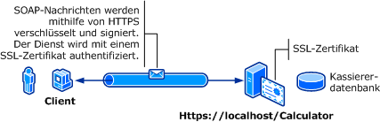

# Transportsicherheit mit Standardauthentifizierung
Die folgende Abbildung zeigt einen [!INCLUDE[indigo1](../../../../includes/indigo1-md.md)]\-Dienst und \-Client.  Der Server benötigt ein gültiges X.509\-Zertifikat, das für Secure Sockets Layer \(SSL\) verwendet werden kann, und die Clients müssen das Zertifikat des Servers als vertrauenswürdig ansehen.  Außerdem verfügt der Webdienst bereits über eine SSL\-Implementierung, die Sie verwenden können.  [!INCLUDE[crabout](../../../../includes/crabout-md.md)] dazu, wie Sie die Standardauthentifizierung unter Internetinformationsdienste \(IIS\) aktivieren, finden Sie unter [http:\/\/go.microsoft.com\/fwlink\/?LinkId\=83822](http://go.microsoft.com/fwlink/?LinkId=83822).  
  
   
  
|Merkmal|Beschreibung|  
|-------------|------------------|  
|Sicherheitsmodus|Transport|  
|Interoperabilität|Mit vorhandenen Webdienstclients und Diensten|  
|Authentifizierung \(Server\)<br /><br /> Authentifizierung \(Client\)|Ja \(mithilfe von HTTPS\)<br /><br /> Ja \(mithilfe von Benutzername\/Kennwort\)|  
|Integrität|Ja|  
|Vertraulichkeit|Ja|  
|Transport|HTTPS|  
|Bindung|<xref:System.ServiceModel.WSHttpBinding>|  
  
## Dienst  
 Der folgende Code und die folgende Konfiguration werden unabhängig voneinander ausgeführt.  Führen Sie einen der folgenden Schritte aus:  
  
-   Erstellen Sie einen separaten Dienst, indem Sie den Code ohne Konfiguration verwenden.  
  
-   Erstellen Sie mit der angegebenen Konfiguration einen Dienst, aber definieren Sie keine Endpunkte.  
  
### Code  
 Der folgende Code zeigt, wie Sie einen Dienstendpunkt erstellen, der zur Sicherstellung der Übertragungssicherheit einen Benutzernamen und ein Kennwort für die Windows\-Domäne verwendet.  Beachten Sie, dass der Dienst ein X.509\-Zertifikat erfordert, um den Client zu authentifizieren.  Weitere Informationen finden Sie unter [Verwenden von Zertifikaten](../../../../docs/framework/wcf/feature-details/working-with-certificates.md) und [Vorgehensweise: Konfigurieren eines Anschlusses mit einem SSL\-Zertifikat](../../../../docs/framework/wcf/feature-details/how-to-configure-a-port-with-an-ssl-certificate.md).  
  
 [!code-csharp[C_SecurityScenarios#1](../../../../samples/snippets/csharp/VS_Snippets_CFX/c_securityscenarios/cs/source.cs#1)]
 [!code-vb[C_SecurityScenarios#1](../../../../samples/snippets/visualbasic/VS_Snippets_CFX/c_securityscenarios/vb/source.vb#1)]  
  
## Konfiguration  
 Der folgende Code konfiguriert einen Dienst, um die Standardauthentifizierung mit der Sicherheit auf Transportebene zu verwenden:  
  
```  
<?xml version="1.0" encoding="utf-8"?>  
<configuration>  
    <system.serviceModel>  
        <bindings>  
            <wsHttpBinding>  
                <binding name="UsernameWithTransport">  
                    <security mode="Transport">  
                        <transport clientCredentialType="Basic" />  
                    </security>  
                </binding>  
            </wsHttpBinding>  
        </bindings>  
        <services>  
            <service name="BasicAuthentication.Calculator">  
                <endpoint address="https://localhost/Calculator"  
                          binding="wsHttpBinding"   
                          bindingConfiguration="UsernameWithTransport"  
                          name="BasicEndpoint"   
                          contract="BasicAuthentication.ICalculator" />  
            </service>  
        </services>  
    </system.serviceModel>  
</configuration>  
```  
  
## Client  
  
### Code  
 Der folgende Code zeigt den Clientcode, der den Benutzernamen und das Kennwort enthält.  Beachten Sie, dass der Benutzer einen gültigen Windows\-Benutzernamen und ein Kennwort angeben muss.  Der Code zum Zurückgeben des Benutzernamens und des Kennworts ist hier nicht gezeigt.  Verwenden Sie ein Dialogfeld oder ein anderes Oberflächenelement, um die Informationen vom Benutzer abzufragen.  
  
> [!NOTE]
>  Sie können den Benutzernamen und das Kennwort nur mithilfe von Code festlegen.  
  
 [!code-csharp[C_SecurityScenarios#2](../../../../samples/snippets/csharp/VS_Snippets_CFX/c_securityscenarios/cs/source.cs#2)]
 [!code-vb[C_SecurityScenarios#2](../../../../samples/snippets/visualbasic/VS_Snippets_CFX/c_securityscenarios/vb/source.vb#2)]  
  
### Konfiguration  
 Der folgende Code zeigt die Clientkonfiguration.  
  
> [!NOTE]
>  Sie können die Konfiguration nicht verwenden, um den Benutzernamen und das Kennwort festzulegen.  Die hier gezeigte Konfiguration muss mithilfe von Code erweitert werden, um den Benutzernamen und das Kennwort festzulegen.  
  
```  
<?xml version="1.0" encoding="utf-8"?>  
<configuration>  
  <system.serviceModel>  
    <bindings>  
      <wsHttpBinding>  
        <binding name="WSHttpBinding_ICalculator" >  
          <security mode="Transport">  
            <transport clientCredentialType="Basic" />  
          </security>  
        </binding>  
      </wsHttpBinding>  
    </bindings>  
    <client>  
      <endpoint address="https://machineName/Calculator"   
                binding="wsHttpBinding"  
                bindingConfiguration="WSHttpBinding_ICalculator"   
                contract="ICalculator"  
                name="WSHttpBinding_ICalculator" />  
    </client>  
  </system.serviceModel>  
</configuration>  
```  
  
## Siehe auch  
 <xref:System.ServiceModel.ClientBase%601.ClientCredentials%2A>   
 <xref:System.ServiceModel.Security.UserNamePasswordClientCredential>   
 [Verwenden von Zertifikaten](../../../../docs/framework/wcf/feature-details/working-with-certificates.md)   
 [Vorgehensweise: Konfigurieren eines Anschlusses mit einem SSL\-Zertifikat](../../../../docs/framework/wcf/feature-details/how-to-configure-a-port-with-an-ssl-certificate.md)   
 [Übersicht über die Sicherheit](../../../../docs/framework/wcf/feature-details/security-overview.md)   
 [\<clientCredentials\>](../../../../docs/framework/configure-apps/file-schema/wcf/clientcredentials.md)   
 [Sicherheitsmodell für Windows Server AppFabric](http://go.microsoft.com/fwlink/?LinkID=201279&clcid=0x409)