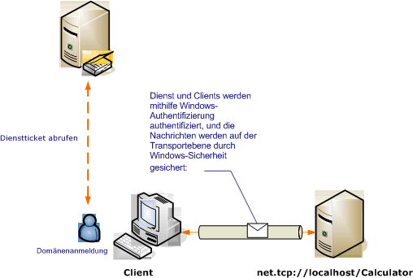

# <a name="transport-security-with-windows-authentication"></a>Transportsicherheit mit Windows-Authentifizierung
Das folgende Szenario zeigt einen Windows Communication Foundation (WCF)-Client und Dienst, die durch die Windows-Sicherheit geschützt. Weitere Informationen zur Programmierung finden Sie unter [Vorgehensweise: Sichern eines Diensts mit Windows-Anmeldeinformationen](../../../../docs/framework/wcf/how-to-secure-a-service-with-windows-credentials.md).  
  
 Ein Intranetwebdienst zeigt Personalinformationen an. Der Client ist eine Windows Forms-Anwendung. Die Anwendung wird in einer Domäne mit einem Kerberos-Controller bereitgestellt, der die Domäne sichert.  
  
   
  
|Merkmal|Beschreibung|  
|--------------------|-----------------|  
|Sicherheitsmodus|Transport|  
|Interoperabilität|Nur WCF|  
|Authentifizierung (Server)<br /><br /> Authentifizierung (Client)|Ja (mithilfe der integrierten Windows-Authentifizierung)<br /><br /> Ja (mithilfe der integrierten Windows-Authentifizierung)|  
|Integrität|Ja|  
|Vertraulichkeit|Ja|  
|Transport|NET.TCP|  
|Bindung|<xref:System.ServiceModel.NetTcpBinding>|  
  
## <a name="service"></a>Dienst  
 Der folgende Code und die folgende Konfiguration werden unabhängig voneinander ausgeführt. Führen Sie einen der folgenden Schritte aus:  
  
-   Erstellen Sie einen separaten Dienst, indem Sie den Code ohne Konfiguration verwenden.  
  
-   Erstellen Sie mit der angegebenen Konfiguration einen Dienst, aber definieren Sie keine Endpunkte.  
  
### <a name="code"></a>Code  
 Im folgenden Code wird gezeigt, wie ein Dienstendpunkt, der Windows-Sicherheit verwendet, erstellt wird.  
  
 [!code-csharp[C_SecurityScenarios#3](../../../../samples/snippets/csharp/VS_Snippets_CFX/c_securityscenarios/cs/source.cs#3)]
 [!code-vb[C_SecurityScenarios#3](../../../../samples/snippets/visualbasic/VS_Snippets_CFX/c_securityscenarios/vb/source.vb#3)]  
  
### <a name="configuration"></a>Konfiguration  
 Die folgende Konfiguration kann statt des Codes verwendet werden, um den Dienstendpunkt einzurichten:  
  
```xml  
<?xml version="1.0" encoding="utf-8"?>  
<configuration>  
  <system.serviceModel>  
    <behaviors />  
    <services>  
      <service behaviorConfiguration="" name="ServiceModel.Calculator">  
        <endpoint address="net.tcp://localhost:8008/Calculator"   
                  binding="netTcpBinding"  
          bindingConfiguration="WindowsClientOverTcp"   
                  name="WindowsClientOverTcp"  
                  contract="ServiceModel.ICalculator" />  
      </service>  
    </services>  
    <bindings>  
      <netTcpBinding>  
        <binding name="WindowsClientOverTcp">  
          <security mode="Transport">  
            <transport clientCredentialType="Windows" />  
          </security>  
        </binding>  
      </netTcpBinding>  
    </bindings>  
    <client />  
  </system.serviceModel>  
</configuration>  
```  
  
## <a name="client"></a>Client  
 Der folgende Code und die folgende Konfiguration werden unabhängig voneinander ausgeführt. Führen Sie einen der folgenden Schritte aus:  
  
-   Erstellen Sie mit dem Code (und Clientcode) einen eigenständigen Client.  
  
-   Erstellen Sie einen Client, der keine Endpunktadressen definiert. Verwenden Sie stattdessen den Clientkonstruktor, der den Konfigurationsnamen als Argument verwendet. Beispiel:  
  
     [!code-csharp[C_SecurityScenarios#0](../../../../samples/snippets/csharp/VS_Snippets_CFX/c_securityscenarios/cs/source.cs#0)]
     [!code-vb[C_SecurityScenarios#0](../../../../samples/snippets/visualbasic/VS_Snippets_CFX/c_securityscenarios/vb/source.vb#0)]  
  
### <a name="code"></a>Code  
 Der folgende Code erstellt den Client. Die Bindung ist für die Verwendung der Transportmodussicherheit mit dem TCP-Transport konfiguriert, wobei der Clientanmeldeinformationstyp auf Windows festgelegt ist.  
  
 [!code-csharp[C_SecurityScenarios#4](../../../../samples/snippets/csharp/VS_Snippets_CFX/c_securityscenarios/cs/source.cs#4)]
 [!code-vb[C_SecurityScenarios#4](../../../../samples/snippets/visualbasic/VS_Snippets_CFX/c_securityscenarios/vb/source.vb#4)]  
  
### <a name="configuration"></a>Konfiguration  
 Die folgende Konfiguration kann statt des Codes verwendet werden, um den Client zu erstellen.  
  
```xml  
<?xml version="1.0" encoding="utf-8"?>  
<configuration>  
  <system.serviceModel>  
    <bindings>  
      <netTcpBinding>  
        <binding name="NetTcpBinding_ICalculator" >  
          <security mode="Transport">  
            <transport clientCredentialType="Windows" />  
          </security>  
        </binding>  
      </netTcpBinding>  
    </bindings>  
    <client>  
      <endpoint address="net.tcp://localhost:8008/Calculator"   
                binding="netTcpBinding"            
                bindingConfiguration="NetTcpBinding_ICalculator"   
                contract="ICalculator"  
                name="NetTcpBinding_ICalculator">  
      </endpoint>  
    </client>  
  </system.serviceModel>  
</configuration>  
```  
  
## <a name="see-also"></a>Siehe auch  
 [Übersicht über die Sicherheit](../../../../docs/framework/wcf/feature-details/security-overview.md)  
 [Vorgehensweise: Sichern eines Dienstes mit Windows-Anmeldeinformationen](../../../../docs/framework/wcf/how-to-secure-a-service-with-windows-credentials.md)  
 [Sicherheitsmodell für Windows Server AppFabric](https://go.microsoft.com/fwlink/?LinkID=201279&clcid=0x409)
