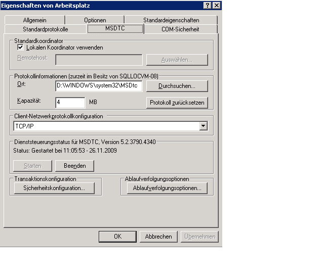

# Problembehandlung bei Nachrichtenwarteschlangen
Dieser Abschnitt enthält allgemeine Fragen und Hinweise zur Problembehandlung bei der Verwendung von Warteschlangen in [!INCLUDE[indigo1](../../../../includes/indigo1-md.md)].  
  
## Allgemeine Fragen  
 **F:** Ich habe [!INCLUDE[indigo2](../../../../includes/indigo2-md.md)] Beta 1 verwendet und den MSMQ\-Hotfix installiert.Muss ich den Hotfix entfernen?  
  
 **A:** Ja.Dieses Hotfix wird nicht mehr unterstützt.[!INCLUDE[indigo2](../../../../includes/indigo2-md.md)] funktioniert nun ohne Hotfix mit MSMQ.  
  
 **F:** Für MSMQ stehen zwei Bindungen zur Verfügung: <xref:System.ServiceModel.NetMsmqBinding> und <xref:System.ServiceModel.MsmqIntegration.MsmqIntegrationBinding>.Welche sollte ich wann verwenden?  
  
 **A:** Verwenden Sie <xref:System.ServiceModel.NetMsmqBinding>, wenn Sie MSMQ als Transport für eine Warteschlangenkommunikation zwischen zwei [!INCLUDE[indigo2](../../../../includes/indigo2-md.md)]\-Anwendungen einsetzen möchten.Verwenden Sie <xref:System.ServiceModel.MsmqIntegration.MsmqIntegrationBinding>, wenn Sie vorhandene MSMQ\-Anwendungen für die Kommunikation mit neuen [!INCLUDE[indigo2](../../../../includes/indigo2-md.md)]\-Anwendungen verwenden möchten.  
  
 **F:** Muss ich MSMQ aktualisieren, um die <xref:System.ServiceModel.NetMsmqBinding>\-Bindung und die `MsmqIntegration`\-Bindung verwenden zu können?  
  
 **A:** Nein.Beide Bindungen funktionieren mit MSMQ 3.0 unter [!INCLUDE[wxp](../../../../includes/wxp-md.md)] und [!INCLUDE[ws2003](../../../../includes/ws2003-md.md)].Bestimmte Funktionen der Bindungen werden verfügbar, wenn Sie in [!INCLUDE[wv](../../../../includes/wv-md.md)] ein Upgrade auf MSMQ 4.0 ausführen.  
  
 **F:** Welche Funktionen der <xref:System.ServiceModel.NetMsmqBinding>\-Bindung und der <xref:System.ServiceModel.MsmqIntegration.MsmqIntegrationBinding>\-Bindung sind in MSMQ 4.0, nicht jedoch in MSMQ 3.0 verfügbar?  
  
 **A:** Die folgenden Funktionen sind in MSMQ 4.0 verfügbar, jedoch nicht in MSMQ 3.0:  
  
-   Benutzerdefinierte Warteschlange für unzustellbare Nachrichten wird nur in MSMQ 4.0 unterstützt.  
  
-   In MSMQ 3.0 und 4.0 werden nicht verarbeitbare Nachrichten unterschiedlich behandelt.  
  
-   Nur MSMQ 4.0 unterstützt remote durchgeführte Lesevorgänge.  
  
 [!INCLUDE[crdefault](../../../../includes/crdefault-md.md)] [Unterschiede zwischen den Warteschlangenfunktionen in Windows Vista, Windows Server 2003 und Windows XP](../../../../docs/framework/wcf/feature-details/diff-in-queue-in-vista-server-2003-windows-xp.md).  
  
 **F:** Kann ich MSMQ 3.0 auf einer Seite der Warteschlangenkommunikation und MSMQ 4.0 auf der anderen Seite verwenden?  
  
 **A:** Ja.  
  
 **F:** Ich möchte vorhandene MSMQ\-Anwendungen mit neuen [!INCLUDE[indigo2](../../../../includes/indigo2-md.md)]\-Clients oder \-Servern integrieren.Muss ich beide Seiten der MSMQ\-Infrastruktur aktualisieren?  
  
 **A:** Nein.Sie müssen keine Seite auf MSMQ 4.0 aktualisieren.  
  
## Problembehandlung  
 Dieser Abschnitt enthält Informationen zur Behandlung der häufigsten Probleme.Bei einigen Fragen handelt es sich um bekannte Einschränkungen, die auch in den Versionshinweisen erläutert werden.  
  
 **F:** Beim Versuch, eine private Warteschlange zu verwenden, wird die folgende Ausnahme ausgelöst: `System.InvalidOperationException`: Die URL ist ungültig.Die URL für die Warteschlange darf das Zeichen '$' nicht enthalten.Verwenden Sie die Syntax in net.msmq:\/\/machine\/private\/queueName, um eine private Warteschlange anzugeben.  
  
 **A:** Überprüfen Sie in der Konfiguration und im Code den URI \(Uniform Resource Identifier\) für die Warteschlange.Verwenden Sie kein "$"\-Zeichen im URI.Geben Sie z. B. zur Adressierung einer privaten Warteschlange mit dem Namen OrdersQueue den URI als net.msmq:\/\/localhost\/private\/ordersQueue an.  
  
 **F:** Durch Aufrufen von `ServiceHost.Open()` für meine in der Warteschlange befindliche Anwendung wird die folgende Ausnahme ausgelöst: `System.ArgumentException`: Eine Basisadresse kann keine URI\-Abfragezeichenfolge enthalten.Warum?  
  
 **A:** Überprüfen Sie den Warteschlangen\-URI in der Konfigurationsdatei und im Code.Zwar wird in MSMQ\-Warteschlangen die Verwendung von Fragezeichen \("?"\) unterstützt, diese werden von URIs jedoch als Beginn einer Zeichenfolgenabfrage interpretiert.Verwenden Sie deshalb Warteschlangennamen ohne Fragezeichen, um dieses Problem zu umgehen.  
  
 **F:** Der Sendevorgang war erfolgreich, trotzdem wird beim Empfänger kein Dienstvorgang aufgerufen.Warum?  
  
 **A:** Gehen Sie zur Beantwortung dieser Frage die folgende Liste durch:  
  
-   Überprüfen Sie, ob die Anforderungen der Transaktionswarteschlange mit den angegebenen Zusicherungen kompatibel sind.Beachten Sie die folgenden Prinzipien:  
  
    -   Permanente Nachrichten \(Datagramme und Sitzungen\) mit "genau einmal"\-Zusicherungen \(<xref:System.ServiceModel.MsmqBindingBase.ExactlyOnce%2A> \= `true`\) können nur an eine Transaktionswarteschlange gesendet werden.  
  
    -   Sitzungen können nur mit "genau einmal"\-Zusicherungen gesendet werden.  
  
    -   Eine Transaktion ist erforderlich, um Nachrichten in einer Sitzung von einer Transaktionswarteschlange zu empfangen.  
  
    -   Temporäre oder permanente Nachrichten \(nur Datagramme\) ohne Zusicherungen \(<xref:System.ServiceModel.MsmqBindingBase.ExactlyOnce%2A> \= `false`\) können nur an eine nicht transaktionale Warteschlange gesendet werden.  
  
-   Überprüfen Sie die Warteschlange für unzustellbare Nachrichten.Wenn Sie die Nachrichten dort finden, stellen Sie fest, warum sie nicht zugestellt wurden.  
  
-   Überprüfen Sie die ausgehenden Warteschlangen auf Konnektivitäts\- oder Adressierungsprobleme.  
  
 **F:** Ich habe eine benutzerdefinierte Warteschlange für unzustellbare Nachrichten angegeben, doch beim Starten der Sendeanwendung wird eine Ausnahme ausgelöst. Die Ausnahme besagt, dass die Warteschlange für unzustellbare Nachrichten nicht gefunden wurde oder die Sendeanwendung keine Berechtigungen für diese Warteschlange besitzt.Warum geschieht das?  
  
 **A:** Der URI der benutzerdefinierten Warteschlange für unzustellbare Nachrichten muss im ersten Segment einen lokalen Host \(localhost\) oder den Namen des Computers enthalten. Beispiel: net.msmq:\/\/localhost\/private\/meineUnzustWarteschlange.  
  
 **F:** Muss immer eine benutzerdefinierte Warteschlange für unzustellbare Nachrichten erstellt werden, oder gibt es eine Standardwarteschlange für diesen Zweck?  
  
 **A:** Wenn Sie bei "genau einmal"\-Zusicherungen \(<xref:System.ServiceModel.MsmqBindingBase.ExactlyOnce%2A> \= `true`\) keine benutzerdefinierte Warteschlange für unzustellbare Nachrichten angeben, wird als Standard die systemweite Transaktionswarteschlange für unzustellbare Nachrichten verwendet.  
  
 Bei keinen Zusicherungen \(<xref:System.ServiceModel.MsmqBindingBase.ExactlyOnce%2A> \= `false`\) gibt es als Standard keine Warteschlangenfunktionalität für unzustellbare Nachrichten.  
  
 **F:** Mein Dienst löst bei SvcHost.Open eine Ausnahme mit der Nachricht "EndpointListener\-Anforderungen können durch die ListenerFactory nicht erfüllt werden" aus.Warum?  
  
 A.Überprüfen Sie den Dienstvertrag.Möglicherweise haben Sie vergessen "IsOneWay\=`true`" für alle Dienstvorgänge festzulegen.Warteschlangen unterstützen nur unidirektionale Dienstvorgänge.  
  
 **F:** Es befinden sich Nachrichten in der Warteschlange, doch es wird kein Dienstvorgang aufgerufen.Wo liegt das Problem?  
  
 **A:** Stellen Sie fest, ob der Diensthost fehlerhaft ist.Sie können das feststellen, indem Sie die Ablaufverfolgung überprüfen oder `IErrorHandler` implementieren.Der Diensthost schlägt standardmäßig fehl, wenn eine nicht verarbeitbare Nachrichten erkannt wird.  
  
 **F:** Es befinden sich Nachrichten in der Warteschlange, der im Internet gehostete Dienst in der Warteschlange wird jedoch nicht aktiviert.Warum?  
  
 **A:** Dies ist zumeist auf die Berechtigungen zurückzuführen.  
  
1.  Stellen Sie sicher, dass der `NetMsmqActivator`\-Prozess ausgeführt wird und die Identität des `NetMsmqActivator`\-Prozesses Lese\- und Suchberechtigungen für die Warteschlange besitzt.  
  
2.  Wenn `NetMsmqActivator` Warteschlangen auf einem Remotecomputer überwacht, stellen Sie sicher, dass `NetMsmqActivator` unter keinem eingeschränkten Token ausgeführt wird.So führen Sie `NetMsmqActivator` mit einem uneingeschränkten Token aus:  
  
    ```  
    sc sidtype NetMsmqActivator unrestricted  
    ```  
  
 Informationen zum Webhosting, die sich nicht auf die Sicherheit beziehen, finden Sie unter [Webhosting einer Anwendung mit Queuing](../../../../docs/framework/wcf/feature-details/web-hosting-a-queued-application.md).  
  
 **F:** Wie kann am einfachsten auf Sitzungen zugegriffen werden?  
  
 **A:** Legen Sie "AutoComplete\=`true`" für den Vorgang fest, der sich auf die letzte Nachricht in der Sitzung bezieht, und legen Sie "AutoComplete\=`false`" für alle übrigen Dienstvorgänge fest.  
  
 **F:** Wo finde ich Antworten auf allgemeine Fragen zu MSMQ?  
  
 **A:** [!INCLUDE[crabout](../../../../includes/crabout-md.md)] zu MSMQ finden Sie unter [Microsoft Message Queuing](http://go.microsoft.com/fwlink/?LinkId=87810) \(möglicherweise in englischer Sprache\).  
  
 **F:** Warum löst der Dienst beim Lesen einer Warteschlange, die sowohl Sitzungsnachrichten als auch Datagrammnachrichten enthält, eine `ProtocolException` aus?  
  
 **A:** Es besteht ein grundlegender Unterschied im Aufbau von Sitzungsnachrichten und Datagrammnachrichten in einer Warteschlange.Deshalb kann ein Dienst, der eine Sitzungsnachricht in einer Warteschlange lesen soll, keine Datagrammnachricht empfangen, und kann ein Dienst, der eine Datagrammnachricht in einer Warteschlange lesen soll, keine Sitzungsnachricht empfangen.Bei dem Versuch, beide Nachrichtentypen in derselben Warteschlange zu lesen, wird die folgende Ausnahme ausgelöst:  
  
```  
System.ServiceModel.MsmqPoisonMessageException: The transport channel detected a poison message. This occurred because the message exceeded the maximum number of delivery attempts or because the channel detected a fundamental problem with the message. The inner exception may contain additional information.   
---> System.ServiceModel.ProtocolException: An incoming MSMQ message contained invalid or unexpected .NET Message Framing information in its body. The message cannot be received. Ensure that the sender is using a compatible service contract with a matching SessionMode.  
```  
  
 Bei der systemweiten Warteschlange für unzustellbare Nachrichten und auch bei benutzerdefinierten Warteschlangen für unzustellbare Nachrichten tritt dieses Problem schnell auf, wenn eine Anwendung Sitzungsnachrichten und Datagrammnachrichten in Warteschlangen vom selben Computer aus sendet.Wenn eine Nachricht nicht erfolgreich gesendet werden kann, wird sie in die Warteschlange für unzustellbare Nachrichten verschoben.Aus diesem Grund kann es vorkommen, dass sich sowohl Sitzung\- als auch Datagrammnachrichten in der Warteschlange für unzustellbare Nachrichten befinden.Es gibt keine Möglichkeit, die beiden Nachrichtentypen beim Lesen einer Warteschlange zur Laufzeit zu trennen. Deshalb sollten Anwendungen Sitzungsnachrichten und Datagrammnachrichten in Warteschlangen nicht vom selben Computer aus senden.  
  
### MSMQ\-Integration: Spezielle Problembehandlung  
 **F:** Wenn ich beim Senden einer Nachricht den Diensthost öffne, gibt eine Fehlermeldung an, dass das Schema falsch ist.Warum?  
  
 **A:** Bei Verwendung der MSMQ\-Integrationsbindung muss das msmq.formatname\-Schema verwendet werden.Beispiel: msmq.formatname:DIRECT\=OS:.\\private$\\OrdersQueue.Wenn Sie jedoch die benutzerdefinierte Warteschlange für unzustellbare Nachrichten angeben, müssen Sie das net.msmq\-Schema verwenden.  
  
 **F:** Wenn ich einen öffentlichen oder privaten Formatnamen verwende und den Diensthost unter [!INCLUDE[wv](../../../../includes/wv-md.md)] öffne, wird ein Fehler angezeigt.Warum?  
  
 **A:** Der [!INCLUDE[indigo2](../../../../includes/indigo2-md.md)]\-Integrationskanal unter [!INCLUDE[wv](../../../../includes/wv-md.md)] überprüft, ob eine untergeordnete Warteschlange für die Hauptwarteschlage der Anwendung geöffnet werden kann, um unzustellbare Nachrichten zu verarbeiten.Der Name der untergeordneten Warteschlange wird von einem an den Listener übergebenen msmq.formatname\-URI abgeleitet.Der Name der untergeordneten Warteschlange kann in MSMQ nur ein direkter Formatname sein.Deshalb tritt der Fehler auf.Ändern Sie den Warteschlangen\-URI in einen direkten Formatnamen.  
  
 **F:** Beim Empfang einer Nachricht von einer MSMQ\-Anwendung verbleibt die Nachricht in der Warteschlange, ohne von der empfangenen [!INCLUDE[indigo2](../../../../includes/indigo2-md.md)]\-Anwendung gelesen zu werden.Warum?  
  
 **A:** Überprüfen Sie, ob die Nachricht einen Text enthält.Ohne Nachrichtentext ignoriert der MSMQ\-Integrationskanal die Nachricht.Implementieren Sie `IErrorHandler`, um bei Ausnahmen benachrichtigt zu werden, und überprüfen Sie die Ablaufverfolgungen.  
  
### Sicherheitsrelevante Problembehandlung  
 **F:** Beim Ausführen des Beispiels, in dem eine Standardbindung im Arbeitsgruppenmodus verwendet wird, werden Nachrichten scheinbar gesendet, kommen jedoch nie beim Empfänger an.  
  
 **A:** Nachrichten werden standardmäßig mit einem internen MSMQ\-Zertifikat signiert, das den Active Directory\-Verzeichnisdienst erfordert.Da Active Directory im Arbeitsgruppenmodus nicht verfügbar ist, verursacht das Signieren der Nachricht einen Fehler.Folglich kommt die Nachricht in die Warteschlange für unzustellbare Nachrichten, und eine Fehlerursache, wie z. B. "Ungültige Signatur", wird angegeben.  
  
 Sie können das Problem beheben, indem Sie die Sicherheit deaktivien.Legen Sie dazu <xref:System.ServiceModel.NetMsmqSecurity.Mode%2A> \= <xref:System.ServiceModel.NetMsmqSecurityMode> fest, damit das Beispiel im Arbeitsgruppenmodus funktioniert.  
  
 Eine weitere Möglichkeit besteht darin, <xref:System.ServiceModel.MsmqTransportSecurity> aus der <xref:System.ServiceModel.NetMsmqSecurity.Transport%2A>\-Eigenschaft abzurufen und auf <xref:System.ServiceModel.MsmqAuthenticationMode> festzulegen und dann das Clientzertifikat festzulegen.  
  
 Sie können das Problem auch beheben, indem Sie MSMQ mit Active Directory\-Integration installieren.  
  
 **F:** Wenn ich \(bei aktivierter Transportsicherheit\) eine Nachricht mit Standardbindung in Active Directory an eine Warteschlange sende, wird eine Meldung vom Typ "internes Zertifikat wurde nicht gefunden" angezeigt.Wie kann ich das Problem beheben?  
  
 **A:** Das bedeutet, dass das Zertifikat in Active Directory für den Absender erneuert werden muss.Öffnen Sie dazu **Systemsteuerung**, **Verwaltung**, **Computerverwaltung**. Klicken Sie mit der rechten Maustaste auf **MSMQ**, und wählen Sie **Eigenschaften** aus.Wählen Sie die Registerkarte **Benutzerzertifikat** aus, und klicken Sie auf die Schaltfläche **Erneuern**.  
  
 **F:** Wenn ich eine Nachricht mit <xref:System.ServiceModel.MsmqAuthenticationMode> sende und das zu verwendende Zertifikat angebe, erhalte ich eine Meldung vom Typ "Ungültiges Zertifikat".Wie kann ich das Problem beheben?  
  
 **A:** Sie können keinen Zertifikatspeicher des lokalen Computers mit dem Zertifikatmodus verwenden.Sie müssen das Zertifikat mit dem Zertifikat\-Snap\-In aus dem Zertifikatspeicher des Computers in den Speicher des aktuellen Benutzers kopieren.So rufen Sie das Zertifikat\-Snap\-In auf:  
  
1.  Klicken Sie auf **Start** und dann auf **Ausführen**, geben Sie `mmc` ein, und klicken Sie auf **OK**.  
  
2.  Öffnen Sie in **Microsoft Management Console** das Menü **Datei**, und klicken Sie auf **Snap\-In hinzufügen\/entfernen**.  
  
3.  Klicken Sie im Dialogfeld **Snap\-In hinzufügen\/entfernen** auf die Schaltfläche **Hinzufügen**.  
  
4.  Wählen Sie im Dialogfeld **Eigenständiges Snap\-In hinzufügen** Zertifikate aus, und klicken Sie auf **Hinzufügen**.  
  
5.  Wählen Sie im Dialogfeld **Zertifikate** des Snap\-Ins **Eigenes Benutzerkonto** aus, und klicken Sie auf **Fertig stellen**.  
  
6.  Fügen Sie anschließend ein zweites Zertifkat\-Snap\-In hinzu. Wiederholen Sie dazu die vorherigen Schritte. Wählen Sie dieses Mal jedoch **Computerkonto** aus, und klicken Sie auf **Weiter**.  
  
7.  Wählen Sie **Lokaler Computer** aus, und klicken Sie auf **Fertig stellen**.Sie können jetzt Zertifikate per Drag & Drop aus dem Computerzertifikatspeicher in den Speicher des aktuellen Benutzers verschieben.  
  
 **F:** Wenn mein Dienst eine Warteschlage auf einem anderen Computer im Arbeitsgruppenmodus liest, wird eine Ausnahme vom Typ "Zugriff verweigert" ausgelöst.  
  
 **A:** Damit eine Remoteanwendung im Arbeitsgruppenmodus auf eine Warteschlange zugreifen kann, muss die Anwendung die entsprechenden Berechtigungen besitzen.Fügen Sie der Zugriffssteuerungsliste \(ACL\) der Warteschlange "Anonyme Anmeldung" hinzu, und erteilen Sie ihr die Leseberechtigung.  
  
 **F:** Wenn ein Netzwerkdienstclient \(oder sonstiger Client ohne Domänenkonto\) eine Nachricht in eine Warteschlange sendet, schlägt der Sendevorgang wegen eines ungültigen Zertifikats fehl.Wie kann ich das Problem beheben?  
  
 **A:** Überprüfen Sie die Bindungskonfiguration.Für die Standardbindung ist die MSMQ\-Transportsicherheit zum Signieren der Nachricht aktiviert.Deaktivieren Sie sie.  
  
### Remote durchgeführte Empfangsvorgänge  
 **F:** Wenn sich eine Warteschlange auf Computer A und ein [!INCLUDE[indigo2](../../../../includes/indigo2-md.md)]\-Dienst, der Nachrichten einer Warteschlange liest, auf Computer B befindet \(das Szenario remote durchgeführter Empfangsvorgänge\), werden keine Nachrichten aus der Warteschlange gelesen.Die Ablaufverfolgungsinformationen geben an, dass der Empfangsvorgang mit der Nachricht "Transaktion kann nicht importiert werden" fehlschlug. Wie kann ich das Problem beheben?  
  
 **A:** Für dieses Problem gibt es drei mögliche Ursachen:  
  
-   Im Domänenmodus ist für remote durchgeführte Empfangsvorgänge ein MSDTC\-Netzwerkzugriff \(Microsoft Distributed Transaction Coordinator\) erforderlich.Sie können diesen Zugriff mit **Komponenten hinzufügen\/entfernen** aktivieren.  
  
       
  
-   Überprüfen Sie den Authentifizierungsmodus für die Kommunikation mit dem Transaktions\-Manager.Im Arbeitsgruppenmodus muss "Keine Authentifizierung erforderlich" aktiviert sein.Im Domänenmodus muss "Gegenseitige Authentifizierung erforderlich" aktiviert sein.  
  
       
  
-   Stellen Sie sicher, dass MSDTC in der Liste der Ausnahmen der Einstellung **Internetverbindungsfirewall** enthalten ist.  
  
-   Stellen Sie sicher, dass Sie [!INCLUDE[wv](../../../../includes/wv-md.md)] verwenden.MSMQ in [!INCLUDE[wv](../../../../includes/wv-md.md)] unterstützt remote durchgeführte Lesevorgänge.MSMQ in früheren Windows\-Versionen unterstützt keine remote durchgeführten Lesevorgänge.  
  
 **F:** Wenn es sich bei dem Dienst, der die Warteschlange liest, um einen Netzwerkdienst handelt \(beispielsweise in einem Webhost\), warum wird dann beim Lesen der Warteschlange eine Ausnahme vom Typ "Zugriff verweigert" ausgelöst?  
  
 **A:** Der Lesezugriff des Netzwerkdiensts muss der Warteschlangen\-ACL hinzugefügt werden, um sicherzustellen, dass ein Netzwerkdienst eine Warteschlange lesen kann.  
  
 **F:** Kann ich den MSMQ\-Aktivierungsdienst verwenden, um Anwendungen basierend auf Nachrichten in einer Warteschlange auf einem Remotecomputer zu aktivieren?  
  
 **A:** Ja.Sie müssen dazu den MSMQ\-Aktivierungsdienst als Netzwerkdienst konfigurieren und der Warteschlange auf dem Remotecomputer den Netzwerkdienstzugriff hinzufügen.  
  
## Verwenden von benutzerdefinierten MSMQ\-Bindungen mit aktiviertem ReceiveContext  
 Bei Verwendung einer benutzerdefinierten MSMQ\-Bindung mit aktiviertem <xref:System.ServiceModel.Channels.ReceiveContext> wird eine eingehende Nachricht mit einem Thread aus einem Threadpool verarbeitet, da das systemeigene MSMQ keine E\/A\-Vervollständigung für den asynchronen <xref:System.ServiceModel.Channels.ReceiveContext>\-Empfang unterstützt.Dies liegt daran, dass bei der Verarbeitung einer solchen Nachricht interne Transaktionen für <xref:System.ServiceModel.Channels.ReceiveContext> verwendet werden und MSMQ keine asynchrone Verarbeitung unterstützt.Um dieses Problem zu umgehen, können Sie dem Endpunkt ein <xref:System.ServiceModel.Description.SynchronousReceiveBehavior> hinzufügen, um die asynchrone Verarbeitung zu erzwingen, oder Sie können <xref:System.ServiceModel.Description.DispatcherSynchronizationBehavior.MaxPendingReceives%2A> auf 1 festlegen.