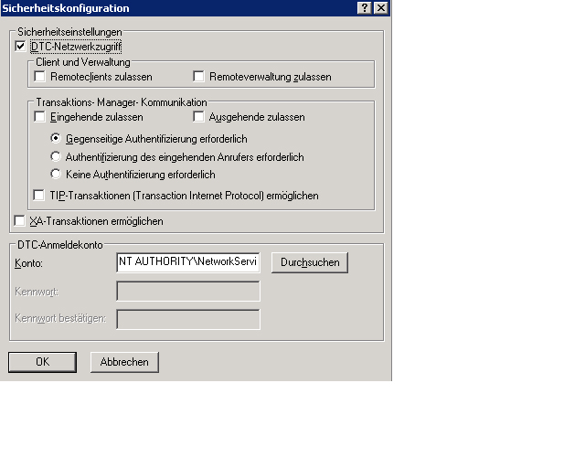

# <a name="troubleshooting-queued-messaging"></a><span data-ttu-id="4419c-102">Problembehandlung bei Nachrichtenwarteschlangen</span><span class="sxs-lookup"><span data-stu-id="4419c-102">Troubleshooting Queued Messaging</span></span>

<span data-ttu-id="4419c-103">Dieser Abschnitt enthält häufig gestellte Fragen und Hilfe zur Problembehandlung bei der Verwendung von Warteschlangen in Windows Communication Foundation (WCF).</span><span class="sxs-lookup"><span data-stu-id="4419c-103">This section contains common questions and troubleshooting help for using queues in Windows Communication Foundation (WCF).</span></span>

## <a name="common-questions"></a><span data-ttu-id="4419c-104">Allgemeine Fragen</span><span class="sxs-lookup"><span data-stu-id="4419c-104">Common Questions</span></span>

<span data-ttu-id="4419c-105">**F:** Ich habe WCF Beta 1 verwendet und den MSMQ-Hotfix installiert.</span><span class="sxs-lookup"><span data-stu-id="4419c-105">**Q:** I used WCF Beta 1 and I installed the MSMQ hotfix.</span></span> <span data-ttu-id="4419c-106">Muss ich den Hotfix entfernen?</span><span class="sxs-lookup"><span data-stu-id="4419c-106">Do I need to remove the hotfix?</span></span>

<span data-ttu-id="4419c-107">**A:** Ja.</span><span class="sxs-lookup"><span data-stu-id="4419c-107">**A:** Yes.</span></span> <span data-ttu-id="4419c-108">Dieser Hotfix wird nicht mehr unterstützt.</span><span class="sxs-lookup"><span data-stu-id="4419c-108">This hotfix is no longer supported.</span></span> <span data-ttu-id="4419c-109">WCF funktioniert nun ohne hotfixanforderung in MSMQ.</span><span class="sxs-lookup"><span data-stu-id="4419c-109">WCF now works on MSMQ without a hotfix requirement.</span></span>

<span data-ttu-id="4419c-110">**F:** Es gibt zwei Bindungen für MSMQ: <xref:System.ServiceModel.NetMsmqBinding> und <xref:System.ServiceModel.MsmqIntegration.MsmqIntegrationBinding>.</span><span class="sxs-lookup"><span data-stu-id="4419c-110">**Q:** There are two bindings for MSMQ: <xref:System.ServiceModel.NetMsmqBinding> and <xref:System.ServiceModel.MsmqIntegration.MsmqIntegrationBinding>.</span></span> <span data-ttu-id="4419c-111">Welche sollte ich wann verwenden?</span><span class="sxs-lookup"><span data-stu-id="4419c-111">What should I use and when?</span></span>

<span data-ttu-id="4419c-112">**A:** Verwenden Sie die <xref:System.ServiceModel.NetMsmqBinding>, wenn Sie MSMQ als Transport für die Kommunikation in der Warteschlange zwischen zwei WCF-Anwendungen verwenden möchten.</span><span class="sxs-lookup"><span data-stu-id="4419c-112">**A:** Use the <xref:System.ServiceModel.NetMsmqBinding> when you want to use MSMQ as a transport for queued communication between two WCF applications.</span></span> <span data-ttu-id="4419c-113">Verwenden Sie die <xref:System.ServiceModel.MsmqIntegration.MsmqIntegrationBinding>, wenn Sie vorhandene MSMQ-Anwendungen für die Kommunikation mit neuen WCF-Anwendungen verwenden möchten.</span><span class="sxs-lookup"><span data-stu-id="4419c-113">Use the <xref:System.ServiceModel.MsmqIntegration.MsmqIntegrationBinding> when you want to use existing MSMQ applications to communicate with new WCF applications.</span></span>

<span data-ttu-id="4419c-114">**F:** Muss ich MSMQ aktualisieren, um die <xref:System.ServiceModel.NetMsmqBinding>-und `MsmqIntegration` Bindungen zu verwenden?</span><span class="sxs-lookup"><span data-stu-id="4419c-114">**Q:** Do I have to upgrade MSMQ to use the <xref:System.ServiceModel.NetMsmqBinding> and `MsmqIntegration` bindings?</span></span>

<span data-ttu-id="4419c-115">**A:** Nein.</span><span class="sxs-lookup"><span data-stu-id="4419c-115">**A:** No.</span></span> <span data-ttu-id="4419c-116">Beide Bindungen funktionieren mit MSMQ 3.0 unter [!INCLUDE[wxp](../../../../includes/wxp-md.md)] und [!INCLUDE[ws2003](../../../../includes/ws2003-md.md)].</span><span class="sxs-lookup"><span data-stu-id="4419c-116">Both bindings work with MSMQ 3.0 on [!INCLUDE[wxp](../../../../includes/wxp-md.md)] and [!INCLUDE[ws2003](../../../../includes/ws2003-md.md)].</span></span> <span data-ttu-id="4419c-117">Bestimmte Funktionen der Bindungen werden verfügbar, wenn Sie in [!INCLUDE[wv](../../../../includes/wv-md.md)] ein Upgrade auf MSMQ 4.0 ausführen.</span><span class="sxs-lookup"><span data-stu-id="4419c-117">Certain features of the bindings become available when you upgrade to MSMQ 4.0 in [!INCLUDE[wv](../../../../includes/wv-md.md)].</span></span>

<span data-ttu-id="4419c-118">**F:** Welche Features der <xref:System.ServiceModel.NetMsmqBinding> und <xref:System.ServiceModel.MsmqIntegration.MsmqIntegrationBinding> Bindungen sind in MSMQ 4,0 verfügbar, aber nicht in MSMQ 3,0?</span><span class="sxs-lookup"><span data-stu-id="4419c-118">**Q:** What features of the <xref:System.ServiceModel.NetMsmqBinding> and <xref:System.ServiceModel.MsmqIntegration.MsmqIntegrationBinding> bindings are available in MSMQ 4.0 but not in MSMQ 3.0?</span></span>

<span data-ttu-id="4419c-119">**A:** Die folgenden Features sind in MSMQ 4,0 verfügbar, aber nicht in MSMQ 3,0:</span><span class="sxs-lookup"><span data-stu-id="4419c-119">**A:** The following features are available in MSMQ 4.0 but not in MSMQ 3.0:</span></span>

- <span data-ttu-id="4419c-120">Benutzerdefinierte Warteschlange für unzustellbare Nachrichten wird nur in MSMQ 4.0 unterstützt.</span><span class="sxs-lookup"><span data-stu-id="4419c-120">Custom dead-letter queue is supported only on MSMQ 4.0.</span></span>

- <span data-ttu-id="4419c-121">In MSMQ 3.0 und 4.0 werden nicht verarbeitbare Nachrichten unterschiedlich behandelt.</span><span class="sxs-lookup"><span data-stu-id="4419c-121">MSMQ 3.0 and 4.0 handle poison messages differently.</span></span>

- <span data-ttu-id="4419c-122">Nur MSMQ 4.0 unterstützt remote durchgeführte Lesevorgänge.</span><span class="sxs-lookup"><span data-stu-id="4419c-122">Only MSMQ 4.0 supports remote transacted read.</span></span>

<span data-ttu-id="4419c-123">Weitere Informationen finden Sie [unter Unterschiede in den Warteschlangen Funktionen in Windows Vista, Windows Server 2003 und Windows XP](../../../../docs/framework/wcf/feature-details/diff-in-queue-in-vista-server-2003-windows-xp.md).</span><span class="sxs-lookup"><span data-stu-id="4419c-123">For more information, see [Differences in Queuing Features in Windows Vista, Windows Server 2003, and Windows XP](../../../../docs/framework/wcf/feature-details/diff-in-queue-in-vista-server-2003-windows-xp.md).</span></span>

<span data-ttu-id="4419c-124">**F:** Kann ich MSMQ 3,0 auf einer Seite einer Kommunikation in der Warteschlange und MSMQ 4,0 auf der anderen Seite verwenden?</span><span class="sxs-lookup"><span data-stu-id="4419c-124">**Q:** Can I use MSMQ 3.0 on one side of a queued communication and MSMQ 4.0 on the other side?</span></span>

<span data-ttu-id="4419c-125">**A:** Ja.</span><span class="sxs-lookup"><span data-stu-id="4419c-125">**A:** Yes.</span></span>

<span data-ttu-id="4419c-126">**F:** Ich möchte vorhandene MSMQ-Anwendungen in neue WCF-Clients oder-Server integrieren.</span><span class="sxs-lookup"><span data-stu-id="4419c-126">**Q:** I want to integrate existing MSMQ applications with new WCF clients or servers.</span></span> <span data-ttu-id="4419c-127">Muss ich beide Seiten der MSMQ-Infrastruktur aktualisieren?</span><span class="sxs-lookup"><span data-stu-id="4419c-127">Do I need to upgrade both sides of my MSMQ infrastructure?</span></span>

<span data-ttu-id="4419c-128">**A:** Nein.</span><span class="sxs-lookup"><span data-stu-id="4419c-128">**A:** No.</span></span> <span data-ttu-id="4419c-129">Sie müssen keine Seite auf MSMQ 4.0 aktualisieren.</span><span class="sxs-lookup"><span data-stu-id="4419c-129">You do not have to upgrade to MSMQ 4.0 on either side.</span></span>

## <a name="troubleshooting"></a><span data-ttu-id="4419c-130">Problembehandlung</span><span class="sxs-lookup"><span data-stu-id="4419c-130">Troubleshooting</span></span>

<span data-ttu-id="4419c-131">Dieser Abschnitt enthält Informationen zur Behandlung der häufigsten Probleme.</span><span class="sxs-lookup"><span data-stu-id="4419c-131">This section contains answers to most common troubleshooting issues.</span></span> <span data-ttu-id="4419c-132">Bei einigen Fragen handelt es sich um bekannte Einschränkungen, die auch in den Releasehinweisen erläutert werden.</span><span class="sxs-lookup"><span data-stu-id="4419c-132">Some issues that are known limitations are also described in the release notes.</span></span>

<span data-ttu-id="4419c-133">**F:** Ich versuche, eine private Warteschlange zu verwenden, und erhalte die folgende Ausnahme: `System.InvalidOperationException`: die URL ist ungültig.</span><span class="sxs-lookup"><span data-stu-id="4419c-133">**Q:** I am trying to use a private queue and I get the following exception: `System.InvalidOperationException`: The URL is invalid.</span></span> <span data-ttu-id="4419c-134">Die URL für die Warteschlange darf das Zeichen '$' nicht enthalten.</span><span class="sxs-lookup"><span data-stu-id="4419c-134">The URL for the queue cannot contain the '$' character.</span></span> <span data-ttu-id="4419c-135">Verwenden Sie die Syntax in net.msmq://machine/private/queueName, um eine private Warteschlange anzugeben.</span><span class="sxs-lookup"><span data-stu-id="4419c-135">Use the syntax in net.msmq://machine/private/queueName to address a private queue.</span></span>

<span data-ttu-id="4419c-136">**A:** Überprüfen Sie die Warteschlangen Uniform Resource Identifier (URI) in der Konfiguration und im Code.</span><span class="sxs-lookup"><span data-stu-id="4419c-136">**A:** Please check the queue Uniform Resource Identifier (URI) in your configuration and code.</span></span> <span data-ttu-id="4419c-137">Verwenden Sie kein "$"-Zeichen im URI.</span><span class="sxs-lookup"><span data-stu-id="4419c-137">Do not use the "$" character in the URI.</span></span> <span data-ttu-id="4419c-138">Geben Sie z. B. zur Adressierung einer privaten Warteschlange mit dem Namen OrdersQueue den URI als net.msmq://localhost/private/ordersQueue an.</span><span class="sxs-lookup"><span data-stu-id="4419c-138">For example, to address a private queue named OrdersQueue, specify the URI as net.msmq://localhost/private/ordersQueue.</span></span>

<span data-ttu-id="4419c-139">**F:** Das Aufrufen von `ServiceHost.Open()` für meine Anwendung in der Warteschlange löst die folgende Ausnahme aus: `System.ArgumentException`: eine Basisadresse darf keine URI-Abfrage Zeichenfolge enthalten.</span><span class="sxs-lookup"><span data-stu-id="4419c-139">**Q:** Calling `ServiceHost.Open()` on my queued application throws the following exception: `System.ArgumentException`: A base address cannot contain a URI query string.</span></span> <span data-ttu-id="4419c-140">Warum?</span><span class="sxs-lookup"><span data-stu-id="4419c-140">Why?</span></span>

<span data-ttu-id="4419c-141">**A:** Überprüfen Sie den Warteschlangen-URI in der Konfigurationsdatei und im Code.</span><span class="sxs-lookup"><span data-stu-id="4419c-141">**A:** Check the queue URI in your configuration file and in your code.</span></span> <span data-ttu-id="4419c-142">Zwar wird in MSMQ-Warteschlangen die Verwendung von Fragezeichen ("?") unterstützt, diese werden von URIs jedoch als Beginn einer Zeichenfolgenabfrage interpretiert.</span><span class="sxs-lookup"><span data-stu-id="4419c-142">While MSMQ queues support the use of the '?' character, URIs interpret this character as the beginning of a string query.</span></span> <span data-ttu-id="4419c-143">Verwenden Sie deshalb Warteschlangennamen ohne Fragezeichen, um dieses Problem zu umgehen.</span><span class="sxs-lookup"><span data-stu-id="4419c-143">To avoid this issue, use queue names that do not contain '?' characters.</span></span>

<span data-ttu-id="4419c-144">**F:** Der Sendevorgang war erfolgreich, aber für den Empfänger wurde kein Dienst Vorgang aufgerufen.</span><span class="sxs-lookup"><span data-stu-id="4419c-144">**Q:** My send succeeded but no service operation is invoked on the receiver.</span></span> <span data-ttu-id="4419c-145">Warum?</span><span class="sxs-lookup"><span data-stu-id="4419c-145">Why?</span></span>

<span data-ttu-id="4419c-146">**A:** Um die Antwort zu ermitteln, können Sie die folgende Checkliste durcharbeiten:</span><span class="sxs-lookup"><span data-stu-id="4419c-146">**A:** To determine the answer, work through the following check list:</span></span>

- <span data-ttu-id="4419c-147">Überprüfen Sie, ob die Anforderungen der Transaktionswarteschlange mit den angegebenen Zusicherungen kompatibel sind.</span><span class="sxs-lookup"><span data-stu-id="4419c-147">Check that the transactional queue requirements are compatible with the assurances specified.</span></span> <span data-ttu-id="4419c-148">Beachten Sie die folgenden Prinzipien:</span><span class="sxs-lookup"><span data-stu-id="4419c-148">Note the following principles:</span></span>

  - <span data-ttu-id="4419c-149">Sie können permanente Nachrichten (Datagramme und Sitzungen) mit "genau einmal"-Zusicherungen (<xref:System.ServiceModel.MsmqBindingBase.ExactlyOnce%2A> = `true`) nur an eine transaktionale Warteschlange senden.</span><span class="sxs-lookup"><span data-stu-id="4419c-149">You can send durable messages (datagrams and sessions) with "exactly once" assurances (<xref:System.ServiceModel.MsmqBindingBase.ExactlyOnce%2A> = `true`) only to a transactional queue.</span></span>

  - <span data-ttu-id="4419c-150">Sitzungen können nur mit "genau einmal"-Zusicherungen gesendet werden.</span><span class="sxs-lookup"><span data-stu-id="4419c-150">You can send sessions only with "exactly once" assurances.</span></span>

  - <span data-ttu-id="4419c-151">Eine Transaktion ist erforderlich, um Nachrichten in einer Sitzung von einer Transaktionswarteschlange zu empfangen.</span><span class="sxs-lookup"><span data-stu-id="4419c-151">A transaction is required to receive messages in a session from a transactional queue.</span></span>

  - <span data-ttu-id="4419c-152">Sie können nur flüchtige oder dauerhafte Nachrichten (nur Datagramme) ohne Zusicherungen (<xref:System.ServiceModel.MsmqBindingBase.ExactlyOnce%2A> = `false`) an eine nicht transaktionale Warteschlange senden oder empfangen.</span><span class="sxs-lookup"><span data-stu-id="4419c-152">You can send or receive volatile or durable messages (datagrams only) with no assurances (<xref:System.ServiceModel.MsmqBindingBase.ExactlyOnce%2A> = `false`) only to a non-transactional queue.</span></span>

- <span data-ttu-id="4419c-153">Überprüfen Sie die Warteschlange für unzustellbare Nachrichten.</span><span class="sxs-lookup"><span data-stu-id="4419c-153">Check the dead-letter queue.</span></span> <span data-ttu-id="4419c-154">Wenn Sie die Nachrichten dort finden, stellen Sie fest, warum sie nicht zugestellt wurden.</span><span class="sxs-lookup"><span data-stu-id="4419c-154">If you find the messages there, determine why they were not delivered.</span></span>

- <span data-ttu-id="4419c-155">Überprüfen Sie die ausgehenden Warteschlangen auf Konnektivitäts- oder Adressierungsprobleme.</span><span class="sxs-lookup"><span data-stu-id="4419c-155">Check the outgoing queues for connectivity or addressing problems.</span></span>

<span data-ttu-id="4419c-156">**F:** Ich habe eine benutzerdefinierte Warteschlange für unzustellbare Nachrichten angegeben, aber beim Starten der Absender Anwendung erhalte ich eine Ausnahme, dass entweder die Warteschlange für unzustellbare Nachrichten nicht gefunden wurde oder dass die sendende Anwendung keine Berechtigung für die Warteschlange für unzustellbare Nachrichten hat.</span><span class="sxs-lookup"><span data-stu-id="4419c-156">**Q:** I have specified a custom dead-letter queue, but when I start the sender application, I get an exception that either the dead-letter queue is not found, or the sending application has no permission to the dead-letter queue.</span></span> <span data-ttu-id="4419c-157">Warum geschieht das?</span><span class="sxs-lookup"><span data-stu-id="4419c-157">Why is this happening?</span></span>

<span data-ttu-id="4419c-158">**A:** Der benutzerdefinierte URI der Warteschlange für unzustellbare Nachrichten muss einen "localhost" oder den Computernamen im ersten Segment enthalten, z. b. "net. MSMQ://localhost/private/myAppdead-Letter Queue".</span><span class="sxs-lookup"><span data-stu-id="4419c-158">**A:** The custom dead-letter queue URI must include a "localhost" or the computer name in the first segment, for example, net.msmq://localhost/private/myAppdead-letter queue.</span></span>

<span data-ttu-id="4419c-159">**F:** Muss immer eine benutzerdefinierte Warteschlange für unzustellbare Nachrichten definiert werden, oder gibt es eine Standard Warteschlange für unzustellbare Nachrichten?</span><span class="sxs-lookup"><span data-stu-id="4419c-159">**Q:** Is it always necessary to define a custom dead-letter queue, or is there a default dead-letter queue?</span></span>

<span data-ttu-id="4419c-160">**A:** Wenn Zusicherungen "genau einmal" (<xref:System.ServiceModel.MsmqBindingBase.ExactlyOnce%2A> = `true`) sind, und wenn Sie keine benutzerdefinierte Warteschlange für unzustellbare Nachrichten angeben, ist der Standardwert eine systemweite transaktionale Warteschlange für unzustellbare Nachrichten.</span><span class="sxs-lookup"><span data-stu-id="4419c-160">**A:** If assurances are "exactly once" (<xref:System.ServiceModel.MsmqBindingBase.ExactlyOnce%2A> = `true`), and if you do not specify a custom dead-letter queue, the default is a system-wide transactional dead-letter queue.</span></span>

<span data-ttu-id="4419c-161">Wenn Zusicherungen keine (<xref:System.ServiceModel.MsmqBindingBase.ExactlyOnce%2A> = `false`) ist, ist der Standardwert keine Warteschlange für unzustellbare Nachrichten.</span><span class="sxs-lookup"><span data-stu-id="4419c-161">If assurances are none (<xref:System.ServiceModel.MsmqBindingBase.ExactlyOnce%2A> = `false`), then the default is no dead-letter queue functionality.</span></span>

<span data-ttu-id="4419c-162">**F:** Der Dienst löst "svchost. Open" mit der Meldung "EndpointListener-Anforderungen können von der Listenerfactory nicht erfüllt werden" aus.</span><span class="sxs-lookup"><span data-stu-id="4419c-162">**Q:** My service throws on SvcHost.Open with a message "EndpointListener requirements cannot be met by the ListenerFactory".</span></span> <span data-ttu-id="4419c-163">Warum?</span><span class="sxs-lookup"><span data-stu-id="4419c-163">Why?</span></span>

<span data-ttu-id="4419c-164">A.</span><span class="sxs-lookup"><span data-stu-id="4419c-164">A.</span></span> <span data-ttu-id="4419c-165">Überprüfen Sie den Dienstvertrag.</span><span class="sxs-lookup"><span data-stu-id="4419c-165">Check your service contract.</span></span> <span data-ttu-id="4419c-166">Möglicherweise haben Sie vergessen, "IsOneWay =`true`" für alle Dienst Vorgänge zu platzieren.</span><span class="sxs-lookup"><span data-stu-id="4419c-166">You may have forgotten to put "IsOneWay=`true`" on all the service operations.</span></span> <span data-ttu-id="4419c-167">Warteschlangen unterstützen nur unidirektionale Dienstvorgänge.</span><span class="sxs-lookup"><span data-stu-id="4419c-167">Queues support only one-way service operations.</span></span>

<span data-ttu-id="4419c-168">**F:** Es sind Nachrichten in der Warteschlange vorhanden, es wird jedoch kein Dienst Vorgang aufgerufen.</span><span class="sxs-lookup"><span data-stu-id="4419c-168">**Q:** There are messages in the queue but no service operation is invoked.</span></span> <span data-ttu-id="4419c-169">Wo liegt das Problem?</span><span class="sxs-lookup"><span data-stu-id="4419c-169">What is the problem?</span></span>

<span data-ttu-id="4419c-170">**A:** Stellen Sie fest, ob der Dienst Host fehlerhaft ist.</span><span class="sxs-lookup"><span data-stu-id="4419c-170">**A:** Determine if your service host is faulted.</span></span> <span data-ttu-id="4419c-171">Sie können das feststellen, indem Sie die Ablaufverfolgung überprüfen oder `IErrorHandler` implementieren.</span><span class="sxs-lookup"><span data-stu-id="4419c-171">You can check by looking at the trace or implementing `IErrorHandler`.</span></span> <span data-ttu-id="4419c-172">Der Diensthost schlägt standardmäßig fehl, wenn eine nicht verarbeitbare Nachrichten erkannt wird.</span><span class="sxs-lookup"><span data-stu-id="4419c-172">Service host faults, by default, if a poison message is detected.</span></span>

<span data-ttu-id="4419c-173">**F:** Es befinden sich Nachrichten in der Warteschlange, aber mein im Internet gehosteter Dienst in der Warteschlange wird nicht aktiviert.</span><span class="sxs-lookup"><span data-stu-id="4419c-173">**Q:** There are messages in the queue but my Web-hosted queued service is not getting activated.</span></span> <span data-ttu-id="4419c-174">Warum?</span><span class="sxs-lookup"><span data-stu-id="4419c-174">Why?</span></span>

<span data-ttu-id="4419c-175">**A:** Der häufigste Grund hierfür sind Berechtigungen.</span><span class="sxs-lookup"><span data-stu-id="4419c-175">**A:** The most common reason is permissions.</span></span>

1. <span data-ttu-id="4419c-176">Stellen Sie sicher, dass der `NetMsmqActivator`-Prozess ausgeführt wird und die Identität des `NetMsmqActivator`-Prozesses Lese- und Suchberechtigungen für die Warteschlange besitzt.</span><span class="sxs-lookup"><span data-stu-id="4419c-176">Ensure that the `NetMsmqActivator` process is running and the identity of the `NetMsmqActivator` process is given read and seek permission on the queue.</span></span>

2. <span data-ttu-id="4419c-177">Wenn `NetMsmqActivator` Warteschlangen auf einem Remotecomputer überwacht, stellen Sie sicher, dass `NetMsmqActivator` unter keinem eingeschränkten Token ausgeführt wird.</span><span class="sxs-lookup"><span data-stu-id="4419c-177">If the `NetMsmqActivator` is monitoring queues on a remote machine, ensure that `NetMsmqActivator` does not run under a restricted token.</span></span> <span data-ttu-id="4419c-178">So führen Sie `NetMsmqActivator` mit einem uneingeschränkten Token aus:</span><span class="sxs-lookup"><span data-stu-id="4419c-178">To run the `NetMsmqActivator` with an unrestricted token:</span></span>

    ```console
    sc sidtype NetMsmqActivator unrestricted
    ```

<span data-ttu-id="4419c-179">Informationen zu Webhost Problemen, die nicht sicherheitsrelevant sind, finden Sie unter: [Webhosting einer Anwendung in der Warteschlange](../../../../docs/framework/wcf/feature-details/web-hosting-a-queued-application.md).</span><span class="sxs-lookup"><span data-stu-id="4419c-179">For non-security related Web host issues refer to: [Web Hosting a Queued Application](../../../../docs/framework/wcf/feature-details/web-hosting-a-queued-application.md).</span></span>

<span data-ttu-id="4419c-180">**F:** Was ist die einfachste Möglichkeit, um auf Sitzungen zuzugreifen?</span><span class="sxs-lookup"><span data-stu-id="4419c-180">**Q:** What is the easiest way to access sessions?</span></span>

<span data-ttu-id="4419c-181">**A:** Legen Sie AutoComplete =`true` für den Vorgang fest, der der letzten Meldung in der Sitzung entspricht, und legen Sie AutoComplete =`false` für alle verbleibenden Dienst Vorgänge fest.</span><span class="sxs-lookup"><span data-stu-id="4419c-181">**A:** Set AutoComplete=`true` on the operation that corresponds to the last message in the session, and set AutoComplete=`false` on all remaining service operations.</span></span>

<span data-ttu-id="4419c-182">**F:** Wo finde ich Antworten auf häufig gestellte Fragen zu MSMQ?</span><span class="sxs-lookup"><span data-stu-id="4419c-182">**Q:** Where can I find answers to common questions on MSMQ?</span></span>

<span data-ttu-id="4419c-183">**A:** Weitere Informationen zu MSMQ finden Sie unter [Microsoft Message Queuing](https://go.microsoft.com/fwlink/?LinkId=87810).</span><span class="sxs-lookup"><span data-stu-id="4419c-183">**A:** For more information about MSMQ, see [Microsoft Message Queuing](https://go.microsoft.com/fwlink/?LinkId=87810).</span></span>

<span data-ttu-id="4419c-184">**F:** Warum löst der Dienst beim Lesen aus einer Warteschlange, die sowohl Sitzungsnachrichten in Warteschlangen als auch in der Warteschlange befindliche Datagrammnachrichten enthält, eine `ProtocolException` aus?</span><span class="sxs-lookup"><span data-stu-id="4419c-184">**Q:** Why does my service throw a `ProtocolException` when reading from a queue that contains both queued session messages and queued datagram messages?</span></span>

<span data-ttu-id="4419c-185">**A:** Es gibt einen grundlegenden Unterschied bei der Zusammenstellung von Sitzungsnachrichten in der Warteschlange und in der Warteschlange befindliche Datagrammnachrichten.</span><span class="sxs-lookup"><span data-stu-id="4419c-185">**A:** There is a fundamental difference in the way queued session messages and queued datagram messages are composed.</span></span> <span data-ttu-id="4419c-186">Deshalb kann ein Dienst, der eine Sitzungsnachricht in einer Warteschlange lesen soll, keine Datagrammnachricht empfangen, und kann ein Dienst, der eine Datagrammnachricht in einer Warteschlange lesen soll, keine Sitzungsnachricht empfangen.</span><span class="sxs-lookup"><span data-stu-id="4419c-186">Because of this, a service that is expecting to read a queued session message cannot receive a queued datagram message and a service expecting to read a queued datagram message cannot receive a session message.</span></span> <span data-ttu-id="4419c-187">Bei dem Versuch, beide Nachrichtentypen in derselben Warteschlange zu lesen, wird die folgende Ausnahme ausgelöst:</span><span class="sxs-lookup"><span data-stu-id="4419c-187">Attempting to read both types of messages from the same queue throws the following exception:</span></span>

```console
System.ServiceModel.MsmqPoisonMessageException: The transport channel detected a poison message. This occurred because the message exceeded the maximum number of delivery attempts or because the channel detected a fundamental problem with the message. The inner exception may contain additional information.
---> System.ServiceModel.ProtocolException: An incoming MSMQ message contained invalid or unexpected .NET Message Framing information in its body. The message cannot be received. Ensure that the sender is using a compatible service contract with a matching SessionMode.
```

<span data-ttu-id="4419c-188">Bei der systemweiten Warteschlange für unzustellbare Nachrichten und auch bei benutzerdefinierten Warteschlangen für unzustellbare Nachrichten tritt dieses Problem schnell auf, wenn eine Anwendung Sitzungsnachrichten und Datagrammnachrichten in Warteschlangen vom selben Computer aus sendet.</span><span class="sxs-lookup"><span data-stu-id="4419c-188">The system dead-letter queue, as well as any custom dead-letter queue, is particularly susceptible to this issue if an application sends both queued session messages and queued datagram messages from the same computer.</span></span> <span data-ttu-id="4419c-189">Wenn eine Nachricht nicht erfolgreich gesendet werden kann, wird sie in die Warteschlange für unzustellbare Nachrichten verschoben.</span><span class="sxs-lookup"><span data-stu-id="4419c-189">If a message cannot be sent successfully, it is moved to the dead-letter queue.</span></span> <span data-ttu-id="4419c-190">Aus diesem Grund kann es vorkommen, dass sich sowohl Sitzung- als auch Datagrammnachrichten in der Warteschlange für unzustellbare Nachrichten befinden.</span><span class="sxs-lookup"><span data-stu-id="4419c-190">Under these circumstances, it is possible to have both session and datagram messages in the dead-letter queue.</span></span> <span data-ttu-id="4419c-191">Es gibt keine Möglichkeit, die beiden Nachrichtentypen beim Lesen einer Warteschlange zur Laufzeit zu trennen. Deshalb sollten Anwendungen Sitzungsnachrichten und Datagrammnachrichten in Warteschlangen nicht vom selben Computer aus senden.</span><span class="sxs-lookup"><span data-stu-id="4419c-191">There is no way to separate both types of messages at runtime when reading from a queue, therefore, applications should not send both queued session messages and queued datagram messages from the same computer.</span></span>

### <a name="msmq-integration-specific-troubleshooting"></a><span data-ttu-id="4419c-192">MSMQ-Integration: Spezielle Problembehandlung</span><span class="sxs-lookup"><span data-stu-id="4419c-192">MSMQ Integration: Specific Troubleshooting</span></span>

<span data-ttu-id="4419c-193">**F:** Wenn ich eine Nachricht Sende, oder wenn ich den Dienst Host öffne, erhalte ich eine Fehlermeldung, die angibt, dass das Schema falsch ist.</span><span class="sxs-lookup"><span data-stu-id="4419c-193">**Q:** When I send a message, or when I open the service host, I get an error that indicates the scheme is wrong.</span></span> <span data-ttu-id="4419c-194">Warum?</span><span class="sxs-lookup"><span data-stu-id="4419c-194">Why?</span></span>

<span data-ttu-id="4419c-195">**A:** Wenn Sie die MSMQ-Integrations Bindung verwenden, müssen Sie das Schema "MSMQ. Format Name" verwenden.</span><span class="sxs-lookup"><span data-stu-id="4419c-195">**A:** When you use the MSMQ integration binding, you must use the msmq.formatname scheme.</span></span> <span data-ttu-id="4419c-196">Beispiel: msmq.formatname:DIRECT=OS:.\private$\OrdersQueue.</span><span class="sxs-lookup"><span data-stu-id="4419c-196">For example, msmq.formatname:DIRECT=OS:.\private$\OrdersQueue.</span></span> <span data-ttu-id="4419c-197">Wenn Sie jedoch die benutzerdefinierte Warteschlange für unzustellbare Nachrichten angeben, müssen Sie das net.msmq-Schema verwenden.</span><span class="sxs-lookup"><span data-stu-id="4419c-197">But when you specify the custom dead-letter queue, you must use the net.msmq scheme.</span></span>

<span data-ttu-id="4419c-198">**F:** Wenn ich einen öffentlichen oder privaten Format Namen verwende und den Dienst Host auf [!INCLUDE[wv](../../../../includes/wv-md.md)]öffne, erhalte ich eine Fehlermeldung.</span><span class="sxs-lookup"><span data-stu-id="4419c-198">**Q:** When I use a public or private format name and open the service host on [!INCLUDE[wv](../../../../includes/wv-md.md)], I get an error.</span></span> <span data-ttu-id="4419c-199">Warum?</span><span class="sxs-lookup"><span data-stu-id="4419c-199">Why?</span></span>

<span data-ttu-id="4419c-200">**A:** Der WCF-Integrationskanal auf [!INCLUDE[wv](../../../../includes/wv-md.md)] überprüft, ob eine unter Warteschlange für die Haupt Anwendungs Warteschlange geöffnet werden kann, um nicht verarbeitbare Nachrichten zu verarbeiten.</span><span class="sxs-lookup"><span data-stu-id="4419c-200">**A:** The WCF integration channel on [!INCLUDE[wv](../../../../includes/wv-md.md)] checks to see if a sub-queue can be opened for the main application queue for handling poison messages.</span></span> <span data-ttu-id="4419c-201">Der Name der untergeordneten Warteschlange wird von einem an den Listener übergebenen msmq.formatname-URI abgeleitet.</span><span class="sxs-lookup"><span data-stu-id="4419c-201">The sub-queue name is derived from an msmq.formatname URI passed to the listener.</span></span> <span data-ttu-id="4419c-202">Der Name der untergeordneten Warteschlange kann in MSMQ nur ein direkter Formatname sein.</span><span class="sxs-lookup"><span data-stu-id="4419c-202">The sub-queue name in MSMQ can only be a direct format name.</span></span> <span data-ttu-id="4419c-203">Deshalb tritt der Fehler auf.</span><span class="sxs-lookup"><span data-stu-id="4419c-203">So you see the error.</span></span> <span data-ttu-id="4419c-204">Ändern Sie den Warteschlangen-URI in einen direkten Formatnamen.</span><span class="sxs-lookup"><span data-stu-id="4419c-204">Change the queue URI to a direct format name.</span></span>

<span data-ttu-id="4419c-205">**F:** Wenn eine Nachricht von einer MSMQ-Anwendung empfangen wird, befindet sich die Nachricht in der Warteschlange und wird von der empfangenden WCF-Anwendung nicht gelesen.</span><span class="sxs-lookup"><span data-stu-id="4419c-205">**Q:** When receiving a message from an MSMQ application, the message sits in the queue and is not read by the receiving WCF application.</span></span> <span data-ttu-id="4419c-206">Warum?</span><span class="sxs-lookup"><span data-stu-id="4419c-206">Why?</span></span>

<span data-ttu-id="4419c-207">**A:** Überprüfen Sie, ob die Nachricht einen Text enthält.</span><span class="sxs-lookup"><span data-stu-id="4419c-207">**A:** Check to see whether the message has a body.</span></span> <span data-ttu-id="4419c-208">Ohne Nachrichtentext ignoriert der MSMQ-Integrationskanal die Nachricht.</span><span class="sxs-lookup"><span data-stu-id="4419c-208">If the message has no body, the MSMQ integration channel ignores the message.</span></span> <span data-ttu-id="4419c-209">Implementieren Sie `IErrorHandler`, um bei Ausnahmen benachrichtigt zu werden, und überprüfen Sie die Ablaufverfolgungen.</span><span class="sxs-lookup"><span data-stu-id="4419c-209">Implement `IErrorHandler` to be notified of exceptions and check the traces.</span></span>

### <a name="security-related-troubleshooting"></a><span data-ttu-id="4419c-210">Sicherheitsrelevante Problembehandlung</span><span class="sxs-lookup"><span data-stu-id="4419c-210">Security-Related Troubleshooting</span></span>

<span data-ttu-id="4419c-211">**F:** Wenn das Beispiel ausgeführt wird, das eine Standard Bindung im Arbeitsgruppen Modus verwendet, scheinen die Nachrichten gesendet zu werden, werden jedoch nie vom Empfänger empfangen.</span><span class="sxs-lookup"><span data-stu-id="4419c-211">**Q:** When I run the sample that uses a default binding in workgroup mode, messages seem to get sent but are never received by the receiver.</span></span>

<span data-ttu-id="4419c-212">**A:** Standardmäßig werden Nachrichten mithilfe eines internen MSMQ-Zertifikats signiert, für das der Active Directory Directory-Dienst erforderlich ist.</span><span class="sxs-lookup"><span data-stu-id="4419c-212">**A:** By default, messages are signed using an MSMQ internal certificate that requires the Active Directory directory service.</span></span> <span data-ttu-id="4419c-213">Da Active Directory im Arbeitsgruppenmodus nicht verfügbar ist, verursacht das Signieren der Nachricht einen Fehler.</span><span class="sxs-lookup"><span data-stu-id="4419c-213">In workgroup mode, because Active Directory is not available, signing the message fails.</span></span> <span data-ttu-id="4419c-214">Daher wird die Nachricht in der Warteschlange für unzustellbare Nachrichten angezeigt, und es wird eine Fehlerursache wie "Ungültige Signatur" angezeigt.</span><span class="sxs-lookup"><span data-stu-id="4419c-214">So the message lands in the dead-letter queue and failure cause, such as "Bad signature", is indicated.</span></span>

<span data-ttu-id="4419c-215">Sie können das Problem beheben, indem Sie die Sicherheit deaktivien.</span><span class="sxs-lookup"><span data-stu-id="4419c-215">The workaround is to turn off security.</span></span> <span data-ttu-id="4419c-216">Dies erfolgt durch Festlegen <xref:System.ServiceModel.NetMsmqSecurity.Mode%2A> = <xref:System.ServiceModel.NetMsmqSecurityMode.None>, damit Sie im Arbeitsgruppen Modus funktioniert.</span><span class="sxs-lookup"><span data-stu-id="4419c-216">This is done by setting <xref:System.ServiceModel.NetMsmqSecurity.Mode%2A> = <xref:System.ServiceModel.NetMsmqSecurityMode.None> to make it work in workgroup mode.</span></span>

<span data-ttu-id="4419c-217">Eine weitere Möglichkeit besteht darin, <xref:System.ServiceModel.MsmqTransportSecurity> aus der <xref:System.ServiceModel.NetMsmqSecurity.Transport%2A>-Eigenschaft abzurufen und auf <xref:System.ServiceModel.MsmqAuthenticationMode.Certificate> festzulegen und dann das Clientzertifikat festzulegen.</span><span class="sxs-lookup"><span data-stu-id="4419c-217">Another workaround is to get the <xref:System.ServiceModel.MsmqTransportSecurity> from the <xref:System.ServiceModel.NetMsmqSecurity.Transport%2A> property and set it to <xref:System.ServiceModel.MsmqAuthenticationMode.Certificate>, and set the client certificate.</span></span>

<span data-ttu-id="4419c-218">Sie können das Problem auch beheben, indem Sie MSMQ mit Active Directory-Integration installieren.</span><span class="sxs-lookup"><span data-stu-id="4419c-218">Yet another workaround is to install MSMQ with Active Directory integration.</span></span>

<span data-ttu-id="4419c-219">**F:** Wenn eine Nachricht mit der Standard Bindung (Transportsicherheit aktiviert) in Active Directory an eine Warteschlange gesendet wird, erhalte ich die Meldung "internes Zertifikat wurde nicht gefunden".</span><span class="sxs-lookup"><span data-stu-id="4419c-219">**Q:** When I send a message with default binding (transport security turned on) in Active Directory to a queue, I get an "internal certificate not found" message.</span></span> <span data-ttu-id="4419c-220">Wie kann ich das Problem beheben?</span><span class="sxs-lookup"><span data-stu-id="4419c-220">How do I fix this?</span></span>

<span data-ttu-id="4419c-221">**A:** Dies bedeutet, dass das Zertifikat in Active Directory für den Absender erneuert werden muss.</span><span class="sxs-lookup"><span data-stu-id="4419c-221">**A:** This means that the certificate in Active Directory for the sender must be renewed.</span></span> <span data-ttu-id="4419c-222">Öffnen Sie hierzu die **Systemsteuerung**, **Verwaltung**, **Computer Verwaltung**, klicken Sie mit der rechten Maustaste auf **MSMQ**, und wählen Sie **Eigenschaften**aus.</span><span class="sxs-lookup"><span data-stu-id="4419c-222">To do so, open **Control Panel**, **Administrative Tools**, **Computer Management**, right-click **MSMQ**, and select **Properties**.</span></span> <span data-ttu-id="4419c-223">Wählen Sie die Registerkarte **Benutzerzertifikat** aus, und klicken Sie auf **erneuern** .</span><span class="sxs-lookup"><span data-stu-id="4419c-223">Select the **User Certificate** tab and click the **Renew** button.</span></span>

<span data-ttu-id="4419c-224">**F:** Beim Senden einer Nachricht mithilfe <xref:System.ServiceModel.MsmqAuthenticationMode.Certificate> und angeben des zu verwendenden Zertifikats erhalte ich die Meldung "Ungültiges Zertifikat".</span><span class="sxs-lookup"><span data-stu-id="4419c-224">**Q:** When I send a message using <xref:System.ServiceModel.MsmqAuthenticationMode.Certificate> and specify the certificate to use, I get an "Invalid certificate" message.</span></span> <span data-ttu-id="4419c-225">Wie kann ich das Problem beheben?</span><span class="sxs-lookup"><span data-stu-id="4419c-225">How do I fix this?</span></span>

<span data-ttu-id="4419c-226">**A:** Ein Zertifikat Speicher für lokale Computer kann nicht mit dem Zertifikat Modus verwendet werden.</span><span class="sxs-lookup"><span data-stu-id="4419c-226">**A:** You cannot use a local machine certificate store with certificate mode.</span></span> <span data-ttu-id="4419c-227">Sie müssen das Zertifikat mit dem Zertifikat-Snap-In aus dem Zertifikatspeicher des Computers in den Speicher des aktuellen Benutzers kopieren.</span><span class="sxs-lookup"><span data-stu-id="4419c-227">You have to copy the certificate from the machine certificate store to the current user store using the Certificate snap-in.</span></span> <span data-ttu-id="4419c-228">So rufen Sie das Zertifikat-Snap-In auf:</span><span class="sxs-lookup"><span data-stu-id="4419c-228">To get the Certificate snap-in:</span></span>

1. <span data-ttu-id="4419c-229">Klicken Sie im **Startmenü**auf **Ausführen**, geben Sie `mmc`ein, und klicken Sie auf **OK**.</span><span class="sxs-lookup"><span data-stu-id="4419c-229">Click **Start**, select **Run**, type `mmc`, and click **OK**.</span></span>

2. <span data-ttu-id="4419c-230">Öffnen Sie in der **Microsoft Management Console**das Menü **Datei** , und wählen Sie **Snap-in hinzufügen/entfernen**aus.</span><span class="sxs-lookup"><span data-stu-id="4419c-230">In the **Microsoft Management Console**, open the **File** menu and select **Add/Remove Snap-in**.</span></span>

3. <span data-ttu-id="4419c-231">Klicken Sie im Dialogfeld **Snap-in hinzufügen/entfernen** auf die Schaltfläche **Hinzufügen** .</span><span class="sxs-lookup"><span data-stu-id="4419c-231">In the **Add/Remove Snap-in** dialog box, click the **Add** button.</span></span>

4. <span data-ttu-id="4419c-232">Wählen Sie im Dialogfeld **eigenständiges Snap-in hinzufügen** Zertifikate aus, und klicken Sie auf **Hinzufügen**.</span><span class="sxs-lookup"><span data-stu-id="4419c-232">In the **Add Standalone Snap-in** dialog box, select Certificates and click **Add**.</span></span>

5. <span data-ttu-id="4419c-233">Wählen Sie im Dialogfeld **Zertifikate** -Snap-in die Option eigenes **Benutzerkonto aus,** und klicken Sie auf **Fertig**stellen.</span><span class="sxs-lookup"><span data-stu-id="4419c-233">In the **Certificates** snap-in dialog box, select **My user account,** and click **Finish**.</span></span>

6. <span data-ttu-id="4419c-234">Fügen Sie als nächstes ein zweites Zertifikat-Snap-in mit den vorherigen Schritten hinzu. Wählen Sie dieses Mal jedoch **Computer Konto** aus, und klicken Sie auf **weiter**.</span><span class="sxs-lookup"><span data-stu-id="4419c-234">Next, add a second Certificates snap-in using the previous steps, but this time select **Computer account** and click **Next**.</span></span>

7. <span data-ttu-id="4419c-235">Wählen Sie **lokaler Computer** , und klicken Sie auf **Fertig**stellen.</span><span class="sxs-lookup"><span data-stu-id="4419c-235">Select **Local Computer** and click **Finish**.</span></span> <span data-ttu-id="4419c-236">Sie können jetzt Zertifikate per Drag &amp; Drop aus dem Computerzertifikatspeicher in den Speicher des aktuellen Benutzers verschieben.</span><span class="sxs-lookup"><span data-stu-id="4419c-236">You can now drag and drop certificates from the machine certificate store to the current user store.</span></span>

<span data-ttu-id="4419c-237">**F:** Wenn mein Dienst aus einer Warteschlange auf einem anderen Computer im Arbeitsgruppen Modus liest, wird eine Ausnahme vom Typ "Zugriff verweigert" angezeigt.</span><span class="sxs-lookup"><span data-stu-id="4419c-237">**Q:** When my service reads from a queue on another computer in workgroup mode, I get an "access denied" exception.</span></span>

<span data-ttu-id="4419c-238">**A:** Im Arbeitsgruppen Modus muss die Anwendung über die Berechtigung verfügen, auf die Warteschlange zuzugreifen, damit eine Remote Anwendung Zugriff auf die Warteschlange erhält.</span><span class="sxs-lookup"><span data-stu-id="4419c-238">**A:** In workgroup mode, for a remote application to gain access to the queue, the application must have permission to access the queue.</span></span> <span data-ttu-id="4419c-239">Fügen Sie der Zugriffs Steuerungs Liste (ACL) der Warteschlange "anonyme Anmeldung" hinzu, und erteilen Sie Ihr die Leseberechtigung.</span><span class="sxs-lookup"><span data-stu-id="4419c-239">Add "Anonymous login" to the queue's access control list (ACL) and give it read permission.</span></span>

<span data-ttu-id="4419c-240">**F:** Wenn ein Netzwerkdienst Client (oder ein Client, der nicht über ein Domänen Konto verfügt) eine Nachricht in der Warteschlange sendet, schlägt der Sendevorgang mit einem ungültigen Zertifikat fehl.</span><span class="sxs-lookup"><span data-stu-id="4419c-240">**Q:** When a network service client (or any client that does not have a domain account) sends a queued message, the send fails with an invalid certificate.</span></span> <span data-ttu-id="4419c-241">Wie kann ich das Problem beheben?</span><span class="sxs-lookup"><span data-stu-id="4419c-241">How do I fix this?</span></span>

<span data-ttu-id="4419c-242">**A:** Überprüfen Sie die Bindungs Konfiguration.</span><span class="sxs-lookup"><span data-stu-id="4419c-242">**A:** Check the binding configuration.</span></span> <span data-ttu-id="4419c-243">Für die Standardbindung ist die MSMQ-Transportsicherheit zum Signieren der Nachricht aktiviert.</span><span class="sxs-lookup"><span data-stu-id="4419c-243">The default binding has MSMQ transport security turned on to sign the message.</span></span> <span data-ttu-id="4419c-244">Deaktivieren Sie sie.</span><span class="sxs-lookup"><span data-stu-id="4419c-244">Turn it off.</span></span>

### <a name="remote-transacted-receives"></a><span data-ttu-id="4419c-245">Remote durchgeführte Empfangsvorgänge</span><span class="sxs-lookup"><span data-stu-id="4419c-245">Remote Transacted Receives</span></span>

<span data-ttu-id="4419c-246">**F:** Wenn eine Warteschlange auf Computer a vorhanden ist, und ein WCF-Dienst, der Nachrichten aus einer Warteschlange auf Computer B (dem transaktiven Remote Empfangs Szenario) liest, werden Nachrichten nicht aus der Warteschlange gelesen.</span><span class="sxs-lookup"><span data-stu-id="4419c-246">**Q:** When I have a queue on machine A, and a WCF service that reads messages from a queue on machine B (the remote transacted receive scenario), messages are not read from the queue.</span></span> <span data-ttu-id="4419c-247">Ablauf Verfolgungs Informationen geben an, dass der Empfangs Fehler mit der Meldung "die Transaktion kann nicht importiert werden".</span><span class="sxs-lookup"><span data-stu-id="4419c-247">Tracing information indicates the receive failed with the message "Transaction cannot be imported."</span></span> <span data-ttu-id="4419c-248">Was kann ich tun, um dieses Problem zu beheben?</span><span class="sxs-lookup"><span data-stu-id="4419c-248">What can I do to fix this?</span></span>

<span data-ttu-id="4419c-249">**A:** Hierfür gibt es drei mögliche Gründe:</span><span class="sxs-lookup"><span data-stu-id="4419c-249">**A:** There are three possible reasons for this:</span></span>

- <span data-ttu-id="4419c-250">Im Domänenmodus ist für remote durchgeführte Empfangsvorgänge ein MSDTC-Netzwerkzugriff (Microsoft Distributed Transaction Coordinator) erforderlich.</span><span class="sxs-lookup"><span data-stu-id="4419c-250">If you are in domain mode, remote transacted receive requires Microsoft Distributed Transaction Coordinator (MSDTC) network access.</span></span> <span data-ttu-id="4419c-251">Sie können dies mithilfe von **Komponenten hinzufügen/entfernen**aktivieren.</span><span class="sxs-lookup"><span data-stu-id="4419c-251">You can enable this using **Add/Remove Components**.</span></span>

  

- <span data-ttu-id="4419c-253">Überprüfen Sie den Authentifizierungsmodus für die Kommunikation mit dem Transaktions-Manager.</span><span class="sxs-lookup"><span data-stu-id="4419c-253">Check the authentication mode for communicating with the transaction manager.</span></span> <span data-ttu-id="4419c-254">Wenn Sie sich im Arbeitsgruppen Modus befinden, muss "keine Authentifizierung erforderlich" ausgewählt werden.</span><span class="sxs-lookup"><span data-stu-id="4419c-254">If you are in workgroup mode, "No Authentication Required" must be selected.</span></span> <span data-ttu-id="4419c-255">Wenn Sie sich im Domänen Modus befinden, muss die Option "gegenseitige Authentifizierung erforderlich" ausgewählt werden.</span><span class="sxs-lookup"><span data-stu-id="4419c-255">If you are in domain mode, then "Mutual Authentication Required" must be selected.</span></span>

  <span data-ttu-id="4419c-256"></span><span class="sxs-lookup"><span data-stu-id="4419c-256"></span></span>

- <span data-ttu-id="4419c-257">Stellen Sie sicher, dass MSDTC in der Liste der Ausnahmen in den Firewalleinstellungen für die **Internet Verbindung** enthalten ist.</span><span class="sxs-lookup"><span data-stu-id="4419c-257">Make sure that MSDTC is in the list of exceptions in the **Internet Connection Firewall** settings.</span></span>

- <span data-ttu-id="4419c-258">Stellen Sie sicher, dass Sie [!INCLUDE[wv](../../../../includes/wv-md.md)] verwenden.</span><span class="sxs-lookup"><span data-stu-id="4419c-258">Ensure that you are using [!INCLUDE[wv](../../../../includes/wv-md.md)].</span></span> <span data-ttu-id="4419c-259">MSMQ in [!INCLUDE[wv](../../../../includes/wv-md.md)] unterstützt remote durchgeführte Lesevorgänge.</span><span class="sxs-lookup"><span data-stu-id="4419c-259">MSMQ on [!INCLUDE[wv](../../../../includes/wv-md.md)] supports remote transacted read.</span></span> <span data-ttu-id="4419c-260">MSMQ in früheren Windows-Releases unterstützt keine remote durchgeführten Lesevorgänge.</span><span class="sxs-lookup"><span data-stu-id="4419c-260">MSMQ on earlier Windows releases does not support remote transacted read.</span></span>

<span data-ttu-id="4419c-261">**F:** Warum wird beim Lesen aus der Warteschlange eine Ausnahme vom Typ "Zugriff verweigert" ausgelöst, wenn der Dienst, der aus der Warteschlange liest, ein Netzwerkdienst ist, beispielsweise in einem Webhost.</span><span class="sxs-lookup"><span data-stu-id="4419c-261">**Q:** When the service reading from the queue is a network service, for example, in a Web host, why do I get an access-denied exception is raised when reading from the queue?</span></span>

<span data-ttu-id="4419c-262">**A:** Der Netzwerkdienst Lesezugriff muss der Warteschlangen-ACL hinzugefügt werden, um sicherzustellen, dass ein Netzwerkdienst aus der Warteschlange lesen kann.</span><span class="sxs-lookup"><span data-stu-id="4419c-262">**A:** Network service read access must be added to the queue ACL to ensure that a network service can read from the queue.</span></span>

<span data-ttu-id="4419c-263">**F:** Kann ich den MSMQ-Aktivierungs Dienst zum Aktivieren von Anwendungen auf der Grundlage von Nachrichten in einer Warteschlange auf einem Remote Computer verwenden?</span><span class="sxs-lookup"><span data-stu-id="4419c-263">**Q:** Can I use the MSMQ activation service to activate applications based on messages in a queue on a remote machine?</span></span>

<span data-ttu-id="4419c-264">**A:** Ja.</span><span class="sxs-lookup"><span data-stu-id="4419c-264">**A:** Yes.</span></span> <span data-ttu-id="4419c-265">Sie müssen dazu den MSMQ-Aktivierungsdienst als Netzwerkdienst konfigurieren und der Warteschlange auf dem Remotecomputer den Netzwerkdienstzugriff hinzufügen.</span><span class="sxs-lookup"><span data-stu-id="4419c-265">To do this, you must configure the MSMQ activation service to run as a network service, and add network service access to the queue on the remote machine.</span></span>

## <a name="using-custom-msmq-bindings-with-receivecontext-enabled"></a><span data-ttu-id="4419c-266">Verwenden von benutzerdefinierten MSMQ-Bindungen mit aktiviertem ReceiveContext</span><span class="sxs-lookup"><span data-stu-id="4419c-266">Using Custom MSMQ Bindings with ReceiveContext Enabled</span></span>

<span data-ttu-id="4419c-267">Bei Verwendung einer benutzerdefinierten MSMQ-Bindung mit aktiviertem <xref:System.ServiceModel.Channels.ReceiveContext> wird eine eingehende Nachricht mit einem Thread aus einem Threadpool verarbeitet, da das systemeigene MSMQ keine E/A-Vervollständigung für den asynchronen <xref:System.ServiceModel.Channels.ReceiveContext>-Empfang unterstützt.</span><span class="sxs-lookup"><span data-stu-id="4419c-267">When using a custom MSMQ binding with <xref:System.ServiceModel.Channels.ReceiveContext> enabled processing an incoming message will use a thread pool thread because native MSMQ does not support I/O completion for asynchronous <xref:System.ServiceModel.Channels.ReceiveContext> receives.</span></span> <span data-ttu-id="4419c-268">Dies liegt daran, dass bei der Verarbeitung einer solchen Nachricht interne Transaktionen für <xref:System.ServiceModel.Channels.ReceiveContext> verwendet werden und MSMQ keine asynchrone Verarbeitung unterstützt.</span><span class="sxs-lookup"><span data-stu-id="4419c-268">This is because processing such a message uses internal transactions for <xref:System.ServiceModel.Channels.ReceiveContext> and MSMQ does not support asynchronous processing.</span></span> <span data-ttu-id="4419c-269">Um dieses Problem zu umgehen, können Sie dem Endpunkt ein <xref:System.ServiceModel.Description.SynchronousReceiveBehavior> hinzufügen, um die asynchrone Verarbeitung zu erzwingen, oder Sie können <xref:System.ServiceModel.Description.DispatcherSynchronizationBehavior.MaxPendingReceives%2A> auf 1 festlegen.</span><span class="sxs-lookup"><span data-stu-id="4419c-269">To work around this issue you can add a <xref:System.ServiceModel.Description.SynchronousReceiveBehavior> to the endpoint to force synchronous processing or set <xref:System.ServiceModel.Description.DispatcherSynchronizationBehavior.MaxPendingReceives%2A> to 1.</span></span>
