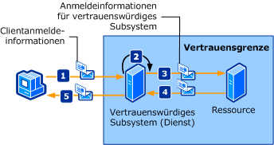

# <a name="trusted-subsystem"></a>Vertrauenswürdiges Subsystem
Ein Client greift auf einen oder mehrere Webdienste zu, die über das Netzwerk verteilt werden. Die Webdienste sind so ausgelegt, dass der Zugriff auf zusätzliche Ressourcen (beispielsweise Datenbanken oder andere Webdienste) in der Geschäftslogik des Webdiensts gekapselt sind. Diese Ressourcen müssen vor nicht autorisiertem Zugriff geschützt werden. Die folgende Abbildung stellt einen vertrauenswürdigen Subsystemprozess dar.  
  
   
  
 Die folgenden Schritte beschreiben den vertrauenswürdigen Subsystemprozess:  
  
1. Der Client reicht zusammen mit Anmeldeinformationen eine Anforderung beim vertrauenswürdigen Subsystem ein.  
  
2. Das vertrauenswürdige Subsystem wird authentifiziert und autorisiert den Benutzer.  
  
3. Das vertrauenswürdige Subsystem sendet eine Anforderungsnachricht an die Remoteressource. Diese Anforderung wird von Anmeldeinformationen für das vertrauenswürdige Subsystem (oder das Dienstkonto, unter dem der vertrauenswürdige Subsystemprozess durchgeführt wird) begleitet.  
  
4. Die Back-End-Ressource authentifiziert und autorisiert das vertrauenswürdige Subsystem. Es verarbeitet dann die Anforderung und gibt eine Antwort zum vertrauenswürdigen Subsystem aus.  
  
5. Das vertrauenswürdige Subsystem verarbeitet die Antwort und gibt seine eigene Antwort an den Client heraus.  
  
|Merkmal|BESCHREIBUNG|  
|--------------------|-----------------|  
|Sicherheitsmodus|Nachricht|  
|Interoperabilität|Nur Windows Communication Foundation (WCF).|  
|Authentifizierung (Dienst)|Sicherheitstokendienst authentifiziert und autorisiert Clients.|  
|Authentifizierung (Client)|Das vertrauenswürdige Subsystem authentifiziert den Client, und die Ressource authentifiziert den vertrauenswürdigen Subsystemdienst.|  
|Integrität|Ja|  
|Vertraulichkeit|Ja|  
|Transport|HTTP zwischen Client und dem vertrauenswürdigen Subsystemdienst.<br /><br /> NET.TCP zwischen dem vertrauenswürdigen Subsystemdienst und der Ressource (Back-End-Dienst).|  
|Bindung|<xref:System.ServiceModel.WSHttpBinding> immer <xref:System.ServiceModel.NetTcpBinding>[\<wsFederationHttpBinding>](../../configure-apps/file-schema/wcf/wsfederationhttpbinding.md)|  
  
## <a name="resource-back-end-service"></a>Ressource (Back-End-Dienst)  
  
### <a name="code"></a>Code  
 Im folgenden Code wird veranschaulicht, wie ein Dienstendpunkt für die Ressource erstellt wird, der Transportsicherheit über das TCP-Transportprotokoll verwendet.  
  
 [!code-csharp[TrustedSubSystemsResource#1](../../../../samples/snippets/csharp/VS_Snippets_CFX/trustedsubsystemsresource/cs/source.cs#1)]
 [!code-vb[TrustedSubSystemsResource#1](../../../../samples/snippets/visualbasic/VS_Snippets_CFX/trustedsubsystemsresource/vb/source.vb#1)]  
  
### <a name="configuration"></a>Konfiguration  
 Mit der folgenden Konfiguration wird derselbe Endpunkt mithilfe von Konfiguration eingerichtet.  
  
```xml  
<?xml version="1.0" encoding="utf-8" ?>  
<configuration>  
  <system.serviceModel>  
    <services>  
      <service name="Microsoft.ServiceModel.Samples.BackendService"  
               behaviorConfiguration="BackendServiceBehavior">  
        <endpoint address="net.tcp://localhost.com:8001/BackendService"  
                  binding="customBinding"  
                  bindingConfiguration="Binding1"  
                  contract="Microsoft.ServiceModel.Samples.ICalculator"/>  
      </service>  
    </services>  
    <bindings>  
      <customBinding>  
        <binding name="Binding1">  
          <security authenticationMode="UserNameOverTransport"/>  
          <windowsStreamSecurity/>  
          <tcpTransport/>  
        </binding>  
      </customBinding>  
    </bindings>  
    <behaviors>  
      <serviceBehaviors>  
        <behavior name="BackendServiceBehavior">  
          <serviceCredentials>  
            <userNameAuthentication userNamePasswordValidationMode="Custom"  
                                    customUserNamePasswordValidatorType="Microsoft.ServiceModel.Samples.MyUserNamePasswordValidator, BackendService"/>  
          </serviceCredentials>  
        </behavior>  
      </serviceBehaviors>  
    </behaviors>  
  </system.serviceModel>  
</configuration>  
```  
  
## <a name="trusted-subsystem"></a>Vertrauenswürdiges Subsystem  
  
### <a name="code"></a>Code  
 Der folgende Code veranschaulicht, wie Sie einen Dienstendpunkt für das vertrauenswürdige Subsystem erstellen, der Nachrichtensicherheit über das HTTP-Protokoll und einen Benutzernamen und ein Kennwort für die Authentifizierung nutzt.  
  
 [!code-csharp[TrustedSubSystems#1](../../../../samples/snippets/csharp/VS_Snippets_CFX/trustedsubsystems/cs/source.cs#1)]
 [!code-vb[TrustedSubSystems#1](../../../../samples/snippets/visualbasic/VS_Snippets_CFX/trustedsubsystems/vb/source.vb#1)]  
  
 Der folgende Code zeigt einen Dienst in einem vertrauenswürdigen Subsystem, der mit einem Back-End-Dienst mithilfe von Transportsicherheit über das TCP-Transportprotokoll kommuniziert.  
  
 [!code-csharp[TrustedSubSystems#2](../../../../samples/snippets/csharp/VS_Snippets_CFX/trustedsubsystems/cs/source.cs#2)]
 [!code-vb[TrustedSubSystems#2](../../../../samples/snippets/visualbasic/VS_Snippets_CFX/trustedsubsystems/vb/source.vb#2)]  
  
### <a name="configuration"></a>Konfiguration  
 Mit der folgenden Konfiguration wird derselbe Endpunkt mithilfe von Konfiguration eingerichtet. Beachten Sie die beiden Bindungen: Eine sichert den im vertrauenswürdigen Subsystem gehosteten Dienst und die andere kommuniziert zwischen dem vertrauenswürdigen Subsystem und dem Back-End-Dienst.  
  
```xml  
<?xml version="1.0" encoding="utf-8" ?>  
<configuration>  
  <system.serviceModel>  
    <services>  
      <service name="Microsoft.ServiceModel.Samples.FacadeService"  
               behaviorConfiguration="FacadeServiceBehavior">  
        <host>  
          <baseAddresses>  
            <add baseAddress="http://localhost:8000/FacadeService"/>  
          </baseAddresses>  
        </host>  
        <endpoint address="http://localhost:8000/FacadeService"  
                  binding="wsHttpBinding"  
                  bindingConfiguration="Binding1"  
                  contract="Microsoft.ServiceModel.Samples.ICalculator"/>  
      </service>  
    </services>  
    <client>  
      <endpoint name=""
                address="net.tcp://contoso.com:8001/BackendService"  
                binding="customBinding"  
                bindingConfiguration="ClientBinding"  
                contract="Microsoft.ServiceModel.Samples.ICalculator"/>  
    </client>  
    <bindings>  
      <wsHttpBinding>  
        <binding name="Binding1">  
          <security mode="Message">  
            <message clientCredentialType="UserName"/>  
          </security>  
        </binding>  
      </wsHttpBinding>  
      <customBinding>  
        <binding name="ClientBinding">  
          <security authenticationMode="UserNameOverTransport"/>  
          <windowsStreamSecurity/>  
          <tcpTransport/>  
        </binding>  
      </customBinding>  
    </bindings>  
    <behaviors>  
      <serviceBehaviors>  
        <behavior name="FacadeServiceBehavior">  
          <serviceMetadata httpGetEnabled="True"/>  
          <serviceCredentials>  
            <serviceCertificate findValue="Contoso.com"  
                                storeLocation="LocalMachine"  
                                storeName="My"  
                                x509FindType="FindBySubjectName" />  
            <userNameAuthentication userNamePasswordValidationMode="Custom"  
                                    customUserNamePasswordValidatorType="Microsoft.ServiceModel.Samples.MyUserNamePasswordValidator, FacadeService"/>  
          </serviceCredentials>  
        </behavior>  
      </serviceBehaviors>  
    </behaviors>  
  </system.serviceModel>  
</configuration>  
```  
  
## <a name="client"></a>Client  
  
### <a name="code"></a>Code  
 Der folgende Code veranschaulicht, wie Sie einen Client, der mit dem vertrauenswürdigen Subsystem kommuniziert, mithilfe von Nachrichtensicherheit über das HTTP-Protokoll und Benutzernamen und Kennwort für die Authentifizierung erstellen.  
  
 [!code-csharp[TrustedSubSystemsClient#1](../../../../samples/snippets/csharp/VS_Snippets_CFX/trustedsubsystemsclient/cs/source.cs#1)]
 [!code-vb[TrustedSubSystemsClient#1](../../../../samples/snippets/visualbasic/VS_Snippets_CFX/trustedsubsystemsclient/vb/source.vb#1)]  
  
### <a name="configuration"></a>Konfiguration  
 Der folgende Code konfiguriert den Client so, dass Nachrichtensicherheit über das HTTP-Protokoll und Benutzername und Kennwort für die Authentifizierung verwendet werden. Der Benutzername und das Kennwort können nur mit Code (nicht konfigurierbar) angegeben werden.  
  
```xml  
<?xml version="1.0" encoding="utf-8" ?>  
<configuration>  
  <system.serviceModel>  
    <client>  
        <endpoint name=""
                  address="http://www.cohowinery.com:8000/FacadeService"  
                  binding="wsHttpBinding"  
                  bindingConfiguration="Binding1"  
                  behaviorConfiguration="ClientUserNameBehavior"  
                  contract="Microsoft.ServiceModel.Samples.ICalculator"/>  
    </client>  
    <bindings>  
      <wsHttpBinding>  
        <binding name="Binding1">  
          <security mode="Message">  
            <message clientCredentialType="UserName"/>  
          </security>  
        </binding>  
      </wsHttpBinding>  
    </bindings>  
    <behaviors>  
      <endpointBehaviors>  
        <behavior name="ClientUserNameBehavior">  
          <clientCredentials>  
            <serviceCertificate>  
              <authentication certificateValidationMode="PeerOrChainTrust"/>  
            </serviceCertificate>  
          </clientCredentials>  
        </behavior>  
      </endpointBehaviors>  
    </behaviors>  
  </system.serviceModel>  
</configuration>  
```  
  
## <a name="see-also"></a>Siehe auch

- [Sicherheitsübersicht](security-overview.md)
- [Sicherheitsmodell für Windows Server AppFabric](/previous-versions/appfabric/ee677202(v=azure.10))
