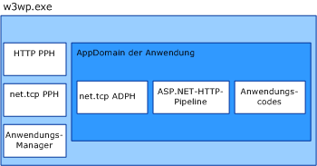

# <a name="was-activation-architecture"></a>WAS-Aktivierungsarchitektur
In diesem Thema werden die einzelnen Komponenten des Windows-Prozessaktivierungsdiensts (auch WAS genannt) aufgeführt und erläutert.  
  
## <a name="activation-components"></a>Aktivierungskomponenten  
 WAS umfasst mehrere Architekturkomponenten:  
  
-   Listeneradapter. Windows-Dienste, die Nachrichten über bestimmte Netzwerkprotokolle empfangen und mit WAS kommunizieren, leiten eingehende Nachrichten an den richtigen Arbeitsprozess weiter.  
  
-   WAS. Der Windows-Dienst, der die Erstellung und die Lebensdauer von Arbeitsprozessen verwaltet.  
  
-   Die ausführbare Datei für generische Arbeitsprozesse (w3wp.exe).  
  
-   Anwendungs-Manager Verwaltet die Erstellung und die Lebensdauer der Anwendungsdomänen, die innerhalb des Arbeitsprozesses als Host von Anwendungen fungieren.  
  
-   Protokollhandler. Protokollspezifische Komponenten, die im Arbeitsprozess ausgeführt werden und die Kommunikation zwischen Arbeitsprozess und den einzelnen Listeneradaptern verwalten. Es sind zwei Typen von Protokollhandlern verfügbar: Prozessprotokollhandler und AppDomain-Protokollhandler.  
  
 Wenn WAS eine Arbeitsprozessinstanz aktiviert, werden die erforderlichen Prozessprotokollhandler in den Arbeitsprozess geladen, und mit dem Anwendungs-Manager wird eine Anwendungsdomäne erstellt, in der die Anwendung gehostet wird. Die Anwendungsdomäne lädt sowohl den Anwendungscode als auch die AppDomain-Protokollhandler, die für die von der Anwendung verwendeten Netzwerkprotokolle erforderlich sind.  
  
   
  
### <a name="listener-adapters"></a>Listeneradapter  
 Listeneradapter sind einzelne Windows-Dienste, welche für die Netzwerkprotokolle, bei denen sie lauschen, die Netzwerkprotokolllogik zum Empfang von Nachrichten implementieren. In der folgenden Tabelle sind die Listeneradapter für [!INCLUDE[indigo1](../../../../includes/indigo1-md.md)] aufgeführt.  
  
|Dienstname des Listeneradapters|Protokoll|Hinweise|  
|-----------------------------------|--------------|-----------|  
|W3SVC|http|Allgemeine Komponente, die sowohl für IIS&#160;7.0 als auch für [!INCLUDE[indigo2](../../../../includes/indigo2-md.md)] die HTTP-Aktivierung bereitstellt.|  
|NetTcpActivator|net.tcp|Hängt vom NetTcpPortSharing-Dienst ab.|  
|NetPipeActivator|net.pipe||  
|NetMsmqActivator|net.msmq|Für die Verwendung mit [!INCLUDE[indigo2](../../../../includes/indigo2-md.md)]-basierten Message Queuing-Anwendungen.|  
|NetMsmqActivator|msmq.formatname|Stellt Abwärtskompatibilität mit vorhandenen Message Queuing-Anwendungen bereit.|  
  
 Listeneradapter für bestimmte Protokolle werden während der Installation in der Datei applicationHost.config registriert. Dies wird im folgenden XML-Beispiel veranschaulicht.  
  
```xml  
<system.applicationHost>  
    <listenerAdapters>  
        <add name="http" />  
        <add name="net.tcp"   
          identity="S-1-5-80-3579033775-2824656752-1522793541-1960352512-462907086" />  
         <add name="net.pipe"   
           identity="S-1-5-80-2943419899-937267781-4189664001-1229628381-3982115073" />  
          <add name="net.msmq"   
            identity="S-1-5-80-89244771-1762554971-1007993102-348796144-2203111529" />  
           <add name="msmq.formatname"   
             identity="S-1-5-80-89244771-1762554971-1007993102-348796144-2203111529" />  
    </listenerAdapters>  
</system.applicationHost>  
```  
  
### <a name="protocol-handlers"></a>Protokollhandler  
 Prozess- und AppDomain-Protokollhandler für bestimmte Protokolle werden in der Datei Web.config auf Computerebene registriert.  
  
```xml  
<system.web>  
   <protocols>  
      <add name="net.tcp"   
        processHandlerType=  
         "System.ServiceModel.WasHosting.TcpProcessProtocolHandler"  
        appDomainHandlerType=  
         "System.ServiceModel.WasHosting.TcpAppDomainProtocolHandler"  
        validate="false" />  
      <add name="net.pipe"   
        processHandlerType=  
         "System.ServiceModel.WasHosting.NamedPipeProcessProtocolHandler"  
          appDomainHandlerType=  
           "System.ServiceModel.WasHosting.NamedPipeAppDomainProtocolHandler"/>  
      <add name="net.msmq"  
        processHandlerType=  
         "System.ServiceModel.WasHosting.MsmqProcessProtocolHandler"  
        appDomainHandlerType=  
         "System.ServiceModel.WasHosting.MsmqAppDomainProtocolHandler"  
        validate="false" />  
   </protocols>  
</system.web>  
```  
  
## <a name="see-also"></a>Siehe auch  
 [Konfigurieren von WAS für die Verwendung mit WCF](../../../../docs/framework/wcf/feature-details/configuring-the-wpa--service-for-use-with-wcf.md)  
 [Windows Server AppFabric-Hostingfunktionen](http://go.microsoft.com/fwlink/?LinkId=201276)
