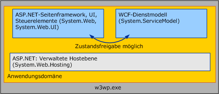

# <a name="wcf-services-and-aspnet"></a>WCF-Dienste und ASP.NET
In diesem Thema wird das parallele Hosten von [!INCLUDE[indigo1](../../../../includes/indigo1-md.md)]-Diensten in ASP.NET und das Hosten dieser Dienste im ASP.NET-Kompatibilitätsmodus erläutert.  
  
## <a name="hosting-wcf-side-by-side-with-aspnet"></a>Paralleles Hosten in WCF und in ASP.NET  
 In Internetinformationsdiensten (IIS) gehostete [!INCLUDE[indigo2](../../../../includes/indigo2-md.md)]-Dienste können mit ASPX-Seiten und ASMX-Webdiensten in einer einzelnen, gemeinsamen Anwendungsdomäne gespeichert sein. ASP.NET bietet sowohl für [!INCLUDE[indigo2](../../../../includes/indigo2-md.md)] als auch für die ASP.NET HTTP-Laufzeit allgemeine Infrastrukturdienste, wie etwa AppDomain-Verwaltung und dynamische Kompilierung. Die Standardkonfiguration für [!INCLUDE[indigo2](../../../../includes/indigo2-md.md)] ist die Parallelität mit ASP.NET.  
  
   
  
 Die ASP.NET HTTP-Laufzeit behandelt ASP.NET-Anforderungen, beteiligt sich jedoch nicht an der Bearbeitung von Anforderungen, die für [!INCLUDE[indigo2](../../../../includes/indigo2-md.md)]-Dienste bestimmt sind, auch wenn diese Dienste in der gleichen AppDomain wie der ASP.NET-Inhalt gehostet werden. Vielmehr fängt das [!INCLUDE[indigo2](../../../../includes/indigo2-md.md)]-Dienstmodell Nachrichten ab, die an [!INCLUDE[indigo2](../../../../includes/indigo2-md.md)]-Dienste gerichtet sind, und leitet sie durch den [!INCLUDE[indigo2](../../../../includes/indigo2-md.md)]-Transport-/Kanalstapel.  
  
 Die Ergebnisse des parallelen Modells sind folgende:  
  
-   ASP.NET- und [!INCLUDE[indigo2](../../../../includes/indigo2-md.md)]-Dienste können den AppDomain-Zustand gemeinsam verwenden. Da die beiden Frameworks in derselben AppDomain koexistieren können, kann [!INCLUDE[indigo2](../../../../includes/indigo2-md.md)] den AppDomain-Zustand zusammen mit ASP.NET verwenden (einschließlich statischen Variablen, Ereignissen usw.).  
  
-   [!INCLUDE[indigo2](../../../../includes/indigo2-md.md)]-Dienste verhalten sich unabhängig von Hostumgebung und Transport konsistent. Die ASP.NET-HTTP-Laufzeit ist absichtlich an IIS/ASP.NET-Hostumgebung und HTTP-Kommunikation gekoppelt. Umgekehrt ist [!INCLUDE[indigo2](../../../../includes/indigo2-md.md)] für konsistentes Verhalten in Hostumgebungen ([!INCLUDE[indigo2](../../../../includes/indigo2-md.md)] verhält sich innerhalb und außerhalb von IIS konsistent) und für Transporte konzipiert (ein in IIS 7.0 und höher gehosteter Dienst zeigt für alle Endpunkte, die er bereitstellt, ein konsistentes Verhalten, auch wenn einige dieser Endpunkte andere Protokolle als HTTP verwenden).  
  
-   Innerhalb einer AppDomain gelten von der HTTP-Laufzeit implementierte Funktionen für den ASP.NET-Inhalt, aber nicht für [!INCLUDE[indigo2](../../../../includes/indigo2-md.md)]. Viele HTTP-spezifischen Funktionen der ASP.NET-Anwendungsplattform gelten nicht für [!INCLUDE[indigo2](../../../../includes/indigo2-md.md)]-Dienste, die in einer AppDomain gehostet werden, die ASP.NET-Inhalt enthält. Im Folgenden sind Beispiele für diese Funktionen aufgeführt:  
  
    -   HttpContext: <xref:System.Web.HttpContext.Current%2A> ist immer `null`, wenn innerhalb eines [!INCLUDE[indigo2](../../../../includes/indigo2-md.md)]-Diensts darauf zugegriffen wird. Verwendung <!--zz <xref:System.ServiceModel.OperationContext.Current.RequestContext>--> `RequestContext` stattdessen.  
  
    -   Dateibasierte Autorisierung: Das [!INCLUDE[indigo2](../../../../includes/indigo2-md.md)]-Sicherheitsmodell lässt bei der Entscheidung, ob eine Dienstanforderung autorisiert ist, nicht zu, dass die Zugriffssteuerungsliste (Access Control List, ACL) für die SVC-Datei des Diensts übernommen wird.  
  
    -   Konfigurationsbasierte URL-Autorisierung: Entsprechend der [!INCLUDE[indigo2](../../../../includes/indigo2-md.md)] Sicherheitsmodell nicht auf alle URL-basierten Autorisierungsregeln, die im System.Web angegebenen reduzierbar \<Autorisierung > Konfigurationselement. Diese Einstellungen werden für [!INCLUDE[indigo2](../../../../includes/indigo2-md.md)]-Anforderungen ignoriert, wenn sich ein Dienst in einem URL-Namespace befindet, der durch die Autorisierungsregeln von ASP.NET gesichert ist.  
  
    -   HttpModule-Erweiterbarkeit: Die als Host fungierende [!INCLUDE[indigo2](../../../../includes/indigo2-md.md)]-Infrastruktur fängt [!INCLUDE[indigo2](../../../../includes/indigo2-md.md)]-Anforderungen ab, wenn das <xref:System.Web.HttpApplication.PostAuthenticateRequest>-Ereignis ausgelöst wird, und gibt die Verarbeitung nicht an die HTTP-Pipeline von ASP.NET zurück. Module, die für das Abfangen von Anforderungen in späteren Phasen der Pipeline codiert sind, fangen keine [!INCLUDE[indigo2](../../../../includes/indigo2-md.md)]-Anforderungen ab.  
  
    -   ASP.NET-Identitätswechsel: standardmäßig [!INCLUDE[indigo2](../../../../includes/indigo2-md.md)] erfordert immer ausgeführt wird wie IIS die Identität, verarbeiten, auch wenn ASP.NET festgelegt ist, können Sie mithilfe des System.Web-Identitätswechsel aktivieren \<Identität = "true" / > Konfigurationsoption.  
  
 Diese Einschränkungen gelten nur für in IIS gehostete [!INCLUDE[indigo2](../../../../includes/indigo2-md.md)]-Dienste. Das Verhalten des ASP.NET-Inhalts wird nicht durch das Vorhandensein von [!INCLUDE[indigo2](../../../../includes/indigo2-md.md)] beeinflusst.  
  
 Bei [!INCLUDE[indigo2](../../../../includes/indigo2-md.md)]-Anwendungen, die die Funktionalität benötigen, die traditionell von der HTTP-Pipeline geboten wird, sollte die Verwendung der [!INCLUDE[indigo2](../../../../includes/indigo2-md.md)]-Entsprechungen erwogen werden. Sie sind von Host und Transport unabhängig:  
  
-   <xref:System.ServiceModel.OperationContext> anstelle von <xref:System.Web.HttpContext>.  
  
-   <xref:System.ServiceModel.Description.ServiceAuthorizationBehavior> statt der Datei-/URL-Autorisierung von ASP.NET.  
  
-   <xref:System.ServiceModel.Dispatcher.IDispatchMessageInspector> oder benutzerdefinierte überlagerte Kanäle statt der HTTP-Module.  
  
-   Identitätswechsel für jeden Vorgang mit [!INCLUDE[indigo2](../../../../includes/indigo2-md.md)] statt des System.Web-Identitätswechsels.  
  
 Alternativ können Sie erwägen, die Dienste im ASP.NET Kompatibilitätsmodus von [!INCLUDE[indigo2](../../../../includes/indigo2-md.md)] auszuführen.  
  
## <a name="hosting-wcf-services-in-aspnet-compatibility-mode"></a>Hosten von WCF-Diensten im ASP.NET-Kompatibilitätsmodus  
 Zwar ist das [!INCLUDE[indigo2](../../../../includes/indigo2-md.md)]-Modell für konsistentes Verhalten in Hostumgebungen und für Transporte konzipiert, doch sind Szenarien häufig, in denen Anwendungen dieses Maß an Flexibilität nicht benötigen. Der ASP.NET-Kompatibilitätsmodus von [!INCLUDE[indigo2](../../../../includes/indigo2-md.md)] ist für Szenarien geeignet, in denen das Hosting außerhalb von IIS oder die Möglichkeit, mit anderen Protokollen als HTTP zu kommunizieren, nicht erforderlich ist, wohl aber die Verwendung aller Funktionen der ASP.NET-Webanwendungsplattform.  
  
 Im Unterschied zur standardmäßigen parallelen Konfiguration, bei der die [!INCLUDE[indigo2](../../../../includes/indigo2-md.md)]-Infrastruktur [!INCLUDE[indigo2](../../../../includes/indigo2-md.md)]-Nachrichten abfängt und sie von der HTTP-Pipeline wegleitet, nehmen im ASP.NET-Kompatibilitätsmodus ausgeführte [!INCLUDE[indigo2](../../../../includes/indigo2-md.md)]-Dienste voll am ASP.NET HTTP-Anforderungslebenszyklus teil. Im Kompatibilitätsmodus verwenden [!INCLUDE[indigo2](../../../../includes/indigo2-md.md)]-Dienste die HTTP-Pipeline über eine <xref:System.Web.IHttpHandler>-Implementierung, also auf ähnliche Weise, wie Anforderungen für ASPX-Seiten und ASMX-Webdienste behandelt werden. Im Ergebnis verhält sich [!INCLUDE[indigo2](../../../../includes/indigo2-md.md)] in Bezug auf die folgenden ASP.NET-Funktionen identisch mit ASMX:  
  
-   Im ASP.NET-Kompatibilitätsmodus laufende <xref:System.Web.HttpContext>: [!INCLUDE[indigo2](../../../../includes/indigo2-md.md)]-Dienste können auf <xref:System.Web.HttpContext.Current%2A> und den zugehörigen Status zugreifen.  
  
-   Dateibasierte Autorisierung: Im ASP.NET-Kompatibilitätsmodus laufende [!INCLUDE[indigo2](../../../../includes/indigo2-md.md)]-Dienste können abgesichert werden, indem der SVC-Datei des Diensts Dateisystem-Zugriffssteuerungslisten angehängt werden.  
  
-   Konfigurierbare URL-Autorisierung: Die Autorisierungsregeln von ASP.NET werden für [!INCLUDE[indigo2](../../../../includes/indigo2-md.md)]-Anforderungen erzwungen, wenn der [!INCLUDE[indigo2](../../../../includes/indigo2-md.md)]-Dienst im ASP.NET-Kompatibilitätsmodus ausgeführt wird.  
  
-   <xref:System.Web.HttpModuleCollection>-Erweiterbarkeit: Weil im ASP.NET-Kompatibilitätsmodus ausgeführte [!INCLUDE[indigo2](../../../../includes/indigo2-md.md)]-Dienste voll am ASP.NET HTTP-Anforderungslebenszyklus teilnehmen, kann jedes in der HTTP-Pipeline konfigurierte HTTP-Modul mit [!INCLUDE[indigo2](../../../../includes/indigo2-md.md)]-Anforderungen vor und nach dem Dienstaufruf arbeiten.  
  
-   ASP.NET-Identitätswechsel: [!INCLUDE[indigo2](../../../../includes/indigo2-md.md)]-Dienste laufen unter der Identität, die der ASP.NET-Thread angenommen hat, und der sich von der IIS-Prozessidentität unterscheiden kann, wenn ASP.NET-Identitätswechsel für die Anwendung aktiviert wurde. Sind für einen bestimmten Dienstvorgang sowohl ASP.NET-Identitätswechsel als auch [!INCLUDE[indigo2](../../../../includes/indigo2-md.md)]-Identitätswechsel aktiviert, wird die Dienstimplementierung letztlich unter der Identität ausgeführt, die von [!INCLUDE[indigo2](../../../../includes/indigo2-md.md)] bezogen wurde.  
  
 Der ASP.NET-Kompatibilitätsmodus von [!INCLUDE[indigo2](../../../../includes/indigo2-md.md)] wird auf der Anwendungsebene über die folgende Konfiguration (in der Web.config-Datei der Anwendung) aktiviert:  
  
```xml  
<system.serviceModel>  
    <serviceHostingEnvironment aspNetCompatibilityEnabled="true" />  
</system.serviceModel>  
```  
  
 Dieser Wert liegt standardmäßig "`true`" nicht angegeben. Wenn dieser Wert auf "`false`" gibt an, dass alle [!INCLUDE[indigo2](../../../../includes/indigo2-md.md)] Dienste, die in der Anwendung ausgeführten nicht im ASP.NET-Kompatibilitätsmodus ausgeführt werden.  
  
 Da der ASP.NET-Kompatibilitätsmodus eine Semantik der Anforderungsverarbeitung impliziert, die grundlegend von der des [!INCLUDE[indigo2](../../../../includes/indigo2-md.md)]-Standards verschieden ist, haben die einzelnen Dienstimplementierungen die Möglichkeit zu steuern, ob sie innerhalb einer Anwendung laufen, für die der ASP.NET-Kompatibilitätsmodus aktiviert wurde. Dienste können das <xref:System.ServiceModel.Activation.AspNetCompatibilityRequirementsAttribute> verwenden, um anzugeben, ob sie den ASP.NET-Kompatibilitätsmodus unterstützen. Der Standardwert für dieses Attribut ist <xref:System.ServiceModel.Activation.AspNetCompatibilityRequirementsMode.Allowed>.  
  
 `[AspNetCompatibilityRequirements(RequirementsMode = AspNetCompatibilityRequirementsMode.Allowed)]`  
  
 `public class CalculatorService : ICalculatorSession`  
  
 `{//Implement calculator service methods.}`  
  
 In der folgenden Tabelle wird gezeigt, wie die Einstellung des anwendungsweiten Kompatibilitätsmodus mit der vom jeweiligen Dienst angegebenen Unterstützungsebene interagiert:  
  
|Anwendungsweite Einstellung des Kompatibilitätsmodus|[AspNetCompatibilityRequirementsMode]<br /><br /> Einstellung|Beobachtetes Ergebnis|  
|--------------------------------------------------|---------------------------------------------------------|---------------------|  
|AspNetCompatibilityEnabled = "`true`"|<xref:System.ServiceModel.Activation.AspNetCompatibilityRequirementsMode.Required>|Dienst wird erfolgreich aktiviert.|  
|AspNetCompatibilityEnabled = "`true`"|<xref:System.ServiceModel.Activation.AspNetCompatibilityRequirementsMode.Allowed>|Dienst wird erfolgreich aktiviert.|  
|AspNetCompatibilityEnabled = "`true`"|<xref:System.ServiceModel.Activation.AspNetCompatibilityRequirementsMode.NotAllowed>|Ein Aktivierungsfehler tritt auf, wenn der Dienst eine Nachricht empfängt.|  
|AspNetCompatibilityEnabled = "`false`"|<xref:System.ServiceModel.Activation.AspNetCompatibilityRequirementsMode.Required>|Ein Aktivierungsfehler tritt auf, wenn der Dienst eine Nachricht empfängt.|  
|AspNetCompatibilityEnabled = "`false`"|<xref:System.ServiceModel.Activation.AspNetCompatibilityRequirementsMode.Allowed>|Dienst wird erfolgreich aktiviert.|  
|AspNetCompatibilityEnabled = "`false`"|<xref:System.ServiceModel.Activation.AspNetCompatibilityRequirementsMode.NotAllowed>|Dienst wird erfolgreich aktiviert.|  
  
> [!NOTE]
>  IIS&#160;7.0 und WAS ermöglichen [!INCLUDE[indigo2](../../../../includes/indigo2-md.md)]-Diensten, über andere Protokolle als HTTP zu kommunizieren. Allerdings dürfen [!INCLUDE[indigo2](../../../../includes/indigo2-md.md)]-Dienste, die in Anwendungen laufen, für die der ASP.NET-Kompatibilitätsmodus aktiviert ist, keine Nicht-HTTP-Endpunkte verfügbar machen. Eine solche Konfiguration generiert eine Aktivierungsausnahme, wenn der Dienst seine erste Nachricht empfängt.  
  
 Weitere Informationen zum Aktivieren der ASP.NET-Kompatibilitätsmodus für [!INCLUDE[indigo2](../../../../includes/indigo2-md.md)] Services, finden Sie unter <xref:System.ServiceModel.Activation.AspNetCompatibilityRequirementsMode> und [ASP.NET-Kompatibilität](../../../../docs/framework/wcf/samples/aspnet-compatibility.md) Beispiel.  
  
## <a name="see-also"></a>Siehe auch  
 <xref:System.ServiceModel.Activation.AspNetCompatibilityRequirementsAttribute>  
 [Windows Server AppFabric-Hostingfunktionen](http://go.microsoft.com/fwlink/?LinkId=201276)
