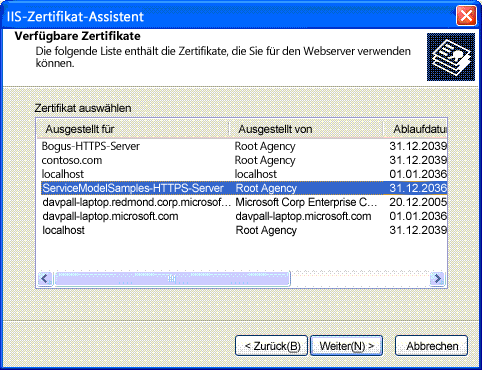

# <a name="internet-information-services-iis-server-certificate-installation-instructions"></a>Installationsanleitung für IIS-Serverzertifikate (Internetinformationsdienste)

Zum Ausführen der Beispiele, die über eine sichere Kommunikation mit Internetinformationsdiensten (IIS) verbunden sind, müssen Sie ein Serverzertifikat erstellen und installieren.  
  
## <a name="step-1-creating-certificates"></a>Schritt 1: Erstellen von Zertifikaten  

 Um ein Zertifikat für Ihren Computer zu erstellen, öffnen Sie eine Developer-Eingabeaufforderung für Visual Studio mit Administratorrechten, und führen Sie den Setup.bat aus, der in jedem der Beispiele enthalten ist, in denen die sichere Kommunikation mit IIS verwendet wird. Stellen Sie vor dem Ausführen dieser Batchdatei sicher, dass der Pfad den Ordner einschließt, in dem sich die Datei Makecert.exe befindet. Der folgende Befehl wird zum Erstellen des Zertifikats in Setup.bat verwendet.  
  
```console  
makecert -sr LocalMachine -ss My -n CN=ServiceModelSamples-HTTPS-Server -sky exchange -sk ServiceModelSamples-HTTPS-Key  
```  
  
## <a name="step-2-installing-certificates"></a>Schritt 2: Installieren von Zertifikaten  

 Welche Schritte Sie zum Installieren der erstellten Zertifikate ausführen müssen, hängt von der verwendeten IIS-Version ab.  
  
#### <a name="to-install-iis-on-iis-51-windows-xp-and-iis-60-windows-server-2003"></a>Installation mit IIS 5.1 (Windows XP) und IIS 6.0 (Windows Server 2003)  
  
1. Öffnen Sie das MMC-Snap-In Internetinformationsdienste-Manager.  
  
2. Klicken Sie mit der rechten Maustaste auf die Standard Website, und wählen Sie **Eigenschaften**.  
  
3. Wählen Sie die Registerkarte **Verzeichnis Sicherheit** .  
  
4. Klicken Sie auf die Schaltfläche **Server Zertifikat** . Der Assistent für Webserverzertifikate wird gestartet.  
  
5. Schließen Sie den Assistenten ab. Wählen Sie die Option zum Zuweisen eines Zertifikats aus. Wählen Sie aus der angezeigten Liste mit Zertifikaten das Zertifikat ServiceModelSamples-HTTPS-Server aus.  
  
       
  
6. Testen Sie den Zugriff auf den Dienst in einem Browser mithilfe der HTTPS-Adresse `https://localhost/servicemodelsamples/service.svc` .  
  
#### <a name="if-ssl-was-previously-configured-by-using-httpcfgexe"></a>Wenn zuvor SSL mit Httpcfg.exe konfiguriert wurde  
  
1. Verwenden Sie zum Erstellen des Serverzertifikats Makecert.exe (oder führen Sie Setup.bat aus).  
  
2. Führen Sie den IIS-Manager aus, und installieren Sie das Zertifikat wie oben beschrieben.  
  
3. Fügen Sie dem Clientprogramm folgenden Code hinzu.  
  
> [!IMPORTANT]
> Dieser Code ist nur für Testzertifikate erforderlich, die z. B. mit Makecert.exe erstellt wurden. Er wird nicht für Produktionsumgebungen empfohlen.  
  
```csharp  
PermissiveCertificatePolicy.Enact("CN=ServiceModelSamples-HTTPS-Server");  
```  
  
#### <a name="to-install-iis-on-iis-70-windows-vista-and-windows-server-2008"></a>Installation mit IIS&#160;7.0 (Windows&#160;Vista und Windows Server&#160;2008)  
  
1. Klicken Sie im **Startmenü** auf **Ausführen**, und geben Sie **inetmgr** ein, um das MMC-Snap-in Internetinformationsdienste (IIS) zu öffnen.  
  
2. Klicken Sie mit der rechten Maustaste auf die **Standard Website** , und wählen Sie **Bindungen bearbeiten...**  
  
3. Klicken Sie im Dialogfeld **Site Bindungen** auf die Schaltfläche **Hinzufügen** .  
  
4. Wählen Sie in der Dropdown Liste **Typ** die Option **https** aus.  
  
5. Wählen Sie in der Dropdown Liste **SSL-Zertifikat** den **Ordner Service Model Samples-HTTPS-Server** aus, und klicken Sie auf **OK**.  
  
6. Testen Sie den Zugriff auf den Dienst in einem Browser mithilfe der HTTPS-Adresse `https://localhost/servicemodelsamples/service.svc` .  
  
> [!NOTE]
> Da es sich bei dem gerade installierten Testzertifikat nicht um ein vertrauenswürdiges Zertifikat handelt, werden im Internet Explorer möglicherweise zusätzliche Sicherheitswarnungen angezeigt, wenn Sie zu lokalen Webseiten navigieren, die dieses Zertifikat verwenden.  
  
## <a name="removing-certificates"></a>Entfernen von Zertifikaten  
  
- Führen Sie im Internetinformationsdienste-Manager die zuvor beschriebenen Schritte aus. Entfernen Sie jedoch das Zertifikat bzw. die Bindung, anstatt sie hinzuzufügen.  
  
- Entfernen Sie das Computerzertifikat mit dem folgenden Befehl.  
  
    ```console  
    httpcfg delete ssl -i 0.0.0.0:443  
    ```
