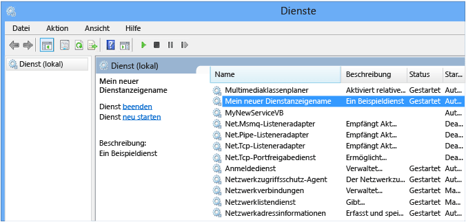

# <a name="tutorial-create-a-windows-service-app"></a>Tutorial: Erstellen einer Windows-Dienst-App

In diesem Artikel wird beschrieben, wie Sie eine Windows-Dienstanwendung in Visual Studio erstellen, die Meldungen in ein Ereignisprotokoll schreibt.

## <a name="create-a-service"></a>Erstellen eines Diensts

Erstellen Sie zunächst das Projekt, und legen Sie die Werte fest, die für die korrekte Funktion des Diensts erforderlich sind.

1. Wählen Sie in Visual Studio auf der Menüleiste **Datei** **Neu** > **Projekt** aus (oder drücken Sie **STRG**+**UMSCHALT**+**N**), um das Fenster **Neues Projekt** zu öffnen.

2. Navigieren Sie zur Projektvorlage **Windows-Dienst (.NET Framework)** , und wählen Sie sie aus. Sie finden diese, indem Sie **Installiert** und **Visual C#** aufklappen oder **Visual Basic**, und dann **Windows-Desktop** auswählen. Alternativ können Sie im Suchfeld oben rechts *Windows-Dienst* eingeben und die **EINGABETASTE** drücken.

   

   > [!NOTE]
   > Wenn Sie die Vorlage **Windows-Dienst** nicht finden können, müssen Sie möglicherweise die Workload **.NET-Desktopentwicklung** installieren:
   >
   > Wählen Sie im Dialogfeld **Neues Projekt** im unteren linken Bereich **Visual Studio-Installer öffnen** aus. Wählen Sie die Workload **.NET-Desktopentwicklung** aus, und klicken Sie anschließend auf **Ändern**.

3. Geben Sie als **Name***MyNewService* ein, und klicken Sie dann auf **OK**.

   Die Registerkarte **Design** wird angezeigt (**Service1.cs [Design]** oder **Service1.vb [Design]** ).

   Die Projektvorlage beinhaltet eine Komponentenklasse mit dem Namen `Service1`, die von <xref:System.ServiceProcess.ServiceBase?displayProperty=nameWithType> erbt. Sie enthält einen großen Teil des grundlegenden Dienstcodes, etwa den Code zum Starten des Diensts.

## <a name="rename-the-service"></a>Umbenennen des Diensts

Benennen Sie den Dienst von **Service1** in **MyNewService** um.

1. Wählen Sie im **Projektmappen-Explorer** die Datei **Service1.cs** oder **Service1.vb** aus, und klicken Sie im Kontextmenü auf **Umbenennen**. Nennen Sie die Datei um in **MyNewService.cs** oder **MyNewService.vb**, und drücken Sie dann die **EINGABETASTE**.

    Daraufhin wird ein Popupfenster angezeigt, in dem Sie gefragt werden, ob Sie alle Verweise auf das Codeelement *Service1* umbenennen möchten.

2. Wählen Sie im Popupfenster **Ja** aus.

    

3. Wählen Sie in der Registerkarte **Design** aus dem Kontextmenü **Eigenschaften** aus. Ändern Sie im Fenster **Eigenschaften** den Wert für **ServiceName** in *MyNewService*.

    

4. Wählen Sie im Menü **Datei** die Option **Alle speichern** aus.

## <a name="add-features-to-the-service"></a>Hinzufügen von Features zum Dienst

In diesem Abschnitt fügen Sie dem Windows-Dienst ein benutzerdefiniertes Ereignisprotokoll hinzu. Die <xref:System.Diagnostics.EventLog>-Komponente wird als Beispiel für die Art von Komponente verwendet, die Sie einem Windows-Dienst hinzufügen können.

### <a name="add-custom-event-log-functionality"></a>Hinzufügen einer benutzerdefinierten Ereignisprotokollfunktion

1. Öffnen Sie im **Projektmappen-Explorer** das Kontextmenü für **MyNewService.cs** oder **MyNewService.vb**, und wählen Sie dann **Designer anzeigen** aus.

2. Erweitern Sie in der **Toolbox** die Option **Komponenten**, und ziehen Sie dann die **EventLog**-Komponente in eine der Registerkarten **Service1.cs [Design]** oder **Service1.vb [Design]** .

3. Öffnen Sie im **Projektmappen-Explorer** das Kontextmenü für **MyNewService.cs** oder **MyNewService.vb**, und wählen Sie dann **Code anzeigen** aus.

4. Definieren Sie ein benutzerdefiniertes Ereignisprotokoll. Für C# bearbeiten Sie den vorhandenen `MyNewService()`-Konstruktor; für Visual Basic wird der `New()`-Konstruktor hinzugefügt:

   [!code-csharp[VbRadconService#2](../../../samples/snippets/csharp/VS_Snippets_VBCSharp/VbRadconService/CS/MyNewService.cs#2)]
   [!code-vb[VbRadconService#2](../../../samples/snippets/visualbasic/VS_Snippets_VBCSharp/VbRadconService/VB/MyNewService.vb#2)]

5. Fügen Sie den <xref:System.Diagnostics?displayProperty=nameWithType>-Namespace hinzu, indem Sie (sofern diese nicht bereits vorhanden ist) die `using`-Anweisung in der Datei **MyNewService.cs** bzw. die `Imports`-Anweisung in der Datei **MyNewService.vb** verwenden:

    ```csharp
    using System.Diagnostics;
    ```

    ```vb
    Imports System.Diagnostics
    ```

6. Wählen Sie im Menü **Datei** die Option **Alle speichern** aus.

### <a name="define-what-occurs-when-the-service-starts"></a>Definieren, was beim Starten des Diensts ausgeführt wird

Suchen Sie im Code-Editor für **MyNewService.cs** oder **MyNewService.vb** die <xref:System.ServiceProcess.ServiceBase.OnStart%2A>-Methode; Visual Studio hat beim Erstellen des Projekts automatisch eine leere Methodendefinition erstellt. Fügen Sie Code hinzu, der beim Starten des Diensts einen Eintrag in das Ereignisprotokoll schreibt:

[!code-csharp[VbRadconService#3](../../../samples/snippets/csharp/VS_Snippets_VBCSharp/VbRadconService/CS/MyNewService.cs#3)]
[!code-vb[VbRadconService#3](../../../samples/snippets/visualbasic/VS_Snippets_VBCSharp/VbRadconService/VB/MyNewService.vb#3)]

#### <a name="polling"></a>Abrufen

Da eine Dienstanwendung mit langer Laufzeit entworfen wird, fragt sie in der Regel das System ab oder überwacht es. Dies haben Sie in der <xref:System.ServiceProcess.ServiceBase.OnStart%2A>-Methode eingerichtet. Die `OnStart`-Methode muss zum Betriebssystem zurückkehren, sobald die Ausführung des Dienstes begonnen hat, damit das System nicht blockiert wird.

Mit der <xref:System.Timers.Timer?displayProperty=nameWithType>-Komponente können Sie einen einfachen Abrufmechanismus einrichten. Der Timer löst in regelmäßigen Intervallen ein <xref:System.Timers.Timer.Elapsed>-Ereignis aus. Zu diesem Zeitpunkt kann Ihr Dienst die Überwachung durchführen. Sie verwenden die <xref:System.Timers.Timer>-Komponente folgendermaßen:

- Legen Sie die Eigenschaften der <xref:System.Timers.Timer>-Komponente in der `MyNewService.OnStart`-Methode fest.
- Starten Sie den Timer durch Aufrufen der <xref:System.Timers.Timer.Start%2A>-Methode.

##### <a name="set-up-the-polling-mechanism"></a>Richten sie den Abrufmechanismus ein.

1. Fügen Sie im `MyNewService.OnStart`-Ereignis den folgenden Code ein, um den Abrufmechanismus einzurichten:

   ```csharp
   // Set up a timer that triggers every minute.
   Timer timer = new Timer();
   timer.Interval = 60000; // 60 seconds
   timer.Elapsed += new ElapsedEventHandler(this.OnTimer);
   timer.Start();
   ```

   ```vb
   ' Set up a timer that triggers every minute.
   Dim timer As Timer = New Timer()
   timer.Interval = 60000 ' 60 seconds
   AddHandler timer.Elapsed, AddressOf Me.OnTimer
   timer.Start()
   ```

2. Fügen Sie den <xref:System.Timers?displayProperty=nameWithType>-Namespace hinzu, indem Sie die `using`-Anweisung in der Datei **MyNewService.cs** bzw. die `Imports`-Anweisung in der Datei **MyNewService.vb** verwenden:

   ```csharp
   using System.Timers;
   ```

   ```vb
   Imports System.Timers
   ```

3. Fügen Sie der `MyNewService`-Klasse die `OnTimer`-Methode hinzu, um das <xref:System.Timers.Timer.Elapsed?displayProperty=nameWithType>-Ereignis zu verarbeiten:

   ```csharp
   public void OnTimer(object sender, ElapsedEventArgs args)
   {
       // TODO: Insert monitoring activities here.
       eventLog1.WriteEntry("Monitoring the System", EventLogEntryType.Information, eventId++);
   }
   ```

   ```vb
   Private Sub OnTimer(sender As Object, e As Timers.ElapsedEventArgs)
      ' TODO: Insert monitoring activities here.
      eventLog1.WriteEntry("Monitoring the System", EventLogEntryType.Information, eventId)
      eventId = eventId + 1
   End Sub
   ```

4. Fügen Sie der `MyNewService`-Klasse eine Membervariable hinzu. Sie enthält den Bezeichner des nächsten Ereignisses, das in das Ereignisprotokoll geschrieben werden soll:

   ```csharp
   private int eventId = 1;
   ```

   ```vb
   Private eventId As Integer = 1
   ```

Anstatt alle Aufgaben auf dem Hauptthread auszuführen, können Sie Aufgaben mithilfe von Arbeitsthreads im Hintergrund ausführen. Weitere Informationen finden Sie unter <xref:System.ComponentModel.BackgroundWorker?displayProperty=fullName>.

### <a name="define-what-occurs-when-the-service-is-stopped"></a>Definieren, was beim Beenden des Diensts ausgeführt wird

Fügen Sie der Methode <xref:System.ServiceProcess.ServiceBase.OnStop%2A> eine Codezeile hinzu, die beim Beenden des Diensts einen Eintrag zum Ereignisprotokoll hinzufügt:

[!code-csharp[VbRadconService#2](../../../samples/snippets/csharp/VS_Snippets_VBCSharp/VbRadconService/CS/MyNewService.cs#4)]
[!code-vb[VbRadconService#4](../../../samples/snippets/visualbasic/VS_Snippets_VBCSharp/VbRadconService/VB/MyNewService.vb#4)]

### <a name="define-other-actions-for-the-service"></a>Definieren weiterer Aktionen für den Dienst

Sie können die Methoden <xref:System.ServiceProcess.ServiceBase.OnPause%2A>, <xref:System.ServiceProcess.ServiceBase.OnContinue%2A> und <xref:System.ServiceProcess.ServiceBase.OnShutdown%2A> überschreiben, um zusätzliche Verarbeitungsschritte für Ihre Komponente zu definieren.

Im folgenden Codebeispiel wird veranschaulicht, wie die <xref:System.ServiceProcess.ServiceBase.OnContinue%2A>-Methode in der `MyNewService`-Klasse überschrieben wird:

[!code-csharp[VbRadconService#5](../../../samples/snippets/csharp/VS_Snippets_VBCSharp/VbRadconService/CS/MyNewService.cs#5)]
[!code-vb[VbRadconService#5](../../../samples/snippets/visualbasic/VS_Snippets_VBCSharp/VbRadconService/VB/MyNewService.vb#5)]

## <a name="set-service-status"></a>Festlegen des Dienststatus

Dienste melden ihren Status an den [Dienststeuerungs-Manager](/windows/desktop/Services/service-control-manager), damit Benutzer erkennen können, ob ein Dienst ordnungsgemäß ausgeführt wird. Standardmäßig meldet ein Dienst, der von <xref:System.ServiceProcess.ServiceBase> erbt, eine begrenzte Anzahl von Statuseinstellungen. Dazu gehören SERVICE_STOPPED, SERVICE_PAUSED und SERVICE_RUNNING. Wenn es etwas länger dauert, bis ein Dienst startet, kann es hilfreich sein, den Status SERVICE_START_PENDING zu melden.

Sie können auch die Statuseinstellungen SERVICE_START_PENDING und SERVICE_STOP_PENDING durch Hinzufügen von Code implementieren, der in Windows die Funktion [SetServiceStatus](/windows/desktop/api/winsvc/nf-winsvc-setservicestatus) aufruft.

### <a name="implement-service-pending-status"></a>Implementieren des Dienststatus SERVICE_PENDING

1. Fügen Sie den <xref:System.Runtime.InteropServices?displayProperty=nameWithType>-Namespace hinzu, indem Sie die `using`-Anweisung in der Datei **MyNewService.cs** bzw. die `Imports`-Anweisung in der Datei **MyNewService.vb** verwenden:

    ```csharp
    using System.Runtime.InteropServices;
    ```

    ```vb
    Imports System.Runtime.InteropServices
    ```

2. Fügen Sie **MyNewService.cs** bzw. **MyNewService.vb** folgenden Code hinzu, um die `ServiceState`-Werte zu deklarieren und um eine Struktur für den Status hinzuzufügen, die Sie in einem Plattformaufruf verwenden:

    ```csharp
    public enum ServiceState
    {
        SERVICE_STOPPED = 0x00000001,
        SERVICE_START_PENDING = 0x00000002,
        SERVICE_STOP_PENDING = 0x00000003,
        SERVICE_RUNNING = 0x00000004,
        SERVICE_CONTINUE_PENDING = 0x00000005,
        SERVICE_PAUSE_PENDING = 0x00000006,
        SERVICE_PAUSED = 0x00000007,
    }

    [StructLayout(LayoutKind.Sequential)]
    public struct ServiceStatus
    {
        public int dwServiceType;
        public ServiceState dwCurrentState;
        public int dwControlsAccepted;
        public int dwWin32ExitCode;
        public int dwServiceSpecificExitCode;
        public int dwCheckPoint;
        public int dwWaitHint;
    };
    ```

    ```vb
    Public Enum ServiceState
        SERVICE_STOPPED = 1
        SERVICE_START_PENDING = 2
        SERVICE_STOP_PENDING = 3
        SERVICE_RUNNING = 4
        SERVICE_CONTINUE_PENDING = 5
        SERVICE_PAUSE_PENDING = 6
        SERVICE_PAUSED = 7
    End Enum

    <StructLayout(LayoutKind.Sequential)>
    Public Structure ServiceStatus
        Public dwServiceType As Long
        Public dwCurrentState As ServiceState
        Public dwControlsAccepted As Long
        Public dwWin32ExitCode As Long
        Public dwServiceSpecificExitCode As Long
        Public dwCheckPoint As Long
        Public dwWaitHint As Long
    End Structure
    ```

    > [!NOTE]
    > Der Dienststeuerungs-Manager verwendet die Member `dwWaitHint` und `dwCheckpoint` der [SERVICE_STATUS-Struktur](/windows/win32/api/winsvc/ns-winsvc-service_status), um zu bestimmen, wie lange bis zum Starten oder Herunterfahren eines Windows-Diensts gewartet werden muss. Wenn Ihre Methoden `OnStart` und `OnStop` eine lange Ausführungszeit haben, kann Ihr Dienst durch das erneute Aufrufen von `SetServiceStatus` mit einem erhöhten `dwCheckPoint`-Wert mehr Zeit anfordern.

3. Deklarieren Sie nun in der Klasse `MyNewService` die Funktion [SetServiceStatus](/windows/desktop/api/winsvc/nf-winsvc-setservicestatus) mithilfe eines [Plattformaufrufs](../interop/consuming-unmanaged-dll-functions.md):

    ```csharp
    [DllImport("advapi32.dll", SetLastError = true)]
    private static extern bool SetServiceStatus(System.IntPtr handle, ref ServiceStatus serviceStatus);
    ```

    ```vb
    Declare Auto Function SetServiceStatus Lib "advapi32.dll" (ByVal handle As IntPtr, ByRef serviceStatus As ServiceStatus) As Boolean
    ```

4. Soll der Status Start SERVICE_START_PENDING implementiert werden, fügen Sie den folgenden Code am Anfang der <xref:System.ServiceProcess.ServiceBase.OnStart%2A>-Methode hinzu:

    ```csharp
    // Update the service state to Start Pending.
    ServiceStatus serviceStatus = new ServiceStatus();
    serviceStatus.dwCurrentState = ServiceState.SERVICE_START_PENDING;
    serviceStatus.dwWaitHint = 100000;
    SetServiceStatus(this.ServiceHandle, ref serviceStatus);
    ```

    ```vb
    ' Update the service state to Start Pending.
    Dim serviceStatus As ServiceStatus = New ServiceStatus()
    serviceStatus.dwCurrentState = ServiceState.SERVICE_START_PENDING
    serviceStatus.dwWaitHint = 100000
    SetServiceStatus(Me.ServiceHandle, serviceStatus)
    ```

5. Fügen Sie am Ende der `OnStart`-Methode Code hinzu, um den Status SERVICE_RUNNING festzulegen:

    ```csharp
    // Update the service state to Running.
    serviceStatus.dwCurrentState = ServiceState.SERVICE_RUNNING;
    SetServiceStatus(this.ServiceHandle, ref serviceStatus);
    ```

    ```vb
    ' Update the service state to Running.
    serviceStatus.dwCurrentState = ServiceState.SERVICE_RUNNING
    SetServiceStatus(Me.ServiceHandle, serviceStatus)
    ```

6. (Optional) Wenn <xref:System.ServiceProcess.ServiceBase.OnStop%2A> eine Methode mit langer Laufzeit ist, wiederholen Sie diese Prozedur in der Methode `OnStop`. Implementieren Sie den Status SERVICE_STOP_PENDING und geben Sie den SERVICE_STOPPED-Status zurück, bevor die `OnStop`-Methode endet.

   Zum Beispiel:

    ```csharp
    // Update the service state to Stop Pending.
    ServiceStatus serviceStatus = new ServiceStatus();
    serviceStatus.dwCurrentState = ServiceState.SERVICE_STOP_PENDING;
    serviceStatus.dwWaitHint = 100000;
    SetServiceStatus(this.ServiceHandle, ref serviceStatus);

    // Update the service state to Stopped.
    serviceStatus.dwCurrentState = ServiceState.SERVICE_STOPPED;
    SetServiceStatus(this.ServiceHandle, ref serviceStatus);
    ```

    ```vb
    ' Update the service state to Stop Pending.
    Dim serviceStatus As ServiceStatus = New ServiceStatus()
    serviceStatus.dwCurrentState = ServiceState.SERVICE_STOP_PENDING
    serviceStatus.dwWaitHint = 100000
    SetServiceStatus(Me.ServiceHandle, serviceStatus)

    ' Update the service state to Stopped.
    serviceStatus.dwCurrentState = ServiceState.SERVICE_STOPPED
    SetServiceStatus(Me.ServiceHandle, serviceStatus)
    ```

## <a name="add-installers-to-the-service"></a>Hinzufügen von Installern zum Dienst

Bevor Sie einen Windows-Dienst ausführen können, müssen Sie ihn bei der Installation im Dienststeuerungs-Manager registrieren. Sie können Ihrem Projekt Installer hinzufügen, um die Registrierungsdetails zu verarbeiten.

1. Öffnen Sie im **Projektmappen-Explorer** das Kontextmenü für **MyNewService.cs** oder **MyNewService.vb**, und wählen Sie dann **Designer anzeigen** aus.

2. Wählen Sie in der Ansicht **Design** den Hintergrundbereich aus, und wählen Sie dann im Kontextmenü **Installer hinzufügen** aus.

     Standardmäßig fügt Visual Studio Ihrem Projekt eine Komponentenklasse namens `ProjectInstaller` hinzu, die zwei Installer beinhaltet. Diese Installer sind für Ihren Dienst und den zum Dienst gehörigen Prozess bestimmt.

3. Klicken Sie in der Ansicht **Design** für **ProjectInstaller** auf **serviceInstaller1**, wenn es sich um ein Visual C#-Projekt handelt, bzw. auf **ServiceInstaller1** , wenn es sich um ein Visual Basic-Projekt handelt, und wählen Sie dann im Kontextmenü **Eigenschaften** aus.

4. Vergewissern Sie sich im Fenster **Eigenschaften**, dass die <xref:System.ServiceProcess.ServiceInstaller.ServiceName%2A>-Eigenschaft auf **MyNewService** festgelegt ist.

5. Fügen Sie der <xref:System.ServiceProcess.ServiceInstaller.Description%2A>-Eigenschaft Text hinzu, z. B. *Ein Beispieldienst*.

     Dieser Text wird im Fenster **Dienste** in der Spalte **Beschreibung** angezeigt und beschreibt den Dienst für den Benutzer.

    

6. Fügen Sie in der <xref:System.ServiceProcess.ServiceInstaller.DisplayName%2A>-Eigenschaft Text hinzu, z. B. *MyNewService-Anzeigename*.

     Dieser Text wird im Fenster **Dienste** in der Spalte **Anzeigename** angezeigt. Dieser Name kann sich von der <xref:System.ServiceProcess.ServiceInstaller.ServiceName%2A>-Eigenschaft unterscheiden, die dem Namen entspricht, der vom System verwendet wird (z. B. bei Verwendung des `net start`-Befehls zum Starten des Diensts).

7. Legen Sie die <xref:System.ServiceProcess.ServiceInstaller.StartType%2A>-Eigenschaft über die Dropdownliste auf <xref:System.ServiceProcess.ServiceStartMode.Automatic> fest.

8. Wenn Sie diesen Vorgang abgeschlossen haben, sollte das **Eigenschaften**-Fenster der folgenden Abbildung entsprechen:

     

9. Klicken Sie in der Ansicht **Design** für **ProjectInstaller** auf **serviceProcessInstaller1**, wenn es sich um ein Visual C#-Projekt handelt, bzw. auf **ServiceProcessInstaller1** , wenn es sich um ein Visual Basic-Projekt handelt, und wählen Sie dann im Kontextmenü **Eigenschaften** aus. Legen Sie die <xref:System.ServiceProcess.ServiceProcessInstaller.Account%2A>-Eigenschaft über die Dropdownliste auf <xref:System.ServiceProcess.ServiceAccount.LocalSystem> fest.

     Diese Einstellung installiert den Dienst und führt ihn mithilfe des lokalen Systemkontos aus.

    > [!IMPORTANT]
    > Das Konto <xref:System.ServiceProcess.ServiceAccount.LocalSystem> verfügt über ein breites Berechtigungsspektrum, einschließlich der Berechtigung zum Schreiben in das Ereignisprotokoll. Bei der Verwendung dieses Kontos ist allerdings Vorsicht geboten, da sich dadurch das Risiko von Malware-Angriffen erhöhen kann. Für andere Aufgaben sollten Sie das Konto <xref:System.ServiceProcess.ServiceAccount.LocalService> verwenden, das auf dem lokalen Computer als Benutzer ohne Berechtigungen fungiert. Remoteservern werden anonyme Anmeldeinformationen übergeben. Dieses Beispiel schlägt fehl, wenn Sie versuchen, das <xref:System.ServiceProcess.ServiceAccount.LocalService> -Konto zu verwenden, da zum Schreiben in das Ereignisprotokoll eine Genehmigung benötigt wird.

Weitere Informationen zu Installern finden Sie unter [Vorgehensweise: Hinzufügen von Installern zur Dienstanwendung](how-to-add-installers-to-your-service-application.md).

## <a name="optional-set-startup-parameters"></a>(Optional) Festlegen der Startparameter

> [!NOTE]
> Bevor Sie sich entscheiden, die Startparameter hinzuzufügen, ziehen Sie in Betracht, ob dies die beste Möglichkeit für die Übertragung von Informationen an Ihren Dienst ist. Obwohl Startparameter einfach zu verwenden und zu analysieren sind, und Benutzer sie leicht überschreiben können, sind sie möglicherweise ohne Dokumentation schwerer zu erkennen und zu verwenden. Wenn der Dienst mehrere Startparameter erfordert, sollten Sie in der Regel stattdessen die Verwendung des Verzeichnisses oder einer Konfigurationsdatei erwägen.

Ein Windows-Dienst akzeptiert Befehlszeilenargumente oder Startparameter. Wenn Sie einen Code zum Startparameterprozess hinzufügen, können Benutzer den Dienst mithilfe des Fensters „Diensteigenschaften“ mit ihren eigenen benutzerdefinierten Startparametern starten. Diese Startparameter werden jedoch nicht beim nächsten Start des Dienst beibehalten. Wenn Sie Startparameter dauerhaft festlegen möchten, müssen Sie sie im Verzeichnis festlegen.

Jeder Windows-Dienst hat einen Verzeichniseintrag unter dem Unterschlüssel **HKEY_LOCAL_MACHINE\SYSTEM\CurrentControlSet\Services**. Verwenden Sie unter dem Unterschlüssel jedes Diensts den Unterschlüssel **Parameter** zum Speichern von Informationen, auf die Ihr Dienst zugreifen kann. Sie können Konfigurationsdateien für einen Windows-Dienst genauso wie für andere Arten von Programmen verwenden. Beispielcode finden Sie unter <xref:System.Configuration.ConfigurationManager.AppSettings?displayProperty=nameWithType>.

### <a name="to-add-startup-parameters"></a>Hinzufügen von Startparametern

1. Wählen Sie **Program.cs** oder **MyNewService.Designer.vb** aus, und wählen Sie dann im Kontextmenü **Code anzeigen** aus. Ändern Sie in der `Main`-Methode den Code, sodass ein Eingabeparameter hinzugefügt wird, und übergeben Sie ihn an den Dienstkonstruktor:

   [!code-csharp[VbRadconService](../../../samples/snippets/csharp/VS_Snippets_VBCSharp/VbRadconService/CS/Program-add-parameter.cs?highlight=1,6)]
   [!code-vb[VbRadconService](../../../samples/snippets/visualbasic/VS_Snippets_VBCSharp/VbRadconService/VB/MyNewService.Designer-add-parameter.vb?highlight=1-2)]

2. Ändern Sie in **MyNewService.cs** bzw. **MyNewService.vb** den `MyNewService`-Konstruktor, sodass der Eingabeparameter folgendermaßen verarbeitet wird:

   ```csharp
   using System.Diagnostics;

   public MyNewService(string[] args)
   {
       InitializeComponent();

       string eventSourceName = "MySource";
       string logName = "MyNewLog";

       if (args.Length > 0)
       {
          eventSourceName = args[0];
       }

       if (args.Length > 1)
       {
           logName = args[1];
       }

       eventLog1 = new EventLog();

       if (!EventLog.SourceExists(eventSourceName))
       {
           EventLog.CreateEventSource(eventSourceName, logName);
       }

       eventLog1.Source = eventSourceName;
       eventLog1.Log = logName;
   }
   ```

   ```vb
   Imports System.Diagnostics

   Public Sub New(ByVal cmdArgs() As String)
       InitializeComponent()
       Dim eventSourceName As String = "MySource"
       Dim logName As String = "MyNewLog"
       If (cmdArgs.Count() > 0) Then
           eventSourceName = cmdArgs(0)
       End If
       If (cmdArgs.Count() > 1) Then
           logName = cmdArgs(1)
       End If
       eventLog1 = New EventLog()
       If (Not EventLog.SourceExists(eventSourceName)) Then
           EventLog.CreateEventSource(eventSourceName, logName)
       End If
       eventLog1.Source = eventSourceName
       eventLog1.Log = logName
   End Sub
   ```

   Diese Code legt die Ereignisquelle und den Protokollnamen gemäß der Startparameter fest, die der Benutzer angibt. Wenn keine Argumente angegeben werden, werden Standardwerte verwendet.

3. Sollen Befehlszeilenargumente angegeben werden, fügen Sie der `ProjectInstaller`-Klasse in **ProjectInstaller.cs** bzw. **ProjectInstaller.vb** den folgenden Code hinzu:

   ```csharp
   protected override void OnBeforeInstall(IDictionary savedState)
   {
       string parameter = "MySource1\" \"MyLogFile1";
       Context.Parameters["assemblypath"] = "\"" + Context.Parameters["assemblypath"] + "\" \"" + parameter + "\"";
       base.OnBeforeInstall(savedState);
   }
   ```

   ```vb
   Protected Overrides Sub OnBeforeInstall(ByVal savedState As IDictionary)
       Dim parameter As String = "MySource1"" ""MyLogFile1"
       Context.Parameters("assemblypath") = """" + Context.Parameters("assemblypath") + """ """ + parameter + """"
       MyBase.OnBeforeInstall(savedState)
   End Sub
   ```

   Dieser Wert enthält in der Regel den vollständigen Pfad zur ausführbaren Datei des Windows-Diensts. Die Anführungszeichen rund um den Pfad und um jeden einzelnen Parameter sind erforderlich, um den Dienst korrekt zu starten. Ein Benutzer kann die Parameter im **ImagePath**-Verzeichniseintrag ändern, um die Startparameter für den Windows-Dienst zu ändern. Besser ist es jedoch, den Wert programmgesteuert zu ändern und die Funktionalität in einer benutzerfreundlichen Weise verfügbar zu machen, z. B. mithilfe eines Verwaltungs- oder Konfigurationshilfsprogramms.

## <a name="build-the-service"></a>Erstellen des Diensts

1. Wählen Sie im **Projektmappen-Explorer** aus dem Kontextmenü des **MyNewService**-Projekts die Option **Eigenschaften** aus.

   Die Eigenschaftenseiten für Ihr Projekt werden angezeigt.

2. Klicken Sie in der Registerkarte **Anwendung** in der Liste **Startobjekt** auf **MyNewService.Program**, oder auf **Sub Main**, wenn es sich um ein Visual Basic-Projekt handelt.

3. Wählen Sie im **Projektmappen-Explorer** aus dem Kontextmenü des Projekts **Erstellen** aus, um das Projekt zu erstellen (oder drücken Sie **STRG**+**UMSCHALT**+**B**).

## <a name="install-the-service"></a>Installieren des Diensts

Nachdem Sie den Windows-Dienst nun erstellt haben, können Sie ihn installieren. Soll ein Windows-Dienst installiert werden, müssen Sie über Administratorberechtigungen für den Computer verfügen, auf dem Sie ihn installieren.

1. Öffnen Sie die [Developer-Eingabeaufforderung für Visual Studio](https://docs.microsoft.com/dotnet/framework/tools/developer-command-prompt-for-vs) mit Administratoranmeldeinformationen. Wählen Sie im Windows-**Startmenü** im Visual Studio-Ordner **Developer-Eingabeaufforderung für Visual Studio 2017** aus, und klicken Sie dann im Kontextmenü auf **Mehr** > **Als Administrator ausführen**.

2. Navigieren Sie im Fenster **Developer-Eingabeaufforderung für Visual Studio** zu dem Ordner, der die Ausgabe Ihres Projekts enthält (standardmäßig das Unterverzeichnis *\bin\Debug* Ihres Projekts).

3. Geben Sie folgenden Befehl ein:

    ```shell
    installutil MyNewService.exe
    ```

    Wenn der Dienst erfolgreich installiert wurde, meldet der Befehl Erfolg.

    Wenn das System die Datei *installutil.exe* nicht finden kann, stellen Sie sicher, dass sie auf Ihrem Computer vorhanden ist. Dieses Tool wird mit dem .NET Framework im Ordner *%windir%\Microsoft.NET\Framework[64]\\&lt;[Frameworkversion]&gt;* installiert. Der Standardpfad für die 64-Bit-Version lautet beispielsweise *%windir%\Microsoft.NET\Framework64\v4.0.30319\InstallUtil.exe*.

    Wenn der Prozess **installutil.exe** fehlschlägt, überprüfen Sie das Installationsprotokoll, um die Gründe zu bestimmen. Standardmäßig befindet sich das Protokoll im gleichen Ordner wie die ausführbare Datei des Diensts. Die Installation kann aus folgenden Gründen fehlschlagen:
    - Die <xref:System.ComponentModel.RunInstallerAttribute>-Klasse ist in der `ProjectInstaller`-Klasse nicht vorhanden.
    - Das Attribut ist nicht auf `true` festgelegt.
    - Die `ProjectInstaller`-Klasse ist nicht als `public` definiert.

Weitere Informationen finden Sie unter [Vorgehensweise: Installieren und Deinstallieren von Diensten](how-to-install-and-uninstall-services.md).

## <a name="start-and-run-the-service"></a>Starten und Ausführen des Diensts

1. Öffnen Sie in Windows die Desktop-App **Dienste**. Drücken Sie **Windows**+**R**, um das Feld **Ausführen** zu öffnen, geben Sie dann *services.msc* ein, und drücken Sie die **EINGABETASTE**, oder klicken Sie auf **OK**.

     Ihr Dienst sollte in **Dienste** alphabetisch nach dem Anzeigenamen aufgeführt sein, den Sie für ihn festgelegt haben.

     

2. Der Dienst wird gestartet, wenn Sie im Kontextmenü des Diensts **Starten** auswählen.

3. Der Dienst wird angehalten, wenn Sie im Kontextmenü des Diensts **Stopp** auswählen.

4. (Optional) Über die Befehlszeile können Sie die Befehle **net start &lt;Dienstname&gt;** und **net stop &lt;Dienstname&gt;** verwenden, um Ihren Dienst zu starten und zu stoppen.

### <a name="verify-the-event-log-output-of-your-service"></a>Überprüfen der Ereignisprotokollausgabe des Diensts

1. Öffnen Sie in Windows die Desktop-App **Event Viewer**. Geben Sie in der Windows-Suchleiste *Event Viewer* ein, und wählen Sie dann in den Suchergebnissen **Event Viewer** aus.

   > [!TIP]
   > In Visual Studio können Sie auf Ereignisprotokolle zugreifen, indem Sie über das Menü **Anzeigen** den **Server-Explorer** öffnen (oder **STRG**+**ALT**+**S** drücken) und den Knoten **Ereignisprotokolle** für den lokalen Computer aufklappen.

2. Klappen Sie in der **Ereignisanzeige** **Anwendungs- und Dienstprotokolle** auf.

3. Suchen Sie den Eintrag für **MyNewLog** (oder **MyLogFile1**, wenn Sie das Verfahren befolgt haben, um Befehlszeilenargumente hinzuzufügen), und klappen Sie ihn auf. Sie sollten Einträge für die beiden Aktionen (Starten und Stopp) sehen, die Ihr Dienst ausgeführt hat.

     

## <a name="clean-up-resources"></a>Bereinigen von Ressourcen

Wenn Sie die Windows-Dienst-App nicht länger benötigen, können Sie sie entfernen.

1. Öffnen Sie die **Developer-Eingabeaufforderung für Visual Studio** mit Administratoranmeldeinformationen.

2. Navigieren Sie im Fenster **Developer-Eingabeaufforderung für Visual Studio** zu dem Ordner, der die Ausgabe Ihres Projekts enthält.

3. Geben Sie folgenden Befehl ein:

    ```shell
    installutil.exe /u MyNewService.exe
    ```

   Wenn der Dienst erfolgreich deinstalliert wurde, meldet der Befehl, dass der Dienst erfolgreich entfernt wurde. Weitere Informationen finden Sie unter [Vorgehensweise: Installieren und Deinstallieren von Diensten](how-to-install-and-uninstall-services.md).

## <a name="next-steps"></a>Nächste Schritte

Nach der Erstellung des Diensts haben Sie nun folgende Möglichkeiten:

- Erstellen eines eigenständigen Setupprogramms, damit andere Personen Ihren Windows-Dienst installieren können. Verwenden Sie das [WiX-Toolset](https://wixtoolset.org/), um einen Installer für einen Windows-Dienst zu erstellen. Weitere Ideen finden Sie unter [Erstellen eines Installationspakets](/visualstudio/deployment/deploying-applications-services-and-components#create-an-installer-package-windows-desktop).

- Sie können die Verwendung einer <xref:System.ServiceProcess.ServiceController>-Komponente untersuchen, die es Ihnen ermöglicht, Befehle an den installierten Dienst zu senden.

- Sie können einen Installer verwenden, um ein Ereignisprotokoll während der Installation anstatt während der Ausführung der Anwendung zu erstellen. Das Ereignisprotokoll wird vom Installer entfernt, wenn Sie die Anwendung deinstallieren. Weitere Informationen finden Sie unter <xref:System.Diagnostics.EventLogInstaller>.

## <a name="see-also"></a>Siehe auch

- [Windows-Dienstanwendungen](index.md)
- [Einführung in Windows-Dienstanwendungen](introduction-to-windows-service-applications.md)
- [How to: Debuggen von Windows-Dienstanwendungen](how-to-debug-windows-service-applications.md)
- [Dienste (Windows)](/windows/desktop/Services/services)
