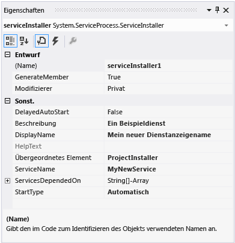
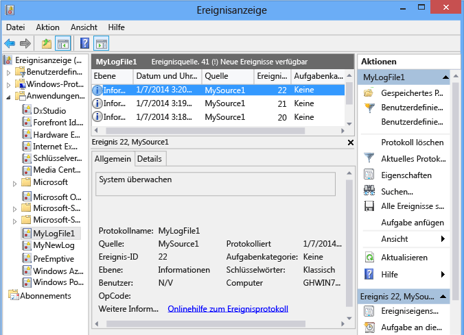

# <a name="walkthrough-creating-a-windows-service-application-in-the-component-designer"></a>Exemplarische Vorgehensweise: Erstellen einer Windows-Dienstanwendung im Komponenten-Designer
In diesem Artikel wird beschrieben, wie Sie eine einfache Windows-Dienstanwendung in Visual Studio erstellen, die Meldungen in ein Ereignisprotokoll schreibt. Hier werden die grundlegenden Schritte beschrieben, die Sie zum Erstellen und Verwenden Ihres Dienstes:  
  
1.  [Erstellen eines Diensts](#BK_CreateProject) , indem Sie die Projektvorlage **Windows-Dienst** verwenden und konfigurieren. Mit dieser Vorlage wird eine Klasse erstellt, die aus <xref:System.ServiceProcess.ServiceBase?displayProperty=nameWithType> geerbt wird. Außerdem wird ein Großteil des grundlegenden Dienstcodes geschrieben, z. B. der Code zum Starten des Diensts.  
  
2.  [Hinzufügen von Features zum Dienst](#BK_WriteCode) für die Prozeduren <xref:System.ServiceProcess.ServiceBase.OnStart%2A> und <xref:System.ServiceProcess.ServiceBase.OnStop%2A> , und überschreiben Sie alle anderen Methoden, die Sie neu definieren möchten.  
  
3.  [Einstellung des Dienststatus](#BK_SetStatus). Standardmäßig umfassen Dienste, die mit <xref:System.ServiceProcess.ServiceBase?displayProperty=nameWithType> erstellt werden, nur eine Teilmenge der verfügbaren Status-Markierungen. Wenn Ihr Dienst sehr lange zum Starten, Anhalten oder Beenden braucht, können Sie die Statuswerte, wie Start ausstehend oder Stopp ausstehend, implementieren, um anzugeben, dass die Funktion für einen Arbeitsgang aktiv ist.  
  
4.  [Hinzufügen von Installern zum Dienst](#BK_AddInstallers) für Ihre Dienstanwendung.  
  
5.  (Optional) [Einstellung der Startparameter](#BK_StartupParameters), geben Sie Standard-Startargumente an, und bieten Sie Benutzern die Möglichkeit, die Standardeinstellungen beim manuellen Starten des Diensts außer Kraft zu setzen.  
  
6.  [Erstellen des Dienstes](#BK_Build).  
  
7.  [Installieren des Dienstes](#BK_Install) auf dem lokalen Computer.  
  
8.  Greifen Sie auf den Windows Service Control Manager zu und [Starten und Ausführen des Dienstes](#BK_StartService).  
  
9. [Ein Windowsdienst wird deinstalliert...](#BK_Uninstall).  
  
> [!WARNING]
>  In der Express Edition von Visual Studio ist die Windows Services-Projektvorlage, die für diese exemplarische Vorgehensweise erforderlich ist, nicht verfügbar.  
  
 [!INCLUDE[note_settings_general](../../../includes/note-settings-general-md.md)]  
  
<a name="BK_CreateProject"></a>   
## <a name="creating-a-service"></a>Erstellen eines Diensts  
 Erstellen Sie zunächst das Projekt, und legen Sie die Werte fest, die für die korrekte Funktion des Diensts erforderlich sind.  
  
#### <a name="to-create-and-configure-your-service"></a>So erstellen und konfigurieren Sie einen Dienst  
  
1.  Wählen Sie in der Visual Studio-Menüleiste **Datei**, **Neu**und **Projekt**aus.  
  
     Das Dialogfeld **Neues Projekt** wird angezeigt.  
  
2.  Wählen Sie **Windows-Dienst**in der Liste der Projektvorlagen für Visual Basic oder Visual C# aus, und nennen Sie das Projekt **MyNewService**. Klicken Sie auf **OK**.  
  
     Die Projektvorlage fügt automatisch die Komponentenklasse `Service1` hinzu, die von <xref:System.ServiceProcess.ServiceBase?displayProperty=nameWithType> erbt.  
  
3.  Im Menü **Bearbeiten** wählen Sie **Suchen und Ersetzen**, **In Dateien suchen** (Tastatur: STRG+UMSCHALT+F). Ersetzen Sie alle Vorkommen von `Service1` durch `MyNewService`. Instanzen finden Sie im Service1.cs Program.cs und Service1.Designer.cs (oder ihre Entsprechungen von VB).  
  
4.  Legen Sie im Fenster **Eigenschaften** für **Service1.cs [Entwurf]** oder **Service1.vb [Entwurf]** den <xref:System.ServiceProcess.ServiceBase.ServiceName%2A> und die **(Name)** -Eigenschaft für `Service1` auf **MyNewService**fest, wenn dieser noch nicht festgelegt ist.  
  
5.  Benennen Sie im Projektmappen-Explorer **Service1.cs** in **MyNewService.cs**oder **Service1.vb** in **MyNewService.vb**um.  
  
<a name="BK_WriteCode"></a>   
## <a name="adding-features-to-the-service"></a>Hinzufügen von Features zum Dienst  
 In diesem Abschnitt fügen Sie dem Windows-Dienst ein benutzerdefiniertes Ereignisprotokoll hinzu. Ereignisprotokolle sind Windows-Diensten in keiner Weise zugeordnet. Hier wird die <xref:System.Diagnostics.EventLog> -Komponente als Beispiel für die Art der Komponente verwendet, die Sie einem Windows-Dienst hinzufügen können.  
  
#### <a name="to-add-custom-event-log-functionality-to-your-service"></a>So fügen Sie dem Dienst eine benutzerdefinierte Ereignisprotokollfunktion hinzu  
  
1.  Öffnen Sie im **Projektmappen-Explorer**das Kontextmenü für **MyNewService.cs** oder **MyNewService.vb**, und wählen Sie dann **Designer anzeigen**aus.  
  
2.  Ziehen Sie im **Werkzeugkasten** aus dem Abschnitt **Komponenten**eine <xref:System.Diagnostics.EventLog> -Komponente in den Designer.  
  
3.  Öffnen Sie im **Projektmappen-Explorer**das Kontextmenü für **MyNewService.cs** oder **MyNewService.vb**, und wählen Sie dann **Code anzeigen**aus.  
  
4.  Fügen Sie eine Deklaration für das **EventLog** -Objekt in der `MyNewService` -Klasse direkt nach der Zeile hinzu, die die `components` -Variable deklariert:  
  
     [!code-csharp[VbRadconService#16](../../../samples/snippets/csharp/VS_Snippets_VBCSharp/VbRadconService/CS/MyNewService.cs#16)]
     [!code-vb[VbRadconService#16](../../../samples/snippets/visualbasic/VS_Snippets_VBCSharp/VbRadconService/VB/MyNewService.vb#16)]  
  
5.  Fügen Sie den Konstruktor hinzu oder bearbeiten Sie ihn, um ein benutzerdefiniertes Ereignisprotokoll zu definieren.  
  
     [!code-csharp[VbRadconService#2](../../../samples/snippets/csharp/VS_Snippets_VBCSharp/VbRadconService/CS/MyNewService.cs#2)]
     [!code-vb[VbRadconService#2](../../../samples/snippets/visualbasic/VS_Snippets_VBCSharp/VbRadconService/VB/MyNewService.vb#2)]  
  
#### <a name="to-define-what-occurs-when-the-service-starts"></a>So legen Sie fest, was beim Starten des Diensts ausgeführt wird  
  
-   Suchen Sie im Code-Editor die <xref:System.ServiceProcess.ServiceBase.OnStart%2A> -Methode, die beim Erstellen des Projekts automatisch überschrieben wurde, und ersetzen Sie den Code durch Folgendes. Dadurch wird ein Eintrag in das Ereignisprotokoll beim Starten des Diensts eingefügt:  
  
     [!code-csharp[VbRadconService#3](../../../samples/snippets/csharp/VS_Snippets_VBCSharp/VbRadconService/CS/MyNewService.cs#3)]
     [!code-vb[VbRadconService#3](../../../samples/snippets/visualbasic/VS_Snippets_VBCSharp/VbRadconService/VB/MyNewService.vb#3)]  
  
     Eine Dienstanwendung soll eine lange Laufzeit haben, damit sie in der Regel etwas abfragt oder etwas im System überwacht. Die Überwachung wird in der <xref:System.ServiceProcess.ServiceBase.OnStart%2A> -Methode eingerichtet. Allerdings erfolgt die Überwachung jedoch nicht durch <xref:System.ServiceProcess.ServiceBase.OnStart%2A> . Die <xref:System.ServiceProcess.ServiceBase.OnStart%2A> -Methode muss zum Betriebssystem zurückkehren, sobald die Ausführung des Dienstes begonnen hat. Sie darf keine Endlosschleife oder Blöcke ausführen. Wenn Sie einen einfachen Abrufmechanismus einrichten, können Sie die Komponente <xref:System.Timers.Timer?displayProperty=nameWithType> wie folgt verwenden: Klicken Sie In der Methode <xref:System.ServiceProcess.ServiceBase.OnStart%2A>, legen Sie Parameter in der Komponente fest, und setzen Sie dann die Eigenschaft <xref:System.Timers.Timer.Enabled%2A>auf `true`. Der Zeitgeber löst dann regelmäßig zu der Zeit Ereignisse im Code aus, zu der der Dienst seine Überwachung ausführen könnte. Sie können hierfür den folgenden Code verwenden:  
  
    ```csharp  
    // Set up a timer to trigger every minute.  
    System.Timers.Timer timer = new System.Timers.Timer();  
    timer.Interval = 60000; // 60 seconds  
    timer.Elapsed += new System.Timers.ElapsedEventHandler(this.OnTimer);  
    timer.Start();  
    ```  
  
    ```vb  
    ' Set up a timer to trigger every minute.  
    Dim timer As System.Timers.Timer = New System.Timers.Timer()  
    timer.Interval = 60000 ' 60 seconds  
    AddHandler timer.Elapsed, AddressOf Me.OnTimer  
    timer.Start()  
    ```  
     Fügen Sie der Klasse eine Membervariable hinzu. Sie enthält den Bezeichner des nächsten Ereignisses, das in das Ereignisprotokoll geschrieben werden soll.

    ```csharp
    private int eventId = 1;
    ```

    ```vb
    Private eventId As Integer = 1
    ```

     Fügen Sie Code zum Bearbeiten des Zeitgeberereignisses hinzu:  
  
    ```csharp  
    public void OnTimer(object sender, System.Timers.ElapsedEventArgs args)  
    {  
        // TODO: Insert monitoring activities here.  
        eventLog1.WriteEntry("Monitoring the System", EventLogEntryType.Information, eventId++);  
    }  
    ```  
  
    ```vb  
    Private Sub OnTimer(sender As Object, e As Timers.ElapsedEventArgs)  
        ' TODO: Insert monitoring activities here.  
        eventLog1.WriteEntry("Monitoring the System", EventLogEntryType.Information, eventId)  
        eventId = eventId + 1  
    End Sub  
    ```  
  
     Möglicherweise möchten Sie Aufgaben mit Arbeitsthreads im Hintergrund statt Ihre Arbeit auf der Haupt-Thread ausführen. Ein Beispiel hierfür finden Sie unter der <xref:System.ServiceProcess.ServiceBase?displayProperty=nameWithType>-Referenzseite.  
  
#### <a name="to-define-what-occurs-when-the-service-is-stopped"></a>So legen Sie fest, was ausgeführt wird, wenn der Dienst beendet wurde  
  
-   Ersetzen Sie den Code für die <xref:System.ServiceProcess.ServiceBase.OnStop%2A> -Methode durch Folgendes: Dadurch wird ein Eintrag in das Ereignisprotokoll beim Starten des Diensts angehalten:  
  
     [!code-csharp[VbRadconService#4](../../../samples/snippets/csharp/VS_Snippets_VBCSharp/VbRadconService/CS/MyNewService.cs#4)]
     [!code-vb[VbRadconService#4](../../../samples/snippets/visualbasic/VS_Snippets_VBCSharp/VbRadconService/VB/MyNewService.vb#4)]  
  
 Im nächsten Abschnitt können Sie die Methoden <xref:System.ServiceProcess.ServiceBase.OnPause%2A>, <xref:System.ServiceProcess.ServiceBase.OnContinue%2A>, und <xref:System.ServiceProcess.ServiceBase.OnShutdown%2A> überschreiben, um zusätzliche Verarbeitungsschritte für die Komponente zu definieren.  
  
#### <a name="to-define-other-actions-for-the-service"></a>So definieren Sie weitere Aktionen für den Dienst  
  
-   Lokalisieren Sie die betreffende Methode, die Sie bearbeiten möchten, und überschreiben sie, um zu definieren, was ausgeführt werden soll.  
  
     Im folgenden Codebeispiel wird veranschaulicht, wie die <xref:System.ServiceProcess.ServiceBase.OnContinue%2A> -Methode überschrieben wird.  
  
     [!code-csharp[VbRadconService#5](../../../samples/snippets/csharp/VS_Snippets_VBCSharp/VbRadconService/CS/MyNewService.cs#5)]
     [!code-vb[VbRadconService#5](../../../samples/snippets/visualbasic/VS_Snippets_VBCSharp/VbRadconService/VB/MyNewService.vb#5)]  
  
 Einige benutzerdefinierte Aktionen müssen eintreten, wenn ein Windows-Dienst von der <xref:System.Configuration.Install.Installer> Klasse installiert wird. Visual Studio kann diese Installationsprogramme speziell für einen Windows-Dienst erstellen und sie dem Projekt hinzufügen.  
  
<a name="BK_SetStatus"></a>   
## <a name="setting-service-status"></a>Einstellung des Dienststatus  
 Dienste melden ihren Status mit dem Dienststeuerungs-Manager, damit Benutzer erkennen können, ob ein Dienst ordnungsgemäß ausgeführt wird. Dienste, die von standardmäßig von <xref:System.ServiceProcess.ServiceBase> übernommen werden, melden eine begrenzte Anzahl von Statuseinstellungen, darunter Beendet, Angehalten und Werden ausgeführt. Wenn es etwas länger dauert, bis ein Dienst startet, kann es hilfreich sein, einen Status Start ausstehend zu melden. Sie können auch die Statuseinstellungen Start ausstehend und Stopp ausstehend durch Hinzufügen von Code implementieren, der in Windows die Funktion [SetServiceStatus](/windows/desktop/api/winsvc/nf-winsvc-setservicestatus) aufruft.  
  
#### <a name="to-implement-service-pending-status"></a>Für die Implementierung des Status Service ausstehend  
  
1.  Fügen Sie eine `using`-Anweisung oder `Imports`-Meldung an die <xref:System.Runtime.InteropServices?displayProperty=nameWithType> -Namespace in der Datei MyNewService.cs oder MyNewService.vb hinzu:  
  
    ```csharp  
    using System.Runtime.InteropServices;  
    ```  
  
    ```vb  
    Imports System.Runtime.InteropServices  
    ```  
  
2.  Fügen Sie folgenden Code zum MyNewService.cs hinzu, um die `ServiceState` Werte zu deklarieren und um eine Struktur für den Status hinzuzufügen, die Sie in einem Plattformaufruf verwenden:  
  
    ```csharp  
    public enum ServiceState  
      {  
          SERVICE_STOPPED = 0x00000001,  
          SERVICE_START_PENDING = 0x00000002,  
          SERVICE_STOP_PENDING = 0x00000003,  
          SERVICE_RUNNING = 0x00000004,  
          SERVICE_CONTINUE_PENDING = 0x00000005,  
          SERVICE_PAUSE_PENDING = 0x00000006,  
          SERVICE_PAUSED = 0x00000007,  
      }  
  
      [StructLayout(LayoutKind.Sequential)]  
      public struct ServiceStatus  
      {  
          public int dwServiceType;  
          public ServiceState dwCurrentState;  
          public int dwControlsAccepted;  
          public int dwWin32ExitCode;  
          public int dwServiceSpecificExitCode;  
          public int dwCheckPoint;  
          public int dwWaitHint;  
      };  
    ```  
  
    ```vb  
    Public Enum ServiceState  
        SERVICE_STOPPED = 1  
        SERVICE_START_PENDING = 2  
        SERVICE_STOP_PENDING = 3  
        SERVICE_RUNNING = 4  
        SERVICE_CONTINUE_PENDING = 5  
        SERVICE_PAUSE_PENDING = 6  
        SERVICE_PAUSED = 7  
    End Enum  
  
    <StructLayout(LayoutKind.Sequential)>  
    Public Structure ServiceStatus  
        Public dwServiceType As Long  
        Public dwCurrentState As ServiceState  
        Public dwControlsAccepted As Long  
        Public dwWin32ExitCode As Long  
        Public dwServiceSpecificExitCode As Long  
        Public dwCheckPoint As Long  
        Public dwWaitHint As Long  
    End Structure  
    ```  
  
3.  Deklarieren Sie jetzt in der `MyNewService`-Klasse die Funktion [SetServiceStatus](/windows/desktop/api/winsvc/nf-winsvc-setservicestatus) durch einen Plattformaufruf:  
  
    ```csharp  
    [DllImport("advapi32.dll", SetLastError=true)]  
            private static extern bool SetServiceStatus(IntPtr handle, ref ServiceStatus serviceStatus);  
    ```  
  
    ```vb  
    Declare Auto Function SetServiceStatus Lib "advapi32.dll" (ByVal handle As IntPtr, ByRef serviceStatus As ServiceStatus) As Boolean  
    ```  
  
4.  Um den Status Start ausstehend zu implementieren, fügen Sie den folgenden Code am Anfang der <xref:System.ServiceProcess.ServiceBase.OnStart%2A> Methode hinzu:  
  
    ```csharp  
    // Update the service state to Start Pending.  
    ServiceStatus serviceStatus = new ServiceStatus();  
    serviceStatus.dwCurrentState = ServiceState.SERVICE_START_PENDING;  
    serviceStatus.dwWaitHint = 100000;  
    SetServiceStatus(this.ServiceHandle, ref serviceStatus);  
    ```  
  
    ```vb  
    ' Update the service state to Start Pending.  
    Dim serviceStatus As ServiceStatus = New ServiceStatus()  
    serviceStatus.dwCurrentState = ServiceState.SERVICE_START_PENDING  
    serviceStatus.dwWaitHint = 100000  
    SetServiceStatus(Me.ServiceHandle, serviceStatus)  
    ```  
  
5.  Fügen Sie den Code hinzu, um den Status Wird ausgeführt am Ende der <xref:System.ServiceProcess.ServiceBase.OnStart%2A> -Methode festzulegen.  
  
    ```csharp
    // Update the service state to Running.  
    serviceStatus.dwCurrentState = ServiceState.SERVICE_RUNNING;  
    SetServiceStatus(this.ServiceHandle, ref serviceStatus);  
    ```  
  
    ```vb  
    ' Update the service state to Running.  
    serviceStatus.dwCurrentState = ServiceState.SERVICE_RUNNING  
    SetServiceStatus(Me.ServiceHandle, serviceStatus)  
    ```  
  
6.  (Optional) Wiederholen Sie diesen Vorgang für die <xref:System.ServiceProcess.ServiceBase.OnStop%2A> Methode.  
  
> [!CAUTION]
>  Das Dialogfeld [Dienststeuerungs-Manager](/windows/desktop/Services/service-control-manager) verwendet die Member `dwWaitHint` und `dwCheckpoint` der [SERVICE_STATUS-Struktur](/windows/desktop/api/winsvc/ns-winsvc-_service_status), um zu bestimmen, wie lange bis zum Starten oder Herunterfahren eines Windows-Diensts gewartet werden muss. Wenn Ihre Methoden <xref:System.ServiceProcess.ServiceBase.OnStart%2A> und <xref:System.ServiceProcess.ServiceBase.OnStop%2A> eine lange Ausführungszeit haben, kann Ihr Dienst durch das erneute Aufrufen von [SetServiceStatus](/windows/desktop/api/winsvc/nf-winsvc-setservicestatus) mit einem erhöhten `dwCheckPoint`-Wert mehr Zeit anfordern.  
  
<a name="BK_AddInstallers"></a>   
## <a name="adding-installers-to-the-service"></a>Hinzufügen von Installern zum Dienst  
 Bevor Sie einen Windows-Dienst ausführen können, müssen Sie ihn bei der Installation im Dienststeuerungs-Manager registrieren. Sie können Installationsprogramme dem Projekt hinzufügen, die die Registrierungsdetails behandelt.  
  
#### <a name="to-create-the-installers-for-your-service"></a>So erstellen Sie die Installationsprogramme für den Dienst  
  
1.  Öffnen Sie im **Projektmappen-Explorer**das Kontextmenü für **MyNewService.cs** oder **MyNewService.vb**, und wählen Sie dann **Designer anzeigen**aus.  
  
2.  Klicken Sie auf den Hintergrund des Designers, um den Dienst selbst, nicht Elemente seines Inhalts, zu markieren.  
  
3.  Öffnen Sie das Kontextmenü für das Designer-Fenster (wenn Sie ein Zeigegerät verwenden, rechtsklicken Sie in das Fenster) und wählen Sie dann **Installer hinzufügen**.  
  
     Standardmäßig wird dem Projekt eine Komponentenklasse mit zwei Installationsprogrammen hinzugefügt. Die Komponente erhält den Namen **ProjectInstaller**; die darin enthaltenen Installationsprogramme sind zum einen das Installationsprogramm für den Dienst und zum andern das Installationsprogramm für den zugeordneten Prozess des Diensts.  
  
4.  Klicken Sie in der Ansicht **Entwurf** für **ProjectInstaller**auf **ServiceInstaller1** , wenn es sich um ein Visual Basic-Projekt handelt, bzw. auf **serviceInstaller1** , wenn es sich um ein Visual C#-Projekt handelt.  
  
5.  Vergewissern Sie sich im Fenster **Eigenschaften** , dass die <xref:System.ServiceProcess.ServiceInstaller.ServiceName%2A> -Eigenschaft auf **MyNewService**festgelegt ist.  
  
6.  Legen Sie die **Beschreibung** -Eigenschaft auf Text, wie z. B. "Ein Beispieldienst" fest. Dieser Text wird im Fenster Dienste angezeigt und hilft dem Benutzer den Dienst zu identifizieren, und zu verstehen, wofür er verwendet wird.  
  
7.  Legen Sie die <xref:System.ServiceProcess.ServiceInstaller.DisplayName%2A> -Eigenschaft auf den Text fest, der im Fenster Dienste in der Spalte **Name** angezeigt werden soll. Beispielsweise können Sie "MyNewService Display Name" eingeben. Dieser Name kann sich von der <xref:System.ServiceProcess.ServiceInstaller.ServiceName%2A> -Eigenschaft unterscheidet, die dem Namen entspricht, der vom System verwendet wird (z. B. bei Verwendung des `net start` -Befehls zum Starten des Dienstes).  
  
8.  Legen Sie die <xref:System.ServiceProcess.ServiceInstaller.StartType%2A>-Eigenschaft auf <xref:System.ServiceProcess.ServiceStartMode.Automatic> fest.  
  
       
  
9. Klicken Sie im Designer auf **ServiceProcessInstaller1** , wenn es sich um ein Visual Basic#-Projekt handelt, bzw. auf **serviceProcessInstaller1** , wenn es sich um ein Visual Basic-Projekt handelt. Legen Sie die <xref:System.ServiceProcess.ServiceProcessInstaller.Account%2A>-Eigenschaft auf <xref:System.ServiceProcess.ServiceAccount.LocalSystem> fest. Dadurch wird der Dienst installiert und auf einem lokalen Dienstkonto ausgeführt.  
  
    > [!IMPORTANT]
    >  Das Konto <xref:System.ServiceProcess.ServiceAccount.LocalSystem> verfügt über ein breites Berechtigungsspektrum, einschließlich der Berechtigung zum Schreiben in das Ereignisprotokoll. Bei der Verwendung dieses Kontos ist allerdings Vorsicht geboten, da sich dadurch das Risiko von Malware-Angriffen erhöhen kann. Für andere Aufgaben sollten Sie das Konto <xref:System.ServiceProcess.ServiceAccount.LocalService> verwenden, das auf dem lokalen Computer als Benutzer ohne Berechtigungen fungiert. Remoteservern werden anonyme Anmeldeinformationen übergeben. Dieses Beispiel schlägt fehl, wenn Sie versuchen, das <xref:System.ServiceProcess.ServiceAccount.LocalService>-Konto zu verwenden, da zum Schreiben in das Ereignisprotokoll eine Genehmigung benötigt wird.  
  
     Weitere Informationen zu Installern finden Sie unter [How to: Add Installers to Your Service Application](../../../docs/framework/windows-services/how-to-add-installers-to-your-service-application.md).  
  
<a name="BK_StartupParameters"></a>   
## <a name="set-startup-parameters"></a>Einstellung der Startparameter  
 Ein Windows-Dienst akzeptiert wie jede andere ausführbare Datei Befehlszeilenargumente oder Startparameter. Wenn Sie einen Code zum Startparameterprozess hinzufügen, können Benutzer den Dienst mithilfe des Fensters "Dienste" in der Windows-Systemsteuerung mit ihren eigenen benutzerdefinierten Startparametern starten. Diese Startparameter werden jedoch nicht beim nächsten Start des Dienst beibehalten. Um Startparameter dauerhaft festzulegen, können Sie diese in der Registrierung festlegen, wie in diesem Verfahren dargestellt.  
  
> [!NOTE]
>  Bevor Sie sich entscheiden, die Startparameter hinzuzufügen, ziehen Sie in Betracht, ob dies die beste Möglichkeit für die Übertragung von Informationen an Ihren Dienst ist. Obwohl Startparameter einfach zu verwenden und zu analysieren sind, und sie Benutzer sie leicht überschreiben können, sind sie möglicherweise ohne die Dokumentation schwerer zu erkennen und zu verwenden. In der Regel, wenn der Dienst mehr als nur ein paar Startparameter erfordert, sollten Sie stattdessen die Verwendung des Verzeichnisses oder einer Konfigurationsdatei erwägen. Jeder Windows-Dienst ist ein Eintrag im Verzeichnis unter HKLM\System\CurrentControlSet\services. Gemäß dem Service-Schlüssel können Sie den Teilschlüssel **Parameter** zum Speichern von Informationen verwenden, auf die Ihr Dienst zugreifen kann. Sie können Konfigurationsdateien für einen Windows-Dienst genauso wie für andere Arten von Programmen verwenden. Beispielcode finden Sie unter <xref:System.Configuration.ConfigurationManager.AppSettings%2A>.  
  
#### <a name="adding-startup-parameters"></a>Hinzufügen von Startparametern  
  
1.  In der `Main` -Methode in Program.cs in MyNewService.Designer.vb fügen Sie ein Argument für die Befehlszeile hinzu:  
  
```csharp  
static void Main(string[] args)
{
    ServiceBase[] ServicesToRun = new ServiceBase[] { new MyNewService(args) };
    ServiceBase.Run(ServicesToRun);
}
```  
  
```vb
Shared Sub Main(ByVal cmdArgs() As String)
    Dim ServicesToRun() As System.ServiceProcess.ServiceBase = New System.ServiceProcess.ServiceBase() {New MyNewServiceVB(cmdArgs)}
    System.ServiceProcess.ServiceBase.Run(ServicesToRun)
End Sub
```  
  
2.  Ändern Sie den `MyNewService` -Konstruktor wie folgt:  
  
```csharp  
public MyNewService(string[] args)
{
    InitializeComponent();
    string eventSourceName = "MySource";
    string logName = "MyNewLog";
    if (args.Count() > 0) 
    {
        eventSourceName = args[0];
    }
    if (args.Count() > 1)
    {
        logName = args[1];
    }
    eventLog1 = new System.Diagnostics.EventLog();
    if (!System.Diagnostics.EventLog.SourceExists(eventSourceName))
    {
        System.Diagnostics.EventLog.CreateEventSource(eventSourceName, logName);
    }
    eventLog1.Source = eventSourceName;
    eventLog1.Log = logName;        
}
```  
  
```vb  
Public Sub New(ByVal cmdArgs() As String)
    InitializeComponent()
    Dim eventSourceName As String = "MySource"
    Dim logName As String = "MyNewLog"
    If (cmdArgs.Count() > 0) Then
        eventSourceName = cmdArgs(0)
    End If
    If (cmdArgs.Count() > 1) Then
        logName = cmdArgs(1)
    End If
    eventLog1 = New System.Diagnostics.EventLog()
    If (Not System.Diagnostics.EventLog.SourceExists(eventSourceName)) Then
        System.Diagnostics.EventLog.CreateEventSource(eventSourceName, logName)
    End If
    eventLog1.Source = eventSourceName
    eventLog1.Log = logName
End Sub  
```  
  
Dieser Code legt die Ereignisquelle und den Protokollnamen gemäß der angegebenen Startparameter fest oder verwendet Standardwerte, wenn keine Argumente angegeben werden.  
  
3. Um Befehlszeilenargumente anzugeben, fügen Sie den folgenden Code zu der `ProjectInstaller` -Klasse in ProjectInstaller.cs oder ProjectInstaller.vb hinzu:  
  
```csharp  
protected override void OnBeforeInstall(IDictionary savedState)
{
    string parameter = "MySource1\" \"MyLogFile1";
    Context.Parameters["assemblypath"] = "\"" + Context.Parameters["assemblypath"] + "\" \"" + parameter + "\"";
    base.OnBeforeInstall(savedState);
}
```

```vb  
Protected Overrides Sub OnBeforeInstall(ByVal savedState As IDictionary)
    Dim parameter As String = "MySource1"" ""MyLogFile1"
    Context.Parameters("assemblypath") = """" + Context.Parameters("assemblypath") + """ """ + parameter + """"
    MyBase.OnBeforeInstall(savedState)
End Sub  
```  
  
Dieser Code ändert den **ImagePath** -Registrierungsschlüssel, der in der Regel den vollständigen Pfad der ausführbaren Datei für den Windows-Dienst enthält, indem die Standardwerte für die Parameter hinzugefügt werden. Die Anführungszeichen rund um den Pfad (und um jeden einzelnen Parameter) sind erforderlich, um den Dienst korrekt zu starten. Um die Startparameter für diesen Windows-Dienst zu ändern, können Benutzer die Parameter ändern, die im **ImagePath** -Registrierungsschlüssel angegeben sind, obwohl es besser wäre, ihn programmgesteuert zu ändern und die Funktionalität für Benutzer in einer geeigneten Form (z. B. in einem Dienstprogramm Verwaltung oder Konfiguration) verfügbar zu machen.  
  
<a name="BK_Build"></a>   
## <a name="building-the-service"></a>Erstellen des Dienstes  
  
#### <a name="to-build-your-service-project"></a>So erstellen Sie ein Dienstprojekt  
  
1.  Öffnen Sie im **Projektmappen-Explorer**das Kontextmenü für das Projekt, und wählen Sie **Eigenschaften**aus. Die Eigenschaftenseiten für Ihr Projekt werden angezeigt.  
  
2.  Klicken Sie in der Registerkarte Anwendung in der Liste **Startobjekt** auf **MyNewService.Program**.  
  
3.  Im **Projektmappen-Explorer**, öffnen Sie das Kontextmenü für das Projekt und wählen Sie dann **Erstellen** zum Erstellen des Projekts (Tastatur: STRG + UMSCHALT + B).  
  
<a name="BK_Install"></a>   
## <a name="installing-the-service"></a>Installieren des Dienstes  
 Nachdem Sie den Windows-Dienst nun erstellt haben, können Sie ihn installieren. Um einen Windows-Dienst zu installieren, müssen Sie über Administratorberechtigungen für den Computer verfügen, auf dem Sie ihn installieren.  
  
#### <a name="to-install-a-windows-service"></a>So installieren Sie einen Windows-Dienst  
  
1.  Öffnen Sie in Windows 7 und Windows Server die **Entwickler-Eingabeaufforderung** unter **Visual Studio Tools** im **Start** -Menü. In Windows 8 oder Windows 8.1 wählen Sie die Kachel **Visual Studio-Tools** auf dem **Start** -Bildschirm und führen Sie dann die Entwickler-Eingabeaufforderung mit Administratorrechten. (Wenn Sie eine Maus verwenden, rechtsklicken Sie auf **Entwickler-Eingabeaufforderung**und wählen Sie dann **als Administrator ausführen**.)  
  
2.  Navigieren Sie im Eingabeaufforderungsfenster zu dem Ordner, der die Datei Ihre Projektausgabe enthält. Wechseln Sie beispielsweise unter dem Ordner "Eigene Dateien" zu "Visual Studio 2013\Projects\MyNewService\bin\Debug".  
  
3.  Geben Sie folgenden Befehl ein:  
  
    ```  
    installutil.exe MyNewService.exe  
    ```  
  
     Wenn der Dienst erfolgreich installiert ist, wird dies von installutil.exe gemeldet. Wenn das System InstallUtil.exe nicht finden kann, stellen Sie sicher, dass sie auf Ihrem Computer vorhanden ist. Dieses Tool wird mit dem.NET Framework im Ordner `%WINDIR%\Microsoft.NET\Framework[64]\`*Framework_version*installiert. Beispielsweise lautet der Standardpfad für die 32-Bit-Version von der.NET Framework 4, 4.5, 4.5.1 und 4.5.2 `C:\Windows\Microsoft.NET\Framework\v4.0.30319\InstallUtil.exe`.  
  
     Wenn der Prozess „installutil.exe“ Fehler meldet, überprüfen Sie das Installationsprotokoll, um die Gründe zu bestimmen. Standardmäßig befindet sich das Protokoll im gleichen Ordner wie die ausführbare Datei. Bei der Installation kann ein Fehler auftreten, wenn die <xref:System.ComponentModel.RunInstallerAttribute>-Klasse nicht in der `ProjectInstaller`-Klasse vorhanden ist, das Attribut nicht auf `true` festgelegt ist oder die `ProjectInstaller`-Klasse nicht `public` ist.  
  
     Weitere Informationen finden Sie unter [How to: Install and Uninstall Services](../../../docs/framework/windows-services/how-to-install-and-uninstall-services.md).  
  
<a name="BK_StartService"></a>   
## <a name="starting-and-running-the-service"></a>Starten und Ausführen des Dienstes  
  
#### <a name="to-start-and-stop-your-service"></a>So starten und beenden Sie den Dienst  
  
1.  Öffnen Sie in Windows den Bildschirm **Starten** oder das **Start** -Menü, und geben Sie `services.msc`ein.  
  
     **MyNewService** müsste jetzt im Fenster **Dienste** angezeigt werden.  
  
       
  
2.  Im Fenster **Dienste** öffnen Sie das Kontextmenü für den Dienst und wählen Sie dann **Start**.  
  
3.  Öffnen Sie das Kontextmenü für den Dienst und wählen Sie dann **Stopp**aus.  
  
4.  (Optional) An der Befehlszeile können Sie die Befehle `net start``ServiceName` und `net stop``ServiceName` zum Starten und Beenden Ihres Diensts verwenden.  
  
#### <a name="to-verify-the-event-log-output-of-your-service"></a>So überprüfen Sie die Ereignisprotokollausgabe des Diensts  
  
1.  Öffnen Sie in VIsual Studio **Server-Explorer** (Tastatur: STRG+ALT+S) und greifen Sie auf den Knoten **Ereignisprotokolle** für den lokalen Computer zu.  
  
2.  Suchen Sie den Eintrag für **MyNewLog** (oder **MyLogFile1**, wenn Sie das optionale Verfahren verwenden, um Befehlszeilenargumente hinzuzufügen), und erweitern Sie ihn. Sie sehen Einträge für die beiden Aktionen (Start und Stopp), die Ihr Dienst ausgeführt hat.  
  
       
  
<a name="BK_Uninstall"></a>   
## <a name="uninstalling-a-windows-service"></a>Ein Windowsdienst wird deinstalliert...  
  
#### <a name="to-uninstall-your-service"></a>So deinstallieren Sie einen Dienst  
  
1.  Öffnen Sie eine Eingabeaufforderung für Entwickler mit administrativen Anmeldeinformationen.  
  
2.  Navigieren Sie im Eingabeaufforderungsfenster zu dem Ordner, der die Datei Ihre Projektausgabe enthält. Wechseln Sie beispielsweise unter dem Ordner "Eigene Dateien" zu "Visual Studio 2013\Projects\MyNewService\bin\Debug".  
  
3.  Geben Sie folgenden Befehl ein:  
  
    ```  
    installutil.exe /u MyNewService.exe  
    ```  
  
     Wenn der Dienst erfolgreich deinstalliert ist, meldet installutil.exe, dass der Dienst erfolgreich entfernt wurde. Weitere Informationen finden Sie unter [How to: Install and Uninstall Services](../../../docs/framework/windows-services/how-to-install-and-uninstall-services.md).  
  
## <a name="next-steps"></a>Nächste Schritte  
 Sie können ein eigenständiges Setupprogramm erstellen, mit dem andere Ihren Windows-Dienst installieren können, aber es sind zusätzliche Schritte erforderlich. ClickOnce unterstützt Windows-Dienste nicht, deshalb können Sie den Webpublishing-Assistenten nicht verwenden. Sie können eine Vollversion von InstallShield verwenden, die Microsoft nicht bereitstellt. Weitere Informationen zu InstallShield finden Sie unter [InstallShield Limited Edition](/visualstudio/deployment/installshield-limited-edition). Ein Installationsprogramm für einen Windows-Dienst lässt sich auch mit dem [Windows Installer XML-Toolset](https://go.microsoft.com/fwlink/?LinkId=249067) erstellen.  
  
 Sie können eine <xref:System.ServiceProcess.ServiceController> -Komponente verwenden, um Befehle an den von Ihnen installierten Dienst zu senden.  
  
 Sie können ein Installationsprogramm verwenden, um ein Ereignisprotokoll während der Installation statt während der Ausführung der Anwendung zu erstellen. Außerdem wird das Ereignisprotokoll vom Installationsprogramm gelöscht, wenn die Anwendung deinstalliert wird. Weitere Informationen finden Sie auf der Referenzseite <xref:System.Diagnostics.EventLogInstaller> .  
  
## <a name="see-also"></a>Siehe auch  
 [Windows-Dienstanwendungen](../../../docs/framework/windows-services/index.md)  
 [Einführung in Windows-Dienstanwendungen](../../../docs/framework/windows-services/introduction-to-windows-service-applications.md)  
 [Vorgehensweise: Debuggen von Windows-Dienstanwendungen](../../../docs/framework/windows-services/how-to-debug-windows-service-applications.md)  
 [Dienste (Windows)](https://msdn.microsoft.com/library/windows/desktop/ms685141.aspx)
