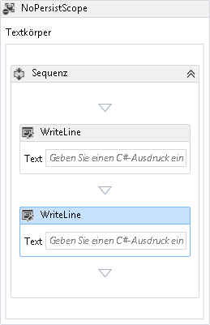

# <a name="c-expressions"></a><span data-ttu-id="f19f0-102">C#-Ausdrücke</span><span class="sxs-lookup"><span data-stu-id="f19f0-102">C# Expressions</span></span>
<span data-ttu-id="f19f0-103">Beginnend mit [!INCLUDE[net_v45](../../../includes/net-v45-md.md)], c#-Ausdrücke werden in Windows Workflow Foundation (WF) unterstützt.</span><span class="sxs-lookup"><span data-stu-id="f19f0-103">Starting with [!INCLUDE[net_v45](../../../includes/net-v45-md.md)], C# expressions are supported in Windows Workflow Foundation (WF).</span></span> <span data-ttu-id="f19f0-104">In Visual Studio 2012, die auf erstellte neue C#-Workflowprojekte [!INCLUDE[net_v45](../../../includes/net-v45-md.md)] verwenden C#-Ausdrücke und Visual Basic-Workflowprojekten Visual Basic-Ausdrücke verwenden.</span><span class="sxs-lookup"><span data-stu-id="f19f0-104">New C# workflow projects created in Visual Studio 2012 that target [!INCLUDE[net_v45](../../../includes/net-v45-md.md)] use C# expressions, and Visual Basic workflow projects use Visual Basic expressions.</span></span> <span data-ttu-id="f19f0-105">Vorhandene [!INCLUDE[netfx40_short](../../../includes/netfx40-short-md.md)]-Workflowprojekte, die Visual Basic-Ausdrücke verwenden, können unabhängig von der Projektsprache zu [!INCLUDE[netfx_current_short](../../../includes/netfx-current-short-md.md)] migieren und werden unterstützt.</span><span class="sxs-lookup"><span data-stu-id="f19f0-105">Existing [!INCLUDE[netfx40_short](../../../includes/netfx40-short-md.md)] workflow projects that use Visual Basic expressions can be migrated to [!INCLUDE[netfx_current_short](../../../includes/netfx-current-short-md.md)] regardless of the project language and are supported.</span></span> <span data-ttu-id="f19f0-106">Dieses Thema bietet eine Übersicht über C#-Ausdrücke in [!INCLUDE[wf1](../../../includes/wf1-md.md)].</span><span class="sxs-lookup"><span data-stu-id="f19f0-106">This topic provides an overview of C# expressions in [!INCLUDE[wf1](../../../includes/wf1-md.md)].</span></span>

## <a name="using-c-expressions-in-workflows"></a><span data-ttu-id="f19f0-107">Verwenden von C#-Ausdrücken in Workflows</span><span class="sxs-lookup"><span data-stu-id="f19f0-107">Using C# expressions in workflows</span></span>

- [<span data-ttu-id="f19f0-108">Mithilfe von c#-Ausdrücke im Workflow-Designer</span><span class="sxs-lookup"><span data-stu-id="f19f0-108">Using C# expressions in the Workflow Designer</span></span>](csharp-expressions.md#WFDesigner)

    - [<span data-ttu-id="f19f0-109">Abwärtskompatibilität Kompatibilität</span><span class="sxs-lookup"><span data-stu-id="f19f0-109">Backwards compatibility</span></span>](csharp-expressions.md#BackwardCompat)

- [<span data-ttu-id="f19f0-110">Verwenden von C#-Ausdrücken in Codeworkflows</span><span class="sxs-lookup"><span data-stu-id="f19f0-110">Using C# expressions in code workflows</span></span>](csharp-expressions.md#CodeWorkflows)

- [<span data-ttu-id="f19f0-111">Verwenden von c#-Ausdrücken in XAML-workflows</span><span class="sxs-lookup"><span data-stu-id="f19f0-111">Using C# expressions in XAML workflows</span></span>](csharp-expressions.md#XamlWorkflows)

    - [<span data-ttu-id="f19f0-112">Kompiliertes Xaml</span><span class="sxs-lookup"><span data-stu-id="f19f0-112">Compiled Xaml</span></span>](csharp-expressions.md#CompiledXaml)

    - [<span data-ttu-id="f19f0-113">Loose Xaml</span><span class="sxs-lookup"><span data-stu-id="f19f0-113">Loose Xaml</span></span>](csharp-expressions.md#LooseXaml)

- [<span data-ttu-id="f19f0-114">Verwenden von C#-Ausdrücken in XAMLX-Workflowdiensten</span><span class="sxs-lookup"><span data-stu-id="f19f0-114">Using C# expressions in XAMLX workflow services</span></span>](csharp-expressions.md#WFServices)

### <a name="WFDesigner"></a> <span data-ttu-id="f19f0-115">Mithilfe von c#-Ausdrücke im Workflow-Designer</span><span class="sxs-lookup"><span data-stu-id="f19f0-115">Using C# expressions in the Workflow Designer</span></span>
 <span data-ttu-id="f19f0-116">Beginnend mit [!INCLUDE[net_v45](../../../includes/net-v45-md.md)], c#-Ausdrücke werden in Windows Workflow Foundation (WF) unterstützt.</span><span class="sxs-lookup"><span data-stu-id="f19f0-116">Starting with [!INCLUDE[net_v45](../../../includes/net-v45-md.md)], C# expressions are supported in Windows Workflow Foundation (WF).</span></span> <span data-ttu-id="f19f0-117">In Visual Studio 2012, die auf erstellte c#-Workflowprojekte [!INCLUDE[net_v45](../../../includes/net-v45-md.md)] c#-Ausdrücke verwenden, während Visual Basic-Workflowprojekten Visual Basic-Ausdrücke verwenden.</span><span class="sxs-lookup"><span data-stu-id="f19f0-117">C# workflow projects created in Visual Studio 2012 that target [!INCLUDE[net_v45](../../../includes/net-v45-md.md)] use C# expressions, while Visual Basic workflow projects use Visual Basic expressions.</span></span> <span data-ttu-id="f19f0-118">Um den gewünschten C#-Ausdruck anzugeben, geben Sie ihn in das Feld mit der Bezeichnung **Geben Sie einen C#-Ausdruck**.</span><span class="sxs-lookup"><span data-stu-id="f19f0-118">To specify the desired C# expression, type it into the box labeled **Enter a C# expression**.</span></span> <span data-ttu-id="f19f0-119">Die Bezeichnung wird im Eigenschaftenfenster angezeigt, wenn die Aktivität im Designer ausgewählt wird, oder in der Aktivität im Workflow-Designer.</span><span class="sxs-lookup"><span data-stu-id="f19f0-119">This label is displayed in the properties window when the activity is selected in the designer, or on the activity in the workflow designer.</span></span> <span data-ttu-id="f19f0-120">Im folgenden Beispiel sind zwei `WriteLine`-Aktivitäten in `Sequence` innerhalb von `NoPersistScope` enthalten.</span><span class="sxs-lookup"><span data-stu-id="f19f0-120">In the following example, two `WriteLine` activities are contained within a `Sequence` inside a `NoPersistScope`.</span></span>

 <span data-ttu-id="f19f0-121"></span><span class="sxs-lookup"><span data-stu-id="f19f0-121"></span></span>

> [!NOTE]
>  <span data-ttu-id="f19f0-122">C#-Ausdrücke werden nur in Visual Studio unterstützt und werden im neu gehosteten Workflow-Designer nicht unterstützt.</span><span class="sxs-lookup"><span data-stu-id="f19f0-122">C# expressions are supported only in Visual Studio, and are not supported in the re-hosted workflow designer.</span></span> <span data-ttu-id="f19f0-123">Weitere Informationen zu neuen WF45-Funktionen im neu gehosteten Designer unterstützt, finden Sie unter [Unterstützung für neue Workflow Foundation 4.5-Features im Workflow-Designer neu gehostet](wf-features-in-the-rehosted-workflow-designer.md).</span><span class="sxs-lookup"><span data-stu-id="f19f0-123">For more information about new WF45 features supported in the re-hosted designer, see [Support for New Workflow Foundation 4.5 Features in the Rehosted Workflow Designer](wf-features-in-the-rehosted-workflow-designer.md).</span></span>

#### <a name="BackwardCompat"></a> <span data-ttu-id="f19f0-124">Abwärtskompatibilität Kompatibilität</span><span class="sxs-lookup"><span data-stu-id="f19f0-124">Backwards compatibility</span></span>
 <span data-ttu-id="f19f0-125">Visual Basic-Ausdrücke in vorhandenen [!INCLUDE[netfx40_short](../../../includes/netfx40-short-md.md)] C#-Workflowprojekten, die zu [!INCLUDE[netfx_current_short](../../../includes/netfx-current-short-md.md)] migriert wurden, werden unterstützt.</span><span class="sxs-lookup"><span data-stu-id="f19f0-125">Visual Basic expressions in existing [!INCLUDE[netfx40_short](../../../includes/netfx40-short-md.md)] C# workflow projects that have been migrated to [!INCLUDE[netfx_current_short](../../../includes/netfx-current-short-md.md)] are supported.</span></span> <span data-ttu-id="f19f0-126">Wenn die Visual Basic-Ausdrücke im Workflow-Designer angezeigt werden, durch der Text des vorhandenen Visual Basic-Ausdruck ersetzt **Wert wurde in XAML festgelegt**, es sei denn, die Visual Basic-Ausdruck gültiger C#-Syntax ist.</span><span class="sxs-lookup"><span data-stu-id="f19f0-126">When the Visual Basic expressions are viewed in the workflow designer, the text of the existing Visual Basic expression is replaced with **Value was set in XAML**, unless the Visual Basic expression is valid C# syntax.</span></span> <span data-ttu-id="f19f0-127">Wenn der Visual Basic-Ausdruck gültiger C#-Syntax entspricht, wird der Ausdruck angezeigt.</span><span class="sxs-lookup"><span data-stu-id="f19f0-127">If the Visual Basic expression is valid C# syntax, then the expression is displayed.</span></span> <span data-ttu-id="f19f0-128">Um die Visual Basic-Ausdrücke auf C# zu aktualisieren, können Sie sie im Workflow-Designer bearbeiten und den entsprechenden C#-Ausdruck angeben.</span><span class="sxs-lookup"><span data-stu-id="f19f0-128">To update the Visual Basic expressions to C#, you can edit them in the workflow designer and specify the equivalent C# expression.</span></span> <span data-ttu-id="f19f0-129">Es ist nicht erforderlich, die Visual Basic-Ausdrücke auf Visual C# zu aktualisieren. Nachdem die Ausdrücke jedoch im Workflow-Designer aktualisiert wurden, werden sie in C# konvertiert und möglicherweise nicht in Visual Basic wiederhergestellt.</span><span class="sxs-lookup"><span data-stu-id="f19f0-129">It is not required to update the Visual Basic expressions to C#, but once the expressions are updated in the workflow designer they are converted to C# and may not be reverted to Visual Basic.</span></span>

### <a name="CodeWorkflows"></a> <span data-ttu-id="f19f0-130">Verwenden von C#-Ausdrücken in Codeworkflows</span><span class="sxs-lookup"><span data-stu-id="f19f0-130">Using C# expressions in code workflows</span></span>
 <span data-ttu-id="f19f0-131">C#-Ausdrücke werden in codebasierten [!INCLUDE[netfx_current_short](../../../includes/netfx-current-short-md.md)]-Workflows unterstützt. Bevor der Workflow aufgerufen werden kann, müssen C#-Ausdrücke jedoch mit <xref:System.Activities.XamlIntegration.TextExpressionCompiler.Compile%2A?displayProperty=nameWithType> kompiliert werden.</span><span class="sxs-lookup"><span data-stu-id="f19f0-131">C# expressions are supported in [!INCLUDE[netfx_current_short](../../../includes/netfx-current-short-md.md)] code based workflows, but before the workflow can be invoked the C# expressions must be compiled using <xref:System.Activities.XamlIntegration.TextExpressionCompiler.Compile%2A?displayProperty=nameWithType>.</span></span> <span data-ttu-id="f19f0-132">Workflowautoren können `CSharpValue` verwenden, um den R-Wert eines Ausdrucks darzustellen, und `CSharpReference`, um den L-Wert eines Ausdrucks darzustellen.</span><span class="sxs-lookup"><span data-stu-id="f19f0-132">Workflow authors can use `CSharpValue` to represent the r-value of an expression, and `CSharpReference` to represent the l-value of an expression.</span></span> <span data-ttu-id="f19f0-133">Im folgenden Beispiel wird ein Workflow mit einer `Assign`-Aktivität und einer `WriteLine`-Aktivität erstellt, die in einer `Sequence`-Aktivität enthalten ist.</span><span class="sxs-lookup"><span data-stu-id="f19f0-133">In the following example, a workflow is created with an `Assign` activity and a `WriteLine` activity contained in a `Sequence` activity.</span></span> <span data-ttu-id="f19f0-134">`CSharpReference` wird für das `To`-Argument von `Assign` angegeben und stellt den L-Wert des Ausdrucks dar.</span><span class="sxs-lookup"><span data-stu-id="f19f0-134">A `CSharpReference` is specified for the `To` argument of the `Assign`, and represents the l-value of the expression.</span></span> <span data-ttu-id="f19f0-135">Ein `CSharpValue` wird für das `Value`-Argument von `Assign` und für das `Text`-Argument von `WriteLine` angegeben und stellt den R-Wert für diese beiden Ausdrücke dar.</span><span class="sxs-lookup"><span data-stu-id="f19f0-135">A `CSharpValue` is specified for the `Value` argument of the `Assign`, and for the `Text` argument of the `WriteLine`, and represents the r-value for those two expressions.</span></span>

```csharp
Variable<int> n = new Variable<int>
{
    Name = "n"
};

Activity wf = new Sequence
{
    Variables = { n },
    Activities =
    {
        new Assign<int>
        {
            To = new CSharpReference<int>("n"),
            Value = new CSharpValue<int>("new Random().Next(1, 101)")
        },
        new WriteLine
        {
            Text = new CSharpValue<string>("\"The number is \" + n")
        }
    }
};

CompileExpressions(wf);

WorkflowInvoker.Invoke(wf);
```

 <span data-ttu-id="f19f0-136">Nachdem der Workflow erstellt wurde, werden die C#-Ausdrücke kompiliert, indem erst die `CompileExpressions`-Hilfsmethode und dann der Workflow aufgerufen wird.</span><span class="sxs-lookup"><span data-stu-id="f19f0-136">After the workflow is constructed, the C# expressions are compiled by calling the `CompileExpressions` helper method and then the workflow is invoked.</span></span> <span data-ttu-id="f19f0-137">Im folgenden Beispiel wird die `CompileExpressions`-Methode verwendet:</span><span class="sxs-lookup"><span data-stu-id="f19f0-137">The following example is the `CompileExpressions` method.</span></span>

```csharp
static void CompileExpressions(Activity activity)
{
    // activityName is the Namespace.Type of the activity that contains the
    // C# expressions.
    string activityName = activity.GetType().ToString();

    // Split activityName into Namespace and Type.Append _CompiledExpressionRoot to the type name
    // to represent the new type that represents the compiled expressions.
    // Take everything after the last . for the type name.
    string activityType = activityName.Split('.').Last() + "_CompiledExpressionRoot";
    // Take everything before the last . for the namespace.
    string activityNamespace = string.Join(".", activityName.Split('.').Reverse().Skip(1).Reverse());

    // Create a TextExpressionCompilerSettings.
    TextExpressionCompilerSettings settings = new TextExpressionCompilerSettings
    {
        Activity = activity,
        Language = "C#",
        ActivityName = activityType,
        ActivityNamespace = activityNamespace,
        RootNamespace = null,
        GenerateAsPartialClass = false,
        AlwaysGenerateSource = true,
        ForImplementation = false
    };

    // Compile the C# expression.
    TextExpressionCompilerResults results =
        new TextExpressionCompiler(settings).Compile();

    // Any compilation errors are contained in the CompilerMessages.
    if (results.HasErrors)
    {
        throw new Exception("Compilation failed.");
    }

    // Create an instance of the new compiled expression type.
    ICompiledExpressionRoot compiledExpressionRoot =
        Activator.CreateInstance(results.ResultType,
            new object[] { activity }) as ICompiledExpressionRoot;

    // Attach it to the activity.
    CompiledExpressionInvoker.SetCompiledExpressionRoot(
        activity, compiledExpressionRoot);
}
```

> [!NOTE]
>  <span data-ttu-id="f19f0-138">Wenn die C# Ausdrücke werden nicht kompiliert werden, eine <xref:System.NotSupportedException> wird ausgelöst, wenn der Workflow mit einer Meldung ähnlich der folgenden aufgerufen wird: `Expression Activity type 'CSharpValue`1" erforderlich, dass der Kompilierung ausgeführt.</span><span class="sxs-lookup"><span data-stu-id="f19f0-138">If the C# expressions are not compiled, a <xref:System.NotSupportedException> is thrown when the workflow is invoked with a message similar to the following: `Expression Activity type 'CSharpValue`1' requires compilation in order to run.</span></span>  <span data-ttu-id="f19f0-139">Stellen Sie sicher, dass der Workflow kompiliert wurde. "</span><span class="sxs-lookup"><span data-stu-id="f19f0-139">Please ensure that the workflow has been compiled.\`</span></span>

 <span data-ttu-id="f19f0-140">Wenn der auf benutzerdefiniertem Code basierende Workflow `DynamicActivity` verwendet, sind einige Änderungen an der `CompileExpressions`-Methode erforderlich, wie im folgenden Codebeispiel gezeigt.</span><span class="sxs-lookup"><span data-stu-id="f19f0-140">If your custom code based workflow uses `DynamicActivity`, then some changes to the `CompileExpressions` method are required, as demonstrated in the following code example.</span></span>

```csharp
static void CompileExpressions(DynamicActivity dynamicActivity)
{
    // activityName is the Namespace.Type of the activity that contains the
    // C# expressions. For Dynamic Activities this can be retrieved using the
    // name property , which must be in the form Namespace.Type.
    string activityName = dynamicActivity.Name;

    // Split activityName into Namespace and Type.Append _CompiledExpressionRoot to the type name
    // to represent the new type that represents the compiled expressions.
    // Take everything after the last . for the type name.
    string activityType = activityName.Split('.').Last() + "_CompiledExpressionRoot";
    // Take everything before the last . for the namespace.
    string activityNamespace = string.Join(".", activityName.Split('.').Reverse().Skip(1).Reverse());

    // Create a TextExpressionCompilerSettings.
    TextExpressionCompilerSettings settings = new TextExpressionCompilerSettings
    {
        Activity = dynamicActivity,
        Language = "C#",
        ActivityName = activityType,
        ActivityNamespace = activityNamespace,
        RootNamespace = null,
        GenerateAsPartialClass = false,
        AlwaysGenerateSource = true,
        ForImplementation = true
    };

    // Compile the C# expression.
    TextExpressionCompilerResults results =
        new TextExpressionCompiler(settings).Compile();

    // Any compilation errors are contained in the CompilerMessages.
    if (results.HasErrors)
    {
        throw new Exception("Compilation failed.");
    }

    // Create an instance of the new compiled expression type.
    ICompiledExpressionRoot compiledExpressionRoot =
        Activator.CreateInstance(results.ResultType,
            new object[] { dynamicActivity }) as ICompiledExpressionRoot;

    // Attach it to the activity.
    CompiledExpressionInvoker.SetCompiledExpressionRootForImplementation(
        dynamicActivity, compiledExpressionRoot);
}
```

 <span data-ttu-id="f19f0-141">Es gibt einige Unterschiede in der `CompileExpressions`-Überladung, die die C#-Ausdrücke in eine dynamische Aktivität kompiliert.</span><span class="sxs-lookup"><span data-stu-id="f19f0-141">There are several differences in the `CompileExpressions` overload that compiles the C# expressions in a dynamic activity.</span></span>

- <span data-ttu-id="f19f0-142">Der Parameter zu `CompileExpressions` ist `DynamicActivity`.</span><span class="sxs-lookup"><span data-stu-id="f19f0-142">The parameter to `CompileExpressions` is a `DynamicActivity`.</span></span>

- <span data-ttu-id="f19f0-143">Typname und Namespace werden mit der `DynamicActivity.Name`-Eigenschaft abgerufen.</span><span class="sxs-lookup"><span data-stu-id="f19f0-143">The type name and namespace are retrieved using the `DynamicActivity.Name` property.</span></span>

- <span data-ttu-id="f19f0-144">Für `TextExpressionCompilerSettings.ForImplementation` ist `true` festgelegt.</span><span class="sxs-lookup"><span data-stu-id="f19f0-144">`TextExpressionCompilerSettings.ForImplementation` is set to `true`.</span></span>

- <span data-ttu-id="f19f0-145">`CompiledExpressionInvoker.SetCompiledExpressionRootForImplementation` wird anstelle von `CompiledExpressionInvoker.SetCompiledExpressionRoot` aufgerufen.</span><span class="sxs-lookup"><span data-stu-id="f19f0-145">`CompiledExpressionInvoker.SetCompiledExpressionRootForImplementation` is called instead of `CompiledExpressionInvoker.SetCompiledExpressionRoot`.</span></span>

 <span data-ttu-id="f19f0-146">Weitere Informationen zum Arbeiten mit Ausdrücken im Code finden Sie unter [Entwickeln von Workflows, Aktivitäten und Ausdrücken mithilfe von imperativem Code](authoring-workflows-activities-and-expressions-using-imperative-code.md).</span><span class="sxs-lookup"><span data-stu-id="f19f0-146">For more information about working with expressions in code, see [Authoring Workflows, Activities, and Expressions Using Imperative Code](authoring-workflows-activities-and-expressions-using-imperative-code.md).</span></span>

### <a name="XamlWorkflows"></a> <span data-ttu-id="f19f0-147">Verwenden von c#-Ausdrücken in XAML-workflows</span><span class="sxs-lookup"><span data-stu-id="f19f0-147">Using C# expressions in XAML workflows</span></span>
 <span data-ttu-id="f19f0-148">C#-Ausdrücke werden in XAML-Workflows unterstützt.</span><span class="sxs-lookup"><span data-stu-id="f19f0-148">C# expressions are supported in XAML workflows.</span></span> <span data-ttu-id="f19f0-149">Kompilierte XAML-Workflows werden in einen Typ kompiliert und Loose XAML-Workflows werden von der Laufzeit geladen und beim Ausführen des Workflows in eine Aktivitätsstruktur kompiliert.</span><span class="sxs-lookup"><span data-stu-id="f19f0-149">Compiled XAML workflows are compiled into a type, and loose XAML workflows are loaded by the runtime and compiled into an activity tree when the workflow is executed.</span></span>

- [<span data-ttu-id="f19f0-150">Kompiliertes Xaml</span><span class="sxs-lookup"><span data-stu-id="f19f0-150">Compiled Xaml</span></span>](csharp-expressions.md#CompiledXaml)

- [<span data-ttu-id="f19f0-151">Loose Xaml</span><span class="sxs-lookup"><span data-stu-id="f19f0-151">Loose Xaml</span></span>](csharp-expressions.md#LooseXaml)

#### <a name="CompiledXaml"></a> <span data-ttu-id="f19f0-152">Kompiliertes Xaml</span><span class="sxs-lookup"><span data-stu-id="f19f0-152">Compiled Xaml</span></span>
 <span data-ttu-id="f19f0-153">C#-Ausdrücke werden in kompilierten XAML-Workflows unterstützt, die als Teil eines C#-Workflowprojekts, das [!INCLUDE[netfx_current_short](../../../includes/netfx-current-short-md.md)] als Zielframework verwendet, in einen Typ kompiliert werden.</span><span class="sxs-lookup"><span data-stu-id="f19f0-153">C# expressions are supported in compiled XAML workflows that are compiled to a type as part of a C# workflow project that targets [!INCLUDE[netfx_current_short](../../../includes/netfx-current-short-md.md)].</span></span> <span data-ttu-id="f19f0-154">Kompilierte XAML ist der Standardtyp der workflowerstellung in Visual Studio und C#-Workflowprojekte erstellt, Visual Studio, die auf [!INCLUDE[netfx_current_short](../../../includes/netfx-current-short-md.md)] c#-Ausdrücke verwenden.</span><span class="sxs-lookup"><span data-stu-id="f19f0-154">Compiled XAML is the default type of workflow authoring in Visual Studio, and C# workflow projects created in Visual Studio that target [!INCLUDE[netfx_current_short](../../../includes/netfx-current-short-md.md)] use C# expressions.</span></span>

#### <a name="LooseXaml"></a> <span data-ttu-id="f19f0-155">Loose Xaml</span><span class="sxs-lookup"><span data-stu-id="f19f0-155">Loose Xaml</span></span>
 <span data-ttu-id="f19f0-156">C#-Ausdrücke werden in Loose XAML-Workflows unterstützt.</span><span class="sxs-lookup"><span data-stu-id="f19f0-156">C# expressions are supported in loose XAML workflows.</span></span> <span data-ttu-id="f19f0-157">Das Workflowhostprogramm, von dem der Loose XAML-Workflow geladen und aufgerufen wird, muss [!INCLUDE[netfx_current_short](../../../includes/netfx-current-short-md.md)] als Zielframework verwenden, und <xref:System.Activities.XamlIntegration.ActivityXamlServicesSettings.CompileExpressions%2A> muss auf `true` festgelegt werden (der Standardwert ist `false`).</span><span class="sxs-lookup"><span data-stu-id="f19f0-157">The workflow host program that loads and invokes the loose XAML workflow must target [!INCLUDE[netfx_current_short](../../../includes/netfx-current-short-md.md)], and <xref:System.Activities.XamlIntegration.ActivityXamlServicesSettings.CompileExpressions%2A> must be set to `true` (the default is `false`).</span></span> <span data-ttu-id="f19f0-158">Zum Festlegen von <xref:System.Activities.XamlIntegration.ActivityXamlServicesSettings.CompileExpressions%2A> auf `true` erstellen Sie eine <xref:System.Activities.XamlIntegration.ActivityXamlServicesSettings>-Instanz, deren <xref:System.Activities.XamlIntegration.ActivityXamlServicesSettings.CompileExpressions%2A>-Eigenschaft auf `true` festgelegt ist, und übergeben sie als Parameter an <xref:System.Activities.XamlIntegration.ActivityXamlServices.Load%2A?displayProperty=nameWithType>.</span><span class="sxs-lookup"><span data-stu-id="f19f0-158">To set <xref:System.Activities.XamlIntegration.ActivityXamlServicesSettings.CompileExpressions%2A> to `true`, create an <xref:System.Activities.XamlIntegration.ActivityXamlServicesSettings> instance with its <xref:System.Activities.XamlIntegration.ActivityXamlServicesSettings.CompileExpressions%2A> property set to `true`, and pass it as a parameter to <xref:System.Activities.XamlIntegration.ActivityXamlServices.Load%2A?displayProperty=nameWithType>.</span></span> <span data-ttu-id="f19f0-159">Wenn `CompileExpressions` ist nicht festgelegt, um `true`, <xref:System.NotSupportedException> mit einer Meldung ähnlich der folgenden ausgelöst: `Expression Activity type 'CSharpValue`1" erforderlich, dass der Kompilierung ausgeführt.</span><span class="sxs-lookup"><span data-stu-id="f19f0-159">If `CompileExpressions` Is not set to `true`, a <xref:System.NotSupportedException> will be thrown with a message similar to the following: `Expression Activity type 'CSharpValue`1' requires compilation in order to run.</span></span>  <span data-ttu-id="f19f0-160">Stellen Sie sicher, dass der Workflow kompiliert wurde. "</span><span class="sxs-lookup"><span data-stu-id="f19f0-160">Please ensure that the workflow has been compiled.\`</span></span>

```csharp
ActivityXamlServicesSettings settings = new ActivityXamlServicesSettings
{
    CompileExpressions = true
};

DynamicActivity<int> wf = ActivityXamlServices.Load(new StringReader(serializedAB), settings) as DynamicActivity<int>;
```

 <span data-ttu-id="f19f0-161">Weitere Informationen zum Arbeiten mit XAML-Workflows finden Sie unter [Serialisieren von Workflows und Aktivitäten in und aus XAML](serializing-workflows-and-activities-to-and-from-xaml.md).</span><span class="sxs-lookup"><span data-stu-id="f19f0-161">For more information about working with XAML workflows, see [Serializing Workflows and Activities to and from XAML](serializing-workflows-and-activities-to-and-from-xaml.md).</span></span>

### <a name="WFServices"></a> <span data-ttu-id="f19f0-162">Verwenden von C#-Ausdrücken in XAMLX-Workflowdiensten</span><span class="sxs-lookup"><span data-stu-id="f19f0-162">Using C# expressions in XAMLX workflow services</span></span>
 <span data-ttu-id="f19f0-163">C#-Ausdrücke werden in XAMLX-Workflowdiensten unterstützt.</span><span class="sxs-lookup"><span data-stu-id="f19f0-163">C# expressions are supported in XAMLX workflow services.</span></span> <span data-ttu-id="f19f0-164">Wenn ein Workflowdienst in IIS oder WAS gehostet ist, sind keine zusätzlichen Schritte erforderlich. Ist der XAML-Workflowdienst jedoch selbst gehostet, müssen die C#-Ausdrücke kompiliert werden.</span><span class="sxs-lookup"><span data-stu-id="f19f0-164">When a workflow service is hosted in IIS or WAS then no additional steps are required, but if the XAML workflow service is self-hosted, then the C# expressions must be compiled.</span></span> <span data-ttu-id="f19f0-165">Um die C#-Ausdrücke in einem selbst gehosteten XAMLX-Workflowdienst zu kompilieren, laden Sie zuerst die XAMLX-Datei in eine `WorkflowService`, und übergeben Sie dann die `Body` von der `WorkflowService` auf die `CompileExpressions` Methode beschrieben, die im vorherigen [mit c# Ausdrücken in Codeworkflows](csharp-expressions.md#CodeWorkflows) Abschnitt.</span><span class="sxs-lookup"><span data-stu-id="f19f0-165">To compile the C# expressions in a self-hosted XAMLX workflow service, first load the XAMLX file into a `WorkflowService`, and then pass the `Body` of the `WorkflowService` to the `CompileExpressions` method described in the previous [Using C# expressions in code workflows](csharp-expressions.md#CodeWorkflows) section.</span></span> <span data-ttu-id="f19f0-166">Im folgenden Beispiel wird ein XAMLX-Workflowdienst geladen, und die C#-Ausdrücke werden kompiliert. Anschließend wird der Workflowdienst geöffnet und wartet auf Anforderungen.</span><span class="sxs-lookup"><span data-stu-id="f19f0-166">In the following example, a XAMLX workflow service is loaded, the C# expressions are compiled, and then the workflow service is opened and waits for requests.</span></span>

```csharp
// Load the XAMLX workflow service.
WorkflowService workflow1 =
    (WorkflowService)XamlServices.Load(xamlxPath);

// Compile the C# expressions in the workflow by passing the Body to CompileExpressions.
CompileExpressions(workflow1.Body);

// Initialize the WorkflowServiceHost.
var host = new WorkflowServiceHost(workflow1, new Uri("http://localhost:8293/Service1.xamlx"));

// Enable Metadata publishing/
ServiceMetadataBehavior smb = new ServiceMetadataBehavior();
smb.HttpGetEnabled = true;
smb.MetadataExporter.PolicyVersion = PolicyVersion.Policy15;
host.Description.Behaviors.Add(smb);

// Open the WorkflowServiceHost and wait for requests.
host.Open();
Console.WriteLine("Press enter to quit");
Console.ReadLine();
```

 <span data-ttu-id="f19f0-167">Wenn die C#-Ausdrücke nicht kompiliert werden, ist der `Open`-Vorgang zwar erfolgreich, der Workflow verursacht beim Aufruf jedoch einen Fehler.</span><span class="sxs-lookup"><span data-stu-id="f19f0-167">If the C# expressions are not compiled, the `Open` operation succeeds but the workflow will fail when it is invoked.</span></span> <span data-ttu-id="f19f0-168">Die folgenden `CompileExpressions` Methode ist identisch mit der Methode aus dem vorherigen [mithilfe von C#-Ausdrücken in Codeworkflows](csharp-expressions.md#CodeWorkflows) Abschnitt.</span><span class="sxs-lookup"><span data-stu-id="f19f0-168">The following `CompileExpressions` method is the same as the method from the previous [Using C# expressions in code workflows](csharp-expressions.md#CodeWorkflows) section.</span></span>

```csharp
static void CompileExpressions(Activity activity)
{
    // activityName is the Namespace.Type of the activity that contains the
    // C# expressions.
    string activityName = activity.GetType().ToString();

    // Split activityName into Namespace and Type.Append _CompiledExpressionRoot to the type name
    // to represent the new type that represents the compiled expressions.
    // Take everything after the last . for the type name.
    string activityType = activityName.Split('.').Last() + "_CompiledExpressionRoot";
    // Take everything before the last . for the namespace.
    string activityNamespace = string.Join(".", activityName.Split('.').Reverse().Skip(1).Reverse());

    // Create a TextExpressionCompilerSettings.
    TextExpressionCompilerSettings settings = new TextExpressionCompilerSettings
    {
        Activity = activity,
        Language = "C#",
        ActivityName = activityType,
        ActivityNamespace = activityNamespace,
        RootNamespace = null,
        GenerateAsPartialClass = false,
        AlwaysGenerateSource = true,
        ForImplementation = false
    };

    // Compile the C# expression.
    TextExpressionCompilerResults results =
        new TextExpressionCompiler(settings).Compile();

    // Any compilation errors are contained in the CompilerMessages.
    if (results.HasErrors)
    {
        throw new Exception("Compilation failed.");
    }

    // Create an instance of the new compiled expression type.
    ICompiledExpressionRoot compiledExpressionRoot =
        Activator.CreateInstance(results.ResultType,
            new object[] { activity }) as ICompiledExpressionRoot;

    // Attach it to the activity.
    CompiledExpressionInvoker.SetCompiledExpressionRoot(
        activity, compiledExpressionRoot);
}
```
