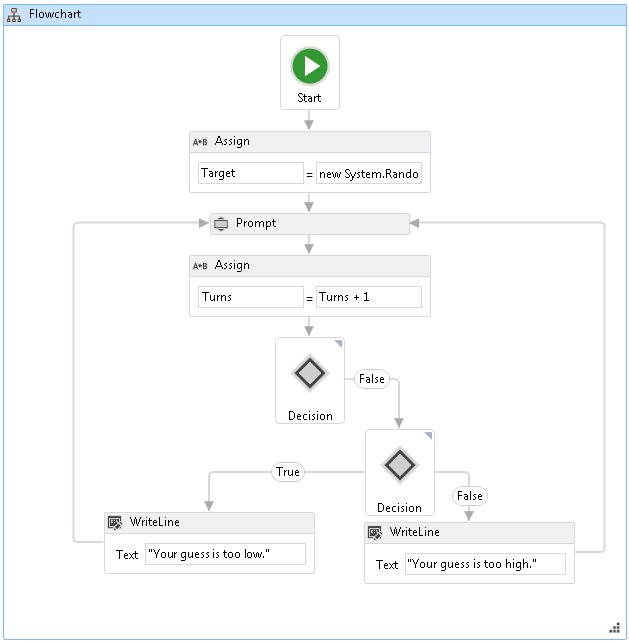

# <a name="how-to-create-a-flowchart-workflow"></a>Vorgehensweise: Erstellen eines Flussdiagrammworkflows
Workflows können aus integrierten Aktivitäten und aus benutzerdefinierten Aktivitäten erstellt werden. Dieses Thema führt Sie durch Erstellen eines Workflows, die sowohl integrierten Aktivitäten, wie z. B. verwendet die <xref:System.Activities.Statements.Flowchart> Aktivität und den benutzerdefinierten Aktivitäten aus dem vorherigen [Vorgehensweise: Erstellen Sie eine Aktivität](../../../docs/framework/windows-workflow-foundation/how-to-create-an-activity.md) Thema. Der Workflow erstellt ein Spiel, das Zahlen errät.  
  
> [!NOTE]
>  Ein Thema im Lernprogramm "Erste Schritte" hängt jeweils von den vorherigen Themen ab. Um dieses Thema abzuschließen, müssen Sie zuerst ausführen [Vorgehensweise: Erstellen Sie eine Aktivität](../../../docs/framework/windows-workflow-foundation/how-to-create-an-activity.md).  
  
> [!NOTE]
>  Eine abgeschlossene Version des Tutorials können Sie im [Windows Workflow Foundation (WF45) Getting Started Tutorial](http://go.microsoft.com/fwlink/?LinkID=248976)herunterladen.  
  
### <a name="to-create-the-workflow"></a>So erstellen Sie den Workflow  
  
1.  Mit der rechten Maustaste **NumberGuessWorkflowActivities** in **Projektmappen-Explorer** , und wählen Sie **hinzufügen**, **neues Element**.  
  
2.  In der **installiert**, **gemeinsame Elemente** Knoten **Workflow**. Wählen Sie **Aktivität** aus der **Workflow** Liste.  
  
3.  Typ `FlowchartNumberGuessWorkflow` in der **Namen** Feld, und klicken Sie auf **hinzufügen**.  
  
4.  Ziehen Sie eine **Flussdiagramm** Aktivität aus der **Flussdiagramm** im Abschnitt der **Toolbox** und legen ihn auf die **Aktivität hier ablegen** Bezeichnung auf die die Entwurfsoberfläche des Workflows.  
  
### <a name="to-create-the-workflow-variables-and-arguments"></a>So erstellen Sie die Workflowvariablen und -argumente  
  
1.  Doppelklicken Sie auf **FlowchartNumberGuessWorkflow.xaml** in **Projektmappen-Explorer** um den Workflow im Designer anzuzeigen, wenn er nicht bereits angezeigt wird.  
  
2.  Klicken Sie auf **Argumente** in der unteren linken Seite im Workflow-Designer zum Anzeigen der **Argumente** Bereich.  
  
3.  Klicken Sie auf **Argument erstellen**.  
  
4.  Typ `MaxNumber` in der **Namen** wählen Sie im **In** aus der **Richtung** Dropdown-Liste **Int32** aus der **Argumenttyp** Dropdown-Liste, und drücken Sie dann die EINGABETASTE, um das Argument zu speichern.  
  
5.  Klicken Sie auf **Argument erstellen**.  
  
6.  Typ `Turns` in der **Namen** Feld, das unterhalb der neu hinzugefügten `MaxNumber` Argument die Option **Out** aus der **Richtung** Dropdown-Liste  **Int32** aus der **Argumenttyp** Dropdown-Liste, und drücken Sie dann die EINGABETASTE.  
  
7.  Klicken Sie auf **Argumente** in der unteren linken Seite des Aktivitätsdesigners zu schließen die **Argumente** Bereich.  
  
8.  Klicken Sie auf **Variablen** in der unteren linken Seite im Workflow-Designer zum Anzeigen der **Variablen** Bereich.  
  
9. Klicken Sie auf **erstellen Variable**.  
  
    > [!TIP]
    >  Wenn kein **Variable erstellen** angezeigt wird, klicken Sie auf die <xref:System.Activities.Statements.Flowchart> Aktivität auf der workflowdesigneroberfläche, um es auszuwählen.  
  
10. Typ `Guess` in der **Namen** wählen Sie im **Int32** aus der **Variablentyp** Dropdown-Liste, und drücken Sie dann die EINGABETASTE, um die Variable zu speichern.  
  
11. Klicken Sie auf **erstellen Variable**.  
  
12. Typ `Target` in der **Namen** wählen Sie im **Int32** aus der **Variablentyp** Dropdown-Liste, und drücken Sie dann die EINGABETASTE, um die Variable zu speichern.  
  
13. Klicken Sie auf **Variablen** in der unteren linken Seite des Aktivitätsdesigners zu schließen die **Variablen** Bereich.  
  
### <a name="to-add-the-workflow-activities"></a>So fügen Sie die Workflowaktivitäten hinzu  
  
1.  Ziehen Sie ein **zuweisen** Aktivität aus der **primitive** Teil der **Toolbox** und zeigen sie auf die **starten** Knoten, die am oberen Rand ist die Flussdiagramm. Wenn die **zuweisen** Aktivität liegt über der **starten** Knoten drei Dreiecke um den **starten** Knoten. Löschen der **zuweisen** Aktivität auf dem Dreieck ab, das direkt unterhalb der **starten** Knoten. Dadurch werden die beiden Elemente miteinander verknüpfen und bezieht sich auf die **zuweisen** Aktivität als erste Aktivität im Flussdiagramm.  
  
    > [!NOTE]
    >  Aktivitäten können auch als Startaktivität im Workflow angegeben werden, indem Sie die Aktivität manuell mit dem Startknoten verknüpfen. Zeigen Sie dazu mit der Maus auf die **starten** Knoten, klicken Sie auf eines der Rechtecke, die angezeigt werden, wenn sich der Mauszeiger die **starten** Knoten, und ziehen Sie die Verbindungslinie auf die gewünschte Aktivität herunter und legen es auf einem der der angezeigten Rechtecke ab. Sie können auch festlegen, und die Aktivität als Startaktivität durch Rechtsklick auf die It und Auswahl **als Startknoten festlegen**.  
  
2.  Typ `Target` in der **auf** Feld und den folgenden Ausdruck in der **Geben Sie eine C#-Ausdruck** oder **VB-Ausdruck eingeben** Feld.  
  
    ```vb  
    New System.Random().Next(1, MaxNumber + 1)  
    ```  
  
    ```csharp  
    new System.Random().Next(1, MaxNumber + 1)  
    ```  
  
    > [!TIP]
    >  Wenn die **Toolbox** Fenster nicht angezeigt wird, wählen Sie **Toolbox** aus der **Ansicht** Menü.  
  
3.  Ziehen Sie eine **Prompt** Aktivität aus der **NumberGuessWorkflowActivities** im Abschnitt der **Toolbox**, legen Sie sie unterhalb der **zuweisen** Aktivität aus dem vorherigen Schritt ab, und verbinden die **Prompt** Aktivität, um die **zuweisen** Aktivität. Es gibt drei Möglichkeiten, die beiden Aktivitäten zu verbinden. Die erste Möglichkeit besteht, um sie zu verbinden, wie Sie löschen die **Prompt** -Aktivität im Workflow. Wie Sie ziehen die **Prompt** Aktivität für den Workflow, zeigen sie auf die **zuweisen** Aktivität, und legen ihn auf einem der vier Dreiecke ab, die angezeigt werden die **Prompt** Aktivität liegt über dem **zuweisen** Aktivität. Die zweite Möglichkeit ist zum Löschen der **Prompt** -Aktivität auf dem Workflow am gewünschten Ort. Klicken Sie dann den Mauszeiger über die **zuweisen** Aktivität, und ziehen Sie eines der Rechtecke, die nach unten, um die **Prompt** Aktivität. Ziehen Sie die Maus, sodass die Verbindungslinie von der **zuweisen** Aktivität eine Verbindung mit einem der Rechtecke der der **Prompt** Aktivität, und lassen Sie die Maustaste los. Der dritte Weg ist vergleichbar mit der ersten Methode, außer dass ziehen die **Prompt** Aktivität aus der **Toolbox**, ziehen Sie es von ihrer Position auf der Workflowentwurfsoberfläche, zeigen sie auf die  **Weisen Sie** Aktivität, und auf einem der angezeigten Dreiecke ablegen.  
  
4.  In der **Fenster "Eigenschaften"** für die **Prompt** -Aktivität `"EnterGuess"` einschließlich der Anführungszeichen in der **BookmarkName** Feld mit dem Eigenschaftswert. Typ `Guess` in der **Ergebnis** Eigenschaft Wert im Feld, und geben Sie den folgenden Ausdruck in der **Text** Eigenschaftenfeld.  
  
    ```vb  
    "Please enter a number between 1 and " & MaxNumber  
    ```  
  
    ```csharp  
    "Please enter a number between 1 and " + MaxNumber  
    ```  
  
    > [!TIP]
    >  Wenn die **Fenster "Eigenschaften"** wird nicht angezeigt werden, wählen Sie **Fenster "Eigenschaften"** aus der **Ansicht** Menü.  
  
5.  Ziehen Sie ein **zuweisen** Aktivität aus der **primitive** Teil der **Toolbox** und verbinden Sie diese mit einer der Methoden, die im vorherigen Schritt beschrieben wird, sodass sie sich unterhalb der befindet **Prompt** Aktivität.  
  
6.  Typ `Turns` in der **auf** Feld und `Turns + 1` in der **Geben Sie einen C#-Ausdruck** oder **VB-Ausdruck eingeben** Feld.  
  
7.  Ziehen Sie eine **FlowDecision** aus der **Flussdiagramm** Teil der **Toolbox** und verbinden Sie ihn unten die **zuweisen** Aktivität. In der **Fenster "Eigenschaften"**, geben Sie den folgenden Ausdruck in der **Bedingung** Feld mit dem Eigenschaftswert.  
  
    ```vb  
    Guess = Target  
    ```  
  
    ```csharp  
    Guess == Target  
    ```  
  
8.  Ziehen Sie ein weiteres **FlowDecision** Aktivität aus der **Toolbox** und legen Sie es unterhalb der ersten Aktivität. Verbinden Sie die beiden Aktivitäten durch Ziehen zwischen dem Rechteck mit der Bezeichnung **"false"** am oberen Rand **FlowDecision** -Aktivität zum Rechteck am oberen Rand der zweiten **FlowDecision**Aktivität.  
  
    > [!TIP]
    >  Wenn Sie nicht sehen die **"true"** und **"false"** "Bezeichnungen" auf die **FlowDecision**, zeigen Sie mit der Maus auf die **FlowDecision**.  
  
9. Klicken Sie auf die zweite **FlowDecision** Aktivität, um es auszuwählen. In der **Fenster "Eigenschaften"**, geben Sie den folgenden Ausdruck in der **Bedingung** Feld mit dem Eigenschaftswert.  
  
    ```
    Guess < Target  
    ```  
  
10. Ziehen Sie zwei **WriteLine** Aktivitäten aus der **primitive** Teil der **Toolbox** und ablegen, damit sie nebeneinander unter den zwei sind **FlowDecision**  Aktivitäten. Verbinden der **"true"** -Aktion der untersten **FlowDecision** Aktivität, um die am weitesten links stehende **WriteLine** Aktivität, und die **"false"** Aktion aus, um die ganz rechts **WriteLine** Aktivität.  
  
11. Klicken Sie auf die am weitesten links stehende **WriteLine** Aktivität, um es auszuwählen, und geben Sie den folgenden Ausdruck in der **Text** Eigenschaftswert Feld der **Fenster "Eigenschaften"**.  
  
    ```
    "Your guess is too low."  
    ```  
  
12. Verbinden der **WriteLine** auf der linken Seite des der **Prompt** Aktivität, die jeweils darüber liegt.  
  
13. Klicken Sie auf der äußersten rechten **WriteLine** Aktivität, um es auszuwählen, und geben Sie den folgenden Ausdruck in der **Text** Eigenschaftswert Feld der **Fenster "Eigenschaften"**.  
  
    ```
    "Your guess is too high."  
    ```  
  
14. Verbinden der **WriteLine** Aktivität rechts neben der **Prompt** Aktivität darüber.  
  
     Im folgenden Beispiel wird der abgeschlossene Workflow dargestellt.  
  
       
  
### <a name="to-build-the-workflow"></a>So erstellen Sie den Workflow  
  
1.  Drücken Sie STRG+UMSCHALT+B, um die Projektmappe zu erstellen.  
  
     Anweisungen zum Ausführen des Workflows finden Sie unter dem nächsten Thema [Vorgehensweise: Ausführen eines Workflows](../../../docs/framework/windows-workflow-foundation/how-to-run-a-workflow.md). Wenn Sie bereits abgeschlossen haben die [wie: Ausführen eines Workflows](../../../docs/framework/windows-workflow-foundation/how-to-run-a-workflow.md) Schritt mit einem anderen Format des Workflows und möchten sie mit dem Flussdiagramm-Workflow aus diesen Schritt ausführen, fahren Sie mit der [zum Erstellen und Ausführen der Anwendung](../../../docs/framework/windows-workflow-foundation/how-to-run-a-workflow.md#BKMK_ToRunTheApplication)Abschnitt [Vorgehensweise: Ausführen eines Workflows](../../../docs/framework/windows-workflow-foundation/how-to-run-a-workflow.md).  
  
## <a name="see-also"></a>Siehe auch  
 <xref:System.Activities.Statements.Flowchart>  
 <xref:System.Activities.Statements.FlowDecision>  
 [Windows Workflow Foundation-Programmierung](../../../docs/framework/windows-workflow-foundation/programming.md)  
 [Entwerfen von Workflows](../../../docs/framework/windows-workflow-foundation/designing-workflows.md)  
 [Tutorial mit ersten Schritten](../../../docs/framework/windows-workflow-foundation/getting-started-tutorial.md)  
 [Vorgehensweise: Erstellen einer Aktivität](../../../docs/framework/windows-workflow-foundation/how-to-create-an-activity.md)  
 [Vorgehensweise: Ausführen eines Workflows](../../../docs/framework/windows-workflow-foundation/how-to-run-a-workflow.md)
