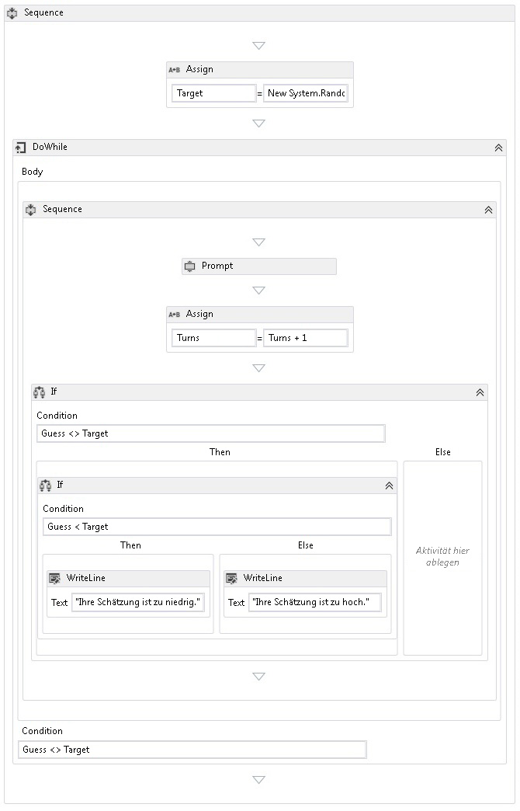

# <a name="how-to-create-a-sequential-workflow"></a><span data-ttu-id="b5343-102">Vorgehensweise: Erstellen eines sequenziellen Workflows</span><span class="sxs-lookup"><span data-stu-id="b5343-102">How to: Create a Sequential Workflow</span></span>
<span data-ttu-id="b5343-103">Workflows können aus integrierten Aktivitäten und aus benutzerdefinierten Aktivitäten erstellt werden.</span><span class="sxs-lookup"><span data-stu-id="b5343-103">Workflows can be constructed from built-in activities as well as from custom activities.</span></span> <span data-ttu-id="b5343-104">Dieses Thema führt Sie durch Erstellen eines Workflows, die sowohl integrierten Aktivitäten, wie z. B. verwendet die <xref:System.Activities.Statements.Sequence> Aktivität und den benutzerdefinierten Aktivitäten aus dem vorherigen [Vorgehensweise: Erstellen Sie eine Aktivität](../../../docs/framework/windows-workflow-foundation/how-to-create-an-activity.md) Thema.</span><span class="sxs-lookup"><span data-stu-id="b5343-104">This topic steps through creating a workflow that uses both built-in activities such as the <xref:System.Activities.Statements.Sequence> activity, and the custom activities from the previous [How to: Create an Activity](../../../docs/framework/windows-workflow-foundation/how-to-create-an-activity.md) topic.</span></span> <span data-ttu-id="b5343-105">Der Workflow erstellt ein Spiel, das Zahlen errät.</span><span class="sxs-lookup"><span data-stu-id="b5343-105">The workflow models a number guessing game.</span></span>  
  
> [!NOTE]
>  <span data-ttu-id="b5343-106">Ein Thema im Lernprogramm "Erste Schritte" hängt jeweils von den vorherigen Themen ab.</span><span class="sxs-lookup"><span data-stu-id="b5343-106">Each topic in the Getting Started tutorial depends on the previous topics.</span></span> <span data-ttu-id="b5343-107">Um dieses Thema abzuschließen, müssen Sie zuerst ausführen [Vorgehensweise: Erstellen Sie eine Aktivität](../../../docs/framework/windows-workflow-foundation/how-to-create-an-activity.md).</span><span class="sxs-lookup"><span data-stu-id="b5343-107">To complete this topic, you must first complete [How to: Create an Activity](../../../docs/framework/windows-workflow-foundation/how-to-create-an-activity.md).</span></span>  
  
> [!NOTE]
>  <span data-ttu-id="b5343-108">Eine abgeschlossene Version des Tutorials können Sie im [Windows Workflow Foundation (WF45) Getting Started Tutorial](http://go.microsoft.com/fwlink/?LinkID=248976)herunterladen.</span><span class="sxs-lookup"><span data-stu-id="b5343-108">To download a completed version of the tutorial, see [Windows Workflow Foundation (WF45) - Getting Started Tutorial](http://go.microsoft.com/fwlink/?LinkID=248976).</span></span>  
  
### <a name="to-create-the-workflow"></a><span data-ttu-id="b5343-109">So erstellen Sie den Workflow</span><span class="sxs-lookup"><span data-stu-id="b5343-109">To create the workflow</span></span>  
  
1.  <span data-ttu-id="b5343-110">Mit der rechten Maustaste **NumberGuessWorkflowActivities** in **Projektmappen-Explorer** , und wählen Sie **hinzufügen**, **neues Element**.</span><span class="sxs-lookup"><span data-stu-id="b5343-110">Right-click **NumberGuessWorkflowActivities** in **Solution Explorer** and select **Add**, **New Item**.</span></span>  
  
2.  <span data-ttu-id="b5343-111">In der **installiert**, **gemeinsame Elemente** Knoten **Workflow**.</span><span class="sxs-lookup"><span data-stu-id="b5343-111">In the **Installed**, **Common Items** node, select **Workflow**.</span></span> <span data-ttu-id="b5343-112">Wählen Sie **Aktivität** aus der **Workflow** Liste.</span><span class="sxs-lookup"><span data-stu-id="b5343-112">Select **Activity** from the **Workflow** list.</span></span>  
  
3.  <span data-ttu-id="b5343-113">Typ `SequentialNumberGuessWorkflow` in der **Namen** Feld, und klicken Sie auf **hinzufügen**.</span><span class="sxs-lookup"><span data-stu-id="b5343-113">Type `SequentialNumberGuessWorkflow` into the **Name** box and click **Add**.</span></span>  
  
4.  <span data-ttu-id="b5343-114">Ziehen Sie eine **Sequenz** Aktivität aus der **Control Flow** im Abschnitt der **Toolbox** und legen ihn auf die **Aktivität hier ablegen** Bezeichnung auf die die Entwurfsoberfläche des Workflows.</span><span class="sxs-lookup"><span data-stu-id="b5343-114">Drag a **Sequence** activity from the **Control Flow** section of the **Toolbox** and drop it onto the **Drop activity here** label on the workflow design surface.</span></span>  
  
### <a name="to-create-the-workflow-variables-and-arguments"></a><span data-ttu-id="b5343-115">So erstellen Sie die Workflowvariablen und -argumente</span><span class="sxs-lookup"><span data-stu-id="b5343-115">To create the workflow variables and arguments</span></span>  
  
1.  <span data-ttu-id="b5343-116">Doppelklicken Sie auf **SequentialNumberGuessWorkflow.xaml** in **Projektmappen-Explorer** um den Workflow im Designer anzuzeigen, wenn er nicht bereits angezeigt wird.</span><span class="sxs-lookup"><span data-stu-id="b5343-116">Double-click **SequentialNumberGuessWorkflow.xaml** in **Solution Explorer** to display the workflow in the designer, if it is not already displayed.</span></span>  
  
2.  <span data-ttu-id="b5343-117">Klicken Sie auf **Argumente** in der unteren linken Seite im Workflow-Designer zum Anzeigen der **Argumente** Bereich.</span><span class="sxs-lookup"><span data-stu-id="b5343-117">Click **Arguments** in the lower-left side of the workflow designer to display the **Arguments** pane.</span></span>  
  
3.  <span data-ttu-id="b5343-118">Klicken Sie auf **Argument erstellen**.</span><span class="sxs-lookup"><span data-stu-id="b5343-118">Click **Create Argument**.</span></span>  
  
4.  <span data-ttu-id="b5343-119">Typ `MaxNumber` in der **Namen** wählen Sie im **In** aus der **Richtung** Dropdown-Liste **Int32** aus der **Argumenttyp** Dropdown-Liste, und drücken Sie dann die EINGABETASTE, um das Argument zu speichern.</span><span class="sxs-lookup"><span data-stu-id="b5343-119">Type `MaxNumber` into the **Name** box, select **In** from the **Direction** drop-down list, select **Int32** from the **Argument type** drop-down list, and then press ENTER to save the argument.</span></span>  
  
5.  <span data-ttu-id="b5343-120">Klicken Sie auf **Argument erstellen**.</span><span class="sxs-lookup"><span data-stu-id="b5343-120">Click **Create Argument**.</span></span>  
  
6.  <span data-ttu-id="b5343-121">Typ `Turns` in der **Namen** Feld, das unterhalb der neu hinzugefügten `MaxNumber` Argument die Option **Out** aus der **Richtung** Dropdown-Liste  **Int32** aus der **Argumenttyp** Dropdown-Liste, und drücken Sie dann die EINGABETASTE.</span><span class="sxs-lookup"><span data-stu-id="b5343-121">Type `Turns` into the **Name** box that is below the newly added `MaxNumber` argument, select **Out** from the **Direction** drop-down list, select **Int32** from the **Argument type** drop-down list, and then press ENTER.</span></span>  
  
7.  <span data-ttu-id="b5343-122">Klicken Sie auf **Argumente** in der unteren linken Seite des Aktivitätsdesigners zu schließen die **Argumente** Bereich.</span><span class="sxs-lookup"><span data-stu-id="b5343-122">Click **Arguments** in the lower-left side of the activity designer to close the **Arguments** pane.</span></span>  
  
8.  <span data-ttu-id="b5343-123">Klicken Sie auf **Variablen** in der unteren linken Seite im Workflow-Designer zum Anzeigen der **Variablen** Bereich.</span><span class="sxs-lookup"><span data-stu-id="b5343-123">Click **Variables** in the lower-left side of the workflow designer to display the **Variables** pane.</span></span>  
  
9. <span data-ttu-id="b5343-124">Klicken Sie auf **erstellen Variable**.</span><span class="sxs-lookup"><span data-stu-id="b5343-124">Click **Create Variable**.</span></span>  
  
    > [!TIP]
    >  <span data-ttu-id="b5343-125">Wenn kein **Variable erstellen** angezeigt wird, klicken Sie auf die **Sequenz** Aktivität auf der workflowdesigneroberfläche, um es auszuwählen.</span><span class="sxs-lookup"><span data-stu-id="b5343-125">If no **Create Variable** box is displayed, click the **Sequence** activity on the workflow designer surface to select it.</span></span>  
  
10. <span data-ttu-id="b5343-126">Typ `Guess` in der **Namen** wählen Sie im **Int32** aus der **Variablentyp** Dropdown-Liste, und drücken Sie dann die EINGABETASTE, um die Variable zu speichern.</span><span class="sxs-lookup"><span data-stu-id="b5343-126">Type `Guess` into the **Name** box, select **Int32** from the **Variable type** drop-down list, and then press ENTER to save the variable.</span></span>  
  
11. <span data-ttu-id="b5343-127">Klicken Sie auf **erstellen Variable**.</span><span class="sxs-lookup"><span data-stu-id="b5343-127">Click **Create Variable**.</span></span>  
  
12. <span data-ttu-id="b5343-128">Typ `Target` in der **Namen** wählen Sie im **Int32** aus der **Variablentyp** Dropdown-Liste, und drücken Sie dann die EINGABETASTE, um die Variable zu speichern.</span><span class="sxs-lookup"><span data-stu-id="b5343-128">Type `Target` into the **Name** box, select **Int32** from the **Variable type** drop-down list, and then press ENTER to save the variable.</span></span>  
  
13. <span data-ttu-id="b5343-129">Klicken Sie auf **Variablen** in der unteren linken Seite des Aktivitätsdesigners zu schließen die **Variablen** Bereich.</span><span class="sxs-lookup"><span data-stu-id="b5343-129">Click **Variables** in the lower-left side of the activity designer to close the **Variables** pane.</span></span>  
  
### <a name="to-add-the-workflow-activities"></a><span data-ttu-id="b5343-130">So fügen Sie die Workflowaktivitäten hinzu</span><span class="sxs-lookup"><span data-stu-id="b5343-130">To add the workflow activities</span></span>  
  
1.  <span data-ttu-id="b5343-131">Ziehen Sie ein **zuweisen** Aktivität aus der **primitive** Teil der **Toolbox** und legen ihn auf die **Sequenz** Aktivität.</span><span class="sxs-lookup"><span data-stu-id="b5343-131">Drag an **Assign** activity from the **Primitives** section of the **Toolbox** and drop it onto the **Sequence** activity.</span></span> <span data-ttu-id="b5343-132">Typ `Target` in der **auf** Feld und den folgenden Ausdruck in der **Geben Sie einen C#-Ausdruck** oder **VB-Ausdruck eingeben** Feld.</span><span class="sxs-lookup"><span data-stu-id="b5343-132">Type `Target` into the **To** box and the following expression into the **Enter a C# expression** or **Enter a VB expression** box.</span></span>  
  
    ```vb  
    New System.Random().Next(1, MaxNumber + 1)  
    ```  
  
    ```csharp  
    new System.Random().Next(1, MaxNumber + 1)  
    ```  
  
    > [!TIP]
    >  <span data-ttu-id="b5343-133">Wenn die **Toolbox** Fenster nicht angezeigt wird, wählen Sie **Toolbox** aus der **Ansicht** Menü.</span><span class="sxs-lookup"><span data-stu-id="b5343-133">If the **Toolbox** window is not displayed, select **Toolbox** from the **View** menu.</span></span>  
  
2.  <span data-ttu-id="b5343-134">Ziehen Sie eine **DoWhile** Aktivität aus der **Control Flow** Teil der **Toolbox** und legen Sie sie auf dem Workflow unterhalb der **zuweisen** Aktivität.</span><span class="sxs-lookup"><span data-stu-id="b5343-134">Drag a **DoWhile** activity from the **Control Flow** section of the **Toolbox** and drop it on the workflow so that it is below the **Assign** activity.</span></span>  
  
3.  <span data-ttu-id="b5343-135">Geben Sie den folgenden Ausdruck in der **DoWhile** Aktivität **Bedingung** Feld mit dem Eigenschaftswert.</span><span class="sxs-lookup"><span data-stu-id="b5343-135">Type the following expression into the **DoWhile** activity’s **Condition** property value box.</span></span>  
  
    ```vb  
    Guess <> Target  
    ```  
  
    ```csharp  
    Guess != Target  
    ```  
  
     <span data-ttu-id="b5343-136">Eine <xref:System.Activities.Statements.DoWhile>-Aktivität führt ihre untergeordneten Aktivitäten aus und wertet dann <xref:System.Activities.Statements.DoWhile.Condition%2A> aus.</span><span class="sxs-lookup"><span data-stu-id="b5343-136">A <xref:System.Activities.Statements.DoWhile> activity executes its child activities and then evaluates its <xref:System.Activities.Statements.DoWhile.Condition%2A>.</span></span> <span data-ttu-id="b5343-137">Wenn <xref:System.Activities.Statements.DoWhile.Condition%2A> `True` ergibt, dann werden die Aktivitäten in <xref:System.Activities.Statements.DoWhile> erneut ausgeführt.</span><span class="sxs-lookup"><span data-stu-id="b5343-137">If the <xref:System.Activities.Statements.DoWhile.Condition%2A> evaluates to `True`, then the activities in the <xref:System.Activities.Statements.DoWhile> execute again.</span></span> <span data-ttu-id="b5343-138">In diesem Beispiel wird der Schätzwert des Benutzers ausgewertet und <xref:System.Activities.Statements.DoWhile> fortgesetzt, bis die Schätzung richtig ist.</span><span class="sxs-lookup"><span data-stu-id="b5343-138">In this example, the user’s guess is evaluated and the <xref:System.Activities.Statements.DoWhile> continues until the guess is correct.</span></span>  
  
4.  <span data-ttu-id="b5343-139">Ziehen Sie eine **Prompt** Aktivität aus der **NumberGuessWorkflowActivities** Teil der **Toolbox** und legen Sie sie in der **DoWhile** Aktivität aus dem vorherigen Schritt.</span><span class="sxs-lookup"><span data-stu-id="b5343-139">Drag a **Prompt** activity from the **NumberGuessWorkflowActivities** section of the **Toolbox** and drop it in the **DoWhile** activity from the previous step.</span></span>  
  
5.  <span data-ttu-id="b5343-140">In der **Fenster "Eigenschaften"**, Typ `"EnterGuess"` einschließlich der Anführungszeichen in der **BookmarkName** Feld mit dem Eigenschaftswert für die **Prompt** Aktivität.</span><span class="sxs-lookup"><span data-stu-id="b5343-140">In the **Properties Window**, type `"EnterGuess"` including the quotes into the **BookmarkName** property value box for the **Prompt** activity.</span></span> <span data-ttu-id="b5343-141">Typ `Guess` in der **Ergebnis** Eigenschaft Wert im Feld, und geben Sie den folgenden Ausdruck in der **Text** Eigenschaftenfeld.</span><span class="sxs-lookup"><span data-stu-id="b5343-141">Type `Guess` into the **Result** property value box, and type the following expression into the **Text** property box.</span></span>  
  
    ```vb  
    "Please enter a number between 1 and " & MaxNumber  
    ```  
  
    ```csharp  
    "Please enter a number between 1 and " + MaxNumber  
    ```  
  
    > [!TIP]
    >  <span data-ttu-id="b5343-142">Wenn die **Fenster "Eigenschaften"** wird nicht angezeigt werden, wählen Sie **Fenster "Eigenschaften"** aus der **Ansicht** Menü.</span><span class="sxs-lookup"><span data-stu-id="b5343-142">If the **Properties Window** is not displayed, select **Properties Window** from the **View** menu.</span></span>  
  
6.  <span data-ttu-id="b5343-143">Ziehen Sie ein **zuweisen** Aktivität aus der **primitive** Teil der **Toolbox** und legen Sie sie in der **DoWhile** -Aktivität ab, sodass, folgt die **Prompt** Aktivität.</span><span class="sxs-lookup"><span data-stu-id="b5343-143">Drag an **Assign** activity from the **Primitives** section of the **Toolbox** and drop it in the **DoWhile** activity so that it follows the **Prompt** activity.</span></span>  
  
    > [!NOTE]
    >  <span data-ttu-id="b5343-144">Beim Ablegen der **zuweisen** Aktivität, beachten Sie, wie der Workflow-Designer automatisch hinzufügt, eine **Sequenz** Aktivität, die beide enthalten den **Prompt** Aktivität und der neu hinzugefügte **Zuweisen** Aktivität.</span><span class="sxs-lookup"><span data-stu-id="b5343-144">When you drop the **Assign** activity, note how the workflow designer automatically adds a **Sequence** activity to contain both the **Prompt** activity and the newly added **Assign** activity.</span></span>  
  
7.  <span data-ttu-id="b5343-145">Typ `Turns` in der **auf** Feld und `Turns + 1` in der **Geben Sie einen C#-Ausdruck** oder **VB-Ausdruck eingeben** Feld.</span><span class="sxs-lookup"><span data-stu-id="b5343-145">Type `Turns` into the **To** box and `Turns + 1` into the **Enter a C# expression** or **Enter a VB expression** box.</span></span>  
  
8.  <span data-ttu-id="b5343-146">Ziehen Sie ein **Wenn** Aktivität aus der **Control Flow** Teil der **Toolbox** und legen Sie sie in der **Sequenz** -Aktivität ab, sodass, folgt die der neu hinzugefügte **zuweisen** Aktivität.</span><span class="sxs-lookup"><span data-stu-id="b5343-146">Drag an **If** activity from the **Control Flow** section of the **Toolbox** and drop it in the **Sequence** activity so that it follows the newly added **Assign** activity.</span></span>  
  
9. <span data-ttu-id="b5343-147">Geben Sie den folgenden Ausdruck in der **Wenn** Aktivität **Bedingung** Feld mit dem Eigenschaftswert.</span><span class="sxs-lookup"><span data-stu-id="b5343-147">Type the following expression into the **If** activity’s **Condition** property value box.</span></span>  
  
    ```vb  
    Guess <> Target  
    ```  
  
    ```csharp  
    Guess != Target  
    ```  
  
10. <span data-ttu-id="b5343-148">Ziehen Sie ein weiteres **Wenn** Aktivität aus der **Control Flow** Teil der **Toolbox** und legen Sie sie in der **dann** Abschnitt des ersten **Wenn** Aktivität.</span><span class="sxs-lookup"><span data-stu-id="b5343-148">Drag another **If** activity from the **Control Flow** section of the **Toolbox** and drop it in the **Then** section of the first **If** activity.</span></span>  
  
11. <span data-ttu-id="b5343-149">Geben Sie den folgenden Ausdruck in das neu hinzugefügte **Wenn** Aktivität **Bedingung** Feld mit dem Eigenschaftswert.</span><span class="sxs-lookup"><span data-stu-id="b5343-149">Type the following expression into the newly added **If** activity’s **Condition** property value box.</span></span>  
  
    ```
    Guess < Target  
    ```  
  
12. <span data-ttu-id="b5343-150">Ziehen Sie zwei **WriteLine** Aktivitäten aus der **primitive** im Abschnitt der **Toolbox** und ablegen, sodass ist die **dann** im Abschnitt die neu hinzugefügte **Wenn** Aktivität, und eine befindet sich in der **Else** Abschnitt.</span><span class="sxs-lookup"><span data-stu-id="b5343-150">Drag two **WriteLine** activities from the **Primitives** section of the **Toolbox** and drop them so that one is in the **Then** section of the newly added **If** activity, and one is in the **Else** section.</span></span>  
  
13. <span data-ttu-id="b5343-151">Klicken Sie auf die **WriteLine** Aktivität in der **dann** Abschnitt, um ihn auszuwählen, und geben Sie den folgenden Ausdruck in der **Text** Feld mit dem Eigenschaftswert.</span><span class="sxs-lookup"><span data-stu-id="b5343-151">Click the **WriteLine** activity in the **Then** section to select it, and type the following expression into the **Text** property value box.</span></span>  
  
    ```vb  
    "Your guess is too low."  
    ```  
  
14. <span data-ttu-id="b5343-152">Klicken Sie auf die **WriteLine** Aktivität in der **Else** Abschnitt, um ihn auszuwählen, und geben Sie den folgenden Ausdruck in der **Text** Feld mit dem Eigenschaftswert.</span><span class="sxs-lookup"><span data-stu-id="b5343-152">Click the **WriteLine** activity in the **Else** section to select it, and type the following expression into the **Text** property value box.</span></span>  
  
    ```vb  
    "Your guess is too high."  
    ```  
  
     <span data-ttu-id="b5343-153">Im folgenden Beispiel wird der abgeschlossene Workflow dargestellt.</span><span class="sxs-lookup"><span data-stu-id="b5343-153">The following example illustrates the completed workflow.</span></span>  
  
     <span data-ttu-id="b5343-154"></span><span class="sxs-lookup"><span data-stu-id="b5343-154"></span></span>  
  
### <a name="to-build-the-workflow"></a><span data-ttu-id="b5343-155">So erstellen Sie den Workflow</span><span class="sxs-lookup"><span data-stu-id="b5343-155">To build the workflow</span></span>  
  
1.  <span data-ttu-id="b5343-156">Drücken Sie STRG+UMSCHALT+B, um die Projektmappe zu erstellen.</span><span class="sxs-lookup"><span data-stu-id="b5343-156">Press CTRL+SHIFT+B to build the solution.</span></span>  
  
     <span data-ttu-id="b5343-157">Anweisungen zum Ausführen des Workflows finden Sie unter dem nächsten Thema [Vorgehensweise: Ausführen eines Workflows](../../../docs/framework/windows-workflow-foundation/how-to-run-a-workflow.md).</span><span class="sxs-lookup"><span data-stu-id="b5343-157">For instructions on how to run the workflow, please see the next topic, [How to: Run a Workflow](../../../docs/framework/windows-workflow-foundation/how-to-run-a-workflow.md).</span></span> <span data-ttu-id="b5343-158">Wenn Sie bereits abgeschlossen haben die [wie: Ausführen eines Workflows](../../../docs/framework/windows-workflow-foundation/how-to-run-a-workflow.md) Schritt mit einem anderen Format des Workflows und möchten, führen Sie ihn mithilfe des sequenziellen Workflows von diesem Schritt, fahren Sie mit der [zum Erstellen und Ausführen der Anwendung](../../../docs/framework/windows-workflow-foundation/how-to-run-a-workflow.md#BKMK_ToRunTheApplication)Abschnitt [Vorgehensweise: Ausführen eines Workflows](../../../docs/framework/windows-workflow-foundation/how-to-run-a-workflow.md).</span><span class="sxs-lookup"><span data-stu-id="b5343-158">If you have already completed the [How to: Run a Workflow](../../../docs/framework/windows-workflow-foundation/how-to-run-a-workflow.md) step with a different style of workflow and wish to run it using the sequential workflow from this step, skip ahead to the [To build and run the application](../../../docs/framework/windows-workflow-foundation/how-to-run-a-workflow.md#BKMK_ToRunTheApplication) section of [How to: Run a Workflow](../../../docs/framework/windows-workflow-foundation/how-to-run-a-workflow.md).</span></span>  
  
## <a name="see-also"></a><span data-ttu-id="b5343-159">Siehe auch</span><span class="sxs-lookup"><span data-stu-id="b5343-159">See Also</span></span>  
 <xref:System.Activities.Statements.Flowchart>  
 <xref:System.Activities.Statements.FlowDecision>  
 [<span data-ttu-id="b5343-160">Windows Workflow Foundation-Programmierung</span><span class="sxs-lookup"><span data-stu-id="b5343-160">Windows Workflow Foundation Programming</span></span>](../../../docs/framework/windows-workflow-foundation/programming.md)  
 [<span data-ttu-id="b5343-161">Entwerfen von Workflows</span><span class="sxs-lookup"><span data-stu-id="b5343-161">Designing Workflows</span></span>](../../../docs/framework/windows-workflow-foundation/designing-workflows.md)  
 [<span data-ttu-id="b5343-162">Tutorial mit ersten Schritten</span><span class="sxs-lookup"><span data-stu-id="b5343-162">Getting Started Tutorial</span></span>](../../../docs/framework/windows-workflow-foundation/getting-started-tutorial.md)  
 [<span data-ttu-id="b5343-163">Vorgehensweise: Erstellen einer Aktivität</span><span class="sxs-lookup"><span data-stu-id="b5343-163">How to: Create an Activity</span></span>](../../../docs/framework/windows-workflow-foundation/how-to-create-an-activity.md)  
 [<span data-ttu-id="b5343-164">Vorgehensweise: Ausführen eines Workflows</span><span class="sxs-lookup"><span data-stu-id="b5343-164">How to: Run a Workflow</span></span>](../../../docs/framework/windows-workflow-foundation/how-to-run-a-workflow.md)
