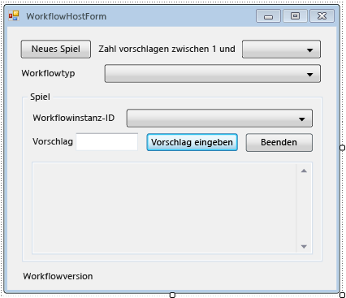

# <a name="how-to-create-and-run-a-long-running-workflow"></a><span data-ttu-id="262b0-102">Vorgehensweise: Erstellen und Ausführen eines Workflows mit langer Laufzeit</span><span class="sxs-lookup"><span data-stu-id="262b0-102">How to: Create and Run a Long Running Workflow</span></span>
<span data-ttu-id="262b0-103">Eine der zentralen Funktionen von Windows Workflow Foundation (WF) ist der Laufzeit Möglichkeit speichern und Entladen von Workflows in einer Datenbank im Leerlauf.</span><span class="sxs-lookup"><span data-stu-id="262b0-103">One of the central features of Windows Workflow Foundation (WF) is the runtime’s ability to persist and unload idle workflows to a database.</span></span> <span data-ttu-id="262b0-104">Die Schritte im [wie: Ausführen eines Workflows](../../../docs/framework/windows-workflow-foundation/how-to-run-a-workflow.md) wurden die Grundlagen der workflowhosting mithilfe einer Konsolenanwendung.</span><span class="sxs-lookup"><span data-stu-id="262b0-104">The steps in [How to: Run a Workflow](../../../docs/framework/windows-workflow-foundation/how-to-run-a-workflow.md) demonstrated the basics of workflow hosting using a console application.</span></span> <span data-ttu-id="262b0-105">Anhand von Beispielen wurde gezeigt, wie Workflows und Workflowlebenszyklus-Handler gestartet und Lesezeichen wiederaufgenommen werden.</span><span class="sxs-lookup"><span data-stu-id="262b0-105">Examples were shown of starting workflows, workflow lifecycle handlers, and resuming bookmarks.</span></span> <span data-ttu-id="262b0-106">Um die Workflowpersistenz effektiv zu veranschaulichen, ist ein komplexerer Workflowhost erforderlich, der das Starten und Fortsetzen mehrerer Workflowinstanzen unterstützt.</span><span class="sxs-lookup"><span data-stu-id="262b0-106">In order to demonstrate workflow persistence effectively, a more complex workflow host is required that supports starting and resuming multiple workflow instances.</span></span> <span data-ttu-id="262b0-107">In diesem Schritt des Lernprogramms wird veranschaulicht, wie eine Windows-Formularhostanwendung erstellt wird, die das Starten und Fortsetzen mehrerer Workflowinstanzen und die Workflowpersistenz unterstützt sowie die Grundlage für erweiterte Funktionen wie Nachverfolgung und Versionsverwaltung bildet, die in den folgenden Schritten des Lernprogramms veranschaulicht werden.</span><span class="sxs-lookup"><span data-stu-id="262b0-107">This step in the tutorial demonstrates how to create a Windows form host application that supports starting and resuming multiple workflow instances, workflow persistence, and provides a basis for the advanced features such as tracking and versioning that are demonstrated in subsequent tutorial steps.</span></span>  
  
> [!NOTE]
>  <span data-ttu-id="262b0-108">Schritt des Lernprogramms und den nachfolgenden Schritten verwenden Sie alle drei Workflowtypen aus [Vorgehensweise: Erstellen eines Workflows](../../../docs/framework/windows-workflow-foundation/how-to-create-a-workflow.md).</span><span class="sxs-lookup"><span data-stu-id="262b0-108">This tutorial step and the subsequent steps use all three workflow types from [How to: Create a Workflow](../../../docs/framework/windows-workflow-foundation/how-to-create-a-workflow.md).</span></span> <span data-ttu-id="262b0-109">Wenn Sie nicht alle drei Typen abgeschlossen haben, können Sie eine abgeschlossene Version der Schritte von herunterladen [Windows Workflow Foundation (WF45) Getting Started Tutorial](https://go.microsoft.com/fwlink/?LinkID=248976).</span><span class="sxs-lookup"><span data-stu-id="262b0-109">If you did not complete all three types you can download a completed version of the steps from [Windows Workflow Foundation (WF45) - Getting Started Tutorial](https://go.microsoft.com/fwlink/?LinkID=248976).</span></span>  
  
> [!NOTE]
>  <span data-ttu-id="262b0-110">Um den download einer vervollständigten Version oder eine Videodemonstration des Lernprogramms anzuzeigen, finden Sie unter [Windows Workflow Foundation (WF45) Getting Started Tutorial](https://go.microsoft.com/fwlink/?LinkID=248976).</span><span class="sxs-lookup"><span data-stu-id="262b0-110">To download a completed version or view a video walkthrough of the tutorial, see [Windows Workflow Foundation (WF45) - Getting Started Tutorial](https://go.microsoft.com/fwlink/?LinkID=248976).</span></span>  
  
## <a name="in-this-topic"></a><span data-ttu-id="262b0-111">In diesem Thema</span><span class="sxs-lookup"><span data-stu-id="262b0-111">In this topic</span></span>  
  
-   [<span data-ttu-id="262b0-112">Um die Persistenzdatenbank zu erstellen.</span><span class="sxs-lookup"><span data-stu-id="262b0-112">To create the persistence database</span></span>](../../../docs/framework/windows-workflow-foundation/how-to-create-and-run-a-long-running-workflow.md#BKMK_CreatePersistenceDatabase)  
  
-   [<span data-ttu-id="262b0-113">Der Verweis auf den DurableInstancing-Assemblys hinzufügen</span><span class="sxs-lookup"><span data-stu-id="262b0-113">To add the reference to the DurableInstancing assemblies</span></span>](../../../docs/framework/windows-workflow-foundation/how-to-create-and-run-a-long-running-workflow.md#BKMK_AddReference)  
  
-   [<span data-ttu-id="262b0-114">Zum Erstellen der Workflowhost-Formular</span><span class="sxs-lookup"><span data-stu-id="262b0-114">To create the workflow host form</span></span>](../../../docs/framework/windows-workflow-foundation/how-to-create-and-run-a-long-running-workflow.md#BKMK_CreateForm)  
  
-   [<span data-ttu-id="262b0-115">Die Eigenschaften und Hilfsmethoden des Formulars hinzufügen</span><span class="sxs-lookup"><span data-stu-id="262b0-115">To add the properties and helper methods of the form</span></span>](../../../docs/framework/windows-workflow-foundation/how-to-create-and-run-a-long-running-workflow.md#BKMK_AddHelperMethods)  
  
-   [<span data-ttu-id="262b0-116">So konfigurieren Sie den Instanzspeicher, Workflowlebenszyklus-Handler und Erweiterungen</span><span class="sxs-lookup"><span data-stu-id="262b0-116">To configure the instance store, workflow lifecycle handlers, and extensions</span></span>](../../../docs/framework/windows-workflow-foundation/how-to-create-and-run-a-long-running-workflow.md#BKMK_ConfigureWorkflowApplication)  
  
-   [<span data-ttu-id="262b0-117">So aktivieren Sie starten und fortsetzen mehrerer Workflowtypen</span><span class="sxs-lookup"><span data-stu-id="262b0-117">To enable starting and resuming multiple workflow types</span></span>](../../../docs/framework/windows-workflow-foundation/how-to-create-and-run-a-long-running-workflow.md#BKMK_WorkflowVersionMap)  
  
-   [<span data-ttu-id="262b0-118">Um einen neuen Workflow zu starten.</span><span class="sxs-lookup"><span data-stu-id="262b0-118">To start a new workflow</span></span>](../../../docs/framework/windows-workflow-foundation/how-to-create-and-run-a-long-running-workflow.md#BKMK_StartWorkflow)  
  
-   [<span data-ttu-id="262b0-119">Zum Fortsetzen eines Workflows</span><span class="sxs-lookup"><span data-stu-id="262b0-119">To resume a workflow</span></span>](../../../docs/framework/windows-workflow-foundation/how-to-create-and-run-a-long-running-workflow.md#BKMK_ResumeWorkflow)  
  
-   [<span data-ttu-id="262b0-120">Zum Beenden eines Workflows</span><span class="sxs-lookup"><span data-stu-id="262b0-120">To terminate a workflow</span></span>](../../../docs/framework/windows-workflow-foundation/how-to-create-and-run-a-long-running-workflow.md#BKMK_TerminateWorkflow)  
  
-   [<span data-ttu-id="262b0-121">Zum Erstellen und Ausführen der Anwendungs</span><span class="sxs-lookup"><span data-stu-id="262b0-121">To build and run the application</span></span>](../../../docs/framework/windows-workflow-foundation/how-to-create-and-run-a-long-running-workflow.md#BKMK_BuildAndRun)  
  
###  <a name="BKMK_CreatePersistenceDatabase"></a> <span data-ttu-id="262b0-122">Um die Persistenzdatenbank zu erstellen.</span><span class="sxs-lookup"><span data-stu-id="262b0-122">To create the persistence database</span></span>  
  
1.  <span data-ttu-id="262b0-123">Öffnen Sie SQL Server Management Studio und verbinden Sie auf dem lokalen Server, z. B. **. \SQLEXPRESS**.</span><span class="sxs-lookup"><span data-stu-id="262b0-123">Open SQL Server Management Studio and connect to the local server, for example **.\SQLEXPRESS**.</span></span> <span data-ttu-id="262b0-124">Mit der rechten Maustaste die **Datenbanken** Knoten auf dem lokalen Server, und wählen Sie **neue Datenbank**.</span><span class="sxs-lookup"><span data-stu-id="262b0-124">Right-click the **Databases** node on the local server, and select **New Database**.</span></span> <span data-ttu-id="262b0-125">Nennen Sie die neue Datenbank **WF45GettingStartedTutorial**, nehmen Sie alle anderen Werte, und wählen **OK**.</span><span class="sxs-lookup"><span data-stu-id="262b0-125">Name the new database **WF45GettingStartedTutorial**, accept all other values, and select **OK**.</span></span>  
  
    > [!NOTE]
    >  <span data-ttu-id="262b0-126">Stellen Sie sicher, dass man **Create Database** Berechtigung auf dem lokalen Server vor dem Erstellen der Datenbank.</span><span class="sxs-lookup"><span data-stu-id="262b0-126">Ensure that you have **Create Database** permission on the local server before creating the database.</span></span>  
  
2.  <span data-ttu-id="262b0-127">Wählen Sie **öffnen**, **Datei** aus der **Datei** Menü.</span><span class="sxs-lookup"><span data-stu-id="262b0-127">Choose **Open**, **File** from the **File** menu.</span></span> <span data-ttu-id="262b0-128">Wechseln Sie zum folgenden Ordner: `C:\Windows\Microsoft.NET\Framework\v4.0.30319\sql\en`</span><span class="sxs-lookup"><span data-stu-id="262b0-128">Browse to the following folder: `C:\Windows\Microsoft.NET\Framework\v4.0.30319\sql\en`</span></span>  
  
     <span data-ttu-id="262b0-129">Wählen Sie die folgenden beiden Dateien aus, und klicken Sie auf **öffnen**.</span><span class="sxs-lookup"><span data-stu-id="262b0-129">Select the following two files and click **Open**.</span></span>  
  
    -   <span data-ttu-id="262b0-130">SqlWorkflowInstanceStoreLogic.sql</span><span class="sxs-lookup"><span data-stu-id="262b0-130">SqlWorkflowInstanceStoreLogic.sql</span></span>  
  
    -   <span data-ttu-id="262b0-131">SqlWorkflowInstanceStoreSchema.sql</span><span class="sxs-lookup"><span data-stu-id="262b0-131">SqlWorkflowInstanceStoreSchema.sql</span></span>  
  
3.  <span data-ttu-id="262b0-132">Wählen Sie **SqlWorkflowInstanceStoreSchema.sql** aus der **Fenster** Menü.</span><span class="sxs-lookup"><span data-stu-id="262b0-132">Choose **SqlWorkflowInstanceStoreSchema.sql** from the **Window** menu.</span></span> <span data-ttu-id="262b0-133">Sicher, dass **WF45GettingStartedTutorial** ausgewählt ist, der **verfügbare Datenbanken** Dropdownliste aus, und wählen Sie **ausführen** aus der **Abfrage**Menü.</span><span class="sxs-lookup"><span data-stu-id="262b0-133">Ensure that **WF45GettingStartedTutorial** is selected in the **Available Databases** drop-down and choose **Execute** from the **Query** menu.</span></span>  
  
4.  <span data-ttu-id="262b0-134">Wählen Sie **SqlWorkflowInstanceStoreLogic.sql** aus der **Fenster** Menü.</span><span class="sxs-lookup"><span data-stu-id="262b0-134">Choose **SqlWorkflowInstanceStoreLogic.sql** from the **Window** menu.</span></span> <span data-ttu-id="262b0-135">Sicher, dass **WF45GettingStartedTutorial** ausgewählt ist, der **verfügbare Datenbanken** Dropdownliste aus, und wählen Sie **ausführen** aus der **Abfrage**Menü.</span><span class="sxs-lookup"><span data-stu-id="262b0-135">Ensure that **WF45GettingStartedTutorial** is selected in the **Available Databases** drop-down and choose **Execute** from the **Query** menu.</span></span>  
  
    > [!WARNING]
    >  <span data-ttu-id="262b0-136">Es ist wichtig, die vorherigen beiden Schritte in der richtigen Reihenfolge auszuführen.</span><span class="sxs-lookup"><span data-stu-id="262b0-136">It is important to perform the previous two steps in the correct order.</span></span> <span data-ttu-id="262b0-137">Wenn die Abfragen nicht in der richtigen Reihenfolge ausgeführt werden, treten Fehler auf, und die Persistenzdatenbank wird nicht richtig konfiguriert.</span><span class="sxs-lookup"><span data-stu-id="262b0-137">If the queries are executed out of order, errors occur and the persistence database is not configured correctly.</span></span>  
  
###  <a name="BKMK_AddReference"></a> <span data-ttu-id="262b0-138">Der Verweis auf den DurableInstancing-Assemblys hinzufügen</span><span class="sxs-lookup"><span data-stu-id="262b0-138">To add the reference to the DurableInstancing assemblies</span></span>  
  
1.  <span data-ttu-id="262b0-139">Mit der rechten Maustaste **NumberGuessWorkflowHost** in **Projektmappen-Explorer** , und wählen Sie **Verweis hinzufügen**.</span><span class="sxs-lookup"><span data-stu-id="262b0-139">Right-click **NumberGuessWorkflowHost** in **Solution Explorer** and select **Add Reference**.</span></span>  
  
2.  <span data-ttu-id="262b0-140">Wählen Sie **Assemblys** aus der **Verweis hinzufügen** aus, und geben `DurableInstancing` in die **Assemblys suchen** Feld.</span><span class="sxs-lookup"><span data-stu-id="262b0-140">Select **Assemblies** from the **Add Reference** list, and type `DurableInstancing` into the **Search Assemblies** box.</span></span> <span data-ttu-id="262b0-141">Dadurch werden die Assemblys gefiltert, sodass die gewünschten Verweise einfacher auszuwählen sind.</span><span class="sxs-lookup"><span data-stu-id="262b0-141">This filters the assemblies and makes the desired references easier to select.</span></span>  
  
3.  <span data-ttu-id="262b0-142">Aktivieren Sie das Kontrollkästchen neben **System.Activities.DurableInstancing** und **System.Activities.DurableInstancing** aus der **Suchergebnisse** aus, und klicken Sie auf **OK**.</span><span class="sxs-lookup"><span data-stu-id="262b0-142">Check the checkbox beside **System.Activities.DurableInstancing** and **System.Runtime.DurableInstancing** from the **Search Results** list, and click **OK**.</span></span>  
  
###  <a name="BKMK_CreateForm"></a> <span data-ttu-id="262b0-143">Zum Erstellen der Workflowhost-Formular</span><span class="sxs-lookup"><span data-stu-id="262b0-143">To create the workflow host form</span></span>  
  
> [!NOTE]
>  <span data-ttu-id="262b0-144">Durch die Schritte in dieser Prozedur wird veranschaulicht, wie das Formular manuell hinzugefügt und konfiguriert wird.</span><span class="sxs-lookup"><span data-stu-id="262b0-144">The steps in this procedure describe how to add and configure the form manually.</span></span> <span data-ttu-id="262b0-145">Auf Wunsch können Sie die Projektmappendateien für das Lernprogramm herunterladen und dem Projekt das abgeschlossene Formular hinzufügen.</span><span class="sxs-lookup"><span data-stu-id="262b0-145">If desired, you can download the solution files for the tutorial and add the completed form to the project.</span></span> <span data-ttu-id="262b0-146">Um die Lernprogrammdateien herunterladen, finden Sie unter [Windows Workflow Foundation (WF45) Getting Started Tutorial](https://go.microsoft.com/fwlink/?LinkID=248976).</span><span class="sxs-lookup"><span data-stu-id="262b0-146">To download the tutorial files, see [Windows Workflow Foundation (WF45) - Getting Started Tutorial](https://go.microsoft.com/fwlink/?LinkID=248976).</span></span> <span data-ttu-id="262b0-147">Nachdem die Dateien heruntergeladen werden, mit der rechten Maustaste **NumberGuessWorkflowHost** , und wählen Sie **Verweis hinzufügen**.</span><span class="sxs-lookup"><span data-stu-id="262b0-147">Once the files are downloaded, right-click **NumberGuessWorkflowHost** and choose **Add Reference**.</span></span> <span data-ttu-id="262b0-148">Hinzufügen eines Verweises auf **"System.Windows.Forms"** und **"System.Drawing"**.</span><span class="sxs-lookup"><span data-stu-id="262b0-148">Add a reference to **System.Windows.Forms** and **System.Drawing**.</span></span> <span data-ttu-id="262b0-149">Diese Verweise werden automatisch hinzugefügt, wenn Sie ein neues Formular über Hinzufügen der **hinzufügen**, **neues Element** Menü jedoch manuell hinzugefügt werden muss, wenn Sie ein Formular zu importieren.</span><span class="sxs-lookup"><span data-stu-id="262b0-149">These references are added automatically if you add a new form from the **Add**, **New Item** menu, but must be added manually when importing a form.</span></span> <span data-ttu-id="262b0-150">Nachdem die Verweise hinzugefügt wurden, mit der rechten Maustaste **NumberGuessWorkflowHost** in **Projektmappen-Explorer** , und wählen Sie **hinzufügen**, **vorhandenes Element**.</span><span class="sxs-lookup"><span data-stu-id="262b0-150">Once the references are added, right-click **NumberGuessWorkflowHost** in **Solution Explorer** and choose **Add**, **Existing Item**.</span></span> <span data-ttu-id="262b0-151">Navigieren Sie zu der `Form` Ordner in den Projektdateien **WorkflowHostForm.cs** (oder **WorkflowHostForm.vb**), und klicken Sie auf **hinzufügen**.</span><span class="sxs-lookup"><span data-stu-id="262b0-151">Browse to the `Form` folder in the project files, select **WorkflowHostForm.cs** (or **WorkflowHostForm.vb**), and click **Add**.</span></span> <span data-ttu-id="262b0-152">Wenn Sie das Formular importieren möchten, können Sie im nächsten Abschnitt fortfahren [zum Hinzufügen der Eigenschaften und Hilfsmethoden des Formulars](../../../docs/framework/windows-workflow-foundation/how-to-create-and-run-a-long-running-workflow.md#BKMK_AddHelperMethods).</span><span class="sxs-lookup"><span data-stu-id="262b0-152">If you choose to import the form, then you can skip down to the next section, [To add the properties and helper methods of the form](../../../docs/framework/windows-workflow-foundation/how-to-create-and-run-a-long-running-workflow.md#BKMK_AddHelperMethods).</span></span>  
  
1.  <span data-ttu-id="262b0-153">Mit der rechten Maustaste **NumberGuessWorkflowHost** in **Projektmappen-Explorer** , und wählen Sie **hinzufügen**, **neues Element**.</span><span class="sxs-lookup"><span data-stu-id="262b0-153">Right-click **NumberGuessWorkflowHost** in **Solution Explorer** and choose **Add**, **New Item**.</span></span>  
  
2.  <span data-ttu-id="262b0-154">In der **installiert** Vorlagen wählen **Windows Form**, Typ `WorkflowHostForm` in die **Namen** ein, und klicken Sie auf **hinzufügen**.</span><span class="sxs-lookup"><span data-stu-id="262b0-154">In the **Installed** templates list, choose **Windows Form**, type `WorkflowHostForm` in the **Name** box, and click **Add**.</span></span>  
  
3.  <span data-ttu-id="262b0-155">Konfigurieren Sie die folgenden Eigenschaften für das Formular.</span><span class="sxs-lookup"><span data-stu-id="262b0-155">Configure the following properties on the form.</span></span>  
  
    |<span data-ttu-id="262b0-156">Eigenschaft</span><span class="sxs-lookup"><span data-stu-id="262b0-156">Property</span></span>|<span data-ttu-id="262b0-157">Wert</span><span class="sxs-lookup"><span data-stu-id="262b0-157">Value</span></span>|  
    |--------------|-----------|  
    |<span data-ttu-id="262b0-158">FormBorderStyle</span><span class="sxs-lookup"><span data-stu-id="262b0-158">FormBorderStyle</span></span>|<span data-ttu-id="262b0-159">FixedSingle</span><span class="sxs-lookup"><span data-stu-id="262b0-159">FixedSingle</span></span>|  
    |<span data-ttu-id="262b0-160">MaximizeBox</span><span class="sxs-lookup"><span data-stu-id="262b0-160">MaximizeBox</span></span>|<span data-ttu-id="262b0-161">False</span><span class="sxs-lookup"><span data-stu-id="262b0-161">False</span></span>|  
    |<span data-ttu-id="262b0-162">Größe</span><span class="sxs-lookup"><span data-stu-id="262b0-162">Size</span></span>|<span data-ttu-id="262b0-163">400, 420</span><span class="sxs-lookup"><span data-stu-id="262b0-163">400, 420</span></span>|  
  
4.  <span data-ttu-id="262b0-164">Fügen Sie dem Formular die folgenden Steuerelemente in der angegebenen Reihenfolge hinzu, und konfigurieren Sie die Eigenschaften wie angegeben.</span><span class="sxs-lookup"><span data-stu-id="262b0-164">Add the following controls to the form in the order specified and configure the properties as directed.</span></span>  
  
    |<span data-ttu-id="262b0-165">Steuerelement</span><span class="sxs-lookup"><span data-stu-id="262b0-165">Control</span></span>|<span data-ttu-id="262b0-166">Eigenschaft: Wert</span><span class="sxs-lookup"><span data-stu-id="262b0-166">Property: Value</span></span>|  
    |-------------|---------------------|  
    |<span data-ttu-id="262b0-167">**Button** (Schaltfläche)</span><span class="sxs-lookup"><span data-stu-id="262b0-167">**Button**</span></span>|<span data-ttu-id="262b0-168">Name: NewGame</span><span class="sxs-lookup"><span data-stu-id="262b0-168">Name: NewGame</span></span><br /><br /> <span data-ttu-id="262b0-169">Speicherort: 13, 13</span><span class="sxs-lookup"><span data-stu-id="262b0-169">Location: 13, 13</span></span><br /><br /> <span data-ttu-id="262b0-170">Größe: 75, 23</span><span class="sxs-lookup"><span data-stu-id="262b0-170">Size: 75, 23</span></span><br /><br /> <span data-ttu-id="262b0-171">Text: Neues Spiel</span><span class="sxs-lookup"><span data-stu-id="262b0-171">Text: New Game</span></span>|  
    |<span data-ttu-id="262b0-172">**Bezeichnung**</span><span class="sxs-lookup"><span data-stu-id="262b0-172">**Label**</span></span>|<span data-ttu-id="262b0-173">Speicherort: 94, 18</span><span class="sxs-lookup"><span data-stu-id="262b0-173">Location: 94, 18</span></span><br /><br /> <span data-ttu-id="262b0-174">Text: Erraten Sie eine Zahl zwischen 1 und</span><span class="sxs-lookup"><span data-stu-id="262b0-174">Text: Guess a number from 1 to</span></span>|  
    |<span data-ttu-id="262b0-175">**ComboBox**</span><span class="sxs-lookup"><span data-stu-id="262b0-175">**ComboBox**</span></span>|<span data-ttu-id="262b0-176">Name: NumberRange</span><span class="sxs-lookup"><span data-stu-id="262b0-176">Name: NumberRange</span></span><br /><br /> <span data-ttu-id="262b0-177">DropDownStyle: DropDownList</span><span class="sxs-lookup"><span data-stu-id="262b0-177">DropDownStyle: DropDownList</span></span><br /><br /> <span data-ttu-id="262b0-178">Elemente: 10, 100, 1000</span><span class="sxs-lookup"><span data-stu-id="262b0-178">Items: 10, 100, 1000</span></span><br /><br /> <span data-ttu-id="262b0-179">Speicherort: 228, 12</span><span class="sxs-lookup"><span data-stu-id="262b0-179">Location: 228, 12</span></span><br /><br /> <span data-ttu-id="262b0-180">-Größe: 143, 21</span><span class="sxs-lookup"><span data-stu-id="262b0-180">Size: 143, 21</span></span>|  
    |<span data-ttu-id="262b0-181">**Bezeichnung**</span><span class="sxs-lookup"><span data-stu-id="262b0-181">**Label**</span></span>|<span data-ttu-id="262b0-182">Speicherort: 13, 43</span><span class="sxs-lookup"><span data-stu-id="262b0-182">Location: 13, 43</span></span><br /><br /> <span data-ttu-id="262b0-183">: Texttyp Workflow</span><span class="sxs-lookup"><span data-stu-id="262b0-183">Text: Workflow type</span></span>|  
    |<span data-ttu-id="262b0-184">**ComboBox**</span><span class="sxs-lookup"><span data-stu-id="262b0-184">**ComboBox**</span></span>|<span data-ttu-id="262b0-185">Name: WorkflowType</span><span class="sxs-lookup"><span data-stu-id="262b0-185">Name: WorkflowType</span></span><br /><br /> <span data-ttu-id="262b0-186">DropDownStyle: DropDownList</span><span class="sxs-lookup"><span data-stu-id="262b0-186">DropDownStyle: DropDownList</span></span><br /><br /> <span data-ttu-id="262b0-187">Elemente: StateMachineNumberGuessWorkflow, FlowchartNumberGuessWorkflow, SequentialNumberGuessWorkflow</span><span class="sxs-lookup"><span data-stu-id="262b0-187">Items: StateMachineNumberGuessWorkflow, FlowchartNumberGuessWorkflow, SequentialNumberGuessWorkflow</span></span><br /><br /> <span data-ttu-id="262b0-188">Speicherort: 94, 40</span><span class="sxs-lookup"><span data-stu-id="262b0-188">Location: 94, 40</span></span><br /><br /> <span data-ttu-id="262b0-189">Größe: 277, 21</span><span class="sxs-lookup"><span data-stu-id="262b0-189">Size: 277, 21</span></span>|  
    |<span data-ttu-id="262b0-190">**Bezeichnung**</span><span class="sxs-lookup"><span data-stu-id="262b0-190">**Label**</span></span>|<span data-ttu-id="262b0-191">Name: WorkflowVersion</span><span class="sxs-lookup"><span data-stu-id="262b0-191">Name: WorkflowVersion</span></span><br /><br /> <span data-ttu-id="262b0-192">Speicherort: 13, 362</span><span class="sxs-lookup"><span data-stu-id="262b0-192">Location: 13, 362</span></span><br /><br /> <span data-ttu-id="262b0-193">Text: Workflowversion</span><span class="sxs-lookup"><span data-stu-id="262b0-193">Text: Workflow version</span></span>|  
    |<span data-ttu-id="262b0-194">**GroupBox**</span><span class="sxs-lookup"><span data-stu-id="262b0-194">**GroupBox**</span></span>|<span data-ttu-id="262b0-195">Speicherort: 13, 67</span><span class="sxs-lookup"><span data-stu-id="262b0-195">Location: 13, 67</span></span><br /><br /> <span data-ttu-id="262b0-196">Größe: 358, 287</span><span class="sxs-lookup"><span data-stu-id="262b0-196">Size: 358, 287</span></span><br /><br /> <span data-ttu-id="262b0-197">Text: Spiel</span><span class="sxs-lookup"><span data-stu-id="262b0-197">Text: Game</span></span>|  
  
    > [!NOTE]
    >  <span data-ttu-id="262b0-198">Wenn Sie die folgenden Steuerelemente hinzufügen möchten, fügen Sie sie in dem GroupBox-Steuerelement.</span><span class="sxs-lookup"><span data-stu-id="262b0-198">When adding the following controls, put them into the GroupBox.</span></span>  
  
    |<span data-ttu-id="262b0-199">Steuerelement</span><span class="sxs-lookup"><span data-stu-id="262b0-199">Control</span></span>|<span data-ttu-id="262b0-200">Eigenschaft: Wert</span><span class="sxs-lookup"><span data-stu-id="262b0-200">Property: Value</span></span>|  
    |-------------|---------------------|  
    |<span data-ttu-id="262b0-201">**Bezeichnung**</span><span class="sxs-lookup"><span data-stu-id="262b0-201">**Label**</span></span>|<span data-ttu-id="262b0-202">Speicherort: 7, 20</span><span class="sxs-lookup"><span data-stu-id="262b0-202">Location: 7, 20</span></span><br /><br /> <span data-ttu-id="262b0-203">Text: Workflowinstanz-Id</span><span class="sxs-lookup"><span data-stu-id="262b0-203">Text: Workflow Instance Id</span></span>|  
    |<span data-ttu-id="262b0-204">**ComboBox**</span><span class="sxs-lookup"><span data-stu-id="262b0-204">**ComboBox**</span></span>|<span data-ttu-id="262b0-205">Name: InstanceId</span><span class="sxs-lookup"><span data-stu-id="262b0-205">Name: InstanceId</span></span><br /><br /> <span data-ttu-id="262b0-206">DropDownStyle: DropDownList</span><span class="sxs-lookup"><span data-stu-id="262b0-206">DropDownStyle: DropDownList</span></span><br /><br /> <span data-ttu-id="262b0-207">Speicherort: 121, 17</span><span class="sxs-lookup"><span data-stu-id="262b0-207">Location: 121, 17</span></span><br /><br /> <span data-ttu-id="262b0-208">Größe: 227, 21</span><span class="sxs-lookup"><span data-stu-id="262b0-208">Size: 227, 21</span></span>|  
    |<span data-ttu-id="262b0-209">**Bezeichnung**</span><span class="sxs-lookup"><span data-stu-id="262b0-209">**Label**</span></span>|<span data-ttu-id="262b0-210">Speicherort: 7, 47</span><span class="sxs-lookup"><span data-stu-id="262b0-210">Location: 7, 47</span></span><br /><br /> <span data-ttu-id="262b0-211">Text: erraten</span><span class="sxs-lookup"><span data-stu-id="262b0-211">Text: Guess</span></span>|  
    |<span data-ttu-id="262b0-212">**TextBox**</span><span class="sxs-lookup"><span data-stu-id="262b0-212">**TextBox**</span></span>|<span data-ttu-id="262b0-213">Name: erraten</span><span class="sxs-lookup"><span data-stu-id="262b0-213">Name: Guess</span></span><br /><br /> <span data-ttu-id="262b0-214">Speicherort: 50, 44</span><span class="sxs-lookup"><span data-stu-id="262b0-214">Location: 50, 44</span></span><br /><br /> <span data-ttu-id="262b0-215">Größe: 65, 20</span><span class="sxs-lookup"><span data-stu-id="262b0-215">Size: 65, 20</span></span>|  
    |<span data-ttu-id="262b0-216">**Button** (Schaltfläche)</span><span class="sxs-lookup"><span data-stu-id="262b0-216">**Button**</span></span>|<span data-ttu-id="262b0-217">Name: EnterGuess</span><span class="sxs-lookup"><span data-stu-id="262b0-217">Name: EnterGuess</span></span><br /><br /> <span data-ttu-id="262b0-218">Speicherort: 121, 42</span><span class="sxs-lookup"><span data-stu-id="262b0-218">Location: 121, 42</span></span><br /><br /> <span data-ttu-id="262b0-219">Größe: 75, 23</span><span class="sxs-lookup"><span data-stu-id="262b0-219">Size: 75, 23</span></span><br /><br /> <span data-ttu-id="262b0-220">Text: Geben Sie die Schätzung</span><span class="sxs-lookup"><span data-stu-id="262b0-220">Text: Enter Guess</span></span>|  
    |<span data-ttu-id="262b0-221">**Button** (Schaltfläche)</span><span class="sxs-lookup"><span data-stu-id="262b0-221">**Button**</span></span>|<span data-ttu-id="262b0-222">Name: QuitGame</span><span class="sxs-lookup"><span data-stu-id="262b0-222">Name: QuitGame</span></span><br /><br /> <span data-ttu-id="262b0-223">Speicherort: 274, 42</span><span class="sxs-lookup"><span data-stu-id="262b0-223">Location: 274, 42</span></span><br /><br /> <span data-ttu-id="262b0-224">Größe: 75, 23</span><span class="sxs-lookup"><span data-stu-id="262b0-224">Size: 75, 23</span></span><br /><br /> <span data-ttu-id="262b0-225">Text: Beenden</span><span class="sxs-lookup"><span data-stu-id="262b0-225">Text: Quit</span></span>|  
    |<span data-ttu-id="262b0-226">**TextBox**</span><span class="sxs-lookup"><span data-stu-id="262b0-226">**TextBox**</span></span>|<span data-ttu-id="262b0-227">Name: WorkflowStatus</span><span class="sxs-lookup"><span data-stu-id="262b0-227">Name: WorkflowStatus</span></span><br /><br /> <span data-ttu-id="262b0-228">Speicherort: 10, 73</span><span class="sxs-lookup"><span data-stu-id="262b0-228">Location: 10, 73</span></span><br /><br /> <span data-ttu-id="262b0-229">Multiline: "true"</span><span class="sxs-lookup"><span data-stu-id="262b0-229">Multiline: True</span></span><br /><br /> <span data-ttu-id="262b0-230">ReadOnly: "true"</span><span class="sxs-lookup"><span data-stu-id="262b0-230">ReadOnly: True</span></span><br /><br /> <span data-ttu-id="262b0-231">Bildlaufleisten: vertikale</span><span class="sxs-lookup"><span data-stu-id="262b0-231">ScrollBars: Vertical</span></span><br /><br /> <span data-ttu-id="262b0-232">Größe: 338, 208</span><span class="sxs-lookup"><span data-stu-id="262b0-232">Size: 338, 208</span></span>|  
  
5.  <span data-ttu-id="262b0-233">Legen Sie die **AcceptButton** -Eigenschaft des Formulars auf **EnterGuess**.</span><span class="sxs-lookup"><span data-stu-id="262b0-233">Set the **AcceptButton** property of the form to **EnterGuess**.</span></span>  
  
 <span data-ttu-id="262b0-234">Im folgenden Beispiel wird das abgeschlossene Formular dargestellt.</span><span class="sxs-lookup"><span data-stu-id="262b0-234">The following example illustrates the completed form.</span></span>  
  
 <span data-ttu-id="262b0-235"></span><span class="sxs-lookup"><span data-stu-id="262b0-235"></span></span>  
  
###  <a name="BKMK_AddHelperMethods"></a> <span data-ttu-id="262b0-236">Die Eigenschaften und Hilfsmethoden des Formulars hinzufügen</span><span class="sxs-lookup"><span data-stu-id="262b0-236">To add the properties and helper methods of the form</span></span>  
 <span data-ttu-id="262b0-237">Durch die Schritte in diesem Abschnitt werden der Formularklasse Eigenschaften und Hilfsmethoden hinzugefügt, die die Benutzeroberfläche des Formulars so konfigurieren, dass sie das Ausführen und Fortsetzen der Workflows zum Schätzen von Zahlen unterstützen.</span><span class="sxs-lookup"><span data-stu-id="262b0-237">The steps in this section add properties and helper methods to the form class that configure the UI of the form to support running and resuming number guess workflows.</span></span>  
  
1.  <span data-ttu-id="262b0-238">Mit der rechten Maustaste **WorkflowHostForm** in **Projektmappen-Explorer** , und wählen Sie **Ansichtscode**.</span><span class="sxs-lookup"><span data-stu-id="262b0-238">Right-click **WorkflowHostForm** in **Solution Explorer** and choose **View Code**.</span></span>  
  
2.  <span data-ttu-id="262b0-239">Fügen Sie die folgenden `using`-Anweisungen (oder `Imports`-Anweisungen) mit den anderen `using`-Anweisungen (oder `Imports`-Anweisungen) am Anfang der Datei hinzu.</span><span class="sxs-lookup"><span data-stu-id="262b0-239">Add the following `using` (or `Imports`) statements at the top of the file with the other `using` (or `Imports`) statements.</span></span>  
  
    ```vb  
    Imports System.Windows.Forms  
    Imports System.Activities.DurableInstancing  
    Imports System.Activities  
    Imports System.Data.SqlClient  
    Imports System.IO  
    ```  
  
    ```csharp  
    using System.Windows.Forms;  
    using System.Activities.DurableInstancing;  
    using System.Activities;  
    using System.Data.SqlClient;  
    using System.IO;  
    ```  
  
3.  <span data-ttu-id="262b0-240">Fügen Sie die folgenden Memberdeklarationen hinzu der **WorkflowHostForm** Klasse.</span><span class="sxs-lookup"><span data-stu-id="262b0-240">Add the following member declarations to the **WorkflowHostForm** class.</span></span>  
  
    ```vb  
    Const connectionString = "Server=.\SQLEXPRESS;Initial Catalog=WF45GettingStartedTutorial;Integrated Security=SSPI"  
    Dim store As SqlWorkflowInstanceStore  
    Dim WorkflowStarting As Boolean  
    ```  
  
    ```csharp  
    const string connectionString = "Server=.\\SQLEXPRESS;Initial Catalog=WF45GettingStartedTutorial;Integrated Security=SSPI";  
    SqlWorkflowInstanceStore store;  
    bool WorkflowStarting;  
    ```  
  
    > [!NOTE]
    >  <span data-ttu-id="262b0-241">Wenn Ihre Verbindungszeichenfolge abweicht, aktualisieren Sie `connectionString`, damit sie auf Ihre Datenbank verweist.</span><span class="sxs-lookup"><span data-stu-id="262b0-241">If your connection string is different, update `connectionString` to refer to your database.</span></span>  
  
4.  <span data-ttu-id="262b0-242">Fügen Sie der `WorkflowInstanceId`-Klasse eine `WorkflowFormHost`-Eigenschaft hinzu.</span><span class="sxs-lookup"><span data-stu-id="262b0-242">Add a `WorkflowInstanceId` property to the `WorkflowFormHost` class.</span></span>  
  
    ```vb  
    Public ReadOnly Property WorkflowInstanceId() As Guid  
        Get  
            If InstanceId.SelectedIndex = -1 Then  
                Return Guid.Empty  
            Else  
                Return New Guid(InstanceId.SelectedItem.ToString())  
            End If  
        End Get  
    End Property  
    ```  
  
    ```csharp  
    public Guid WorkflowInstanceId  
    {  
        get  
        {  
            return InstanceId.SelectedIndex == -1 ? Guid.Empty : (Guid)InstanceId.SelectedItem;  
        }  
    }  
    ```  
  
     <span data-ttu-id="262b0-243">Die `InstanceId` Kombinationsfeld zeigt eine Liste der persistenten Workflowinstanz-Ids, und die `WorkflowInstanceId` -Eigenschaft gibt den aktuell ausgewählten Workflow zurück.</span><span class="sxs-lookup"><span data-stu-id="262b0-243">The `InstanceId` combo box displays a list of persisted workflow instance ids, and the `WorkflowInstanceId` property returns the currently selected workflow.</span></span>  
  
5.  <span data-ttu-id="262b0-244">Fügen Sie einen Handler für das `Load`-Ereignis des Formulars hinzu.</span><span class="sxs-lookup"><span data-stu-id="262b0-244">Add a handler for the form `Load` event.</span></span> <span data-ttu-id="262b0-245">Um den Handler hinzuzufügen, wechseln Sie zur **Entwurfsansicht** für das Formular, klicken Sie auf die **Ereignisse** Symbol am oberen Rand der **Eigenschaften** Fenster, und doppelklicken Sie auf **Load**.</span><span class="sxs-lookup"><span data-stu-id="262b0-245">To add the handler, switch to **Design View** for the form, click the **Events** icon at the top of the **Properties** window, and double-click **Load**.</span></span>  
  
    ```vb  
    Private Sub WorkflowHostForm_Load(sender As Object, e As EventArgs) Handles Me.Load  
  
    End Sub  
    ```  
  
    ```csharp  
    private void WorkflowHostForm_Load(object sender, EventArgs e)  
    {  
  
    }  
    ```  
  
6.  <span data-ttu-id="262b0-246">Fügen Sie `WorkflowHostForm_Load` den folgenden Code hinzu.</span><span class="sxs-lookup"><span data-stu-id="262b0-246">Add the following code to `WorkflowHostForm_Load`.</span></span>  
  
    ```vb  
    'Initialize the store and configure it so that it can be used for  
    'multiple WorkflowApplication instances.  
    store = New SqlWorkflowInstanceStore(connectionString)  
    WorkflowApplication.CreateDefaultInstanceOwner(store, Nothing, WorkflowIdentityFilter.Any)  
  
    'Set default ComboBox selections.  
    NumberRange.SelectedIndex = 0  
    WorkflowType.SelectedIndex = 0  
  
    ListPersistedWorkflows()  
    ```  
  
    ```csharp  
    // Initialize the store and configure it so that it can be used for  
    // multiple WorkflowApplication instances.  
    store = new SqlWorkflowInstanceStore(connectionString);  
    WorkflowApplication.CreateDefaultInstanceOwner(store, null, WorkflowIdentityFilter.Any);  
  
    // Set default ComboBox selections.  
    NumberRange.SelectedIndex = 0;  
    WorkflowType.SelectedIndex = 0;  
  
    ListPersistedWorkflows();  
    ```  
  
     <span data-ttu-id="262b0-247">Beim Laden des Formulars geschieht Folgendes: `SqlWorkflowInstanceStore` wird konfiguriert, der Bereich und die Kombinationsfelder für den Workflowtyp werden auf die Standardwerte festgelegt, und die persistenten Workflowinstanzen werden dem Kombinationsfeld `InstanceId` hinzugefügt.</span><span class="sxs-lookup"><span data-stu-id="262b0-247">When the form loads, the `SqlWorkflowInstanceStore` is configured, the range and workflow type combo boxes are set to default values, and the persisted workflow instances are added to the `InstanceId` combo box.</span></span>  
  
7.  <span data-ttu-id="262b0-248">Fügen Sie einen `SelectedIndexChanged`-Handler für `InstanceId` hinzu.</span><span class="sxs-lookup"><span data-stu-id="262b0-248">Add a `SelectedIndexChanged` handler for `InstanceId`.</span></span> <span data-ttu-id="262b0-249">Um den Handler hinzuzufügen, wechseln Sie zur **Entwurfsansicht** wählen Sie für das Formular die `InstanceId` Kombinationsfeld, klicken Sie auf die **Ereignisse** Symbol am oberen Rand der **Eigenschaften** Fenster und Doppelklicken Sie auf **SelectedIndexChanged**.</span><span class="sxs-lookup"><span data-stu-id="262b0-249">To add the handler, switch to **Design View** for the form, select the `InstanceId` combo box, click the **Events** icon at the top of the **Properties** window, and double-click **SelectedIndexChanged**.</span></span>  
  
    ```vb  
    Private Sub InstanceId_SelectedIndexChanged(sender As Object, e As EventArgs) Handles InstanceId.SelectedIndexChanged  
  
    End Sub  
    ```  
  
    ```csharp  
    private void InstanceId_SelectedIndexChanged(object sender, EventArgs e)  
    {  
  
    }  
    ```  
  
8.  <span data-ttu-id="262b0-250">Fügen Sie `InstanceId_SelectedIndexChanged` den folgenden Code hinzu.</span><span class="sxs-lookup"><span data-stu-id="262b0-250">Add the following code to `InstanceId_SelectedIndexChanged`.</span></span> <span data-ttu-id="262b0-251">Sobald der Benutzer über das Kombinationsfeld einen Workflow auswählt, wird das Statusfenster von diesem Handler aktualisiert.</span><span class="sxs-lookup"><span data-stu-id="262b0-251">Whenever the user selects a workflow by using the combo box this handler updates the status window.</span></span>  
  
    ```vb  
    If InstanceId.SelectedIndex = -1 Then  
        Return  
    End If  
  
    'Clear the status window.  
    WorkflowStatus.Clear()  
  
    'Get the workflow version and display it.  
    'If the workflow is just starting then this info will not  
    'be available in the persistence store so do not try and retrieve it.  
    If Not WorkflowStarting Then  
        Dim instance As WorkflowApplicationInstance = _  
            WorkflowApplication.GetInstance(WorkflowInstanceId, store)  
  
        WorkflowVersion.Text = _  
            WorkflowVersionMap.GetIdentityDescription(instance.DefinitionIdentity)  
  
        'Unload the instance.  
        instance.Abandon()  
    End If  
    ```  
  
    ```csharp  
    if (InstanceId.SelectedIndex == -1)  
    {  
        return;  
    }  
  
    // Clear the status window.  
    WorkflowStatus.Clear();  
  
    // Get the workflow version and display it.  
    // If the workflow is just starting then this info will not  
    // be available in the persistence store so do not try and retrieve it.  
    if (!WorkflowStarting)  
    {  
        WorkflowApplicationInstance instance =  
            WorkflowApplication.GetInstance(this.WorkflowInstanceId, store);  
  
        WorkflowVersion.Text =  
            WorkflowVersionMap.GetIdentityDescription(instance.DefinitionIdentity);  
  
        // Unload the instance.  
        instance.Abandon();  
    }  
    ```  
  
9. <span data-ttu-id="262b0-252">Fügen Sie der Formularklasse die folgende `ListPersistedWorkflows`-Methode hinzu.</span><span class="sxs-lookup"><span data-stu-id="262b0-252">Add the following `ListPersistedWorkflows` method to the form class.</span></span>  
  
    ```vb  
    Private Sub ListPersistedWorkflows()  
        Using localCon As New SqlConnection(connectionString)  
            Dim localCmd As String = _  
                "Select [InstanceId] from [System.Activities.DurableInstancing].[Instances] Order By [CreationTime]"  
  
            Dim cmd As SqlCommand = localCon.CreateCommand()  
            cmd.CommandText = localCmd  
            localCon.Open()  
            Using reader As SqlDataReader = cmd.ExecuteReader(CommandBehavior.CloseConnection)  
  
                While (reader.Read())  
                    'Get the InstanceId of the persisted Workflow.  
                    Dim id As Guid = Guid.Parse(reader(0).ToString())  
                    InstanceId.Items.Add(id)  
                End While  
            End Using  
        End Using  
    End Sub  
    ```  
  
    ```csharp  
    using (SqlConnection localCon = new SqlConnection(connectionString))  
    {  
        string localCmd =  
            "Select [InstanceId] from [System.Activities.DurableInstancing].[Instances] Order By [CreationTime]";  
  
        SqlCommand cmd = localCon.CreateCommand();  
        cmd.CommandText = localCmd;  
        localCon.Open();  
        using (SqlDataReader reader = cmd.ExecuteReader(CommandBehavior.CloseConnection))  
        {  
            while (reader.Read())  
            {  
                // Get the InstanceId of the persisted Workflow  
                Guid id = Guid.Parse(reader[0].ToString());  
                InstanceId.Items.Add(id);  
            }  
        }  
    }  
    ```  
  
     <span data-ttu-id="262b0-253">`ListPersistedWorkflows` fragt den Instanzspeicher für persistente Workflowinstanzen ab und fügt dem Kombinationsfeld `cboInstanceId` die Instanz-IDs hinzu.</span><span class="sxs-lookup"><span data-stu-id="262b0-253">`ListPersistedWorkflows` queries the instance store for persisted workflow instances, and adds the instance ids to the `cboInstanceId` combo box.</span></span>  
  
10. <span data-ttu-id="262b0-254">Fügen Sie der Formularklasse die folgende `UpdateStatus`-Methode und den entsprechenden Delegaten hinzu.</span><span class="sxs-lookup"><span data-stu-id="262b0-254">Add the following `UpdateStatus` method and corresponding delegate to the form class.</span></span> <span data-ttu-id="262b0-255">Durch diese Methode wird das Statusfenster auf dem Formular mit dem Status des derzeit ausgeführten Workflows aktualisiert.</span><span class="sxs-lookup"><span data-stu-id="262b0-255">This method updates the status window on the form with the status of the currently running workflow.</span></span>  
  
    ```vb  
    Private Delegate Sub UpdateStatusDelegate(msg As String)  
    Public Sub UpdateStatus(msg As String)  
        'We may be on a different thread so we need to  
        'make this call using BeginInvoke.  
        If InvokeRequired Then  
            BeginInvoke(New UpdateStatusDelegate(AddressOf UpdateStatus), msg)  
        Else  
            If Not msg.EndsWith(vbCrLf) Then  
                msg = msg & vbCrLf  
            End If  
  
            WorkflowStatus.AppendText(msg)  
  
            'Ensure that the newly added status is visible.  
            WorkflowStatus.SelectionStart = WorkflowStatus.Text.Length  
            WorkflowStatus.ScrollToCaret()  
        End If  
    End Sub  
    ```  
  
    ```csharp  
    private delegate void UpdateStatusDelegate(string msg);  
    public void UpdateStatus(string msg)  
    {  
        // We may be on a different thread so we need to  
        // make this call using BeginInvoke.  
        if (InvokeRequired)  
        {  
            BeginInvoke(new UpdateStatusDelegate(UpdateStatus), msg);  
        }  
        else  
        {  
            if (!msg.EndsWith("\r\n"))  
            {  
                msg += "\r\n";  
            }  
            WorkflowStatus.AppendText(msg);  
  
            WorkflowStatus.SelectionStart = WorkflowStatus.Text.Length;  
            WorkflowStatus.ScrollToCaret();  
        }  
    }  
    ```  
  
11. <span data-ttu-id="262b0-256">Fügen Sie der Formularklasse die folgende `GameOver`-Methode und den entsprechenden Delegaten hinzu.</span><span class="sxs-lookup"><span data-stu-id="262b0-256">Add the following `GameOver` method and corresponding delegate to the form class.</span></span> <span data-ttu-id="262b0-257">Wenn ein Workflow abgeschlossen ist, aktualisiert diese Methode die Formular-Benutzeroberfläche durch Entfernen der Instanz-Id des abgeschlossenen Workflows aus der **InstanceId** im Kombinationsfeld.</span><span class="sxs-lookup"><span data-stu-id="262b0-257">When a workflow completes, this method updates the form UI by removing the instance id of the completed workflow from the **InstanceId** combo box.</span></span>  
  
    ```vb  
    Private Delegate Sub GameOverDelegate()  
    Private Sub GameOver()  
        If InvokeRequired Then  
            BeginInvoke(New GameOverDelegate(AddressOf GameOver))  
        Else  
            'Remove this instance from the InstanceId combo box.  
            InstanceId.Items.Remove(InstanceId.SelectedItem)  
            InstanceId.SelectedIndex = -1  
        End If  
    End Sub  
    ```  
  
    ```csharp  
    private delegate void GameOverDelegate();  
    private void GameOver()  
    {  
        if (InvokeRequired)  
        {  
            BeginInvoke(new GameOverDelegate(GameOver));  
        }  
        else  
        {  
            // Remove this instance from the combo box  
            InstanceId.Items.Remove(InstanceId.SelectedItem);  
            InstanceId.SelectedIndex = -1;  
        }  
    }  
    ```  
  
###  <a name="BKMK_ConfigureWorkflowApplication"></a> <span data-ttu-id="262b0-258">So konfigurieren Sie den Instanzspeicher, Workflowlebenszyklus-Handler und Erweiterungen</span><span class="sxs-lookup"><span data-stu-id="262b0-258">To configure the instance store, workflow lifecycle handlers, and extensions</span></span>  
  
1.  <span data-ttu-id="262b0-259">Fügen Sie der Formularklasse eine `ConfigureWorkflowApplication`-Methode hinzu.</span><span class="sxs-lookup"><span data-stu-id="262b0-259">Add a `ConfigureWorkflowApplication` method to the form class.</span></span>  
  
    ```vb  
    Private Sub ConfigureWorkflowApplication(wfApp As WorkflowApplication)  
  
    End Sub  
    ```  
  
    ```csharp  
    private void ConfigureWorkflowApplication(WorkflowApplication wfApp)  
    {      
    }  
    ```  
  
     <span data-ttu-id="262b0-260">Durch diese Methode wird `WorkflowApplication` konfiguriert und die gewünschten Erweiterungen sowie Handler für die Lebenszyklusereignisse des Workflows werden hinzugefügt.</span><span class="sxs-lookup"><span data-stu-id="262b0-260">This method configures the `WorkflowApplication`, adds the desired extensions, and adds handlers for the workflow lifecycle events.</span></span>  
  
2.  <span data-ttu-id="262b0-261">Geben Sie in `ConfigureWorkflowApplication` den `SqlWorkflowInstanceStore` für `WorkflowApplication` an.</span><span class="sxs-lookup"><span data-stu-id="262b0-261">In `ConfigureWorkflowApplication`, specify the `SqlWorkflowInstanceStore` for the `WorkflowApplication`.</span></span>  
  
    ```vb  
    'Configure the persistence store.  
    wfApp.InstanceStore = store  
    ```  
  
    ```csharp  
    // Configure the persistence store.  
    wfApp.InstanceStore = store;  
    ```  
  
3.  <span data-ttu-id="262b0-262">Als Nächstes erstellen Sie eine `StringWriter`-Instanz und fügen sie der `Extensions`-Auflistung von `WorkflowApplication` hinzu.</span><span class="sxs-lookup"><span data-stu-id="262b0-262">Next, create a `StringWriter` instance and add it to the `Extensions` collection of the `WorkflowApplication`.</span></span> <span data-ttu-id="262b0-263">Wenn eine `StringWriter` Erweiterungen hinzugefügt wird die zeichnet er alle `WriteLine` aktivitätsausgabe.</span><span class="sxs-lookup"><span data-stu-id="262b0-263">When a `StringWriter` is added to the extensions it captures all `WriteLine` activity output.</span></span> <span data-ttu-id="262b0-264">Sobald der Workflow im Leerlauf ist, kann die `WriteLine` Ausgabe aus `StringWriter` extrahiert und im Formular angezeigt werden.</span><span class="sxs-lookup"><span data-stu-id="262b0-264">When the workflow becomes idle, the `WriteLine` output can be extracted from the `StringWriter` and displayed on the form.</span></span>  
  
    ```vb  
    'Add a StringWriter to the extensions. This captures the output  
    'from the WriteLine activities so we can display it in the form.  
    Dim sw As New StringWriter()  
    wfApp.Extensions.Add(sw)  
    ```  
  
    ```csharp  
    // Add a StringWriter to the extensions. This captures the output  
    // from the WriteLine activities so we can display it in the form.  
    StringWriter sw = new StringWriter();  
    wfApp.Extensions.Add(sw);  
    ```  
  
4.  <span data-ttu-id="262b0-265">Fügen Sie folgenden Handler für das `Completed`-Ereignis hinzu.</span><span class="sxs-lookup"><span data-stu-id="262b0-265">Add the following handler for the `Completed` event.</span></span> <span data-ttu-id="262b0-266">Sobald ein Workflow erfolgreich abgeschlossen ist, wird die Anzahl der Durchläufe zum Schätzen der Zahl im Statusfenster angezeigt.</span><span class="sxs-lookup"><span data-stu-id="262b0-266">When a workflow successfully completes, the number of turns taken to guess the number is displayed to the status window.</span></span> <span data-ttu-id="262b0-267">Bei Beendigung des Workflows werden die Ausnahmeinformationen, die zur Beendigung geführt haben, angezeigt.</span><span class="sxs-lookup"><span data-stu-id="262b0-267">If the workflow terminates, the exception information that caused the termination is displayed.</span></span> <span data-ttu-id="262b0-268">Am Ende des Handlers wird die `GameOver`-Methode aufgerufen, durch die der abgeschlossene Workflow aus der Workflowliste entfernt wird.</span><span class="sxs-lookup"><span data-stu-id="262b0-268">At the end of the handler the `GameOver` method is called, which removes the completed workflow from the workflow list.</span></span>  
  
    ```vb  
    wfApp.Completed = _  
        Sub(e As WorkflowApplicationCompletedEventArgs)  
            If e.CompletionState = ActivityInstanceState.Faulted Then  
                UpdateStatus(String.Format("Workflow Terminated. Exception: {0}" & vbCrLf & "{1}", _  
                    e.TerminationException.GetType().FullName, _  
                    e.TerminationException.Message))  
            ElseIf e.CompletionState = ActivityInstanceState.Canceled Then  
                UpdateStatus("Workflow Canceled.")  
            Else  
                Dim Turns As Integer = Convert.ToInt32(e.Outputs("Turns"))  
                UpdateStatus(String.Format("Congratulations, you guessed the number in {0} turns.", Turns))  
            End If  
            GameOver()  
        End Sub  
    ```  
  
    ```csharp  
    wfApp.Completed = delegate(WorkflowApplicationCompletedEventArgs e)  
    {  
        if (e.CompletionState == ActivityInstanceState.Faulted)  
        {  
            UpdateStatus(string.Format("Workflow Terminated. Exception: {0}\r\n{1}",  
                e.TerminationException.GetType().FullName,  
                e.TerminationException.Message));  
        }  
        else if (e.CompletionState == ActivityInstanceState.Canceled)  
        {  
            UpdateStatus("Workflow Canceled.");  
        }  
        else  
        {  
            int Turns = Convert.ToInt32(e.Outputs["Turns"]);  
            UpdateStatus(string.Format("Congratulations, you guessed the number in {0} turns.", Turns));  
        }  
        GameOver();  
    };  
    ```  
  
5.  <span data-ttu-id="262b0-269">Fügen Sie den folgenden `Aborted`-Handler und `OnUnhandledException`-Handler hinzu.</span><span class="sxs-lookup"><span data-stu-id="262b0-269">Add the following `Aborted` and `OnUnhandledException` handlers.</span></span> <span data-ttu-id="262b0-270">Die `GameOver`-Methode wird nicht vom `Aborted`-Handler aufgerufen, da eine Workflowinstanz beim Abbruch nicht beendet wird. Es besteht keine Möglichkeit, die Instanz zu einem späteren Zeitpunkt fortzusetzen.</span><span class="sxs-lookup"><span data-stu-id="262b0-270">The `GameOver` method is not called from the `Aborted` handler because when a workflow instance is aborted, it does not terminate, and it is possible to resume the instance at a later time.</span></span>  
  
    ```vb  
    wfApp.Aborted = _  
        Sub(e As WorkflowApplicationAbortedEventArgs)  
            UpdateStatus(String.Format("Workflow Aborted. Exception: {0}" & vbCrLf & "{1}", _  
                e.Reason.GetType().FullName, _  
                e.Reason.Message))  
        End Sub  
  
    wfApp.OnUnhandledException = _  
        Function(e As WorkflowApplicationUnhandledExceptionEventArgs)  
            UpdateStatus(String.Format("Unhandled Exception: {0}" & vbCrLf & "{1}", _  
                e.UnhandledException.GetType().FullName, _  
                e.UnhandledException.Message))  
            GameOver()  
            Return UnhandledExceptionAction.Terminate  
        End Function  
    ```  
  
    ```csharp  
    wfApp.Aborted = delegate(WorkflowApplicationAbortedEventArgs e)  
    {  
        UpdateStatus(string.Format("Workflow Aborted. Exception: {0}\r\n{1}",  
                e.Reason.GetType().FullName,  
                e.Reason.Message));  
    };  
  
    wfApp.OnUnhandledException = delegate(WorkflowApplicationUnhandledExceptionEventArgs e)  
    {  
        UpdateStatus(string.Format("Unhandled Exception: {0}\r\n{1}",  
                e.UnhandledException.GetType().FullName,  
                e.UnhandledException.Message));  
        GameOver();  
        return UnhandledExceptionAction.Terminate;  
    };  
    ```  
  
6.  <span data-ttu-id="262b0-271">Fügen Sie den folgenden `PersistableIdle`-Handler hinzu.</span><span class="sxs-lookup"><span data-stu-id="262b0-271">Add the following `PersistableIdle` handler.</span></span> <span data-ttu-id="262b0-272">Dieser Handler ruft die hinzugefügte `StringWriter` Erweiterung ab, extrahiert die Ausgabe aus den `WriteLine`-Aktivitäten und zeigt sie im Statusfenster an.</span><span class="sxs-lookup"><span data-stu-id="262b0-272">This handler retrieves the `StringWriter` extension that was added, extracts the output from the `WriteLine` activities, and displays it in the status window.</span></span>  
  
    ```vb  
    wfApp.PersistableIdle = _  
        Function(e As WorkflowApplicationIdleEventArgs)  
            'Send the current WriteLine outputs to the status window.  
            Dim writers = e.GetInstanceExtensions(Of StringWriter)()  
            For Each writer In writers  
                UpdateStatus(writer.ToString())  
            Next  
            Return PersistableIdleAction.Unload  
        End Function  
    ```  
  
    ```csharp  
    wfApp.PersistableIdle = delegate(WorkflowApplicationIdleEventArgs e)  
    {  
        // Send the current WriteLine outputs to the status window.  
        var writers = e.GetInstanceExtensions<StringWriter>();  
        foreach (var writer in writers)  
        {  
            UpdateStatus(writer.ToString());  
        }  
        return PersistableIdleAction.Unload;  
    };  
    ```  
  
     <span data-ttu-id="262b0-273">Die <xref:System.Activities.PersistableIdleAction>-Enumeration besitzt drei Werte: <xref:System.Activities.PersistableIdleAction.None>, <xref:System.Activities.PersistableIdleAction.Persist> und <xref:System.Activities.PersistableIdleAction.Unload>.</span><span class="sxs-lookup"><span data-stu-id="262b0-273">The <xref:System.Activities.PersistableIdleAction> enumeration has three values: <xref:System.Activities.PersistableIdleAction.None>, <xref:System.Activities.PersistableIdleAction.Persist>, and <xref:System.Activities.PersistableIdleAction.Unload>.</span></span> <span data-ttu-id="262b0-274"><xref:System.Activities.PersistableIdleAction.Persist> bewirkt, dass der Workflow persistent gespeichert wird, jedoch nicht, dass der Workflow entladen wird.</span><span class="sxs-lookup"><span data-stu-id="262b0-274"><xref:System.Activities.PersistableIdleAction.Persist> causes the workflow to persist but it does not cause the workflow to unload.</span></span> <span data-ttu-id="262b0-275"><xref:System.Activities.PersistableIdleAction.Unload> bewirkt, dass der Workflow persistent gespeichert und entladen wird.</span><span class="sxs-lookup"><span data-stu-id="262b0-275"><xref:System.Activities.PersistableIdleAction.Unload> causes the workflow to persist and be unloaded.</span></span>  
  
     <span data-ttu-id="262b0-276">Im folgenden Beispiel ist die abgeschlossene `ConfigureWorkflowApplication`-Methode dargestellt.</span><span class="sxs-lookup"><span data-stu-id="262b0-276">The following example is the completed `ConfigureWorkflowApplication` method.</span></span>  
  
    ```vb  
    Private Sub ConfigureWorkflowApplication(wfApp As WorkflowApplication)  
        'Configure the persistence store.  
        wfApp.InstanceStore = store  
  
        'Add a StringWriter to the extensions. This captures the output  
        'from the WriteLine activities so we can display it in the form.  
        Dim sw As New StringWriter()  
        wfApp.Extensions.Add(sw)  
  
        wfApp.Completed = _  
            Sub(e As WorkflowApplicationCompletedEventArgs)  
                If e.CompletionState = ActivityInstanceState.Faulted Then  
                    UpdateStatus(String.Format("Workflow Terminated. Exception: {0}" & vbCrLf & "{1}", _  
                        e.TerminationException.GetType().FullName, _  
                        e.TerminationException.Message))  
                ElseIf e.CompletionState = ActivityInstanceState.Canceled Then  
                    UpdateStatus("Workflow Canceled.")  
                Else  
                    Dim Turns As Integer = Convert.ToInt32(e.Outputs("Turns"))  
                    UpdateStatus(String.Format("Congratulations, you guessed the number in {0} turns.", Turns))  
                End If  
                GameOver()  
            End Sub  
  
        wfApp.Aborted = _  
            Sub(e As WorkflowApplicationAbortedEventArgs)  
                UpdateStatus(String.Format("Workflow Aborted. Exception: {0}" & vbCrLf & "{1}", _  
                    e.Reason.GetType().FullName, _  
                    e.Reason.Message))  
            End Sub  
  
        wfApp.OnUnhandledException = _  
            Function(e As WorkflowApplicationUnhandledExceptionEventArgs)  
                UpdateStatus(String.Format("Unhandled Exception: {0}" & vbCrLf & "{1}", _  
                    e.UnhandledException.GetType().FullName, _  
                    e.UnhandledException.Message))  
                GameOver()  
                Return UnhandledExceptionAction.Terminate  
            End Function  
  
        wfApp.PersistableIdle = _  
            Function(e As WorkflowApplicationIdleEventArgs)  
                'Send the current WriteLine outputs to the status window.  
                Dim writers = e.GetInstanceExtensions(Of StringWriter)()  
                For Each writer In writers  
                    UpdateStatus(writer.ToString())  
                Next  
                Return PersistableIdleAction.Unload  
            End Function  
    End Sub  
    ```  
  
    ```csharp  
    private void ConfigureWorkflowApplication(WorkflowApplication wfApp)  
    {  
        // Configure the persistence store.  
        wfApp.InstanceStore = store;  
  
        // Add a StringWriter to the extensions. This captures the output  
        // from the WriteLine activities so we can display it in the form.  
        StringWriter sw = new StringWriter();  
        wfApp.Extensions.Add(sw);  
  
        wfApp.Completed = delegate(WorkflowApplicationCompletedEventArgs e)  
        {  
            if (e.CompletionState == ActivityInstanceState.Faulted)  
            {  
                UpdateStatus(string.Format("Workflow Terminated. Exception: {0}\r\n{1}",  
                    e.TerminationException.GetType().FullName,  
                    e.TerminationException.Message));  
            }  
            else if (e.CompletionState == ActivityInstanceState.Canceled)  
            {  
                UpdateStatus("Workflow Canceled.");  
            }  
            else  
            {  
                int Turns = Convert.ToInt32(e.Outputs["Turns"]);  
                UpdateStatus(string.Format("Congratulations, you guessed the number in {0} turns.", Turns));  
            }  
            GameOver();  
        };  
  
        wfApp.Aborted = delegate(WorkflowApplicationAbortedEventArgs e)  
        {  
            UpdateStatus(string.Format("Workflow Aborted. Exception: {0}\r\n{1}",  
                    e.Reason.GetType().FullName,  
                    e.Reason.Message));  
        };  
  
        wfApp.OnUnhandledException = delegate(WorkflowApplicationUnhandledExceptionEventArgs e)  
        {  
            UpdateStatus(string.Format("Unhandled Exception: {0}\r\n{1}",  
                    e.UnhandledException.GetType().FullName,  
                    e.UnhandledException.Message));  
            GameOver();  
            return UnhandledExceptionAction.Terminate;  
        };  
  
        wfApp.PersistableIdle = delegate(WorkflowApplicationIdleEventArgs e)  
        {  
            // Send the current WriteLine outputs to the status window.  
            var writers = e.GetInstanceExtensions<StringWriter>();  
            foreach (var writer in writers)  
            {  
                UpdateStatus(writer.ToString());  
            }  
            return PersistableIdleAction.Unload;  
        };  
    }  
    ```  
  
###  <a name="BKMK_WorkflowVersionMap"></a> <span data-ttu-id="262b0-277">So aktivieren Sie starten und fortsetzen mehrerer Workflowtypen</span><span class="sxs-lookup"><span data-stu-id="262b0-277">To enable starting and resuming multiple workflow types</span></span>  
 <span data-ttu-id="262b0-278">Um eine Workflowinstanz fortzusetzen, muss der Host die Workflowdefinition bereitstellen.</span><span class="sxs-lookup"><span data-stu-id="262b0-278">In order to resume a workflow instance, the host has to provide the workflow definition.</span></span> <span data-ttu-id="262b0-279">In diesem Lernprogramm werden drei Workflowtypen verwendet, von denen in den folgenden Schritten mehrere Versionen vorgestellt werden.</span><span class="sxs-lookup"><span data-stu-id="262b0-279">In this tutorial there are three workflow types, and subsequent tutorial steps introduce multiple versions of these types.</span></span> <span data-ttu-id="262b0-280">`WorkflowIdentity` ermöglicht einer Hostanwendung, einer persistenten Workflowinstanz Identifikationsinformationen zuzuordnen.</span><span class="sxs-lookup"><span data-stu-id="262b0-280">`WorkflowIdentity` provides a way for a host application to associate identifying information with a persisted workflow instance.</span></span> <span data-ttu-id="262b0-281">Die Schritte in diesem Abschnitt veranschaulichen das Erstellen einer Hilfsprogrammklasse, die das Zuordnen der Workflowidentität von einer persistenten Workflowinstanz zur entsprechenden Workflowdefinition unterstützt.</span><span class="sxs-lookup"><span data-stu-id="262b0-281">The steps in this section demonstrate how to create a utility class to assist with mapping the workflow identity from a persisted workflow instance to the corresponding workflow definition.</span></span> <span data-ttu-id="262b0-282">Weitere Informationen zu `WorkflowIdentity` und zur versionsverwaltung finden Sie unter [Verwenden von WorkflowIdentity und Versionsverwaltung](../../../docs/framework/windows-workflow-foundation/using-workflowidentity-and-versioning.md).</span><span class="sxs-lookup"><span data-stu-id="262b0-282">For more information about `WorkflowIdentity` and versioning, see [Using WorkflowIdentity and Versioning](../../../docs/framework/windows-workflow-foundation/using-workflowidentity-and-versioning.md).</span></span>  
  
1.  <span data-ttu-id="262b0-283">Mit der rechten Maustaste **NumberGuessWorkflowHost** in **Projektmappen-Explorer** , und wählen Sie **hinzufügen**, **Klasse**.</span><span class="sxs-lookup"><span data-stu-id="262b0-283">Right-click **NumberGuessWorkflowHost** in **Solution Explorer** and choose **Add**, **Class**.</span></span> <span data-ttu-id="262b0-284">Typ `WorkflowVersionMap` in die **Namen** ein, und klicken Sie auf **hinzufügen**.</span><span class="sxs-lookup"><span data-stu-id="262b0-284">Type `WorkflowVersionMap` into the **Name** box and click **Add**.</span></span>  
  
2.  <span data-ttu-id="262b0-285">Fügen Sie die folgenden `using`-Anweisungen (oder `Imports`-Anweisungen) mit den anderen `using`-Anweisungen (oder `Imports`-Anweisungen) am Anfang der Datei hinzu.</span><span class="sxs-lookup"><span data-stu-id="262b0-285">Add the following `using` or `Imports` statements at the top of the file with the other `using` or `Imports` statements.</span></span>  
  
    ```vb  
    Imports NumberGuessWorkflowActivities  
    Imports System.Activities  
    ```  
  
    ```csharp  
    using NumberGuessWorkflowActivities;  
    using System.Activities;  
    ```  
  
3.  <span data-ttu-id="262b0-286">Ersetzen Sie die Deklaration der `WorkflowVersionMap`-Klasse durch die folgende Deklaration.</span><span class="sxs-lookup"><span data-stu-id="262b0-286">Replace the `WorkflowVersionMap` class declaration with the following declaration.</span></span>  
  
    ```vb  
    Public Module WorkflowVersionMap  
        Dim map As Dictionary(Of WorkflowIdentity, Activity)  
  
        'Current version identities.  
        Public StateMachineNumberGuessIdentity As WorkflowIdentity  
        Public FlowchartNumberGuessIdentity As WorkflowIdentity  
        Public SequentialNumberGuessIdentity As WorkflowIdentity  
  
        Sub New()  
            map = New Dictionary(Of WorkflowIdentity, Activity)  
  
            'Add the current workflow version identities.  
            StateMachineNumberGuessIdentity = New WorkflowIdentity With  
            {  
                .Name = "StateMachineNumberGuessWorkflow",  
                .Version = New Version(1, 0, 0, 0)  
            }  
  
            FlowchartNumberGuessIdentity = New WorkflowIdentity With  
            {  
                .Name = "FlowchartNumberGuessWorkflow",  
                .Version = New Version(1, 0, 0, 0)  
            }  
  
            SequentialNumberGuessIdentity = New WorkflowIdentity With  
            {  
                .Name = "SequentialNumberGuessWorkflow",  
                .Version = New Version(1, 0, 0, 0)  
            }  
  
            map.Add(StateMachineNumberGuessIdentity, New StateMachineNumberGuessWorkflow())  
            map.Add(FlowchartNumberGuessIdentity, New FlowchartNumberGuessWorkflow())  
            map.Add(SequentialNumberGuessIdentity, New SequentialNumberGuessWorkflow())  
        End Sub  
  
        Public Function GetWorkflowDefinition(identity As WorkflowIdentity) As Activity  
            Return map(identity)  
        End Function  
  
        Public Function GetIdentityDescription(identity As WorkflowIdentity) As String  
            Return identity.ToString()  
        End Function  
    End Module  
    ```  
  
    ```csharp  
    public static class WorkflowVersionMap  
    {  
        static Dictionary<WorkflowIdentity, Activity> map;  
  
        // Current version identities.  
        static public WorkflowIdentity StateMachineNumberGuessIdentity;  
        static public WorkflowIdentity FlowchartNumberGuessIdentity;  
        static public WorkflowIdentity SequentialNumberGuessIdentity;  
  
        static WorkflowVersionMap()  
        {  
            map = new Dictionary<WorkflowIdentity, Activity>();  
  
            // Add the current workflow version identities.  
            StateMachineNumberGuessIdentity = new WorkflowIdentity  
            {  
                Name = "StateMachineNumberGuessWorkflow",  
                Version = new Version(1, 0, 0, 0)  
            };  
  
            FlowchartNumberGuessIdentity = new WorkflowIdentity  
            {  
                Name = "FlowchartNumberGuessWorkflow",  
                Version = new Version(1, 0, 0, 0)  
            };  
  
            SequentialNumberGuessIdentity = new WorkflowIdentity  
            {  
                Name = "SequentialNumberGuessWorkflow",  
                Version = new Version(1, 0, 0, 0)  
            };  
  
            map.Add(StateMachineNumberGuessIdentity, new StateMachineNumberGuessWorkflow());  
            map.Add(FlowchartNumberGuessIdentity, new FlowchartNumberGuessWorkflow());  
            map.Add(SequentialNumberGuessIdentity, new SequentialNumberGuessWorkflow());  
        }  
  
        public static Activity GetWorkflowDefinition(WorkflowIdentity identity)  
        {  
            return map[identity];  
        }  
  
        public static string GetIdentityDescription(WorkflowIdentity identity)  
        {          
            return identity.ToString();  
       }  
    }  
    ```  
  
     <span data-ttu-id="262b0-287">`WorkflowVersionMap` enthält drei Workflowidentitäten, die den drei Workflowdefinitionen aus diesem Lernprogramm zugeordnet werden, und wird in den folgenden Abschnitten beim Starten und Fortsetzen von Workflows verwendet.</span><span class="sxs-lookup"><span data-stu-id="262b0-287">`WorkflowVersionMap` contains three workflow identities that map to the three workflow definitions from this tutorial and is used in the following sections when workflows are started and resumed.</span></span>  
  
###  <a name="BKMK_StartWorkflow"></a> <span data-ttu-id="262b0-288">Um einen neuen Workflow zu starten.</span><span class="sxs-lookup"><span data-stu-id="262b0-288">To start a new workflow</span></span>  
  
1.  <span data-ttu-id="262b0-289">Fügen Sie einen `Click`-Handler für `NewGame` hinzu.</span><span class="sxs-lookup"><span data-stu-id="262b0-289">Add a `Click` handler for `NewGame`.</span></span> <span data-ttu-id="262b0-290">Um den Handler hinzuzufügen, wechseln Sie zur **Entwurfsansicht** für das Formular, und doppelklicken Sie auf `NewGame`.</span><span class="sxs-lookup"><span data-stu-id="262b0-290">To add the handler, switch to **Design View** for the form, and double-click `NewGame`.</span></span> <span data-ttu-id="262b0-291">Ein `NewGame_Click`-Handler wird hinzugefügt, und die Ansicht wechselt zur Codeansicht für das Formular.</span><span class="sxs-lookup"><span data-stu-id="262b0-291">A `NewGame_Click` handler is added and the view switches to code view for the form.</span></span> <span data-ttu-id="262b0-292">Sobald der Benutzer auf diese Schaltfläche klickt, wird ein neuer Workflow gestartet.</span><span class="sxs-lookup"><span data-stu-id="262b0-292">Whenever the user clicks this button a new workflow is started.</span></span>  
  
    ```vb  
    Private Sub NewGame_Click(sender As Object, e As EventArgs) Handles NewGame.Click  
  
    End Sub  
    ```  
  
    ```csharp  
    private void NewGame_Click(object sender, EventArgs e)  
    {  
  
    }  
    ```  
  
2.  <span data-ttu-id="262b0-293">Fügen Sie dem Click-Handler folgenden Code hinzu.</span><span class="sxs-lookup"><span data-stu-id="262b0-293">Add the following code to the click handler.</span></span> <span data-ttu-id="262b0-294">Durch diesen Code wird ein Wörterbuch mit Eingabeargumenten für den Workflow erstellt, die nach Argumentnamen geordnet sind.</span><span class="sxs-lookup"><span data-stu-id="262b0-294">This code creates a dictionary of input arguments for the workflow, keyed by argument name.</span></span> <span data-ttu-id="262b0-295">Das Wörterbuch verfügt über einen Eintrag, der den Bereich der zufällig generierten Zahl enthält, die vom Bereichskombinationsfeld abgerufen wird.</span><span class="sxs-lookup"><span data-stu-id="262b0-295">This dictionary has one entry that contains the range of the randomly generated number retrieved from the range combo box.</span></span>  
  
    ```vb  
    Dim inputs As New Dictionary(Of String, Object)()  
    inputs.Add("MaxNumber", Convert.ToInt32(NumberRange.SelectedItem))  
    ```  
  
    ```csharp  
    var inputs = new Dictionary<string, object>();  
    inputs.Add("MaxNumber", Convert.ToInt32(NumberRange.SelectedItem));  
    ```  
  
3.  <span data-ttu-id="262b0-296">Als Nächstes fügen Sie den folgenden Code hinzu, durch den der Workflow gestartet wird.</span><span class="sxs-lookup"><span data-stu-id="262b0-296">Next, add the following code that starts the workflow.</span></span> <span data-ttu-id="262b0-297">`WorkflowIdentity` und die Workflowdefinition, die dem Typ des ausgewählten Workflows entspricht, werden mithilfe der `WorkflowVersionMap`-Hilfsklasse abgerufen.</span><span class="sxs-lookup"><span data-stu-id="262b0-297">The `WorkflowIdentity` and workflow definition corresponding to the type of workflow selected are retrieved using the `WorkflowVersionMap` helper class.</span></span> <span data-ttu-id="262b0-298">Anschließend wird eine neue `WorkflowApplication`-Instanz mithilfe von Workflowdefinition, `WorkflowIdentity` und des Wörterbuchs mit Eingabeargumenten erstellt.</span><span class="sxs-lookup"><span data-stu-id="262b0-298">Next, a new `WorkflowApplication` instance is created using the workflow definition, `WorkflowIdentity`, and dictionary of input arguments.</span></span>  
  
    ```vb  
    Dim identity As WorkflowIdentity = Nothing  
    Select Case WorkflowType.SelectedItem.ToString()  
        Case "SequentialNumberGuessWorkflow"  
            identity = WorkflowVersionMap.SequentialNumberGuessIdentity  
  
        Case "StateMachineNumberGuessWorkflow"  
            identity = WorkflowVersionMap.StateMachineNumberGuessIdentity  
  
        Case "FlowchartNumberGuessWorkflow"  
            identity = WorkflowVersionMap.FlowchartNumberGuessIdentity  
    End Select  
  
    Dim wf As Activity = WorkflowVersionMap.GetWorkflowDefinition(identity)  
  
    Dim wfApp = New WorkflowApplication(wf, inputs, identity)  
    ```  
  
    ```csharp  
    WorkflowIdentity identity = null;  
    switch (WorkflowType.SelectedItem.ToString())  
    {  
        case "SequentialNumberGuessWorkflow":  
            identity = WorkflowVersionMap.SequentialNumberGuessIdentity;  
            break;  
  
        case "StateMachineNumberGuessWorkflow":  
            identity = WorkflowVersionMap.StateMachineNumberGuessIdentity;  
            break;  
  
        case "FlowchartNumberGuessWorkflow":  
            identity = WorkflowVersionMap.FlowchartNumberGuessIdentity;  
            break;  
    };  
  
    Activity wf = WorkflowVersionMap.GetWorkflowDefinition(identity);  
  
    WorkflowApplication wfApp = new WorkflowApplication(wf, inputs, identity);  
    ```  
  
4.  <span data-ttu-id="262b0-299">Als Nächstes fügen Sie den folgenden Code hinzu, durch den der Workflowliste der Workflow hinzugefügt und die Versionsinformationen des Workflows für das Formular angezeigt werden.</span><span class="sxs-lookup"><span data-stu-id="262b0-299">Next, add the following code which adds the workflow to the workflow list and displays the workflow's version information on the form.</span></span>  
  
    ```vb  
    'Add the workflow to the list and display the version information.  
    WorkflowStarting = True  
    InstanceId.SelectedIndex = InstanceId.Items.Add(wfApp.Id)  
    WorkflowVersion.Text = identity.ToString()  
    WorkflowStarting = False  
    ```  
  
    ```csharp  
    // Add the workflow to the list and display the version information.  
    WorkflowStarting = true;  
    InstanceId.SelectedIndex = InstanceId.Items.Add(wfApp.Id);  
    WorkflowVersion.Text = identity.ToString();  
    WorkflowStarting = false;  
    ```  
  
5.  <span data-ttu-id="262b0-300">Rufen Sie `ConfigureWorkflowApplication` auf, um den Instanzspeicher, die Erweiterungen und die Workflowlebenszyklus-Handler für diese `WorkflowApplication`-Instanz zu konfigurieren.</span><span class="sxs-lookup"><span data-stu-id="262b0-300">Call `ConfigureWorkflowApplication` to configure the instance store, extensions, and workflow lifecycle handlers for this `WorkflowApplication` instance.</span></span>  
  
    ```vb  
    'Configure the instance store, extensions, and   
    'workflow lifecycle handlers.  
    ConfigureWorkflowApplication(wfApp)  
    ```  
  
    ```csharp  
    // Configure the instance store, extensions, and   
    // workflow lifecycle handlers.  
    ConfigureWorkflowApplication(wfApp);  
    ```  
  
6.  <span data-ttu-id="262b0-301">Rufen Sie abschließend `Run` auf.</span><span class="sxs-lookup"><span data-stu-id="262b0-301">Finally, call `Run`.</span></span>  
  
    ```vb  
    'Start the workflow.  
    wfApp.Run()  
    ```  
  
    ```  
    // Start the workflow.  
    wfApp.Run();  
    ```  
  
     <span data-ttu-id="262b0-302">Im folgenden Beispiel ist der abgeschlossene `NewGame_Click`-Handler dargestellt.</span><span class="sxs-lookup"><span data-stu-id="262b0-302">The following example is the completed `NewGame_Click` handler.</span></span>  
  
    ```vb  
    Private Sub NewGame_Click(sender As Object, e As EventArgs) Handles NewGame.Click  
        'Start a new workflow.  
        Dim inputs As New Dictionary(Of String, Object)()  
        inputs.Add("MaxNumber", Convert.ToInt32(NumberRange.SelectedItem))  
  
        Dim identity As WorkflowIdentity = Nothing  
        Select Case WorkflowType.SelectedItem.ToString()  
            Case "SequentialNumberGuessWorkflow"  
                identity = WorkflowVersionMap.SequentialNumberGuessIdentity  
  
            Case "StateMachineNumberGuessWorkflow"  
                identity = WorkflowVersionMap.StateMachineNumberGuessIdentity  
  
            Case "FlowchartNumberGuessWorkflow"  
                identity = WorkflowVersionMap.FlowchartNumberGuessIdentity  
        End Select  
  
        Dim wf As Activity = WorkflowVersionMap.GetWorkflowDefinition(identity)  
  
        Dim wfApp = New WorkflowApplication(wf, inputs, identity)  
  
        'Add the workflow to the list and display the version information.  
        WorkflowStarting = True  
        InstanceId.SelectedIndex = InstanceId.Items.Add(wfApp.Id)  
        WorkflowVersion.Text = identity.ToString()  
        WorkflowStarting = False  
  
        'Configure the instance store, extensions, and   
        'workflow lifecycle handlers.  
        ConfigureWorkflowApplication(wfApp)  
  
        'Start the workflow.  
        wfApp.Run()  
    End Sub  
    ```  
  
    ```csharp  
    private void NewGame_Click(object sender, EventArgs e)  
    {  
        var inputs = new Dictionary<string, object>();  
        inputs.Add("MaxNumber", Convert.ToInt32(NumberRange.SelectedItem));  
  
        WorkflowIdentity identity = null;  
        switch (WorkflowType.SelectedItem.ToString())  
        {  
            case "SequentialNumberGuessWorkflow":  
                identity = WorkflowVersionMap.SequentialNumberGuessIdentity;  
                break;  
  
            case "StateMachineNumberGuessWorkflow":  
                identity = WorkflowVersionMap.StateMachineNumberGuessIdentity;  
                break;  
  
            case "FlowchartNumberGuessWorkflow":  
                identity = WorkflowVersionMap.FlowchartNumberGuessIdentity;  
                break;  
        };  
  
        Activity wf = WorkflowVersionMap.GetWorkflowDefinition(identity);  
  
        WorkflowApplication wfApp = new WorkflowApplication(wf, inputs, identity);  
  
        // Add the workflow to the list and display the version information.  
        WorkflowStarting = true;  
        InstanceId.SelectedIndex = InstanceId.Items.Add(wfApp.Id);  
        WorkflowVersion.Text = identity.ToString();  
        WorkflowStarting = false;  
  
        // Configure the instance store, extensions, and   
        // workflow lifecycle handlers.  
        ConfigureWorkflowApplication(wfApp);  
  
        // Start the workflow.  
        wfApp.Run();  
    }  
    ```  
  
###  <a name="BKMK_ResumeWorkflow"></a> <span data-ttu-id="262b0-303">Zum Fortsetzen eines Workflows</span><span class="sxs-lookup"><span data-stu-id="262b0-303">To resume a workflow</span></span>  
  
1.  <span data-ttu-id="262b0-304">Fügen Sie einen `Click`-Handler für `EnterGuess` hinzu.</span><span class="sxs-lookup"><span data-stu-id="262b0-304">Add a `Click` handler for `EnterGuess`.</span></span> <span data-ttu-id="262b0-305">Um den Handler hinzuzufügen, wechseln Sie zur **Entwurfsansicht** für das Formular, und doppelklicken Sie auf `EnterGuess`.</span><span class="sxs-lookup"><span data-stu-id="262b0-305">To add the handler, switch to **Design View** for the form, and double-click `EnterGuess`.</span></span> <span data-ttu-id="262b0-306">Sobald der Benutzer auf diese Schaltfläche klickt, wird ein Workflow fortgesetzt.</span><span class="sxs-lookup"><span data-stu-id="262b0-306">Whenever the user clicks this button a workflow is resumed.</span></span>  
  
    ```vb  
    Private Sub EnterGuess_Click(sender As Object, e As EventArgs) Handles EnterGuess.Click  
  
    End Sub  
    ```  
  
    ```csharp  
    private void EnterGuess_Click(object sender, EventArgs e)  
    {  
  
    }  
    ```  
  
2.  <span data-ttu-id="262b0-307">Fügen Sie den folgenden Code hinzu, um sicherzustellen, dass ein Workflow in der Workflowliste ausgewählt ist und dass der Schätzwert des Benutzers gültig ist.</span><span class="sxs-lookup"><span data-stu-id="262b0-307">Add the following code to ensure that a workflow is selected in the workflow list, and that the user's guess is valid.</span></span>  
  
    ```vb  
    If WorkflowInstanceId = Guid.Empty Then  
        MessageBox.Show("Please select a workflow.")  
        Return  
    End If  
  
    Dim userGuess As Integer  
    If Not Int32.TryParse(Guess.Text, userGuess) Then  
        MessageBox.Show("Please enter an integer.")  
        Guess.SelectAll()  
        Guess.Focus()  
        Return  
    End If  
    ```  
  
    ```csharp  
    if (WorkflowInstanceId == Guid.Empty)  
    {  
        MessageBox.Show("Please select a workflow.");  
        return;  
    }  
  
    int guess;  
    if (!Int32.TryParse(Guess.Text, out guess))  
    {  
        MessageBox.Show("Please enter an integer.");  
        Guess.SelectAll();  
        Guess.Focus();  
        return;  
    }  
    ```  
  
3.  <span data-ttu-id="262b0-308">Rufen Sie anschließend die `WorkflowApplicationInstance` der resistenten Workflowinstanz ab.</span><span class="sxs-lookup"><span data-stu-id="262b0-308">Next, retrieve the `WorkflowApplicationInstance` of the persisted workflow instance.</span></span> <span data-ttu-id="262b0-309">`WorkflowApplicationInstance` stellt eine persistente Workflowinstanz dar, die noch keiner Workflowdefinition zugeordnet wurde.</span><span class="sxs-lookup"><span data-stu-id="262b0-309">A `WorkflowApplicationInstance` represents a persisted workflow instance that has not yet been associated with a workflow definition.</span></span> <span data-ttu-id="262b0-310">Die `DefinitionIdentity` von `WorkflowApplicationInstance` enthält die `WorkflowIdentity` der persistenten Workflowinstanz.</span><span class="sxs-lookup"><span data-stu-id="262b0-310">The `DefinitionIdentity` of the `WorkflowApplicationInstance` contains the `WorkflowIdentity` of the persisted workflow instance.</span></span> <span data-ttu-id="262b0-311">In diesem Lernprogramm wird die `WorkflowVersionMap` Hilfsklasse verwendet, um `WorkflowIdentity` der richtigen Workflowdefinition zuzuordnen.</span><span class="sxs-lookup"><span data-stu-id="262b0-311">In this tutorial, the `WorkflowVersionMap` utility class is used to map the `WorkflowIdentity` to the correct workflow definition.</span></span> <span data-ttu-id="262b0-312">Beim Abrufen der Workflowdefinition wird anhand der richtigen Workflowdefinition eine `WorkflowApplication` erstellt.</span><span class="sxs-lookup"><span data-stu-id="262b0-312">Once the workflow definition is retrieved, a `WorkflowApplication` is created, using the correct workflow definition.</span></span>  
  
    ```vb  
    Dim instance As WorkflowApplicationInstance = _  
        WorkflowApplication.GetInstance(WorkflowInstanceId, store)  
  
    'Use the persisted WorkflowIdentity to retrieve the correct workflow  
    'definition from the dictionary.  
    Dim wf As Activity = _  
        WorkflowVersionMap.GetWorkflowDefinition(instance.DefinitionIdentity)  
  
    'Associate the WorkflowApplication with the correct definition  
    Dim wfApp As WorkflowApplication = _  
        New WorkflowApplication(wf, instance.DefinitionIdentity)  
    ```  
  
    ```csharp  
    WorkflowApplicationInstance instance =  
        WorkflowApplication.GetInstance(WorkflowInstanceId, store);  
  
    // Use the persisted WorkflowIdentity to retrieve the correct workflow  
    // definition from the dictionary.  
    Activity wf =  
        WorkflowVersionMap.GetWorkflowDefinition(instance.DefinitionIdentity);  
  
    // Associate the WorkflowApplication with the correct definition  
    WorkflowApplication wfApp =  
        new WorkflowApplication(wf, instance.DefinitionIdentity);  
    ```  
  
4.  <span data-ttu-id="262b0-313">Sobald `WorkflowApplication` erstellt wird, konfigurieren Sie den Instanzspeicher, die Handler des Workflowlebenszyklus und die Erweiterungen, indem Sie `ConfigureWorkflowApplication` aufrufen.</span><span class="sxs-lookup"><span data-stu-id="262b0-313">Once the `WorkflowApplication` is created, configure the instance store, workflow lifecycle handlers, and extensions by calling `ConfigureWorkflowApplication`.</span></span> <span data-ttu-id="262b0-314">Diese Schritte müssen bei jeder Erstellung einer neuen `WorkflowApplication` ausgeführt werden, und zwar bevor die Workflowinstanz in `WorkflowApplication` geladen wird.</span><span class="sxs-lookup"><span data-stu-id="262b0-314">These steps must be done every time a new `WorkflowApplication` is created, and they must be done before the workflow instance is loaded into the `WorkflowApplication`.</span></span> <span data-ttu-id="262b0-315">Nachdem der Workflow geladen wurde, wird er mit der Schätzung des Benutzers fortgesetzt.</span><span class="sxs-lookup"><span data-stu-id="262b0-315">After the workflow is loaded, it is resumed with the user's guess.</span></span>  
  
    ```vb  
    'Configure the extensions and lifecycle handlers.  
    'Do this before the instance is loaded. Once the instance is  
    'loaded it is too late to add extensions.  
    ConfigureWorkflowApplication(wfApp)  
  
    'Load the workflow.  
    wfApp.Load(instance)  
  
    'Resume the workflow.  
    wfApp.ResumeBookmark("EnterGuess", userGuess)  
    ```  
  
    ```csharp  
    // Configure the extensions and lifecycle handlers.  
    // Do this before the instance is loaded. Once the instance is  
    // loaded it is too late to add extensions.  
    ConfigureWorkflowApplication(wfApp);  
  
    // Load the workflow.  
    wfApp.Load(instance);  
  
    // Resume the workflow.  
    wfApp.ResumeBookmark("EnterGuess", guess);  
    ```  
  
5.  <span data-ttu-id="262b0-316">Löschen Sie abschließend den Eintrag im Textfeld, und bereiten Sie das Formular für die Eingabe eines anderen Schätzwerts vor.</span><span class="sxs-lookup"><span data-stu-id="262b0-316">Finally, clear the guess textbox and prepare the form to accept another guess.</span></span>  
  
    ```vb  
    'Clear the Guess textbox.  
    Guess.Clear()  
    Guess.Focus()  
    ```  
  
    ```csharp  
    // Clear the Guess textbox.  
    Guess.Clear();  
    Guess.Focus();  
    ```  
  
     <span data-ttu-id="262b0-317">Im folgenden Beispiel ist der abgeschlossene `EnterGuess_Click`-Handler dargestellt.</span><span class="sxs-lookup"><span data-stu-id="262b0-317">The following example is the completed `EnterGuess_Click` handler.</span></span>  
  
    ```vb  
    Private Sub EnterGuess_Click(sender As Object, e As EventArgs) Handles EnterGuess.Click  
        If WorkflowInstanceId = Guid.Empty Then  
            MessageBox.Show("Please select a workflow.")  
            Return  
        End If  
  
        Dim userGuess As Integer  
        If Not Int32.TryParse(Guess.Text, userGuess) Then  
            MessageBox.Show("Please enter an integer.")  
            Guess.SelectAll()  
            Guess.Focus()  
            Return  
        End If  
  
        Dim instance As WorkflowApplicationInstance = _  
            WorkflowApplication.GetInstance(WorkflowInstanceId, store)  
  
        'Use the persisted WorkflowIdentity to retrieve the correct workflow  
        'definition from the dictionary.  
        Dim wf As Activity = _  
            WorkflowVersionMap.GetWorkflowDefinition(instance.DefinitionIdentity)  
  
        'Associate the WorkflowApplication with the correct definition  
        Dim wfApp As WorkflowApplication = _  
            New WorkflowApplication(wf, instance.DefinitionIdentity)  
  
        'Configure the extensions and lifecycle handlers.  
        'Do this before the instance is loaded. Once the instance is  
        'loaded it is too late to add extensions.  
        ConfigureWorkflowApplication(wfApp)  
  
        'Load the workflow.  
        wfApp.Load(instance)  
  
        'Resume the workflow.  
        wfApp.ResumeBookmark("EnterGuess", userGuess)  
  
        'Clear the Guess textbox.  
        Guess.Clear()  
        Guess.Focus()  
    End Sub  
    ```  
  
    ```csharp  
    private void EnterGuess_Click(object sender, EventArgs e)  
    {  
        if (WorkflowInstanceId == Guid.Empty)  
        {  
            MessageBox.Show("Please select a workflow.");  
            return;  
        }  
  
        int guess;  
        if (!Int32.TryParse(Guess.Text, out guess))  
        {  
            MessageBox.Show("Please enter an integer.");  
            Guess.SelectAll();  
            Guess.Focus();  
            return;  
        }  
  
        WorkflowApplicationInstance instance =  
            WorkflowApplication.GetInstance(WorkflowInstanceId, store);  
  
        // Use the persisted WorkflowIdentity to retrieve the correct workflow  
        // definition from the dictionary.  
        Activity wf =  
            WorkflowVersionMap.GetWorkflowDefinition(instance.DefinitionIdentity);  
  
        // Associate the WorkflowApplication with the correct definition  
        WorkflowApplication wfApp =  
            new WorkflowApplication(wf, instance.DefinitionIdentity);  
  
        // Configure the extensions and lifecycle handlers.  
        // Do this before the instance is loaded. Once the instance is  
        // loaded it is too late to add extensions.  
        ConfigureWorkflowApplication(wfApp);  
  
        // Load the workflow.  
        wfApp.Load(instance);  
  
        // Resume the workflow.  
        wfApp.ResumeBookmark("EnterGuess", guess);  
  
        // Clear the Guess textbox.  
        Guess.Clear();  
        Guess.Focus();  
    }  
    ```  
  
###  <a name="BKMK_TerminateWorkflow"></a> <span data-ttu-id="262b0-318">Zum Beenden eines Workflows</span><span class="sxs-lookup"><span data-stu-id="262b0-318">To terminate a workflow</span></span>  
  
1.  <span data-ttu-id="262b0-319">Fügen Sie einen `Click`-Handler für `QuitGame` hinzu.</span><span class="sxs-lookup"><span data-stu-id="262b0-319">Add a `Click` handler for `QuitGame`.</span></span> <span data-ttu-id="262b0-320">Um den Handler hinzuzufügen, wechseln Sie zur **Entwurfsansicht** für das Formular, und doppelklicken Sie auf `QuitGame`.</span><span class="sxs-lookup"><span data-stu-id="262b0-320">To add the handler, switch to **Design View** for the form, and double-click `QuitGame`.</span></span> <span data-ttu-id="262b0-321">Sobald der Benutzer auf diese Schaltfläche klickt, wird der aktuell ausgewählte Workflow beendet.</span><span class="sxs-lookup"><span data-stu-id="262b0-321">Whenever the user clicks this button the currently selected workflow is terminated.</span></span>  
  
    ```vb  
    Private Sub QuitGame_Click(sender As Object, e As EventArgs) Handles QuitGame.Click  
  
    End Sub  
    ```  
  
    ```csharp  
    private void QuitGame_Click(object sender, EventArgs e)  
    {  
  
    }  
    ```  
  
2.  <span data-ttu-id="262b0-322">Fügen Sie dem `QuitGame_Click`-Handler folgenden Code hinzu.</span><span class="sxs-lookup"><span data-stu-id="262b0-322">Add the following code to the `QuitGame_Click` handler.</span></span> <span data-ttu-id="262b0-323">Durch diesen Code wird zuerst überprüft, ob in der Workflowliste ein Workflow ausgewählt ist.</span><span class="sxs-lookup"><span data-stu-id="262b0-323">This code first checks to ensure that a workflow is selected in the workflow list.</span></span> <span data-ttu-id="262b0-324">Anschließend lädt er die persistente Instanz in eine `WorkflowApplicationInstance`, ermittelt anhand von `DefinitionIdentity` die richtige Workflowdefinition und initialisiert die `WorkflowApplication`.</span><span class="sxs-lookup"><span data-stu-id="262b0-324">Then it loads the persisted instance into a `WorkflowApplicationInstance`, uses the `DefinitionIdentity` to determine the correct workflow definition, and then initializes the `WorkflowApplication`.</span></span> <span data-ttu-id="262b0-325">Als Nächstes werden die Erweiterungen und die Workflowlebenszyklus-Handler mit einem Aufruf von `ConfigureWorkflowApplication` konfiguriert.</span><span class="sxs-lookup"><span data-stu-id="262b0-325">Next the extensions and workflow lifecycle handlers are configured with a call to `ConfigureWorkflowApplication`.</span></span> <span data-ttu-id="262b0-326">Sobald `WorkflowApplication` konfiguriert ist, wird sie geladen, und `Terminate` wird aufgerufen.</span><span class="sxs-lookup"><span data-stu-id="262b0-326">Once the `WorkflowApplication` is configured, it is loaded, and then `Terminate` is called.</span></span>  
  
    ```vb  
    If WorkflowInstanceId = Guid.Empty Then  
        MessageBox.Show("Please select a workflow.")  
        Return  
    End If  
  
    Dim instance As WorkflowApplicationInstance = _  
        WorkflowApplication.GetInstance(WorkflowInstanceId, store)  
  
    'Use the persisted WorkflowIdentity to retrieve the correct workflow  
    'definition from the dictionary.  
    Dim wf As Activity = WorkflowVersionMap.GetWorkflowDefinition(instance.DefinitionIdentity)  
  
    'Associate the WorkflowApplication with the correct definition.  
    Dim wfApp As WorkflowApplication = _  
        New WorkflowApplication(wf, instance.DefinitionIdentity)  
  
    'Configure the extensions and lifecycle handlers.  
    ConfigureWorkflowApplication(wfApp)  
  
    'Load the workflow.  
    wfApp.Load(instance)  
  
    'Terminate the workflow.  
    wfApp.Terminate("User resigns.")  
    ```  
  
    ```csharp  
    if (WorkflowInstanceId == Guid.Empty)  
    {  
        MessageBox.Show("Please select a workflow.");  
        return;  
    }  
  
    WorkflowApplicationInstance instance =  
        WorkflowApplication.GetInstance(WorkflowInstanceId, store);  
  
    // Use the persisted WorkflowIdentity to retrieve the correct workflow  
    // definition from the dictionary.  
    Activity wf = WorkflowVersionMap.GetWorkflowDefinition(instance.DefinitionIdentity);  
  
    // Associate the WorkflowApplication with the correct definition  
    WorkflowApplication wfApp =  
        new WorkflowApplication(wf, instance.DefinitionIdentity);  
  
    // Configure the extensions and lifecycle handlers  
    ConfigureWorkflowApplication(wfApp);  
  
    // Load the workflow.  
    wfApp.Load(instance);  
  
    // Terminate the workflow.  
    wfApp.Terminate("User resigns.");  
    ```  
  
###  <a name="BKMK_BuildAndRun"></a> <span data-ttu-id="262b0-327">Zum Erstellen und Ausführen der Anwendungs</span><span class="sxs-lookup"><span data-stu-id="262b0-327">To build and run the application</span></span>  
  
1.  <span data-ttu-id="262b0-328">Doppelklicken Sie auf **"Program.cs"** (oder **"Module1.vb"**) in **Projektmappen-Explorer** um den Code anzuzeigen.</span><span class="sxs-lookup"><span data-stu-id="262b0-328">Double-click **Program.cs** (or **Module1.vb**) in **Solution Explorer** to display the code.</span></span>  
  
2.  <span data-ttu-id="262b0-329">Fügen Sie die folgende `using`-Anweisung (oder `Imports`-Anweisung) mit den anderen `using`-Anweisungen (oder `Imports`-Anweisungen) am Anfang der Datei hinzu.</span><span class="sxs-lookup"><span data-stu-id="262b0-329">Add the following `using` (or `Imports`) statement at the top of the file with the other `using` (or `Imports`) statements.</span></span>  
  
    ```vb  
    Imports System.Windows.Forms  
    ```  
  
    ```csharp  
    using System.Windows.Forms;  
    ```  
  
3.  <span data-ttu-id="262b0-330">Entfernen oder kommentieren Sie den vorhandenen workflowhostingcode in [wie: Ausführen eines Workflows](../../../docs/framework/windows-workflow-foundation/how-to-run-a-workflow.md), und Ersetzen Sie ihn durch den folgenden Code.</span><span class="sxs-lookup"><span data-stu-id="262b0-330">Remove or comment out the existing workflow hosting code from [How to: Run a Workflow](../../../docs/framework/windows-workflow-foundation/how-to-run-a-workflow.md), and replace it with the following code.</span></span>  
  
    ```vb  
    Sub Main()  
        Application.EnableVisualStyles()  
        Application.Run(New WorkflowHostForm())  
    End Sub  
    ```  
  
    ```csharp  
    static void Main(string[] args)  
    {  
        Application.EnableVisualStyles();  
        Application.Run(new WorkflowHostForm());  
    }  
    ```  
  
4.  <span data-ttu-id="262b0-331">Mit der rechten Maustaste **NumberGuessWorkflowHost** in **Projektmappen-Explorer** , und wählen Sie **Eigenschaften**.</span><span class="sxs-lookup"><span data-stu-id="262b0-331">Right-click **NumberGuessWorkflowHost** in **Solution Explorer** and choose **Properties**.</span></span> <span data-ttu-id="262b0-332">In der **Anwendung** Registerkarte **Windows-Anwendung** für die **Ausgabetyp**.</span><span class="sxs-lookup"><span data-stu-id="262b0-332">In the **Application** tab, specify **Windows Application** for the **Output type**.</span></span> <span data-ttu-id="262b0-333">Dieser Schritt ist optional, wird er jedoch nicht ausgeführt, wird zusätzlich zum Formular das Konsolenfenster angezeigt.</span><span class="sxs-lookup"><span data-stu-id="262b0-333">This step is optional, but if it is not followed the console window is displayed in addition to the form.</span></span>  
  
5.  <span data-ttu-id="262b0-334">Drücken Sie STRG+UMSCHALT+B, um die Anwendung zu erstellen.</span><span class="sxs-lookup"><span data-stu-id="262b0-334">Press Ctrl+Shift+B to build the application.</span></span>  
  
6.  <span data-ttu-id="262b0-335">Sicherstellen, dass **NumberGuessWorkflowHost** wird als startanwendung festgelegt werden soll, und drücken Sie STRG + F5, um die Anwendung zu starten.</span><span class="sxs-lookup"><span data-stu-id="262b0-335">Ensure that **NumberGuessWorkflowHost** is set as the startup application, and press Ctrl+F5 to start the application.</span></span>  
  
7.  <span data-ttu-id="262b0-336">Wählen Sie einen Bereich für das Ratespiel und der Typ des Workflows zu starten, und klicken Sie auf **New Game**.</span><span class="sxs-lookup"><span data-stu-id="262b0-336">Select a range for the guessing game and the type of workflow to start, and click **New Game**.</span></span> <span data-ttu-id="262b0-337">Geben Sie eine Schätzung in die **Schätzung** ein, und klicken Sie auf **wechseln** Ihre Schätzung zu übermitteln.</span><span class="sxs-lookup"><span data-stu-id="262b0-337">Enter a guess in the **Guess** box and click **Go** to submit your guess.</span></span> <span data-ttu-id="262b0-338">Beachten Sie, dass die Ausgabe der `WriteLine`-Aktivitäten auf dem Formular angezeigt wird.</span><span class="sxs-lookup"><span data-stu-id="262b0-338">Note that the output from the `WriteLine` activities is displayed on the form.</span></span>  
  
8.  <span data-ttu-id="262b0-339">Starten Sie mehrere Workflows mit verschiedenen Workflowtypen und zahlenbereichen, geben Sie einige Schätzwerte und wechseln Sie zwischen den Workflows durch Auswahl aus den **Workflowinstanz-Id** Liste.</span><span class="sxs-lookup"><span data-stu-id="262b0-339">Start several workflows using different workflow types and number ranges, enter some guesses, and switch between the workflows by selecting from the **Workflow Instance Id** list.</span></span>  
  
     <span data-ttu-id="262b0-340">Wenn Sie zu einem neuen Workflow wechseln, werden die vorherigen Schätzwerte und der Workflowverlauf nicht im Statusfenster angezeigt.</span><span class="sxs-lookup"><span data-stu-id="262b0-340">Note that when you switch to a new workflow, the previous guesses and progress of the workflow are not displayed in the status window.</span></span> <span data-ttu-id="262b0-341">Der Status ist nicht verfügbar, weil er nicht erfasst wurde und nirgends gespeichert ist.</span><span class="sxs-lookup"><span data-stu-id="262b0-341">The reason the status is not available is because it is not captured and saved anywhere.</span></span> <span data-ttu-id="262b0-342">Im nächsten Schritt des Tutorials [Vorgehensweise: Erstellen Sie einen benutzerdefinierten Nachverfolgungsteilnehmer](../../../docs/framework/windows-workflow-foundation/how-to-create-a-custom-tracking-participant.md), erstellen Sie einen benutzerdefinierten Überwachungsteilnehmer, der diese Informationen speichert.</span><span class="sxs-lookup"><span data-stu-id="262b0-342">In the next step of the tutorial, [How to: Create a Custom Tracking Participant](../../../docs/framework/windows-workflow-foundation/how-to-create-a-custom-tracking-participant.md), you create a custom tracking participant that saves this information.</span></span>
