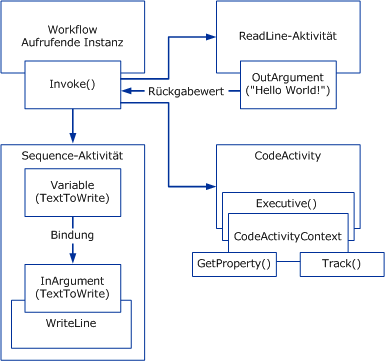

# Übersicht über Windows-Workflow
Ein Workflow ist eine Reihe von elementaren Einheiten mit dem Namen *Aktivitäten* , die als Modell, das einen realen Vorgang beschreibt gespeichert sind. Mit Workflows können die Reihenfolge der Ausführung sowie abhängige Beziehungen zwischen kurz- und langfristiger Arbeit beschrieben werden. Diese Arbeit durchläuft das Modell vom Anfang bis zum Ende, und Aktivitäten werden unter Umständen von Personen oder Systemfunktionen ausgeführt.  
  
## Workflow-Laufzeitmodul  
 Jede ausgeführte Workflowinstanz wird von einem prozessinternen Laufzeitmodul erstellt und verwaltet, mit dem der Hostprozess durch eines der folgenden Objekte interagiert:  
  
-   Ein <xref:System.Activities.WorkflowInvoker>-Objekt, der den Workflow wie eine Methode aufruft.  
  
-   Ein <xref:System.Activities.WorkflowApplication>-Objekt für die explizite Kontrolle über die Ausführung einer einzelnen Workflowinstanz.  
  
-   Ein <xref:System.ServiceModel.WorkflowServiceHost>-Objekt für meldungsbasierte Interaktionen in Szenarien mit mehreren Instanzen.  
  
 Jede dieser Klassen umschließt die Kernaktivitätslaufzeit, die als <xref:System.Activities.ActivityInstance> dargestellt wird und für die Aktivitätsausführung zuständig ist. Es kann mehrere <xref:System.Activities.ActivityInstance>-Objekte innerhalb einer Anwendungsdomäne geben, die gleichzeitig ausgeführt werden.  
  
 Jede der vorausgehenden drei Hostinteraktionsobjekte wird aus einer Aktivitätsstruktur erstellt, die als Workflowprogramm bezeichnet wird. Mithilfe dieser Typen oder einen benutzerdefinierten Host, der umschließt <xref:System.Activities.ActivityInstance>, Workflows ausgeführt werden können, in einem beliebigen Windows-Prozess einschließlich konsolenanwendungen, formularbasierten Anwendungen, Windows-Diensten, [!INCLUDE[vstecasp](../../../includes/vstecasp-md.md)] Web Sites und Windows Communication Foundation ( WCF)-Dienste.  
  
   
Workflowkomponenten im Hostprozess  
  
## Interaktion zwischen Workflowkomponenten  
 Im folgenden Diagramm wird dargestellt, wie Workflowkomponenten miteinander interagieren.  
  
   
  
 Im vorangehenden Diagramm wird die <xref:System.Activities.WorkflowInvoker.Invoke%2A>-Methode der <xref:System.Activities.WorkflowInvoker>-Klasse verwendet, um mehrere Instanzen eines Workflows aufzurufen. <xref:System.Activities.WorkflowInvoker> wird für einfache Workflows verwendet, die keine Verwaltung durch den Host benötigen. Workflows, die eine Verwaltung durch den Host erfordern (z. B. eine <xref:System.Activities.Bookmark>-Wiederaufnahme), müssen stattdessen mithilfe von <xref:System.Activities.WorkflowApplication.Run%2A> ausgeführt werden. Es ist nicht erforderlich, auf den Abschluss einer Workflowinstanz zu warten, bevor ein weiterer Workflow aufgerufen wird. Das Laufzeitmodul unterstützt die Ausführung mehrerer Workflowinstanzen gleichzeitig.  Die aufgerufenen Workflows sind:  
  
-   Eine <xref:System.Activities.Statements.Sequence>-Aktivität, die eine untergeordnete <xref:System.Activities.Statements.WriteLine>-Aktivität enthält. <xref:System.Activities.Variable> der übergeordneten Aktivität wird an <xref:System.Activities.InArgument> der untergeordneten Aktivität gebunden. Weitere Informationen zu Variablen, Argumenten und Bindung finden Sie unter [Variablen und Argumente](../../../docs/framework/windows-workflow-foundation/variables-and-arguments.md).  
  
-   Eine benutzerdefinierte Aktivität mit dem Namen `ReadLine`. Ein <xref:System.Activities.OutArgument> der `ReadLine`-Aktivität wird an die aufrufende <xref:System.Activities.WorkflowInvoker.Invoke%2A>-Methode zurückgegeben.  
  
-   Eine benutzerdefinierte Aktivität, die von der abstrakten <xref:System.Activities.CodeActivity>-Klasse abgeleitet wird. <xref:System.Activities.CodeActivity> kann auf Laufzeitfunktionen (z. B. Nachverfolgung und Eigenschaften) mit dem <xref:System.Activities.CodeActivityContext> zugreifen, der als Parameter über die <xref:System.Activities.CodeActivity.Execute%2A>-Methode verfügbar ist. Weitere Informationen über diese Laufzeitfunktionen finden Sie unter [nachverfolgung und Ablaufverfolgung für Workflows](../../../docs/framework/windows-workflow-foundation/workflow-tracking-and-tracing.md) und [Eigenschaften der Workflowausführung](../../../docs/framework/windows-workflow-foundation/workflow-execution-properties.md).  
  
## Siehe auch  
 [BizTalk Server 2006 oder WF? Auswählen des richtigen Workflowtools für Ihr Projekt](https://go.microsoft.com/fwlink/?LinkId=154901)
