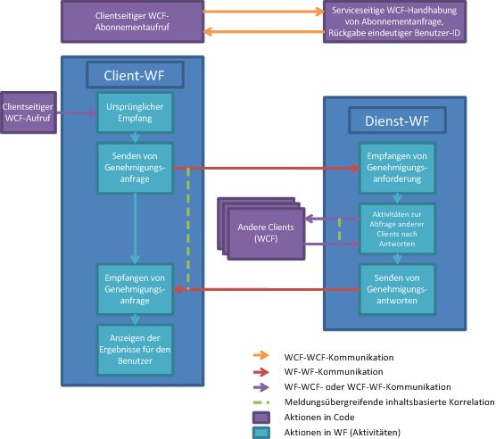

# Dokumentgenehmigungsprozess
In diesem Beispiel wird die gemeinsame Verwendung zahlreicher Funktionen von [!INCLUDE[wf](../../../../includes/wf-md.md)] und [!INCLUDE[indigo1](../../../../includes/indigo1-md.md)] veranschaulicht.Zusammen implementieren sie ein Szenario für einen Dokumentgenehmigungsprozess.Eine Clientanwendung kann Dokumente zur Genehmigung senden und Dokumente genehmigen.Es ist eine Genehmigungs\-Manager\-Anwendung vorhanden, um die Kommunikation zwischen Clients zu unterstützen und die Regeln für den Genehmigungsprozess umzusetzen.Der Genehmigungsprozess ist ein Workflow, der mehrere Genehmigungsarten ausführen kann.Es sind Aktivitäten vorhanden, mit denen ein Einzelgenehmigungsprozess, ein Quorumgenehmigungsprozess \(Prozentsatz aller Genehmiger\) und ein komplexer Genehmigungsprozess, der aus einer Abfolge einer Quorumgenehmigung und einer Einzelgenehmigung besteht, abgerufen werden.  
  
> [!IMPORTANT]
>  Die Beispiele sind möglicherweise bereits auf dem Computer installiert.Überprüfen Sie das folgende \(standardmäßige\) Verzeichnis, bevor Sie fortfahren.  
>   
>  `<Installationslaufwerk>:\WF_WCF_Samples`  
>   
>  Wenn dieses Verzeichnis nicht vorhanden ist, rufen Sie [Windows Communication Foundation \(WCF\) and Windows Workflow Foundation \(WF\) Samples for .NET Framework 4](http://go.microsoft.com/fwlink/?LinkId=150780) auf, um alle [!INCLUDE[indigo1](../../../../includes/indigo1-md.md)]\- und [!INCLUDE[wf1](../../../../includes/wf1-md.md)]\-Beispiele herunterzuladen.Dieses Beispiel befindet sich im folgenden Verzeichnis.  
>   
>  `<InstallDrive>:\WF_WCF_Samples\WF\Application\DocumentApprovalProcess`  
  
## Beispieldetails  
 Das folgende Diagramm veranschaulicht den Workflow des Dokumentgenehmigungsprozesses.  
  
   
  
 Aus Sicht des Clients funktioniert der Genehmigungsprozess wie folgt:  
  
1.  Ein Client wird ein Benutzer im Genehmigungsprozesssystem.  
  
2.  Ein [!INCLUDE[indigo2](../../../../includes/indigo2-md.md)]\-Client sendet an einen von der Genehmigungs\-Manager\-Anwendung gehosteten [!INCLUDE[indigo2](../../../../includes/indigo2-md.md)]\-Dienst.  
  
3.  Dem Client wird eine eindeutige Benutzer\-ID zurückgegeben.Der Client kann jetzt an Genehmigungsprozessen teilnehmen.  
  
4.  Sobald der Client teilnimmt, kann er ein Dokument zur Genehmigung durch den Einzelgenehmigungs\-, Quorumgenehmigungs\- oder komplexen Genehmigungsprozess senden.  
  
5.  Durch Klicken auf eine Schaltfläche in der Clientoberfläche wird eine Workflowinstanz in einem Workflowdiensthost gestartet.  
  
6.  Der Workflow sendet eine Genehmigungsanforderung an die Genehmigungs\-Manager\-Anwendung.  
  
7.  Der Workflow\-Manager startet seinerseits einen Workflow, der einen Genehmigungsprozess darstellt.  
  
8.  Sobald der Manager\-Genehmigungsworkflow ausgeführt wird, werden die Ergebnisse an den Client zurückgesendet.  
  
9. Der Client zeigt die Ergebnisse an.  
  
10. Ein Client kann eine Genehmigungsanforderung empfangen und zu jedem Zeitpunkt auf die Anforderung antworten.  
  
11. Ein auf dem Client gehosteter [!INCLUDE[indigo2](../../../../includes/indigo2-md.md)]\-Dienst kann eine Genehmigungsanforderung von der Genehmigungs\-Manager\-Anwendung empfangen.  
  
12. Die Dokumentinformationen werden zur Überprüfung auf dem Client dargestellt.  
  
13. Der Benutzer kann das Dokument genehmigen oder ablehnen.  
  
14. Ein [!INCLUDE[indigo2](../../../../includes/indigo2-md.md)]\-Client wird verwendet, um eine Genehmigungsantwort an die Genehmigungs\-Manager\-Anwendung zurückzusenden.  
  
 Aus Sicht der Genehmigungs\-Manager\-Anwendung funktioniert der Genehmigungsprozess wie folgt:  
  
1.  Ein Client fordert an, am Genehmigungsprozesssystem teilzunehmen.  
  
2.  Ein [!INCLUDE[indigo2](../../../../includes/indigo2-md.md)]\-Dienst des Genehmigungs\-Managers empfängt eine Anforderung, Teil des Genehmigungsprozesssystems zu werden.  
  
3.  Für den Client wird eine eindeutige ID generiert.Die Benutzerinformationen werden in einer Datenbank gespeichert.  
  
4.  Die eindeutige ID wird an den Benutzer zurückgesendet.  
  
5.  Es wird eine Genehmigungsanforderung empfangen.Der Genehmigungs\-Manager führt einen Genehmigungsprozess aus.  
  
6.  Der Genehmigungs\-Manager empfängt eine Genehmigungsanforderung, wodurch ein neuer Workflow gestartet wird.  
  
7.  Abhängig vom Typ der Anforderung \(einfach, Quorum oder komplex\) wird eine andere Aktivität ausgeführt.  
  
8.  Zum Senden der Genehmigungsanforderung an den Client zur Überprüfung und zum Empfangen der Antwort werden Sende\- und Empfangsaktivitäten mit Korrelation verwendet.  
  
9. Das Ergebnis des Genehmigungsprozessworkflows wird an den Client gesendet.  
  
## Verwenden des Beispiels  
  
##### So richten Sie die Datenbank ein  
  
1.  Navigieren Sie von einer [!INCLUDE[vs2010](../../../../includes/vs2010-md.md)]\-Eingabeaufforderung, die mit Administratorrechten geöffnet wurde, zu diesem Ordner "DocumentApprovalProcess", und führen Sie "Setup.cmd" aus.  
  
##### So richten Sie die Anwendung ein  
  
1.  Öffnen Sie mit [!INCLUDE[vs2010](../../../../includes/vs2010-md.md)] die DocumentApprovalProcess.sln\-Projektmappendatei.  
  
2.  Drücken Sie STRG\+UMSCHALT\+B, um die Projektmappe zu erstellen.  
  
3.  Um die Projektmappe auszuführen, starten Sie die Genehmigungs\-Manager\-Anwendung, indem Sie mit der rechten Maustaste auf das ApprovalManager\-Projekt im **Projektmappen\-Explorer** klicken und dann im Kontextmenü **Debuggen**\-\>**Neue Instanz starten** wählen.  
  
     Warten Sie auf die Bestätigung des Managers, dass dieser bereit ist.  
  
##### So führen Sie das Einzelgenehmigungsszenario aus  
  
1.  Öffnen Sie eine Eingabeaufforderung mit Administratorberechtigungen.  
  
2.  Navigieren Sie zum Verzeichnis, das die Projektmappe enthält.  
  
3.  Navigieren Sie zum Ordner ApprovalClient\\Bin\\Debug, und führen Sie zwei Instanzen von ApprovalClient.exe aus.  
  
4.  Klicken Sie auf **Ermitteln**, und warten Sie, bis die Schaltfläche **Abonnieren** aktiviert wird.  
  
5.  Geben Sie einen Benutzernamen ein, und klicken Sie auf **Abonnieren**.Verwenden Sie für einen Client `UserType1` und für den anderen den Typ `UserType2`.  
  
6.  Wählen Sie im `UserType1`\-Client den Einzelgenehmigungstyp im Dropdownmenü aus, und geben Sie einen Dokumentnamen und \-inhalt ein.Klicken Sie auf **Genehmigung anfordern**.  
  
7.  Im `UserType2`\-Client wird ein Dokument, das auf Genehmigung wartet, angezeigt.Wählen Sie es aus, und klicken Sie auf **Genehmigen** oder **Ablehnen**.Die Ergebnisse werden im `UserType1`\-Client angezeigt.  
  
##### So führen Sie das Quorumgenehmigungsszenario aus  
  
1.  Öffnen Sie eine Eingabeaufforderung mit Administratorberechtigungen.  
  
2.  Navigieren Sie zum Verzeichnis, das die Projektmappe enthält.  
  
3.  Navigieren Sie zum Ordner ApprovalClient\\Bin\\Debug, und führen Sie drei Instanzen von ApprovalClient.exe aus.  
  
4.  Klicken Sie auf **Ermitteln**, und warten Sie, bis die Schaltfläche **Abonnieren** aktiviert wird.  
  
5.  Geben Sie einen Benutzernamen ein, und klicken Sie auf **Abonnieren**.Verwenden Sie für einen Client `UserType1` und für die anderen den Typ `UserType2`.  
  
6.  Wählen Sie im `UserType1`\-Client den Quorumgenehmigungstyp im Dropdownmenü aus, und geben Sie einen Dokumentnamen und \-inhalt ein.Klicken Sie auf **Genehmigung anfordern**.Hierdurch wird angefordert, dass die beiden `UserType2`\-Clients das Dokument genehmigen oder ablehnen.Während beide `UserType2`\-Clients antworten müssen, muss nur ein Client das Dokument genehmigen, damit es genehmigt wird.  
  
7.  In den `UserType2`\-Clients wird ein Dokument, das auf Genehmigung wartet, angezeigt.Wählen Sie es aus, und klicken Sie auf **Genehmigen** oder **Ablehnen**.Die Ergebnisse werden im `UserType1`\-Client angezeigt.  
  
##### So führen Sie das komplexe Genehmigungsszenario aus  
  
1.  Öffnen Sie eine Eingabeaufforderung mit Administratorberechtigungen.  
  
2.  Navigieren Sie zum Verzeichnis, das die Projektmappe enthält.  
  
3.  Navigieren Sie zum Ordner ApprovalClient\\Bin\\Debug, und führen Sie vier Instanzen von ApprovalClient.exe aus.  
  
4.  Klicken Sie auf **Ermitteln**, und warten Sie, bis die Schaltfläche **Abonnieren** aktiviert wird.  
  
5.  Geben Sie einen Benutzernamen ein, und klicken Sie auf **Abonnieren**.Verwenden Sie für einen Client `UserType1`, für zwei Clients `UserType2` und für den vierten Client `UserType3`.  
  
6.  Wählen Sie im `UserType1`\-Client den Einzelgenehmigungstyp im Dropdownmenü aus, und geben Sie einen Dokumentnamen und \-inhalt ein.Klicken Sie auf **Genehmigung anfordern**.  
  
7.  In den `UserType2`\-Clients wird ein Dokument, das auf Genehmigung wartet, angezeigt.Wählen Sie es aus, und klicken Sie auf **Genehmigen**, worauf das Dokument an den `UserType3`\-Client übergeben wird.  
  
     Wenn das Dokument vom ersten `UserType2`\-Quorum genehmigt wird, wird das Dokument an den `UserType3`\-Client übergeben.  
  
8.  Genehmigen Sie das Dokument im `UserType3`\-Client, oder lehnen Sie es ab.Die Ergebnisse werden im `UserType1`\-Client angezeigt.  
  
##### So führen Sie eine Bereinigung durch  
  
1.  Navigieren Sie von einer [!INCLUDE[vs2010](../../../../includes/vs2010-md.md)]\-Eingabeaufforderung aus zum Ordner DocumentApprovalProcess, und führen Sie Cleanup.cmd aus.  
  
## Siehe auch